# 汇编语言

## 基础知识

### 关于汇编

- 只有0和1组合而成的语言，称为机器语言；
- 机器语言特点：
  - 因为是以逻辑状态0和1直接命令，不需要翻译直接执行，速度快；
  - 不同的处理器，使用不同的机器语言，可移植性差；
  - 只有0和1变化组合，难学、难懂、难以维护。
- 汇编语言：以英文字母、数字符号来描述机器语言，使之成为有意义的语言，这种语言就称之为汇编语言；
- 机器指令能被计算机直接识别，汇编指令需要通过编译器转变为机器指令；
- 汇编指令和机器指令的差别在于指令的表示方法不同：汇编指令是相较于机器指令更便于记忆的书写格式；
- 在不同的设备中，机器语言指令集不同。

### 计算机中的进制

- 进制：是一种逢几进一的运算。N进制就是逢N进1，最小值为0，最大值为N-1
- 计算机中常见的进制：
  - 二进制（B）：0，1
  - 十进制（D）：0，1，2，3，4，5，6，7，8，9
  - 十六进制（H）：0，1，2，3，4，5，6，7，8，9，A，B，C，D，E，F
- 进制间的转换
  - 十进制转二进制：除2取余法，即十进制数除2，余数为权位上的数，得到的商值继续除
  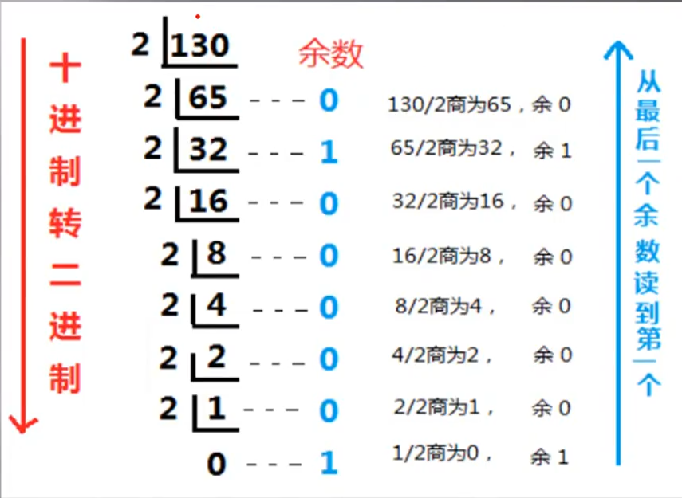
  - 二进制转十进制：吧二进制数按权展开、相加即得十进制数，其实就是将每位得二进制数1或0乘2^n
  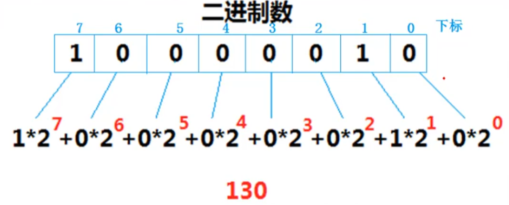
  - 二进制转十六进制：4位二进制数按权展开相加得到1位十六进制数（注意：4位二进制转成十六进制是从右到左开始转换，不足时补0
  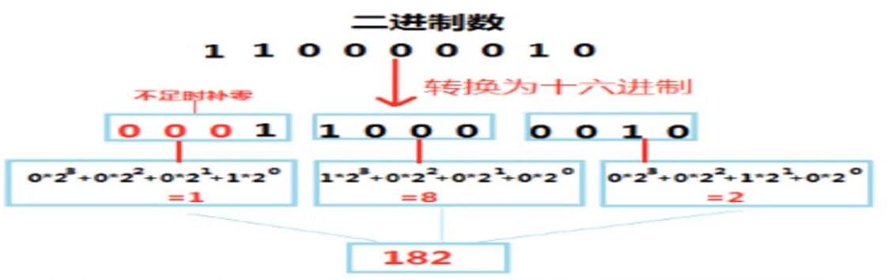

### 存储器、CPU

计算机工作流程
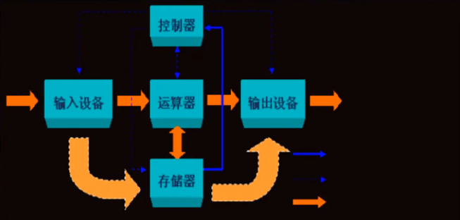

#### 存储器

用于存储数据并在需要时提供数据

- 外部存储器：硬盘、光盘等等
- 内部存取器：
  - RAM：内存条
  - ROM：BIOS芯片

##### 存储单位

- 计算机中最小得信息单位是比特（bit），也就是一个二进制位；
- 计算机中存储数据得最小单位是B字节（Byte）；
- 8个bit组成一个B，即一个字节；
- 字节的单位换算（B=Byte）：
  - 1024B = 1KB
  - 1024KB = 1MB
  - 1024MB = 1GB
  - 1024GB = 1 TB

##### 存储单元

- 存储器被划分成了若干个存储单元，一个存储单元可以存储一个字节，也即是8个二进制位，每个存储单元是从0开始编号；
- 对于一个有128个存储单元的存储器：
  - 容量为128字节；
  - 编号是从0-127。
    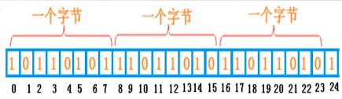
- 每个单元由两部分构成：
  - 存储单元的地址，一般用十六进制表示；
  - 存储单元的内容，一般用十六进制表示。
    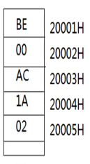

#### CPU

- CPU:
  - 运算器 ：对数据进行各种算术运算和逻辑运算，即对数据进行加工处理
  - 控制器：完成协调和指挥整个计算机系统的操作
  - CPU读取存储器内容
    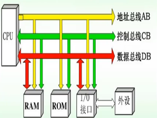

##### CPU对存储器的读写

- CPU对存储器的读写是通过三种总线来完成的，地址总线，数据总线和控制总线
    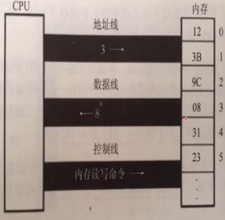
- 总线宽度与CPU性能
  - 地址总线的宽度决定CPU的寻址能力；
  - 数据总线的宽度决定了CPU与其他器件进行数据传送时的一次数据传送量；
  - 控制总线宽度决定了CPU对系统中其他器件的控制能力。

###### 地址总线

- 一个CPU有N根地址线，则可以说这个CPU的地址总线的宽度为N。这样CPU最多可以寻找2的N次方个内存单元（字节）
- 示例：8080、8088、8086、80286、80386是16根、20根、20根、24根、32根，则他们的寻址能力分别为64KB、1MB、1MB、16MB、4GB；

###### 数据总线

- 数据总线：一根数据总线可以传输一个0或1，即1bit
- 示例：8080、8088、8086、80286、80386的数据总线分别为8根、8根、16根、16根、32根，则他们可以一次传送的数据为：1B、1B、2B、2B、4B

## 寄存器

### 寄存器简介

程序的运行流程
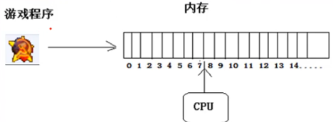
    - 程序加载到内存中；
    - CPU程序即将执行指令位置（cs：ip），并执行游戏程序

#### 什么是寄存器

- 寄存器是CPU内部的组成部分。有限存储容量的高速存储部件，它们可用来暂存指令、数据和地址。
  - 存在于cpu中；
  - 用于存储数据；
  - 速度快；
  - 数量有限；
    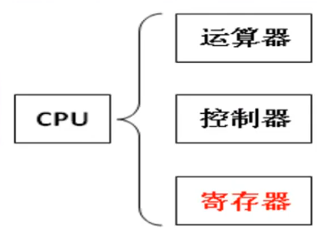

#### 寄存器简介（一）

- 一个二进制数=1位；8位=1字节；2字节=1字；
- 9086CPU含有14个寄存器，所有的寄存器都是16位的，可以存放两个字节，即存放一个字；
- 90386CPU含有16个寄存器，所有的寄存器都是32位的，可以存放四个字节，即存放两个字。

#### 寄存器简介（二）

- 16位CPU所含有的寄存器有（共14个）：
  - 4个数据寄存器（AX、BX、CX、和DX）
  - 2个变址寄存器（SI和DI）2个指针寄存器（SP和BP）
  - 4个段寄存器（ES、CS、SS、DS）
  - 1个指令指针寄存器（IP）和1个标志寄存器（Flags）
- 32位CPU所含有的寄存器有（共16个）：
  - 4个数据寄存器（EAX、EBX、ECX、和EDX）
  - 2个变址寄存器（ESI和EDI）2个指针寄存器（ESP和EBP）
  - 6个段寄存器（ES、CS、SS、DS、FS、GS）
  - 1个指令指针寄存器（EIP）和1个标志寄存器（EFlags）

>说明：
>
> - 32位和16位的区别在于数据寄存器、变址寄存器和指令寄存器前是否有字母E；
> - 数据寄存器中的累加寄存器：
>   - 16——AX
>   - 32——EAX
>   - 64——RAX

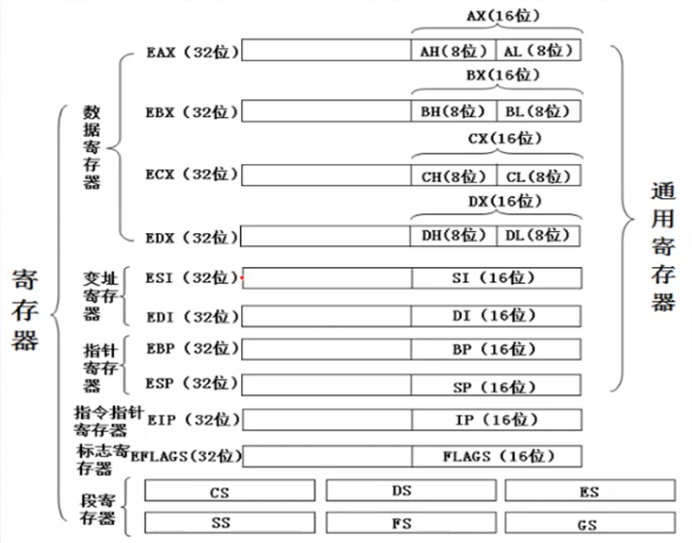
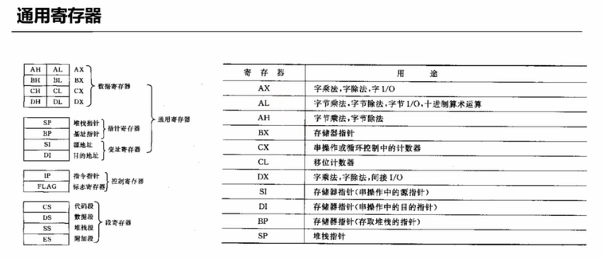
    通用寄存器：通用寄存器可用于传送和暂存数据，也可参与算术逻辑运算，并保存运算结果。

#### 数据寄存器（8086--16位）

- 数据寄存器：主要用来保存操作数和运算结果等信息；
- 数据寄存器有AX、BX、CX、DX四个组成；
- 由于8086之前的CPU为8位CPU，为了兼容以前的8位程序，在8086CPU中每一个数据寄存器都可以当做两个单独的寄存器来使用，因此，每一个16位寄存器可以当作2个独立的8位寄存器来使用
- AX可以分为AH和AL；
- BX可以分为BH和BL;
- CX可以分为CH和CL；
- DX可以分为DH和DL；

>注意：除了上述4个数据寄存器以外，其他寄存器均不可以分为两个独立的8位寄存器。
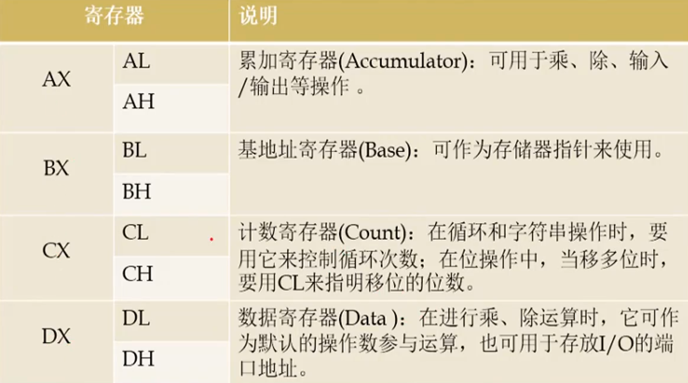

- 示例：16位寄存器AX，可以表示成两个8位寄存器。其中AH表示高位的8位寄存器，AL表示低位的8位寄存器。
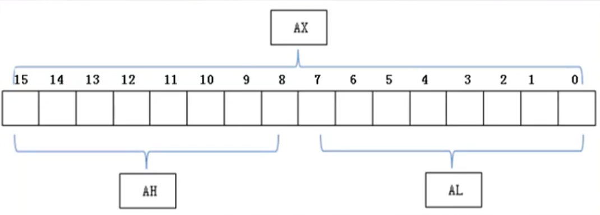

- 16位寄存器及分成8位寄存器后的数据存储情况
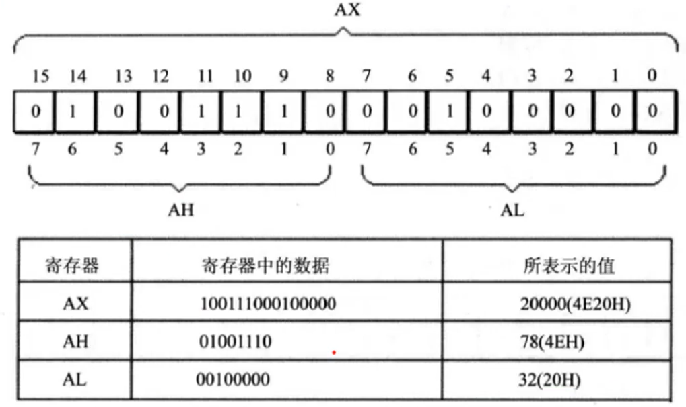

> 注意：
>
> - 在16位CPU中，AX、BX、CX、DX不能存放存储单元的地址；
> - 在32位CPU中，其32位寄存器EAX、EBX、ECX、EDX不仅可以用来传送数据、暂存数据保存算数逻辑运算结果，而且可以作为指针寄存器，所以，32位寄存器更具通用性。

### 简单汇编指令

汇编指令    |控制CPU完成的操作  |用高级语法描述
--|---|---
mov ax,18|将18送入寄存器AX|AX=18
mov ah,78|将78送入寄存器AH|AH=78
add ax,8|将寄存器AX中的数值加上8|AX+=8
mov ax，bx|将寄存器BX中的数据送入寄存器AX|AX=BX
add ax，bx|将AX和BX中的数值相加，结果存在AX中|AX+=BX

### CS：IP

#### 物理地址

- 通常文件中至少含有两个段：
  - 代码段：存储程序的指令
    - 一般可读、不可写、可执行
  - 数据段：存储程序中要用到的数据
    - 一般可读、可写、可执行
- 物理地址=基础地址+偏移地址
- 基础地址=段地址x10H
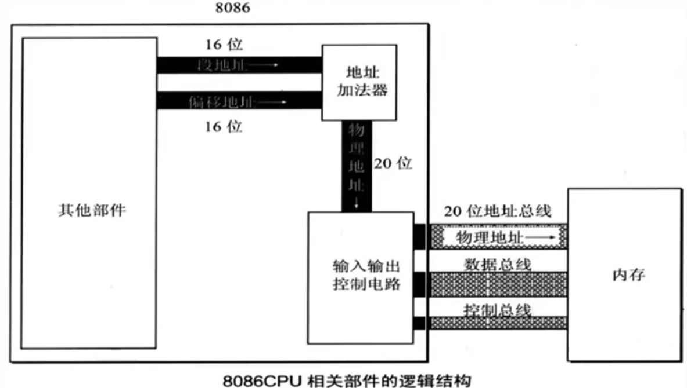
- 示例：
  - 物理地址=段地址x10H+偏移地址（200Hx10H+1F60H=21F60H）
    段地址    |偏移地址   |物理地址
    --|---|---
    2000H|1F60H|21F60H
    2100H|0F60H|21F60H
    21F6H|0000H|21F60H
    21F0H|0060H|21F60H
    1F00H|2F60H|21F60H
  - 结论：CPU可以用不同的段地址和偏移地址形成同一个物理地址

#### 段寄存器

- 8086CPU有四个段寄存器：
  - CS：代码段寄存器（Code Segment）
  - DS：数据段寄存器（Data Segment）
  - SS：栈段寄存器（Stack Segment）
  - ES：附加段寄存器（Extra Segment）
- 8086中，任意时刻，CPU将CS：IP指向的内容作为即将执行的指令
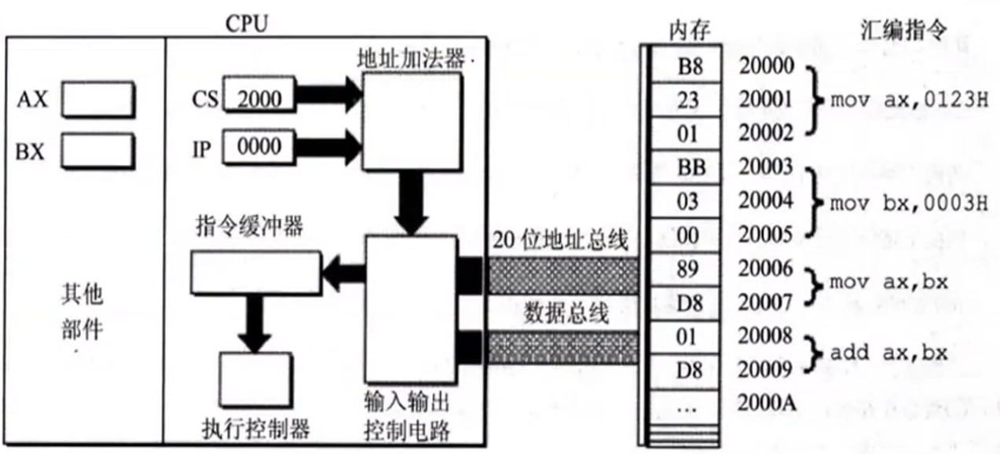

#### 修改CS：IP

- CPU是由CS：IP中的内容决定执行命令
- 修改：
  - 同时修改CS：IP的内容
    - jmp 段地址：偏移地址
    - 如： jmp 2AE3：3 -->从2AE33H处读取指令
  - 修改IP的内容
    - jmp 莫一合法寄存器
    - 如： jmp bx
      - 指令执行前：BX=0B16H，CS=2000H，IP=0003H
      - 指令执行后：BX=0B16H，CS=2000H，IP=0B16H
      - jmp bx，在含意上好似：mov IP，bx

## windows下汇编工具--debug使用

### windows下汇编工具--debug

- 配置DOSBox操作目录
  - 打开安装目录下的`Options.bat`批处理文件（双击文件打开）；
  - 在文档中找到`[autoexec]`选项；
  - 添加如下字段：
    > `[autoexec]`
    > `#` Lines in this section will be run at startup.
    > `#` You can put you MOUNT lines here.
    > MOUNT C D:\TOOLS\AL\masm
    > set PATH=$PATH$;D:\TOOLS\AL\masm
  - 手动设置：启动dosbox后，手动输入`MOUNT C D:\TOOLS\AL\masm`
- debug
  - debug简介：
    - debug是Dos、Windows提供的实模式（8086方式）程序的调试工具。
  - debug功能
    - 可以查看CPU各种寄存器的内容；
    - 可以查看内存的情况；
    - 可以在机器码级别跟踪程序的运行。
- debug常用操作：
  - R：查看更改cpu寄存器的内容；
  - D：查看内存中的内容；
  - E: 改写内存中的内容；
  - U: 将内存中机器指令翻译成汇编指令；
  - T：执行一条机器指令；
  - A: 以汇编格式在内存中写入一条指令。
- 例：
  - 使用R查看内容时，启动debug后，直接输入R即可查看cpu寄存器的内容；
  - 修改内容时，可使用`R AX`,回车后将出现`:`作为输入提示，在后面输入要写入的内容后回车，即可达到修改AX中内容的目的。
  - d查看内容：d 段地址：偏移地址（直接输入d时，查看的是cs：ip的内容）

## 分段管理及标志寄存器

### 分段管理

一个存储单元有一个物理地址，一个物理地址可以对应多个逻辑地址

- 物理地址：
  - 一个内存单元的编号；
  - 每个物理存储单元都有一个20位（20根总线）的编号；
  - 8086CPU物理地址范围：00000~FFFFFH（20个二进制位，5个十六进制位）。
- 逻辑地址：
  - 用户编程时采用逻辑地址，形式为：`段基地址：段内偏移地址`
  - 物理地址：将逻辑地址左移4位（左移n位相当于乘以 ${2^n}$,左移四位即2^4^=16D=10H)，加上偏移地址就得到20位的物理地址
    - 逻辑地址：1230：100 ==》 物理地址： 1230*10h+100（逻辑地址和物理地址都是16进制表示）
- 段寄存器与逻辑段
  - 8086CPU有4个段寄存器，每个段寄存器用来确定一个逻辑段的起始位置，每种逻辑段均有各自的用途：
    寄存器  |功能 |使用
    --|---|---
    CS（代码段）|指明代码的起始地址 |利用CS：IP取得下一条要执行的指令
    SS（堆栈段）|指明堆栈段的起始地址 |利用SS：SP操作堆栈顶的数据
    DS（数据段）|指明数据的起始地址 |利用DS：EA存取数据段中的数据
    ES（附加段）|指明附加段的起始地址 |利用ES：EA存取附加段中的数据
    >注意：没有指明段前缀时，一般的数据访问在DS（数据）段
    >例：
    >`MOV AX,[1000H]; <==> MOV AX,DS:[1000H];`表示从默认的DS段中去除取出数据
    > `MOV AX,CS:[1000H]`表示从指定的CS段取出数据

### 标志寄存器

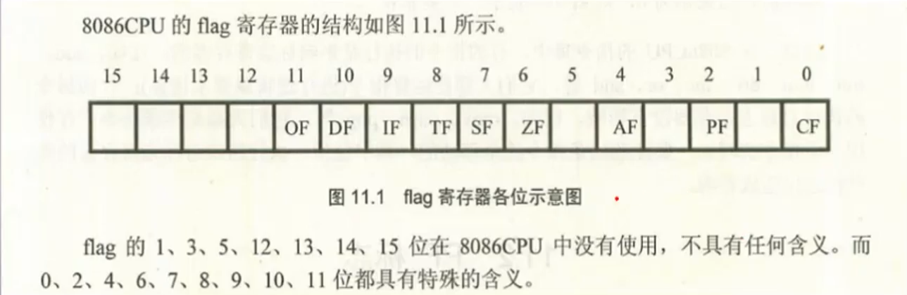

- 各标志寄存器的区别
  标志位  |标志位名称 |`=1` |`=0`
  --|---|---|---
  CF  |进位标志（CarryFlag）  |进位 |无进位
  PF  |奇偶标志（ParityFlag） |偶 |奇
  AF  |辅助进位标志（AuxiliaryCarryFlag） |进位 |无进位
  ZF  |零标志（ZeroFlag） |等于零 |不等于零
  SF  |符号标志（SingFlag） |负 |非负
  TF  |跟踪标志（TraceFlag）  ||
  IF  |中断标志（InterruptFlag）  |允许 |禁止
  DF  |方向标志（DirectionFlag）  |减少 |增加
  OF  |溢出标志（OverflowFlag） |溢出 |未溢出
- 状态标志：用于记录程序运行结果的状态信息，`CF`、`ZF`、`SP`、`PF`、`OF`、`AF`
- 控制标志：用于控制处理器执行指令，`DF`、`IF`、`TF`
- 进位标志CF：
  - 进位标志位，一般情况，进行无符号运算时，它记录运算结果的最高位向更高位的进位值，或从更高位的借位值，如果运算结果的`最高位`产生了一个进位或借位，那么其值为1，否则其值为0。
  - 例：
    - 2C+7C=A8，没有进位：CF=0；
    - C2+C7=（1）89，有进位：CF=1
- 零标志ZF：
  - 零位标志位，它记录相关指令执行后的结果是否为0，如果是0，那么ZF=1，如果结果不为0，那么ZF=0。
  - 例：
    - 2C+7C=A8，结果不为0：ZF=0；
    - 39+C7=（1）00，结果为0（有效位为0）：ZF=1
- 符号标志SF：
  - 符号标志位，它记录相关指令执行后，其结果是否为负（最高位为1），如果结果为负，SF=1，如果非负，SF=0。
  - 例：
    - 2C+7C=A8，二进制（A8）：10101000B，最高位为1：SF=1
    - 39+C7=（1）00，二进制（100）：（1）00000000B，最高位为0：SF=0
- 奇偶标志PF：
  - 奇偶标志位，它记录相关指令执行后，其结果的所有二进制位中1个个数是否为偶数，如果是偶数，PF=1，反之为0。
- 溢出标志OF:
  - 溢出标志位，在进行有符号数运算的时候，如果结果超出了机器所能表示的范围称为溢出，OF的值被置为1，否则OF的值为0。
    >注意：这里所说的溢出，只是对有符号运算而言。
  - 溢出：如果运算结果超出了范围，就产生了溢出，有溢出，说明有符号数的运算结果不正确
  - 说明：通常认为溢出（上溢）就是因为进位时当前存储格式（1B、2B、4B等）的位数（8bit、16bit、32bit）不够而引起的。比如8位寄存器：11111111B+1B=1000000000B超过了8位的1被认为是溢出寄存器，当然也是进位得到的1
  - 溢出与进位：
    - 溢出标志（OF）：表示`有符号数`运算结果是否超出范围，运算结果已经`不正确`；
    - 进位标志（CF）：表示`有符号数`运算结果是否超出范围，运算结果仍然正确；
    - 有符号无符号指的是最高位是否是符号位，即是以补码的形式看待还是以原码的形式看待。
      - CF范围：0~155/0x00~0xFF(8位)、0~65535/0x80~0xFFFF（16位）
      - OF范围：-128~127/0x80~0xEF（8位）、-32768~32767/0x8000~0xEFFF（16位）
      - 例：
        1. 8H+8H：
          1.1 对于singed:(8)+(8)=16,没有超过`[-128，127]`的范围，OF为0；
          1.2 对于unsinged：(8)+(8)=19，没有超过`[0，255]`的范围，CF为0。
        2. 80H+81H：
          2.1 对于singed:(-128)+(-127)=-255,有超过`[-128，127]`的范围，OF为1；
          2.2 对于unsinged：(128)+(129)=257，有超过`[0，255]`的范围，CF为1。
        3. FCH+05H：
          3.1 对于singed:(-4)+(5)=1,没有超过`[-128，127]`的范围，OF为0；
          3.2 对于unsinged：(252)+(5)=257，超过`[0，255]`的范围，CF为1。
- 辅助进位标志AF
  - 运算时D~3~(di3半字节)有进位或借位时，AF=1；
  - 例：
    - 33H+78H=ABH，低四位为3，加上低四位为8，进位为0，即：AF=0；
    - 39H+78H=B1H，低四位为9，加上低四位为1，进位为1，即：AF=1。
- 方向标志DF：
  - 用于传操作指令中，控制地址的变化方向：
    - 设置DF为1，存储器地址自动增加；
    - 设置DF为0，存储器地址自动减少。
  - 例：
    - CLD指令用于复位方向标志，执行后DF=0；
    - STD指令用于置位方向位，执行后DF=1。
- 中断允许标志IF：
  - 中断允许标志位，用来决定CPU是否响应CPU外部的可屏蔽中断发出的中断请求，但不管该标志为何值，CPU都必须响应CPU外部的不可屏蔽中断所发出的中断请求，以及CPU内部产生的中断请求。
  - 当IF=1时，CPU可以响应CPU外部的可屏蔽中断发出的中断请求（允许中断）。
  - 当IF=0时，CPU不响应CPU外部的可屏蔽中断发出的中断请求（禁止中断）。
  - CPU的指令系统中也有专门的指令来改变标志位IF的值：
    - CLI指令用于复位中断标志，执行后IF=0；
    - STI指令用于置位中断标志，执行后IF-1。
- 追踪标志TF：
  - 追踪标志位，当追踪标志被置为1时，CPU进入单步执行方式，即每执行一条指令产生一个单步中断请求，这中方式主要用于程序的调试。
  - 设置TF为0，处理器正常工作；
  - 设置TF为1，处理器单步执行指令。
  - 单步执行指令：处理器在每条指令执行结束时，产生一个编号为1的内部中断。

## 指令及寻址方式

### 指令简介

一般来说指令是由两部分组成，即操作码和操作数：

- 操作码： 给出该指令应完成何种操作
- 操作数： 用来描述该指令的操作对象

在指令中操作码是不可缺少的，但操作数可以没有，也可以有一个操作数或两个操作数，指令格式可以分为以下几种：

1. 零操作数指令
  指令格式中没有操作数或操作数是`隐含约定`的。
2. 一操作数指令
  指令格式中有一个操作数，或还有一个隐含的操作数（实际上是双操作数）。
3. 二操作数指令
  指令中有两个操作数，其中一个为目的操作数，另一个为源操作数。

即，操作数分为`源操作数`和`目的操作数`

- 源操作数：只能读取的操作数。
- 目的操作数：既可读取又可写入（存放操作结果）的操作数
  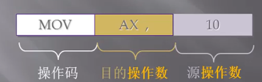

### 七种寻址方式

寻址方式：指令中指明`操作数`存放位置的表达
指令中进行操作数的数据存放位置有三种情况：

1. 存放在指令中（立即数）
    - 操作数包含在指令中，即被操作数数据直接表示在指令的操作数字段中，也即是说紧跟在操作码之后。
    - 例如：
      - MOV AL，10H
      - 这种操作数据被称为立即数。
2. 存放在寄存器中（寄存器操作数）
    - 数据存放在CPU的一个寄存器中。
    - 例如：
      - INC CX
      - 上述指令表示CX中的数据自增。
3. 存放在存储器中（存储器操作数）
    - 数据在内存中或在I/O端口中，存放数据的`偏移地址`以某种方式表示在指令中。
    - 例如：
      - `MOV AX,[2500H]`
      - 其中`[2500H]`为存储器操作数，存储器操作数中操作数字段指示此操作数的偏移地址，而段地址由某个段寄存器来提供，默认为数据段寄存器DS。

寻址方式：
段超越：
    - 操作数允许存放在其他段中（ES，SS），此时应该在指令中指明`段超越`;
    - 段超越：
      - 若操作数不在指令默认的段中，而在其他某个段中，则需要在指令中加以表示，这种情况称为段超越。
    - 例：
      - 直接寻址方式中操作数在附加段中，则应表示为：`MOV AL,ES:[1064H]`;

1. 立即数寻址方式：
    - 操作数为立即数，直接存放在指令的操作数字段中；
    - 立即数寻址时，只允许`源操作数为立即数，目标操作数必须时寄存器或存储器`，其作用是给寄存器或存储单元赋值。
    - 在汇编中，立即数不能作为指令中的第一操作数即目的操作数。
2. 寄存器寻址方式：
    - 操作数在指令所指示的寄存器中；
    - 表示格式：直接在指令中写出寄存器名称，如 INC BX； MOV AX，CX；
3. 存储器寻址方式：
3.1 直接寻址方式：
    - 操作数存在于内存中，操作数的偏移地址直接表示在指令中；
    - 表示格式：`[偏移地址]`
    - 默认操作数存放在内存的数据段中，例如：`MOV AL,[1064H]`数据段的地址乘以10H加上偏移地址1064H后的内存空间的数据赋值到AL。
3.2 寄存器间接寻址方式：
    - 操作数存在存储器中，操作数的`偏移地址`在BX、SI、DI和BP的某个寄存器中；
    - 若以BX、SI、DI作为间接寻址寄存器，则默认操作数存放在数据段中，用DS寄存器中的内容作为地址；
    - 若以BP作为间接寻址寄存器，则默认操作数存放在堆栈中，用SS寄存器中的内容作为地址；
    - 例：`MOV AX,[SI]`将DS：SI对应的内存单元的数据赋值给AX。`MOV [BX],AL`将AL的值写入到DS：BX对应的内存单元上。
3.3 寄存器相对寻址方式：
    - 操作数在存储器中，操作数的有效地址是一个`基址寄存器（BX、BP）或变址寄存器（SI、DI）`的内容加上指令中给定的8位或16位位移量之和。
    - 如果SI、DI或BX中的内容作为有效地址的一部分，那么引用的段寄存器是DS；如果BP中的内容作为有效地址的一部分，那么引用的段寄存器是SS；
      - `MOV BX,[BP-4]`，源操作数采用寄存器相对寻址方式，引用的段寄存器是DS,表示`DS：BP-4`对应的内存单元的值赋给BX；
      - `MOV ES:[BX+5],AL`,目的操作数采用寄存器相对寻址，引用的段寄存器是ES，表示将AL中的数据写入到`ES:[BX+5]`对应的内存单元中。
3.4 基址加变址寻址方式：
    - 在基址加变址寻址方式中，通常把BX和BP看作是基址寄存器，把SI和DI看作是变址寄存器，可把两种方式组合起来形成一种新的寻址方式。基址加变址的寻址方式是把一个基址寄存器BX或BP的内容，加上变址寄存器SI或DI的内容，并以一个段寄存器作为地址基址准，作为操作数的地址。
    - 例：`MOV AL,[BP][SI]`BP对应的是SS段寄存器，表示将`SS：BP+SI`对应的内存单元的数据赋给AL。
3.5 相对基址变址寻址方式：
    - 在相对基址变址寻址方式中，通常将BX和BP看作是基址寄存器，把SI和DI看作是变址寄存器。它是把一个基址寄存器BX或BP的内容，加上变址寄存器SI或DI的内容，再加上指令中给定的8位或16位位移量，并以一个段寄存器作为基址准，作为操作数的地址。
    - 当基址寄存器位BX时，段寄存器使用DS；
    - 当基址寄存器为BP时，段寄存器则用SS；
    - 例：`MOV [BX+DI+1234H],AL;`表示将AL中的数据写入到`DS：BX+DI+1234H`对应的内存单元中。

## 常见的汇编指令

### 数据传输指令

- 通用传送指令：
    1. 基本传送指令（MOV）
        - 指令格式：MOV DST，SRC；
        - 源操作数和目的操作数可用上文6种寻址方式的任何一种；
        - 操作：将SRC的内容赋给DST；
        - 所有通用传送指令都不影响标志位；
        - 注意：不能用MOV指令实现以下传送
          - 存储器操作数之间不能直接传送：如`MOV [1000H],[DI]`(错误)，改为`MOV AX,[DI]  MOV [1000H],AX`
          - 立即数不能直接送段寄存器：如`MOV DS,2000H`(错误)，改为`MOV AX,2000H   MOV DS,AX`
          - 段寄存器之间不能直接传送：如`MOV ES,DS`(错误)，改为`MOV AX,DS  MOV ES,AX`
          - CS只可作为源操作数：如`MOV CS,AX`(错误)，改为`MOV AX,CS`,CS中存放要执行的下一指令的位置，只能读取其中的数据，不能通过MOV更改其值
          - 源操作数和目的操作数的宽度必须相同
    2. 堆栈指令（PUSH、POP）
        - 堆栈（stack）的概念：数据的存储按后进先出（Last In First Out——LIFO）原则组织的一段内存区域。
        - 入栈指令（PUSH）:
          - 格式：PUSH src
          - 操作过程分两步完成：
              1. （SP）<--- (SP)-2;
              2. ((SP)+1,(SP))<---(src);
          - 功能：把一个字压入由SP指向的堆栈区。如PUSH AX
          - 注意：压栈时，高位数据在高位地址（靠近栈底），低位数据在低位地址（靠近栈顶），如（AX）=50A0H，执行指令`PUSH AX；`后，SP：SS对应的数据应该为（A050），从上往下，高位在下。
          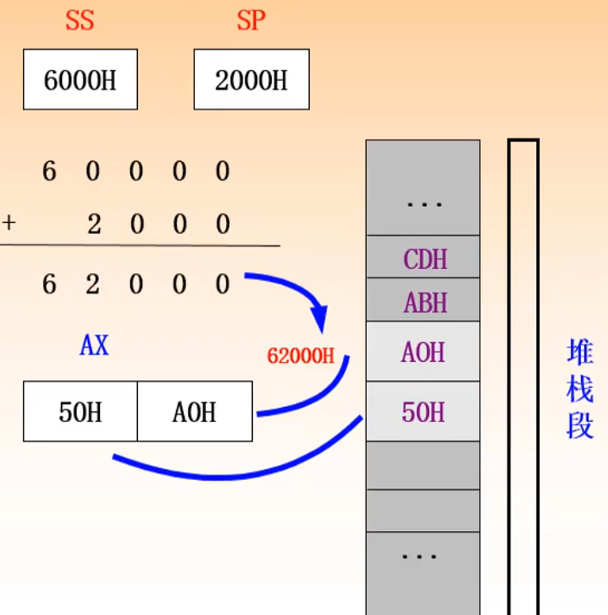
        - 出栈指令（POP）
          - 格式：POP dst；
          - 操作：
              1. （dst）<---((SP)+1,(SP));
              2. (SP)<---(SP)+2;
          - 功能：把SP所指向的堆栈顶部的一个字送入目的地址，同时修改堆栈指针。如：POP BX
          - 方法和压栈一致，顺序相反
        - 堆栈的用途：
            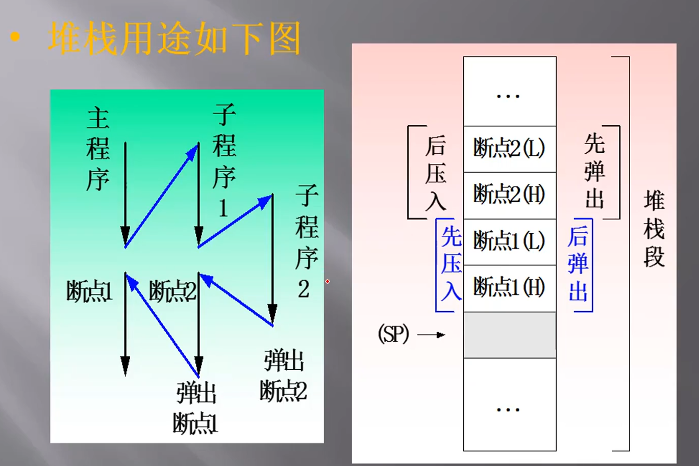
            断点信息：程序断点地址、标志寄存器及其他能被子程序使用和改变的寄存器。
        - 注意：
            1. 堆栈操作都按`字`操作；
            2. PUSH，POP指令的操作数可以是CPU内部寄存器或存储单元；
            3. `PUSH CS`合法，`POP CS；`非法（CS的值不能被随意更改）
            4. 执行PUSH指令，（SP）-2 --->（SP），低字节放在低地址，高字节放在高地址；
            5. SP总是指向栈顶；
            6. 堆栈最大容量即为SP的初值与SS之差。
    3. 交换指令（XCHG）
      - 格式：XCHG dst src；(dst)<--->(src)
      - 可以实现寄存器之间、寄存器和存储器之间的数据交换；
      - 注意：
          1. 存储器之间不能直接交换；
          2. 段寄存器不能作为操作数；
          3. 允许字或字节操作。
- 累加器专用传送指令：
    1. 输入指令（IN）
        - 功能：用于CPU从外设端口接收数据。
        - 具体形式有四种：
          - `IN AL,data8`  从8位端口地址输入一个字节
          - `IN AX,data8`  从8位端口地址输入一个字
          - `IN AL,DX`  从16位端口地址输入一个字节
          - `IN AX,DX`  从16位端口地址输入一个字
    2. 输出指令（OUT）
        - 功能：用于CPU向外设端口发送数据。
        - 四种形式：
          - `OUT AL,data8`  从8位端口地址输出一个字节
          - `OUT AX,data8`  从8位端口地址输出一个字
          - `OUT AL,DX`  从16位端口地址输出一个字节
          - `OUT AX,DX`  从16位端口地址输出一个字
    3. 目的地址传送指令

- 地址传送指令：
        - 8086提供三条：
          - LEA（Load Effective Address）：
              1. 格式：LEA reg16，men（reg16表示16位通用寄存器，men表示存储单元）
              2. 功能：将源操作数的偏移地址传送到目的操作数；
              3. 注意：源操作数必须以寄存器`间接寻址`、`变址寻址`、`基址加变址寻址`等方式表示的存储器操作数，目的操作数为一个16位的通用寄存器。
              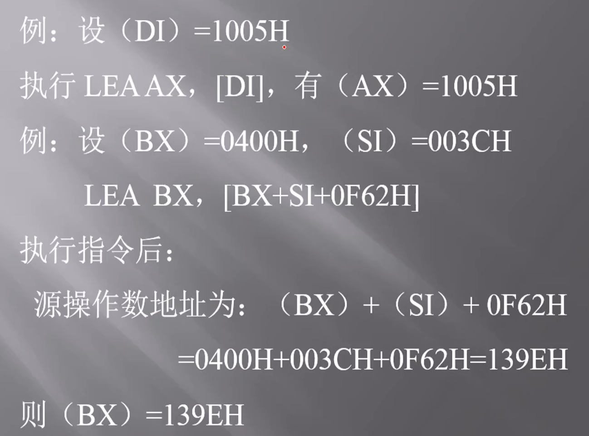
          - LDS(Load pointer using DS)：
              1. 格式： LDS reg16，men
              2. 功能：把源操作数指定的4个相继字节的数据分别送到指令指定的寄存器及DS寄存器中。(reg16)<---(men);(DS)<---((men)+2) 。
              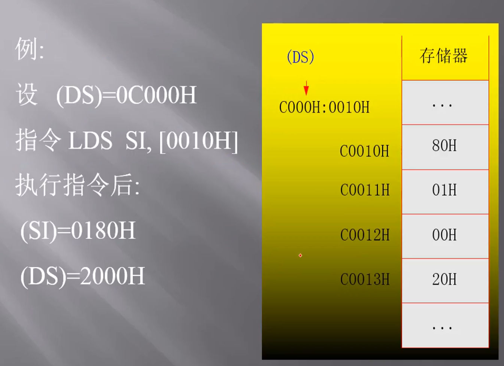
          - LES：
              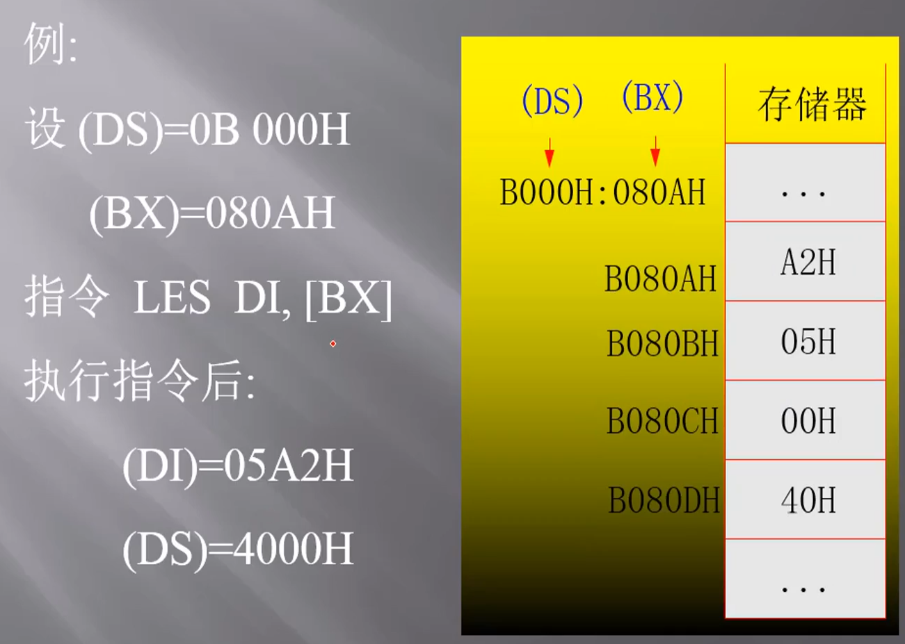
- 标志传送指令：
  - 8086有四条标志传送指令：(PSW表示标志寄存器)
      1. LAHF（Load AH into Flags）
          - 格式：LAHF
          - 功能：标志寄存器低八位--->(AH);(AH)<---(PSW的低字节)
          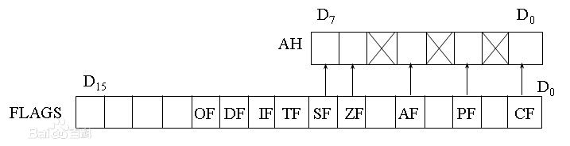
      2. SAHF(Store AH into Flags)
          - 格式：SAHF
          - 功能：（AH）送入标志寄存器低八位。 （PSW的低字节）<---(AH)
      3. PUSHF（Push Flags）
          - 格式：PUSHF
          - 功能：标志进栈。
          - 如：（SP）<---(SP)-2;  ((SP)+1,(SP))<---(PSW)
      4. POPF(Pop Flags)
          - 格式：POPF
          - 功能：标志出栈。
          - 如：（PSW）<---((SP)+1,(SP));(SP)<---(SP)+2

### 算数运算指令

包括：加法指令、减法指令、乘法指令、除法指令

1. 加法指令
    8086具有5条加法指令：
    - ADD（Addition）加法指令（无进位）：
      - 指令格式：`ADD dest,src`
      - 功能：（dest）<---（dest）+（src）
        - Src：立即数，通用寄存器，存储器；
        - dest：通用寄存器，存储器。
      - 例：
        - `ADD CL,10`
        - `ADD DX,SI`
        - `ADD AX,[2F00H]`
        - `ADD 100H[BX],AL`
        - `ADD [DI],30H`
      - 特点：
        - 可进行8位或16位的无符号数或有符号数加法运算；
        - 源操作数和目标操作数不能同时为存储器，不能为段寄存器；
        - 指令影响标志位：
          - 8位（有符号）数相加，和超出范围（-123~ +127），或16位（有符号）数相加，和超出范围（-32768~ +32767），则O=1（溢出）
          - 8位（无符号）数相加，和超过255，或16位（无符号）数相加，和超过65535，则C=1（进位）
          - 其他标志（S，A，P，Z）由运算结果按定义确定。
    - ADC（Add with Carry）带进位加法指令：
      - 格式：`ADC dest,src`
      - 功能：（dest）<---（dest）+（src）+C
        - C：进位标志C的现行值（上条指令C值）
      - 特点：与ADD一致。
      - 用途：主要用于多字节运算。
      - 例：
        - `ADC CX,300`
        - `ADC AL,BL`
        - `ADC DX,[SI]`
      - ADC指令主要用于多字节运算：
        - 如：求两个32位数12345678H与0ABCDEFABH之和：`MOV AX,1234H; MOV BX,5678H ADD BX,0EFABH; ADC AX,0ABCDH;`
    - INC（Increment）加1指令:
      - 格式：`INC dest`
      - 功能：（dest）<---（dest）+1
        - dest：通用寄存器、存储器；
      - 用途：用于在循环程序中修改地址指针和循环次数。
      - 标志位影响情况：影响S，Z，A，P，O；不影响C。
      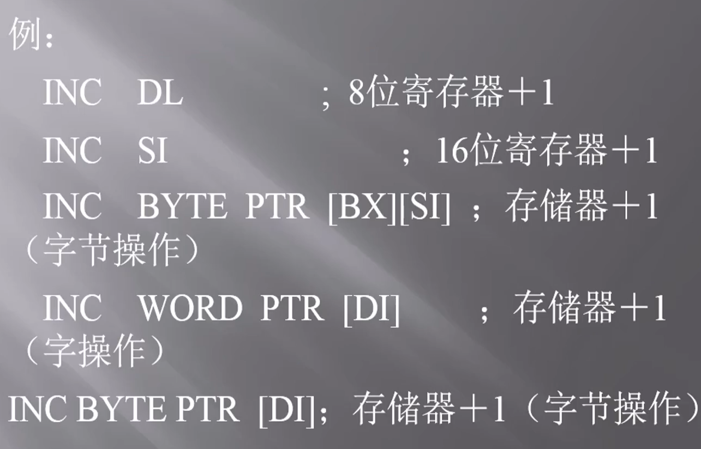
    - AAA（ASCII adjust for addition）加法ASCII调整指令;
    - DAA（Decimal adjust for addition）加法十进制调整指令;
2. 减法指令（Subtraction）
    8086有7条减法指令 ：
    - SUB（Subtraction）减法指令：
      - 格式：`SUB dest,src`
      - 功能：（dest）<---（dest）-（src）
        - Src：立即数，通用寄存器，存储器。
        - Dest：通用寄存器，存储器。
      - 例：`SUB AL,37H`,`SUB BX,DX`
      - 该指令影响标志位：A、C、O、P、S、Z标志。
    - SBB（Subtraction with Borrow）进位减法指令：
      - 格式：`SBB dest,src`
      - 功能：（dest）<---（dest）-（src）-C
        - Src：立即数，通用寄存器，存储器；
        - dest：通用寄存器，存储器
      - 指令影响标志位；
      - 例：
        - `SBB BX,100H`
        - `SBB CX,DX`
        - `SBB WORD PTR 100H[BP],100`
    - DEC（Decrement by 1）减1指令:
      - 格式：`DEC dest`
      - 功能：（dest）<---（dest）-1
        - dest：通用寄存器、存储器。不能是段寄存器。
      - 用途：用于在循环中程序修改地址指针和循环次数。
      - 标志位影响情况：影响S，Z，A，P，O；不影响C。
    - NEG（Negate）求补指令：
      - 格式：`NEG dest`
      - 功能：（dest）<--- 0-（dest）
        - dest：通用寄存器、存储器。
      - 操作：把操作数按位求反后末位+1.
      - 影响标志位：A、C、O、P、S、Z。
        - C：操作数为0时求补，C=0；一般使C=1；
        - O：对-128或-32768求补，O=1；否则O=0。
    - CMP（Compare）比较指令：
      - 格式：`CMP dest,src`
      - 功能：（dest）-（src），结果不保留，只是用来影响标志位。
      - 影响标志：A、C、O、P、S、Z。
        - src：立即数，通用寄存器，存储器。
        - dest：通用寄存器，存储器。
      - 例：
        - `CMP AL,0AH`寄存器与立即数比较
        - `CMP CX,DI`寄存器与寄存器比较
        - `CMP AX,[1000H]`寄存器与存储器比较
        - `CMP [BX+5],SI`存储器与寄存器比较
      - 用途：
        - 用来比较两个数之间的关系：两者是否相等，两个数中谁大
            1. 根据Z标志，判断两者是否相等；
            2. 根据C标志，判断两个无符号数的大小；
            3. 用S、O标志，判断两个带符号数的大小。
    - AAS（ASCII Adjust for Subtraction）减法ASCII调整指令；
    - DAS（Decimal Adjust for Subtraction）减法十进制调整指令。
3. 乘法指令
    - MUL（无符号乘法）
      - 格式：MUL SRC
      - 操作：
        - 字节操作数：AX<---(AL)*(SRC)
        - 字操作数：DX：AX<---(AX)*(SRC)
    - IMUL(带符号乘法)
      - 格式：IMUL SRC
      - 操作：同MUL，但操作数和乘积均带符号；
      - 按有符号数的规则相乘。
4. 除法指令
    - DIV（无符号除法）
      - 操作：
        - 字节除数：AL<---(AX)/(SRC)之商（商赋给AL，下同）；AH<---(AX)/(SRC)之余数
        - 字除数：AX<---(DX:AX)/(SRC)之商；DX<---(DX:AX)/(SRC)之余数
    - IDIV（带符号除法）
      - 格式：IDIV SRC
      - 操作：同DIV
      - 商和余数是带符号的：商的符号一般代数符号规则，余数的符号与被除数相同。
    - CBW（字节扩展指令）
      - 格式：CBW（Convert Byte to Word）
      - 功能：将AL字节扩展成字，符号位及高字节在AH中；
    - CWD（字扩展指令）
      - 格式：CWD（Convert Word to Double Word）
      - 功能：AX扩展成双字，符号位及高子在DX中；
    - CBW、CWD的作用是对被除数AL或AX进行扩展。
5. 十进制调整指令
    - AAA 非压缩BCD码的加法十进制调整；
    - DAA 压缩BCD码的加法十进制调整；
    - AAS 非压缩BCD码的减法十进制调整；
    - DAS 压缩BCD码的减法十进制调整；
    - AAM 乘法的十进制调整；
    - AAD 除法的十进制调整。

### 逻辑运算和移位指令

#### 位操作类指令

1. 逻辑运算指令
    - AND逻辑“与”指令（按位与）：
      - 格式：AND dest,src
      - 功能：（dest）<---（dest）^（src）
        - src：立即数、通用寄存器、存储器；
        - dest：通用寄存器、存储器。
      - 两操作数不能同时为存储器操作数；
      - 操作类型举例：
        - `AND AL,0FH`
        - `AND CX,DI`
        - `AND SI,[2456H]`
    - TEST测试指令：
      - 格式：TEST dest,src (dest)^(src),dest、src的规则同‘AND’
      - 操作：操作数相与，结果不保存，用来改变标志位。
      - 操作类型举例：
        - `TEST BH,7`
        - `TEST SI,BP`
        - `TEST DI,1030H[BX]`
    - OR逻辑“或”指令：
      - 格式：OR dest,src
        - dest：寄存器、存储器
        - src：立即数、寄存器、存储器
      - 不能同时为存储器操作数
    - XOR（eXclusive OR）逻辑“异或”指令：
      - 格式：OR dest,src
        - dest：寄存器、存储器
        - src：立即数、寄存器、存储器
      - 不相同则为1，相同则为0；
      - 不能同时为存储器操作数。
    - NOT逻辑“非”指令：
      - 格式：NOT dest
      - 操作：按位求反
      - 操作数：寄存器、存储器，不能是立即数。

#### 移位指令

- 移位指令的格式：
    `操作码 reg/men，Count`
- Count=1或CL，指定移位次数；
- 字节或字操作，通用寄存器或存储器操作数。

- SAL(Shift Arithmetic Left)算术左移/SAR(Shift Arithmetic Right)算术右移：
  - 算数右移操作示意图：
      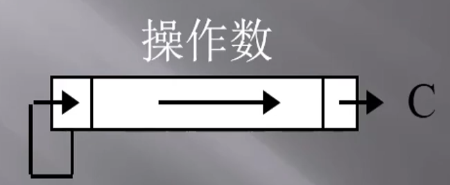
  - 例：
    - `MOV AL,88H`
    - `MOV CL,2`
    - `SAR AL,CL`(AL)=E2H
  - SAR右移的时候，最高位不变，最低位移入CF（例中寄存器存储八位数据）
  - 算数左移与右移类似。
- SHL(Shift Logical Left)逻辑左移/SHR(Shift Logical Right)逻辑右移：
  - 两条指令实现相同的操作；
  - 逻辑左移操作示意图：（相当于无符号数x2）
      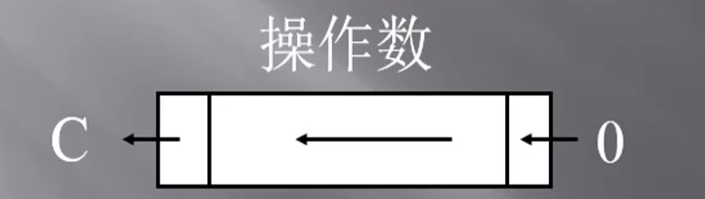
  - 例：
    - `MOV AH,3FH`(AH)=0011 1111B
    - `SAL AH,1`(AH)=7EH
    - `MOV CL,2`
    - `SAL AH,CL`(AH)=F8H
  - SHL是逻辑左移，右边的位补零。
  - 逻辑右移操作示意图：（相当于无符号数除以2）
      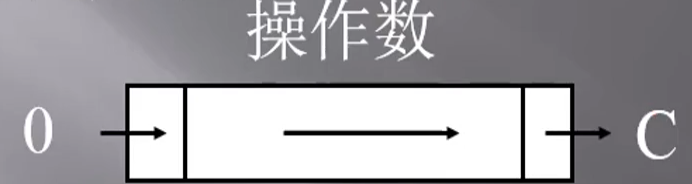
  - 例：
    - `SHR BL,1`
    - `SHR AX,CL`
    - `SHR BYTE PTR [DI+BP]`
  - SHR右移的时候，它的最高位用0填补，最低位移入CF
- ROL(Rotate Left)循环左移/ROR(Rotate Right)循环右移：（不含进位标志）
  - 循环左移操作示意图：
      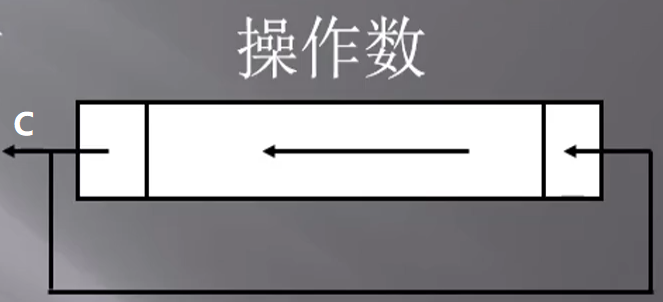
  - 例：
    - `MOV AL,11110000B`
    - `ROL AL,1`(AL)=11100000B (CF)=1
  - ROL是循环左移，左边移出的位补到右边；
  - 循环右移操作示意图：
      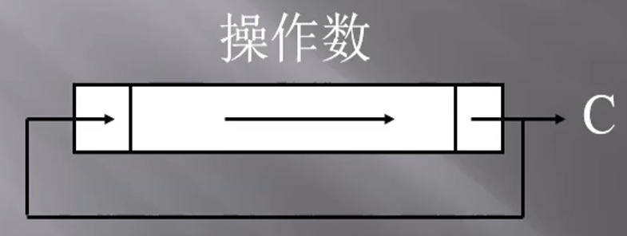
  - 例：
    - `MOV AL,11110000B`
    - `ROR AL,1`(AL)=01111000B  CF=0
- RCL(Rotate left with carry)带进位循环左移/RCR(Rotate right with carry)带进位循环右移：
  - 含C循环左移操作示意图：
      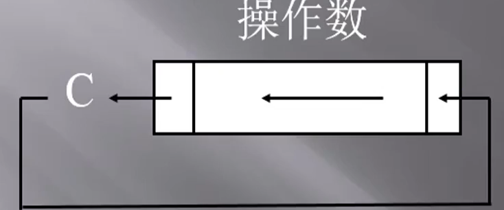
  - 例：
    - `MOV AL,11110000B`
    - `RCL AL,1`(AL)=11100000B CF=1
  - 循环左移，进位值（原CF）到低位，高位进CF
  - 含C循环右移操作示意图：
      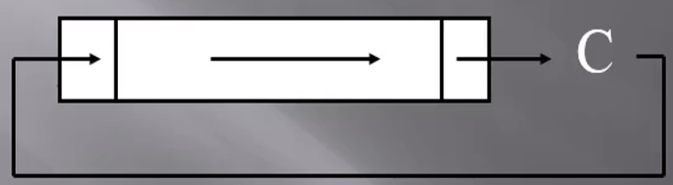
  - 例：
    - `MOV AL,11110000B`
    - `RCR AL,1`(AL)=01111000  CF=0
  - 循环右移，进位值（原CF）到高位，低位进CF

### 串操作指令、转移指令、处理器

#### 串操作类指令

- “串”就是内存中一段地址相连的字节或字；
- 传操作，也叫数据块操作；
- 可实现存储器数据之间的直接传送；
- 8086的五种基本串操作：
  - MOVS(Move string)串传送指令：（两种格式）
      1. MOVSB：
          - 字节传送：把数据段种SI寻址的数据传送到附加段中DI寻址的存储区域；然后修改SI、DI
            - (ES:DI)<---(DS:SI);
            - (SI)<---(SI)+1或(SI)-1;
            - (DI)<---(DI)+1或(DI)-1;
            - 当方向标志D=0时用“+”，D=1时用“-”

            ``` assembly
            MOV AX,1000H
            MOV DS,AX  //数据段地址赋值
            MOV AX,1000H
            MOV ES,AX  //附加段地址赋值
            MOV SI,0013H //源数据块首地址
            MOV DI,1003H //目的数据块首地址
            MOV CX,4 //数据块长度赋给计数器
            STD
            LP：MOVSB  //完成一个字节的数据传送
            DEC CX //计数器减一
            JNZ LP //结果不为0，重复传送
            HLT
            ```

      2. MOVSW：
          - 操作：字传送；
            - (ES:DI)<---(DS:SI);
            - (SI)<---(SI)+2或(SI)-2;
            - (DI)<---(DI)+2或(DI)-2;
            - 当方向标志D=0时用“+”，D=1时用“-”
          - 该类指令可以实现从存储器到存储器的数据传送；
      3. REP重复操作执行过程：
          - 当(CX)!=0,(CX)<---(CX)-1,执行REP指令后的串指令。
          - 当(CX)=0,结束REP，执行下一条指令。
          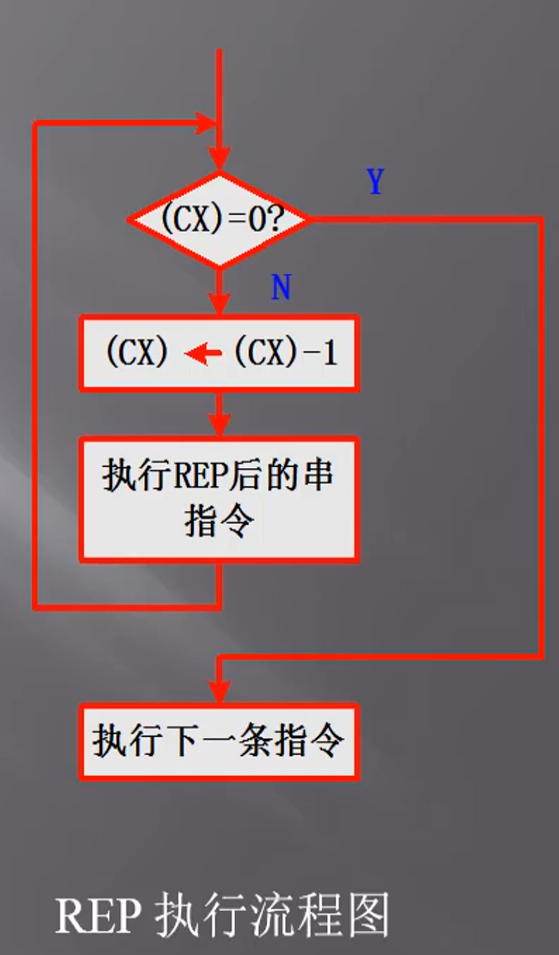

          ```assembly
          MOV AX,1000H
          MOV DS,AX
          MOV AX,200H
          MOV ES,AX
          MOV SI,0010H
          MOV DI,1000H
          MOV CX,4 //数据块长度赋值给计数器
          REP MOVSB  //重复完成字节数据传送
          HLT
          ```

  - CMPS(Compare string)串比较指令：
      1. CMPSB（字节）
      2. CMPSW（字）
    - 执行操作：(ES:DI)-(DS:SI),结果不存储，置标志位
      - 字节操作：(SI)<---(SI)+1或(SI)-1，(DI)<---(DI)+1或(DI)-1
      - 字操作：(SI)<---(SI)+2或(SI)-2，(DI)<---(DI)+2或(DI)-2
  - SCANS(Scan string)串扫描指令：
      1. SCASB（字节）：(AL)<---(ES:DI),(DI)<---(DI)+1或(DI)-1
      2. SCASW（字）：(AX)<---(ES:DI),(DI)<---(DI)+2或(DI)-2
    - 两数相减，只影响标志，不影响操作数
  - LODS(Load from string)取串指令：
      1. LODSB（字节）：(AL)<---(DS:SI),(SI)<---(SI)+1或(SI)-1
      2. LODSW（字）：(AX)<---(DS:DI),(SI)<---(SI)+或(SI)-2
    - 功能：该指令把由SI指定的数据段中某单元内容赋给AL或AX
  - STOS(Storc in to string)存串指令：
      1. STOSB（字节）：(ES:DI)<---(AL),(DI)<---(DI)+1或(DI)-1
      2. STOSW（字）：(ES:DI)<---(AX),(DI)<---(DI)+2或(DI)-2
    - 与REP联用时，可用来建立一串相同的值，串长度由CX内容来决定。
  - CMPS和SCAS可与前缀
    - REPE/REPZ和REPNE/REPNZ联合工作：
        1. REPE/REPZ：当相等/为0时重复操作
        2. REPNE/REPNZ：当不相等/不为0时重复操作

#### 程序控制类指令

- 控制传送指令包括四种：转移指令、循环控制指令、过程调用指令、中断指令；
- 转移指令：
  - 控制程序从一处转移到另一处执行；
  - 在CPU内部，转移是通过将目的地址传送给IP来实现的；
  - 转移指令包括两种：无条件转移指令、条件转移指令

  1. 无条件转移指令JMP(Jump)
      - 格式：JMP 语句标号
      - 例：JMP LP
  2. 条件转移指令
      - 根据单个条件标志转移：
        - Z标志：JZ/JNZ(Jump on Zero;)
        - C标志：JC/JNC(Jump if Carry;)
        - P标志(奇偶跳转)：JP(JPE)/JNP(JPO) (Jump on Parity;Jump on Even;Jump on Odd)
        - S标志(负号跳转)：JS/JNS
        - O标志(溢出跳转):JO/JNO
      - 根据两个无符号数大小关系转移：
        - JB(低于跳转)、JNAE;JNB、JAE
        - JBE(不高于跳转)、JNA;JNBE、JA(高于跳转)
        - JB:Jump on Below；
        - JAE:Jump on Above or Equal
      - 根据两个带符号数比较结果转移：
        - JL(JNGE)/JNL(JGE);小于跳转/不小于跳转
        - JLE(JNG)/JNLE(JG)
        - L——Less；G——Great；E——Equal
        - > 注意：所有条件转移指令都是段内（-128~+127）范围内转移。
- 过程（子程序）调用指令
  - 子程序——程序中具有独立功能的部分编写成独立程序模块。
  - 子程序调用：CALL 子过程名
  - 返回指令RET(return):在子程序的结尾，用来返回到主程序
- 循环控制指令
  - 无条件循环：LOOP 语句标号
  - 执行操作：
    - (CX)<---(CX)-1
    - 若CX!=CX,转向目标地址去执行；否则执行LOOP指令之后的指令。
    - 遇到LOOP，首先执行CX=CX-1;然后判断CX的值，若CX!=0,则转移到Lable处执行程序，否则向下继续执行。
  - 条件循环
      1. LOOPZ/LOOPE 语句标号
          - 执行操作：
            - (CX)<---(CX)-1
            - 若CX!=0且Z=1，转向目标地址去执行；否则执行LOOP指令之后的指令。
          - 遇到LOOPZ/LOOPE Lable，首先执行CX=CX-1；然后判断，若CX!=0且ZF=1，则转到Lable处执行程序，否则向下继续执行。当进行循环的时候，如果遇到CX=0或ZF=0，则终止循环
      2. LOOPNZ/LOOPNE 语句标号
          - 执行操作：
            - (CX)<---(CX)-1
            - 若CX!=0且Z=0，转向目标地址去执行；否则执行LOOP指令之后的指令。
            - > 注意：条件循环只允许在段内循环，跳转范围-128~+127
            - 遇到LOOPNZ/LOOPNE Lable，首先执行CX=CX-1；然后判断，若CX!=0且Z=0，则跳转到Lable处执行程序，否则向下继续执行。当进行循环的时候，如果遇到CX=0或ZF=0，则终止循环。
- 中断指令（interrupt）
  - 中断调用： INT n
    - n：中断号，0~255
  - 中断返回：IRET
- 处理器控制类指令
  - 标志处理指令
    - CLC （Clearcarryflag)清C标志
    - STC（Setcarryflag )置C标志
    - CMC（Complementcarryflag）对C求反
    - CLD（Cleardirectionflag)清D标志
    - STD（Setdirectionflag)置D标志
    - CLI（Clearinterruptflag)清I标志
    - STI （Setinterruptenableflag)置I标志
  - 其他处理机控制指令
    - NOP（Nooperation)空操作
    - HLT（Halt) CPU暂停状态
    - WAITCPU等待状态
    - ESC交权
    - LOCK（Lockbus)总线锁定

## OPCode

在计算机科学领域中，`操作码(Operation Code,OPcode)`描述机器语言指令中，指定要执行某种操作的机器码。
OPCode在不同场合中通常具有不同的含义，例如PHP虚拟机（Zend VM）、java虚拟机（JVM）以及一些软件保护虚拟机中的最小操作单元都可以称之为OPCode

- OPCode与汇编指令的关系：一个OPCode不只对应一个指令；一个指令不止对应一个OPCode。
- OPCode主要数据域
    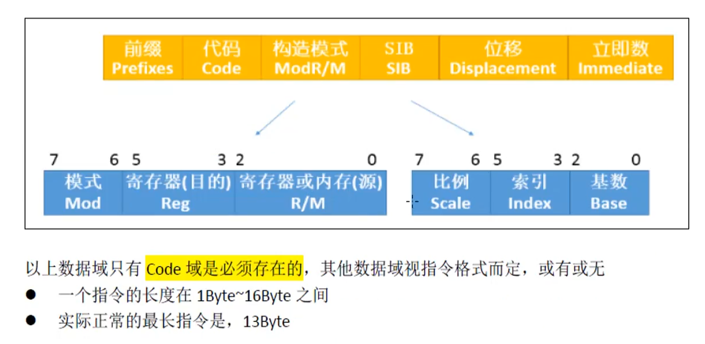
  - 指令前缀
      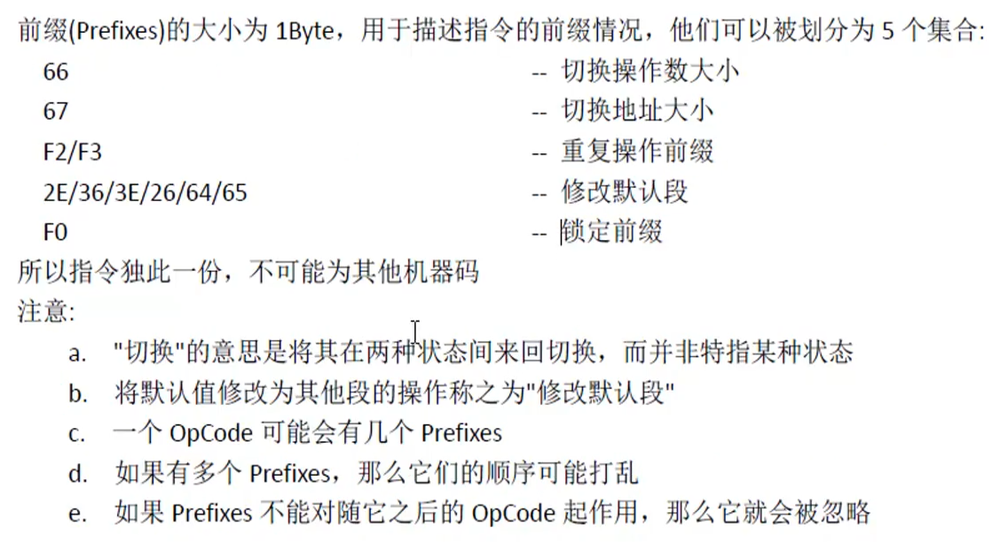
      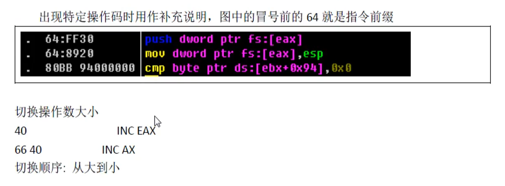
  - 操作码
      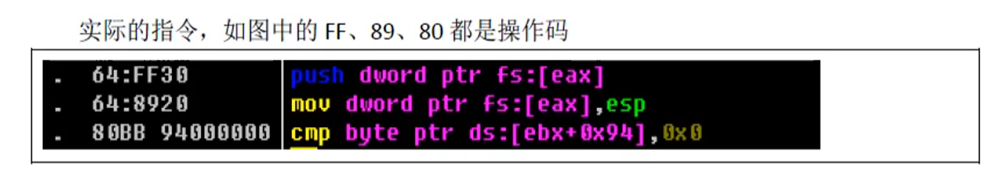
  - ModR/M
      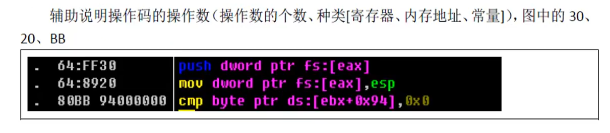
      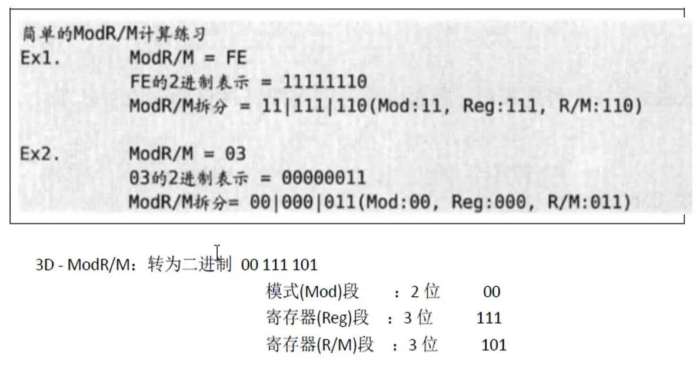
  - D-SIB
      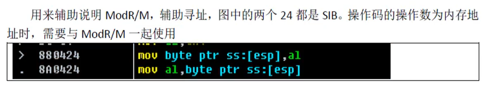
      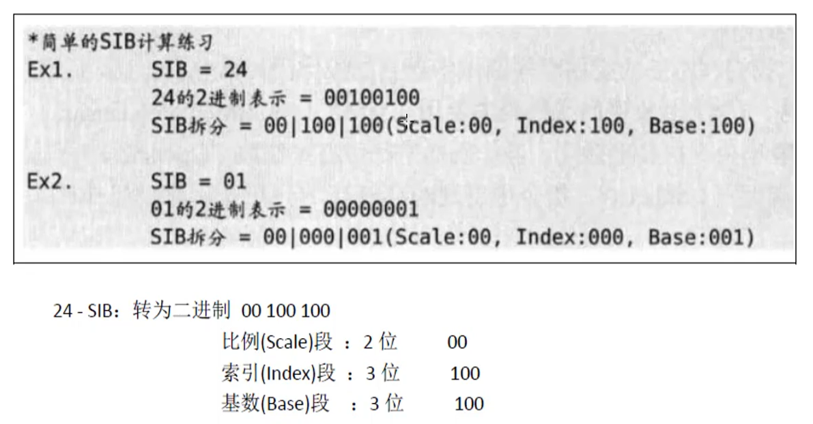
  - 位移
      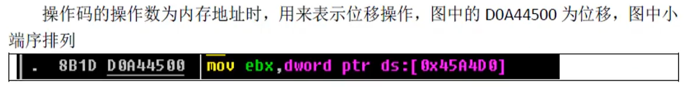
  - 立即数
      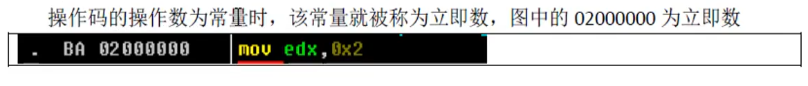
