# 讲义

## [时间复杂度](https://juejin.im/post/5c11ac8c6fb9a049e412912d)

## 哈夫曼树

### 简介

[哈夫曼树](https://zh.wikipedia.org/wiki/%E9%9C%8D%E5%A4%AB%E6%9B%BC%E7%BC%96%E7%A0%81)又称最优二叉树，是一种带权路径长度最短的二叉树。所谓树的带权路径长度，就是树中所有的叶结点的权值乘上其到根结点的路径长度（若根结点为0层，叶结点到根结点的路径长度为叶结点的层数）。树的路径长度是从树根到每一结点的路径长度之和，记为WPL=（W1*L1+W2*L2+W3*L3+...+Wn*Ln），N个权值Wi（i=1,2,...n）构成一棵有N个叶结点的二叉树，相应的叶结点的路径长度为Li（i=1,2,...n）

### 生成流程

哈夫曼树常处理符号编写工作。根据整组数据中符号出现的频率高低，决定如何给符号编码。如果符号出现的频率越高，则给符号的码越短，相反符号的号码越长。假设我们要给一个英文单字"F O R G E T"进行霍夫曼编码，而每个英文字母出现的频率分别列在下表中：


创建哈夫曼树：

- 将每个英文字母依照出现频率由小排到大，最小在左。
- 每个字母都代表一个终端节点（叶节点），比较F、O、R、G、E、T六个字母中每个字母的出现频率，将最小的两个字母频率相加合成一个新的节点，发现F与O的频率最小，故相加2+3=5。
- 比较5、R、G、E、T，发现R与G的频率最小，故相加4+4=8。
- 比较5、8、E、T，发现5与E的频率最小，故相加5+5=10。
- 比较8、10、T，发现8与T的频率最小，故相加8+7=15。
- 最后剩10、15，没有可以比较的对象，相加10+15=25。

最后产生的树状图就是霍夫曼树。


### 代码实现

当有100个位子，有白色占60%、咖啡色占20%，蓝色和红色各占10%，则该如何分配才能最优化此座位?
(a)direct:
假设结果为：白色为00、咖啡色01，蓝色10和红色11个bits 则结果为:100*2 = 200bits
(b)huffman code: (must be satisfy the following conditions，if not change the node)
(1) 所有码皆在Coding Tree的端点，再下去没有分枝(满足一致解码跟瞬间解码)
(2) 几率越大，code length越短；几率越小，code length越长
(3) 假设Sa是第L层的node，Sb是第L+1层的node
>则P(Sa)>=P(Sb)必须满足
假设结果为：白色占0、咖啡色10，蓝色110和红色111个bits
则结果为:60*1+20*2+20*3=160bits

```c++

// 以下为C++程式码，在G++下编译通过
// 仅用于示范如何根据权值建构霍夫曼树，
// 没有经过性能上的优化及加上完善的异常处理。
#include <cstdlib>
#include <iostream>
#include <deque>
#include <algorithm>

using namespace std;

const int size = 10;
struct node {                               // 霍夫曼树节点结构
    unsigned key;                           // 保存权值
    node *lchild;                           // 左孩子指針
    node *rchild;                           // 右孩子指針
};
deque<node *> forest;
deque<bool> code;                           // 此处也可使用bitset
node *ptr;
int frequency[size] = {0};

void printCode(deque<bool> ptr);            // 用于输出霍夫曼编码

bool compare( node *a, node *b) {
    return a->key < b->key;
}
int main(int argc, char *argv[]) {
    for (int i = 0; i < size; i++) {
        cin >> frequency[i];                // 输入10个权值
        ptr = new node;
        ptr->key = frequency[i];
        ptr->lchild = NULL;
        ptr->rchild = NULL;
        forest.push_back(ptr);
    } // 形成森林，森林中的每一棵树都是一个节点
    // 从森林构建霍夫曼树
    for (int i = 0; i < size - 1; i++) {
        sort(forest.begin(), forest.end(), compare);
        ptr = new node;
        // 以下代码使用下标索引队列元素，具有潜在危险，使用时请注意
        ptr->key = forest[0]->key + forest[1]->key;
        ptr->lchild = forest[0];
        ptr->rchild = forest[1];
        forest.pop_front();
        forest.pop_front();
        forest.push_back(ptr);
    }
    ptr = forest.front(); // ptr是一个指向根的指針
    system("PAUSE");
    return EXIT_SUCCESS;
}

void printCode(deque<bool> ptr) {
    // deque<bool>
    for (int i = 0; i < ptr.size(); i++) {
        if (ptr[i])
            cout << "1";
        else
            cout << "0";
    }
}
```

## 贪心法

### 概念

[贪心算法](https://zh.wikipedia.org/wiki/%E8%B4%AA%E5%BF%83%E7%AE%97%E6%B3%95)（英语：greedy algorithm），又称贪婪算法，是一种在每一步选择中都采取在当前状态下最好或最优（即最有利）的选择，从而希望导致结果是最好或最优的算法。比如在旅行推销员问题中，如果旅行员每次都选择最近的城市，那这就是一种贪心算法。

贪心算法在有最优子结构的问题中尤为有效。最优子结构的意思是局部最优解能决定全局最优解。简单地说，问题能够分解成子问题来解决，子问题的最优解能递推到最终问题的最优解。

### 体现

- 找零

一般人换零钱的时候也会应用到贪心算法。把36元换散︰20 > 10 > 5 > 1

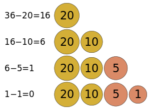

- GPSR协议

GPSR是一种无线数据报网络的新型路由协议，协议设计每个节点可以利用贪心算法依据邻居与自身的位置信息转发数据。算法的大致流程是当节点接收到数据以后，便开始以该数据为标准对本身存储的邻居节点列表进行处理，一旦自身到基站的距离大于列表中的邻居节点，那么节点就会将这个数据转发给它的邻居节点。

### 例子

> 第一次从待排序的数据元素中选出最小（或最大）的一个元素，存放在序列的起始位置，然后再从剩余的未排序元素中寻找到最小（大）元素，然后放到已排序的序列的末尾。以此类推，直到全部待排序的数据元素的个数为零。

- [选择排序](https://zh.wikipedia.org/wiki/%E9%80%89%E6%8B%A9%E6%8E%92%E5%BA%8F)

    ```python
    def selection_sort(arr):
    for i in range(len(arr)-1):
        minIndex=i
        for j in range(i+1,len(arr)):
            if arr[minIndex]>arr[j]:
                minIndex=j
        if i==minIndex:
            pass
        else:
            arr[i],arr[minIndex]=arr[minIndex],arr[i]
    return arr


    if __name__ == '__main__':
        testlist = [17, 23, 20, 14, 12, 25, 1, 20, 81, 14, 11, 12]
        print(selection_sort(testlist))
    ```

    ```c
    void selection_sort(int a[], int len)
    {
        int i,j,temp;
        for (i = 0 ; i < len - 1 ; i++)
        {
            int min = i;
            for (j = i + 1; j < len; j++)     //走访未排序的元素
            {
                if (a[j] < a[min])    //找到目前最小值
                {
                    min = j;    //记录最小值
                }
            }
            temp=a[min];  //交换两个数
            a[min]=a[i];
            a[i]=temp;
                /* swap(&a[min], &a[i]);  */   //做交换
        }
    }

    /*
    void swap(int *a,int *b) //交换两个参数
    {
        int temp = *a;
        *a = *b;
        *b = temp;
    }
    */
    ```

    > 一个非常经典的问题。有n个需要在同一天使用同一个教室的活动a1,a2,…,an，教室同一时刻只能由一个活动使用。每个活动ai都有一个开始时间si和结束时间fi 。一旦被选择后，活动ai就占据半开时间区间`[si,fi)`。如果`[si,fi]`和`[sj,fj]`互不重叠，`ai`和`aj`两个活动就可以被安排在这一天。该问题就是要安排这些活动使得尽量多的活动能不冲突的举行。例如下图所示的活动集合S，其中各项活动按照结束时间单调递增排序。

- 活动选择问题

    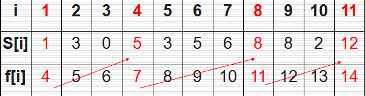

    ```python

    # coding=utf-8
      # 迭代贪心算法  最大活动兼容子集
      def greedActSel(s,f):
          n = len(s)
          A = [1]
          k = 1
          for m in range(2, n):
              if s[m] >= f[k]:
                  A.append(m)
                  k = m
          return A


      s = [0, 1, 3, 0, 5, 3, 5, 6, 8, 8, 2, 12]
      f = [0, 4, 5, 6, 7, 8, 9, 10, 11, 12, 13, 14]
      print("======== 迭代方法 =======")
      print(greedActSel(s, f))


      # 递归贪心算法
      def recuActSel(s, f, k, n):
          m = k + 1
          while m < n and s[m] < f[k]:
              m = m + 1
          if m < n:
              A.append(m)
              recuActSel(s, f, m, n)
          else:
              return


      A = []
      recuActSel(s, f, 0, len(s))
      print("======== 递归方法 =======")
      print(A)
    ```

    ```c++
      /*
      针对活动选择问题，认真分析可以得出以下定理：对于任意非空子问题Sij，
      设am是Sij中具有最早结束时间的活动，那么：
        （1）活动am在Sij中的某最大兼容活动子集中被使用。
        （2）子问题Sim为空，所以选择am将使子问题Smj为唯一可能非空的子问题。
      有这个定理，就简化了问题，使得最优解中只使用一个子问题，在解决子问题Sij时，
      在Sij中选择最早结束时间的那个活动。
      贪心算法自顶向下地解决每个问题，解决子问题Sij，先找到Sij中最早结束的活动am，
      然后将am添加到最优解活动集合中，再来解决子问题Smj。
    */

      #include <stdio.h>
      #include <stdlib.h>

      #define N 11
      void recursive_activity_selector(int *s,int* f,int i,int n,int *ret);
      void greedy_activity_selector(int *s,int *f,int *ret);
      int main()
      {
          int s[N+1] = {-1,1,3,0,5,3,5,6,8,8,2,12};
          int f[N+1] = {-1,4,5,6,7,8,9,10,11,12,13,14};
          int c[N+1][N+1]={0};
          int ret[N]={0};
          int i,j;
          //recursive_activity_selector(s,f,0,N,ret);
          greedy_activity_selector(s,f,ret);
          printf("最大子集为:{ ");
          for(i=0;i<N;i++)
          {
             if(ret[i] != 0)
               printf("a%d ",ret[i]);
          }
          printf(" }\n");
          system("pause");
          return 0;
      }
      void recursive_activity_selector(int *s,int* f,int i,int n,int *ret)
      {
           int *ptmp = ret;
           int m = i+1;
           //在i和n中寻找第一个结束的活动
           while(m<=n && s[m] < f[i])
              m = m+1;
           if(m<=n)
           {
              *ptmp++ = m;  //添加到结果中
              recursive_activity_selector(s,f,m,n,ptmp);
           }
      }
      void greedy_activity_selector(int *s,int *f,int *ret)
      {
        int i,m;
        *ret++ = 1;
        i =1;
        for(m=2;m<=N;m++)
          if(s[m] >= f[i])
          {
             *ret++ = m;
             i=m;
          }
      }
    ```

> 假设1元、2元、5元、10元、20元、50元、100元的纸币分别有c0, c1, c2, c3, c4, c5, c6张。现在要用这些钱来支付K元，至少要用多少张纸币？用贪心算法的思想，很显然，每一步尽可能用面值大的纸币即可。在日常生活中我们自然而然也是这么做的。在程序中已经事先将Value按照从小到大的顺序排好。

- 钱币找零问题

    ```python
        # (value, count)
        m = [(1, 3), (2, 0), (5, 2), (10, 1), (20, 0), (50, 3), (100, 5)]
        m.sort(key=lambda x: x[0], reverse=True)


        def solve(money):
            num = [0 for i in range(len(m))]
            for i in range(len(m)):
                c = min(money//m[i][0], m[i][1])
                money = money-c*m[i][0]
                num[i] += c
            if money > 0:
                num += ["不能找零，还差：%d" % (money)]
            return num


        money = 344
        res = solve(money)
        print(res)

    ```

    ```c++
        #include<iostream>  
        #include<algorithm>  
        using namespace std;  
        const int N=7;
        int Count[N]={3,0,2,1,0,3,5};  
        int Value[N]={1,2,5,10,20,50,100};  

        int solve(int money)
        {  
            int num=0;  
            for(int i=N-1;i>=0;i--)
            {  
                int c=min(money/Value[i],Count[i]);  
                money=money-c*Value[i];  
                num+=c;  
            }  
            if(money>0) num=-1;  
            return num;  
        }  

        int main()
        {  
            int money;  
            cin>>money;  
            int res=solve(money);  
            if(res!=-1) cout<<res<<endl;  
            else cout<<"NO"<<endl;  
        }
    ```

## 贪心法解决01背包问题

一、背包问题

01背包是在M件物品取出若干件放在空间为W的背包里，每件物品的体积为W1，W2至Wn，与之相对应的价值为P1,P2至Pn。01背包是背包问题中最简单的问题。01背包的约束条件是给定几种物品，每种物品有且只有一个，并且有权值和体积两个属性。在01背包问题中，因为每种物品只有一个，对于每个物品只需要考虑选与不选两种情况。如果不选择将其放入背包中，则不需要处理。如果选择将其放入背包中，由于不清楚之前放入的物品占据了多大的空间，需要枚举将这个物品放入背包后可能占据背包空间的所有情况。

二、求解思路

　　当遇到这样的问题，我们可以换一种角度去思考，假设在一个100m3的房子里面，现在要将房子装满，同时要保证放入的物品个数最多以及装入的东西最重，现在身边有铁球和棉花，请问大家是放铁球进去好呢还是放棉花进去好呢？显而易见，放入铁球进去是最优选择。但是原因是什么呢？很简单，就是因为铁球的密度较大，相同体积的铁球和棉花相比，铁球更重。
　　不过前提是放入第一个铁球时，铁球的体积V1小于等于100m3 ；放入第二个铁球时，铁球的体积V2 小于等于(100-V1)m3;……；放入第n个铁球时，铁球的体积小于等于（100- ∑n1Vn-1）m3 ，要是第n个铁球的体积大于（100- ∑n1Vn-1）m3 ，还真是不如放点单位体积更轻的棉花进去，说的极端点就是所有铁球的体积都大于100m3 ，还真不如随便放入点棉花进去合算。所以总是放铁球进去，不考虑是否放入棉花，容易产生闲置空间，最终会得不到最优选择，可能只是最优选择的近似选择。
　　现在再次回到背包问题上，要使得背包中可以获得最大总价值的物品，参照铁球的例子我们可以知道选择单位重量下价值最高的物品放入为最优选择。但是由于物品不可分割，无法保证能将背包刚好装满，最后闲置的容量无法将单位重量价值更高的物品放入，此时要是可以将单位重量价值相对低的物品放入，反而会让背包的总价值和单位重量的价值更高。假设现在背包的剩余总重量为5kg，存在一个4kg价值为4.5的物品，一个3kg价值为3的物品，一个2kg价值为2的物品，很显然将3kg和2kg的物品放入背包中所获得的价值更高,虽然没有4kg的物品单位重量的价值高。因此通过贪心算法求解01背包的问题可能得不到问题的最优解，得到的是近似最优解的解。

> 创建一个物品对象，分别存在价值、重量以及单位重量价值三种属性。以下以单位重量价值角度分析：

```python
#建立商品类
class goods:
    def __init__(self, name, weight=0, value=0):
        self.name = name
        self.weight = weight
        self.value = value
    def __repr__(self):
        return self.__str__()
    def __str__(self):
        return "('%s',%d,%.2f)" % (self.name, self.weight, self.value)

    def knapsack(bag_volume=0, goods_set=[]):
        #利用lambda函数对goods_set以单位价值作为规则进行排序，由大到小排列
        goods_set.sort(key=lambda x: x.value / x.weight, reverse=True)
        result = []
        the_cost = 0
        for good in goods_set:
            if bag_volume < good.weight:
                break
            #如果存在空间，则将此商品装入背包即放进result中，同时修改背包容量
            else:
                result.append(good)
                bag_volume = bag_volume - good.weight

        if len(result) < len(goods_set) and bag_volume != 0:
            result.append(goods(good.name, bag_volume, good.value *(bag_volume / good.weight)))
        #计算背包的最终价值the_cost并输出(保留两位小数)
        for x in result:
            the_cost += x.value
            print('%.2f' % the_cost)
        return result

if __name__ == '__main__':
    some_goods = [goods(0, 3, 5), goods(1, 5, 7), goods(2, 6, 2), goods(3, 4, 7), goods(4, 1, 3)]
    #调用knapsack函数，输出背包容量为6公斤时候背包的最大价值与商品选择
    print(knapsack(6, some_goods))
```

## 贪心法解决分数背包问题

计算每个物品的单位重量的价值，然后将他们降序排序，接着开始拿物品，只要装得下全部的该类物品那么就可以全装进去，如果不能全部装下就装部分进去直到背包装满为止。

```python
    # 每个商品元组表示（价格，重量）
    goods = [(60, 10), (100, 20), (120, 30)]
    # 我们需要对商品首先进行排序，当然这里是排好序的
    goods.sort(key=lambda x: x[0]/x[1], reverse=True)

    # w 表示背包的容量
    def fractional_backpack(goods, w):
       # m 表示每个商品拿走多少个
       total_v = 0
       m = [0 for _ in range(len(goods))]
       for i, (prize, weight) in enumerate(goods):
        if w >= weight:
           m[i] = 1
           total_v += prize
           w -= weight
           # m[i] = 1 if w>= weight else weight / w
         else:
           m[i] = w / weight
           total_v += m[i]*prize
           w = 0
           break
       return m, total_v

    res1, res2 = fractional_backpack(goods, 50)
    print(res1, res2) # [1, 1, 0.6666666666666666] 240
```

```java
    /*
    有 m 元钱，n 种物品；每种物品有 j 磅，总价值 f 元，
    可以使用 0 到 f 的任意价格购买相应磅的物品，例如使用 0.3f 元，
    可以购买 0.3j 磅物品。要求输出用 m 元钱最多能买到多少磅物品。
    输入样例
    3 5 //物品数量n 背包承重
    7 2 //价值 重量
    4 3
    5 2
    */
  public class 分数背包 {
      public static void main(String[] args) {
          Scanner input=new Scanner(System.in);
          int n=input.nextInt();
          double m=input.nextDouble();
          Good goods[]=new Good[n];
          for (int i = 0; i < n; i++) {
              goods[i]=new Good();
              goods[i].j=input.nextDouble();
              goods[i].f=input.nextDouble();
              goods[i].s=goods[i].j/goods[i].f;//计算性价比
          }
          Cmp cmp=new Cmp();
          Arrays.sort(goods,cmp);// 使各物品按照性价比降序排列
          int index=0;//当前货物下标
          double ans=0;//累加所能得到的总重量
          while(m>0&&index<n) {
              //循环条件为，既有物品剩余(index<n)还有钱剩余(m>0)时继续循环
              if(m>goods[index].f) {//若能买下全部该物品
                  ans+=goods[index].j;
                  m-=goods[index].f;
              }else{//若只能买下部分该物品
                  ans+=goods[index].j*m/goods[index].f;
                  m=0;
              }
              index++;//继续下一个物品
          }
          System.out.printf("%.3f\n",ans);
          }

  }
  class Cmp implements Comparator<Good>{
      @Override
      public int compare(Good g1, Good g2) {
          return (int)(g2.s-g1.s);
      }
  }
  class Good {
      double j;// 该物品总重
      double f;// 该物品总价值
      double s;// 该物品性价比
  }
```

## 并查集

在计算机科学中，[并查集](https://zh.wikipedia.org/wiki/%E5%B9%B6%E6%9F%A5%E9%9B%86)是一种树型的数据结构，用于处理一些不交集（Disjoint Sets）的合并及查询问题。
并查集主要的操作：

- 合并两个不相交集合
- 判断两个元素是否属于同一个集合
- 路径压缩

用`father[i]`表示元素i的父亲节点，例如：

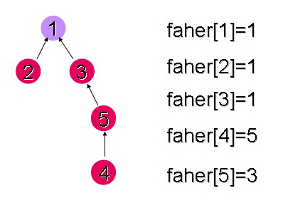

> 用某个元素所在树的根节点表示该元素所在集合；
> 判断两个元素是否属于同一个集合的时候，只需要判断他们所在树的根节点是否一样即可；
> 也就是说，当我们合并两个集合的时候，只需要在两个根节点之间连边即可。

```c++
    // 获取根节点
    int findFather(int x){
        if(father[x] == x)
            return x;
        else
            return findFather(father[x]);
    }

    // 判断是否属于同一集合代码
    bool judge(int x,int y){
        int fx,fy;
        fx = findFather(x);
        fy = findFather(y);
        return fx==fy;
    }

    // 合并不同元素到同一集合
    void unionSet(int x,int y){
        x = findFather(x);
        y = findFather(y);
        father[x] = y;
    }
```

> 路径压缩

每次查找的时候，如果路径较长，则修改信息，以便下次查找的时候速度更快

- 找到根节点
- 修改查找路径上的所有结点，将他们都指向根节点

例如查找下面并查集中的“20”，“9，10，20”均在查找路径上，则进行路径压缩

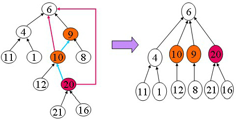

```c++
    int findFather(int x){
        int r = x;
        //get the root of x
        while(father[r] != r)
            r = father[r];
        int i=x;
        //update the nodes in searching path
        while(i != r){
            j = father[i];
            father[i] = r;
            i = j;
        }
        return r;
    }
```

> 合并

两个集合合并，也就是2棵树合并，为了降低合并后的树的深度，一般采取将深度小的树的树根作为深度大的树的树根的孩子节点

增加辅助空间记录树的深度

```c++
    void unionSet(int x,int y){
        x = findFather(x);
        y = findFather(y);
        if(x == y)
            return ;
        if(rank[x] > rank[y]){
            father[y] = x;
        }else{
            if(rank[x] == rank[y])
                rank[y]++;
            father[x] = y;
        }
    }
```

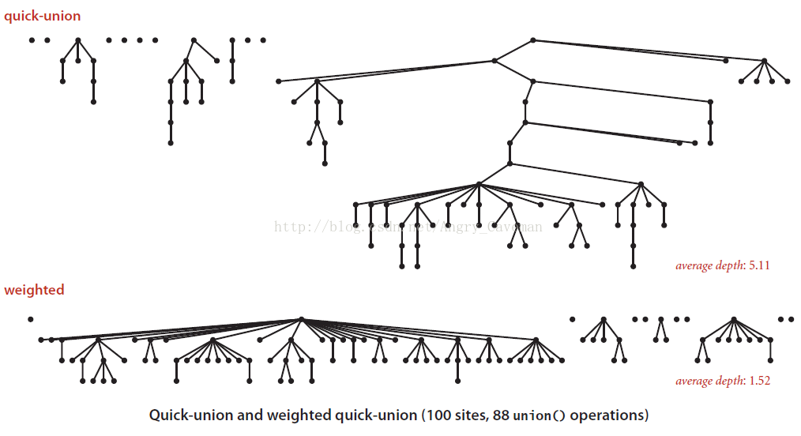

Kruskal算法

> 最小生成树：
> 设G=(V,E)是一个无向连通网，生成树上各边的权值之和称为该生成树的代价，在G的所有生成树中，代价最小的生成树成为最小生成树(minimal spanning tree)

算法流程：

- 将全部边按照权值由小到大排序。
- 按顺序（边权由小到大的顺序）考虑每条边，只要这条边和我们已经选择的边不构成圈，就保留这条边，否则放弃这条边。

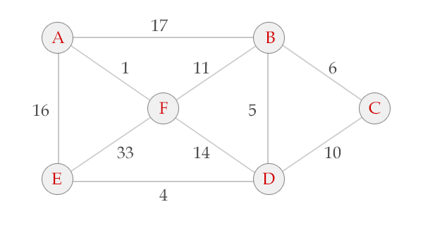
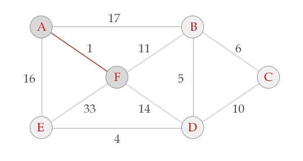
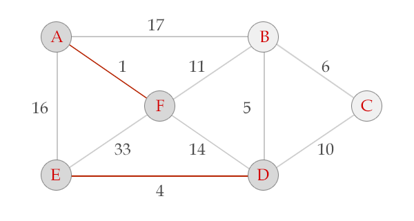
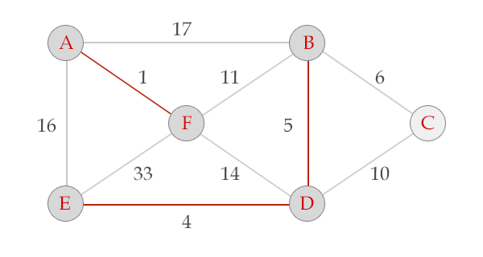
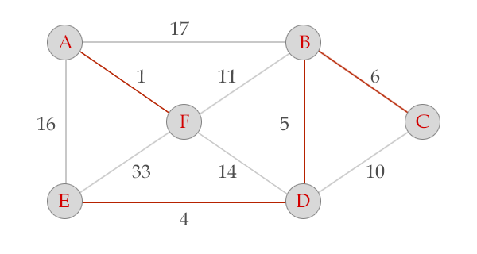
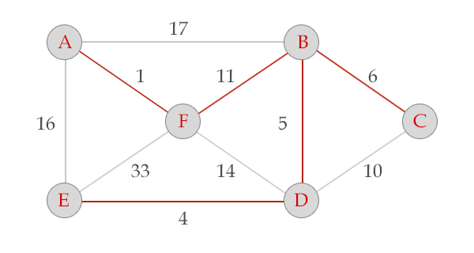

```java
    // 贪心法+并查集=最小生成树
    import java.util.Arrays;
    import java.util.Comparator;
    import java.util.Scanner;

    public class Kruskal {

        /**
        * @param args
        */
        static int  parent[]=new int[10];
        static int  n,m;
        class Edge{
            int u,v,w;
        }
        class cmp implements Comparator<Edge>{

            @Override
            public int compare(Edge A, Edge B) {
                // TODO Auto-generated method stub
                if(A.w<B.w){
                    return -1;
                }else if(A.w>B.w){
                    return 1;
                }else{
                    return 0;
                }
        }

        }
        public static void main(String[] args) {
            // TODO Auto-generated method stub
            Scanner scan=new Scanner(System.in);

            Kruskal kr=new Kruskal();
            while(scan.hasNext()){
                n=scan.nextInt();
                m=scan.nextInt();
                Edge[] edge=new Edge[m];
                for(int i=0;i<m;i++){
                    Edge e=kr.new Edge();
                    e.u=scan.nextInt();
                    e.v=scan.nextInt();
                    e.w=scan.nextInt();
                    edge[i]=e;
                }
                Arrays.sort(edge,0,m,kr.new cmp());
                kruskal(edge);  
            }
        }
        private static void kruskal(Edge[] edge) {
            // TODO Auto-generated method stub
            int sumWeight = 0;  
            int num = 0;  
            int u,v;  
            UFset();
            for(int i=0;i<m;i++){
                u=edge[i].u;
                v=edge[i].v;
                //查找u v是否在一个集合里
                if(find(u)!=find(v)){
                    sumWeight += edge[i].w;  
                    num ++;
                    merge(u, v); //把这两个边加入一个集合。
                }
            }
            System.out.println(sumWeight);
        }
        private static void merge(int a, int b) {
            // TODO Auto-generated method stub
            int r1 = find(a);  
            int r2 = find(b);  
            int tmp = parent[r1] + parent[r2]; //两个集合节点数的和  
            if(parent[r1] > parent[r2]){  
                parent[r1] = r2;  
                parent[r2] = tmp;  
            }else{  
                parent[r2] = r1;  
                parent[r1] = tmp;  
            }  
        }
        private static int find(int i) {
            // TODO Auto-generated method stub
            int temp;
            //查找位置
            for(temp = i; parent[temp] >= 0; temp = parent[temp]);
            //压缩路径  
            while(temp != i){  
                int t = parent[i];  
                parent[i] = temp;  
                i = t;  
            }  
            return temp;  
        }
        private static void UFset() {
            // TODO Auto-generated method stub
            for(int i=1; i<=n; i++) parent[i] = -1;  
        }

    }
```
