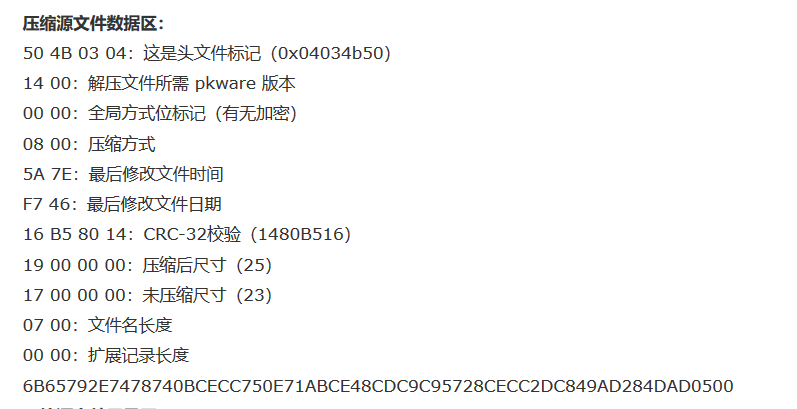
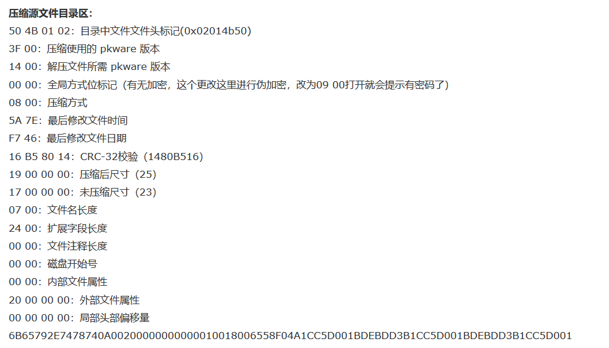
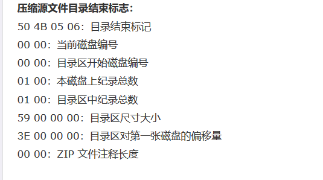

# 常见文件头

## 各种格式的文件

```shell
JPEG (jpg)，文件头：FF D8 FF
PNG (png)，文件头：89 50 4E 47     [参考：png文件头详解]89 50 4e 47 0d 0a 1a 0a
GIF (gif)，文件头：47 49 46 38
Windows Bitmap (bmp)，文件头：42 4D [参考：bmp文件格式详解]42 4D 36 0C 30 00 00 00 00 00 36 00 00 00 28 00 00 00 56 05 00 00 00 03 00 00 01 00 18 00 00 00 00 00 00 04 00 00 00 00 00 00 00 00 00 00 00 00 00 00 00 00 00 00
python反编译文件pyc的头：03 F3 0D 0A  
pyd的文件头：4D 5A 90 00
ZIP Archive (zip)，文件头：50 4B 03 04 ascii码部分是PK，可以直接根据PK判断是zip文件，也有可能是doc文件
rar文件: 52 61 72 21
7z文件头：37 7A BC AF 27 1C
MS Word/Excel (xls.or.doc)，文件头：D0CF11E0
CAD (dwg)，文件头：41433130
Adobe Photoshop (psd)，文件头：38425053
Rich Text Format (rtf)，文件头：7B5C727466
XML (xml)，文件头：3C3F786D6C
HTML (html)，文件头：68746D6C3E
Email [thorough only] (eml)，文件头：44656C69766572792D646174653A
Outlook Express (dbx)，文件头：CFAD12FEC5FD746F
Outlook (pst)，文件头：2142444E
MS Access (mdb)，文件头：5374616E64617264204A
WordPerfect (wpd)，文件头：FF575043
Postscript (eps.or.ps)，文件头：252150532D41646F6265
Adobe Acrobat (pdf)，文件头：255044462D312E
Quicken (qdf)，文件头：AC9EBD8F
Windows Password (pwl)，文件头：E3828596
RAR Archive (rar)，文件头：52617221
Wave (wav)，文件头：57415645
AVI (avi)，文件头：41564920
Real Audio (ram)，文件头：2E7261FD
Real Media (rm)，文件头：2E524D46
MPEG (mpg)，文件头：000001BA
MPEG (mpg)，文件头：000001B3
Quicktime (mov)，文件头：6D6F6F76
Windows Media (asf)，文件头：3026B2758E66CF11
MIDI (mid)，文件头：4D546864
```

## 压缩文件




