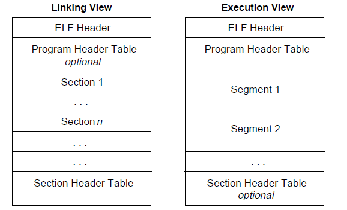
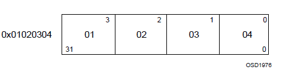

# ELF 文件

## ELF

ELF （Executable and Linkable Format）文件，即 Linux 中的目标文件，主要有以下三种类型：

- 可重定位文件（Relocatable File），包含由编译器生成的代码以及数据。链接器会将它与其它目标文件链接起来从而创建可执行文件或者共享目标文件。在 Linux 系统中，这种文件的后缀一般为 .o
- 可执行文件（Executable File），就是我们通常在 Linux 中执行的程序。
- 共享目标文件（Shared Object File），包含代码和数据，这种文件是我们所称的库文件，一般以 .so 结尾。一般情况下，它有以下两种使用情景：
  - 链接器（Link eDitor, ld）可能会处理它和其它可重定位文件以及共享目标文件，生成另外一个目标文件。
  - 动态链接器（Dynamic Linker）将它与可执行文件以及其它共享目标组合在一起生成进程镜像。

### 文件格式



链接视图：

- ELF 头部（ ELF Header），给出了整个文件的组织情况
- 程序头部表（Program Header Table），如果存在的话它会告诉系统如何创建进程。用于生成进程的目标文件必须具有程序头部表，但是重定位文件不需要这个表。
- 节区部分，包含指令、数据、符号表、重定位信息等等。
- 节区头部表（Section Header Table），包含了描述文件节区的信息，每个节区在表中都有一个表项，会给出节区名称、节区大小等信息。用于链接的目标文件必须有节区头部表


执行视图与链接视图主要区别在于没有了 section，而有了多个 segment

> 注意：尽管图中是按照 ELF 头，程序头部表，节区，节区头部表的顺序排列的。但实际上除了 ELF 头部表以外，其它部分都没有严格的的顺序。

### 数据形式

ELF 文件格式支持 8 位 / 32 位体系结构，可以通过拓展来支持更小或者更大位数的处理器架构。因此，目标文件中包含了表明目标文件所使用的架构的控制数据。目标文件中其他的数据采用目的处理器的格式进行编码，与在何种机器上创建没有关系。
目标文件中的所有数据结构都遵从“自然”大小和对齐规则：

名称 | 长度 | 对齐方式 | 用途
:--:|:--:|:--:|:--:
Elf32_Addr | 4 | 4 | 无符号程序地址
Elf32_Half | 2 | 2 | 无符号半整型
Elf32_Off | 4 | 4 | 无符号文件偏移
Elf32_Sword | 4 | 4 | 有符号大整型
Elf32_Word | 4 | 4 | 无符号大整型
unsigned char | 1 | 1 | 无符号小整型

数据结构可以包含显式地补齐来确保 4 字节对象按 4 字节对齐，强制数据结构的大小是 4 的整数倍等等。数据同样适用是对齐的。因此，包含一个 Elf32_Addr 类型成员的结构体会在文件中的 4 字节边界处对齐。

## 32位的ELF

### ELF Header

ELF Header 描述了 ELF 文件的概要信息，利用这个数据结构可以索引到 ELF 文件的全部信息，数据结构如下：

```c++
    #define EI_NIDENT   16

    typedef struct {
        unsigned char   e_ident[EI_NIDENT];
        ELF32_Half      e_type;
        ELF32_Half      e_machine;
        ELF32_Word      e_version;
        ELF32_Addr      e_entry;
        ELF32_Off       e_phoff;
        ELF32_Off       e_shoff;
        ELF32_Word      e_flags;
        ELF32_Half      e_ehsize;
        ELF32_Half      e_phentsize;
        ELF32_Half      e_phnum;
        ELF32_Half      e_shentsize;
        ELF32_Half      e_shnum;
        ELF32_Half      e_shstrndx;
    } Elf32_Ehdr;
```

### Program Header Table

Program Header Table 是一个结构体数组，描述了一个段或者其它系统在准备程序执行时所需要的信息。其中，ELF 头中的 e_phentsize 和 e_phnum 指定了该数组每个元素的大小以及元素个数。一个目标文件的段包含一个或者多个节。程序的头部只有对于可执行文件和共享目标文件有意义。

```c++
    typedef struct {
        ELF32_Word  p_type;
        ELF32_Off   p_offset;
        ELF32_Addr  p_vaddr;
        ELF32_Addr  p_paddr;
        ELF32_Word  p_filesz;
        ELF32_Word  p_memsz;
        ELF32_Word  p_flags;
        ELF32_Word  p_align;
    } Elf32_Phdr;
```

字段 | 说明
:--: | :--:
p_type|该字段为段的类型，或者表明了该结构的相关信息。
p_offset|该字段给出了从文件开始到该段开头的第一个字节的偏移。
p_vaddr|该字段给出了该段第一个字节在内存中的虚拟地址。
p_paddr|该字段仅用于物理地址寻址相关的系统中， 由于”System V” 忽略了应用程序的物理寻址，可执行文件和共享目标文件的该项内容并未被限定。
p_filesz|该字段给出了文件镜像中该段的大小，可能为 0。
p_memsz|该字段给出了内存镜像中该段的大小，可能为 0。
p_flags|该字段给出了与段相关的标记。
p_align|可加载的程序的段的 p_vaddr 以及 p_offset 的大小必须是 page 的整数倍。该成员给出了段在文件以及内存中的对齐方式。如果该值为 0 或 1 的话，表示不需要对齐。除此之外，p_align 应该是 2 的整数指数次方，并且 p_vaddr 与 p_offset 在模 p_align 的意义下，应该相等。

### Section Header Table

这个数据结构在elf文件的尾部，用于定位 ELF 文件中的每个节区的具体位置。ELF 头中的 e_shoff 项给出了从文件开头到节头表位置的字节偏移。e_shnum 给出了节头表包含的项数；e_shentsize 给出了每一项的字节大小。

```c++
    typedef struct {
        ELF32_Word      sh_name;
        ELF32_Word      sh_type;
        ELF32_Word      sh_flags;
        ELF32_Addr      sh_addr;
        ELF32_Off       sh_offset;
        ELF32_Word      sh_size;
        ELF32_Word      sh_link;
        ELF32_Word      sh_info;
        ELF32_Word      sh_addralign;
        ELF32_Word      sh_entsize;
    } Elf32_Shdr;
```

成员|说明
:--:|:--:
sh_name|节名称，是节区头字符串表节区中（Section Header String Table Section）的索引，因此该字段实际是一个数值。在字符串表中的具体内容是以 NULL 结尾的字符串。
sh_type|根据节的内容和语义进行分类，具体的类型下面会介绍。
sh_flags|每一比特代表不同的标志，描述节是否可写，可执行，需要分配内存等属性。
sh_addr|如果节区将出现在进程的内存映像中，此成员给出节区的第一个字节应该在进程镜像中的位置。否则，此字段为 0。
sh_offset|给出节区的第一个字节与文件开始处之间的偏移。SHT_NOBITS 类型的节区不占用文件的空间，因此其 sh_offset 成员给出的是概念性的偏移。
sh_size|此成员给出节区的字节大小。除非节区的类型是 SHT_NOBITS ，否则该节占用文件中的 sh_size 字节。类型为 SHT_NOBITS 的节区长度可能非零，不过却不占用文件中的空间。
sh_link|此成员给出节区头部表索引链接，其具体的解释依赖于节区类型。
sh_info|此成员给出附加信息，其解释依赖于节区类型。
sh_addralign|某些节区的地址需要对齐。例如，如果一个节区有一个 doubleword 类型的变量，那么系统必须保证整个节区按双字对齐。也就是说，sh_addr%sh_addralign=0。目前它仅允许为 0，以及 2 的正整数幂数。 0 和 1 表示没有对齐约束。
sh_entsize|某些节区中存在具有固定大小的表项的表，如符号表。对于这类节区，该成员给出每个表项的字节大小。反之，此成员取值为 0。

### Sections

节区包含目标文件中除了 ELF 头部、程序头部表、节区头部表的所有信息。

- 每个节区都有对应的节头来描述它。但是反过来，节区头部并不一定会对应着一个节区。
- 每个节区在目标文件中是连续的，但是大小可能为 0。
- 任意两个节区不能重叠，即一个字节不能同时存在于两个节区中。
- 目标文件中可能会有闲置空间（inactive space），各种头和节不一定会覆盖到目标文件中的所有字节，闲置区域的内容未指定。

名称|类型|属性|含义
:--:|:--:|:--:|:--:
.comment|SHT_PROGBITS||包含版本控制信息。
.debug|SHT_PROGBITS||此节区包含用于符号调试的信息。
.dynamic|SHT_DYNAMIC|SHF_ALLOC SHF_WRITE|此节区包含动态链接信息。SHF_WRITE 位设置与否是否被设置取决于具体的处理器。
.dynstr|SHT_STRTAB|SHF_ALLOC|此节区包含用于动态链接的字符串，大多数 情况下这些字符串代表了与符号表项相关的名称。
.dynsym|SHT_DYNSYM|SHF_ALLOC|此节区包含动态链接符号表。
.got|SHT_PROGBITS||此节区包含全局偏移表。
.line|SHT_PROGBITS||此节区包含符号调试的行号信息，描述了源程序与机器指令之间的对应关系，其内容是未定义的。
.plt|SHT_PROGBITS||此节区包含过程链接表（procedure linkage table）。
.relname|SHT_REL||这些节区中包含重定位信息。如果文件中包含可加载的段，段中有重定位内容，节区的属性将包含 SHF_ALLOC 位，否则该位置 0。传统上 name 根据重定位所适用的节区给定。例如 .text 节区的重定位节区名字将是：.rel.text 或者 .rela.text。
.relaname|SHT_RELA
.shstrtab|SHT_STRTAB||此节区包含节区名称。

- 以 “.” 开头的节区名称是系统保留的，当然应用程序也可以使用这些节区。为了避免与系统节区冲突，应用程序应该尽量使用没有前缀的节区名称。
- 目标文件格式允许定义不在上述列表中的节区，可以包含多个名字相同的节区。
- 保留给处理器体系结构的节区名称一般命名规则为：处理器体系结构名称简写 + 节区名称。其中，处理器名称应该与 e_machine 中使用的名称相同。例如 .FOO.psect 节区是 FOO 体系结构中的 psect 节区。

### Relocation Related Sections

链接器在处理目标文件时，需要对目标文件中的某些位置进行重定位，即将符号指向恰当的位置，确保程序正常执行。
在 ELF 文件中，对于每一个需要重定位的 ELF 节都有对应的重定位表，比如说 .text 节如果需要重定位，那么其对应的重定位表为 .rel.text。

#### .rel(a).dyn & rel(a).plt

.rel.dyn 包含了动态链接的二进制文件中需要重定位的变量的信息，这些信息在加载的时候必须完全确定。而 .rel.plt 包含了需要重定位的函数的信息。两类重定位节都使用如下结构

```c++
typedef struct {
    Elf32_Addr        r_offset;
    Elf32_Word       r_info;
} Elf32_Rel;

typedef struct {
    Elf32_Addr     r_offset;
    Elf32_Word    r_info;
    Elf32_Sword    r_addend;
} Elf32_Rela;
```

Elf32_Rela 类型的表项包含明确的补齐信息。 Elf32_Rel 类型的表项在将被修改的位置保存隐式的补齐信息。
一般来说，32 位程序只使用 Elf32_Rel，64 位程序只使用 Elf32_Rela。

成员|说明
:--:|:--:
r_offset|此成员给出了需要重定位的位置。对于一个可重定位文件而言，此值是从需要重定位的符号所在节区头部开始到将被重定位的位置之间的字节偏移。对于可执行文件或者共享目标文件而言，其取值是需要重定位的虚拟地址，一般而言，也就是说我们所说的 GOT 表的地址。
r_info|此成员给出需要重定位的符号的符号表索引，以及相应的重定位类型。 例如一个调用指令的重定位项将包含被调用函数的符号表索引。如果索引是 STN_UNDEF，那么重定位使用 0 作为 “符号值”。此外，重定位类型是和处理器相关的。
r_addend|此成员给出一个常量补齐，用来计算将被填充到可重定位字段的数值。

当程序代码引用一个重定位项的重定位类型或者符号表索引时，这个索引是对表项的 r_info 成员应用 ELF32_R_TYPE 或者 ELF32_R_SYM 的结果。 也就是说 r_info 的高三个字节对应的值表示这个动态符号在. dynsym 符号表中的位置。

```c++
#define ELF32_R_SYM(i)    ((i)>>8)
#define ELF32_R_TYPE(i)   ((unsigned char)(i))
#define ELF32_R_INFO(s,t) (((s)<<8)+(unsigned char)(t))
```

重定位节区会引用两个其它节区：符号表、要修改的节区。节区头部的 sh_info 和 sh_link 成员给出相应的关系。

#### 重定位类型

重定位表项描述了如何修改相关的指令与数据域，其对应的比特位如下


其中，word32 指定了一个 32 比特的变量，占用 4 个字节，对齐方式任意。这些值使用和 Intel 架构中其它字类似的字节序，一般都是小端序。



- A(addend) 用来计算可重定位字段的取值的补齐。
- B(base) 表示共享目标文件在执行过程中被加载到内存中的基地址。一般来说，共享目标文件的虚拟基地址为 0，但是在执行时，其地址却会发生改变。
- G(Global) 表示在执行时重定位项的符号在全局偏移表中的偏移。
- GOT (global offset table) 表示全局偏移表（GOT）的地址。
- L (linkage) 表示过程链接表项中一个符号的节区偏移或者地址。过程链接表项会把函数调用重定位到正确的目标位置。链接编辑器会构造初始的过程链接表，然后动态链接器在执行过程中会修改这些项目。
- P (place) 表示被重定位（用 r_offset 计算）的存储单元的位置（节区偏移或者地址）。
- S (symbol) 表示索引位于重定位项中的符号的取值。

重定位项的 r_offset 取值为受影响的存储单元的第一个字节的偏移或者虚拟地址。重定位类型给出需要修改的比特位以及如何计算它们的值

名称|值|域|计算|含义
:--|:--|:--|:--|:--
R_386_NONE|0|无|无
R_386_32|1|word32|`S + A`
R_386_PC32|1|word32|`S + A - P`
R_386_GOT32|1|word32|`G + A - P`|该重定位类型计算从全局偏移表基址到符号的全局偏移表项的距离。另外，它还命令链接器创建一个全局偏移表。
R_386_PLT32|1|word32|`L + A - P`|该重定位类型计算符号的过程链接表项地址。另外，它还命令链接器创建一个过程链接表。
R_386_COPY|5|无|无|该重定位类型由链接器为动态链接过程创建。它的偏移项指向可写段中的位置。符号表规定这种符号应既存在于当前目标文件又该存在于共享目标文件中。在执行过程中，动态链接器将与该共享目标符号相关的数据复制到由上述偏移量指定的位置。
R_386_GLOB_DAT|6|word32|S|该重定位类型用于把一个全局偏移表中的符号设置为指定符号的地址。这个特殊的重定位类型允许确定符号和全局偏移表项之间的关系。
R_386_JMP_SLOT|7|word32|S|该重定位类型由链接器为动态链接过程创建。它的偏移项给出了相应过程链接表项的位置。动态链接器修改过程链接表，从而把程序控制权转移到上述指出的符号地址。
R_386_RELATIVE|8|word32|`B + A`|该重定位类型由链接器为动态链接过程创建。它的偏移项给出了共享目标中的一个包含了某个代表相对地址的值的位置。动态链接器通过把共享目标文件装载到的虚拟地址与上述相对地址相加来计算对应虚拟地址。这种类型的重定位项设置符号表索引为 0。
R_386_GOTOFF|9|word32|`S + A - GOT`|该重定位类型计算符号值与全局偏移表地址之间的差。此外，它还通知链接器创建一个全局偏移表。
R_386_GOTPC|10|word32|`S + A - P`|该重定位类型与R_386_PC32 类似，只不过它在计算时使用全局偏移表的地址。正常情况下，该重定位表项中被引用的符号是_GLOBAL_OFFSET_TABLE_ ，它会命令链接器创建一个全局偏移表。

#### Global Offset Table

GOT 表在 ELF 文件中分为两个部分

- .got，存储全局变量的引用。
- .got.plt，存储函数的引用。

其相应的值由能够解析. rel.plt 段中的重定位的动态链接器来填写。
GOT 表中的第 0 项包含动态结构的地址，用符号 _DYNAMIC 来进行引用。
在 Linux 的实现中，.got.plt 的前三项的具体的含义如下

- `GOT[0]`，.dynamic 的地址。
- `GOT[1]`，指向内部类型为 link_map 的指针，只会在动态装载器中使用，包含了进行符号解析需要的当前 ELF 对象的信息。每个 link_map 都是一条双向链表的一个节点，而这个链表保存了所有加载的 ELF 对象的信息。
- `GOT[2]`，指向动态装载器中 _dl_runtime_resolve 函数的指针。

#### Procedure Linkage Table

GOT 表用来将位置独立的地址重定向为绝对地址，与此类似，PLT 表将位置独立的函数重定向到绝对地址,plt主要包括两部分：

- .plt，与常见导入的函数有关，如 read 等函数。
- .plt.got，与动态链接有关系。

在动态链接下，程序模块之间包含了大量的函数引用，程序开始执行前，动态链接会耗费不少时间用于解决模块之间的函数引用的符号查找以及重定位。 ELF 采用了一种延迟绑定的做法，其基本思想是函数第一次被用到时才进行绑定（符号查找，重定位等），如果没有用则不进行绑定。所以程序开始执行前，模块间的函数调用都没有进行绑定，而是需要用到时才由动态链接器负责绑定。

绝对地址的过程链接表如下：

```s
.PLT0:pushl got_plus_4
      jmp   *got_plus_8
      nop; nop
      nop; nop
.PLT1:jmp   *name1_in_GOT
      pushl $offset@PC
      jmp   .PLT0@PC
.PLT2:jmp   *name2_in_GOT
      push  $offset
      jmp   .PLT0@PC
      ...
```

位置无关的过程链接表的地址如下:

```s
.PLT0:pushl 4(%ebx)
      jmp   *8(%ebx)
      nop; nop
      nop; nop
.PLT1:jmp   *name1_in_GOT(%ebx)
      pushl $offset
      jmp   .PLT0@PC
.PLT2:jmp   *name2_in_GOT(%ebx)
      push  $offset
      jmp   .PLT0@PC
      ...
```

在 Linux 的设计中，第一个之后的 PLT 条目进行了如下的函数调用

```c++
_dl_runtime_resolve(link_map_obj, reloc_index)
```

32位下过程如下：

- 根据 reloc_index 计算相应的重定位表项：`Elf32_Rel *reloc = JMPREL + index`
- 根据得到的重定位表项的 r_info 得到对应的符号在符号表中的索引：`(reloc->r_info)>>8`
- 继而得到对应的符号：`Elf32_Sym *sym = &SYMTAB[((reloc->r_info)>>8)]`
- 判断符号的类型是否为 `R_386_JMP_SLOT：assert (((reloc->r_info)&0xff) == 0x7 )`
- `if ((ELFW(ST_VISIBILITY) (sym->st_other), 0) == 0)`
  - `if (sym->st_other) & 3 == 0 )`
  - 判断该符号是否已经解析过了，如果解析过，就不会再去执行 lookup 操作。
- 得到符号的版本，如果 ndx 为 0 的话，会直接使用 local symbol。
  - `uint16_t ndx = VERSYM[(reloc->r_info) >> 8]`
  - `r_found_version *version = &l->l_version[ndx]`
- 根据 name 来寻找相应函数在库中的地址。
  - `name = STRTAB + sym->st_name`
