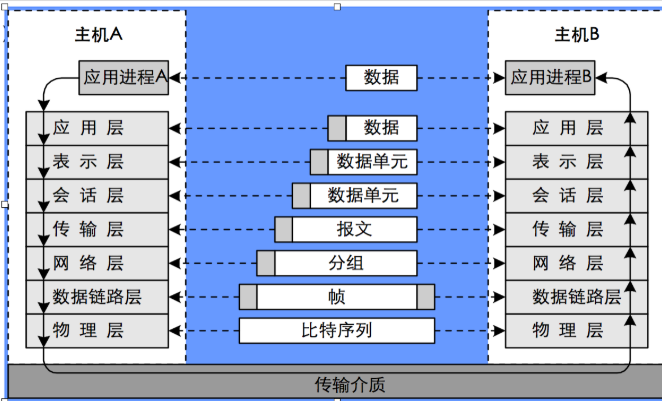
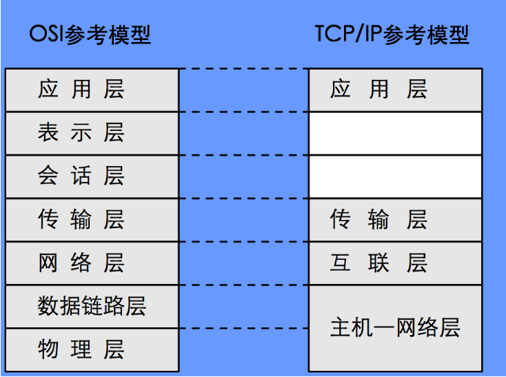
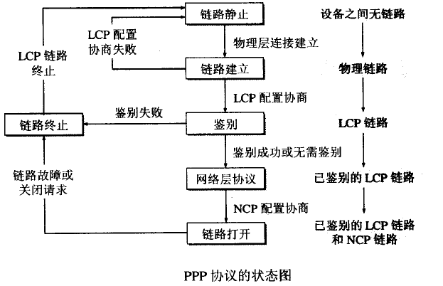
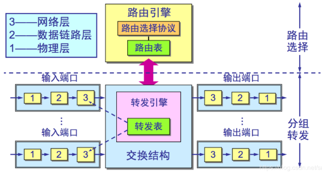
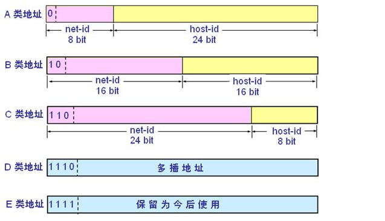
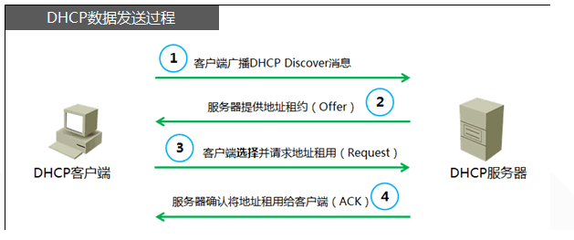

# 计算机网络基础

## 计算机网络概念

1. 计算机网络是指自主计算机的互联集合；
2. 自主计算机：指分布在不同地理位置的多台独立的主机；
3. 互联：指使用通信介质和网络设备将计算机相互连接起来，遵循共同的网络协议，实现通信；
4. 计算机网络是网络硬件和网络协议的统一体。

## 网络交换技术

1. 电路交换：面向连接的
2. 报文交换：基于存储转发原理
    - 报文交换优点：
        报文交换不需要事先建立连接，可以直接发送数据，比较灵活；
    每个报文分段占用线路。
    - 报文交换缺点：
        时延要比电路交换大；要完整地接收传来地整个报文，因此要求交换机有较大缓冲区。
3. 分组交换：把较长地报文划分成较短的“分组”，以“分组”为数据传输单元
    - 分组交换特点：
        分组分段占用通信线路，通信资源利用率高；每个分组独立传输灵活性好，网络适应能力强。
    - 分组交换技术适合计算机网络

## 网络拓扑结构

1. 星型拓扑：
    - 由一个中心节点和一些外围节点组成；
    - 缺点：中心节点如果故障，则整个网络无法正常工作。
2. 环形拓扑：
    - 节点分布在一个闭合环形线路上，数据沿一个方向环绕逐节点传递；
    - 缺点：可靠性差，只要一个节点故障，就会影响整个网络的运行。
3. 总线型拓扑：
    - 一条公告线路作为传输总线，每个节点连接到公共总线上；
    - 缺点：存在总线争用的问题，节点增多时网络效率低。
4. 树形拓扑：
    - 形状像一棵倒置的树，结点按层次进行连接
    - 缺点：网络可靠性差，一旦节点故障，则整个网络瘫痪。
5. 网状型拓扑：
    - 每个节点之间都有一条线路相连，应用于广域网；
    - 缺点：控制复杂。

## 信息、数据、信号

1. 信息发送前要编码成数据，数据要用信号表示才能发送到对方；
2. 对方从信号中还原出数据，进而得到信息。

## 数据传输方式：并行传输、串行传输

1. 并行传输：是指在两点之间的适当数量的并行路径上，一组信号元的同时传输；
2. 串行传输：是指信号元在两点之间的单一路径上的顺序传输。

## 数据传输方式：单工、半双工、全双工

1. 单工传输：信息只能由一方A传到另一方B，则称为单工；
2. 半双工传输：信息既可由A传到B，又能又B传到A，但只能由一个方向上的传输存在，成为半双工；
3. 全双工传输：线路上存在A到B和B到A的双向信号传输，则称为全双工。（发送方和接收方可以同时完成发送和接收的任务）

## 传输介质

1. 双绞线：是由两条相互绝缘的导线按照一定的密度互相缠绕在一起而制作成的一种通用配线。局域网中所使用的双绞线分为两类：屏蔽双绞线（STP）和非屏蔽双绞线（UTP）
2. 同轴电缆
3. 光纤
4. 无线介质
5. 双绞线和RJ-45接口：
    - RJ-45接口是一种能沿固定方向插入并自动防止脱落的塑料接头；
    - 每条双绞线的两端，按照一定的线序标准（568A标准或568B标准），连接好水晶头后，便可连接网卡、集线器、交换机等设备上的RJ-45接口。
    - 正线：T568A--T568A;反线：T568A--T568B(反线是用来连接相同类设备的)

## 网络体系结构

1. 相互通信的两个计算机系统必须高度协调工作才行，而这种“协调”是相当复杂的；
2. ==分层== 可将庞大而复杂的问题，转化为若干较小的局部问题，而这些较小的局部问题就比较易于研究和处理；
3. 计算机网络的 ==体系结构== 是计算机网络的各层次及其协议的集合；
4. OSI参考模型：理论模型
    - osi参考模型定义网络通信的层次结构、层次之间的相互关系与各层提供的服务；
    - 只要遵循osi标准，一个系统就可以和位于世界上任何地方的、也遵循这同一标准的其他任何系统进行通信；
    - 分层原则：
        - 网络中各结点都具有 ==相同的层次==；
        - 不同结点的同等层具有==相同的功能==；
        - 每一结点内相邻层之间通过==接口==通信；
        - 每层可以使用下层提供的==服务==，并向上层提供服务；
        - 不同结点的对等层通过==协议==来实现对等层次之间的通信。

    - 层次结构

        层数        |名称
        --|----
        第7层  | 应用层
        第6层  | 表示层
        第5层  | 会话层
        第4层  | 运输层
        第3层  | 网络层
        第2层  |数据链路层
        第1层  | 物理层

        - 物理层（physical layer）：利用传输介质实现比特序列的传输；
        - 数据链路层（data link layer）：采用差错控制与流量控制方法，使得有差错的物理线路变成无差错的数据链路；
        - 网络层（network layer）：实现路由选择、分组转发与拥塞控制等功能，为“分组”传输选择“最佳”的路由；
        - 运输层（transport layer）：向高层用户提供可靠的“端-端”通信服务，向高层屏蔽下层数据通信的具体细节；
        - 会话层（session layer）：维护两个通信计算机之间的进程通信，管理数据交换；
        - 表示层（presentation layer）：处理两个通信的计算机系统的数据表示方式，完成数据的格式变换、加密与解密、压缩与恢复；
        - 应用层（application layer）：为应用软件提供多种网络服务，例如万维网、文件传输、电子邮件与其他服务等。
        - 模型在整个网络通信过程中所实现的过程：

            

5. TCP/IP参考模型：因特网标准
    - 层次结构：

        层次结构|
        --
        |应用层   |
        |运输层   |
        |运输层   |
        |互联网层 |
        网络接口层|

    - 网络接口层： 是TCP/IP参考模型的最低层，它负责通过网络发送和接收IP数据包，相当于OSI参考模型的最低两层：数据链路层和物理层；
    - 互联网层： 使用IP协议提供“尽力而为（best effort）”的网络分组传输服务。将运输层报文段封装成IP数据包，选择适当的发送路径，并将数据包转发到下一个结点，相当于OSI参考模型中的网络层；
    - 运输层：负责在会话的进程之间建立和维护“端-端”的连接。定义了两种不同的协议（TCP）与用户数据包协议（UDP）；
    - 应用层： 和OSI参考模型的应用层类似，为应用软件提供多种网络服务，包含了OSI参考模型中的应用层、表示层和会话层的功能；

6. 两种参考模型的比较：

OSI参考模型————TCP/IP参考模型
    - OSI参考模型：首先定义了一个完整的框架，然后才在这个基础上去实现具体的协议；
    - TCP/IP的参考模型：首先基于因特网通信的需求，实现了一些具体的协议，然后在此基础上再去完善其的框架结构，TCP/IP是目前因特网实际的通信标准；
    

## 局域网的概念

1. 根据网络规模分类：
    - 广域网
        - 覆盖范围大、传输距离远、传输率低、误码率高；
    - 域域网
        - 覆盖范围介于局域网和广域网之间，几公里到几十公里；
    - 局域网：局域区域范围内的计算机网络
        - 范围：几米至几公里，一个或相邻的建筑物内；
        - 特点：覆盖范围小，传输速率高，误码率低；
        - 多用于单位内部网络建设。
2. 局域网常用的拓扑结构：总线型、星型和环型三种，使用最多的是总线型。
3. 对于局域网的体系结构来说，它本身是一种通信的网络，所以它只涉及到OSI参考模型中的数据链路层、物理层，它并不涉及高层次的网络。
4. IEEE802委员会将局域网分层两个子层：MAC子层和LLC子层
    - MAC子层：与接入到传输媒体有关的内容都放在MAC子层，主要用来解决多个节点如何使用共享介质的问题；
    - LLC子层：与媒体接入无关的部分集中在LLC子层，其主要功能是数据链路的建立和释放、LLC帧的封装和拆卸、差错控制、提供与高层的接口等。
5. 物理地址
    - 在局域网中，硬件地址又称为物理地址，或MAC地址，是在数据链路层使用的地址。MAC地址共48比特位，6字节。前三个字节代表的是生产厂商的编号，后三个字节代表的是网卡的编号；
    - MAC地址通常表示为12个16进制数，每两个16进制数之间用冒号隔开，08：00：20：0A:8C:6D就是一个MAC地址。
    - 物理地址的使用：
        - 数据链路层中数据以数据帧（frame）为单位进行传输。封装成帧就是在一段数据的前后分别添加首部和尾部，然后就构成了一个帧，确定2了帧的界限；
        - 数据帧首部中的源地址和目的地址就是用MAC地址来表示的；
        - 发送数据帧时，帧首部写入目的主机的MAC地址；
        - 收到数据帧后，首先检查帧首部的目的MAC地址，如果时发给自己的，就接收数据帧，否则就丢弃。
6. CSMA/CD协议
    - 目前局域网采用的最通用的通信协议标准是以太网（Ethernet）技术；
    - 最初的以太网是一个总线型的网络，任何一个主机发出的信号，都能被网络中其他所有的主机收到；
    - 以太网需要解决的问题：
        - 寻址问题：如何在广播式的网络完成一对一通信；
        - 冲突问题：两台主机上同时使用网络会发生冲突（CSMA/CD协议）
    - 以太网使用载波监听多路访问/冲突检测协议（CSAM/CD）来解决总线使用权的问题，处理网络中产生的冲突问题
        - 多路访问：网络中的每个节点都能访问总线，通过总线发送数据；
        - 载波侦听：在发送数据前，节点需要先“听”到总线没有数据信号，那么节点就将数据发送出去；
        - 冲突检测：在发送数据帧的同时，还需要继续监听总线，检测是否发生了冲突，如果检测到了冲突，就马上停止数据发送，等待一个随机的时间后再次重发。
    - 为什么需要“冲突检测”
        -当某个站监听到总线是空闲时，也可能总线并非真正是空闲的；
        - A向B发出的信息，要经过一定时间后才能传送到B；
        - B若在A发送的信息到达B之前发送自己的帧（因为这时B的载波监听检测不到A所发送的信息），则必然要在某个时间和A发送的帧发生碰撞。
    - 冲突带来的问题：
        - 碰撞的结果是两个帧都变的无用（冲突使得信号相互叠加，使得原来的信号被破坏），而这些无用的数据浪费了网络资源；
        - 节点在检测到冲突的时候，就马上停止数据发送，但是之前发出的数据还是会被接收方收到，而且是不完整的数据。所以接收方需要知道是否曾经发生冲突，收到的数据是否完整
            - 争用期（解决不完整数据问题）
            从开始发送数据，到检测到冲突，这段时间是不能确定的，它的最大值称为争用期，如果在争用期没有检测到冲突，以后也不会又冲突产生了；在以太网中，争用期=2倍总线长度/信号的传输速度；
            - 最短帧长（解决不完整数据问题）
            以太网取51.2us为争用期的长度，对于10MB/s以太网，在争用期内可发送512bit，即64字节、以太网在发送数据时，若前64字节没有发生冲突，则后续的数据不会发生冲突。（10MB/s*51.2us=512bit）    以太网规定了最短有效帧长为64字节，凡长度小于64字节的帧都是由于冲突而异常终止的无效帧。

## 广域网概念

1. 相距较远的局域网通过路由器与广域网相连组成了一个覆盖范围很广的互联网
2. 广域网ppp协议
    - 点对点协议（Point-to-point protocol）时因特网上广泛使用的数据链路层协议，用于点对点的链路；
    - ppp设计目的主要是用来通过拨号或专线方式建立点对点连接发送数据。用户使用拨号电话接入因特网时，一般都使用PPP协议（PPPOE）
    - PPP协议有三个组成部分
        - 一个将IP数据包封装到串行链路的方法；
        - 链路控制协议LCP（Link Control Protocol）
        - 网络控制协议 NCP（Network Control Protocol）
    - 数据封装
        - 标志字段：表示帧的开始和结束；
        - 地址字段：由于PPP协议用于点对点通信，不存在寻址的问题；
        - 控制字段：PPP协议不提供数据传输的可靠性，同时也没有流量控制和差错控制的功能；
        - 协议字段：PPP帧内可以封装多个协议的数据包，当封装某个协议的数据包时，就填写这个协议的编号；
        - FCS：帧校验字段，ppp采用CRC校验
    - 链路控制协议LCP
        - 数据链路的建立、配置、维护和终止都是由链路控制协议（LCP）来完成的，LCP包封装在PPP帧的数据字段中；
    - 认证协议
        - 口令认证协议（PAP）：非常简单，用户向系统发送用户名和口令，系统验证用户名和口令，如果正确就接收连接，否则就拒绝连接。认证是通过两次握手实现的；
        - 挑战握手协议（CHAP）：对PAP协议做了改进，不直接发送用户的密码。取代密码的是hash（哈希值）
            - 首先向用户发送一个CHAP包，数据包含一个随机数；
            - 用户收到后，使用事先定义好的函数作用于随机数和自己的口令，生成一个值，来将这个值和用户名放入CHAP包发给系统；
            - 系统收到后，根据其中的用户名查询对应的口令，用同一个函数对查到的口令和查询值进行运算，如果计算结果于用户的值相同，说明用户是合法用户，并且口令正确。
    - 网络控制协议NCP
        - ppp协议使用网络控制协议（NCP）来建立两端网络层的连接，协商网络层的选项和传递网络层数据。NCP不是一个协议，而是一组协议，包括TPCP、IP、IPX等；
        - 互联网协议控制协议（IPCP）主要用来协商网络层选项，设置用户的IP地址。报文在PPP帧中封装。
    - ppp协议的工作流程：
        - 当用户拨号接入ISP后，就建立了一条从用户PC机到ISP的物理连接。
        - 这时用户PC机向ISP发送一系列的LCP分组(封装成多个PPP帧)，以便建立LCP连接。
        - 这些分组及其响应选择了将要使用的一些PPP参数。
        - 接着还要进行网络层配置，NCP给新接入的用户PC机分配一个临时的IP地址。
        - 这样，用户PC机就成为因特网上的一个有IP地址的主机了。
        - 当用户通信完毕时，NCP释放网络层连接，收回原来分配出去的IP地址。
        - 接着，LCP释放数据链路层连接。
        - 最后释放的是物理层的连接
        

## 交换机工作原理

1. 交换机是工作在OSI数据链路层的设备。它的主要功能是MAC地址学通信过滤（数据帧单点转发避免回路功能；
2. 在每个交换机内部都维护有一张表，这个表记录了交换机上每个端口所连接主机的MAC地址信息；
3. 交换机收到一个数据帧后，能识别出这个帧的结构，根据帧的目的地址，将这个帧转发到对应的某个端口上去，而不是广播到其他所有端口；
4. 交换机MAC地址表
    - 交换机具有MAC地址学习功能。交换机就是通过识别数据帧的源MAC地址，学习到MAC地址和源端口的对应关系的，主要过程如下：
        - 当第一次使用交换机时，交换机MAC地址表是空表，没有任何记录，此时交换机会将源MAC地址与源端口建立映射，并将其写入交换机的MAC地址表中；
        - 将数据帧（含有目标MAC地址）从所有其他端口转发出去；
        - 当接收者接收到数据帧并返回信息时，交换机便记住对应的MAC地址与端口的映射，并将其对应关系写入MAC地址表中，以便下次的转发。
5. 交换机数据交换方式：
    - 交换机检测发送到每个交换机端口的数据帧，通过数据帧中的有关信息（源主机的MAC地址、目的主机的MAC地址），在交换机的内部建立一张MAC地址与端口映射表；
    - 交换机根据收到数据帧中的源MAC地址，首先查找MAC地址表，如果找到该映射项（对应的端口号），则更新映射的生存期；如果没有找到，则建立该地址同交换机端口的映射，并将其写入MAC地址表中；
    - 如果数据帧中的目的MAC地址在MAC地址表中找到，则判断该数据帧属于广播帧还是单播帧：如果是广播帧，则向所有端口（除就收该数据帧的端口外）转发该数据帧；如果是单播帧，则查找已有MAC地址表，根据MAC地址表中存在对应的映射，按照该映射项进行数据转发。一旦收到接收者返回的信息，便记住该MAC地址与端口的映射，并将数据帧通过该端口转发出去。

## 初识路由器

1. 路由器工作在OSI参考模型的第三层——网络层，具有网络层功能，它连接不同的网络，在网络之间转发IP数据包；
2. 路由器具有多个输入端口和多个输出端口。其任务是转发IP数据包（分组）。将路由器某个输入端口收到的分组，按照目的地，从路由器的某个输出端口转发给下一个跳路由器；
3. 路由器的使用：连接两个不同的局域网，并且是局域网接入广域网；
4. 路由器的分类：
    - 家用路由器（非模块化结构的）：
        - 功能比较简单，价格便宜；
        - 支持拨号，内置DHCP服务器（可以为共享上网计算机动态分配地址），并可进行静态地址分配。
    - 模块化结构的路由器：
        - 通常中高端路由器采用模块化结构，低端路由器采用非模块化结构；
        - 可以在中小型企业网中担当核心路由器。
5. 路由器端口
    - 路由器接口（端口）主要分三类：
        - 局域网端口：局域网接口主要用于路由器与局域网进行连接。RJ-45接口是最常见的端口，即双绞线以太网端口；
        - 广域网端口：路由器要实现与广域网连接。会先用到同步串口（Serial），这种端口连接网络的两端，到要求实时同步；
        - 配置端口：路由器的配置端口有“Console”和“Aux”端口两种。“console”端口常在本地配置路由器连接计算机时使用。使用Console线的一端连接路由器的Console口，另一端连接计算机，用户可通过计算机运行终端仿真程序，在本地进行路由器配置； “Aux”端口在路由器远程配置连接时使用。
6. 路由器工作原理：
    
    - 分组转发：是根据转发表来进行分组的处理，也就是将从端口收入的数据包根据它的目的地查找转发表从而从输出端口送出去；
    - 路由选择：根据相邻路由器之间通过路由协议实现相邻路由器相互学习，从而去生成一张路由表，转发表就是由路由表而来的，路由选择就是及时的维护和更新这张路由表，路由表是根具算法得到的：如果接收到的消息数据包的分组是属于路由消息的，路由器就会把这个信息放到路由选择功能中去完成路由表的生成；如果路由器收到的数据分组是本身的IP协议传递的数据包，他就会按照分组转发功能中的转发表去查找目的地地址，从合适的端口送出去
    - 主机和路由器是根据ip数据包的目的ip地址，通过查找路由表确定下一站；
7. 路由表
    - 路由表中记录了从如何达到其他网络的信息；
    - 每条路由表项主要由三部分组成：目的网络、子网掩码和下一站。

## VLAN基础知识

1. VLAN：虚拟局域网（virtual local area network）
    - VLAN是划分出来的逻辑网络，是第二层网络；
    - VLAN端口不受物理位置的限制；
    - VLAN隔离广播域。
2. 交换机上配置vlan——命令
配置VLAN命令示例：
    - Switch（config）#valn 10    //创建vlan 10
    - Switch（config-vlan）#exit
    - Switch（config）#interface f0/1   //进入F0/1端口
    - Switch（config-if）#switchport mode access    //端口模式
    - Switch（config-if）#switchport access vlan 10 //将端口F0/1划分到VLAN 10中
    - Switch# show vlan //显示端口信息

## 无线路由器

1. 无线路由器是应用于用户上网、带有无线覆盖功能的路由器；
2. 无线路由器可以看作一个转发器，将家中墙上接出的宽带网络信号通过天线转发给附近的无线网络设备（笔记本电脑、支持wifi的手机、平板以及所有带有WiFi功能的设备）
3. 一般的无线路由器信号范围为半径50米；
4. 无线路由器一般只能支持15-20个以内的设备同时在线使用；
5. 接口：
    - WAN口：UPLink到外部网络的接口；
    - LAN口：用来连接内部局域网有线设备。
6. 相关名词：
    - SSID：是无线网络的标识符，用来识别在特定无线网络上发现到的无线设备身份；
    - 信道：以无线信号作为传输媒体的数据信号传送通道。无线宽带路由器可在许多信道上运行。如802.11g、802.11b无线标准有11条到13条信道，但只有3条是非重叠信道（信道1、信道6、信道11），非重叠就意味着在这三个信道上数据干扰会更小一些。

## IP地址

1. 初始Ip地址
    - 为了在通信时能够互相识别，接入Internet中的每一台主机都被分配有一个唯一的标识——32位二进制地址，该地址称为Ip地址；
        - 一个Ip地址可以唯一确定ip网络中的一个站点；
        - 每个ip地址是一个32比特位（4字节）的二进制数字；
        - 采用了点分十进制的写法。
            - 机器中存放的IP地址是32位二进制代码；
            - 每隔8位（即一个字节）插入一个空格；
            - 将每八位的二进制数转换为十进制数；
            - 为了区分四个十进制数，在它们之间加上三个点（为了提高ip地址的可读性。
    - IP地址结构：
        - IP地址采用了层次结构的表达方式；
        - 每个IP地址分为两部分：网络号和主机号；
            - 网络号代表主机或路由器所处的物理网络；
            - 主机号代表所处物理网络中的编号；
            - 在相同的一个网段中，所有IP地址的网络号都相同，但所有IP地址的主机号必须不相同。
2. IP地址的分类：

    - A类地址
        - A类IP地址的第1字节表示网络ID，后三个字节表示主机ID；
        - 其中在网络ID中的第1字节中，第一位为“0”，主机号代表所处物理网络中的编号。
    - B类地址
        - B类地址前2个字节表示网络ID，后2个字节表示主机ID；
        - 其中在网络ID的第1个字节的前2位设为“10”，接下来的14位（从第3位到第16位结束）表示网络ID。
    - C类地址
        - c类地址前3个字节表示网络ID，后一个字节表示主机ID；
        - 其中，网络ID的第一个字节的前两位设为“110”，接下来的21位（从第4位到第24位）表示网络ID。
    - IP地址的使用范围

        网络类别  |最大网络数  |第一个可用的网络号  |最后一个可用的网络号  |每个网络中的最大主机数
        --|-----|-----|-----|-----|
        A|126（2^7^-2)      |1      |126        |16,777,214
        B|16,383(2^14^-1)   |128.0  |191.255    |65,534
        C|2,097,151(2^21^-1)|192.0.0|223.266.255|254

    - 子网掩码
        - 子网掩码是一个32比特位的数字，于ip地址是一一对应的，用来标识IP地址中哪些位是网络位，哪些位是主机位；
        - 子网掩码的格式同IP地址一样，由连续的“1”和连续的“0”组成。为了理解的方便，也采用点分十进制表示。
        - 例子：
        IP：192.168.3.1
        子网掩码：255.255.255.0
            - 子网掩码连续“1”的部分所对应的IP地址部分便是网络ID，连续“0”部分所对应的IP地址便是主机ID;
            - 即网络ID是192.168.3（网络地址是192.168.3.0），主机ID是1

## IP子网

1. 从1985年起在IP地址中又增加了一个“子网号字段”，使两级的IP地址变为三级的IP地址。这种做法叫做子网划分；
2. 基本概念： 将原来属于主机位的比特位“借”过来作为子网号；
3. 划分子网纯属一个单位内部的事情。单位对外仍然表现为没有划分子网的网络；
4. IP子网划分方法：
    - 子网的划分，实际上就是向IP地址中原来表示主机ID的bit借位，作为子网ID；
    - 需要重新确定子网掩码。就是要确定原来主机借多少位，即子网掩码中有多少个“0”变成“1”；
    - 确定借用多少主机位 ：如果需要划分m个子网，假设需要借用N位主机位，那么两者应该满足 2^N^-2 >=M;
    - 确定子网划分后的新的子网掩码；
    - 确定每个子网的网络地址（即每个网段的第一个地址）是什么；
    - 确定每个子网的广播地址（即每个网段的最后一个地址）是什么；
    - 确定每个子网中有效主机范围是什么。

## Internet与万维网

1. Internet概念：Internet又称互联网，采用TCP/IP协议，将各种不同类型、不同规模、不同地理位置的物理网络联接成一个整体的全球性的计算机网络；
2. Internet应用：万维网通信、电子邮件、文件传输、即时通信、电子商务、信息查询和远程登录；
3. 万维网通信
    - 万维网（world wide web）又称WWW。是无数个网络站点和网页的集合，是由超级链接构成的信息网络；
    - 站点：连接到网络的终端设备，如PC、服务器等；
    - 网页：即万维网文档，包含文本信息、图形、图像、声音、动画等
        - 使用统一资源定位符（URL）来标识万维网上的“网页”
        - 使用超文本标记语言（HTML）来编写“网页”，起文件扩展名通常是*.html或*.htm等（超文本文档）
        - 超链接：超链接是指从一个网页指向另一个网页（可以理解为是一个指针）
        - 网页传输：web浏览器与web服务器之间，使用超文本传送协议（HTTP）进行传输，实现超链接。
    - URL：统一资源定位符，web中用URL作为标识网页及其他资源的全球地址。由以“：//”隔开的两大部分组成，并且在URL中的字符对大小写没有要求；
    - URL的访问方式：//主机：端口/路径/文件名（主机端口号可能省略）
    ftp——文件传送协议；
    http——超文本传送协议。
4. http协议
    - 超文本传输协议（HTTP,Hypertext Transfer Protocol)是专门用于在Web服务器和Web浏览器之间传输超文本的。Web浏览器浏览网页时，要向Web服务器发出访问请求，Web服务器响应浏览器提交的访问请求后，向客户端传送网页信息：
        - 请求报文： 从客户向服务器发送请求报文，通过URL指明所需文档的名字和位置；
        - 应答报文：从服务器到客户的应答报文，里面包含服务器的应答和浏览器所需的文档；
        - 持续连接：万维网服务器在发送响应后仍然在一段时间内保持这条连接，使同一客户（浏览器）和该服务器可以继续在这条连接上传送后续的HTTP请求和响应报文（HTTP/1.1协议）
5. Web代理
    - 在线代理原理是接收到浏览器（如ie，火狐等）对远程网站的浏览需求时候（浏览器客户端提交网址的时候），代理程序开始在当前服务器寻找远程网站的网站，找到目标网站后，代理程序马上将网站数据返回到用户的浏览器客户端。如果当前服务器没有该远程服务器的缓存，代理程序则会自动读取远程网站，将远程网站的资料提交给客户端，同时将资料缓存以提供给下一次的浏览需求。代理程序会根据缓存的时间、大小和提取记录自动删除缓存。

## 服务器相关知识

1. 服务器（server）是指在网络中提供各种服务的计算机，承担网络中的数据存储、转发、发布任务，使网络应用的基础和核心；
    - 硬件方面：对于相对普通的PC机而言，服务器在稳定性、安全性、性能等方面都要求更高；
    - 软件方面：服务器一定是要运行一个能够管理资源并能够为多个用户提供服务的操作系统，即服务器操作系统，如Windows 2008 Server、 UNIX、Linux等。
2. 常用的服务
    - DNS服务
        - 英特网上的每个主机都有一个IP地址，如112.25.3.2 。但IP地址不容易记忆；
        - 域名是用来标识因特网上主机的另一种方式，例如“www.baidu.com”；
        - DNS（Domain Name System，DNS）提供为每个域名找到其对应的IP的服务；
        - 进行域名转换IP地址时，使用最多的时DNS正向查找，即将域名转换成IP地址，然后再使用所查到的IP地址去访问目标服务器；如果是将IP地址转换为域名，则称为DNS反向查找；
        - 一个域名采用分层次的命名方式，由若干部分组成，各个部分之间用小数点间隔，最顶层的域名在最右边，最底层的域名在最左边，例如www.baidu.com
        - 将域名转换为对应的IP的过程称为域名解析，域名解析由域名服务器来完成。
    - FTP服务（File Transfer Protocol）是最常用的网络协议之一，主要功能是进行文件传输；
        - FTP提供交互式的访问，允许客户指明文件的类型与格式，并允许文件具有存取权限；
        - FTP也是基于Client/Server模式，客户端用户可以通过网络连接到FTP服务器，根据用户自己的权限进行上传或下载文件；
        - FTP的服务器进程由两大部分组成：
            - 控制连接，专门用来传输控制信息，如用户标识、口令、用户命令等，负责接受新的连接请求；
            - 数据连接，主要用来传输目录文件、下载文件和上传文件，负责处理单个请求。
    - 电子邮件服务：电子邮件是因特网上使用最多的一种应用；
        - 电子邮件发送到收件人使用的邮件服务器，并放在其中的收件人邮箱中（发送邮件的协议：SMTP）；
        - 收件人可随时上网到自己使用的邮件服务器进行读取（读邮件的协议：POP3和IMAP）
    - DHCP服务：动态主机配置协议（Dynamic Host Configuration Protocol，DHCP）提供了一种简便的方式，能够自动地为网络中没有IP地址地主机分配IP地址、子网掩码等信息，不需要手动进行配置。
        - 减少管理员工作量；
        - 避免IP地址冲突；
        - 自动更新功能。
        - 工作原理：
        
