# Linux堆内存管理深入分析（上）

## 堆内存管理简介

当前针对各大平台的主要内存管理机制：

```s
    dlmalloc – General purpose allocator
    **ptmalloc2 – glibc**
    jemalloc – FreeBSD and Firefox
    tcmalloc – Google
    libumem – Solaris
```

对于linux glibc来讲，采用的是支持多线程的ptmalloc2，在Linux平台 *malloc 本质上是通过系统调用 brk 或 mmap 实现的。

### [Syscalls used by malloc](https://sploitfun.wordpress.com/2015/02/11/syscalls-used-by-malloc/)

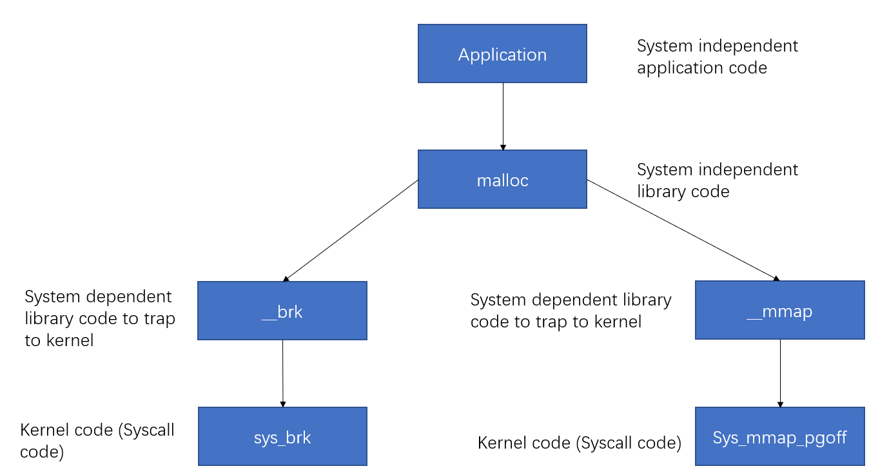

#### brk

对于堆的操作，操作系统提供了 brk 函数，glibc 库提供了 sbrk 函数。 brk通过增加brk的大小来申请内存(non zero initialized)。初始时，堆的起始地址 start_brk 以及堆的当前末尾 brk 指向同一地址。

- 当ASLR关闭时，start_brk 以及 brk 会指向 data/bss 段的结尾。
- 当ASLR开启时，start_brk 以及 brk 会指向 data/bss 段结尾后的随机偏移处。


```c++
    /* sbrk and brk example */
    #include <stdio.h>
    #include <unistd.h>
    #include <sys/types.h>

    int main()
    {
            void *curr_brk, *tmp_brk = NULL;

            printf("Welcome to sbrk example:%d\n", getpid());

            /* sbrk(0) gives current program break location */
            tmp_brk = curr_brk = sbrk(0);
            printf("Program Break Location1:%p\n", curr_brk);
            getchar();

            /* brk(addr) increments/decrements program break location */
            brk(curr_brk+4096);

            curr_brk = sbrk(0);
            printf("Program break Location2:%p\n", curr_brk);
            getchar();

            brk(tmp_brk);

            curr_brk = sbrk(0);
            printf("Program Break Location3:%p\n", curr_brk);
            getchar();

            return 0;
    }
```

第一次调用brk之前并没有出现堆栈，在第一次增加 brk 后出现堆段

```s
    0804a000-0804b000 rw-p 00001000 08:01 1570119                            /home/nop/Desktop/sbrk
    0804b000-0806c000 rw-p 00000000 00:00 0                                  [heap]
    f7dff000-f7e00000 rw-p 00000000 00:00 0
```

其中，

- 0804b000-0806c000 是堆栈段的虚拟地址范围
- rw-p 是标志位(Read, Write, NoeXecute, Private)
- 00000000 是文件偏移，它并不是从任何文件映射的，所以为0
- 00:00 主从（ Major/Minor）设备号，它并不是从任何文件映射的，所以为0
- 0 是Inode号，它并不是从任何文件映射的，所以为0
- `[heap]` 表示是堆段

#### mmap

malloc 使用 mmap 创建私有的匿名映射段。匿名映射的目的主要是申请用 0 填充的新的内存，并且这块内存仅能被调用进程所使用

```c++
    /* Private anonymous mapping example using mmap syscall */
    #include <stdio.h>
    #include <sys/mman.h>
    #include <sys/types.h>
    #include <sys/stat.h>
    #include <fcntl.h>
    #include <unistd.h>
    #include <stdlib.h>

    void static inline errExit(const char* msg)
    {
            printf("%s failed. Exiting the process\n", msg);
            exit(-1);
    }

    int main()
    {
            int ret = -1;
            printf("Welcome to private anonymous mapping example::PID:%d\n", getpid());
            printf("Before mmap\n");
            getchar();
            char* addr = NULL;
            addr = mmap(NULL, (size_t)132*1024, PROT_READ|PROT_WRITE, MAP_PRIVATE | MAP_ANONYMOUS, -1, 0);
            if (addr == MAP_FAILED)
                    errExit("mmap");
            printf("After mmap\n");
            getchar();

            /* Unmap mapped region. */
            ret = munmap(addr, (size_t)132*1024);
            if(ret == -1)
                    errExit("munmap");
            printf("After munmap\n");
            getchar();
            return 0;
    }
```

mmap之前，只有 .so 文件的mmap段；而mmap之后，申请的内存和已经存在的内存段结合；而munmap之后，内存段恢复为原来的状态

## 例子

```c++
    /* Per thread arena example. */
    #include <stdio.h>
    #include <stdlib.h>
    #include <pthread.h>
    #include <unistd.h>
    #include <sys/types.h>

    void* threadFunc(void* arg) {
            printf("Before malloc in thread 1\n");
            getchar();
            char* addr = (char*) malloc(1000);
            printf("After malloc and before free in thread 1\n");
            getchar();
            free(addr);
            printf("After free in thread 1\n");
            getchar();
    }
  
    int main() {
            pthread_t t1;
            void* s;
            int ret;
            char* addr;

            printf("Welcome to per thread arena example::%d\n",getpid());
            printf("Before malloc in main thread\n");
            getchar();
            addr = (char*) malloc(1000);
            printf("After malloc and before free in main thread\n");
            getchar();
            free(addr);
            printf("After free in main thread\n");
            getchar();
            ret = pthread_create(&t1, NULL, threadFunc, NULL);
            if(ret)
            {
                    printf("Thread creation error\n");
                    return -1;
            }
            ret = pthread_join(t1, &s);
            if(ret)
            {
                    printf("Thread join error\n");
                    return -1;
            }
            return 0;
    }
    // gcc -m32 -g mthread.c -o mthread  -lpthread
```

### Before malloc in main thread

在程序调用malloc之前程序进程中是没有heap segment的，并且在创建在创建线程前，也是没有线程堆栈的。

### After malloc in main thread

在主线程中调用malloc之后，系统给程序分配了堆栈，且这个堆栈刚好在数据段之上：

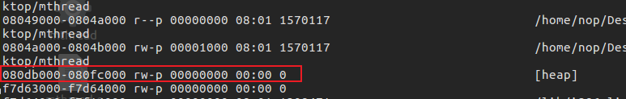

说明它是通过brk系统调用实现的，此外虽然只申请了1000字节的数据，但是系统却分配了132KB大小的堆（(0xfc000-0xdb000)/1024 = 132 kb），这132KB的堆空间叫做 arena ，此时因为是主线程分配的，所以叫做main arena(每个arena中含有多个chunk，这些chunk以链表的形式加以组织)。由于132KB比1000字节大很多，所以主线程后续再声请堆空间的话，就会先从这132KB的剩余部分中申请，直到用完或不够用的时候，再通过增加 program break location 的方式来增加 main arena 的大小。同理，当 main arena 中有过多空闲内存的时候，也会通过减小 program break location 的方式来缩小 main arena 的大小。

### After free in main thread

在主线程调用free之后，程序的堆空间并没有被释放掉，因为调用free函数释放已经分配了的空间并非直接“返还”给系统，而是由 glibc 的 malloc 库函数加以管理。它会将释放的chunk添加到 main arenas 的 bin (用于存储同类型 free chunk 的双链表数据结构)中。记录空闲空间的 freelist 数据结构称之为 bins。之后当用户再次调用 malloc 申请堆空间的时候，glibc malloc 会先尝试从 bins 中找到一个满足要求的 chunk ，如果没有才会向操作系统申请新的堆空间。

### Before malloc in thread1

在thread1调用malloc之前，thread1中并没有heap segment，但是此时thread1自己的栈空间已经分配完毕了

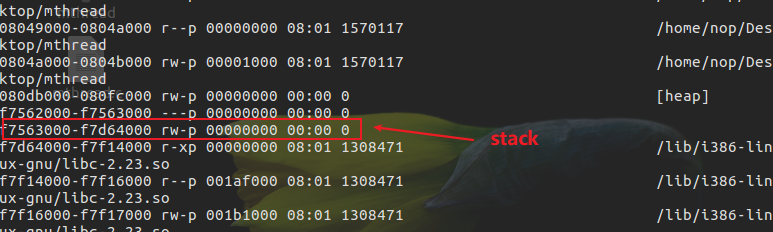

### After malloc in thread1

在 thread1 调用 malloc 之后，thread1的 heap segment 已经分配完毕了，同时从这个区域的起始地址可以看出，它并不是通过brk分配的，而是通过mmap分配，因为它的区域为 b7500000-b7600000 共1MB，并不是同程序的 data segment 相邻。同时，在这1MB中，根据内存属性分为了2部分：0xf7400000 - 0xf7421000 共132KB大小的空间是可读可写属性；后面的是不可读写属性。这里只有可读写的132KB空间才是 thread1 的堆空间，即 thread1 arena。

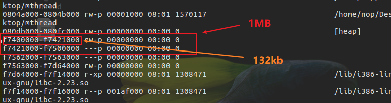

## Arena

### Arena数量限制

arena的个数是跟系统中处理器核心个数相关的，即

```s
For 32 bit systems:
     Number of arena = 2 * number of cores + 1.
For 64 bit systems:
     Number of arena = 8 * number of cores + 1.
```

### 多Arena的管理

假设有如下情境：一台只含有一个处理器核心的PC机安装有32位操作系统，其上运行了一个多线程应用程序，共含有4个线程——主线程和三个用户线程。显然线程个数大于系统能维护的最大arena个数（2*核心数 + 1= 3）那么此时glibc malloc就需要确保这4个线程能够正确地共享这3个arena

当主线程首次调用malloc的时候，glibc malloc会直接为它分配一个main arena，而不需要任何附加条件。
当用户线程1和用户线程2首次调用malloc的时候，glibc malloc会分别为每个用户线程创建一个新的thread arena，此时，各个线程与arena是一一对应的。
当用户线程3调用malloc的时候，glibc malloc 能维护的arena个数已经达到上限，无法再为线程3分配新的arena，那么就需要重复使用已经分配好的3个arena中的一个(main arena, arena 1或者arena 2)。

1. glibc malloc循环遍历所有可用的arenas，在遍历的过程中，它会尝试lock该arena。如果成功lock(该arena当前对应的线程并未使用堆内存则表示可lock)则该arena被线程3共享使用。

2. 如果没能找到可用的arena，那么就将线程3的malloc操作阻塞，直到有可用的arena为止。

3. 如果线程3再次调用malloc的话，glibc malloc就会先尝试使用最近访问的arena。如果这个arena可用的话，就直接使用，否则就将线程3阻塞，直到这个 arena再次可用为止。

## 堆管理

### 整体

在glibc malloc中针对堆管理，主要涉及到3种数据结构：

#### heap_info

即Heap Header，因为一个thread arena（注意：不包含main thread）可以包含多个heaps，所以为了便于管理，就给每个heap分配一个heap header。在当前heap不够用的时候，malloc会通过系统调用mmap申请新的堆空间，新的堆空间会被添加到当前thread arena中，便于管理。（此时thread arena中就会包含多个heap）

```c++
        typedef struct _heap_info
        {
        mstate ar_ptr; /* Arena for this heap. */
        struct _heap_info *prev; /* Previous heap. */
        size_t size;   /* Current size in bytes. */
        size_t mprotect_size; /* Size in bytes that has been mprotected
                                PROT_READ|PROT_WRITE.  */
        /* Make sure the following data is properly aligned, particularly
        that sizeof (heap_info) + 2 * SIZE_SZ is a multiple of
        MALLOC_ALIGNMENT. */
        char pad[-6 * SIZE_SZ & MALLOC_ALIGN_MASK];
        } heap_info;
```

#### malloc_state

即Arena Header，每个thread只含有一个Arena Header。Arena Header包含bins的信息、top chunk、remainder chunk等

```c++
        struct malloc_state
        {
        /* Serialize access.  */
        mutex_t mutex;
        /* Flags (formerly in max_fast).  */
        int flags;
        /* Fastbins */
        mfastbinptr fastbinsY[NFASTBINS];
        /* Base of the topmost chunk -- not otherwise kept in a bin */
        mchunkptr top;
        /* The remainder from the most recent split of a small request */
        mchunkptr last_remainder;
        /* Normal bins packed as described above */
        mchunkptr bins[NBINS * 2 - 2];
        /* Bitmap of bins */
        unsigned int binmap[BINMAPSIZE];
        /* Linked list */
        struct malloc_state *next;
        /* Linked list for free arenas.  */
        struct malloc_state *next_free;
        /* Memory allocated from the system in this arena.  */
        INTERNAL_SIZE_T system_mem;
        INTERNAL_SIZE_T max_system_mem;
        };
```

#### malloc_chunk

即Chunk Header，一个heap被分为多个chunk，至于每个chunk的大小，这是根据用户的请求决定的。每个chunk都由一个结构体malloc_chunk表示：

```c++
        struct malloc_chunk {
        /* #define INTERNAL_SIZE_T size_t */
        INTERNAL_SIZE_T      prev_size;  /* Size of previous chunk (if free).  */
        INTERNAL_SIZE_T      size;       /* Size in bytes, including overhead. */
        struct malloc_chunk* fd;         /* double links -- used only if free. 这两个指针只在free chunk中存在*/
        struct malloc_chunk* bk;
        /* Only used for large blocks: pointer to next larger size.  */
        struct malloc_chunk* fd_nextsize; /* double links -- used only if free. */
        struct malloc_chunk* bk_nextsize;
        };
```

> 注意：
> 1.Main thread不含有多个heaps所以也就不含有heap_info结构体。当需要更多堆空间的时候，就通过扩展sbrk的heap segment来获取更多的空间，直到它碰到内存mapping区域为止。
> 2.不同于thread arena，main arena的arena header并不是sbrk heap segment的一部分，而是一个全局变量！因此它属于libc.so的data segment。

### heap segment 与 arena

有一个heap segment的main arena和thread arena：

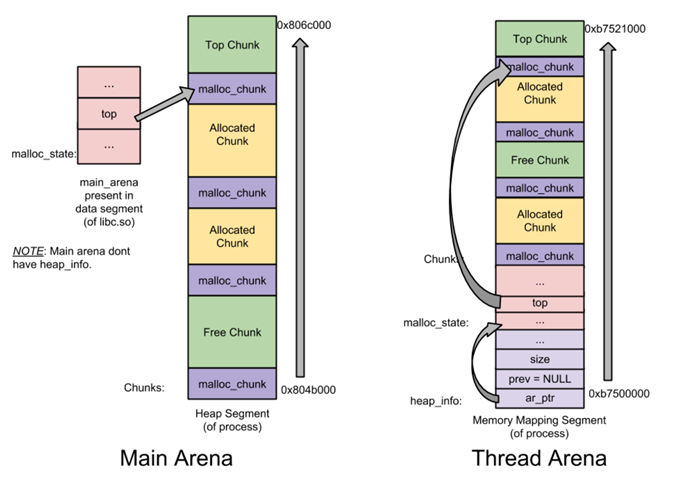

一个thread arena中含有多个heap segments：

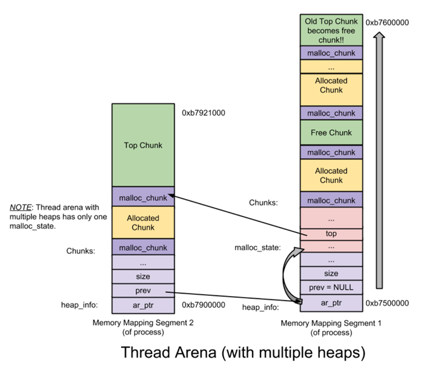

thread arena只含有一个malloc_state(即arena header)，却有两个heap_info(即heap header)。由于两个heap segments是通过mmap分配的内存，两者在内存布局上并不相邻而是分属于不同的内存区间，所以为了便于管理，libc malloc将第二个heap_info结构体的prev成员指向了第一个heap_info结构体的起始位置（即ar_ptr成员），而第一个heap_info结构体的ar_ptr成员指向了malloc_state，这样就构成了一个单链表，方便后续管理。

## chunk

在glibc malloc中将整个堆内存空间分成了连续的、大小不一的chunk，即对于堆内存管理而言chunk就是最小操作单位。Chunk总共分为4类：

1) allocated chunk
2) free chunk
3) top chunk
4) Last remainder chunk

从本质上来说，所有类型的chunk都是内存中一块连续的区域，只是通过该区域中特定位置的某些标识符加以区分,简化可区分为两类：allocated chunk以及free chunk，前者表示已经分配给用户使用的chunk，后者表示未使用的chunk。
无论是何种堆内存管理器，其完成的核心目的都是能够高效地分配和回收内存块(chunk)。

### 隐式链表技术

任何堆内存管理器都是以chunk为单位进行堆内存管理的，而这就需要一些数据结构来标志各个块的边界，以及区分已分配块和空闲块。大多数堆内存管理器都将这些边界信息作为chunk的一部分嵌入到chunk内部，典型的设计如下所示：

allocated chunk:
free chunk: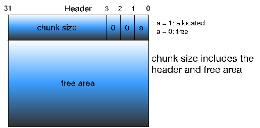

堆内存中要求每个chunk的大小必须为8的整数倍，因此chunk size的后3位是无效的，为了充分利用内存，堆管理器将这3个比特位用作chunk的标志位，典型的就是将第0比特位用于标记该chunk是否已经被分配。这样的设计很巧妙，因为我们只要获取了一个指向chunk size的指针，就能知道该chunk的大小，即确定了此chunk的边界，且利用chunk size的第0比特位还能知道该chunk是否已经分配，这样就成功地将各个chunk区分开来。注意在allocated chunk中padding部分主要是用于地址对齐的(也可用于对付外部碎片)，即让整个chunk的大小为8的整数倍。

将堆内存组织成一个连续的已分配或未分配的chunk序列，即隐式链表：

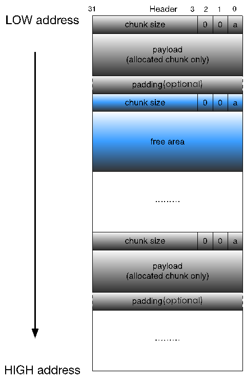

该链表隐式地由每个chunk的size字段链接起来，在进行分配操作的时候，堆内存管理器可以通过遍历整个堆内存的chunk，分析每个chunk的size字段，进而找到合适的chunk。
不过这种隐式链表效率很低，特别是在内存回收方面，它难以进行相邻多个free chunk的合并操作。如果只对free chunk进行分割，而不进行合并的话，就会产生大量小的、无法继续使用的内部碎片，直至整个内存消耗殆尽

#### 带边界的chunk合并技术

试想如下场景：假设我们要释放的chunk为P，它紧邻的前一个chunk为FD，紧邻的后一个chunk为BK，且BK与FD都为free chunk。将P于BK合并在一起是很容易的，因为可以通过P的size字段轻松定位到BK的开始位置，进而获取BK的size等等，但是将P于FD合并却很难，我们必须从头遍历整个堆，找到FD，然后加以合并，这就意味着每次进行chunk释放操作消耗的时间与堆的大小成线性关系。
Knuth提出边界标记，即在每个chunk的最后添加一个脚部(Footer)，它就是该chunk 头部(header)的一个副本，称之为边界标记：

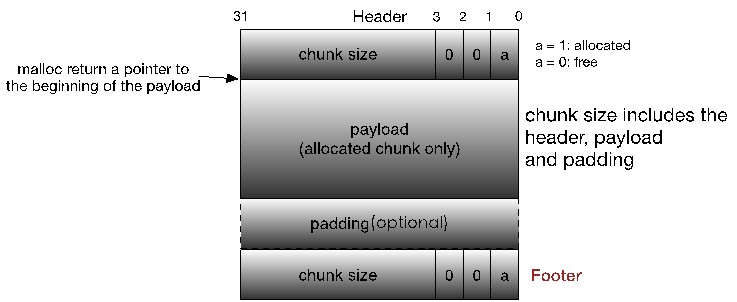

显然每个chunk的脚部都在其相邻的下一个chunk的头部的前4个字节处。通过这个脚部，堆内存管理器就可以很容易地得到前一个chunk的起始位置和分配状态，进而加以合并了。
但是，边界标记要求每个块都包含一个头部和脚部，如果应用程序频繁地进行小内存的申请和释放操作的话(比如1，2个字节)，就会造成很大的性能损耗。同时，考虑到只有在对free chunk进行合并的时候才需要脚部，也就是说对于allocated chunk而言它并不需要脚部。
同时，考虑到只有在对free chunk进行合并的时候才需要脚部，也就是说对于allocated chunk而言它并不需要脚部，因此将前一个chunk的已分配/空闲标记位存储在当前chunk的size字段的第1，或2比特位上，当前chunk地址之前的4个字节为前一个free chunk的脚部，可以通过该脚部获取前一个chunk的起始位置；如果当前chunk的size字段的标记位表明前一个chunk是allocated chunk的话，那么前一个chunk没有脚部，即当前chunk地址之前的4个字节为前一个allocated chunk的payload或padding的最后部分。


#### 支持多线程

只需要保存前一个chunk的分配标志位就可以通过查询下一个chunk的size字段得到，那么size字段中剩下的两个比特位就可以来标记当前chunk是否属于非主线程即thread arena，以及该chunk由mmap得来还是通过brk实现等。

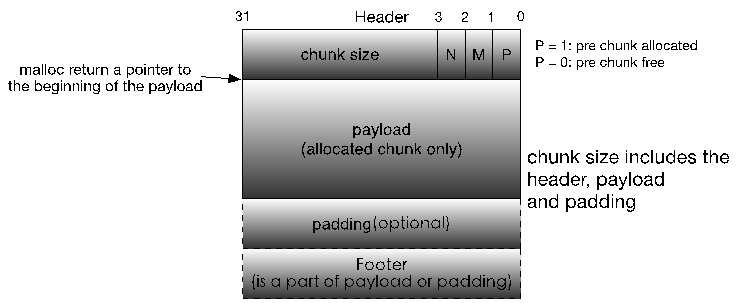
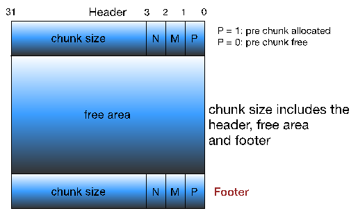

其中，P,M,N 的含义如下：

- PREV_INUSE(P)：表示前一个chunk是否为allocated。
- IS_MMAPPED(M)：表示当前chunk是否是通过mmap系统调用产生的。
- NON_MAIN_ARENA(N)：表示当前chunk是否是thread arena。

将Footer从尾部移到首部，同时其不再保存当前chunk的size，而是前一个free chunk的size，如果前一个chunk是allocated chunk的话，这个Footer就作为allocated chunk的payload或padding的一部分

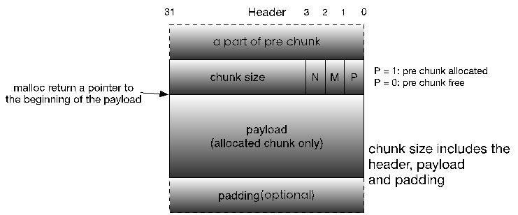


malloc_chunk结构体通过每个chunk的prev_size和size构成了隐式链表，而后续的fd, bk等指针并不是作用于隐式链表的，而是用于用于加快内存分配和释放效率的显示链表bin，并且这些指针跟prev_size一样只在free chunk中存在

### Top Chunk

当一个chunk处于一个arena的最顶部(即最高内存地址处)的时候，就称之为top chunk。该chunk并不属于任何bin，而是在系统当前的所有free chunk(无论那种bin)都无法满足用户请求的内存大小的时候，将此chunk当做一个应急消防员，分配给用户使用。
如果top chunk的大小比用户请求的大小要大的话，就将该top chunk分作两部分：

1) 用户请求的chunk；
2) 剩余的部分成为新的top chunk。

否则，就需要扩展heap或分配新的heap:

1) 在main arena中通过sbrk扩展heap;
2) 在thread arena中通过mmap分配新的heap。

### Last Remainder Chunk

- 产生：
  当用户请求的是一个small chunk，且该请求无法被small bin、unsorted bin满足的时候，就通过binmaps遍历bin查找最合适的chunk，如果该chunk有剩余部分的话，就将该剩余部分变成一个新的chunk加入到unsorted bin中，另外，再将该新的chunk变成新的last remainder chunk。
- 作用：
  此类型的chunk用于提高连续malloc(small chunk)的效率，主要是提高内存分配的局部性。当用户请求一个small chunk，且该请求无法被small bin满足，那么就转而交由unsorted bin处理。同时，假设当前unsorted bin中只有一个chunk的话——就是last remainder chunk，那么就将该chunk分成两部分：前者分配给用户，剩下的部分放到unsorted bin中，并成为新的last remainder chunk。这样就保证了连续malloc(small chunk)中，各个small chunk在内存分布中是相邻的，即提高了内存分配的局部性。
