# 栈溢出基础

## 函数的进入与返回

将示例程序加载到IDA中，主逻辑很简单即只是调用函数hello，查看函数hello的伪代码：

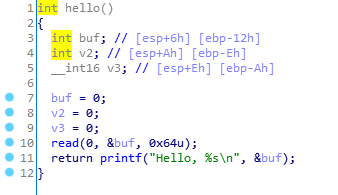

hello函数获取输入后输出“hello，输入内容”后退出。
在IDA-view窗口中对`call hello`一行下断点，然后开启32位Docker远程调试。

需要注意的地方是栈窗口、EIP寄存器、EBP寄存器、ESP寄存器。
EIP寄存器的内容始终是下一条将要执行的指令的地址，也即是说，只要通过某种方式修改EIP中的值，就可以控制整个程序的执行，从而pwn掉程序（可以在寄存器窗口，EIP后的数字上点击鼠标右键选择Modify value..将数值改成其他值，F9运行后即可跳过`call hello`而转向执行修改后的地址对应的指令）
栈的最小单位是函数栈帧，函数栈帧结构图如下：

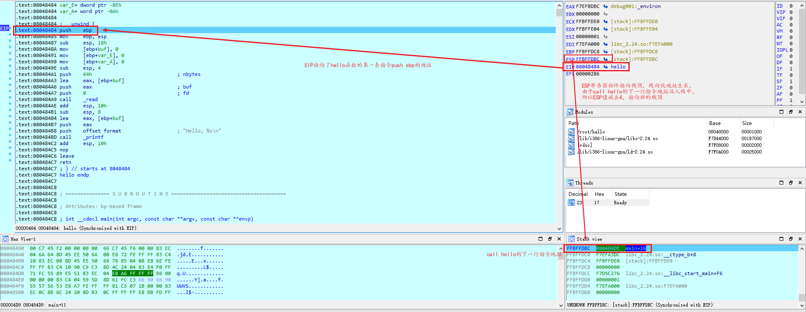

栈的生长方向是向低地址生长，也即是说表格中的方向和IDA中栈窗口的方向一致，即越往上地址越小，在IDA的栈窗口中，新入栈的内容会压在原来内容之上。
进入hello函数前先记录下EBP和ESP（受到地址空间随机化ASLR影响，每台电脑每次运行结果可能不一致）

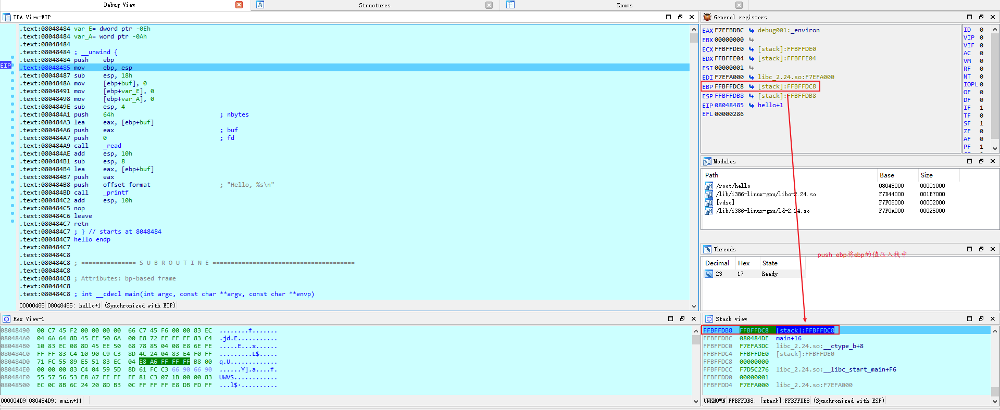

执行完call指令之后，EIP发生了改变，即call指令是可以改变EIP的内容的（始终指向下一条指令地址的行为），call指令执行会将下一条指令的地址压栈即上表中的EIP(类似于指令`push eip; mov eip,[hello]`)

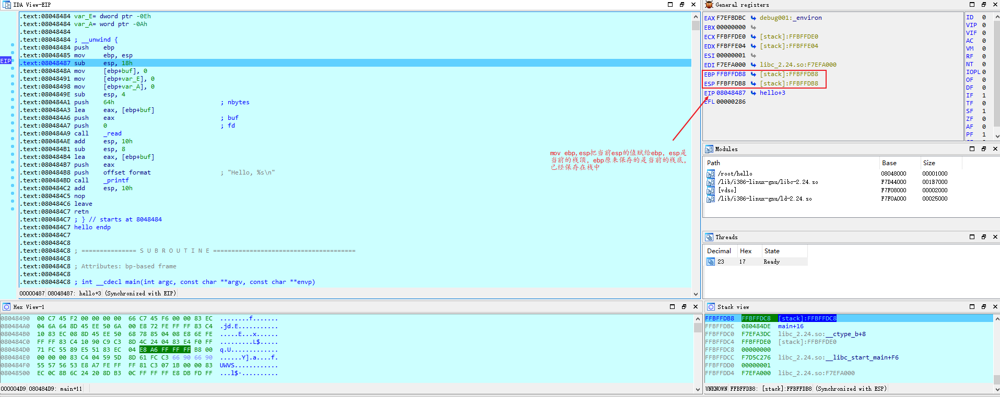
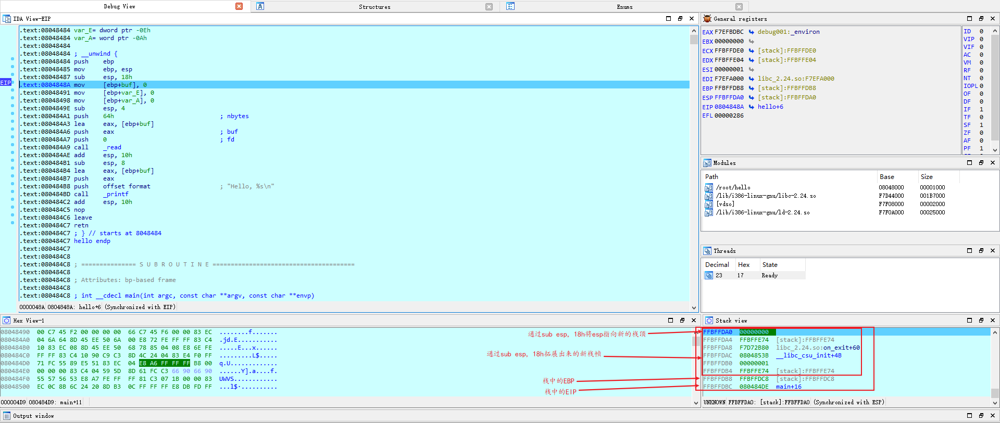

继续执行后，发现通过依次执行三条指令（`push ebp; mov ebp,esp; sub esp,18h`）为hello函数开辟了新的栈帧同时将原来的栈帧（执行`call hello`函数的`main`函数的栈帧的栈底`EBP`保存在栈中。继续执行到`read`函数，输入标志性的内容（123），可以发现存储输入的局部变量buf就位于新开辟的栈中：

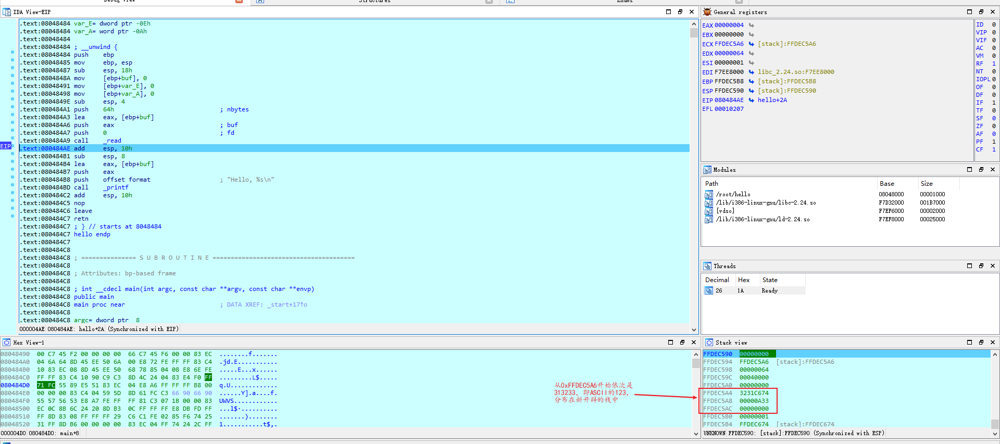

继续执行到`leave`一行时再次回到了刚执行完`sub esp,18h`的状态：

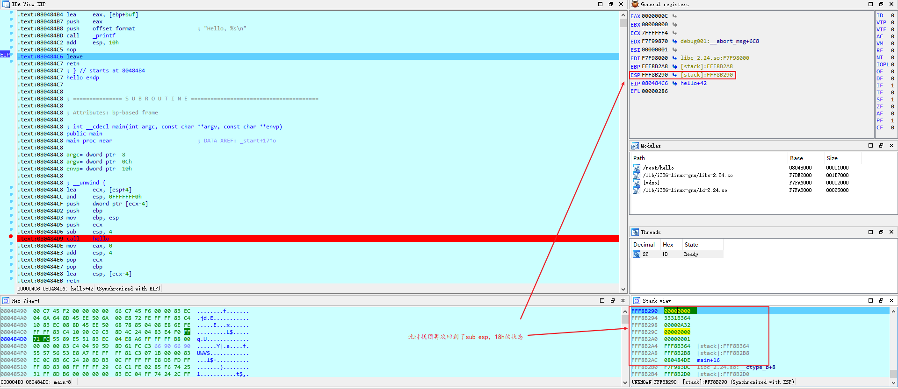

执行完`leave`后，栈帧被销毁，整体状态回到了`call hello`执行前的状态。即`leave`指令相当于`add esp,xxh; mov esp,ebp; pop ebp`

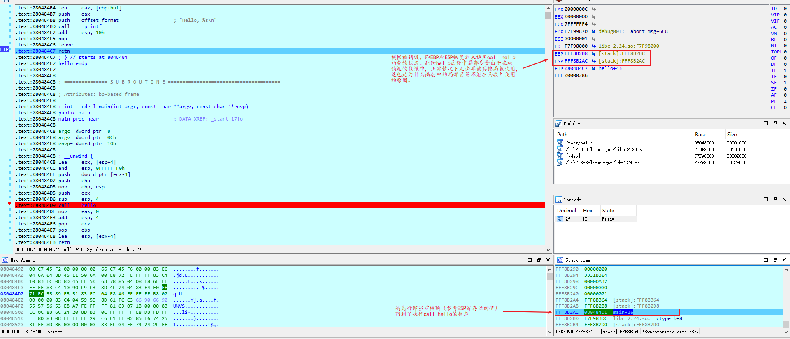

再继续执行时，EIP指向了`call hello`的下一条指令，同时栈中保存的EIP值被弹出，栈顶地址+4，即`retn`等同于`pop eip`
此时hello函数代码执行完毕，控制流程返回到了调用`hello`函数的`main`函数中。

## 栈溢出实战

通过调试，了解到函数栈的初始化和销毁过程，而且可以发现随着输入的内容变多，输入的内容离栈上保存的EIP越来越近，所以可以通过输入修改栈中保存的EIP地址，从而再retn执行之后去执行修改后的EIP指向的指令，进而达到“pwn”掉程序的目的。
`Ctrl+F2`结束当前调试，直接在`call _read`处下断，启动调试，程序中断后界面如下：

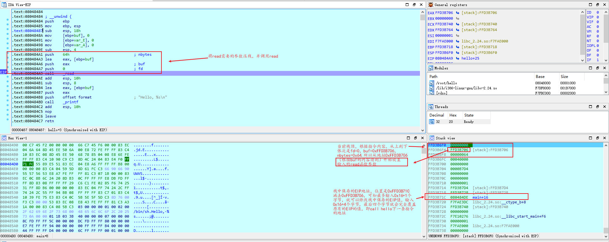

通过观察，read函数的参数以及栈中保存的EIP地址，可以计算出两者的偏移量为0x16（22），所以输入22字节的内容就会到达EIP，如果输入22+4=26字节的数据就会覆盖掉栈中保存的EIP的内容，尝试输入`'A'*22+'B'*4`即`AAAAAAAAAAAAAAAAAAAAAABBBB`后执行完retn，EIP中的值应该是BBBB（ASCII码：42424242）：

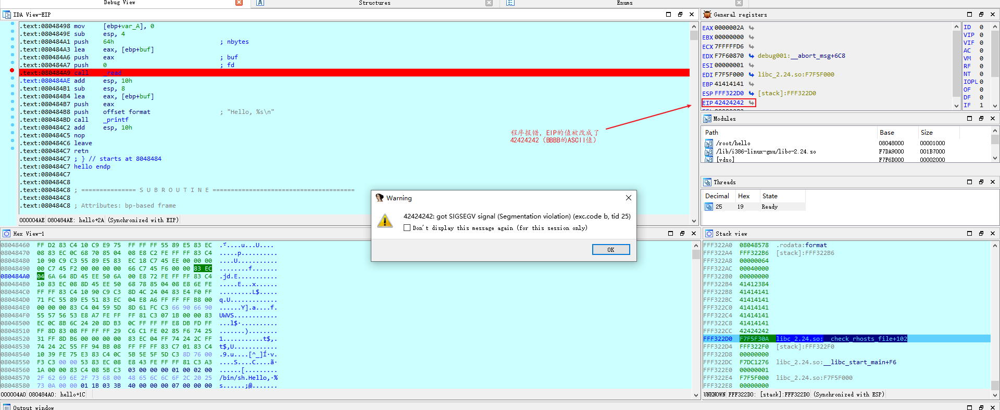

修改成功，但因为42424242并非合法的地址，所以程序会报错，但如果将BBBB改成程序中某个函数的地址，执行完retn之后，便会转向执行修改后指向的函数。

## 结合pwntools打造一个远程代码执行漏洞exp

通过调试观察发现了程序的一个漏洞，通过这个漏洞可以做到远程使程序崩溃。相似的，如果能够挖掘到安全软件或者系统的漏洞从而使其崩溃，就可以让某些保护失效，从而使之后的入侵更加轻松。对于本程序，可以制作一个RCE（远程代码执行），进而让程序执行自己想要他执行的内容。
在IDA的Functions window可以看到一个getShell的函数：

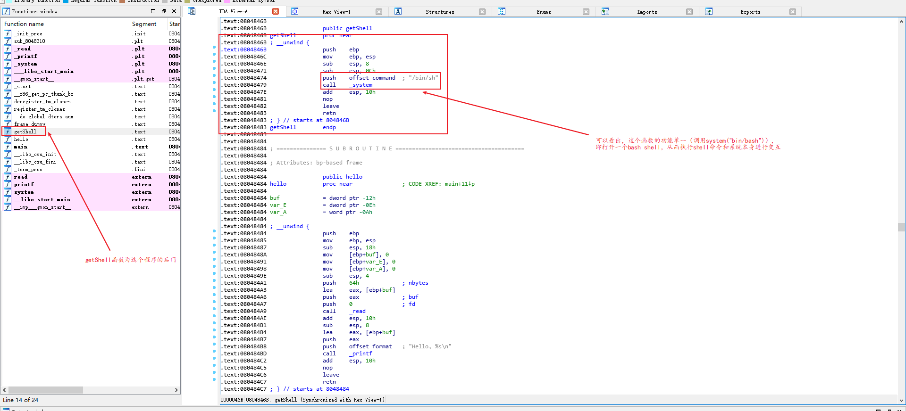

通过这个后门函数，就可以实现和系统本身的交互，所以可以通过之前发现的漏洞，将EIP中的内容修改为这个后门函数的地址，从而达到目的。
先把hello程序的IO转发到10001端口上：

然后获取Docker的IP：

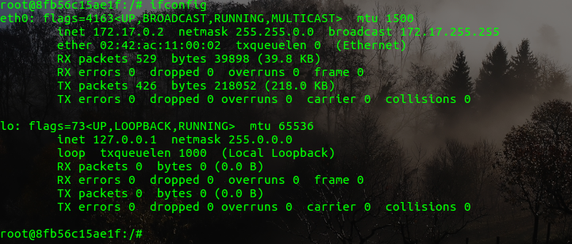

启动python，导入pwntools，并且打开一个和Docker的10001端口的连接：

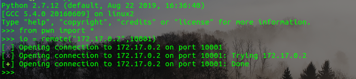

通过之前的分析可以知道构造payload的组成应该是任意22字节的字符加上4字节的地址，但4字节的地址需要将16进制数转化成字符串，可以选用pwntools提供的函数`p32()`（即pack32位地址，同样还有unpack32位地址的`u32()`以及不同位数的`p16()`,`p64()`等），所以构造payload：`22*'A'+p32(0x0804846B)`
由于读取输入的函数是read，所以在输入时不需要以回车作为结束符（printf，getc，gets等则需要），所以这里直接使用send函数发送payload：

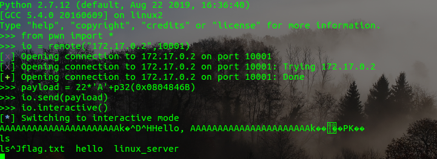

其中，`interactive()`可以和系统进行交互，进入后即可得到想要的内容。
