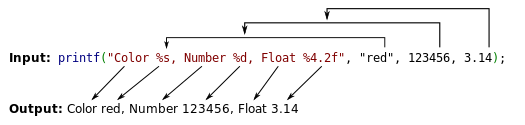

# 格式化字符串漏洞原理介绍

## 格式化字符串函数介绍

格式化字符串函数可以接受可变数量的参数，并将第一个参数作为格式化字符串，根据其来解析之后的参数。通俗来说，格式化字符串函数就是将计算机内存中表示的数据转化为我们人类可读的字符串格式。几乎所有的 C/C++ 程序都会利用格式化字符串函数来输出信息，调试程序，或者处理字符串。一般来说，格式化字符串在利用的时候主要分为三个部分：

- 格式化字符串函数
- 格式化字符串
- 后续参数，可选

例：



### 格式化字符串函数

常见的格式化字符串函数如下：

函数 | 基本介绍
--|--
scanf   | 输入函数
printf  | 输出到stdout
fprintf | 输出到指定FILE流
vprintf | 根据参数列表格式化输出到stdout
vfprintf | 根据参数列表格式化输出到指定FILE流
sprintf | 输出到字符串
snprintf | 输出指定字节数到字符串
vsprintf | 根据参数列表格式化输出到字符串
vsnprintf | 根据参数列表格式化输出指定字节到字符串
setproctitle | 设置argv
syslog  | 输出日志
err，verr，warn，vwarn等 | ...

### 而格式化字符串

格式化字符串基本格式如下：

`%[parameter][flags][field width][.precision][length]type`
其中，

- parameter：n$,获取格式化字符串中的指定参数
- flag
- field width：输出的最小宽度
- precision：输出的最大长度
- length，输出长度：hh输出一个字节，h输出一个双字节
- type
  - d/i，有符号整数
  - u，无符号整数
  - x/X，16进制无符号整数，x使用小写字母，X则使用大写字母。如果指定了精度，则输出的数字不足时在左侧补0.默认精度为1.精度为0且值为0时输出为空。
  - o，8进制无符号整数。如果指定了精度，则输出的数字不足时在左侧补0.默认精度为1，精度为0且值为0时输出为空。
  - s，如果没有用 l 标志，输出 null 结尾字符串直到精度规定的上限；如果没有指定精度，则输出所有字节。如果用了 l 标志，则对应函数参数指向 wchar_t 型的数组，输出时把每个宽字符转化为多字节字符，相当于调用 wcrtomb 函数。
  - c，如果没有用 l 标志，把 int 参数转为 unsigned char 型输出；如果用了 l 标志，把 wint_t 参数转为包含两个元素的 wchart_t 数组，其中第一个元素包含要输出的字符，第二个元素为 null 宽字符。
  - p， void * 型，输出对应变量的值。printf("%p",a) 用地址的格式打印变量 a 的值，printf("%p", &a) 打印变量 a 所在的地址。
  - n，不输出字符，但是把已经成功输出的字符个数写入对应的整型指针参数所指的变量。
  - %， '%'字面值，不接受任何 flags, width

### 参数

对应要输出的变量

## 格式化字符串漏洞原理

格式化字符串函数是根据格式化字符串函数来进行解析的。那么相应的要被解析的参数的个数也自然是由这个格式化字符串所控制。比如说'%s'表明我们会输出一个字符串参数。


对于上例中，在进入 printf 函数的之前 (即还没有调用 printf)，栈上的布局由高地址到低地址依次如下

```c++
some value
3.14
123456
addr of "red"
addr of format string: Color %s...
```

这里假设3.14为上面的值为某个未知的值

进入printf函数后，函数首先获取第一个参数，一个一个读取其字符会遇到两种情况：

- 当前字符不是%，直接输出到相应标准输出
- 当前字符是%，继续读取下一个字符
  - 如果没有字符，报错
  - 如果下一个字符是%，输出%
  - 否则根据相应的字符，获取相应的参数，对其进行解析并输出

对于`printf("Color %s, Number %d, Float %4.2f");`
并没有提供参数，但是程序会赵姨娘运行，将栈上存储格式化字符串地址上面的三个变量分别解析为：

- 解析其地址对应的字符串
- 解析其内容对应的整型值
- 解析其内容对应的浮点值

对于解析地址来说，如果提供了一个不可访问的地址，那么程序就会因此而崩溃。
