# Python-Part1

## 安装

### python环境

<https://www.python.org/>
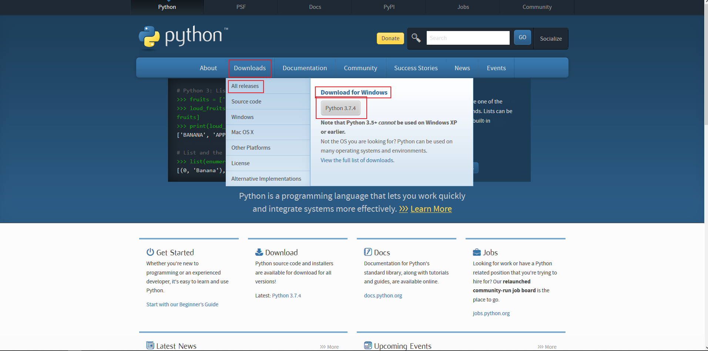
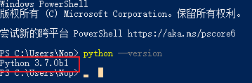

### 编辑器

#### IDLE

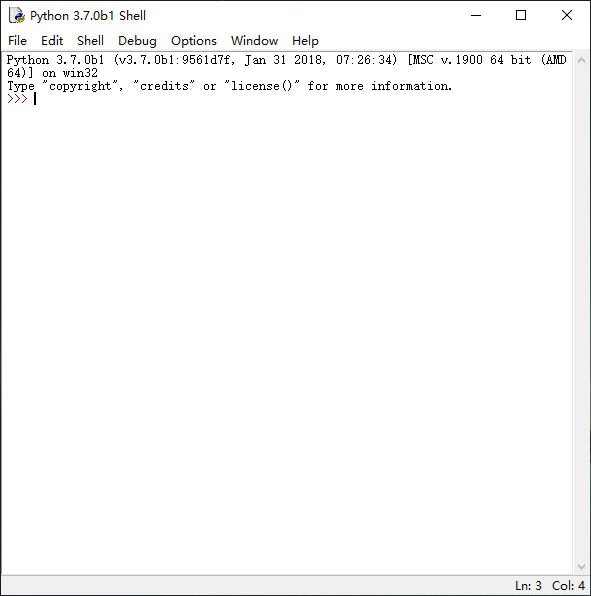

#### jupyter notebook

##### Anaconda


##### pip安装

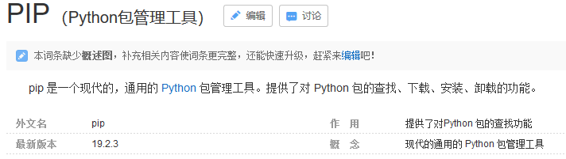
命令`pip install --upgrade pip`可以更新pip版本
使用pip安装jupyter notebook：`pip install jupyter`
进入jupyter notebook：`jupyter notebook`

##### jupyter notebook的使用

#### vscode

<https://code.visualstudio.com/>

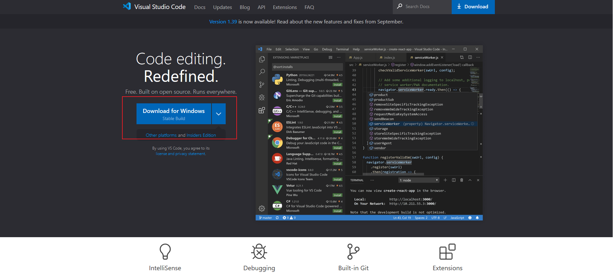

#### 记事本

### 第一个程序

#### 解释器与文档编码

``` python
    #! /usr/bin/python
    # coding:utf-8
```

#### 注释

``` python
    # 打印字符："hello,world"
```

#### 程序内容

``` python
    print("Hello,World")
```

#### 运行程序

```python
    #! usr/bin/python
    # coding:utf-8

    # 打印字符："hello,world"
    print("Hello,World")
```

#### 编辑器中运行

#### 命令行中运行

##### Cmd

##### powershell

##### shell(linux)

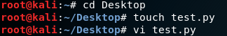
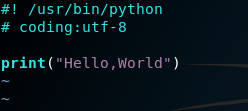
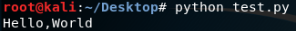

### 变量

#### 命名规则

- 标识符可以由字母、数字、下画线（_）组成，其中数字不能打头。
- 标识符不能是 Python 关键字，但可以包含关键字。
  - 如果开发者尝试使用关键字作为变量名，Python 解释器会报错。
  - 如果开发者使用内置函数的名字作为变量名，Python 解释器倒不会报错，只是该内置函数就被这个变量覆盖了，该内置函数就不能使用了。
  - python中的关键字：
    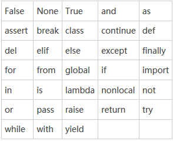
- 标识符不能包含空格。

#### 赋值

```python
    a=124
    b='abd'
    c=True

```

##### 多变量赋值

```python
    a,b,c=1,2,3
    print(a,b,c)
```

##### 值交换

```python
    a=2
    b=3
    a,b=b,a
```

##### 复合赋值

```python
    a += 1
    #等价于a = a+1
    # -+、 *= 、/=、%=
```

#### Number(数字)

##### Integer(整数)

```python
    # 数学意义上的整数
```

##### Float(浮点数)

```python
   # 数学意义上的小数
```

##### 数学运算

```python
    a,b=1,2
    a*b,a+b
    a%b
    # 1. a<b,结果就等于a
    # 2. a>b,a=5,b=2,a%b=1
```

##### 数学函数

导入库：
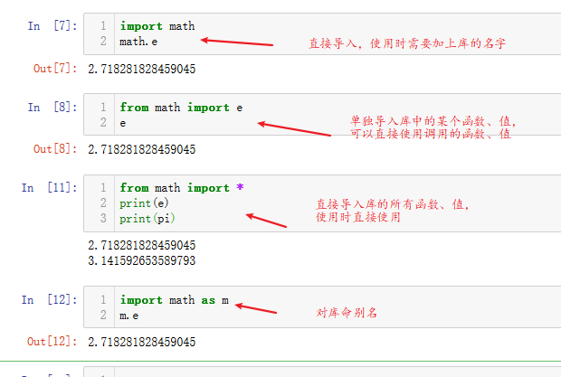

``` python
    #  pow()、round(,(0))、int()、abs()...
    pow(2,3)==2**3==8
    round(2.35)==2,round(2.34,1)==2.3
    int(2.3)==2,int(2.6)==2
    # math库
    # e、PI、log()、exp()、sqrt()、sin()、cos()、tan()...
    import math #导入math的库

```

> math库包含的内容：<https://docs.python.org/2/library/math.html>

##### python中的内置函数

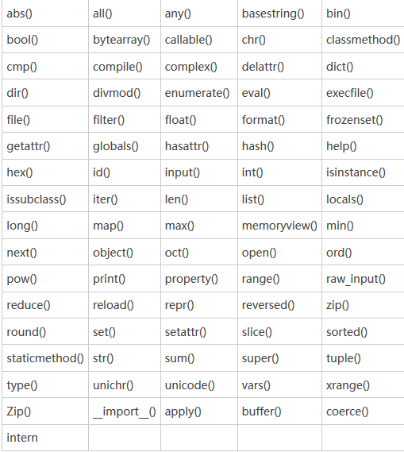

#### String(字符串)

字符串“运算”：`*`和`+`

```python
    'hello,123'
    "helloc,123"
    "hello,'123'"
    "hello"+"world"=="helloworld"
    "h"*2=="hh"
```

##### 转义字符

``` python
"hello,\"asdc\" "
```

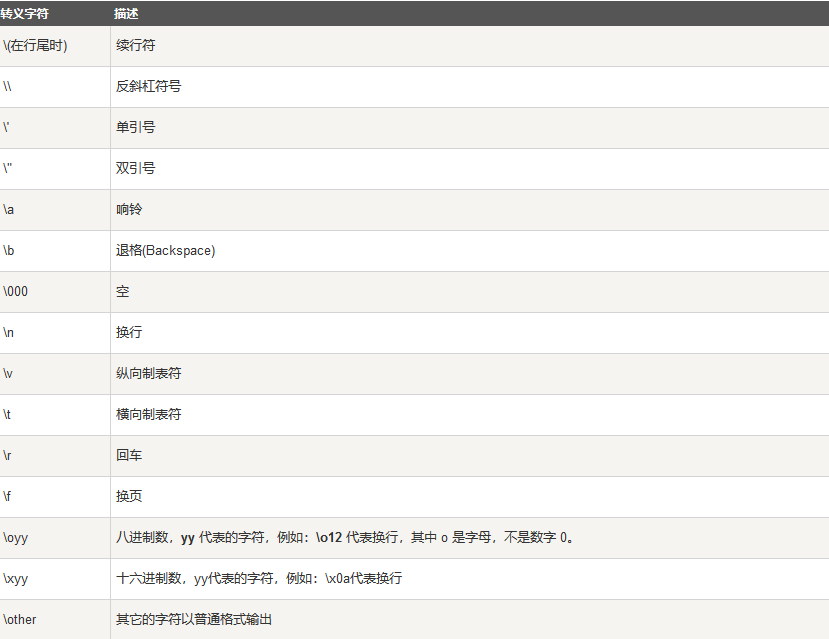

#### Bool(布尔值)

```python
    True
    False
    # 非零即为真，if(1)条件成立，if(0)，条件就不成立，if(2344)条件成立
```

#### List(列表)

``` python
    # 定义一个空列表
    l=[]
    l=[1,2,3.3,'sfdas',True]
    l1=[[1,23],'sad',[True,False]]
    # 不能使用关键字list定义列表
    # len方法
    len(l)==5
    len(l1)==3
    # 列表的索引
    l[2]#表示3.3
    l1[0][1]#表示23
    l1[2][1]#表示False
    # 通过索引修改元素
    l[2]=2#3.3就变为2
    l1[0][1]=3#23就变为3
    # 切片
    l[a1:a2:a3]
        # a1表示起始的索引位置；a2表示结束的索引位置，a3表示步长
        # 包括a1索引位置的值，但不包括a2索引位置的值,[l[a1],l[a2])
    l=[1,2,3,4,5,6,7,8,9]
    l[2:4:1]#输出的结果就是34，默认步长就是1，所以这里的1可以省略
    l[0:8:2]#结果为1357
    l[::2]#结果为13579
    #举个例子，倒序输出l
    l[::-1]==987654321
    #如果前面a1的值为-1，就表示从列表末尾开始访问
    l[-1]==9
    # inset插入元素
    l.insert(a1,a2)#表示在l索引值为a1的位置插入值a2
    # 判断 in和 not in
    9 in l#结果就为True
    # 升序排序:L.sort(,(reverse=Flase))和L1=sorted(L,(reverse=False))
    l=[2,3,2,1,5,3,6,3,64,3]
    l.sort()#l列表值就为升序排序后的值
    sorted(l)#不会改变原列表
    l.sort(reverse=True)#就是降序排序
    # 添加和拓展：append()、extend()
    l=[1,2,3,4,5]
    l.append([2,3,4])#结果为[1,2,3,4,5,[2,3,4]]
    l.extend([2,3,4])#结果就[1，2，3，4，5，2，3，4]
    # 计数：L.count(value)
    l=[2,3,2,1,5,3,6,3,64,3]
    l.count(3)#结果就为4
    # 删除：Del list[index]
    Del l[0]#列表就变为[3,2,1,5,3,6,3,64,3]
```

#### Dictionary(字典)

```python
    # 定义一个空字典
    d={key:values}
    #key一但定义后就不可以改变，但是values可以gaibian
    # 通过键索引
    d={1:'asd',2:'sad'}
    d[2]#结果就为sad
    #key的值一般为字符串等不可变的类型，定义成绩表，d={'name':'xaioming','score':98},通过key来访问values，d['name']就可以得到名字小明
    # len()方法和列表一致，但是这里是求得键值对得个数
    len(d={1:'asd',2:'sad'})#值就为2
    # 通过key修改value
    # 添加元素
    d['sex']='女'#修改元素和添加元素方法一致，区别在于key如果不在字典中，就是添加元素，在字典中就是修改元素
    # 查看内容：D.Keys()、D.values()、D.items()
    d.keys()#表示所有得key值，其余两个方法与之类似
    # 删除：Del D[key]，删除是删除键值对，成对操作
```

#### Set(集合)

``` python
    # 空集合通过关键字声明
    #集合就是数学意义上得集合，集合得内容没有重复元素
    s={1,23,4,5,1}#定义时有重复元素，但是使用时会去掉重复元素
    s=set({})#定义一个空得集合，可以通过type方法判断数据得类型
    type(s)#结果为set（），集合
    # 判断 in、not in
```

#### Tuple(元组)

``` python
    # 定义一个空元组
    #元组的元素是不可改变的
    t=()
    t=(1,2,3)
    # 定义只有一个元素的元组
    # len（）、索引、切片、判断（同列表）
    # 添加元素 +、+=
    t=(1,2,3)
    t+=(1,)#元组只有一个元素时，需要添加一个逗号
    t+=(1,2,4)
    # 排序：sorted()
```

#### 嵌套使用

列表、字典、集合、元组可以相互包含，意思就是列表里面可以有列表、字典、集合、元组，同样对于字典、集合、元组也是一致得。需要注意的是字典中嵌套是在values

```python
    d={1:[1,2,4],2:(1,23,4),3:{1,2,3}}
```

#### 类型转换

```python
    int('1')#结果就是数字1，但是不能将字母等字符转换
    l=[1,2,3]
    tuple(l)#将列表转换为元组，类似得还有set(l)等
```

### 输入&输出

#### 输出

```python
    print('sada')
    print('123',end='\n')#默认情况
    #一下两个print打印出一行‘hello+world’
    print('hello',end='+')
    print('world')
```

##### 格式化字符串

主要是用于输出多种变量类型

```python
    a=1
    b='2'
    #我想要输出a=1,b=2,就需要用到格式化字符
    print('a=%d,b=%s'%(a,b))
    print('a='+str(a)+'b='+b)
```

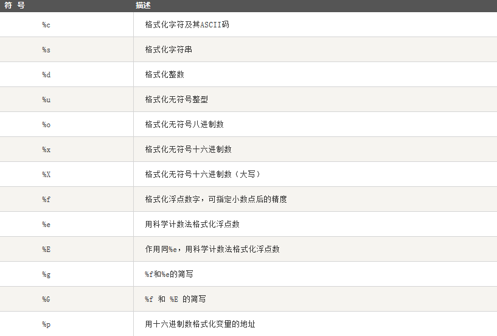

### 输入

```python
    a=input()#表示将用户输入得内容赋值给a，需要注意得是input默认得类型是字符串
```

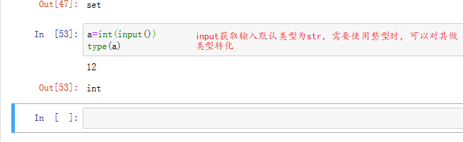

### 读文件

```python
#读文件
open("文件地址+文件名","操作形式")
```

open表示读文件，他有两个参数，第一个是文件的地址以及文件名，这里可以是相对路径也可以是绝对路径，但使用相对路径时，要读取的文件需和python文件在同一目录下。
第二个参数表示文件的权限，分为三种：
>r:表示读文件
>w:表示写文件
>a:表示追加文件，w，r都会覆盖之前的内容重新写入，而a会在原内容后添加
>b:表示二进制文件，即将文件以二进制的形式读入

打开的文件可以赋值给一个变量，即文件的句柄：

```python
f=open('D:\\Python\\test.txt','r')
#变量f即为句柄
#python中地址中为斜杠'/'或者两个反斜杠 '\\'
```

将文件内容显示出来，可以使用 ==read()== 函数或 ==readline()== 函数，两者的区别在于：

1. ==read()== 函数会将文件的全部内容读取出来；
2. ==readline()== 函数则只读取文件的一行内容。

使用时，两种方式：

```python
f=open('D:/python/test.txt','r')#这里可能会出现编码报错,解决如下
# f=open('D:python/test.txt','r',encoding='UTF-8')
#第一种方式
print(f.read())
print(f.raedline())
#第二种方式
data1=f.read()
print(data1)
data2=f.readline()
print(data2)
```

即可以将读的内容赋给一个变量，再对这个变量进行操作，也可以直接操作，不赋给变量。
文件操作结束后需关闭文件，即：

```python
f.colse()
```

### 写文件

```python
#方式1
f=open('D:/python/test.txt','w')
data1="hello"
data2='world'
f.write(data1)
f.write(data2)
f.close()
#只有当调用close函数后，才会保存文件，所以上述代码执行完后，test.txt文件中
#方式2
f=open('D:/python/test.txt','w')
data1="hello"
f.write(data1)
f.close()
data2='world'
f.write(data2)
f.close()
#这种方式在执行完后，test.txt文档中只会有字符 ‘world’，先前写入的 ‘hello’ 会被覆盖
#方式3
f=open('D:/python/test.txt','w')
data1="hello"
f.write(data1)
f.close()
data2='world'
f.write(data2)
f.close()
#将操作形式改为 a+ 也能得到方式1的结果
```
