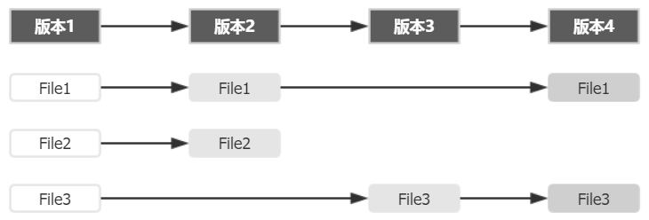
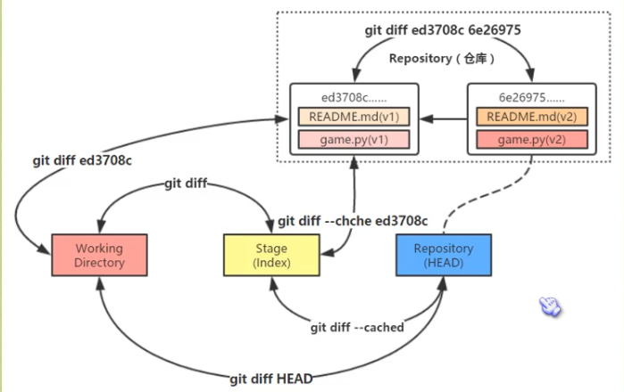

# git入门

## 初次使用

### 注册账户

> git config --global user.name "username"
> git config --global user.email "email"
>注：用户名要为英文

### Git记录形式

将每个版本独立储存,即如果每个版本中有文件发生变动，Git 会将整个文件复制并保存起来。这种设计看似会多消耗更多的空间，但在分支管理时却是带来了很多的益处和便利

### 三棵树

#### 工作区域、暂存区域和Git仓库

本地仓库有 Git 维护的三棵“树”组成，这是 Git 的核心框架。

>工作区域（Working Directory）:存放项目代码的地方;
>暂存区域（Stage）:用于临时存放改动内容，事实上它只是一个文件，保存即将提交的文件列表信息。
>Git 仓库（Repository）：安全存放数据的位置，存放用户提交的所有版本的数据。其中，HEAD 指向最新放入仓库的版本（这第三棵树，确切的说，应该是 Git 仓库中 HEAD 指向的版本）

#### git工作流程

>1. 在工作目录中添加、修改文件；
>2. 将需要进行版本管理的文件放入暂存区域；
>3. 将暂存区域的文件提交到 Git 仓库。
>因此，Git 管理的文件有三种状态：已修改（modified）、已暂存（staged）和已提交（committed），依次对应上边的每一个流程。

#### 实例

>注：文件编码采用utf-8无BOM的编码防止乱码，命令： git status 可以查看此时文件状态

1. 切换至本地储存仓库的目录;
2. 设置该目录为本地仓库： `git init` ;
3. 在本地目录下新建对应的文件,此时文件即在工作区域中;
4. 将文件添加到暂存区域： `git add <file>`,命令：`git rm --cached <file>`可以将add的文件移除，命令：`git reset HEAD <file>`则可以将最近一次提交的文件恢复到暂存区域，其中file是可选内容，如果不加file则表示将最近提交的所有内容回退；
5. 提交文件到git仓库： `git commit -am "此次提交的注释内容（因为）"`。

>命令：git add \<file>可以更新文件内容，而命令git checkout -- \<file>则是将更改的文件恢复到先前的状态

## 查看历史

>git log

## 回到过去

## 几个命令的功能

- add
  - 用于把工作目录的文件放入暂存区域
- commit
  - 用于把暂存区域的文件提交到Git仓库
- reset
  - 用于把Git仓库的文件还原到暂存区域
- checkout
  - 用于把暂存区域的文件还原到工作目录

## reset的命令选项

- `git reset --mixed HEAD~`
  - 移动HEAD的指向，将其指向上一个快照
  - 将HEAD移动后指向的快照回滚到暂存区域
  - 如果要将HEAD指向上几个快照，则只需在~后加上数字，如 `git reset --mixed HEAD~10`(将HEAD指针指向上十个快照)，其中，mixed是默认可选项
- `git reset --soft HEAD~`
  - 移动HEAD的指向，将其指向上一个快照（相当于撤销命令）
- `git reset --hard HEAD~`
  - 移动HEAD的指向，将其指向上一个快照
  - 将HEAD移动后指向的快照回滚到暂存区域
  - 将暂存区域的文件还原到工作目录

## 回滚指定文件（可向前向后）

git reset 快照id（至少五位）

## 回滚个别文件

`git reset 版本快照 文件名/路径`

## 版本对比

### 比较暂存区域和工作目录

`git diff`

### 比较两个历史快照

`git diff 快照id1 快照id2`

### 比较当前工作目录和Git仓库中的快照

`git diff 快照ID`

### 比较暂存区域和Git仓库快照

`git diff --cached [快照ID]`

## 修改最后一次提交、删除和重命名文件

- 执行带 `--amend 选项的 commit 提交命令`, Git 就会“更正”最近一次提交

## 删除文件

`git rm 文件名`

- 该命令删除的只是工作目录和暂存区域的文件，也就是取消跟踪，在下次提交时不纳入版本管理
- 当工作目录和暂存区域的同一个文件存在不同内容时，执行 `git rm -f 文件名`命令就可以把两个都删除
- 如果只删除暂存区域的文件（保留工作目录的），执行`git rm --cached 文件名`

## 重名名文件

`git mv 旧文件名 新文件名`

## 创建和切换分支

### 创建分支

`git branch 分支名`

### 切换分支

`git checkout 分支名`

## 合并和删除分支

### 合并分支

`git merge 分支名`

### 删除分支

`git branch -d 分支名`

## 匿名分支

`git checkout HEAD~`
在匿名分支中所有操作都不会保存下来，可以利用匿名分支做一些实验而不会产生任何影响

## checkout和reset的区别

### 恢复文件

`checkout`和`reset`都可以用来恢复指定快照的指定文件，并且他们都不会改变HEAD指针的指向。
区别：`reset`只将指定文件恢复到暂存区域（--mixed），而`checkout`是同时覆盖暂存区域和工作目录。

### 恢复快照

`reset`是用来“回到过去”的，根据选项不同，`reset`移动HEAD指针（--soft）->覆盖暂存区域（--mixed，默认）->覆盖工作目录（--hard）。
`checkout`是用于切换分支，实际上是通过移动HEAD指针和覆盖暂存区域、工作目录实现的。
二者区别在于：
1.对于`reset --hard`来说，`checkout`命令更安全，因为`checkout`在切换分之前会先检查一下当前的工作状态，如果不是“clean”的话，Git不会允许该操作；而`reset --hard`则是直接覆盖所有数据。
2.`reset`会移动HEAD所在分支的指向，而`checkout`只会移动HEAD自身来指向另一个分支

## GitHub

### 基本概念

- 仓库（Repository）
存放项目，一个开源项目就是一个仓库；
- 收藏（Star）
收藏项目，便于下次查看；
- 复制克隆项目（Fork）
本质上是在原有项目上创建一个分支，然后就项目全部复制到这个分支，进而可以任意修改而不对原项目产生影响；
- 发起请求（Pull Request）
fork的项目修改后可以向原项目发出请求，待原项目创建人查看后可以选择接收这个请求，进而使原项目得到更改（合并）；
- 关注（Watch）
如果关注了某个项目，那以后只要这个项目有更新，都会第一时间收到关于这个项目的更新通知；
- 事务卡片（Issue）
发现代码BUG，但是目前还没有成型代码，需要讨论；
- Github主页
账号创建成果或点击网址导航栏github图标都可以进入github主页，该页主要显示用户动态以及关注用户或关注仓库的动态，右侧显示所有的git库；
- 仓库主页
仓库主页主要显示项目信息，如：项目代码，版本，收藏/关注/fork情况等；
- 个人主页
个人信息：头像，个人简介，关注我的人，我关注的git库，我的开源项目，我贡献的开源项目等信息；

### git远程管理仓库

`git remote add origin https://github.com/song-10/WeakType.git`
`git push -u origin master`或者`git push`
如出现以下报错：
`failed to push some refs to 'https://github.com/song-10/WeakType.git`
可使用命令：
`git pull --rebase origin master`
