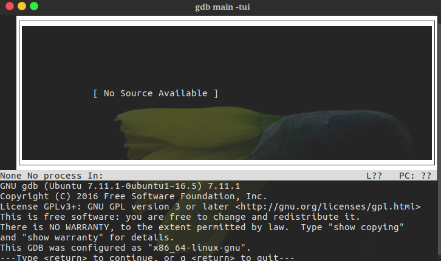

# gdb调试

## 简介

GDB(GNU Debugger)是Unix及Unix-like下的调试工具，可以调试ada,c,c++,asm,minimal,d,fortran,objective-c,go,java,pascal等语言。

大牛的博客:[gdb Debugging Full Example (Tutorial): ncurses](./gdb-Debugging-Full-Example(Tutorial).html)

## 针对c的程序的调试

C程序需要在编译时加上参数`-g`参数，保留调试信息，否则不能使用GDB调试。键入命令`gdb prog`即可开始调试。

```c++
    // test.c
    #include<stdio.h>

    int main(int argc, char *argv[])
    {
        if(1 >= argc)
        {
            printf("usage:hello name\n");
            return 0;
        }
        printf("Hello World! %s\n", argv[1]);
        return 0;
    }
```

## 启动调试

- 查看段的信息： `readelf`

```s
    readelf -S test | grep debug
```

- file查看strip状况

```s
    file test
```

如果结果最后是stripped，则说明该文件的符号表信息和调试信息已被出去，不能使用GDB调试。但是`not stripped`的情况并不能说明能够被调试

- 调试方式运行程序
    编译：`gcc -g -o test test.c`
    启动调试：`gdb test`
    因为程序需要参数，所以键入命令（进入gdb后）：`run Tom`,其中Tom为传入的参数，即run指令加上传入的参数即可开始运行程序。也可以在执行`run`前键入命令：`set args Tom`设置参数
- 调试core文件
  当程序`core dump`时，可能会产生core文件，它能很大程度定位问题。但前提是系统没有限制core文件的产生。可以键入命令`ulimit -c`查看，如果结果是0，那么需要设置让core文件能够产生：

  ```python
    ulimit -c unlimited  # 表示不限制core文件大小
    ulimit -c 10        # 设置最大大小，单位为块，一块默认为512字节
  ```
  
  调试core文件：

  ```s
    gdb test core文件名
  ```

- 调试已运行的程序
  键入命令`ps -ef|grep 进程名`或`pidof 进程名`获取进程id(prog_id)
  - attach方式调试
  进入gdb后键入指令：`attach prog_id`,如果出现以下报错：
  
  ```s
    Could not attach to process.  If your uid matches the uid of the target
    process, check the setting of /proc/sys/kernel/yama/ptrace_scope, or try
    again as the root user.  For more details, see /etc/sysctl.d/10-ptrace.conf
    ptrace: Operation not permitted.
  ```

  在root用户下修改：`/etc/sysctl.d/10-ptrace.conf`中的`kernel.yama.ptrace_scope`为0，即`kernel.yama.ptrace_scope = 0`
  
  - 直接调试相关id进程
  键入命令：`gdb test prog_id`或`gdb test --pid prog_id`
  - 已运行程序没有调试信息
  为了节省磁盘空间，已经运行的程序通常没有调试信息。但如果又不能停止当前程序重新启动调试时，可以用同样的代码，再编译出一个带调试信息的版本。然后使用和前面提到的方式操作。对于attach方式，在attach之前，使用file命令即可:

  ```s
    $ gdb
    (gdb) file test
    Reading symbols from test...done.
    (gdb)attach prog_id
  ```

## 断点设置

在指定位置设置断点之后，程序运行到该位置将会“暂停”，这个时候我们就可以对程序进行更多的操作，比如查看变量内容，堆栈情况等等，以帮助我们调试程序。

- 查看已设置的断点
  `info breakpoints`查看已设置的断点，它将会列出所有已设置的断点，每一个断点都有一个标号，用来代表这个断点。
- 断点设置

    ```c++
      // 例程
      // 编译：gcc -g -o test test.c
      #include<stdio.h>
      void printNum(int a)
      {
          printf("printNum\n");
          while(a > 0)
          {
          printf("%d\n",a);
          a--;
          }
      }
      void printNum2(int a,int num)
      {
          printf("printNum\n");
          while(a > num && a>0)
          {
              printf("%d\n",a);
              a--;
          }
      }
      int div(int a,int b)
      {
          printf("a=%d,b=%d\n",a,b);
          int temp = a/b;
          return temp;
      }
      int main(int argc,char *argv[])
      {
          printNum2(12,5);
          printNum(10);
          div(10,0);
          return 0;
      }
      ```

- 根据行号设置断点
  `b 9`或`b test.c:9`  break可简写为 b,在第九行设置断点
- 根据函数名设置断点
  `b printNum`在函数printNum处设置断点
- 根据条件设置断点
  假设程序某处发生崩溃，而崩溃的原因怀疑是某个地方出现了非期望的值，那么你就可以在这里断点观察，当出现该非法值时，程序断住。这个时候我们可以借助gdb来设置条件断点：`break test.c:23 if b==0`,在当b等于0时，程序将会在23行断下。这和condition有着类似的作用，加上断点号为1，那么:`condition 1 b==0`会使得b等于0时，产生断点1。而实际上可以很方便地用来改变断点产生的条件，例如，之前设置b==0时产生该断点，那么使用condition可以修改断点产生的条件。
- 根据规则设置断点
  `rbreak printNum*`对所有调用printNum函数都设置断点，即所有以printNum开头的函数都设置了断点；

  ```s
    #用法：rbreak file:regex
    rbreak .  # 对所有函数设置断点
    rbreak test.c:. #对test.c中的所有函数设置断点
    rbreak test.c:^print #对以print开头的函数设置断点
  ```

- 设置临时断点
  `tbreak test.c:10`在第10行设置临时断点，该处断点只生效一次
- 跳过多次设置断点
  `ignore 1 30`在断点号为1的地方设置断点，跳过次数为30次，即该处执行30次之后该处的断点才会生效
- 根据表达式值变化产生断点
  `watch a`观察变量a(a也可以替换成表达式)，接着让程序继续运行，如果a发生变化，则会打印相关内容，如：

  ```s
    Hardware watchpoint 2: a
    Old value = 12
    New value = 11
  ```

  这里需要注意的是，程序必须运行起来，否则就会报错：`No symbol "a" in current context.`。因为程序没有运行，当前上下文也就没有相关变量信息。
  `rwatch`和`awatch`同样可以设置观察点前者是当变量值被读时断住，后者是被读或者被改写时断住。
- 禁用或启动断点
  有些断点暂时不想使用，但又不想删除，可以暂时禁用或启用。例如：

  ```s
    disable # 禁用所有断点
    disable bnum  # 禁用标号为bnum的断点
    enable  # 启用所有断点
    enable bnum # 启用标号为bnum的断点
    enable delete bnum  # 启用标号为bnum的断点，并且在此之后删除该断点
  ```

- 断点清除
  断点清除主要用到clear和delete命令，常见使用如下：

  ```s
    clear # 删除当前行所有断点
    clear function  # 删除函数名为function从的断点
    clear filename：function  # 删除文件filename中函数function处的断点
    clear lineNum # 删除行号为lineNum处的断点
    clear f:lename:lineNum  # 删除文件filename中行号为lineNum处的断点
    delete  # 删除所有breakpoints，watchpoints和catchpoints
    delete bnum # 删除断点号为bnum的断点
  ```

## 变量查看

```c++
  // 例程
  //test.c
  #include<stdio.h>
  #include<stdlib.h>
  #include"testGdb.h"
  int main(void)
  {
      int a = 10; //整型
      int b[] = {1,2,3,5};  //数组
      char c[] = "hello,shouwang";//字符数组
      /*申请内存，失败时退出*/
      int *d = (int*)malloc(a*sizeof(int));
      if(NULL == d)
      {
          printf("malloc error\n");
          return -1;
      }
      /*赋值*/
      for(int i=0; i < 10;i++)
      {
          d[i] = i;
      }
      free(d);
      d = NULL;
      float e = 8.5f;
      return 0;
  }
  // test.h
  int a = 11;
  // 编译： gcc -g -o test test.c test.h
```

- 普通变量查看
  - 打印基本类型变量，数组，字符数组
    最常使用的是 print (简写为 p)打印变量内容。

    ```s
      (gdb) p a
      $1 = 10
      (gdb) p b
      $2 = {1, 2, 3, 5}
      (gdb) p c
      $3 = "hello,shouwang"
      (gdb)
    ```

    遇到多个函数或者多个文件会有同一个变量名时，可以在前面加上函数名或者文件名来区分：

    ```s
      (gdb) p 'test.h'::a
      $1 = 11
      (gdb) p 'main'::b
      $2 = {1, 2, 3, 5}
      (gdb)
    ```

  - 打印指针指向内容
    对于指针，`p d`的结果是指针的地址，要打印指针指向的内容，需要解引用：

    ```s
      (gdb) p *d
      $2 = 0
      (gdb) p *d@10
      $3 = {0, 1, 2, 3, 4, 5, 6, 7, 8, 9}
      (gdb)
    ```

    `*`只能打印第一个值，如果要打印多个值，后面需跟上`@`并加上要打印的长度或者`@`后跟上变量值：

    ```s
      (gdb) p *d@a
      $2 = {0, 1, 2, 3, 4, 5, 6, 7, 8, 9}
      (gdb)
    ```

    此外，$可表示上一个变量，而假设此时有一个链表linkNode，它有next成员代表下一个节点，则可使用下面方式不断打印链表内容：

    ```s
      (gdb) p *linkNode
      (这里显示linkNode节点内容)
      (gdb) p *$.next
      (这里显示linkNode节点下一个节点的内容)
    ```

    如果想要查看数组内容，可以对下标累加或者定义一个临时的环境变量：

    ```shell
      (gdb) set $index=0
      (gdb) p b[$index++]
      $11 = 1
      (gdb) p b[$index++]
      $12 = 2
      (gdb) p b[$index++]
      $13 = 3
    ```

- 按照特定格式打印变量
  对于简单的数据，print默认的打印方式已经足够了，它会根据变量类型的格式打印出来，但是有时候这还不够，我们需要更多的格式控制。常见格式控制字符如下：

  使用|说明
  --|--
  x |按十六进制格式显示变量
  d |按十进制格式显示变量
  u |按十六进制格式显示无符号整型
  o |按八进制格式显示变量
  t |按二进制格式显示变量
  a |按十六进制格式显示变量
  c |按字符格式显示变量
  f |按浮点数格式显示变量

  例子：

  ```s
    (gdb) p c
    $18 = "hello,shouwang"
    (gdb) p/x c
    $19 = {0x68, 0x65, 0x6c, 0x6c, 0x6f, 0x2c, 0x73, 0x68, 0x6f, 0x75, 0x77, 0x61, 0x6e, 0x67, 0x0}
    (gdb)
    (gdb) p e
    $1 = 8.5
    (gdb) p/t e
    $2 = 1000
    (gdb)
  ```

- 查看内存内容
  examine(简写为x)可以用来查看内存地址中的值，格式如下：
  
  ```s
    x/[n][f][u] addr
  ```

  其中，n 表示要显示的内存单元数，默认值为1；f 表示要打印的格式，前面已经提到了格式控制字符；u 要打印的单元长度；addr 内存地址。
  常见的类型单元有：b 字节；h 半字，即双字节；w 字，即四字节；g 八字节。
  例：

  ```s
    (gdb) x/4tb &e
    0x7fffffffdbd4:    00000000    00000000    00001000    01000001
    (gdb)
  ```

- 自动显示变量内容
  `display e`每次程序断下时，就会显示变量e的内容；`into display`可以查看有哪些变量被设置了display；`delete display num`可以清楚设置的display，其中 num 为变量前的编号，不带num时清楚所有；`disable display num`使display能，其中，num为变量前面的编号，不带num时使能所有。
- 查看寄存器内容
  
  ```s
    (gdb)info registers
    rax            0x0    0
    rbx            0x0    0
    rcx            0x7ffff7dd1b00    140737351850752
    rdx            0x0    0
    rsi            0x7ffff7dd1b30    140737351850800
    rdi            0xffffffff    4294967295
    rbp            0x7fffffffdc10    0x7fffffffdc10
    ......
  ```

## 单步调试

```c++
  /*Step.c
  * gcc -g -o Step Step.c
  */
  #include<stdio.h>
  /*计算简单乘法,这里没有考虑溢出*/
  int add(int a, int b)
  {
      int c = a + b;
      return c;
  }
  /*打印从0到num-1的数*/
  int count(int num)
  {
      int i = 0;
      if(0 > num)
          return 0;
      while(i < num)
      {
          printf("%d\n",i);
          i++;
      }
      return i;
  }
  int main(void)
  {
      int a = 3;
      int b = 7;
      printf("it will calc a + b\n");
      int c = add(a,b);
      printf("%d + %d = %d\n",a,b,c);
      count(c);
      return 0;
  }
```

`list`或简写为`l`，可以将源码列出来

- 单步执行(next)
  next命令（可简写为n）用于在程序断住后，继续执行下一条语句，假设已经启动调试，并在第12行停住，如果要继续执行，则使用n执行下一条语句，如果后面跟上数字num，则表示执行该命令num次，就达到继续执行n行的效果了：

  ```s
    $ gdb Step  # 启动调试
    (gdb)b 25       #将断点设置在25行
    (gdb)run        #运行程序
    Breakpoint 1, main () at gdbStep.c:25
    25        int b = 7;
    (gdb) n     #单步执行
    26        printf("it will calc a + b\n");
    (gdb) n 2   #执行两次
    it will calc a + b
    28        printf("%d + %d = %d\n",a,b,c);
    (gdb)
  ```

- 单步步入(step)
  step命令（可简写为s），它可以单步跟踪到函数内部，但前提是该函数有调试信息并且有源码信息。

  ```s
    $ gdb Step    #启动调试
    (gdb) b 25       #在25行设置断点
    Breakpoint 1 at 0x4005d3: file gdbStep.c, line 25.
    (gdb) run        #运行程序
    Breakpoint 1, main () at gdbStep.c:25
    25        int b = 7;
    (gdb) s
    26        printf("it will calc a + b\n");
    (gdb) s     #单步进入，但是并没有该函数的源文件信息
    _IO_puts (str=0x4006b8 "it will calc a + b") at ioputs.c:33
    33    ioputs.c: No such file or directory.
    (gdb) finish    #继续完成该函数调用
    Run till exit from #0  _IO_puts (str=0x4006b8 "it will calc a + b")
        at ioputs.c:33
    it will calc a + b
    main () at gdbStep.c:27
    27        int c = add(a,b);
    Value returned is $1 = 19
    (gdb) s        #单步进入，现在已经进入到了add函数内部
    add (a=13, b=57) at gdbStep.c:6
    6        int c = a + b;
  ```

  s命令会尝试进入函数，但是如果没有该函数源码，需要跳过该函数执行，可使用finish命令，继续后面的执行。如果没有函数调用，s的作用与n的作用并无差别，仅仅是继续执行下一行。它后面也可以跟数字，表明要执行的次数。
  step还有一个选项，用来设置当遇到没有调试信息的函数，s命令是否跳过该函数，而执行后面的。默认情况下，它是会跳过的，即step-mode值是off：

  ```s
    (gdb) show step-mode
    Mode of the step operation is off.
    (gdb) set step-mode on
    (gdb) set step-mode off
  ```

  stepi（可简写为si），它与step不同的是，每次执行一条机器指令：

  ```s
    (gdb) si
    0x0000000000400573    6       int c = a + b;
    (gdb) display/i $pc
    1: x/i $pc
    => 0x400573 <add+13>:    mov    -0x18(%rbp),%eax
    (gdb)
  ```

- 继续执行到下一个断点(continue)
  continue命令（可简写为c）或者fg，它会继续执行程序，直到再次遇到断点处：

  ```s
    $ gdb Step
    (gdb)b 18    #在count函数循环内打断点
    (gdb)run
    Breakpoint 1, count (num=10) at gdbStep.c:18
    18            i++;
    (gdb) c      #继续运行，直到下一次断住
    Continuing.
    1

    Breakpoint 1, count (num=10) at gdbStep.c:18
    18            i++;
    (gdb) fg     #继续运行，直到下一次断住
    Continuing.
    2

    Breakpoint 1, count (num=10) at gdbStep.c:18
    18            i++;
    (gdb) c 3    #跳过三次
    Will ignore next 2 crossings of breakpoint 1.  Continuing.
    3
    4
    5

    Breakpoint 1, count (num=10) at gdbStep.c:18
    18            i++;
  ```

- 继续运行到指定位置(untill)
  假设在25行断下，现在想要运行到29行处断下(利用的是临时断点)，就可以使用until命令(可简写为u)

  ```s
    $ gdb Step
    (gdb)b 25
    (gdb)run
    (gdb) u 29
    it will calc a + b
    3 + 7 = 10
    main () at gdbStep.c:29
    29        count(c);
    (gdb)
  ```

- 跳过执行(skip)
  skip可以在step时跳过一些不想关注的函数或者某个文件的代码:

  ```s
    $ gdb Step
    (gdb) b 27
    Breakpoint 1 at 0x4005e4: file gdbStep.c, line 27.
    (gdb) skip function add    #step时跳过add函数
    Function add will be skipped when stepping.
    (gdb) info skip   #查看step情况
    Num     Type           Enb What
    1       function       y   add
    (gdb) run
    Starting program: /home/hyb/workspaces/gdb/gdbStep
    it will calc a + b

    Breakpoint 1, main () at gdbStep.c:27
    27        int c = add(a,b);
    (gdb) s
    28        printf("%d + %d = %d\n",a,b,c);
    (gdb)
  ```

  再使用skip之后，使用step将不会进入add函数。step也后面也可以跟文件：`skip file Step.c`,这样Step.c的函数都不会进入。
  其他相关命令：

  命令|说明
  --|--
  `skip delete [num]`|删除skip
  `skip enable [num]`|使能skip
  `skip disable [num]`|去使能skip

  其中num是通过info skip看到的num值，可以带或不带该值，如果不带num，则针对所有skip，如果带上了，则只针对某一个skip。

## 源码查看

```c++
  // main.c
  #include<stdio.h>
  #include"test.h"
  int main(void)
  {
      printf("it will print from 5 to 1\n");
      printNum(5);
      printf("print end\n");

      printf("it will print 1 to 5\n");
      printNum1(5);
      printf("print end\n");
      return 0;
  }

  // test.h
  #ifndef _TEST_H
  #define _TEST_H
  #include<stdio.h>
  void printNum(int n);
  void printNum1(int n);
  #endif

  // test.c
  #include"test.h"
  void printNum(int n)
  {
      if( n < 0)
          return;
      while(n > 0)
      {
          printf("%d\n",n);
          n--;
      }
  }

  void printNum1(int n)
  {
      if( n < 0)
          return;
      int i = 1;
      while(i <= n)
      {
          printf("%d\n",i);
          i++;
      }
  }

  // 编译： gcc -g -o main main.c test.c test.h
```

- 列出源码
  - 直接打印源码

    ```s
      $ gdb main
      (gdb) l
      1    //main.c
      2    #include<stdio.h>
      3    #include"test.h"
      4    int main(void)
      5    {
      6        printf("it will print from 5 to 1\n");
      7        printNum(5);
      8        printf("print end\n");
      9
      10        printf("it will print 1 to 5\n");
      (gdb)
    ```

    直接输入l可从第一行开始显示源码，继续输入l，可列出后面的源码。后面也可以跟上+或者-，分别表示要列出上一次列出源码的后面部分或者前面部分。
  - 列出指定行附近的源码
    l后面可以跟行号，表明要列出附近的源码：

    ```s
      (gdb) l 9
      4    int main(void)
      5    {
      6        printf("it will print from 5 to 1\n");
      7        printNum(5);
      8        printf("print end\n");
      9
      10        printf("it will print 1 to 5\n");
      11        printNum1(5);
      12        printf("print end\n");
      13        return 0;
    ```

    l后面跟上9，表明要列出第9行附近的源码。
  - 列出指定函数附近的源码

    ```s
      (gdb) l printNum
      1    #include"test.h"
      2    void printNum(int n)
      3    {
      4        if( n < 0)
      5            return;
      6        while(n > 0)
      7        {
      8            printf("%d\n",n);
      9            n--;
      10        }
    ```

    l后面跟上函数名，就可以列出函数附近的源码。
  - 设置源码一次列出行数
    通过listsize属性来设置每次列出的行数：

    ```s
      (gdb) set listsize 20
      (gdb) show listsize
      Number of source lines gdb will list by default is 20.
    ```

    设置每次列出20行，当然也可以设置为0或者unlimited，这样设置之后，列出就没有限制。
  - 列出指定行之间的源码

    ```s
      (gdb) l 3,15
      3    {
      4        if( n < 0)
      5            return;
      6        while(n > 0)
      7        {
      8            printf("%d\n",n);
      9            n--;
      10        }
      11    }
      12
      13    void printNum1(int n)
      14    {
      15        if( n < 0)
    ```

    启始行和结束行号之间用逗号隔开。两者之一也可以省略:

    ```s
      (gdb) list 3,
      3    {
      4        if( n < 0)
      5            return;
      6        while(n > 0)
      7        {
      8            printf("%d\n",n);
      9            n--;
      10        }
      11    }
      12
    ```

    省略结束行的时候，它列出从开始行开始，到指定大小行结束，而省略开始行的时候，到结束行结束，列出设置的大小行，例如默认设置为10行，则到结束行为止，总共列出10行。
  - 列出指定文件的源码
    `l location`查看指定文件的源码，其中location可以是文件名加行号或函数名:

    ```s
      # 查看指定文件指定行
      (gdb) l test.c:1
      1    #include"test.h"
      2    void printNum(int n)
      3    {
      4        if( n < 0)
      5            return;
      6        while(n > 0)
      7        {
      8            printf("%d\n",n);
      9            n--;
      10        }
      (gdb)
      # 查看指定文件指定函数
      (gdb) l test.c:printNum1
      9            n--;
      10        }
      11    }
      12
      13    void printNum1(int n)
      14    {
      15        if( n < 0)
      16            return;
      17        int i = 1;
      18        while(i <= n)
      (gdb)
      # 查看指定文件指定行之间
      (gdb) l test.c:printNum1
      9            n--;
      10        }
      11    }
      12
      13    void printNum1(int n)
      14    {
      15        if( n < 0)
      16            return;
      17        int i = 1;
      18        while(i <= n)
      (gdb)
    ```

- 指定源码路径
  - 源码被移走
    可以使用dir命名指定源码路径：

    ```s
      (gdb) dir ./temp
      Source directories searched: /home/hyb/workspaces/gdb/sourceCode/./temp:$cdir:$cwd
      # 指定源码路径为./temp(这里也可以使用绝对路径)
    ```

  - 更换源码目录
    可以使用`set substitute-path from to`将原来的源码路径替换为新的路径,可以通过readelf命令查看源码路径：

    ```s
      $ readelf main -p .debug_str
      [     0]  long unsigned int
      [    12]  short int
      [    1c]  /home/nop/workspaces/gdb/sourceCode
      [    40]  main.c
      ......
    ```

    main为要调试的程序，通过readelf可以看到原来的路径，通过set命令更改它：

    ```s
      (gdb) set substitute-path /home/nop/gdb/sourceCode /home/nop/gdb/sourceCode/temp
      (gdb) show substitute-path
      List of all source path substitution rules:
        `/home/nop/gdb/sourceCode' -> `/home/nop/gdb/sourceCode/temp'.
      (gdb)
    ```

    设置完成后，可以通过`show substitute-path`来查看设置结果。
    需要注意的是，这里对路径做了字符串替换，那么如果你有多个路径，可以做多个替换。甚至可以对指定文件路径进行替换。可以通过`unset substitute-path [path]`取消替换。
  - 编辑源码
    为了避免已经启动了调试之后，需要编辑源码，又不想退出，可以直接在gdb模式下编辑源码，它默认使用的编辑器是/bin/ex，也可以设置为其他编辑器：

    ```s
      > EDITOR=/usr/bin/vim
      > export EDITOR
    ```

    可以通过where或witch命令查看软件位置：

    ```s
      > whereis vim
      vim: /usr/bin/vim /usr/bin/vim.tiny /usr/bin/vim.basic /usr/bin/vim.gnome /etc/vim /usr/share/vim /usr/share/man/man1/vim.1.gz
      > which vim
      /usr/bin/vim
    ```

    使用命令`edit location`在调试时编辑源码：

    ```s
      (gdb)edit 3  #编辑第三行
      (gdb)edit printNum #编辑printNum函数
      (gdb)edit test.c:5 #编辑test.c第五行
    ```

    编辑完保存后需要重新编译程序：

    ```s
      (gdb)shell gcc -g -o main main.c test.c
    ```

    需要注意的是，为了在gdb调试模式下执行shell命令，需要在命令之前加上shell，表明这是一条shell命令。这样就能在不用退出GDB调试模式的情况下编译程序了。
- 另一种模式
  启动时，带上`tui(Text User Interface)`参数，会将调试在多个文本窗口呈现：

  ```s
    gdb main -tui
  ```


