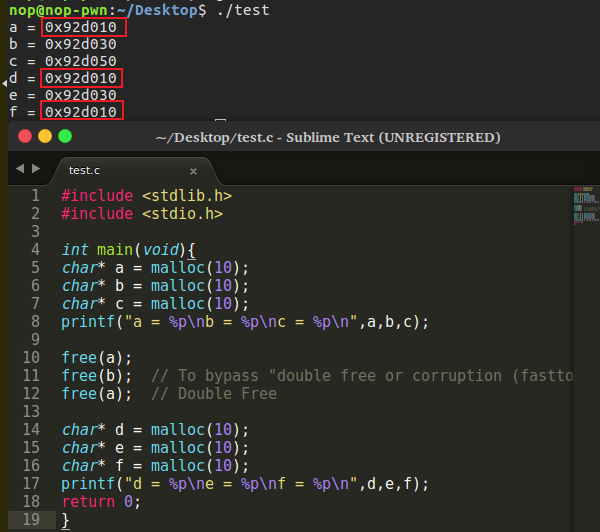

# Double Free

多次释放资源可能会导致内存泄漏，分配器（allocator）的数据结构被破坏，可被攻击者利用。为了避免glibc进行“double free or corruption（fasttop）”安全检查，将在两个释放之间释放另一个chunk。这意味着两个不同的’mallocs’将返回相同的块。两个指针都指向相同的内存地址。如果其中一个受攻击者的控制，他可以修改其他指针的内存，导致各种攻击（包括代码执行）

```c++
a = malloc(10);
b = malloc(10);
c = malloc(10);

free(a);
free(b);  // To bypass "double free or corruption (fasttop)" check
free(a);  // Double Free

d = malloc(10);
e = malloc(10);
f = malloc(10);
```

fast bin 的情况：

1. free(a): `head -> a ->tail`
2. free(b): `head -> b -> a -> tail`
3. free(a): `head -> a -> b -> a -> tail`
4. malloc(d): `head -> b -> a -> tail; d -> a`
5. malloc(e): `head -> a -> tail; e -> b`
6. malloc(f): `head -> tail; f -> a`


