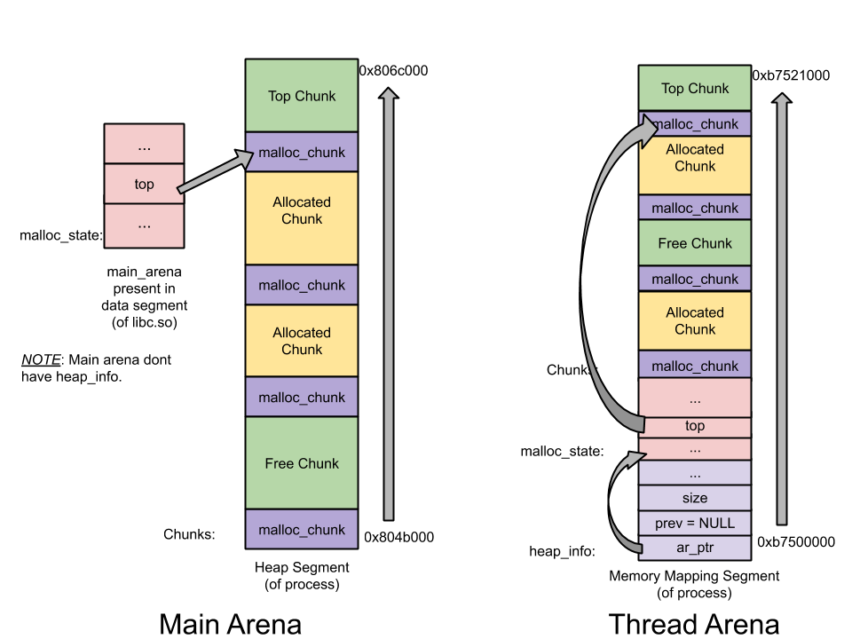
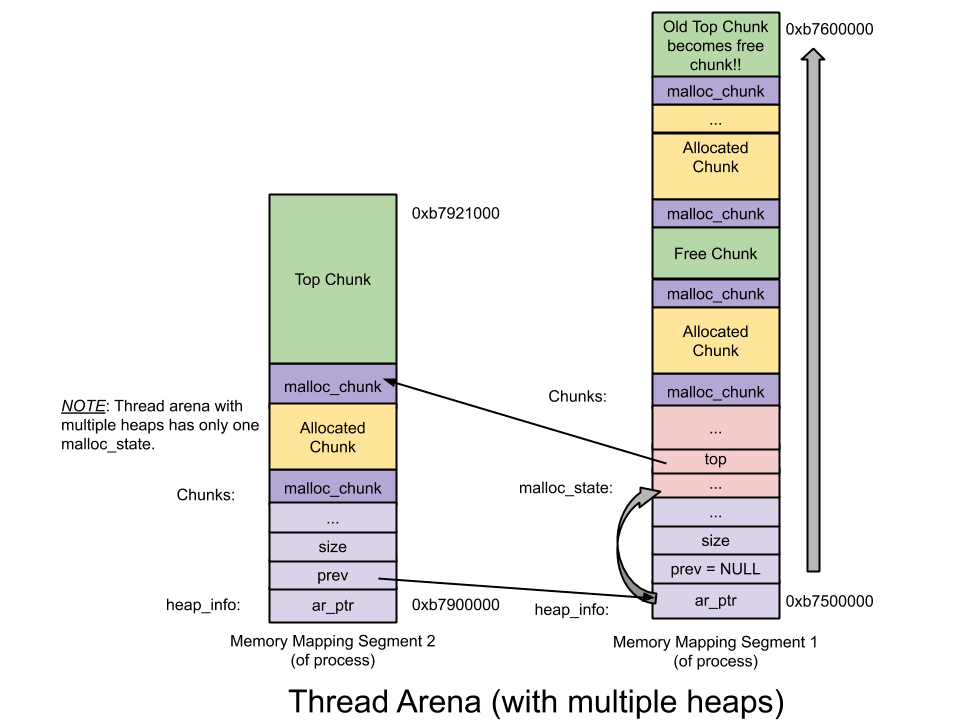
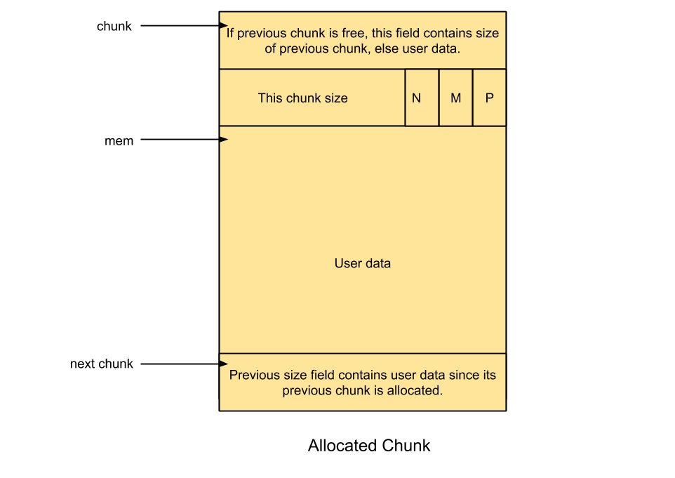
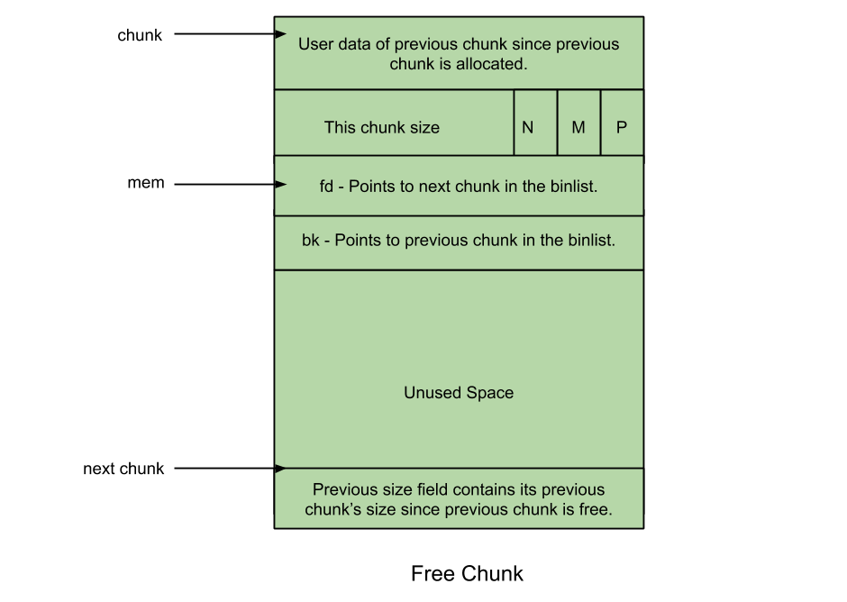
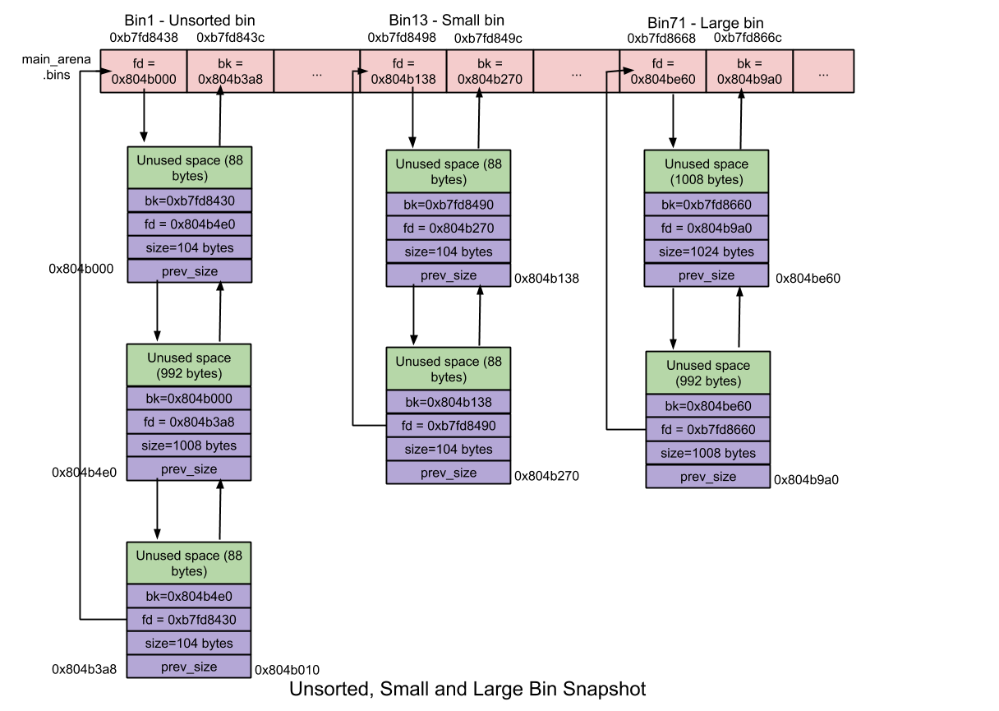

# Understanding glibc malloc(翻译)

[原文链接](https://sploitfun.wordpress.com/2015/02/10/understanding-glibc-malloc/comment-page-1/)

> 本文翻译仅作自我理解所用，对内容有所删减和更改

分配器：

- dlmalloc – General purpose allocator
- ptmalloc2 – glibc
- jemalloc – FreeBSD and Firefox
- tcmalloc – Google
- libumem – Solaris
- …

每个内存分配器都声称他们是快的、可扩展的和效的！但是并非所有的分配器都能够和我们的程序兼容。内存寻求大的程序在运行性能上很大程度取决于内存分配器的性能。在这篇文章中，我将会讨论`glibc malloc`的内存分配器。这篇文章中，为了更好的理解 `glibc malloc`，我将会结合最新的源代码。

> 历史： ptmalloc2 是dlmalloc的分支。这个分支之后，在2006年添加了多线程支持。在它的官方版本中，ptmalloc2 被集成到glibc的源代码中，这之后每次代码的变化都会到glibc的源代码。于是，在ptmalloc2 和 glibc的malloc之间可能有很多的改变

## System Calls

在这篇文章里，malloc 是通过 brk 和 mmap 系统调用实现的[syscalls used by malloc](./pwn/linux_glibc1.md)

## Threading

在早些时候的Linux，dlmalloc 是默认使用的内存分配器。但是之后由于ptmalloc2的多线程支持，ptmalloc2变成linux默认使用的内存分配器。多线程支持有助于提升内存分配器的性能进而应用程序的性能。在dlmalloc中，当两个进程同时调用malloc时，**只有一个进程**可以进入临界区，因为只有空闲链表结构可以被所有可用线程共享。因此，内存分配在多线程进程上花费时间，导致性能下降。但是在ptmalloc2中两个进程同时调用malloc时两个进程可以同时得到内存，因为每个线程都维护一个独立的heap段，所以维护这些heap段的空闲链表结构也是独立的。为每个线程保持独立的heap段和空闲的数据链表结构叫做 **per thread arena**
**示例：**

```c++
/* Per thread arena example. */
#include <stdio.h>
#include <stdlib.h>
#include <pthread.h>
#include <unistd.h>
#include <sys/types.h>

void* threadFunc(void* arg) {
        printf("Before malloc in thread 1\n");
        getchar();
        char* addr = (char*) malloc(1000);
        printf("After malloc and before free in thread 1\n");
        getchar();
        free(addr);
        printf("After free in thread 1\n");
        getchar();
}

int main() {
        pthread_t t1;
        void* s;
        int ret;
        char* addr;

        printf("Welcome to per thread arena example::%d\n",getpid());
        printf("Before malloc in main thread\n");
        getchar();
        addr = (char*) malloc(1000);
        printf("After malloc and before free in main thread\n");
        getchar();
        free(addr);
        printf("After free in main thread\n");
        getchar();
        ret = pthread_create(&t1, NULL, threadFunc, NULL);
        if(ret)
        {
                printf("Thread creation error\n");
                return -1;
        }
        ret = pthread_join(t1, &s);
        if(ret)
        {
                printf("Thread join error\n");
                return -1;
        }
        return 0;
}
```

**输出分析：**
**main thread的malloc调用前：**通过下面的输出我们可以看到还没有heap段，也没有线程的栈因为thread1还未被创建

```s
sploitfun@sploitfun-VirtualBox:~/ptmalloc.ppt/mthread$ ./mthread
Welcome to per thread arena example::6501
Before malloc in main thread
...
sploitfun@sploitfun-VirtualBox:~/ptmalloc.ppt/mthread$ cat /proc/6501/maps
08048000-08049000 r-xp 00000000 08:01 539625     /home/sploitfun/ptmalloc.ppt/mthread/mthread
08049000-0804a000 r--p 00000000 08:01 539625     /home/sploitfun/ptmalloc.ppt/mthread/mthread
0804a000-0804b000 rw-p 00001000 08:01 539625     /home/sploitfun/ptmalloc.ppt/mthread/mthread
b7e05000-b7e07000 rw-p 00000000 00:00 0
...
sploitfun@sploitfun-VirtualBox:~/ptmalloc.ppt/mthread$
```

**main thread的malloc调用之后：**从下面的输出可以看到heap段已经创建，并且在数据段（0804b000-0806c000）上面，这说明heap段是通过增加brk的值创建的。此外需要注意的是虽然用户只是请求了1000bytes，却创建了132kb的堆内存。堆内存的这块连续的区域被叫做 arena，因为这个arena被主线程创建所以也叫 main arena。另外的分配请求使用这块区域分配直到它用完为止。当**arena 的空闲空间用完**，可以通过增加brk的值来增加arena的大小（之后 top chunk的size值会被调整到新的arena的大小）。类似的，当有太多空闲空间的时候，arena也可以通过 shrink 来减小大小。

> 注意：top chunk 是一个arena 最顶端的chunk，详细内容参见后文“Top Chunk”

```s
sploitfun@sploitfun-VirtualBox:~/ptmalloc.ppt/mthread$ ./mthread
Welcome to per thread arena example::6501
Before malloc in main thread
After malloc and before free in main thread
...
sploitfun@sploitfun-VirtualBox:~/lsploits/hof/ptmalloc.ppt/mthread$ cat /proc/6501/maps
08048000-08049000 r-xp 00000000 08:01 539625     /home/sploitfun/ptmalloc.ppt/mthread/mthread
08049000-0804a000 r--p 00000000 08:01 539625     /home/sploitfun/ptmalloc.ppt/mthread/mthread
0804a000-0804b000 rw-p 00001000 08:01 539625     /home/sploitfun/ptmalloc.ppt/mthread/mthread
0804b000-0806c000 rw-p 00000000 00:00 0          [heap]
b7e05000-b7e07000 rw-p 00000000 00:00 0
...
sploitfun@sploitfun-VirtualBox:~/ptmalloc.ppt/mthread$
```

**main thread 中free之后：**从下面的输出可以看出当申请的内存区域被释放，释放的内存随后并没有马上还给操作系统。分配的内存区域（1000bytes大小）只是被释放到 ‘glibc malloc’，它用来将这个空闲块添加到 main arena 的bin（在 glibc malloc中，空闲链表结构被称为 bins）。之后当用户请求分配内存时，‘glibc malloc’不会从内核获取新的堆内存而是试图在bin中寻找空闲的内存块。只有当没有空闲块的时候，才会从内核获得内存。

```s
sploitfun@sploitfun-VirtualBox:~/ptmalloc.ppt/mthread$ ./mthread
Welcome to per thread arena example::6501
Before malloc in main thread
After malloc and before free in main thread
After free in main thread
...
sploitfun@sploitfun-VirtualBox:~/lsploits/hof/ptmalloc.ppt/mthread$ cat /proc/6501/maps
08048000-08049000 r-xp 00000000 08:01 539625     /home/sploitfun/ptmalloc.ppt/mthread/mthread
08049000-0804a000 r--p 00000000 08:01 539625     /home/sploitfun/ptmalloc.ppt/mthread/mthread
0804a000-0804b000 rw-p 00001000 08:01 539625     /home/sploitfun/ptmalloc.ppt/mthread/mthread
0804b000-0806c000 rw-p 00000000 00:00 0          [heap]
b7e05000-b7e07000 rw-p 00000000 00:00 0
...
sploitfun@sploitfun-VirtualBox:~/ptmalloc.ppt/mthread$
```

**thread1调用malloc之前：**从下面的输出可以看到此时thread1并没有heap段但是它的栈已经被创建

```s
sploitfun@sploitfun-VirtualBox:~/ptmalloc.ppt/mthread$ ./mthread
Welcome to per thread arena example::6501
Before malloc in main thread
After malloc and before free in main thread
After free in main thread
Before malloc in thread 1
...
sploitfun@sploitfun-VirtualBox:~/ptmalloc.ppt/mthread$ cat /proc/6501/maps
08048000-08049000 r-xp 00000000 08:01 539625     /home/sploitfun/ptmalloc.ppt/mthread/mthread
08049000-0804a000 r--p 00000000 08:01 539625     /home/sploitfun/ptmalloc.ppt/mthread/mthread
0804a000-0804b000 rw-p 00001000 08:01 539625     /home/sploitfun/ptmalloc.ppt/mthread/mthread
0804b000-0806c000 rw-p 00000000 00:00 0          [heap]
b7604000-b7605000 ---p 00000000 00:00 0
b7605000-b7e07000 rw-p 00000000 00:00 0          [stack:6594]
...
sploitfun@sploitfun-VirtualBox:~/ptmalloc.ppt/mthread$
```

**thread1调用malloc之后：**从下面的输出我们可以看到thread1的heap段已经被创建了。存在于内存映射段（b7500000-b7521000 大小为132kb），这说明堆内存是通过使用mmap创建的而不是像main thread一样使用 sbrk。同样的，尽管用户申请的内存大小只有1000bytes，依然有 1MB 的堆内存大小映射到进程的地址空间。在这1MB的空间中，只有132kb有读写权限即是此线程的堆内存。这块连续的内存区域（132kb）被叫做thread arena

> 注意：当用户请求的大小超过128kb（比如 malloc(132*1024)）并且当在arena中没有足够的内存来满足用户的申请的时候，无论是向main arena还是thread arena申请内存都是通过使用mmap分配内存（而不是使用 sbrk）

```s
sploitfun@sploitfun-VirtualBox:~/ptmalloc.ppt/mthread$ ./mthread
Welcome to per thread arena example::6501
Before malloc in main thread
After malloc and before free in main thread
After free in main thread
Before malloc in thread 1
After malloc and before free in thread 1
...
sploitfun@sploitfun-VirtualBox:~/ptmalloc.ppt/mthread$ cat /proc/6501/maps
08048000-08049000 r-xp 00000000 08:01 539625     /home/sploitfun/ptmalloc.ppt/mthread/mthread
08049000-0804a000 r--p 00000000 08:01 539625     /home/sploitfun/ptmalloc.ppt/mthread/mthread
0804a000-0804b000 rw-p 00001000 08:01 539625     /home/sploitfun/ptmalloc.ppt/mthread/mthread
0804b000-0806c000 rw-p 00000000 00:00 0          [heap]
b7500000-b7521000 rw-p 00000000 00:00 0
b7521000-b7600000 ---p 00000000 00:00 0
b7604000-b7605000 ---p 00000000 00:00 0
b7605000-b7e07000 rw-p 00000000 00:00 0          [stack:6594]
...
sploitfun@sploitfun-VirtualBox:~/ptmalloc.ppt/mthread$
```

**thread1 调用free之后：**通过下面的输出我们可以看出释放已分配的内存区域并不会将堆内存释放到操作系统而是将分配的内存（大小为1000bytes）释放到‘glibc malloc’，它会将这块空闲的内存添加到线程的 arenas bin

```s
sploitfun@sploitfun-VirtualBox:~/ptmalloc.ppt/mthread$ ./mthread
Welcome to per thread arena example::6501
Before malloc in main thread
After malloc and before free in main thread
After free in main thread
Before malloc in thread 1
After malloc and before free in thread 1
After free in thread 1
...
sploitfun@sploitfun-VirtualBox:~/ptmalloc.ppt/mthread$ cat /proc/6501/maps
08048000-08049000 r-xp 00000000 08:01 539625     /home/sploitfun/ptmalloc.ppt/mthread/mthread
08049000-0804a000 r--p 00000000 08:01 539625     /home/sploitfun/ptmalloc.ppt/mthread/mthread
0804a000-0804b000 rw-p 00001000 08:01 539625     /home/sploitfun/ptmalloc.ppt/mthread/mthread
0804b000-0806c000 rw-p 00000000 00:00 0          [heap]
b7500000-b7521000 rw-p 00000000 00:00 0
b7521000-b7600000 ---p 00000000 00:00 0
b7604000-b7605000 ---p 00000000 00:00 0
b7605000-b7e07000 rw-p 00000000 00:00 0          [stack:6594]
...
sploitfun@sploitfun-VirtualBox:~/ptmalloc.ppt/mthread$
```

## Arena

**arena的个数：**上面的例子中，我们可以看到主线程包含 main arena，thread1包含它自己的 thread arena。所以无论线程数是多少，线程和arena有一一对应的映射关系吗？当然不是。一个程序可以包含比核心数跟多的线程数，但是在这种情况下，每个线程有一个arena是有点昂贵且没有用的。于是，程序的 arena 会被运行系统的核心数所限制

```s
For 32 bit systems:
     Number of arena = 2 * number of cores.
For 64 bit systems:
     Number of arena = 8 * number of cores.
```

### 多个arena

**示例：**设想有一个多线程的程序（4个线程-一个主线程3个用户线程）在一个32位系统（1核心）上运行。这里线程数大于2*1（核心数）。在这个情况下，‘glibc malloc’会确保多个arena能被所有可用线程所共享。但是它是怎样共享的？

- 当主线程首次调用malloc的时候，分配得到一个arena并使用它不需要任何条件
- 当线程1和线程2第一次调用malloc的时候，得到一个新的arena并使用不需要任何条件。这个时候，线程和arena有一对一的映射关系
- 当线程3第一次调用malloc的时候，达到了arena的数量限制，于是尝试重用存在的arenas(一个main arena和两个thread arena)
- 重用：
  - 遍历可用的arenas同时尝试去lock这个arena
  - 如果成功lock（假设 main arean 成功lock），返回这个arena给用户
  - 如果没有arena是空闲的，那么将thread3阻塞直到有可用的arena
- 当thread第二次调用malloc，mallco会尝试使用最近访问的arena（这里是main arena）。如果main arena是空闲的就可以使用否则thread阻塞直到main arena空闲。所以此时main arena被主线程和thread3所共享

### 多个heap

在‘glibc malloc’源码中主要是下面的三个结构：

- heap_info: heap header,单个线程的arena可用有多个堆。每个堆都有他自己的header。为什么需要多个堆？每个thread arena开始时**只有一个**堆，但是当这个heap段的空间用完时，通过映射到这个arena来获得新的heap（非连续性的）
- malloc_state： arena header，单个线程的arena可以有多个堆，但是这些所有的堆只有一个arena header。arena header 包含bins、top chunk、last remainder chunk等的信息
- malloc_chunk: chunk header，经过用户的申请一个堆被分割成许多的chunks，每个chunks都有自己的chunk header

> 注意：
> 1.main arena 没有多个heap，所以它没有 heap_info.当main arena空间被用完时，通过 sbrk 拓展堆内存（连续区域），直到碰到内存的映射段为止
> 2.与thread arena不同，main arena 的arena header不是heap段的一部分，它是一个全局变量，所以它在libc.so的数据段

下图所示的是main arena和thread arena（单个堆段）：



下图为 thread arena（多个堆段）



## chunk

一个堆段里的chunk是下面几种类型中的一种：

- Allocated chunk
- Free chunk
- Top chunk
- Last Remainder chunk

### Allocated chunk



**prev_size:**如果前一个chunk是空闲的，这部分内容表示前一个chunk的大小。如果前一个chunk不是空闲的，这部分内容可以被前一个chunk的user data所覆盖
**size：**这部分内容表示当前被分配的chunk大小，最后3bit是标志信息：

- PREV_INUSE(P): 当前一个chunk被分配时，设置这一位
- IS_MMAPPED(M)： 当chunk是通过mmap产生的，设置这一位
- NON_MAIN_ARENA(N)：这一位用来表示当前chunk是否是thread arena

> 注意：
> 1.malloc_chunk的其他部分（如 fd、bk）在allocated chunk中并没有被使用。所以这些内容可以被user data覆盖
> 2.用户请求的大小被转换成可用的大小（内部表示的大小），因为需要额外的空间用来储存malloc_chunk和对齐。转换通过这样一种方式，即最后的3bit可用大小永远不会改变因为它们存储着标志位信息

### Free chunk



**prev_size:**不会存在两个连续的空闲chunk。如果两个chunk都是空闲的，那么他们就会被合并成一个单个的chunk。所以一个空闲chunk的前一个chunk总是被分配的，并且当前空闲chunk的prev_size可以包含前一个chunk的用户数据
**size:**这部分内容记录当前空闲chunk的大小
**fd:**前驱指针（forward pointer），指向同一个bin链表中的下一个chunk（不是当前块物理内存上的下一个）
**bk**后驱指针（backward pointer），指向同一个bin链表中的前一个chunk（不是当前物理内存上的上一个）

### bins

Bins是一个空闲链表结构，用来保存空闲的chunk。根据chunk的大小分为以下的几种：

- Fast bin
- Unsorted bin
- Small bin
- Large bin

用来保存这些bin的数据结构：

- **fastbinsY:**存储fast bin的数组
- **bins:**储存unsorted bin，small bins和large bin。总共有126个bins，其分布如下：
  - Bin 1，Unsorted bin
  - Bin 2~63，Small bin
  - Bin 64~126，Large bin

#### Fast bin

大小在 16~80 bytes的chunk叫fast chunk。存储fast chunk的bins叫fast bins。所有的bins中，fast bin 在内存的分配与释放上是最快的

- fast bins的个数：10
  - 每个fast bin 维护一个单链表存储空闲chunk。使用单链表是因为fast bins的chunk不会从中间取出，增加和删除都是在链尾进行的即LIFO（先进后出）
- chunk的大小以8字节递增
  - fast bins 的维护的chunk的链表中是根据chunk的大小分的，即`fastbinsY[0]`中的chunk大小为16bytes，第二个（`fastbinsY[1]`的chunk大小为24bytes），32bytes、40bytes……
  - 每个fast bin链表中的chunk大小是相等的
- malloc初始化时，最大的fast bin中chunk大小被设置为64bytes（并不是80bytes）。所以默认情况下chunk的大小是按16到64bytes大小分组的
- 没有合并，两个相邻的空闲chunk不会合并成一个chunk。不合并会导致产生额外的内存碎片，但是它加快了释放速度
- malloc(fast chunk)
  - 初始时fast bin是空的，即使用户请求一个fast chunk，但是处理请求的是small bin而不是fast bin
  - 之后当fast bin不为空时，fast bin的索引用来得到相应的bin链表
  - 从上面链表中得到链尾的第一个chunk 取出然后返回给用户
- free(fast chunk)
  - 通过fast bin 的索引确定对应的fast bin链表
  - 释放的chunk添加到上面得到的链表链尾


#### Unsorted bin

当small chunk或large chunk被释放时，不会将他们添加到对应的bin链表中而是添加到unsorted bin中。目的是让‘glibc malloc’可以第二次使用最近释放的chunk。于是因为unsorted bin 的存在内存分配与释放就快了一点，因为节省了寻找相应的bin 链表的时间

- unsorted bin的个数：1
  - unsorted bin 包含一个双链表存储空闲chunk
- chunk的大小，没有大小限制即任何大小的chunk都可以放unsorted bin中



#### Small bin

大小小于512bytes的称为small chunk，存储small chunk的bins叫small bins。small bins 在内存分配与释放上比large bins快但是比fast bins慢

- small bins 的个数：62
  - 每个small bin包含一个双链表存储空闲chunk，使用双链表是因为small bin 的chunk会从链表的中间取出，即增加在链表头部，删除在链表尾部（FIFO，先进先出）
- small chunk的大小以8字节递增
  - small bin 的bin链表的从chunk是根据chunk大小分的，即第一个small bin的`bins[2]`chunk大小为16bytes，接着为24bytes，……
  - 每一个small bin中的chunk大小是相同的，所以不需要对其排序
- 合并，两个相邻的空闲chunk会合并成一个chunk，合并可以删除内存碎片，但是他会使内存释放变慢
- mallco(small chunk)
  - 初始时，small bins设置为NULL，因为尽管用户请求一个small chunk，unsorted bin会处理这个请求而不是small bin处理
  - 此外，第一次调用malloc时，small bin和large bin的结构（bin）可以在`malloc_state`初始化时发现指向他们自己表示他们是空的
  - 之后small bin不为空时，对应链表表尾的chunk会被取出，然后返回给用户
- free(small chunk)
  - 释放chunk时，会检查chunk的前一个或后一个chunk是否空闲，如果空闲，就从原来的链表中取出并合并，然后添加到unsorted bin的链首

#### Large bin

大小大于等于512bytes的chunk叫做large chunk，存储large chunk的bins叫做large bins。在内存分配与释放上，large bins 比small bins 慢。

- large bin的个数：63
  - 每个large bin包含一个双链表存储空闲的chunk。使用双链表是因为large bin 的chunk增加和删除可以发生在链表的任何位置
  - 在这63个bins中：
    - 32 个bins包含的双链表的chunk大小以64bytes为间隔。比如，第一个large bin（`bins[65]`)的双链表的chunk大小在512~568bytes之间，第二个large bin（`bins[66]`)的双链表的chunk大小在576~632bytes（576-64=512）之间，……
    - 16个bins包含的双链表的chunk大小以512bytes为间隔
    - 8个bins包含的双链表的chunk大小以4096bytes为间隔
    - 4个bins包含的双链表的chunk大小以32768bytes为间隔
    - 2个bins包含的双链表的chunk大小以262144bytes为间隔
    - 1个bins包含的双链表的chunk大小是剩余的大小
  - 与small bin不同，每一个large bin双链表中chunk的大小不一样，所以双链表中chunk大小按照递减的顺序排序。最大的在链首，最小的在链尾
- 合并，两个相邻的空闲块会合并成一个chunk
- malloc(large chunk)
  - 初始时，large bins设置为NULL，所以尽管用户请求的是一个large chunk，下一个大小的large bin会处理这个请求，而不是large bin
  - 此外，第一次调用malloc时，small bin和large bin的结构（bin）可以在`malloc_state`初始化时发现指向他们自己表示他们是空的
  - 之后当large bin不为空时，如果最大的chunk大小大于用户请求的大小，就从双链表的链尾到链首遍历来寻找大小等于或与用户请求大小相近的chunk，一旦找到就将找到的chunk分成两个chunk：
    - 用户chunk（用户请求的大小），返回给用户
    - Remainder chunk（剩下的大小），添加到unsorted bin中
  - 如果最大的chunk大小小于用户请求的大小，就尝试使用下一个large bin（不为空的）来响应用户的请求。下一个large bin会扫描链表查找是否有合适的chunk，如果找到合适的就切割找到的chunk并返回给用户。如果没有找到合适的，就尝试使用top chunk
- free(large bin):和是否small chunk相似

#### Top chunk

在arena最顶部的chunk就是top chunk，它不属于任何bin。top chunk用来满足用户的请求（当其他的bin中没有合适空闲块时），如果top chunk的大小比用户请求的大小大，那么就将其划分为两部分：

- 用户chunk（用户请求的大小）
- Remainder chunk（剩下的大小）

remainder chunk 会变成新的top chunk，如果top chunk 的大小小于用户请求的大小，top chunk就通过sbrk或者mmap增加大小

#### Last Remainder chunk

最近请求中剩下的小的那部分，last remainder chunk有助于提高内存分配局部性。比如，连续的malloc请求small chunk 可能会得到相邻的内存块
但是在一个arena的所有的可用chunks中，哪一个chunk才能成为last remainder chunk？
当用户请求一个small chunk但在small bin和unsorted bin中没有合适的空闲chunk时，就会在下一个大小的small bin（非空的）的链表中寻找。之前说过，如果在下一个大小的small bin中找到了，就将其分成两部分，一部分返回给用户，剩下的就添加到unsorted bin中。然后将这个剩下的部分变成last remainder chunk
局部访问是怎样实现的？
当用户请求small chunk并且unsorted bin中的chunk只有last remainder，last remainder chunk会被分成两部分，一部分返回给用户，一部分放到unsorted bin并成为新的last remainder chunk。这样连续的small chunk请求得到的chunk就是相邻的
即提高了内存分配的局部性。
