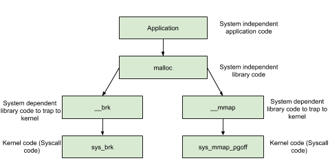

# Syscalls used by malloc(翻译)

[原文链接](https://sploitfun.wordpress.com/2015/02/11/syscalls-used-by-malloc/)

> 本文翻译仅作自我理解所用，对内容有所删减和更改

阅读这篇文章，你应该知道 malloc 通过 syscalls 来从系统获得内存。如下图所示，通过 brk 和 mmap 系统调用来获得内存



## brk

brk 通过增加brk的值来从内核获得内存（non zero initialized）。
初始的时候，堆的起始指针（start_brk）和结束指针（brk）都指向同一个位置。

- 当ALSR关闭时，start_brk 和 brk 都指向 data/bss 段的结尾
- 当ALSR开启时，start_brk 和 brk 都指向 data/bss 段结尾之后的一个随机偏移处


上图为进程虚拟内存的布局，从图中可知，start_brk 指向heap段的开始而brk（program break）指向heap段的末尾

**示例：**

```c++
/* sbrk and brk example */
#include <stdio.h>
#include <unistd.h>
#include <sys/types.h>

int main()
{
        void *curr_brk, *tmp_brk = NULL;

        printf("Welcome to sbrk example:%d\n", getpid());

        /* sbrk(0) gives current program break location */
        tmp_brk = curr_brk = sbrk(0);
        printf("Program Break Location1:%p\n", curr_brk);
        getchar();

        /* brk(addr) increments/decrements program break location */
        brk(curr_brk+4096);

        curr_brk = sbrk(0);
        printf("Program break Location2:%p\n", curr_brk);
        getchar();

        brk(tmp_brk);

        curr_brk = sbrk(0);
        printf("Program Break Location3:%p\n", curr_brk);
        getchar();

        return 0;
}
```

**输出分析：**

**在brk增加之前** ：从输出可以看出没有heap段，

- start_brk = brk = end_data = 0x804b000.

```s
sploitfun@sploitfun-VirtualBox:~/ptmalloc.ppt/syscalls$ ./sbrk
Welcome to sbrk example:6141
Program Break Location1:0x804b000
...
sploitfun@sploitfun-VirtualBox:~/ptmalloc.ppt/syscalls$ cat /proc/6141/maps
...
0804a000-0804b000 rw-p 00001000 08:01 539624     /home/sploitfun/ptmalloc.ppt/syscalls/sbrk
b7e21000-b7e22000 rw-p 00000000 00:00 0
...
sploitfun@sploitfun-VirtualBox:~/ptmalloc.ppt/syscalls$
```

**brk增加之后** ：从输出可以看出heap段出现，

- start_brk = end_data = 0x804b000
- brk = 0x804c000

```s
sploitfun@sploitfun-VirtualBox:~/ptmalloc.ppt/syscalls$ ./sbrk
Welcome to sbrk example:6141
Program Break Location1:0x804b000
Program Break Location2:0x804c000
...
sploitfun@sploitfun-VirtualBox:~/ptmalloc.ppt/syscalls$ cat /proc/6141/maps
...
0804a000-0804b000 rw-p 00001000 08:01 539624     /home/sploitfun/ptmalloc.ppt/syscalls/sbrk
0804b000-0804c000 rw-p 00000000 00:00 0          [heap]
b7e21000-b7e22000 rw-p 00000000 00:00 0
...
sploitfun@sploitfun-VirtualBox:~/ptmalloc.ppt/syscalls$
```

其中，

- 0804b000-0804c000 是heap段的虚拟地址范围
- rw-p 是标志（读，写，执行，私有）
- 00000000 是文件偏移（因为没有从任何文件映射，所以这里为0）
- 00:00 是 Major/Minor 设备号（因为没有从任何文件映射，所以这里为0）
- 0 是索引号（因为没有从任何文件映射，所以这里为0）
- `[heap]` 表示是heap段

## mmap

malloc使用 mmap 来创建一个私有的匿名映射段。这个私有的匿名映射段的主要目的是分配一个新的内存（零填充）并且这个新的内存只能被调用进程所使用

**示例:**

```c++
/* Private anonymous mapping example using mmap syscall */
#include <stdio.h>
#include <sys/mman.h>
#include <sys/types.h>
#include <sys/stat.h>
#include <fcntl.h>
#include <unistd.h>
#include <stdlib.h>

void static inline errExit(const char* msg)
{
        printf("%s failed. Exiting the process\n", msg);
        exit(-1);
}

int main()
{
        int ret = -1;
        printf("Welcome to private anonymous mapping example::PID:%d\n", getpid());
        printf("Before mmap\n");
        getchar();
        char* addr = NULL;
        addr = mmap(NULL, (size_t)132*1024, PROT_READ|PROT_WRITE, MAP_PRIVATE | MAP_ANONYMOUS, -1, 0);
        if (addr == MAP_FAILED)
                errExit("mmap");
        printf("After mmap\n");
        getchar();

        /* Unmap mapped region. */
        ret = munmap(addr, (size_t)132*1024);
        if(ret == -1)
                errExit("munmap");
        printf("After munmap\n");
        getchar();
        return 0;
}
```

**输出分析：**

**mmap之前：** 从下面的输出可以看到只有从共享库 libc.so 和 ld-linux.so的映射段

```s
sploitfun@sploitfun-VirtualBox:~/ptmalloc.ppt/syscalls$ cat /proc/6067/maps
08048000-08049000 r-xp 00000000 08:01 539691     /home/sploitfun/ptmalloc.ppt/syscalls/mmap
08049000-0804a000 r--p 00000000 08:01 539691     /home/sploitfun/ptmalloc.ppt/syscalls/mmap
0804a000-0804b000 rw-p 00001000 08:01 539691     /home/sploitfun/ptmalloc.ppt/syscalls/mmap
b7e21000-b7e22000 rw-p 00000000 00:00 0
...
sploitfun@sploitfun-VirtualBox:~/ptmalloc.ppt/syscalls$
```

**mmap之后：** 从下面的输出可以看到我们的内存映射段（b7e00000 – b7e21000 大小为132kb）和已经存在的内存映射段（b7e21000 – b7e22000）合并了
其中，

- b7e00000-b7e22000 是这个段的虚拟地址范围
- rw-p 是标志（读，写，执行，私有）
- 00000000 是文件偏移（因为没有从任何文件映射，所以这里为0）
- 00:00 是 Major/Minor 设备号（因为没有从任何文件映射，所以这里为0）
- 0 是索引号（因为没有从任何文件映射，所以这里为0）

**munmap之后：** 从下面的输出中可以看到我们的内存映射段已经从相应的内存中释放给操作系统了

```s
sploitfun@sploitfun-VirtualBox:~/ptmalloc.ppt/syscalls$ cat /proc/6067/maps
08048000-08049000 r-xp 00000000 08:01 539691     /home/sploitfun/ptmalloc.ppt/syscalls/mmap
08049000-0804a000 r--p 00000000 08:01 539691     /home/sploitfun/ptmalloc.ppt/syscalls/mmap
0804a000-0804b000 rw-p 00001000 08:01 539691     /home/sploitfun/ptmalloc.ppt/syscalls/mmap
b7e21000-b7e22000 rw-p 00000000 00:00 0
...
sploitfun@sploitfun-VirtualBox:~/ptmalloc.ppt/syscalls$
```

> 注意：在我们的例程中是关闭ALSR的
