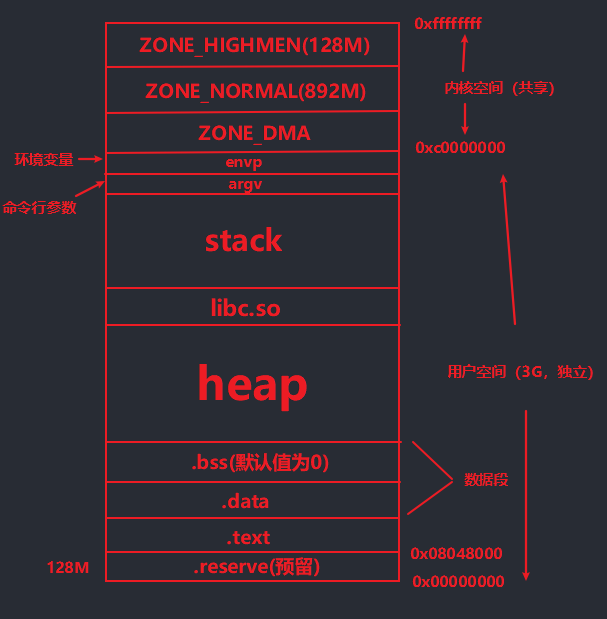
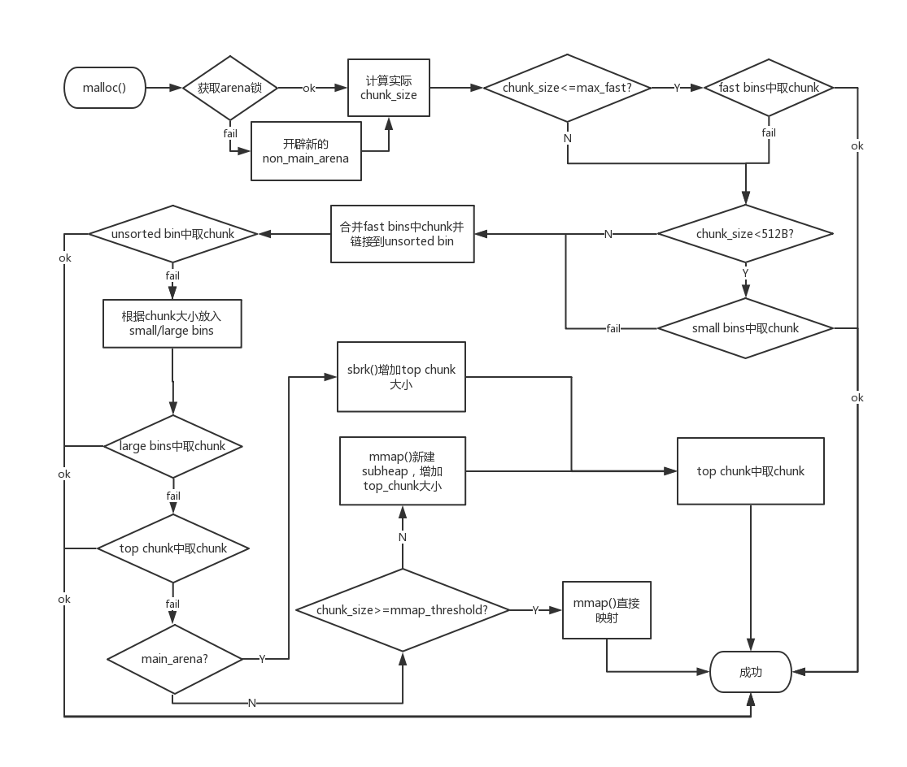
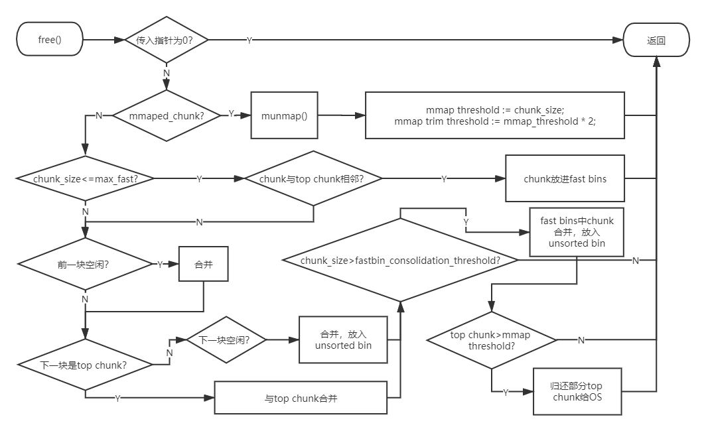

# 堆简要

## 概述

堆不同于栈，堆是动态分配的（由操作系统内核或者堆管理器），只有在程序中需要时才会分配。在 CTF 的 pwn 程序中，栈是程序加载进内存后就会出现，而堆是由 malloc、alloc、realloc 函数分配内存后才会出现。

> 堆的生长方向是从低地址向高地址生长的，而栈是从高地址向低地址生长的

实际上堆可以申请到的内存空间比栈要大很多，在 linux 的 4G 的虚拟内存空间里最高可以达到 2.9 G 的空间。
对堆操作的 是由堆管理器（ptmalloc2）来实现的，而不是操作系统内核 。因为程序每次申请或者释放堆时都需要进行系统调用，系统调用的开销巨大，当频繁进行堆操作时，就会严重影响程序的性能。

## glibc库下的 ptmalloc2 堆管理器

### 堆的基本结构

1. pre size 字段。**只有在前面一个堆块空闲的时候才有值**，用来指示前面一个堆块的大小。前面一个堆块在使用时，pre size的值始终为0
2. size 字段。用来指示当前堆块的大小（头部加上user data的大小）。这个字段的低三位的作用：
    - NON_MAIN_ARENA     这个堆块是否位于主线程
    - IS_MAPPED          记录当前 chunk 是否是由 mmap 分配的
    - PREV_INUSE         记录前一个 chunk 块是否被分配
PREV_INUSE 用来记录前一个 chunk 块是否被分配，被分配的话这个字段的值为 1 ，所以经常会在已分配的堆块中的 size 字段中发现值比原来大 1 个字节（表示前一个chunk已被分配）

### 64位程序

malloc(8)

申请到的堆块总大小为 16 + 8 + (8 + 1) = 0x21

1. 第一个 16 字节是系统最小分配的内存 ，即如果申请的内存小于系统最小分配的内存的话，就会按照最小的内存来分配。（在 64 位系统中这个值是 16 个字节，在 32 位系统中是 8 个字节，比如 malloc(0) 会分配16字节或8字节的内存）

2. 第二个 8 字节是 pre size 字段的大小（32 位的为 4 字节）

3. 第三个 8 字节为 size 字段的大小（32 位的为 4 字节）

4. 最后一个 1, 表示前一个chunk在使用,所以size字段最低位变为1, 导致size的值加一

内存分配：

内存回收：

