# Python-Part0

## 打印命令

print（），括号内可输入任意引号或者双引号围起来的字符

## 基本数据类型

### 四种基本数据类型

1、整数 Integer：1，2，3
2、浮点数 Float：1.0，2.0，3.0
3、字符串 String：‘123’/“123”，python中单引号和双引号都表示字符串，两者并没有明显差异
4、逻辑变量 Bool：True/False， python中逻辑变量给出了Ture和False两个关键字，并不像C/C++中以数字0，1表示真假

### 查看数据类型（type）

大多数编译器对语言中的关键字都会以不同的颜色进行区分，python也不例外，可以通过这一特点核查输入的关键字是否有拼写错误以及大小写错误（python对大小写敏感）

### 变量命名规则

1、变量的名字以字母或下划线‘_’开头；（私有变量一般是以下划线开头）
2、变量名第一个字符之后的部分可以是字母、数字以及下划线组成；
3、变量名对大小写敏感；
4、双引号和单引号不同之处：

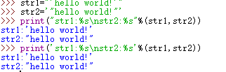
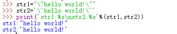

5、变量名不能和关键字相同

### 变量赋值

1、单个变量赋值

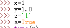

2、同时给多个变量赋值（等号两边长度要一致，即变量数和值的数量要相等）
1）普通情况

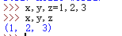

2）列表

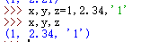
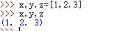

3）字符串（长度要相等）

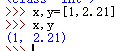

### 对变量的操作

1、>（大于）、<（小于）、<=（小于等于）、>=（大于等于）、==（等于）、!=（不等于）
2、比较后返回的是逻辑值，即True/False；
3、使用任何变量都需要先赋值，再使用（这点区别于C/C++）

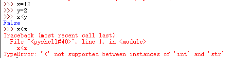

4、类型转换
class（var），字符（除数字外）不能通过此方式转化为整数或浮点数

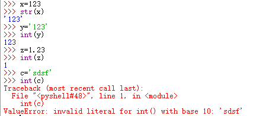

### 简单文件操作（支持多种文件格式不限于txt和csv）

1、读文件
Var=open(‘address filename’,‘r’)#'r' 表示读（read），这里单引号双引号都可以

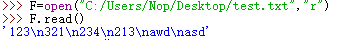

read（）一次性读取所有内容

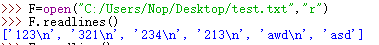

readlines（）按行读取所有内容

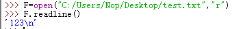

readline（）读取第一行

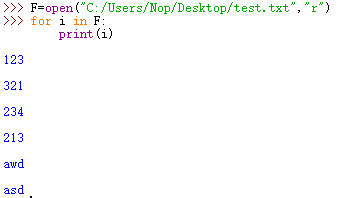

通过for循环的反方式读取文件

> python除了可以打开txt类型的文本还可以打开csv类型的文档

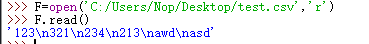

2、写入文件
var=open（’address filename‘，‘w'）#w表示写（write）

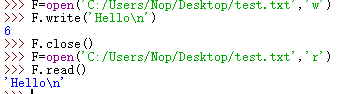

写操作结束后需要关闭文件，即close()
其中，\n表示换行，如果路径中没有对应的文件，则先会新建一个文件再进行写的操作，若存在对应文件，则写操作会覆盖原有内容
3、追加内容
Var=open(‘address filename’,‘a’)#a表示追加（add）

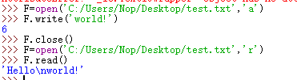

### 变量的基本运算

1、数学运算
加、减、乘、除（+、-、*、/）
对已赋值的变量进行操作：

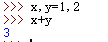

2、字符串运算
字符串可叠加，因此支持加法和乘法运算（实际上是将字符串重复对应的次数）

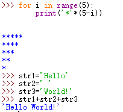

3、复合赋值（+=、-=、*=、/=）

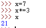

4、乘方运算
**或pow（）

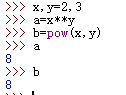

5、数学函数
pow（）、round（）、int（）、abs（）
1）round（）：
四舍六入五成双，即（百度百科）

- 被修约的数字小于5时，该数字舍去；
- 被修约的数字大于5时，则进位；
- 被修约的数字等于5时，要看5前面的数字，若是奇数则进位，若是偶数则将5舍掉，即修约后末尾数字都成为偶数；若5的后面还有不为“0”的任何数，则此时无论5的前面是奇数还是偶数，均应进位。

注：有时会出现预期之外的结果，这是因为小数部分在转化位二进制数时存在误差，也即是说内存的的数和输入的数不一定完全相等

第一个参数表示要约的数，第二个参数表示保留小数的位数
2）int（）：
只取整数部分，直接将小数部分掐掉，也即类型转换

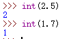

3）abs（）：
取绝对值

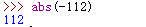

Part2 内置的 Math package
1、e和PI

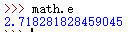
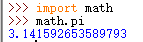

2、log（）取某个数的自然对数（以e为底）

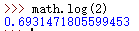

A.以10为底时

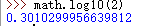

B.以其他数为底时（普适情况），两个参数，第二个参数是底

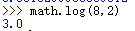

3、exp（n）求e的n次方

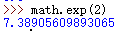

4、sqrt（）开方

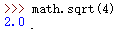

5、三角函数（sin、cos、tan）

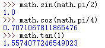

[math包含的所有函数](https://docs.python.org/2/library/math.html)
Part3  Print（）函数
1、参数表做运算

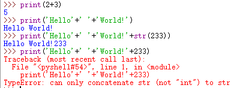

变量类型不同时，需要做类型转换变成相同的类型
2、打印多种类型变量
%d、%s等
%d、%s分别表示对应位置会出现数字、字符串，小数则是%f（float），%.nf表示n位小数

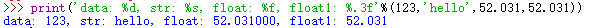

注意：原始数据是数字或小数是%s也可正确输出

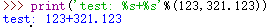

Part4 转义字符
1、\（反斜杠），转义字符将\之后具有特殊意义的字符无效化

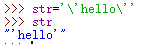

2、\n换行

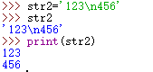

3、\t tab（相当于四个空格）

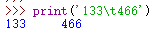

4、print()函数的默认值
Pinrt(,end=' ')

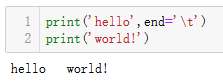

### pandas读取文件
1、导入并给别名
Import pandas as pd
2、读取csv文件
Var=pd.read_csv('address/filename',index_col=0)#pandas在输出时会自动加上一列序号索引，如果要取消，就使用index_col=0来指定序号列
3、读取excel文件
Var=pd.raed_excel('address/filename')
4、读取txt
Var=pd.read_table('address/filename',sep=',',index_col=0)#sep=','表示sep代替“，”，进而把txt输出为表格形式
5、写文件
Var.t0_csv('data.csv')
Var.to_excel('data.excel')
Var.to_csv('data.txt')#这里txt的写入方式特殊一点
6、阅读复杂格式的txt技巧
设置分隔符：sep=‘ ’
跳过哪几行：skiprows =[]
不要默认第一行是名字：header=None
设置首行：names=[' ',' ']
指定索引列：index_col=[' ']
一共输出多少行：nrows=

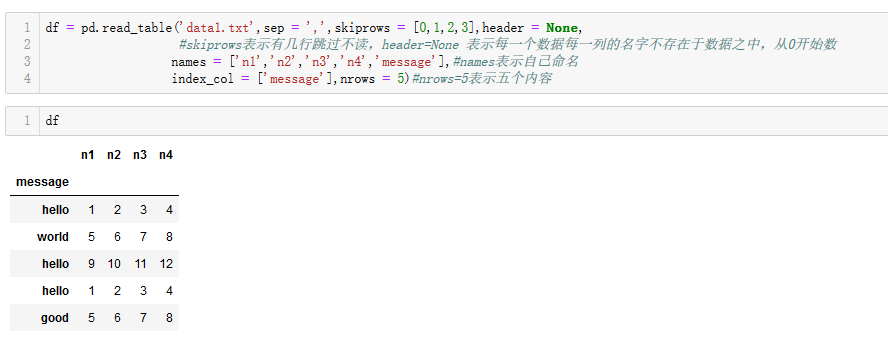

### pyhton中较为复杂的变量类型

Part 1  pyhton中较为复杂的变量类型

1、列表 List
[1，2，3]，实质为将一些不同的变量放在同一数据结构中以便于对这些变量的查找和使用，和c/c++中的数组有点类似，但不同的是数组中的元素只能是同一类型的变量。

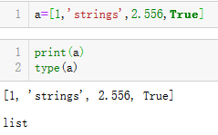

2、 元组 Tuple
（1，2，3）和列表很相似，不同之处在于元组的元素一旦定义就不可更改，但可以向元组中添加元素

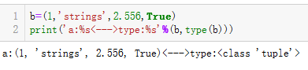

3、字典 Dictionary
{’name‘：’zahngsan‘，’number‘：112}，以键值对的形式包含在花括号中，其中，建（key）与键值（value）间以分号（：）隔开，不同键值对用逗号（，）隔开。需要注意的是，键的值是不变的，不能更改，一般是str和int类型，而键值可以是任意类型的变量。

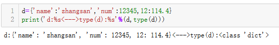

4、集合 set
和字典一样，元素用花括号括起来，不同的是集合没有键值对，且集合的元素都是两两互不相同的，这一点和数学中得集合是一样的

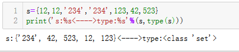

Part2 常用用法

1、List
1）空链表 L=[]

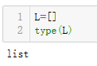

2）函数len（），用于求列表长度（该列表有多少个元素）

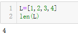

3）索引
与c/c++的数组下标类似，从第一位标号为0

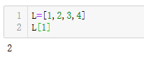

4）修改元素
通过索引定位后直接赋值即可

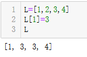

5）切片
原则，左闭右开，即取左不取又
A[:]，冒号左边为起始位置，右边为终止位置，默认分别为0和列表末尾，数字为负数时，-1表示最后一位

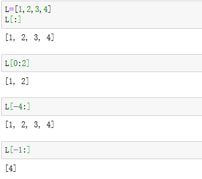

6)插入元素
insert（a，b），括号中的参数a为插入元素的位置，b为插入的值

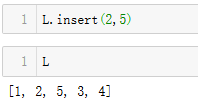

7）搜索
In 可判断某个元素是否在列表中

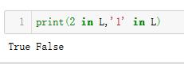

8）排序
L.sort（）或sorted（L）
a、区别：L.sort（）不会新建列表，而是更改原有列表，相反的，sorted（L）不会更改原有列表，返回一个新建的列表

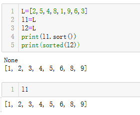

b、共同之处在于默认情况下两者都是对列表进行升序排序，对于降序排序可以以给sort的一个默认参数reverse赋值为True

9）添加元素
append（）和extend（）
两者都是向列表中添加元素素，但append会将参数视为一个元素田间致列表，而extend则将参数分片后添加到列表，他的参数是一个序列

除此之外，两个列表还可以相加得到一个新列表

10)计数
count（）可以得知列表中某个元素出现了多少次

11)删减元素
Del L[i]

2、Tuple
1）空元组 T=（）

2）与列表相同的方法
len（）、索引、切片、搜索
3）添加元素
这里append（）和extend（）并不适用

元组中添加元素可以用+=

不过需要注意的是，只有一个元素时，需要在该元素之后加一个逗号，此处操作相当于将两个元组合并为一个元组，而元组中只有一个元素时需要在该元素后添加一个逗号

4）排序，修改
因为元组中元素是不可更改的，所以不能对元组进行排序以及修改（包括删减）操作，但可以使用sorted（）新建一个列表的形式来对元组排序

3、Dictionary
1）空字典  D={}

2）索引
通过键来查找键值

3）len（）
字典中len（）是查看字典键值对的数目

4）修改元素
字典的键一旦定义就不能更改，但键值可以随意更改

5）添加元素
和修改元素类似，在提供的键并不在字典中时，就会新建对应得键值对

6）查看所有键/键值
查看所有键：D.Keys（）
查看所有键值： D.values（）
查看每一对键值： D.items（）

7）删减元素
Del D['key']

4、Set
1）空集合 S=set（），因为字典也是花括号，所以空集合需要申明，在集合中添加元素也可以S=set（[1，2，3]）

2）搜索
判断集合中是否存在元素a：a in S，这一点同列表一样
Part 3 嵌套
不同类型的变量中可以包含多个相同类型的变量也可包含多个不同类型的变量，即列表里面可以有列表、元组、字典、集合；元组、字典也是如此，需要注意的是集合不能嵌套使用，字典的键值可以是任意类型，访问时也是嵌套访问

列表、元组还可以多层嵌套，类似于c/c++中的多维数组

