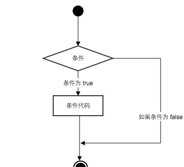
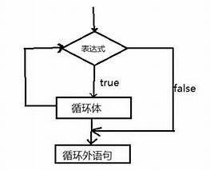
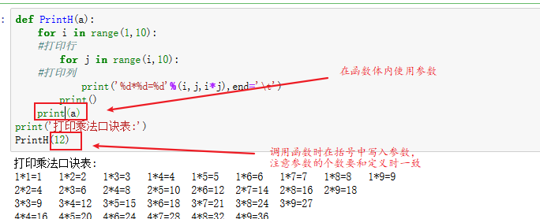
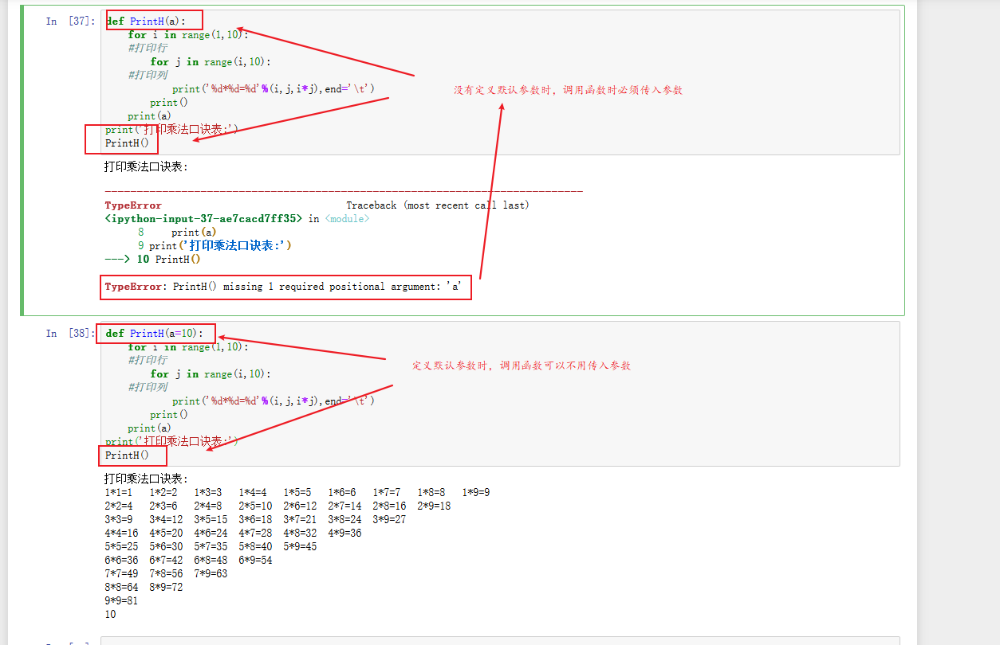
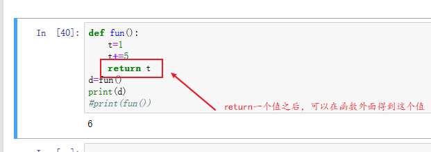
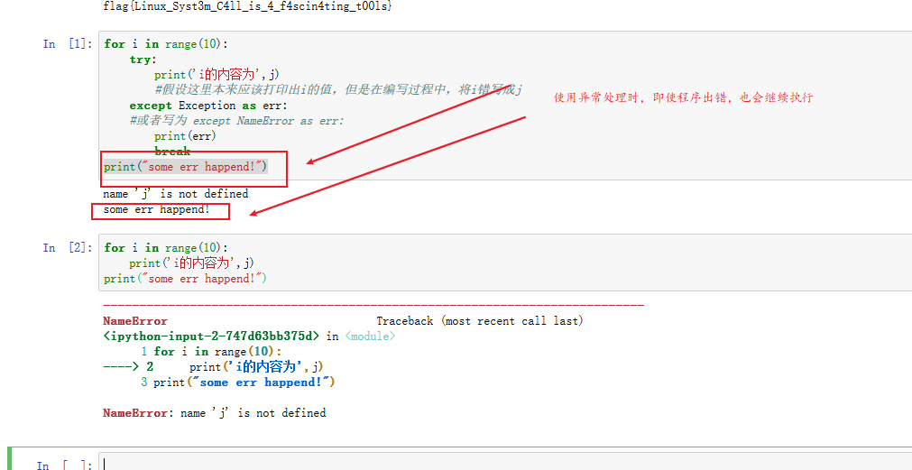

# Python-part2

## 条件控制结构



```python
    if(False):
    # 或者if(True)、if True
        print('hello')
    print('world')

    # if-else
    if(True):
        pass
    else:
        pass

    s=input('input something')
    if(s=='a'):
        print('123')
    else:
        print('456')

    #if-elif-else
    if(s=='a'):
        print('a=a')
    elif(s=='b'):
        print('a=b')
    elif(s=='c')
        print('a=c')
    else:
        print('a=d')
```

## 循环控制结构

### while循环



#### while

```python
    while True:
    #while(True):
        pass
    pass #循环体外的语句

    count=5
    while count:
        print("第%d次循环"%count)
        count-=1 #等价于count=count-1
```

>比较运算符：‘==’表示判断是否等于、‘>=’判断是否大于等于、'<='、'<'、'>'

#### while-else

```python
    count=5
    while count:
        print("第%d次循环"%count)
        count-=1
    else:
        print("count小于等于零%d"%count)

```

### for循环

#### for

```python
    l=[1,2,3,4,5,6,7]
    for i in l:
        print(i)
        #i和l都是自己定义的，for和in属于关键字
```

#### for-else

### range()方法

```python
    range(a1,a2,a3)
    #第一个参数a1表示生成列表的第一个元素的值，a2表示最后一个元素但不包括本身，a3表示步长（默认为1
    for i in range(1,10)：
        #生成1-9的列表
        print(i,end='\t')
    for i in range(10):
        #生成0-9的列表
        print(i,end='\t\)
    for i in range(0,10,2):
        #生成一个偶数列表
        print(i,end='\t')
    for i in range(10,0,-1):
        #生成10-1的倒序序列
        print(i,end='\t')
```

### break、continue和pass

```python
    break#表示跳出当前循环，不在执行循环体的内容即使判断条件为真
    continue#和break相似，都是跳出当前循环，但是continue他还会执行循环体的内容，只是跳出当前循环循环体内continue语句之后的代码
    pass#就是占位符，实际并没有什么作用，仅用来表示这部分属于某个作用域，连续缩进相同的代码块就属于同一个作用域
    for i in [0,2,4,5,6,8]:
        if i%2==0:
            #输出偶数
            print('这是一个偶数%d'%i)
            continue
            print('我是continue之后的语句')
        else:
            print('这是一个奇数%d,循环结束'%i)
            break
            print('我是break之后的语句')
    print('for循环结束')
```

>打印输出乘法口诀表

```python
    for i in range(1,10):
    #打印行
        for j in range(i,10):
        #打印列
            print('%d*%d=%d'%(i,j,i*j),end='\t')
        print()
```

## 函数

### 定义

函数起始就是对一部分代码的打包，讲实现某个特定功能的代码包装在一起，方便重复使用

```python
    def function_name():
        pass
        #函数体
    #def表示define，定义声明
    #调用函数，即使用这个函数
    function_name()

def PrintH():
for i in range(1,10):
#打印行
    for j in range(i,10):
#打印列
        print('%d*%d=%d'%(i,j,i*j),end='\t')
    print()
print('打印乘法口诀表:')
PrintH()
```

### 传参

```python
    def fun(a1,a2,...):
        pass
    #a1,a2,a3...可以是任意类型的参数，列表，字典，整型等等都可以，因为这些参数是在函数体内使用的，所以在调用函数时，传入的参数类型应当与函数体内使用的参数类型相符
```



>默认参数，在定义函数时参数列表可以直接对某个参数赋值，之后再调用这个函数的时候，就可以不用为这个参数传值



### return

```python
    def fun():
        t=1
        t+=5
        return t
    d=fun()
    print(fun())
```



### 局部变量和全局变量

>1、局部变量就是函数体或者循环体中定义的变量
>2、全局变量就是在函数、循环之外定义的变量
>3、两者的区别：全局变量在所有位置都能使用，但局部变量只能在函数体或循环体内使用

```python
    i=5
    def test():
        y=6
        print(i)
        print(y)
    test()
    print(i)
    print(y)
```


## 异常处理

```python
    try:
        pass
    except Exception as err:
        print(err)
        pass

    #其中，try、pass、except、as、Exception都属于关键字。
    #执行这部分代码时，首先执行try的代码，如果try这部分代码有错，就会执行except的代码，打印输出try部分的错误
    #需要注意的是，使用try-except并不会因为程序错误而终止程序，即使发生错误，它还是会继续执行
for i in range(10):
    try：
        print('i的内容为%d'%j)
        #假设这里本来应该打印出i的值，但是在编写过程中，将i错写成j
    except Exception as err:
    #或者写为 except NameError as err:
        print(err)
        break
print("some err happend!")
```



## 类与对象

>将多个函数、变量封装起来，以便下次使用的时候直接调用

```python
    class name:
        def fun1(self):
            print('调用fun2')
            self.fun2(5)
        def fun2(self,a1):
            print(a1)
        def __init__(self):
            print("这是类的构造函数")
    #类中的函数需要一个self参数，在函数中使用传入的参数或者类中的局部变量和其他函数时，需要利用self来调用
    #对于类的实例化，
    n=name()
    #表示将name类进行实例化，后续使用类name的函数时，直接使用n来调用
    n.fun1()
    #关于类的构造函数，规定命名为__init__()，其中，init表示初始化的意思,即使没有调用这个函数，在实例化对象时，他会自动调用
    #下面的语句表示程序一运行就执行name（）即实例化类
    if __name__ == "__main__":
        name()
```
