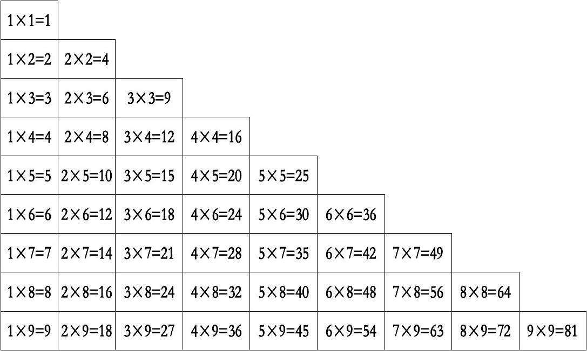

# Python-part3

## 循环打印乘法口诀表



```python
    # 打印第一行
    print('1*1=',1*1)
    # 打印第二行
    print('1*2=',1*2,'2*2=',2*2)
    # 打印第三行
    print('1*3=',1*3,'2*3=',2*3,'3*3=',3*3)
    #打印第i行
    i = 9
    for t in range(1,i):
        print("%d*%d=%d"%(t,i,t*i),end='\t')
    # 打印整个乘法口诀表
    for i in range(1,10):
        for j in range(1,i):
            print("%d*%d=%d"%(j,i,j*i),end='\t')
        print()
    # 倒序打印
    # 利用while循环打印
```

## 模拟登录注册界面

### 分析功能

- 输入用户名和密码
  - 判断输入是否为空
  - 判断是否输入密码和用户名
- 连接数据库进行对应的操作
  - 密码不能明文传输，需提前对密码进行加密操作，一般采用MD5做摘要
  - 登录按钮执行查询配对工作
  - 注册按钮执行数据插入工作
    - 插入数据前需匹对用户名是否已存在
- 返回操作结果
  - 登录结果
    - 用户名和密码匹配成功，弹出登录成功提示框
    - 用户名和密码匹配失败，弹出登录失败提示框
  - 注册结果
    - 用户名已存在，注册失败
    - 注册成功

### 利用tkinter编写页面

[官方中文手册](https://docs.python.org/zh-cn/3/library/tk.html)
[菜鸟教程](https://www.runoob.com/python/python-gui-tkinter.html)

```python
    # 所需库的导入
    import tkinter as tk
    import tkinter.messagebox as msg
```

#### 主窗口

```python
    win = tk.Tk()
    win.title('LogIn')
    win.geometry('400x200')
    pass
    # 显示窗口
    win.mainloop()
```

#### 输入框

```python
    # 输入
    s = tk.Label(win, text='用户名:', font=('Arial', 8))
    s.place(relx=0.1, rely=0.4, anchor='w')
    s = tk.Label(win, text='密码:', font=('Arial', 8))
    s.place(relx=0.1, rely=0.5, anchor='w')

    # 输入框
    e1 = tk.Entry(win, width=35)
    e1.place(relx=0.22, rely=0.4, anchor='w')
    e2 = tk.Entry(win, width=35, show='*')
    e2.place(relx=0.22, rely=0.5, anchor='w')
```

#### 按钮及按钮事件

```python
 # 按钮
    b1 = tk.Button(win, text='SignIn', width=6, command=SigIn)
    b2 = tk.Button(win, text='SignUp', width=6, command=SignUp)
    b3 = tk.Button(win, text='Exit', width=6, command=win.quit)
# 按钮位置
    b1.place(relx=0.42, rely=0.65, anchor='w')
    b2.place(relx=0.56, rely=0.65, anchor='w')
    b3.place(relx=0.70, rely=0.65, anchor='w')

    # 按钮事件和按钮须在同一作用域
    # 登录传参函数，向数据库连接函数传参
    def SigIn():
        if str(e2.get()) == '' and str(e1.get()) == '':
            pass
        elif str(e2.get()) == '':
            pass
        elif str(e1.get()) == '':
            pass
        else:
            pass

    # 注册传参，向数据库连接函数传参
    def SignUp():
        if str(e2.get()) == '' and str(e1.get()) == '':
            pass
        elif str(e2.get()) == '':
            pass
        elif str(e1.get()) == '':
            pass
        else:
            pass

```

#### 相关提示信息

``` python  
  # 提示登录成功
  msg.showinfo('提示', '登录成功')

  # 提示密码错误
  msg.askretrycancel('提示', '用户名或密码错误！')

  # 提示注册成功
  msg.showinfo("提示", "恭喜你，注册成功")

  # 提示注册失败，用户名已存在
  msg.askquestion("注册失败", "用户名已存在，请登录")

  # 提示输入密码
  msg.showwarning("Warning", "请输入密码")

  # 提示输入用户名
  msg.showwarning("Warning", "请输入用户名")

  # 不输入用户名和密码时点击注册或登录时的提示
  msg.showerror("Erro", "操作错误")
```

### MySQL相关操作

- MySQL查询和创建命令

```mysql
    show databases;

    use database_name;

    select * from table_name;

    select * from table_name where col1 = xxx and col2 = xx or col3 >xx;

    insert into table_name(col1,col2,...) values(val1,val2,...);
```

- 使用python连接数据库
  - 连接数据库

    ```python
        import mysql.connector
        mydb = mysql.connector.connect(
        host="localhost",       # 数据库主机地址
        user="username",    # 数据库用户名
        buffered=True,      #解决查询报错：“unread result found”的问题
        passwd="password"   # 数据库密码
        )
        print(mydb)
    ```

  - 查询操作

    ```python
      mycursor = mydb.cursor()

      sql = "SELECT * FROM t_table WHERE name =%s"
      na = ('Tom',)
      mycursor.execute(sql, na)

      myresult = mycursor.fetchall()
      for x in myresult:
        print(x)
    ```

  - 插入操作
  
    ```python
    #单条记录插入
      mycursor = mydb.cursor()

      usrname = "Tom"
      password = "123"

      sql = "INSERT INTO t_table (usr, pwd) VALUES (%s, %s)"
      val = (usrname,password)
      mycursor.execute(sql, val)

      mydb.commit()    # 数据表内容有更新，必须使用到该语句

      print(mycursor.rowcount, "记录插入成功。")
    ```

- 使用python创建一个测试的数据库
  
    ```python
      #!usr/bin/python
      # coding=utf-8


      import mysql.connector
      import hashlib

      try:
          mydb = mysql.connector.connect(
            host="192.168.218.139",
            user="root",
            passwd="root10",
            buffered=True,
            database="test_admin"
          )
          mycursor = mydb.cursor()
          mycursor.execute("use test_admin")
      except Exception as err:
          print(err)
          mydb = mysql.connector.connect(
            host="192.168.218.139",
            user="root",
            buffered=True,
            passwd="root10"
          )
          mycursor = mydb.cursor()
          mycursor.execute("CREATE DATABASE test_admin")
          mycursor.execute("use test_admin")
          # 创建测数据表
          mycursor.execute("CREATE TABLE admin(user VARCHAR(255), \
          passwd VARCHAR(255))")
          # 主键设置
          mycursor.execute(
            "ALTER TABLE admin ADD COLUMN id INT AUTO_INCREMENT PRIMARY KEY")

      # 插入记录
      sql = "INSERT INTO admin (user, passwd) VALUES (%s, %s)"
      val = [
        ('Tom', hashlib.md5('123'.encode("utf-8")).hexdigest()),
        ('Tony', hashlib.md5('123'.encode("utf-8")).hexdigest()),
        ('Jenifer', hashlib.md5('123'.encode("utf-8")).hexdigest()),
        ('Jon', hashlib.md5('123'.encode("utf-8")).hexdigest())]
      # 实际情况下用户密码是以md5的形式存储在数据库中的
      # 执行SQL语句
      mycursor.executemany(sql, val)

      # 提交修改
      mydb.commit()

    ```

### 密码加密

>Hash，一般翻译做散列、杂凑，或音译为哈希，是把任意长度的输入（又叫做预映射pre-image）通过散列算法变换成固定长度的输出，该输出就是散列值。这种转换是一种压缩映射，也就是，散列值的空间通常远小于输入的空间，不同的输入可能会散列成相同的输出，所以不可能从散列值来确定唯一的输入值。简单的说就是一种将任意长度的消息压缩到某一固定长度的消息摘要的函数。
>Python中通过调用hashlib可以简单实现对信息的摘要:

```python
    import hashlib
    plaintext = 'test str'
    cipher = hashlib.md5(plaintext.encode("utf-8"))
    cipher_hex = cipher.hexdigest()
```

### 登录

>函数功能为：接收按钮事件发送过来的数据，然后通过接收的数据和数据库中储存的数据比对，返回相应的结果

```python
    # 登录函数
    def check(usr, pwd):
        mydb = mysql.connector.connect(
            host="192.168.218.139",
            user="root",
            passwd="root10",
            buffered=True,
            database="test_admin"
            )

        mycursor = mydb.cursor()
        mycursor.execute("use test_admin")

        sql = "SELECT * FROM admin WHERE user =%s and passwd = %s"
        na = (usr, pwd)
        mycursor.execute(sql, na)

        result = mycursor.fetchall()
        t = True
        try:
            t = result[0][2]
        except Exception:
            t = False
        if(t):
            pass
        else:
            pass
```

### 注册

>函数功能为： 接按钮事件发送过来的数据，然后先和数据库中已存在的内容比对，再向数据库中插入新的记录

```python
     def regist(self, usr, pwd):
        mydb = mysql.connector.connect(
            host="192.168.218.139",
            user="root",
            passwd="root10",
            buffered=True,
            database="test_admin"
            )
        mycursor = mydb.cursor()
        mycursor.execute("use test_admin")

        sql = "SELECT * FROM admin WHERE user =%s"
        na = (usr,)
        mycursor.execute(sql, na)

        result = mycursor.fetchall()
        t = True
        try:
            t = result[0][2]
        except Exception:
            t = False
        if(t):
            self.MB4()
        else:
            sql = "INSERT INTO admin (user, passwd) VALUES (%s, %s)"
            val = (usr, pwd)
            # 执行SQL语句
            mycursor.execute(sql, val)
            # 提交修改
            mydb.commit()
            # print(mycursor.rowcount)
            pass
```

## 用类封装

```python
#!usr/bin/python
# coding=utf-8


import tkinter as tk
import tkinter.messagebox as msg
import mysql.connector
import hashlib


class UI:
    # 计算hash值
    def Hash(self, pwd):
        s = hashlib.md5(pwd.encode("utf-8"))
        h = s.hexdigest()
        return h

    # 提示登录成功
    def MB1(self):
        msg.showinfo('提示', '登录成功')

    # 提示密码错误
    def MB2(self):
        msg.askretrycancel('提示', '用户名或密码错误！')

    # 提示注册成功
    def MB3(self):
        msg.showinfo("提示", "恭喜你，注册成功")

    # 提示注册失败，用户名已存在
    def MB4(self):
        msg.askquestion("注册失败", "用户名已存在，请登录")

    # 提示输入密码
    def MB5(self):
        msg.showwarning("Warning", "请输入密码")

    # 提示输入用户名
    def MB6(self):
        msg.showwarning("Warning", "请输入用户名")

    # 不输入用户名和密码时点击注册或登录时的提示
    def MB7(self):
        msg.showerror("Erro", "操作错误")

    # 登录函数
    def check(self, usr, pwd):
        mydb = mysql.connector.connect(
            host="192.168.218.139",
            user="root",
            passwd="root10",
            buffered=True,
            database="test_admin"
            )
        mycursor = mydb.cursor()
        mycursor.execute("use test_admin")
        sql = "SELECT * FROM admin WHERE user =%s and passwd = %s"
        na = (usr, pwd)
        mycursor.execute(sql, na)
        result = mycursor.fetchall()
        t = True
        try:
            t = result[0][2]
        except Exception:
            t = False
        if(t):
            self.MB1()
        else:
            self.MB2()

    # 注册函数
    def regist(self, usr, pwd):
        mydb = mysql.connector.connect(
            host="192.168.218.139",
            user="root",
            passwd="root10",
            buffered=True,
            database="test_admin"
            )
        mycursor = mydb.cursor()
        mycursor.execute("use test_admin")
        sql = "SELECT * FROM admin WHERE user =%s"
        na = (usr,)
        mycursor.execute(sql, na)
        result = mycursor.fetchall()
        t = True
        try:
            t = result[0][2]
        except Exception:
            t = False
        if(t):
            self.MB4()
        else:
            sql = "INSERT INTO admin (user, passwd) VALUES (%s, %s)"
            val = (usr, pwd)
            # 执行SQL语句
            mycursor.execute(sql, val)
            # 提交修改
            mydb.commit()
            # print(mycursor.rowcount)
            self.MB3()

    def main(self):
        win = tk.Tk()
        win.title('LogIn')
        win.geometry('400x200')

        # 输入
        s = tk.Label(win, text='用户名:', font=('Arial', 8))
        s.place(relx=0.1, rely=0.4, anchor='w')
        s = tk.Label(win, text='密码:', font=('Arial', 8))
        s.place(relx=0.1, rely=0.5, anchor='w')

        # 输入框
        e1 = tk.Entry(win, width=35)
        e1.place(relx=0.22, rely=0.4, anchor='w')
        e2 = tk.Entry(win, width=35, show='*')
        e2.place(relx=0.22, rely=0.5, anchor='w')

        # 登录传参函数，向数据库连接函数传参
        def SigIn():
            if str(e2.get()) == '' and str(e1.get()) == '':
                self.MB7()
            elif str(e2.get()) == '':
                self.MB5()
            elif str(e1.get()) == '':
                self.MB6()
            else:
                username = str(e1.get())
                password = self.Hash(str(e2.get()))
                self.check(username, password)

        # 注册传参，向数据库连接函数传参
        def SignUp():
            if str(e2.get()) == '' and str(e1.get()) == '':
                self.MB7()
            elif str(e2.get()) == '':
                self.MB5()
            elif str(e1.get()) == '':
                self.MB6()
            else:
                username = str(e1.get())
                password = self.Hash(str(e2.get()))
                self.check(username, password)

        # 按钮
        b1 = tk.Button(win, text='SignIn', width=6, command=SigIn)
        b2 = tk.Button(win, text='SignUp', width=6, command=SignUp)
        b3 = tk.Button(win, text='Exit', width=6, command=win.quit)

        b1.place(relx=0.42, rely=0.65, anchor='w')
        b2.place(relx=0.56, rely=0.65, anchor='w')
        b3.place(relx=0.70, rely=0.65, anchor='w')

        # 显示窗口
        win.mainloop()

    def __init__(self):
        self.main()


if __name__ == "__main__":
    UI()

```
